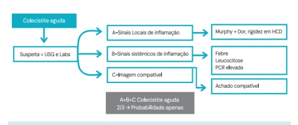
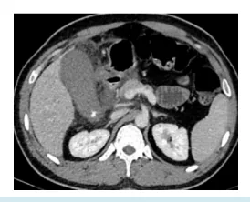

# Abdome Agudo Inflamatório - Colecistite

<!-- page:1 -->

## Colecistite

## COLECISTITE AGUDA = INFLAMAÇÃO AGUDA DA CLASSIFICAÇÃO E TRATAMENTO

## VESÍCULA BILIAR

- Leve: sem nenhum critério +;

## Quadro clínico

- Moderada:

- Dor abdominal em QSD por mais de 6 horas + | leucocitose > 18.000;

náuseas e vômitos + febre + defesa abdominal; | massa palpável;

- Sinal de Murphy +: | duração > 72 horas; Parada abrupta da inspiração à palpação | complicações locais.

profunda do ponto de Murphy (rebordo

- Grave: disfunção orgânica:

costal direito). | hipotensão;

- Aumento de provas inflamatórias, leucocitose. | IRA;

## IMAGEM | RNC

USG abdome superior | coagulopatia;

- Espessamento (> 4 mm); | IRPA.

- Edema de parede; O ideal é operar, sempre que possível.

- Murphy ultrassonográfico;

- Pacientes de alto risco, que respondem ao

- Cálculo impactado; tratamento → Tardia;

- Parede delaminada;

- Pacientes de alto risco, sem condições

- Edema e líquido perivesicular. cirúrgicas → Drenagem.

## DIAGNÓSTICO

- A – Sinais locais de inflamação;

- B – Sinais sistêmicos de inflamação;

- C – Imagem compatível.

1 de cada = confirmado!

## COLECISTITE AGUDA

- Aumento de provas inflamatórias e leucocitose;

- Suspeita de complicações:

FISIOPATOLOGIA | Dor intensa;

- Obstrução do ducto cístico = liberação de | Febre alta;

mediadores inflamatórios; | Associação com náuseas e vômitos;

- Estase da bile = edema > distensão > | Leucocitose > 15.000 cels/mm3;

inflamação > necrose; | Plastrão palpável.

- Proliferação bacteriana e infecção:

- Diferenciais: coledocolitíase, síndrome de Aeróbios: E. Coli, Klebsiella, Proteus, Faecalis; Mirizzi, colangite: Anaeróbios: estrepto, Clostridium, bacterioides. | Avaliar presença de icterícia, TGO, TGP, FA, GGT.

- Colecistite crônica calculosa = agudizações recorrentes com inflamação subaguda-crônica. DIAGNÓSTICO – CRITÉRIOS DE TOKYO

- Dor abdominal em HCD > 6 horas;

- Sinais de defesa abdominal;

- Sinal de Murphy +: Parada abrupta da inspiração quando realizada a palpação profunda no ponto de Murphy (rebordo costal direito); NÃO É SINÔNIMO DE DESCOMPRESSÃO Figura 1: Critérios de Tokyo para diagnóstico

BRUSCA POSITIVA. de colecistite aguda.

---

<!-- page:2 -->

## USG DE ABDOME SUPERIOR = MELHOR EXAME. TRATAMENTO

O ideal é operar, sempre que possível.

- Pacientes de alto risco, que respondem ao

- C

- - F

Figura 2: USG com colecistite aguda.

- Achados

- Espessamento (> 4 mm);

- Edema de parede; C

- Murphy ultrassonográfico;

- Cálculo impactado;

- Parede delaminada;

- Edema e líquido perivesicular.

TC de abdome

- Avaliar complicações e diferenciais.

- - Figura 3: Tomografia com colecistite aguda.

- DISIDA/colecistografia C

- Padrão-ouro (especialmente quando há dúvida em

- USG e TC);

- Pouquíssimo usado – Não é necessário;

- O exame é positivo quando não há enchimento da vesícula;

- Falso positivo: jejum prolongado; cirrose; NPT;

pancreatite. Usar colecistocinina para esvaziar vesícula; usar morfina para aumentar o tônus do esfíncter de Oddi e evitar esvaziamento rápido.

## CLASSIFICAÇÃO – CRITÉRIOS DE TOKYO

- Leve: sem nenhum critério positivo.

- Moderada: leucócitos > 18.000 células/mm3; massa palpável; duração > 72 horas; complicações locais.

- Grave: disfunção orgânica: hipotensão; F IRA; RNC; F coagulopatia; IRPA. F tratamento → Tardia.

- Pacientes de alto risco, sem condições cirúrgicas → Drenagem.

Conforme a classificação, decidir entre:

- Colecistectomia precoce;

- Colecistectomia tardia;

## Colecistostomia (drenagem)

Fatores para decisão

- ASA;

- Charlson comorbidity indexx;

- Resposta ao suporte inicial;

- Capacidade do pronto-socorro.

Colecistite aguda LEVE

- ASA < III/CCI < 6 (= paciente BOM). Padrão-ouro = colecistectomia por VLP;

- ASA > III/CCI > 6 (= paciente RUIM). ATB + terapia de suporte (jejum, analgesia, hidratação venosa) e cirurgia tardia: ATB pode ser suspenso após cirurgia; ATB: ceftriaxona + metronidazol; alternativa → meropenem, tazocin.

Colecistite aguda MODERADA

- Medidas iniciais: analgesia, ATB (cef+metro), jejum, hidratação;

- Resposta inicial boa: ASA < III/CCI < 6 (= paciente

BOM). Padrão-ouro = colecistectomia por VLP;

- ASA > III/CCI > 6 (= paciente RUIM). ATB e cirurgia tardia após melhora clínica;

- Resposta inicial ruim ou piora clínica: ATB +

DRENAR = COLECISTOSTOMIA. Colecistite aguda GRAVE

- Suporte INTENSIVO = UTI, jejum, hidratação, analgesia,

DVA, IOT;

- Paciente bom = colecistectomia (mesma lógica da moderada);

- Paciente ruim = drenagem.

- Controle de foco infeccioso = esvaziar a vesícula biliar inflamada;

- Métodos: colecistostomia percutânea; drenagem endoscópica; cirúrgica;

- Quanto mais grave o paciente (não tolera um procedimento cirúrgico), mais indicamos a drenagem percutânea.

## REFERÊNCIAS

Figura 1: Fluxograma Medcof. Fonte: Acervo Medcof Figura 2: USG com Colecistite Aguda. Fonte: Case courtesy of Dr Luu Hanh, Radiopaedia.org, rID: 81591 Figura 3: Tomografia com Colecistite Aguda.

Fonte: Case courtesy of Luu Hanh, Radiopaedia.org, rID: 81591

