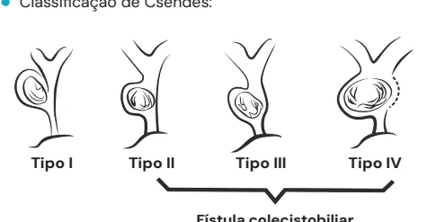
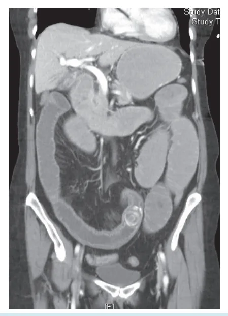

# Abdome Agudo Inflamatório Complicações

<!-- page:1 -->

## ABDOME AGUDO INFLAMATÓRIO

## COMPLICAÇÕES

Colecistite

## Síndrome de Mirizzi

- Tipo 1: obstrução extrínseca;

- Tipo 2: erosão de 1/3 do ducto hepático;

- Tipo 3: erosão de 2/3 do ducto hepático;

- Tipo 4: Fístula colecistobiliar total.

Tratamento

- Tipo 1: Colecistectomia;

- Tipo 2: Colecistectomia + fechamento da fístula tubo T ou coledocoplastia;

## COMPLICAÇÕES DA COLECISTITE

## AGUDA COLECISTITE ENFISEMATOSA = COLECISTITE GANGRENOSA

- Mais comum em pacientes idosos, diabéticos, com demora para atendimento;

- Homens 2:1;

- Infecção é por Clostridium → Produz crepitação da parede, hemólise;

- Pode perfurar por ser um quadro recorrente subagudo;

- → Abscesso bloqueado ou peritonite.

## COLECISTITE AGUDA ALITIÁSICA

- Sem cálculos = é causada por hipoperfusão e hipofluxo;

- Quadro clínico frusto e inespecífico, normalmente é achado de imagem: Febre; Leucocitose; Mal-estar.

- Pacientes em UTI, graves, complexos;

- Tratamento = Colecistostomia → Cirurgia tardiamente. Paciente muito grave que não tolera procedimento cirúrgico.

## FÍSTULA BILIAR

- Ocorre após a colecistectomia, por lesão de via biliar;

- Bilioma em imagem ou bile no dreno;

- Alto débito x baixo débito (300ml/24h): Para alto débito = geralmente indica-se CPRE; Para baixo débito = observar Permanece refratário = cirurgia (muito raro).

(fechamento espontâneo); NA GESTAÇÃO

- Estrogênio, progesterona, estase aumentar risco de colelitíase e complicações;

- Diferencial com HELLP, eclâmpsia, DPP;

- Operar somente quando muito sintomática (mais de uma crise) e preferencialmente no 2° ou 3° semestre;

- Pode realizar colangiografia intra-operatória. - Tipo 3: coledocoplastia ou biliodigestiva;

- Tipo 4: biliodigestiva.

Íleo Biliar Tríade de Rigler

- Aerobilia +;

- Cálculo visível +;

- Distensão abdominal.

- Cálculo impactado no infundíbulo da vesícula, que comprime a via biliar comum, podendo formar uma fístula;

- Fatores de risco: Cístico longo; Implantação baixa e paralela ao ducto hepático.

- Quadro clínico: Colecistite aguda moderada, grave e arrastada; Obstrução do ducto hepático = elevação de Episódios de colangite.

; enzimas, icterícia obstrutiva;

- Classificação de Csendes:

Classificação de Csendes Tipo I Tipo II Tipo III Tipo IV Fístula colecistobiliar Figura 1: Classificação de Csendes.

- Tipo 1 → Obstrução extrínseca;

- Tipo 2 → Erosão de 1/3 do ducto hepático;

- Tipo 3 → Erosão de 2/3 do ducto hepático;

- Tipo 4 → Fístula colecistobiliar total.

- Diagnóstico: Colecistite = USG + labs (demonstra a impactação); Icterícia, colangite, coledocolitíase = CPRE e depois avaliar cirurgia; Quadros crônicos = ColangioRM e programação cirúrgica cuidadosa eletiva.

- Tratamento: Tipo 1 = colecistectomia; Tipo 2 = colecistectomia + fechamento da fístula + tubo T ou coledocoplastia; Tipo 3 = coledocoplastia ou biliodigestiva; Tipo 4 = biliodigestiva; REALIZAR COLANGIOGRAFIA INTRAOP EM TODOS.

---

<!-- page:2 -->

ÍLEO BILIAR Tríade de Rigler Obstrução intestinal por cálculo biliar

- Aerobilia;

- Colecistite aguda com formação de fístula

- Cálculo visível na imagem (RX, TC);

vesícula-intestinal;

- Distensão abdominal (abdome obstrutivo).

- Migração do cálculo pela fístula; Tratamento

- Migração do cálculo pela fístula; T

- Impactação do cálculo na válvula ileocecal.

- S

- R por cálculo biliar. Tratamento

Figura 2: Exame demonstrando obstrução intestinal

- 1° momento = enterotomia e retirada do cálculo (DESOBSTRUÇÃO);

- 2° momento = colecistectomia e correção da fístula Se favorável = tratar ambos AO mesmo tempo; Inspecionar todo o intestino.

(TRATAR CAUSA BASE): Síndrome de Bouveret

- Quadro similar ao íleo biliar, porém com fístula para estômago e obstrução do piloro.

## REFERÊNCIAS

Figura 2: Exame demonstrando obstrução intestinal por cálculo biliar. Fonte: Case courtesy of Frank Gaillard, Radiopaedia.org, rID: 36012

