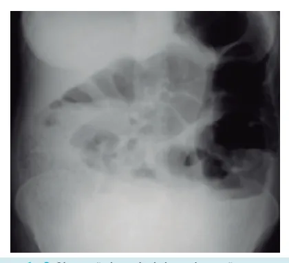
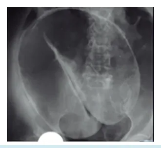
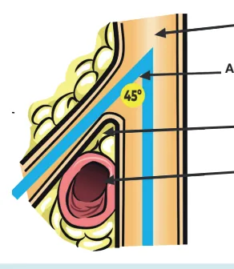

# Abdome Agudo Obstrutivo

<!-- page:1 -->

## Introdução

O **abdome agudo obstrutivo** é caracterizado por uma parada de progressão do trânsito intestinal, causando dilatação proximal e esvaziamento distal. Isso leva a mais pressão intestinal, o que aumenta a força na tentativa de vencer a obstrução. Como o intestino não consegue vencer a obstrução, há um sequestro de líquidos para o **3º espaço**, com redução da perfusão, isquemia, necrose e, por fim, perfuração intestinal.

## Tríade do Abdome Agudo Obstrutivo

- **Dor abdominal**
- **Distensão abdominal**
- **Parada de eliminação de fezes e flatos**

## Quadro Clínico

- Tríade clássica: **dor abdominal** + **distensão abdominal** + **parada de eliminação de fezes e flatos**
- Outros sintomas:
  - RHA aumentados
  - Náuseas e vômitos
  - Diarreia paradoxal
  - Desidratação, sepse e peritonite
  - Alcalose (por vômitos)
- Outras causas: hérnia interna, hérnia inguinal tumoral

## Classificação da Obstrução

### Obstrução Alta x Baixa

- **Obstrução alta**: intestino delgado
  - Clínica: vômitos precoces, biliosos, com menos distensão
  - **Alcalose metabólica** devido aos vômitos
  - Causa principal: **bridas**
  - Outras causas: hérnia interna, hérnia inguinal encarcerada, tumor, bezoar e corpo estranho
  - Radiografia: **empilhamento de moedas**
- **Obstrução baixa**: cólon e reto
  - Clínica: vômitos tardios, fecalóides. Distensão maior
  - **Acidose metabólica**, já que há perda para o 3º espaço
  - Causa principal: **neoplasia colorretal**
  - Outras causas: volvo, megacólon, doença inflamatória intestinal (DII)

### Obstrução Parcial x Total

- **Parcial**: suboclusão intestinal. Exemplo: paciente com fecaloma que ainda evacua
- **Total**: oclusão total. Não há eliminação nem de flatos

### Obstrução Mecânica x Funcional

- **Mecânica**: há um processo mecânico obstruindo, como brida, tumor, estenose, fecaloma, volvo
- **Funcional**: paciente apresenta alguma condição que impede o funcionamento intestinal, como síndromes metabólicas, medicamentosas, constipação, infecção, pós-operatório

### Obstrução Complicada ou Não

- **Complicada**: presença de sinais de alarme — sepse, isquemia, perfuração, necrose, obstrução em alça fechada
- **Não complicada**: paciente não apresenta complicações

---

<!-- page:2 -->

## Diagnóstico

### Anamnese e Exame Físico

- Atenção aos dados da história na busca de etiologias e sinais de alarme
- Sempre examinar a região inguinal e fazer o toque retal

### Exames Laboratoriais

- Inespecíficos — usados para avaliar a gravidade

### Exames de Imagem

**Radiografia de abdome agudo** (3 incidências): primeiro exame a ser solicitado.

- Identificação de complicações: obstrução em alça fechada, nível hidroaéreo, pneumoperitônio
- Distingue obstrução alta de baixa:
  - Alta: empilhamento de moedas, central
  - Baixa: haustrações periféricas
- Ver Figuras 1 e 2

**TC de abdome**

- **Padrão-ouro**
- Indica o ponto de obstrução, a altura e se a obstrução é total ou parcial
- Mostra a etiologia e sinais de sofrimento de alças ou complicações

### Manejo Inicial

> ⚠️ Fluxograma reconstruído a partir de OCR (texto de figura intercalado) — confira contra a fonte original.

- Jejum, sonda nasogástrica (SNG), hidratação, exames de triagem (laboratoriais e raio-X de abdome agudo), internação e sintomáticos
- Presença de sinal de alarme (sepse, peritonite, alça fechada, obstrução total) → **cirurgia**
- Paciente estável → **TC de abdome** para confirmar a etiologia → conduta conforme etiologia

Figura 3: Fluxograma de manejo inicial do abdome agudo obstrutivo.

## Principais Etiologias

### Bridas

- Etiologia mais comum de abdome agudo obstrutivo alto
- Caracterizada por aderências pós-cirúrgicas: quanto mais episódios, pior
- Necessário cirurgia prévia — cirurgias em abdome inferior tendem a ser piores

---

<!-- page:3 -->

- Tratamento: inicialmente clínico, pois o paciente apresenta uma suboclusão

### Fecaloma

- Mais comum em idosos, acamados e constipados crônicos
- Conduta: sonda nasogástrica + jejum + hidratação + analgesia
- Caso o paciente não apresente melhora: TC de abdome com contraste VO após 48–72 horas
- Indicações de **cirurgia**: refratariedade, peritonite difusa, pneumoperitônio

### Tumor

- Pacientes idosos, com perda de peso, massa abdominal palpável e anemia
- Tumor como causa de abdome obstrutivo → **cirurgia**
- Sempre que possível, mesmo na urgência, realizar cirurgia oncológica, reconstruindo o trânsito se possível

### Volvo de Sigmoide

Figura 4: Volvo de sigmoide — sinal do grão de café.

- Mais comum em pacientes idosos, portadores de doença de Chagas e megacólon
- Evolução com dor abdominal súbita
- Toque retal: **sinal de Gersuny** (crepitação e massa moldável à palpação do abdome)
- Tratamento:
  - Se o paciente apresentar peritonite/sofrimento de alça → **laparotomia**
    - Paciente instável → cirurgia de Hartmann
    - Paciente estável → pode-se discutir anastomose primária
  - Se o paciente não apresentar peritonite ou sofrimento de alça → **retossigmoidoscopia rígida** com manobra de devolvulação (manobra de Bruusgaard); deixar sonda retal, retirar da urgência e programar cirurgia posteriormente

> ⚠️ Trecho reconstruído a partir de OCR (figura da Síndrome de Wilkie intercalada com o texto de volvo) — confira contra a fonte original.

### Síndrome de Ogilvie

- Pseudo-obstrução colônica aguda, sem ponto de obstrução mecânica
- Fatores de risco:
  - Trauma raquimedular
  - Imobilidade (pacientes de UTI, casas de repouso)
  - Politrauma, uso de narcóticos
  - Distúrbios metabólicos, doença neurodegenerativa
- Achados: dilatação maciça do cólon sem obstrução mecânica
- Conduta:
  - **Fecaloma volumoso** que não se resolve clinicamente ou refratário: lavagem, esvaziamento, laxativos; se refratário, pode-se tentar descompressão via colonoscopia
  - Indicações de cirurgia: complicação com perfuração, isquemia ou necrose
- Tratamento em etapas:
  1. 1ª linha: tratamento clínico (retirar fatores desencadeantes, dieta laxativa, fisioterapia)
  2. 2ª linha: neostigmina / colonoscopia descompressiva
  3. 3ª linha: cirurgia, se refratário ao tratamento ou se ceco maior que 10–12 cm de diâmetro (laparotomia com colectomia)

### Síndrome de Wilkie

- Obstrução intestinal alta, também chamada de **síndrome da artéria mesentérica superior**
- Mais comum em pacientes com perda de peso importante/magros
- Diagnóstico diferencial difícil → **AngioTC**
- Tratamento inicial clínico: adequação da dieta e hábitos
- Casos graves ou refratários → cirurgia (**duodenojejunostomia**)

---

<!-- page:4 -->

## Outras Etiologias de Obstrução Intestinal

- **Pseudo-obstruções**: medicamentosas, constipação funcional, distúrbio hidroeletrolítico, íleo metabólico, infecção, carcinomatose peritoneal
  - Tratamento clínico e da causa base: laxativos, suporte
- **Bezoar e/ou corpo estranho**
  - Clínica: pacientes psiquiátricos (que ingerem tufos de cabelo, entre outros)
  - Tratamento: endoscopia; cirurgia em casos refratários
- Hérnia interna, íleo biliar, hérnias de parede, pós-operatório, enterite actínica

## Referências

Figura 1: Obstrução intestinal alta. Fonte: Case courtesy of Fakhry Mahmoud Ebouda, Radiopaedia.org, rID: 68831.

Figura 2: Obstrução intestinal baixa. Fonte: Case courtesy of Fakhry Mahmoud Ebouda, Radiopaedia.org, rID: 68831.

Figura 4: Volvo de sigmoide. Fonte: Case courtesy of Dr Wael Nemattalla, Radiopaedia.org, rID: 10633.
