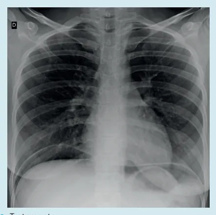
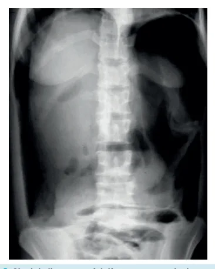
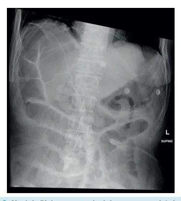

# Abdome Agudo Perfurativo

<!-- page:1 -->

## DOENÇA ULCEROSA PÉPTICA PERFURADA

Dica de prova = Uso de Aines

- Quadro Clínico: Dor abdominal aguda intensa; Peritonite; Posição antálgica; Abdome em tábua; Sepse.

- Raio-x de abdome agudo = Pneumoperitônio;

## DEFINIÇÃO

- O abdome agudo perfurativo é caracterizado por uma perfuração de víscera oca → Pneumoperitônio

→ Cai secreção intestinal na cavidade → Inflamação → Infecção → Complicações → Peritonite → Sepse → Morte;

- Manejo: Analgesia + Hidratação + Antibioticoterapia + suporte e CIRURGIA!

## PRINCIPAIS ETIOLOGIAS

## ESÔFAGO

- 1ª causa de perfuração esofágica: perfuração iatrogênica após endoscopia;

- Outras causas: trauma, corpo estranho, tumor e vômitos incoercíveis;

- Perfuração do esôfago abdominal é raro;

- O tratamento segue o mesmo raciocínio = cirurgia!

Síndrome de Boerhaave

- Perfuração esofágica após vômitos incoercíveis ou esforço extenuante;

- Mais comum na parte distal e região póstero-lateral esquerda do órgão;

- A mortalidade é de até 40% - devido ao difícil diagnóstico;

- Quadro clínico: Tríade de Mackler (enfisema de subcutâneo, derrame pleural e pneumomediastino); - Tratamento: Patch de Graham modificado.

- Diagnóstico: suspeita pelo histórico e exame clínico →

Solicitar exames de imagem;

- Tratamento: CIRURGIA: Precoce = reparo primário e drenagem; Tardia: esofagostomia + gastrostomia; Via videotoracoscopia ou toracotomia.

## ESTÔMAGO E DUODENO

- Causas: neoplasia, divertículo, corpo estranho, iatrogênica.

Doença ulcerosa péptica perfurada (a mais comum)

- 90% são causadas pela H. pylori;

- 10 % são causadas por: AINES; corticoides; Zollinger

Ellison; tumores gástricos;

- Complicações da úlcera: perfuração: Normalmente a úlcera duodenal de parede anterior perfura; Sangramento: parede posterior; Em estômago: pensar em neoplasia.

- Clínica: Dor abdominal aguda e intensa; peritonite;

posição antálgica; abdome em tábua; sepse;

- Sinal de Jobert → Perda da macicez hepática e punho percussão no hipocôndrio direito – loja hepática;

- Diagnóstico: Raio-x de abdome agudo! Pneumoperitônio! Cuidado com o sinal de Chilaiditi: às vezes, o paciente pode ter uma alça que se interpõe entre fígado e diafragma e pode-se confundir com pneumoperitônio. O paciente não vai apresentar manifestações clínicas.

---

<!-- page:2 -->

- Tratamento cirúrgico;

- Laparotomia ou laparoscopia se o paciente tiver condições clínicas: Suturar a úlcera + patch de epiplon (patch de Gastrectomia é exceção → Úlcera > 2 cm, complicada; Hidratação + analgesia + antibioticoterapia +

Graham modificado); Omeprazol dose plena.

- Dúvidas: Dreno em todo mundo? Não precisa! SNG em todo mundo? Não precisa! Libera dieta no pós-op? Pode! Deve-se avaliar caso a caso;

Figura 1: Gás entre o fígado e diafragma - pneumoperitônio. | Após a alta: Endoscopia e pesquisa por H pylori ambulatorial: Biópsia.

## LEMBRAR QUE OUTRAS VÍSCERAS OCAS

## PODEM PERFURAR

## DELGADO

- Etiologias: infecciosas, DII, Iatrogenias, neoplasias;

- Tratamento: cirurgia e tratar a causa base.

## CÓLON

- Etiologias: tumor, divertículo, Ogilvie;

- Tratamento: cirurgia e tratar causa base.

## RETO

- Etiologias: corpo estranho, iatrogenias;

- Tratamento: cirurgia e tratar causa base.

## REFERÊNCIAS

Figura 2: Sinal de Rigler - outro sinal de pneumoperitônio. Figura 1: Gás entre o fígado e diafragma - pneumoperitônio.

Fonte: Case courtesy of Dr Guilherme Pioli Resende, Radiopaedia.org, rID: 81470 Figura 2: Sinal de Rigler - outro sinal de pneumoperitônio.

Fonte: Case courtesy of Dr Andrew Van, Radiopaedia.org, rID: 45431 Figura 3: Sinal do ligamento falciforme - outro sinal de pneumoperitônio.

Fonte: www.radiopaedia.org Figura 3: Sinal do ligamento falciforme - outro sinal de pneumoperitônio.

