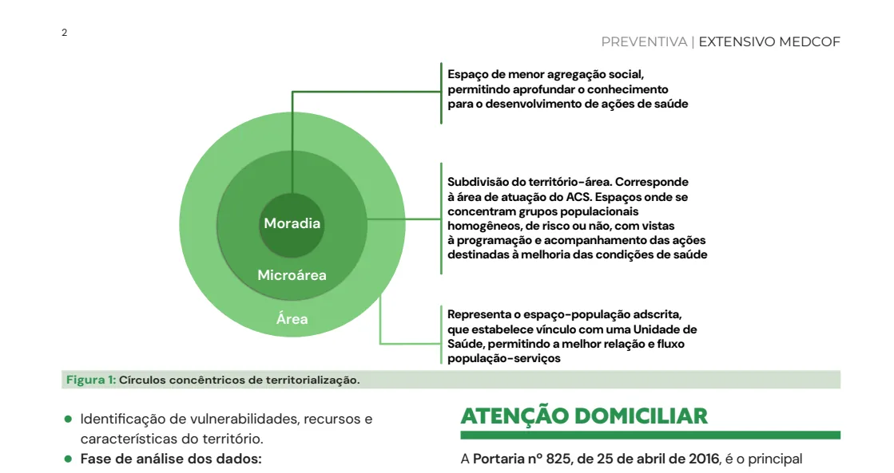
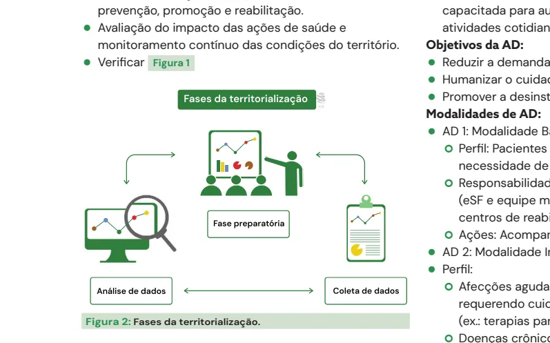
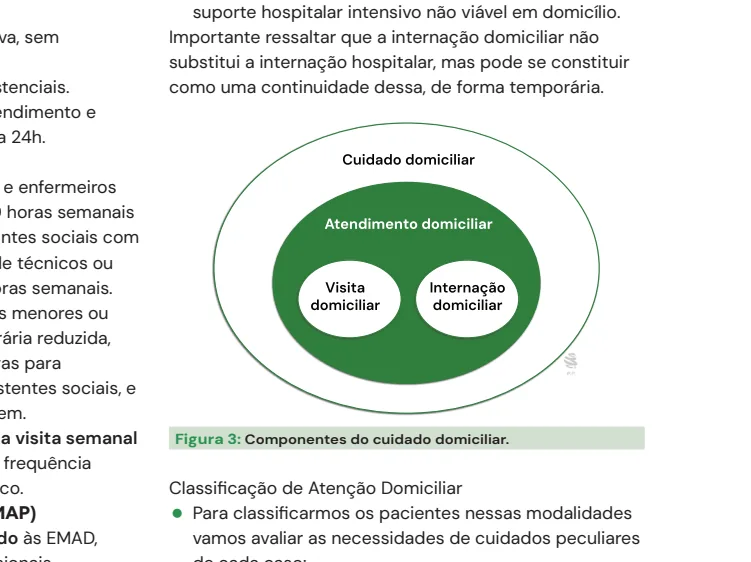

# Abordagem Comunitária

<!-- page:1 -->

Saúde Pública — Abordagem Familiar e Comunitária

## Territorialização

Territorialização é o processo de reconhecimento e análise do território, utilizado na organização do sistema de atenção, envolvendo a compreensão das condições de vida, determinantes sociais, culturais, econômicos e ambientais, bem como da situação de saúde da população local.

- Visa organizar os serviços de saúde de forma coerente com a realidade de uma área definida, garantindo **resolutividade, vínculo e cuidado integral**.
- Baseada nas necessidades reais da população, condições de vida, determinantes sociais e dados epidemiológicos.
- Envolve tanto uma dimensão técnica (mapeamento, dados epidemiológicos) quanto política e social (reconhecimento das redes comunitárias, lideranças e vulnerabilidades).

### Dinamicidade do Território

- **Território vivo e dinâmico**: o uso social do território é mais relevante que suas delimitações geográficas formais.
- **Território-processo**: o território é um produto em constante construção, moldado por relações sociais e históricas.

### Tipos de Território (por Nível de Atuação)

- **Território-distrito**: delimitação político-administrativa.
- **Território-área**: área de abrangência de uma UBS ou equipe de Saúde da Família (eSF).
- **Território-microárea**: espaço de atuação do ACS, definido com base na homogeneidade socioeconômica-sanitária.
- **Território-moradia**: local de residência das famílias, núcleo mais próximo do cuidado.

### Fases da Territorialização

1. **Fase preparatória ou de planejamento**:
   - Definição dos objetivos da territorialização.
   - Planejamento das estratégias para coleta de dados.
   - Levantamento de informações prévias e responsabilidades da equipe.
2. **Fase de coleta de dados/informações**:
   - Obtenção de dados secundários (IBGE, e-SUS, prontuários).
   - Coleta de dados primários por observações in loco, visitas domiciliares e entrevistas.
   - Identificação de vulnerabilidades, recursos e características do território.
3. **Fase de análise dos dados**:
   - Integração e interpretação dos dados coletados.
   - Construção de diagnóstico situacional e mapa vivo do território.
   - Definição de prioridades e plano de ação.

### Finalidades da Territorialização

- Organização e planejamento dos serviços de saúde, orientando a oferta e priorizando populações vulneráveis.
- Construção de vínculos entre comunidade e equipe de saúde.
- Identificação de grupos prioritários, como idosos acamados, gestantes e pessoas em risco social.
- Subsídio para ações de vigilância em saúde, prevenção, promoção e reabilitação.
- Avaliação do impacto das ações de saúde e monitoramento contínuo das condições do território.

---

<!-- page:2 -->

> ⚠️ Trecho reconstruído a partir de OCR de duas colunas (legenda da Figura 1/2) — confira contra a fonte original.

Espaço de menor agregação social, permitindo aprofundar o conhecimento para o desenvolvimento de ações de saúde. A **microárea** é subdivisão do território-área, correspondendo à área de atuação do ACS — espaços onde se concentram grupos populacionais homogêneos, de risco ou não, com vistas à programação e ao acompanhamento das ações destinadas à melhoria das condições de saúde. Representa o espaço-população adscrita e estabelece vínculo com uma Unidade de Saúde, permitindo a melhor relação e fluxo população-serviços.

*Figura 1: Círculos concêntricos de territorialização.*

*Figura 2: Fases da territorialização.*

## Atenção Domiciliar

A **Portaria nº 825, de 25 de abril de 2016**, é o principal documento normativo que redefine e regulamenta a Atenção Domiciliar (AD) no âmbito do SUS. Ela atualiza diretrizes, estrutura, modalidades de atendimento e critérios para habilitação das equipes de atenção domiciliar.

### Definições Importantes

- **Atenção Domiciliar (AD)**: conjunto de ações de prevenção, tratamento, reabilitação, paliação e promoção à saúde realizadas no domicílio.
- **Serviço de Atenção Domiciliar (SAD)**: complementa a atenção básica e a atenção hospitalar, gerenciando as Equipes Multiprofissionais de Atenção Domiciliar (**EMAD**) e de Apoio (**EMAP**).
- **Cuidador**: pessoa com ou sem vínculo familiar, capacitada para auxiliar o usuário em suas atividades cotidianas.

### Objetivos da AD

- Reduzir a demanda e permanência hospitalar.
- Humanizar o cuidado, promovendo autonomia.
- Promover a desinstitucionalização e otimizar recursos.

### Modalidades de AD

- **AD 1 — Modalidade Básica**:
  - Perfil: pacientes clinicamente estáveis, com menor necessidade de intervenções multiprofissionais.
  - Responsabilidade: equipes de Atenção Básica (eSF e equipe multi), com apoio de ambulatórios e centros de reabilitação.
  - Ações: acompanhamento domiciliar regular.
- **AD 2 — Modalidade Intermediária**:
  - Perfil: afecções agudas ou crônicas agudizadas, requerendo cuidados intensificados ou sequenciais (ex.: terapias parenterais). Doenças crônico-degenerativas com comprometimento que exijam visitas mínimas semanais. Cuidados paliativos com manejo de dor e sofrimento. Prematuros e bebês de baixo peso com necessidade de ganho ponderal.
  - Responsabilidade: **SAD**.
- **AD 3 — Modalidade Avançada**:
  - Perfil: casos de AD 2 que necessitam maior frequência de atendimento, equipamentos complexos (ex.: ventilação mecânica) ou procedimentos como nutrição parenteral e transfusões, com atendimento no domicílio pelo menos uma vez por semana.
  - Responsabilidade: **SAD** (Obs.: EMAD Tipo 2 pode não atender AD 3 por limitação técnica).

---

<!-- page:3 -->

### Critérios Gerais

- **Cuidador**: obrigatória a presença de cuidador para dependentes funcionais (CIF).
- **Cobertura**: mínima de 12 horas/dia, inclusive em finais de semana e feriados.
- **Habilitação**: municípios com mais de 20 mil habitantes podem habilitar SAD, com exigência de cadastramento das equipes no SCNES.
- **Intercorrências agudas**: garantido atendimento e transporte para unidade de referência 24h.

### Exclusões e Restrições

Não elegíveis para AD: usuários que necessitam de:

- Monitorização contínua ou assistência de enfermagem 24h.
- Necessidade de propedêutica complementar urgente ou múltiplos exames.
- Cirurgias de urgência.
- Uso de ventilação mecânica invasiva, sem equipe habilitada.
- Descumprimento de acordos assistenciais.

Importante ressaltar que a internação domiciliar não substitui a internação hospitalar, mas pode se constituir como uma continuidade dessa, de forma temporária.

### Financiamento

- **R$ 50 mil/mês** para EMAD Tipo 1.
- **R$ 34 mil/mês** para EMAD Tipo 2.
- **R$ 6 mil/mês** para EMAP.

### Estrutura das Equipes

- **EMAD Tipo 1**: composta por médicos e enfermeiros com carga horária total mínima de **40 horas semanais** por equipe, fisioterapeutas ou assistentes sociais com no mínimo **30 horas semanais**, além de técnicos ou auxiliares de enfermagem com **120 horas semanais**.
- **EMAD Tipo 2**: voltada para municípios menores ou com menor demanda, exige carga horária reduzida, sendo **20 horas** para médicos, **30 horas** para enfermeiros e fisioterapeutas ou assistentes sociais, e **120 horas** para técnicos de enfermagem.

As EMAD devem garantir, no mínimo, uma visita semanal a cada paciente, podendo intensificar a frequência conforme a necessidade do quadro clínico.

*Figura 3: Componentes do cuidado domiciliar.*

### Equipes Multiprofissionais de Apoio (EMAP)

As EMAP oferecem suporte especializado às EMAD, complementando o cuidado com profissionais como assistentes sociais, nutricionistas, psicólogos, farmacêuticos, fonoaudiólogos, odontólogos, fisioterapeutas e terapeutas ocupacionais.

- A composição mínima é de **três profissionais de nível superior**, com carga horária somada de **90 horas semanais**.
- As EMAP são acionadas pela EMAD conforme a demanda clínica e social do paciente.

### Classificação de Atenção Domiciliar

Para classificar os pacientes nas modalidades, avaliam-se as necessidades de cuidados peculiares a cada caso:

- Periodicidade indicada das visitas.
- Intensidade do cuidado multiprofissional.
- Uso de equipamentos.

À medida que aumenta o número da modalidade de Atenção Domiciliar, aumenta a densidade tecnológica e a carga horária necessária para atender às condições e casos mais complexos.

### Funcionamento do SAD

- Atuação articulada com toda a Rede de Atenção à Saúde (**RAS**).
- Escala de risco e vulnerabilidade para atenção domiciliar na APS (Ribeiro, Fiuza e Pinheiro) — serve como apoio, um guia para a gestão das visitas domiciliares na atenção primária à saúde.

**Tabela 1: Vulnerabilidade e Visita Domiciliar**

> ⚠️ Tabela reconstruída a partir de OCR — confira contra a fonte original.

| Classificação de risco e vulnerabilidade | Escore | Tempo médio para planejamento das próximas visitas |
|---|---|---|
| Baixo | Até 5 | 6 meses a 1 ano |
| Médio | 6 a 10 | 4 a 6 meses |
| Alto | 11 a 15 | 2 a 3 meses |
| Muito alto | Maior que 16 | 1 a 2 meses |

---

<!-- page:4 -->

**Tabela 2: Escala de Performance Paliativa**

> ⚠️ Tabela reconstruída a partir de OCR — confira contra a fonte original.

| Indicador | Situação | Escore de risco e vulnerabilidade |
|---|---|---|
| Idade | 75 a 84 anos | 1 |
| Idade | ≥ 85 anos | 2 |
| Multimorbidade | Nº de comorbidades (≥ 5) | 2 |
| Multimorbidade | Descompensação clínica | 5 |
| Polifarmácia | Nº de medicamentos (≥ 5) | 2 |
| Dependência funcional | AVDs instrumentais | 1 |
| Dependência funcional | AVDs básicas e instrumentais | 2 |
| Mobilidade | Dificuldade de marcha | 1 |
| Mobilidade | Risco de queda | 2 |
| Mobilidade | Acamado | 3 |
| Suporte familiar | Disfunção familiar | 1 |
| Suporte familiar | Sobrecarga do cuidador | 1 |
| Fragilidade | Síndrome demencial, depressão, Parkinson, neoplasia, sarcopenia, desnutrição, disfagia, incontinência, paralisia cerebral | 2 (cada) |
| Cuidados paliativos (PPS*) | PPS 80 a 100 | — |
| Cuidados paliativos (PPS*) | PPS 50 a 70 | 2 |
| Cuidados paliativos (PPS*) | PPS 30 a 50 | 5 |
| Cuidados paliativos (PPS*) | PPS < 20 | 8 |
| **Total** | | **10** |

*\*PPS: Palliative Performance Scale — Escala de Performance Paliativa (PPS) é uma ferramenta amplamente utilizada para avaliação e classificação de cuidados paliativos, sendo um instrumento validado para o contexto e língua portuguesa em 2009.*

## Grupos na APS

Na Atenção Primária à Saúde (APS), os grupos são espaços de interação que reconhecem as singularidades de cada participante e trabalham em torno de uma meta comum, estimulando a troca de saberes, o cuidado coletivo e o fortalecimento de vínculos.

### Finalidades

- **Grupos operativos**: focados em uma tarefa específica, como aprendizado, prevenção de doenças ou autocuidado. Podem atuar nos campos educativo, institucional, comunitário e terapêutico, incluindo grupos de gestantes, adolescentes ou líderes comunitários.
- **Grupos psicoterápicos**: voltados para questões psicológicas, buscando desenvolver a consciência sobre aspectos comportamentais, relacionais e emocionais dos participantes.

### Classificação dos Grupos

- **Grupos abertos**: possuem objetivo definido, mas não têm tempo de duração fixo. Permitem a entrada e a saída de participantes ao longo do tempo.
- **Grupos fechados**: mantêm número fixo de integrantes do início ao fim da atividade, sem a inclusão de novos membros após seu início.
- **Grupos homogêneos**: constituídos por pessoas com características semelhantes, como faixa etária, gênero, condição de saúde, entre outros.
- **Grupos heterogêneos**: reúnem participantes com perfis variados, o que enriquece a troca de experiências.

Além dessas classificações, os grupos na APS também podem ser organizados de acordo com sua finalidade em grupos de promoção da saúde ou grupos de prevenção, controle de agravos e tratamento, conforme as necessidades da comunidade.

---

<!-- page:5 -->

**Tabela 3: Grupos na Atenção Primária**

> ⚠️ Tabela reconstruída a partir de OCR (texto de duas colunas fortemente intercalado) — confira contra a fonte original.

| Categoria | Grupos de Promoção da Saúde | Grupos de Prevenção e Controle |
|---|---|---|
| Conceito de saúde | Positivo e multidimensional | Ausência de doença |
| Modelo de intervenção | Participativo e cooperativo | Biomédico |
| População-alvo | Toda a população | População de risco e/ou em situação de exclusão social |
| Objetivos | Contínuos, direcionados à promoção da autonomia, mudança de atitudes favoráveis ao desenvolvimento de níveis de saúde e qualidade de vida | Específicos para a prevenção e tratamento das doenças e agravos |
| Compreensão do corpo | Considera a complexidade do conjunto de relações que constituem os significados | Estratificada por especialidades |
| Função do coordenador | Escutar ativamente as demandas do grupo, facilitar o desenvolvimento de atitudes capazes de interferir na autonomia e nos comportamentos dos participantes | Expor conhecimentos preventivos e responsabilizar os indivíduos pelas transformações de suas práticas |
| Função do setting grupal | Adequado à promoção contínua do nível de saúde e às condições de vida | Direcionado ao controle dos objetivos principais |
| Mobilizações emocionais (ME) | Frequentemente ressignificadas por meio de relações grupais cooperativas | Frequentemente desconsideradas e pouco valorizadas em função da premissa da objetividade |
| Planejamento das atividades grupais | Desenvolvido a partir das necessidades sociais levantadas no processo grupal | Estruturado mediante a tradução de informações científicas e recomendações normativas de mudanças de hábitos |

## Referências

Figuras 1 à 3. Adaptado de BRASIL. Ministério da Saúde. *Territorialização: instrumento de gestão da atenção primária à saúde*. Brasília: UNA-SUS, 2013.

Tabelas 1 e 2. BRASIL. Ministério da Saúde. Secretaria de Atenção à Saúde. *Atenção domiciliar na atenção primária à saúde*. Brasília: Ministério da Saúde, 2016.

Tabela 3: Grupos na Atenção Primária. UNIVERSIDADE FEDERAL DE SANTA CATARINA. Núcleo Telessaúde Santa Catarina. Curso: *Trabalho com grupos na Atenção Básica à Saúde*. Florianópolis: UFSC, [s.d.].
