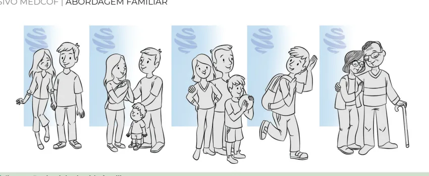
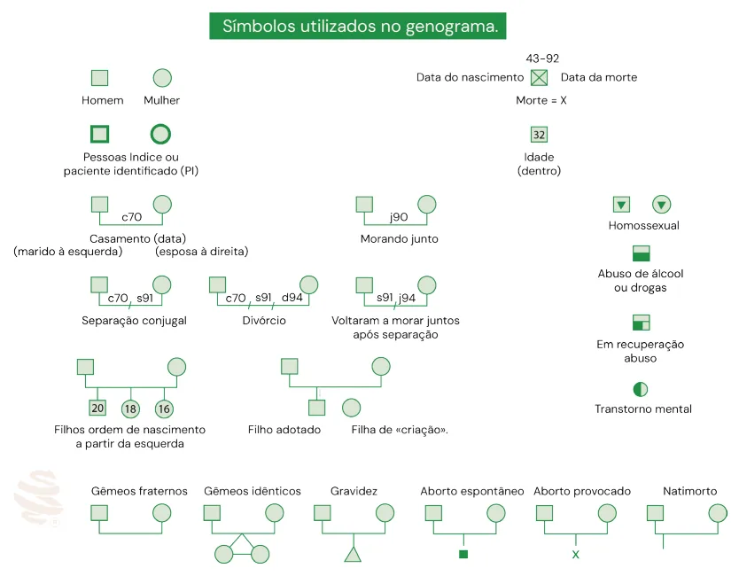
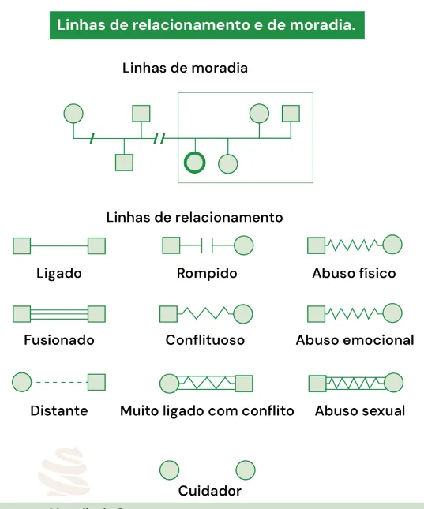

# Abordagem Familiar

<!-- page:1 -->

Abordagem Familiar e Comunitária

## Tipos de Família

- **Nuclear**: casal com ou sem filhos (biológicos ou adotivos).
- **Extensiva/Estendida**: mais de uma geração, incluindo vínculos colaterais (tios, primos).
- **Monoparental**: apenas um dos pais e seus filhos.
- **Reconstituída**: casais com filhos de relações anteriores.
- **Unitária**: uma única pessoa (solteiro, viúvo).
- **Homoafetiva/LGBTQIA+**: casal do mesmo gênero, com ou sem filhos.
- **Funcional**: pessoas sem laços consanguíneos, mas com papéis parentais.
- **Institucional**: crianças ou grupos criados por instituições (orfanatos, casas-lares).

## Ferramentas

### Ecomapa

- Mostra a rede de apoio e interações da família (serviços, vizinhos, trabalho).
- Representa intensidade, qualidade e impacto das relações (linhas, setas, traços serrilhados).

### P.R.A.C.T.I.C.E.

- **P** — Presenting problem (problema apresentado)
- **R** — Roles and structure (papéis e estrutura)
- **A** — Affect (afeto)
- **C** — Communication (comunicação)
- **T** — Time in life cycle (fase do ciclo familiar)
- **I** — Illness in Family (doenças na família, ontem e hoje)
- **C** — Coping with stress (enfrentamento do estresse)
- **E** — Ecology (meio ambiente, rede de apoio)

### APGAR Familiar

- **A** — Adaptation (Adaptação)
- **P** — Partnership (Participação)
- **G** — Growth (Crescimento)
- **A** — Affection (Afeição)
- **R** — Resolve (Resolução)

### FIRO

- **Inclusão**: avalia participação e apoio familiar diante de problemas, identificando quem se mobiliza ou se afasta.
- **Controle**: examina a dinâmica de poder — se é dominante, reativa ou colaborativa.
- **Intimidade**: analisa como os sentimentos, afeto e empatia circulam entre os membros.

### Genograma

- Representação gráfica da estrutura familiar em até 3 gerações.
- Identifica padrões de doenças, conflitos, vínculos e suporte.
- Utilizado para análise psicossocial e planejamento terapêutico.

### Escala de Risco Familiar de Coelho-Savassi (ERF-CS)

- **Critérios**: condições de saneamento, desnutrição, drogadição, desemprego, idade, doenças crônicas etc.
- **Classificação**:
  - 0–4: sem risco
  - 5–6: R1 (menor risco)
  - 7–8: R2 (médio risco)
  - ≥9: R3 (risco máximo)

### Ciclo de Vida Familiar

1. Saindo de Casa
2. Formação do Casal
3. Famílias com Filhos Pequenos
4. Famílias com Adolescentes
5. Lançando os Filhos (Ninho Vazio)
6. Estágio Tardio

### Estágios de Ciclo de Vida Familiar da Classe Popular

- **Estágio 1**: jovens com responsabilidades precoces.
- **Estágio 2**: famílias multigeracionais, com papéis sobrepostos.
- **Estágio 3**: avós mantêm papel central, sem "ninho vazio".

## Considerações Gerais

- **Família unitária**: constituída por apenas uma pessoa, como alguém solteiro, divorciado ou viúvo que vive sozinho.
- **Família nuclear**: formada por um casal (com ou sem filhos), podendo os filhos ser consanguíneos ou adotivos. Exemplo: casal e filhos.
- **Família extensiva ou estendida**: constituída por mais de uma geração, podendo incluir vínculos colaterais, como tios, primos e padrinhos.
- **Família monoparental**: composta por apenas um dos pais biológicos e seu(s) filho(s), independentemente de vínculos externos ao núcleo.
- **Família reconstituída (ou recomposta)**: formada por casais em que pelo menos um dos cônjuges possui filhos de relacionamentos anteriores, criando uma nova configuração familiar.
- **Família homoafetiva**: formada por casal com mesma identidade de gênero, com ou sem filhos (biológicos ou adotivos). **LGBTQIA+**: constituída por pessoas que podem ter orientação sexual e/ou identidade de gênero não cisheteronormativa.
- **Família funcional**: não há, necessariamente, laço consanguíneo; composta por pessoas que desempenham papéis parentais em relação a crianças ou adolescentes.

---

<!-- page:2 -->

- **Família institucional**: tem a função de criar e desenvolver afetivamente crianças, adolescentes ou grupos específicos. Exemplo: orfanatos, casas-lares, comunidades terapêuticas ou instituições religiosas.

A avaliação do ciclo permite compreender a adaptabilidade, funcionalidade, resiliência e fatores de risco e proteção. Ex.: como a fase atual da família pode impactar na saúde, e quais seriam os desafios a superar?

### Modelos de Abordagem Familiar

- Abordagem familiar x terapia familiar.
- Níveis de envolvimento emocional com as famílias (McDaniel e Cols.).

### Desenvolvimento Familiar — Ciclo de Vida Familiar

- O ciclo de vida familiar descreve o processo de desenvolvimento das famílias ao longo do tempo, contemplando estágios previsíveis (mudanças normativas) e eventos não previstos (crises).
- É um modelo sistêmico, que entende a família como uma unidade dinâmica, sujeita a reorganizações e renegociações de papéis ao longo das transições de vida.
- Cada momento do ciclo demanda tarefas emocionais e relacionais específicas. A dificuldade em cumpri-las pode gerar disfunções, conflitos e sintomas.

**Tabela 1: Níveis de Intervenção com Famílias na APS**

> ⚠️ Tabela reconstruída a partir de OCR — confira contra a fonte original.

| Nível | Objetivos | Situação de saúde | Intervenções |
|---|---|---|---|
| 1 | Mínimo contato com a família | Patologias individuais | Contato familiar, se necessário, por questões médico-legais |
| 2 | Troca de informação, colaboração com a família sobre o doente e aconselhamento | Tabagismo, sobrepeso, cuidados de saúde | Terapia de apoio, entrevista motivacional, grupos de prevenção e promoção à saúde |
| 3 | Escuta das preocupações, contenção emocional, apoio, suporte e resolução de conflitos | Álcool e drogas, depressão, ansiedade, comportamento de risco | Primeira abordagem com situações de drogas, visita domiciliar, grupos de autoajuda |
| 4 | Aconselhamento, manejo sistêmico de famílias e relações, com avaliações continuadas | Famílias com vários problemas, doença terminal, uso de álcool e drogas | Terapia familiar, intervenção psicossocial, grupal ou familiar |
| 5 | Terapia de família | Problemas relacionais | Terapia familiar |

### Estágios do Ciclo de Vida Familiar

**1. Jovem Solteiro — Saindo de Casa**

- Tarefa emocional: desenvolver autonomia emocional e financeira.
- Mudanças qualitativas:
  - a) Diferenciar-se da família de origem.
  - b) Formar relacionamentos íntimos com adultos de mesma geração.
  - c) Estabelecer identidade profissional e independência financeira.

**2. Formação do Casal (Famílias sem Filhos)**

- Tarefa emocional: comprometimento com um novo sistema familiar.
- Mudanças qualitativas:
  - a) Construção do sistema marital.
  - b) Realinhamento das relações com as famílias de origem, incluindo o cônjuge como parte do núcleo.

**Obs.**: Duncan, 2022, estabelece um nível entre "novo casal" e "família com filhos pequenos", denominado "nascimento do primeiro filho". Tal nível estabelece a transição entre uma díade para uma tríade, requerendo a reorganização do casal. Assim, novas funções passam a ser desempenhadas pelos pais. A Medicina de Família e Comunidade auxilia o casal a formar uma rede de apoio efetiva e ajudar no diálogo intergeracional.

---

<!-- page:3 -->

*Figura 1: Ilustração de ciclo de vida familiar.*

**3. Famílias com Filhos Pequenos**

- Tarefa emocional: aceitar novos membros no sistema familiar.
- Mudanças qualitativas:
  - a) Ajustar o sistema conjugal para a parentalidade.
  - b) Dividir tarefas de educação, finanças e cuidados domésticos.
  - c) Realinhar relações com a família extensa, incorporando papéis de pais e avós.

**4. Famílias com Adolescentes**

- Tarefa emocional: aumentar a flexibilidade das fronteiras familiares para permitir a independência dos filhos e acolher a fragilidade dos avós.
- Mudanças qualitativas:
  - a) Modificar a relação pais-filhos, incentivando autonomia.
  - b) Retomar foco em questões conjugais e profissionais (meia-idade).
  - c) Começar a apoiar a geração mais velha (pais/avós).

**5. Lançando os Filhos e Seguindo em Frente (Ninho Vazio)**

- Tarefa emocional: aceitar as saídas e entradas de membros no sistema.
- Mudanças qualitativas:
  - a) Reorganizar a relação conjugal como dupla.
  - b) Construir relações de adulto-para-adulto com filhos crescidos.
  - c) Realinhar relações para incluir genros, noras e netos.
  - d) Lidar com envelhecimento e morte dos pais (avós).

**6. Famílias no Estágio Tardio de Vida**

- Tarefa emocional: aceitar mudanças de papéis e preparar-se para perdas.
- Mudanças qualitativas:
  - a) Manter interesses próprios e do casal diante do envelhecimento.
  - b) Transferir papel central para a geração seguinte.
  - c) Lidar com perdas (cônjuge, irmãos, amigos) e integrar o ciclo de vida.

### Estágios de Ciclo de Vida Familiar da Classe Popular

A literatura também separa e denomina aglutinações para o que chamam de "Estágios de ciclo de vida familiar da classe popular":

- **Estágio 1**: adolescente ou adulto jovem solteiro, que frequentemente assume responsabilidades precoces de trabalho e sustento.
- **Estágio 2**: família com filhos, em que geralmente convivem três ou quatro gerações no mesmo lar, com sobreposição de papéis entre pais e avós.
- **Estágio 3**: família no estágio tardio, na qual quase não existe "ninho vazio", pois os avós continuam com função central, cuidando e educando os netos.

## Genograma

- Representação gráfica da estrutura e dos relacionamentos de uma família, normalmente em três gerações.
- **Função**: avaliar a dinâmica familiar, identificar conflitos, padrões de doenças e vínculos afetivos. Ferramenta de apoio em planejamento terapêutico, promoção da saúde e prevenção de doenças. Pode ser atualizado sempre que ocorrerem mudanças significativas na família. Possibilita identificar também os temas biomédicos e psicossociais.
- **Aplicação na APS/ESF**: utilizado para compreender a rede de suporte familiar, identificar pessoas em situação de risco e mapear agravos de saúde. Favorece a comunicação com a equipe multidisciplinar e com a própria família.
- **Regras**:
  - Não é obrigatória a presença de todos os membros da família para sua construção.
  - Utilizar simbologia padrão.
  - Trigeracional (três gerações): começando sempre da pessoa índice (paciente).
  - Começar com casal e seus filhos.
  - Representar as relações familiares.
  - Indicar os fatores estressores, como doenças e condições.
  - Obedecer à cronologia de idade — dos mais velhos para os mais novos.
  - Pode ser concluído e atualizado em consultas subsequentes.

---

<!-- page:4 -->

*Figura 2: Símbolos utilizados no Genograma.*

*Figura 3: Linhas de Relacionamento e Moradia do Genograma.*

*Figura 4.*

---

<!-- page:5 -->

> ⚠️ Trecho reconstruído a partir de OCR de duas colunas com dados de exemplos clínicos ilustrativos (nomes, idades e datas fictícios das figuras 5 e 6) fortemente intercalados — confira contra a fonte original.

*Figura 5: Símbolos menos comuns (Saúde Mental) — proximidade, muita proximidade, abuso de álcool ou drogas, em recuperação do abuso de álcool ou drogas, sério problema físico ou mental, abuso de álcool/drogas e problema físico ou mental.*

Símbolos que denotam a interação entre as pessoas: pouca intimidade, evitação dos problemas, distanciamento, relação conflituosa, relação fusionada, ruptura e conflituosa, cuidado.

**Legenda**: Homem, Mulher, Separação, União/Casamento, Morte, Namoro.

*Figura 6: Exemplo de genograma com múltiplas disfuncionalidades.*

---

<!-- page:6 -->

> ⚠️ Trecho reconstruído a partir de OCR de duas colunas com dados de exemplos clínicos ilustrativos (figuras 7 e 8) fortemente intercalados — confira contra a fonte original.

*Figura 7: Exemplo de genograma com abuso de álcool e outras condições graves de saúde física e mental.*

*Figura 8: Exemplo de ecomapa.*

## Ecomapa

O ecomapa permite visualizar a rede social e de apoio do indivíduo e/ou família, bem como as relações que mantém com a comunidade e seus recursos (igreja, escola, vizinhança, serviços de saúde, animais, trabalho etc.).

### Dimensões das Relações Representadas

- **Força da ligação**: linha simples (fraca), linha dupla (forte), linha tracejada (tênue ou incerta).
- **Impacto da ligação**: setas indicam o fluxo de energia — se a relação exige esforço (energia negativa) ou fornece apoio (energia positiva).
- **Qualidade da ligação**: relações estressantes são indicadas por linha serrilhada.

O ecomapa funciona como uma "fotografia" das interações da família com o ambiente, evidenciando quais vínculos são de suporte e quais representam tensão ou desgaste.

---

<!-- page:7 -->

## P.R.A.C.T.I.C.E.

Deve ser aplicado em reuniões familiares, diante de problemas complexos:

- Avaliação do funcionamento das famílias.
- Facilita a coleta de informações e entendimento do problema (foco no problema).
- É uma ferramenta complementar ao Genograma e ao Ecomapa, permitindo uma análise mais ampla do contexto familiar.

> ⚠️ Trecho reconstruído a partir de OCR — os exemplos de ecomapa das Figuras 9 e 10 (dimensões força/impacto/qualidade da ligação em relações de trabalho) estavam fortemente intercalados no PDF original e podem não refletir a disposição exata da fonte.

*Figura 9: Exemplo de ecomapa com relações com o trabalho, ilustrando dimensões para cada ligação:*

- **Força da ligação**: nos exemplos, refere-se à linha central.
- **Impacto da ligação**: nos exemplos, refere-se às setas/linhas dos diversos pontos em relação ao indivíduo.
- **Qualidade da ligação** (estressante ou não): na presença de serrilhado = estressante.

O ecomapa pode conter um genograma dentro (nesse caso é a representação de um ecomapa com genograma).

*Figura 10: Exemplo de ecomapa com genograma.*

### P — Problem (Problema)

- Identifica o problema principal que trouxe a família ao atendimento.
- Analisa a percepção de cada membro sobre a situação.
- Exemplo: falta de adesão ao tratamento, conflitos relacionais ou dificuldades financeiras.

### R — Roles (Papéis e Estrutura)

- Avalia papéis desempenhados por cada membro (provedor, cuidador, autoridade, etc.).
- Verifica mudanças nesses papéis devido a situações de crise ou doenças.

### A — Affect (Afeto)

- Investiga como o afeto é expressado e trocado entre os membros da família.
- Avalia se o ambiente emocional contribui para a resolução do problema ou se gera tensão.

### C — Communication (Comunicação)

- Observa formas de comunicação verbal e não verbal.
- Analisa se há escuta ativa, respeito e clareza nas trocas ou se prevalecem ruídos, críticas e conflitos.

### T — Time (Tempo de Ciclo de Vida)

- Correlaciona o problema atual com a fase do ciclo de vida familiar.
- Identifica transições críticas (ex.: aposentadoria, adolescência dos filhos, doenças crônicas).

### I — Illness (Doença)

- Investiga histórico de doenças na família e como os membros lidaram com elas.
- Avalia estratégias de cuidado e o suporte aos doentes.

### C — Coping (Lida com o Estresse)

- Analisa como a família enfrenta situações de estresse.
- Identifica estratégias adaptativas (diálogo, apoio social) ou disfuncionais (isolamento, negação).

### E — Ecology (Ecologia)

- Avalia a rede social e os recursos externos disponíveis: igreja, escola, vizinhança, serviços de saúde, apoio comunitário, situação econômica e moradia.

## APGAR Familiar

O **APGAR Familiar** é um instrumento desenvolvido por Gabriel Smilkstein (1978) para avaliar a percepção dos membros da família quanto à funcionalidade familiar e ao suporte recebido.

A sigla APGAR representa cinco dimensões fundamentais das relações familiares:

- **A** — Adaptation (Adaptação): capacidade da família de usar recursos internos e externos para resolver problemas.
- **P** — Partnership (Participação): compartilhamento de decisões e responsabilidades.

---

<!-- page:8 -->

- **G** — Growth (Crescimento): suporte da família para mudanças e crescimento pessoal.
- **A** — Affection (Afeição): expressão de carinho e de apoio emocional entre os membros.
- **R** — Resolve (Resolução): capacidade de passar tempo juntos e compartilhar atividades satisfatórias.

**Obs.**: não é a mesma escala APGAR utilizada na pediatria.

### Questionário

Avalia a satisfação com a funcionalidade familiar. Cada membro da família responde às 5 perguntas abaixo:

1. Estou satisfeito com a atenção que recebo da minha família quando algo está me incomodando?
2. Estou satisfeito com a maneira como minha família discute as questões de interesse comum e compartilha comigo a resolução dos problemas?
3. Sinto que minha família aceita meus desejos de iniciar novas atividades ou de realizar mudanças no meu estilo de vida?
4. Estou satisfeito com a maneira como minha família expressa afeição e reage aos meus sentimentos (raiva, tristeza e amor)?
5. Estou satisfeito com a maneira como eu e minha família passamos o tempo juntos?

### Escore

Cada pergunta é pontuada da seguinte forma:

- Quase sempre: **2 pontos**.
- Às vezes: **1 ponto**.
- Raramente: **0 pontos**.

Pontuação total: **0 a 10 pontos**.

### Interpretação

- **7 a 10 pontos**: família funcional (alta satisfação e bom suporte).
- **4 a 6 pontos**: moderada disfunção familiar (sinais de dificuldade em relacionamento ou suporte).
- **0 a 3 pontos**: disfunção familiar grave (baixo suporte, conflitos importantes).

## FIRO: Fundamental Interpersonal Relations Orientations

- Possibilita avaliar os sentimentos de cada membro da família nas vivências do cotidiano.
- Útil quando a família sofre mudanças importantes.
- Avalia as possíveis alterações dos papéis decorrentes das crises familiares advindas das diversas situações (doenças agudas, hospitalizações, seguimento das doenças crônicas).
- O uso é dado quando as interações na família podem ser categorizadas em 3 dimensões: **inclusão, controle e intimidade**.

### Dimensões do FIRO

**Inclusão**:

- Avalia como os membros se organizam para enfrentar situações de estresse.
- Analisa nível de participação, apoio, afastamento e formas de comunicação.
- Pergunta reflexiva: "Como nossa família se mobiliza diante de problemas? Quem apoia? Quem se afasta?"

**Controle**:

- Identifica como o poder é exercido na família.
- Tipos de controle:
  - **Dominante**: uma pessoa centraliza o poder.
  - **Reativo**: resistência ou reação contrária ao poder de alguém.
  - **Colaborativo**: compartilhamento de decisões e responsabilidades.

**Intimidade**:

- Analisa como os sentimentos são compartilhados entre os membros da família.
- Inclui aspectos como empatia, afeto e capacidade de acolhimento.

### Aplicações na Atenção Primária

- Identificar padrões de liderança e comunicação dentro da família.
- Apoiar a equipe de saúde na construção de estratégias terapêuticas familiares, considerando dinâmicas de poder e afeto.
- Pode ser usado em conjunto com Genograma, Ecomapa e PRACTICE para uma abordagem familiar completa.

## Escala de Risco Familiar de Coelho-Savassi (ERF-CS)

- É um instrumento de estratificação de risco familiar.
- Baseado na ficha A do SIAB, pode ser avaliada na primeira visita domiciliar pelo ACS.
- Pretende-se determinar o risco social e de saúde das famílias adscritas a uma equipe de saúde.

**Tabela 2: Escala de Risco Familiar de Coelho-Savassi**

> ⚠️ Tabela reconstruída a partir de OCR — confira contra a fonte original.

| Dados da ficha A (Sentinelas de risco) | Escore de risco |
|---|---|
| Acamado | 3 |
| Deficiência física | 3 |
| Deficiência mental | 3 |
| Desnutrição grave | 3 |
| Drogadição | 2 |
| Desemprego | 2 |
| Analfabetismo | 1 |
| Diabetes mellitus | 1 |
| Baixas condições de saneamento | — |
| Indivíduo menor que 6 meses de idade | — |
| Indivíduo maior que 70 anos de idade | — |
| Hipertensão arterial sistêmica | — |

---

<!-- page:9 -->

*Figura 6: Relação morador/cômodo.*

- Relação morador/cômodo = 1
- Relação morador/cômodo < 1
- Relação morador/cômodo > 1

### Interpretação

- **0 – 4**: sem risco.
- **5 a 6**: R1 — risco menor.
- **7 a 8**: R2 — risco médio.
- **9 ou mais**: R3 — risco máximo.

## Referências

Figura 1: Autoral Medcof. Inspirada em CARTER, Betty et al. *As mudanças no ciclo de vida familiar: uma estrutura para a terapia familiar*. 1995.

Figura 2: Símbolos utilizados no Genograma. Adaptado de MUNIZ, José Roberto; EISENSTEIN, Evelyn. *Genograma: informações sobre família na (in)formação médica*. Revista Brasileira de Educação Médica, v. 33, n. 01, p. 72-79, 2009.

Figura 3: Linhas de Relacionamento e Moradia do Genograma. Adaptado de MUNIZ, José Roberto; EISENSTEIN, Evelyn. *Genograma: informações sobre família na (in)formação médica*. Revista Brasileira de Educação Médica, v. 33, n. 01, p. 72-79, 2009.

Figura 4. Adaptado de BRASIL. Ministério da Saúde. *Genograma e Ecomapa*. Brasília: Universidade Aberta do SUS – UNA-SUS, 2018. Disponível em: https://ares.unasus.gov.br/acervo/html/ARES/15248/1/GENOGRAMA%20e%20ECOMAPA%20%281%29.pdf.

Figura 5: Autoral. Adaptado de MUNIZ, José Roberto; EISENSTEIN, Evelyn. *Genograma: informações sobre família na (in)formação médica*. Revista Brasileira de Educação Médica, v. 33, n. 01, p. 72-79, 2009.

Figura 6: Exemplo de genograma com múltiplas disfuncionalidades. Adaptado de GUSSO, Gustavo; LOPES, José Mauro Ceratti. *Tratado de Medicina de Família e Comunidade: Princípios, Formação e Prática*. Artes Médicas, 2018.

Figura 7: Exemplo de genograma com abuso de álcool e outras condições graves de saúde física e mental. Adaptado de GUSSO, Gustavo; LOPES, José Mauro Ceratti. *Tratado de Medicina de Família e Comunidade: Princípios, Formação e Prática*. Artes Médicas, 2018.

Figura 8: Exemplo de ecomapa. Adaptado de GUSSO, Gustavo; LOPES, José Mauro Ceratti. *Tratado de Medicina de Família e Comunidade: Princípios, Formação e Prática*. Artes Médicas, 2018.

Figura 9: Exemplo de ecomapa com relações com o trabalho. BRASIL. Universidade Aberta do SUS (UNA-SUS). *Genograma e Ecomapa*. Brasília: UNA-SUS, [s.d.]. Disponível em: https://ares.unasus.gov.br/acervo/html/ARES/15248/1/GENOGRAMA%20e%20ECOMAPA%20%281%29.pdf.

Figura 10: Exemplo de ecomapa com genograma. Adaptado de GUSSO, Gustavo; LOPES, José Mauro Ceratti. *Tratado de Medicina de Família e Comunidade: Princípios, Formação e Prática*. Artes Médicas, 2018.

Tabela 1: Níveis de Intervenção com Famílias na APS. GUSSO, Gustavo; LOPES, José Mauro Ceratti. *Tratado de Medicina de Família e Comunidade: Princípios, Formação e Prática*. Artes Médicas, 2018.

Tabela 2: Escala de Risco Familiar de Coelho-Savassi. Adaptado de SAVASSI, Leonardo Cançado Monteiro; LAGE, Joana Lourenço; COELHO, Flávio Lúcio Gonçalves. *Sistematização de instrumento de estratificação de risco familiar: a Escala de Risco Familiar de Coelho-Savassi*. JMPHC | Journal of Management & Primary Health Care | ISSN 2179-6750, v. 3, n. 2, p. 179-185, 2012.
