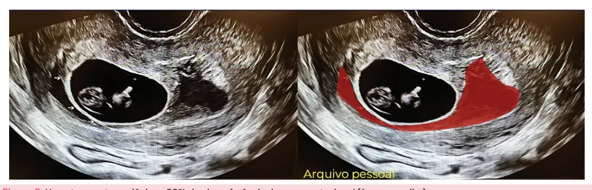
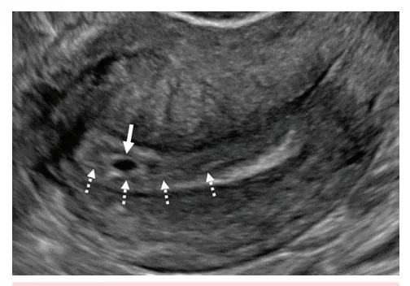
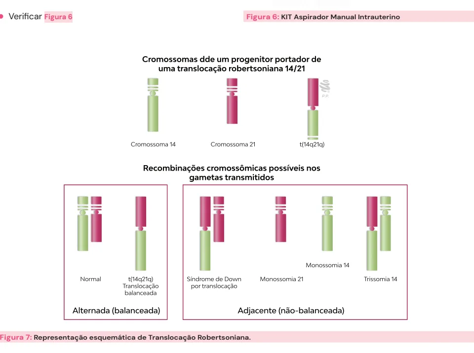
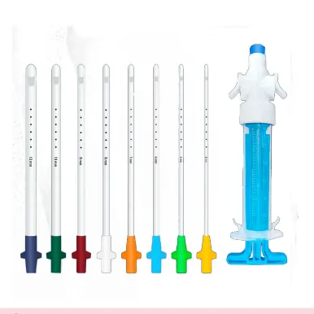

# Abortamento

<!-- page:1 -->

**Tópicos abordados:** Aborto completo, Aborto incompleto, Aborto infectado, Aborto retido, Ameaça de abortamento, Gestação anembrionada, Aborto habitual.

## Tipos de Abortamento

- **Ameaça**: colo fechado, saco gestacional (SG) com ou sem embrião. **Conduta**: orientar e acalmar.
- **Retido**: colo fechado, gestação inviável. **Conduta**: expectante ou ativa.
- **Incompleto**: colo aberto, conteúdo na cavidade (eco endometrial > 15-20mm). **Conduta**: esvaziamento uterino.
- **Completo**: colo fechado ou aberto, sangramento reduz, sem conteúdo na cavidade. **Conduta**: seriar BhCG.
- **Infectado**: sinais clínicos de infecção. **Conduta**: antibioticoterapia + esvaziamento uterino.

## Definição

- É a interrupção da gestação antes de **20-22 semanas** e/ou feto com peso **≤ 500 gramas**.

## Classificação

- **Precoce**: < 12 semanas;
- **Tardio**: ≥ 12 semanas;
- **Espontâneo x induzido**.

## Causas

**Anomalias cromossômicas:**

- Responsáveis por **70-80%** dos abortamentos;
- Trissomias, monossomias, poliploidias.

**Anatômicas/estruturais:**

- Leiomiomatose;
- Polipose;
- Malformação mülleriana;
- Incompetência istmocervical.

**Causas sistêmicas/metabólicas:**

- Diabetes mellitus;
- Tireoidopatias;
- Síndrome de Cushing;
- Álcool/drogas;
- Tabagismo;
- Medicamentos;
- **Síndrome do Anticorpo Antifosfolípide (SAAF)**: mecanismo imunológico.

> **Obs.:** as bancas examinadoras cobram o diagnóstico diferencial e a conduta!

### Abortamento de Repetição

- **2 ou mais** consecutivas confirmadas;
- **Investigação**:
  - Hábitos e vícios;
  - Metabólica: glicemia de jejum + TSH + obesidade;
  - Cariótipo do casal;
  - Anatômica: ultrassonografia transvaginal com histeroscopia ou histerossalpingografia ou ressonância de pelve;
  - Síndrome do Anticorpo Antifosfolípide: anticorpos anti-cardiolipina + anti-β2-glicoproteína-1 + anticoagulante lúpico.

## Quadro Clínico por Tipo

**Ameaça**

- Sangramento em pequena quantidade;
- Colo uterino fechado;
- Ultrassonografia (USG) evidencia imagens compatíveis com a idade gestacional (saco gestacional, com ou sem embrião na cavidade uterina).

**Retido**

- Sangramento em pequena quantidade;
- Colo uterino fechado;
- Gestação inviável.

**Incompleto**

- Sangramento em moderada a grande quantidade;
- Colo uterino aberto;
- Presença de conteúdo na cavidade uterina (eco endometrial **≥ 15 a 20mm**).

**Completo**

- Sangramento em moderada ou grande quantidade, que vai reduzindo sozinho;
- Colo uterino fechado ou aberto;
- Ausência de conteúdo na cavidade uterina; eco endometrial **< 15-20mm**.

**Infectado**

- Qualquer um dos anteriores, com sinais clínicos de infecção.

## Aborto Inevitável (Em Curso)

- Há dilatação do colo uterino ao exame físico;
- Percepção das membranas ou embrião ao toque;
- Demonstra sangramento, cólica e útero compatível com a idade gestacional;
- Prescinde ultrassonografia;
- É necessária uma **conduta ativa** pelo profissional da saúde!

---

<!-- page:2 -->

## Evolução Normal da Gravidez

- À medida que a gravidez evolui, alguns marcos ultrassonográficos podem ser visualizados:
  - **≥ 4 semanas**: saco gestacional;
  - **≥ 5 semanas**: vesícula vitelínica;
  - **≥ 6 semanas**: embrião.

Figura 1: Ultrassonografia transvaginal com saco gestacional tópico em fundo do útero (seta fina) e reação decidual (seta tracejada).

Figura 2: Gestação com saco gestacional e vesícula vitelínica.

## Sinais de Mau Prognóstico

- Saco gestacional irregular;
- Atividade cardíaca **< 100 bpm** entre 5 e 7 semanas;
- Hematoma subcoriônico **> 25%** do diâmetro total do saco gestacional.

Figura 3: Embrião visualizado dentro do saco gestacional.

Figura 5: Hematoma retrocoriônico > 50% da circunferência do saco gestacional (área vermelha).

## Gestação Não Evolutiva

**Gestação Anembrionada**

- Diâmetro interno médio (DIM) do saco gestacional **≥ 25 mm** sem embrião e/ou vesícula vitelínica em seu interior.

Figura 4: Gestação anembrionada.

**Aborto Retido (gestação inviável)**

- Embrião com CCN **≥ 7 mm** sem atividade cardíaca;
- DIM do saco gestacional < 25mm e sem vesícula vitelínica → repete-se o exame em **≥ 14 dias** e não surge um embrião com atividade cardíaca;
- DIM do saco gestacional < 25mm e com vesícula vitelínica → repete-se o exame em **≥ 11 dias** e não surge um embrião com atividade cardíaca.

---

<!-- page:3 -->

## Condutas nos Abortamentos

**Gerais:**

- Avaliar a estabilidade hemodinâmica;
- Fazer a tipagem sanguínea: imunoglobulina anti-D se o pai for Rh positivo (ou desconhecido) e a mãe Rh negativo;
- Realizar estudo anatomopatológico quando possível;
- Orientar a contracepção e acolher as pacientes!

**Ameaça de Abortamento:**

- Vigilância clínica;
- Orientações gerais e uso de sintomáticos.

**Abortamento Retido:**

- Conduta expectante: esperar a eliminação em até **28 dias**;
- Conduta ativa: misoprostol + curetagem ou AMIU (aspiração manual intrauterina).
- Em IG > 12 semanas, há o risco da presença de espículas ósseas, portanto, deve-se aguardar eliminação do produto conceptual antes de curetar/aspirar, pelo alto risco de perfuração intrauterina.

**Abortamento Incompleto:**

- Curetagem ou AMIU.

**Abortamento Completo:**

- Seriar beta-hCG se não houver material para anatomopatológico (excluir possibilidade de gestação molar).

**Abortamento Infectado:**

- Esvaziamento + antibioticoterapia: gentamicina + ampicilina + clindamicina ou metronidazol, por no mínimo **48 horas afebril**;
- Medidas para sepse, se necessário.

## Abortamento de Repetição

- Define-se por **dois ou mais** abortos consecutivos confirmados;
- Acomete **1/200 casais**;
- Exige investigação.

**Propedêutica:**

- Cariótipo do casal;
- Outros exames: sorologia para HIV, sífilis e hepatites;
- Doenças sistêmicas/metabólicas: glicemia de jejum, TSH e obesidade;
- Avaliar hábitos e vícios;
- Realizar a avaliação anatômica: USG transvaginal + histeroscopia ou histerossalpingografia; ressonância magnética de pelve;
- Investigar Síndrome do Anticorpo Antifosfolípide: anticorpos anticardiolipina + anti-β2-glicoproteína-1 + anticoagulante lúpico;
- Em caso de alteração de algum dos exames → repetir a dosagem em, pelo menos, 12 semanas.

Figura 6: KIT Aspirador Manual Intrauterino.

Figura 7: Representação esquemática de Translocação Robertsoniana.

---

<!-- page:4 -->

## Referências

Figura 1: Ultrassonografia transvaginal com saco gestacional tópico em fundo do útero (seta fina) e reação decidual (seta tracejada). Rodgers SK, Horrow MM, Doubilet PM, Frates MC, Kennedy A, Andreotti R, Brandi K, Detti L, Horvath SK, Kamaya A, Koyama A, Lema PC, Maturen KE, Morgan T, Običan SG, Olinger K, Sohaey R, Senapati S, Strachowski LM. A Lexicon for First-Trimester US: Society of Radiologists in Ultrasound Consensus Conference Recommendations. Radiology. 2024 Aug;312(2):e240122. doi: 10.1148/radiol.240122.

Figura 2: Gestação com saco gestacional e vesícula vitelínica. Arquivo Medcof.

Figura 3: Embrião visualizado dentro do saco gestacional. Arquivo Medcof.

Figura 4: Gestação anembrionada. Arquivo Medcof.

Figura 5: Hematoma retrocoriônico > 50% da circunferência do saco gestacional (área vermelha). Arquivo Medcof.

Figura 6: KIT Aspirador Manual Intrauterino. Manual Vacuum Aspiration Kit (MVA Kit). GST Corporation Limited. Disponível em: https://medium.com/@killervictor45/manual-vacuumaspiration-kit-mva-kit-991af7cca753

Figura 7: Representação esquemática de Translocação Robertsoniana. Arquivo Medcof.
