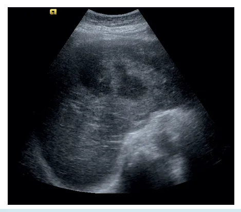
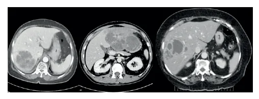

# Abscesso Hepático

<!-- page:1 -->

Abdome Agudo

## Abscesso Hepático Piogênico

**Definição**: infecção encapsulada do parênquima hepático.

- Quadro mais **crônico/subagudo**;
- Quadro intra-abdominal prévio;
- **Dor abdominal em HCD + febre + hepatomegalia**;
- Infecção prévia / fatores de risco;
- Inapetência, astenia, perda de peso, náuseas;
- Infecção arrastada hepática; mais comum no **lobo direito**;
- Diferencial com hepatites;
- Icterícia (mais comum no piogênico);
- **TTO**: ATB por tempo prolongado;
- **Drenagem percutânea**:
  - Abscessos **< 4 cm** = drenagem por aspiração;
  - Abscessos **> 4 cm** = drenagem guiada e manter um dreno;
- **Cirurgia**:
  - Abscessos múltiplos ou loculados;
  - Com conteúdo viscoso espesso;
  - Ou outra doença que requeira tratamento cirúrgico;
  - Ou refratários ao tratamento.

### Diagnóstico

- **USG**: exame inicial;
- **TC**: melhor exame.

## Abscesso Hepático Amebiano

- Paciente proveniente de área endêmica;
- Quadro de diarreia meses antes;
- **TTO**: antimicrobianos com ação luminal (**paromomicina**) + antimicrobianos com ação tecidual (**metronidazol**).

## Etiologias

### Amebiano

- **Entamoeba histolytica**;
- Áreas endêmicas;
- Jovens, homens, imunossuprimidos.

### Piogênico

- Disseminação portal de infecções intra-abdominais (apendicite aguda);
- Disseminação local de infecções de vias biliares (colecistite, colangite);
- Disseminação arterial de infecções sistêmicas (endocardite);
- Criptogênico, trauma.

*Figura 1: Tomografia - abscesso hepático em lobo direito com realce periférico.*

## Clínica

- Quadro subagudo/crônico;
- Dor abdominal em hipocôndrio direito + febre + hepatomegalia;
- Inapetência, astenia, perda de peso, náuseas;
- Infecção arrastada hepática, mais comum no lobo direito;
- Diferencial com hepatites e abdome agudo inflamatório;
- Icterícia é mais comum no piogênico.

*Figura 2: Ultrassonografia com suspeita de abscesso hepático.*

## Diagnóstico

- História, exames laboratoriais (leucocitose, enzimas hepáticas), hemocultura;
- Diagnóstico mais difícil, por isso é necessário ter alta suspeição, principalmente em quadros mais arrastados;
- Solicitar exame de imagem: **TC de abdome ou USG**;
- Verificar Figura 1.

## Tratamento

### Amebiano

- Antibiótico com ação luminal: **paromomicina**;
- Antibiótico com ação tecidual: **metronidazol**;
- Tratamento por **7-10 dias**;
- Drenagem raramente é necessária;
- O teste de fezes é negativo para amebíase (por ser um quadro arrastado).

---

<!-- page:2 -->

### Piogênico

- Antibióticos por tempo prolongado, de **4-6 semanas**: **ceftriaxona + metronidazol**;
- Caso sem resposta, ou de acordo com CCIH: **tazocin**.
- **Drenagem percutânea**:
  - Abscessos < 4 cm: drenagem por aspiração;
  - Abscessos > 4 cm: drenagem guiada e manter um dreno;
  - Retirar dreno quando houver débito mínimo e com controle de imagem.
- **Cirurgia** em abscessos hepáticos:
  - Abscessos múltiplos ou loculados;
  - Conteúdo viscoso espesso;
  - Refratário ao tratamento inicial;
  - Investigar a causa base.

## Microbiologia Específica

- Bactéria mais comum: **E. coli**;
- Associado a doenças a distância, procedimentos: *Streptococcus* spp;
- Procedimentos cirúrgicos: *Staphylococcus aureus*;
- Imunossupressão, quimioterapia: *Candida* spp;
- Tumor colorretal, Ásia, Oceania: *Klebsiella pneumoniae*;
- Abscessos com culturas negativas: tuberculose;
- Região endêmica: *Entamoeba histolytica*.

*Figura 1: Tomografia - abscesso hepático em lobo direito com realce periférico.*
Fonte: Case courtesy of Ammar Ashraf, Radiopaedia.org, rID: 82036

*Figura 2: Ultrassonografia com suspeita de abscesso hepático.*
Fonte: Case courtesy of Teresa Fontanilla, Radiopaedia.org, rID: 3089

## Referências
