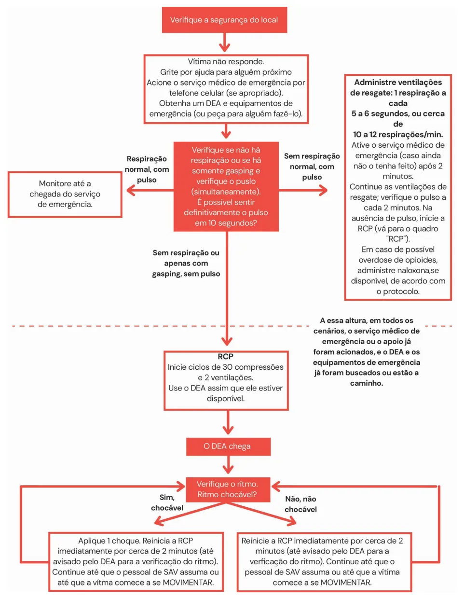
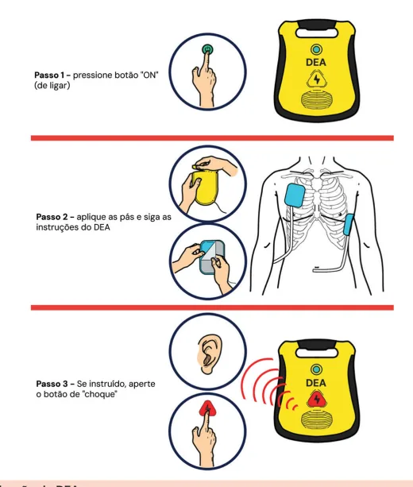
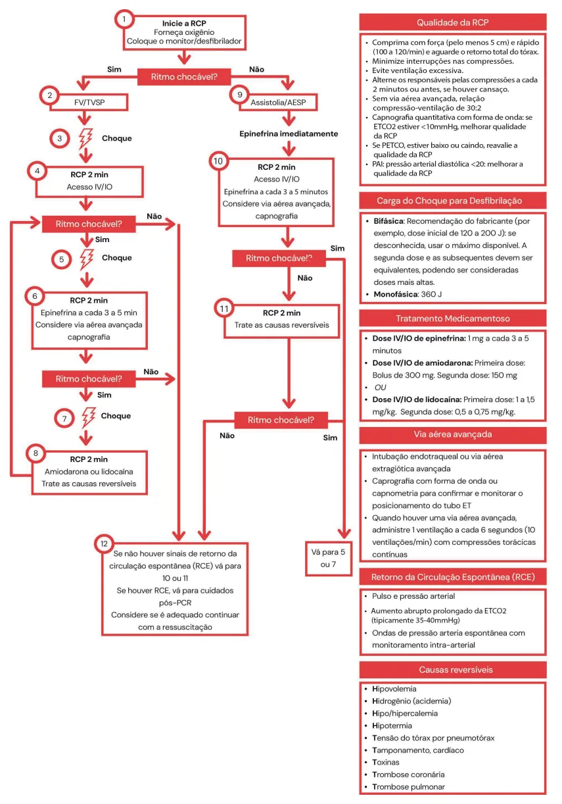
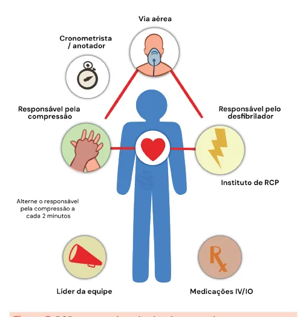
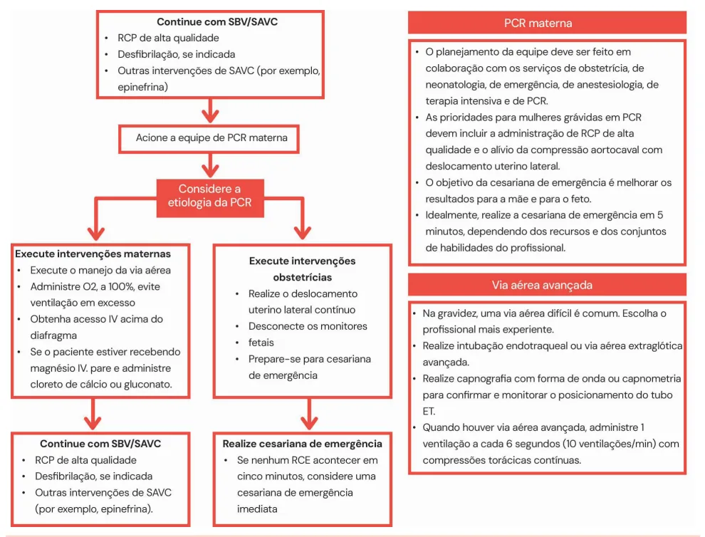

# ACLS e BLS

<!-- page:1 -->

## BLS — Causas Reversíveis de PCR

- Segurança da cena, pedir ajuda → **DEA**;
- **5Hs e 5Ts** → pensar a todo momento durante a PCR, principalmente em ritmos não chocáveis:
  - **5Hs**: hipoxemia, hidrogênio (acidose), hiper/hipocalemia, hipotermia, hipovolemia;
  - **5Ts**: trombose coronária (IAM), TEP, tamponamento cardíaco, pneumotórax hipertensivo, toxinas.
- Checar respiração e pulso:
  - Normal → monitorização;
  - Com pulso, sem respiração → prover ventilação, **1 a cada 6 segundos**, vigilância para PCR;
  - Sem pulso, sem respiração → **PCR**, iniciar RCP imediatamente.
- Na chegada do DEA, a prioridade passa a ser colocar o dispositivo para análise de ritmo e choque, se indicado.

### Monitorização

- **Capnografia (EtCO2)** fornece feedback da qualidade da RCP:
  - **< 10** → melhorar a RCP;
  - Se se mantém **< 10 em 20 min** apesar da otimização da RCP → pior prognóstico.
- **PAI (pressão arterial invasiva - PA diastólica)**: buscamos valor **> 20** (feedback positivo acerca da qualidade da RCP) → só utilizar no paciente que já estava em uso de PAI antes da PCR;
- Sinais vitais, aumento de EtCO2 → checar se houve **RCE**.

### ACLS

- Definir ritmo:
  - **Chocável (FV/TV)** → aplicar choque: **200 J bifásico** e **360 J monofásico**;
  - **Não chocável (AESP/assistolia)** → sem choque.

### Compressões Torácicas

- **100-120/min**, profundidade **5-6 cm**, minimizar interrupções, trocar massageador a cada 2 min, permitir retorno completo do tórax a cada compressão.

### Ventilação

- Não é imperativo intubar o paciente;
- **30:2** se sem via aérea definitiva; ventilação ininterrupta, **1 ventilação a cada 6-8 segundos** se via aérea definitiva.

### RCE

- Ver o paciente da cabeça aos pés;
- ECG → supra → **CATE**;
- O objetivo da temperatura no RCE atualmente não é mais esfriar, mas sim o paciente não fazer febre (manter entre **32-37,5ºC**).

### Drogas

- **Adrenalina**: todos os ritmos, **1 mg a cada 3-5 minutos**;
- **Amiodarona OU lidocaína** (FV/TV) na arritmia refratária à desfibrilação.

### Populações Específicas

- **Cesárea post-mortem**: 5 minutos de PCR em uma gestante → realizar!

## BLS - Basic Life Support

### Cadeia de Atendimento

Ativação da resposta de emergência → RCP de alta qualidade → Desfibrilação → Ressuscitação avançada → Cuidados pós-parada cardíaca → Recuperação.

Figura 1: Cadeia de atendimento da PCR extra-hospitalar.

### Fluxograma de Atendimento

- Garantir a segurança do local;
- Verificar responsividade da vítima e, caso não haja, direcionar conduta e funções aos indivíduos transeuntes no local: delegar função para ligar ao serviço médico e buscar o DEA; em situações atípicas (sem a possibilidade de auxílio), tentar ligar ao serviço de emergência para buscar auxílio;
- Verificar presença de pulso (em sítios centrais) e de incursões respiratórias:
  - Respiração normal e pulso presente → monitorizar e aguardar chegada do serviço de emergência;
  - Sem respiração e com pulso → utilizar "pocket mask" ou respiração boca a boca: na presença de AMBU, fornecer 1 ventilação a cada 6 segundos;

---

<!-- page:2 -->

- Sem respiração, ou apenas com gasping, sem pulso → iniciar massagem cardíaca – protocolo de RCP: ciclos de **30 compressões + 2 ventilações**.

### Chegada do DEA

- Instrumento feito para que leigos possam manejar um choque efetivo:
  - **Passo 1**: pressione o botão "ON";
  - **Passo 2**: aplicar as pás, seguir as instruções do DEA, checagem de ritmo;
  - **Passo 3**: se instruído, aperte o botão de "CHOQUE": pedir para todos se afastarem antes de administrar.
- **Ritmo chocável** → aplicar 1 choque + reiniciar RCP imediatamente, por 2 minutos: o DEA avisa quando der os 2 minutos para nova checagem de ritmo;
- **Ritmo não chocável** → reiniciar RCP imediatamente por 2 minutos.

Figura 2: Fluxograma de atendimento à PCR pré-hospitalar (algoritmo do atendimento básico de vida - BLS).

---

<!-- page:3 -->

Figura 3: Passo a passo da utilização do DEA.

Tabela 1: Sistematização do suporte básico de vida adulto.

> ⚠️ Tabela reconstruída a partir de OCR — confira contra a fonte original.

| Avaliação | Técnica e ação |
|---|---|
| Verificar segurança da cena e responsividade | Após avaliar a segurança da cena, toque no ombro e chame em voz alta: "você está bem?" |
| Acionar o serviço médico de emergência | Peça por ajuda para alguém próximo/grite por ajuda; acione o sistema de resposta de emergência; busque o DEA, se disponível, ou encarregue alguém de acionar o serviço médico de emergência e buscar um DEA/desfibrilador |
| Verifique a respiração e o pulso | Para verificar se a respiração está ausente ou anormal (sem respiração ou apenas respiração agônica/gasping), verifique se o tórax se eleva, por no mínimo 5 e no máximo 10 segundos; tente sentir o pulso por no mínimo 5, mas não mais que 10 segundos; execute a verificação de pulso ao mesmo tempo em que verifica a respiração, durante 10 segundos, para minimizar o atraso na RCP |
| Inicie a RCP até a chegada do DEA/ajuda | Se, em 10 segundos, você definitivamente não sentir nenhum pulso, inicie a RCP com compressões torácicas: 100-120 compressões por minuto; profundidade de 5-6 cm; permitindo retorno completo do tórax a cada compressão; mãos no centro do tórax, terço inferior do esterno |
| Desfibrile se indicado | Ligue o DEA e siga as instruções para colocação das pás; se indicado choque, peça para todos se afastarem e administre o choque; reinicie imediatamente a RCP → o DEA avisará quando passados 2 minutos para nova checagem de ritmo; caso o choque não seja indicado, reinicie a RCP imediatamente |

---

<!-- page:4 -->

## ACLS - Advanced Cardiac Life Support

- Protocolo:
  1. Acionamento do serviço médico de emergência;
  2. RCP de alta qualidade;
  3. Desfibrilação;
  4. Ressuscitação avançada;
  5. Cuidados pós-PCR;
  6. Recuperação.

Figura 4: Algoritmo de PCR para adultos.

---

<!-- page:5 -->

- Iniciar RCP: as compressões devem ser com força suficiente para um aprofundamento do tórax de **5-6 cm**, com frequência entre **100-120 bpm**, aguardando o retorno total do tórax;
- Fornecer ventilações: **30 compressões para 2 ventilações** se via aérea avançada não disponível; **1 ventilação a cada 6 segundos** se via aérea avançada;
- Colocar o monitor/desfibrilador – avaliar se o ritmo é chocável:
  - **FV/TVSP** → aplicar choque + reiniciar RCP por 2 minutos;
  - **Assistolia/AESP** → aplicar epinefrina imediatamente, a cada 3-5 minutos + reiniciar RCP por 2 minutos.
- Idealmente, de acordo com o protocolo ACLS, são orientados os locais para melhor posicionamento do líder da equipe e os membros da equipe durante simulações de casos e de eventos clínicos (Figura 5).

Figura 5: RCP com um time de alto desempenho.

Tabela 2: Funções do triângulo de ressuscitação.

> ⚠️ Tabela reconstruída a partir de OCR — confira contra a fonte original.

| Função | Descrição |
|---|---|
| Via aérea | Abre a via aérea; realiza ventilação com bolsa-máscara; insere acessórios na via aérea |
| Responsável pela compressão | Avalia o paciente; executa as compressões de acordo com os protocolos locais; alterna as pessoas a cada 2 minutos ou antes, se houver cansaço |
| Responsável pelo desfibrilador/instrutor de RCP | Busca e opera o DEA/monitor/desfibrilador e age como instrutor de RCP, fornecendo feedback sobre a RCP; se houver um monitor, coloca-o em uma posição em que possa ser visto pelo líder da equipe (ou pela maioria da equipe) |

A equipe tem seu próprio código. Nenhum membro da equipe deixa o triângulo, a não ser para alternar os responsáveis pelas compressões ou proteger a própria segurança.

Tabela 3: Outras funções em uma RCP.

> ⚠️ Tabela reconstruída a partir de OCR — confira contra a fonte original.

| Função | Descrição |
|---|---|
| **Líder** | Atribui funções aos membros da equipe; toma decisões de tratamento, inclusive no que diz respeito às medicações e vias de administração; fornece feedback para o restante da equipe conforme a necessidade; assume responsabilidade por funções não atribuídas |
| **Medicações IV/IO** | Função do profissional de SAV; inicia o acesso IV/IO; administra medicações |
| **Cronometrista/anotador** | Anota os horários das intervenções e medicações (e comunica quando deverão ocorrer as próximas); anota a frequência e a duração das interrupções das compressões; informa isso ao líder da equipe (e ao restante da equipe) |

- A AHA disponibiliza fluxogramas, para leigos e profissionais de saúde, para tratamento de pacientes com possível intoxicação por opioides, nos quais se destaca a utilização de **naloxona** (antídoto).

## Causas Reversíveis

- **5Hs e 5Ts** → pensar a todo momento durante a PCR, principalmente em ritmos não chocáveis:
  - **5Hs**: hipovolemia; hipóxia; hidrogênio, íon (acidose); hipo ou hipercalemia; hipotermia;
  - **5Ts**: tensão no tórax (pneumotórax hipertensivo); tamponamento cardíaco; toxinas; trombose pulmonar (TEP); trombose coronária (IAM).
- Investigar e tratar!

## Drogas

- Dose IV/IO de **epinefrina**: 1 mg a cada 3-5 minutos;
- Dose IV/IO de **amiodarona**: 1ª dose: bolus de 300 mg; 2ª dose: 150 mg;
- OU dose IV/IO de **lidocaína**: 1ª dose: 1-1,5 mg/kg; 2ª dose: 0,5-0,75 mg/kg.

---

<!-- page:6 -->

- **Amiodarona ou lidocaína** podem ser consideradas para FV/TVSP não responsiva a desfibrilação: escolher entre uma OU outra (mesmo nível de evidência); administrar no máximo 2 doses da que escolher.
- **Via aérea avançada**: nem sempre é necessário, priorizada principalmente nos casos de PCR por hipóxia. Quando houver uma via aérea avançada, administre 1 ventilação a cada 6 segundos (10 ventilações/min) com compressões torácicas contínuas.
  - Intubação endotraqueal ou via aérea supraglótica.
  - **Atenção!** A intubação orotraqueal não é mandatória em um cenário de PCR. De outro modo, é imperativo garantir uma boa ventilação!
- **Magnésio**: o uso rotineiro de magnésio para parada cardíaca não é recomendado em pacientes adultos. Pode ser considerado para **Torsades de Pointes** (ou seja, TV polimórfica associada a intervalo QT longo).

### Parâmetros e Monitorização

- **Qualidades da RCP**:
  - Comprima com força (pelo menos 5 cm) e rapidez (100-120/min) e aguarde o retorno total do tórax;
  - Minimize interrupções nas compressões;
  - Evite ventilação excessiva;
  - Alterne as pessoas que aplicam as compressões a cada 2 minutos ou antes, se houver cansaço;
  - Sem via aérea avançada: relação compressão-ventilação de 30:2; com via aérea avançada: 1 ventilação a cada 6 segundos;
  - **Capnografia quantitativa com forma de onda**: se ETCO2 < 10 mmHg, tentar melhorar a qualidade da RCP;
  - **Pressão arterial invasiva**: se pressão na fase de relaxamento (diastólica) < 20 mmHg, tente melhorar a qualidade da RCP;
  - **Carga do choque**: bifásica – recomendação do fabricante (ex.: dose inicial de 120-200 J); se desconhecida, usar máximo disponível; a segunda aplicação e as subsequentes devem ser equivalentes, podendo ser consideradas doses mais altas; monofásica: 360 J.

### Retorno à Circulação Espontânea (RCE)

- Presença de pulso;
- Aumento abrupto e prolongado no ETCO2 (normalmente ≥ 35-40 mmHg);
- Sinal de onda espontâneo na pressão arterial com monitorização intra-arterial.

### Cuidados Pós-PCR

- Avaliar: nível de consciência, via aérea, inspeção pulmonar, eletrocardiograma, diurese, monitorização contínua, necessidade de drogas vasoativas;
- Estabilização hemodinâmica;
- Otimização da ventilação mecânica;
- Controle glicêmico adequado;
- Diagnosticar e tratar isquemias miocárdicas agudas;
- Manter temperatura < 37,5ºC (evitar febre);
- Pacientes no RCE que apresentam ECG com supra, instabilidade elétrica ou hemodinâmica → **CATE imediato**;
- Verificar Figura 6 na próxima página.

---

<!-- page:7 -->

Figura 6: Fluxograma do paciente crítico e cuidados pós-PCR.

> ⚠️ Trecho reconstruído a partir de OCR de duas colunas — confira contra a fonte original.

### RCE Obtido — Fase de Estabilização Inicial

- A ressuscitação é contínua durante a fase pós-RCE e estabilização inicial; muitas destas atividades podem ocorrer ao mesmo tempo. No entanto, se a priorização for necessária, siga estas etapas:
- **Manejo da via aérea**: posicionamento inicial do tubo endotraqueal; capnografia com forma de onda ou capnometria para confirmar e monitorar o posicionamento do tubo endotraqueal;
- **Controle dos parâmetros respiratórios**: inicie com 10 ventilações/min; titule Fio2 para SpO2 entre 92%-98%; titule PaCO2 de 35 a 45 mmHg;
- **Controle dos parâmetros hemodinâmicos**: administre cristaloides e/ou vasopressores ou inotrópicos, visando pressão arterial sistólica **> 90 mmHg** ou pressão arterial média **> 65 mmHg**;
- Obter ECG de 12 eletrodos: considere intervenção cardíaca de urgência, se:
  - IAMST estiver presente;
  - Houver um choque cardiogênico instável;
  - Suporte circulatório mecânico for necessário.

### Manejo Contínuo e Atividades de Urgência Adicionais

- Estas avaliações devem ser realizadas ao mesmo tempo;
- Avalie e trate rapidamente etiologias reversíveis (Hs e Ts);
- Solicite a consulta de especialistas para o manuseio continuado;
- Manter a temperatura do paciente entre 32 e 37,5ºC, evitar febre;
- Atende a comandos? Não → comatoso: evitar febre; realize uma TC de crânio; monitoramento de EEG; outros manejos para atendimento crítico; | Sim → desperto.
- Outros manejos para atendimento crítico:
  - Monitoramento contínuo da temperatura central (esofágica, retal, bexiga);
  - Manutenção de normoxia, normocapnia e euglicemia;
  - Monitoramento contínuo ou intermitente por eletroencefalograma (EEG);
  - Ventilação mecânica protetora dos pulmões.

### Hs e Ts

- Hipovolemia
- Hidrogênio (acidemia)
- Hipo/hipercalemia
- Hipotermia
- Hipóxia
- Tensão do tórax por pneumotórax
- Tamponamento cardíaco
- Toxinas
- Trombose coronária
- Trombose pulmonar

---

<!-- page:8 -->

## PCR na Gravidez e PCR Materna

Figura 7: PCR na gravidez.

- Possível etiologia de PCR materna (mnemônico A-H):
  - **A** – Anestesia (complicações anestésicas);
  - **B** – Hemorragia ("Bleeding");
  - **C** – Cardiovascular;
  - **D** – Medicamentos ("drugs");
  - **E** – Embolia;
  - **F** – Febre;
  - **G** – Causas gerais não obstétricas de PCR (Hs e Ts);
  - **H** – Hipertensão.

## Referências

Figura 1: Cadeia de atendimento da PCR extra-hospitalar. Adaptado de American Heart Association. ECC Guidelines. Disponível em: https://eccguidelines.heart.org/.

Figura 2: Fluxograma de atendimento à PCR pré-hospitalar (algoritmo do atendimento básico de vida). Adaptado de American Heart Association. ECC Guidelines. Disponível em: https://eccguidelines.heart.org/.

Figura 3: Passo a passo da utilização do DEA. Adaptado de American Heart Association. ECC Guidelines. Disponível em: https://eccguidelines.heart.org/.

