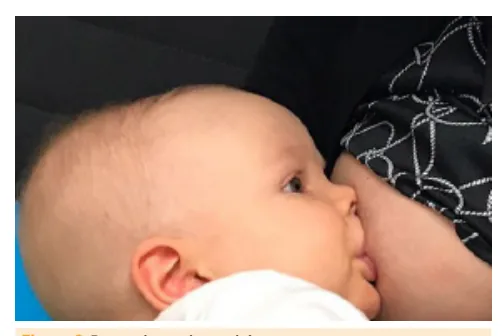
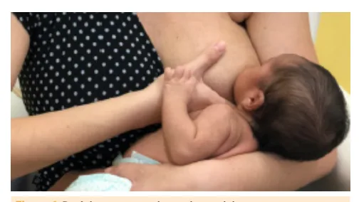

# Aleitamento Materno

<!-- page:1 -->

## Definições

- **Aleitamento materno (AM) exclusivo**: até 6 meses.
- **AM complementado**: pelo menos até 2 anos.

## Fases do leite humano

- **Colostro** — contém mais proteínas e fatores de proteção.
- **Leite de transição**.
- **Leite maduro** — contém mais lipídios, carboidratos e calorias.

## Características do leite humano

- **Fatores de proteção**: IgA, fator bífido, pré e probióticos, oligossacarídeos.
- **Leite humano x leite de vaca**: o leite de vaca é excessivo! Contém mais tudo, exceto lactose.

## Chave do sucesso do aleitamento: técnica adequada

- **Pega**: boca bem aberta, queixo toca a mama, lábio inferior evertido, parte superior da aréola mais visível que a inferior.
- **Posicionamento**: corpo próximo, bebê bem apoiado, rosto em frente à mama, cabeça e tronco alinhados.

## Definições em aleitamento materno (AM)

- **AM exclusivo**: apenas leite materno (LM).
- **AM predominante**: LM + outros líquidos.
- **AM complementado**: LM + alimentos.
- **AM misto/parcial**: LM + outro leite.

## Orientações em AM

- Exclusivo até os 6 meses.
- Livre demanda.
- Complementado pelo menos até 2 anos.
- Iniciar em sala de parto, na 1ª hora (**"Golden Hour"**).

## Lactogênese

- **Fase I** (2ª metade da gestação): preparo da mama — estrogênio + progesterona.
- **Fase II** (primeiros dias após o parto): ↓ progesterona, prolactina age; apojadura entre o 2º e o 4º dia, independente da sucção.
- **Fase III** (galactopoiese): necessário sucção e esvaziamento; prolactina → produção de leite; ocitocina → ejeção de leite.
- **Armazenamento**: medidas de higiene; armazenar em geladeira por até 12h ou congelador por até 15 dias; frasco de vidro com tampa de plástico; aquecer em banho-maria com fogo desligado; oferecer em copo/colher.
- **Dificuldades** — corrigir a técnica, manter o AM, reavaliação precoce:
  - **Fissura**: variar as posições, manter a mama seca.
  - **Ingurgitamento**: esvaziar a mama.
  - **Mastite**: antibiótico.
  - **Candidíase**: antifúngico tópico na mãe e no bebê.
  - **Baixo ganho de peso**: avaliar diurese, evacuação, hidratação.

## Contraindicações

- **Absolutas**: mãe com HIV, HTLV ou uso de quimioterápico (QTX); RN com galactosemia.
- **Suspensão temporária**: herpes na mama, uso de substâncias, Chagas aguda, vacina de febre amarela (se bebê < 6 meses — suspender por 10 dias).
- **Manter com uso de máscara**: tuberculose, influenza, COVID.

## Fases do leite materno (LM)

- **Colostro** (até 3-5 dias): mais proteínas, eletrólitos, fatores de proteção, vitaminas lipossolúveis (A).
- **Leite de transição**.
- **Leite maduro** (> 10-15 dias): mais lipídios, calorias, lactose.

## Características do LM

- **Água**: 90%.
- **Principal carboidrato**: lactose.
- **Principal proteína**: lactoalbumina (proteínas do soro/caseína).
- **LC-PUFA** (DHA, ARA): desenvolvimento neurológico e retiniano.
- **Fatores de proteção**:
  - **IgA**: proteção de mucosas.
  - **Oligossacarídeos (HMO)**: impedem a ligação de bactérias na mucosa, modulam a microbiota.
  - **Prebióticos** (GOS e FOS) e **probióticos**.
  - **Fator bífido**: bifidobactérias (acidifica as fezes).
  - Lisozima, lactoferrina, leucócitos.
  - Lactobacilos e bifidobactérias: presentes no LM, formam a microbiota.

---

<!-- page:2 -->

## Comparação: leite humano (LH) x leite de vaca (LV)

> ⚠️ Tabela reconstruída a partir de OCR — confira contra a fonte original antes de memorizar os valores.

| Componente | Leite Humano (LH) | Leite de Vaca (LV) |
|---|---|---|
| Proteína | + | +++ (caseína) |
| Lipídio | ++ | ++ |
| Calorias | +++ | +++ |
| Lactose | +++ | + |
| Eletrólitos | + | +++ (excesso de Ca, P, Na) |
| Ferro | Bem absorvido | Mal absorvido |
| Vitaminas | Vit. D, K | Pouca vit. D, E e C |

*Tabela 1: Diferenciação da composição do leite humano em relação ao leite de vaca. Ca: cálcio; P: fósforo; Na: sódio; Vit.: vitamina.*

- **LM pré-termo**: mais proteína, lipídio, caloria e fatores de proteção; menos lactose.
- **Fórmula infantil**: LV modificado.

## Benefícios do AM

### Bebê

- Composição nutricional adequada à demanda e capacidade digestiva/renal.
- ↓ Mortalidade infantil.
- ↓ Síndrome da morte súbita do lactente.
- ↓ Diarreia e infecções respiratórias.
- ↓ Atopia (asma, rinite, dermatite).
- ↓ Doenças crônicas (obesidade, diabetes, leucemia).
- Desenvolvimento cognitivo, intelectual e da cavidade oral.
- Vínculo mãe-bebê.

### Mãe

- Vínculo mãe-bebê.
- ↓ Hemorragia pós-parto.
- Economia e praticidade.
- ↓ Câncer de mama/ovário/endométrio.
- Amenorreia lactacional.
- ↓ Diabetes tipo 2 e depressão pós-parto.

### Outros

- Melhor para o meio ambiente.

## NBCAL

- **Norma Brasileira de Comercialização de Alimentos para Lactentes e Crianças de Primeira Infância, Bicos, Chupetas e Mamadeiras (NBCAL)**.
- Proíbe propagandas desses produtos, vigia rótulos e fabricação.

## Técnica do AM

- **Posicionamento**: rosto do bebê de frente para a mama; corpo próximo ao da mãe; bebê com cabeça e tronco alinhados; bebê bem apoiado.

*Figura 1: Posicionamento adequado no aleitamento.*

- **Pega**: queixo toca a mama; lábio inferior evertido; boca bem aberta; aréola mais visível acima.

*Figura 2: Pega adequada no aleitamento.*

- **Técnica inadequada**: bochecha encovada; ruído da língua; mama esticada ou deformada; mamilo achatado após o AM; dor e fissuras mamárias.

---

<!-- page:3 -->

## Ordenha e armazenamento

- Higiene: lavar até os cotovelos com água e sabão, lavar as mamas com água, usar touca e máscara.
- Massagem da mama.
- Ordenha manual (em "C") ou com bomba.
- Desprezar os primeiros jatos.
- Armazenar em frasco de vidro com tampa de plástico.
- **Geladeira**: até 12 horas. **Congelador**: até 15 dias.
- Descongelar em banho-maria (fogo desligado).
- Oferecer via copo ou colher dosadora.

## Dificuldades no AM

**Objetivo: corrigir a técnica e manter o AM.**

- Trauma mamilar.
- Ingurgitamento.
- Candidíase.
- Mastite/abscesso mamário.
- Baixo ganho ponderal.

## Trauma mamilar, fissura, dor

- Manter a aréola seca.
- Aplicar LM.
- Iniciar pela mama menos afetada.
- Interromper a mamada adequadamente.
- Ordenhar antes.
- Variar as posições.
- Não usar intermediários (bicos/protetores).
- Analgesia materna via oral (VO).

## Ingurgitamento mamário

- Fisiológico x patológico.
- Produção maior que o consumo.
- Bilateral, edema, dor, "empedrado", tensa.
- **Conduta (CD)**: livre demanda; massagear e ordenhar antes e, se necessário, após; analgesia; compressa fria; sutiã firme.

## Candidíase mamária

- Dor, prurido, ardor/fisgadas, pele friável, descamação.
- **CD**: manter o mamilo seco, expor à luz solar, retirar bicos.
- Tratar mãe (tópico) e bebê (tópico oral).
- **Diagnóstico diferencial**: fenômeno de Raynaud mamário — isquemia intermitente dos mamilos (palidez, dor intensa, fisgadas, queimação). Evitar expor os mamilos ao frio.

## Mastite puerperal

- Inflamação ± infecção bacteriana (*S. aureus*).
- **Quadro clínico (QC)**: hiperemia e edema localizados, calor local, dor, febre.
- **CD**: manter o AM; anti-inflamatórios não esteroidais (AINEs) se sem melhora em 24h; esvaziar as mamas; antibiótico (ATB) VO (cefalexina, amoxicilina com clavulanato).

## Abscesso mamário

- **QC**: flutuação, descarga purulenta.

## Não há "leite fraco"!

- **Avaliar sinais objetivos de baixa ingesta**:
  - Perda de peso fisiológica (até 10%; atenção ao AM a partir de 8%). Ganho de peso esperado: 1º trimestre 20-30 g/dia.
  - Examinar o recém-nascido (RN): desidratação, hipernatremia, letargia.
  - Diurese e evacuação (< 4 evacuações/dia com 4 dias de vida, ou mecônio após o 5º dia).
- Avaliar a técnica do AM.
- **CD**: normalmente orientar a técnica, manter o AM e retorno precoce.
- Se atraso da apojadura e sinais de ingesta insuficiente, considerar: insuficiência glandular primária (< 5%), cirurgia mamária prévia, interrupção temporária do AM (separação da mãe e do bebê).
- **Se necessidade de suplementar**: 1ª escolha — leite materno ordenhado (LMO): copo, colher, translactação; 2ª escolha — LH do banco de leite; 3ª escolha — fórmula infantil (FI).

## Contraindicações e situações especiais no AM

- **Absolutas**:
  - Mãe: HIV, HTLV, uso de medicamentos (quimioterápico, imunossupressor).
  - RN: galactosemia.
- **Amamentação cruzada**: não é recomendada.

## Situações especiais

**Suspender temporariamente:**

- **Tuberculose (TB) bacilífera**: após início do tratamento (TTO) materno, manter AM com medidas de higiene (uso de máscara cirúrgica, ambiente arejado) até que a mãe esteja abacilífera (2 semanas após início do TTO).
  - Se mastite tuberculosa: suspensão temporária.
  - TB multidroga-resistente: separar mãe e criança até que a mãe esteja abacilífera; oferecer LM ordenhado.
- **Herpes na mama afetada**.
- **Doença de Chagas** em fase aguda ou lesão mamilar sangrante.

---

<!-- page:4 -->

- **Hanseníase**: Virchowiana — suspender até 3 meses de TTO (se sulfona) ou 3 semanas (se rifampicina). Formas não contagiosas — manter.
- **Mãe com varicela** 5 dias antes do parto ou até 2 dias após o parto: isolamento até a fase de crosta; RN recebe imunoglobulina em até 96h.
- **Leptospirose** na fase aguda.
- **Uso ocasional de substâncias**: álcool — 2h/dose; maconha, cocaína, crack, heroína — 24h; anfetamina e ecstasy — 24 a 36h; LSD — 48h.

**Manter AM com medidas de higiene:**

- Influenza, COVID.
- Hepatites.
- Arboviroses.
- Caxumba.
- Tabagismo.
- Lactogestação.
- Amamentação em tandem.

**Situação especial:**

- Citomegalovírus em RN < 30 semanas ou < 1500 g: apenas LH pasteurizado.
- Sarampo: isolamento por 4 dias; oferecer LM ordenhado.
- Coqueluche se RN: isolamento por 5 dias; oferecer LM ordenhado.

## Desmame

**Fase do desenvolvimento:**

- **Desmame natural**: entre 2-4 anos.
- **Desmame abrupto**: deve ser evitado.
- **Desmame guiado ou conduzido** (guiado pela mãe):
  - Ministério da Saúde (MS): manter AM; deixa de ser livre demanda; elimina mamadas noturnas.
  - Sociedade Brasileira de Pediatria (SBP): adiamento e encurtamento das mamadas, distração.

## Indicativos de que a criança está madura para o desmame

- Menos interesse nas mamadas.
- Aceita bem outros alimentos.
- Segura na relação com a mãe.
- Aceita outras formas de consolo.
- Aceita não ser amamentada em certas ocasiões e locais.
- Dorme sem mamar no peito.
- Pouca ansiedade quando encorajada a não mamar.
- Prefere brincar ou fazer outra atividade com a mãe em vez de mamar.

## Referências

Figura 1: Posicionamento adequado no aleitamento. Guia alimentar para crianças brasileiras menores de 2 anos / Ministério da Saúde, Secretaria de Atenção Primária à Saúde, Departamento de Promoção da Saúde. – Brasília: Ministério da Saúde, 2019. 265 p.: il.

Figura 2: Pega adequada no aleitamento. Guia alimentar para crianças brasileiras menores de 2 anos / Ministério da Saúde, Secretaria de Atenção Primária à Saúde, Departamento de Promoção da Saúde. – Brasília: Ministério da Saúde, 2019. 265 p.: il.
