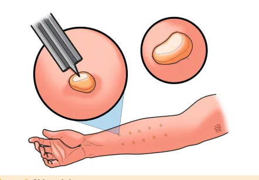
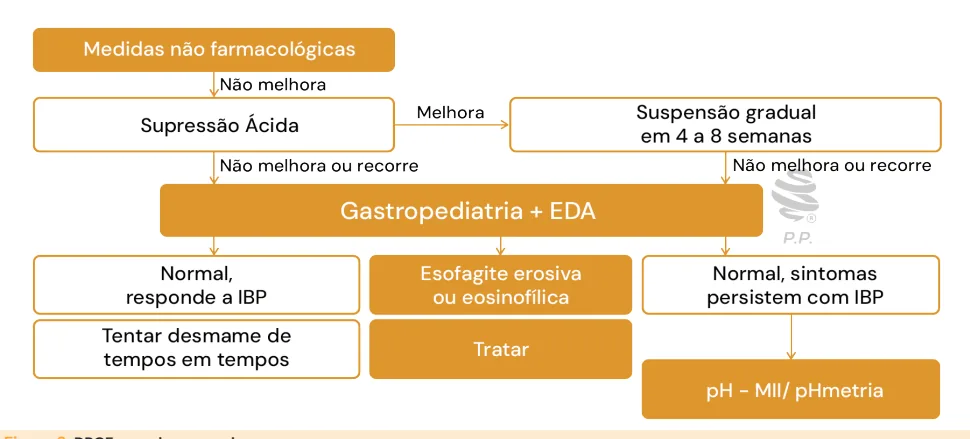
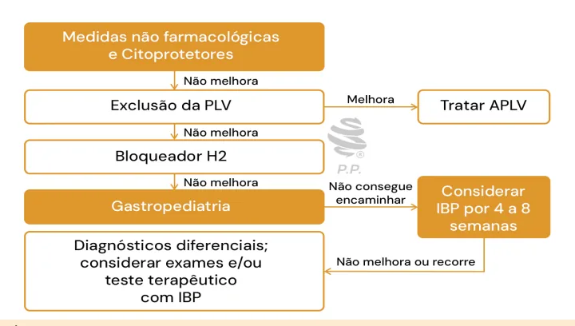

# Alergia Alimentar, Refluxo e Constipação

<!-- page:1 -->

## Alergia à Proteína do Leite de Vaca (APLV)

- **Fenótipos clínicos:**
  - Quadros **mediados por IgE**: urticária, angioedema, anafilaxia, síndrome da alergia oral
  - **Não mediados por IgE**: proctocolite, enterocolite induzida por proteína alimentar (**FPIES**)
  - **Mistos**: esofagite eosinofílica
- **Diagnóstico:** dieta de eliminação seguida do teste de provocação oral
- **Tratamento:**
  - Lactentes: restrição materna se em aleitamento materno exclusivo (AME); trocar por fórmula extensamente hidrolisada se em uso de fórmula
  - Crianças maiores e adolescentes: medidas não farmacológicas → supressão ácida → gastropediatra e endoscopia digestiva alta (EDA)

## Refluxo Fisiológico — Critérios de Roma IV

- Lactente saudável com idade entre 3 semanas e 12 meses
- **2 ou mais regurgitações por dia**, por pelo menos 3 semanas
- Ausência de: aspiração, perda de peso e postura anormal, apneia, náuseas, hematêmese, alimentação/deglutição alterados
- **Conduta:** orientar e tranquilizar os pais!

## Doença do Refluxo Gastroesofágico (DRGE)

- Lactentes: medidas não farmacológicas e citoprotetores → exclusão da PLV → bloqueador H2 → gastropediatra → **inibidor de bomba de prótons (IBP)**

## Alergia Alimentar

- Reação adversa desencadeada por um alimento específico
- Mediada por uma resposta imunológica que ocorre de forma reprodutível
- Principais alérgenos: leite de vaca, ovo, trigo, amendoim, castanhas, peixes e crustáceos

## Fisiopatologia

- **Mediada por IgE** → resposta humoral
- **Não mediada por IgE** → resposta celular
- **Mista**

## Quadro Clínico

- **Gerais:** perda de peso, anemia, anorexia
- **Pele:** urticária, dermatite atópica
- **Respiratórias** (raramente de forma isolada): broncoespasmo, infecções de repetição
- **Sistêmicas:** anafilaxia
- Considerar APLV se: história familiar de atopia, sintomas multissistêmicos, dermatite moderada a grave, sintomas gastrointestinais que não respondem a tratamentos habituais

## Constipação Intestinal Funcional (CIF)

**Critérios diagnósticos:** ≥ 2 dos seguintes durante ≥ 1 mês (< 4 anos) / uma vez por semana por ≥ 1 mês (≥ 4 anos):

- ≤ 2 evacuações/semana
- Retenção
- Dor ou dificuldade para evacuar
- Fezes de grande calibre/volumosas que obstruem o vaso sanitário
- Grande massa fecal no reto
- ≥ 1 episódio de incontinência/semana (com controle esfincteriano)

**Tratamento:**

- **Desimpactação:** polietilenoglicol (**PEG**) 1 a 1,5 g/kg/dia OU enema uma vez ao dia por 3 a 5 dias
- **Manutenção:** PEG 0,2 a 0,8 g/kg/dia OU lactulose 1 a 3 mL/kg
- **Alimentação:** ingesta adequada de fibras e líquidos
- Educação e orientação

## Fenótipos Clínicos (APLV)

- **Mediados por IgE:** urticária, angioedema, anafilaxia, síndrome da alergia oral
- **Não mediados por IgE:** proctocolite, enteropatia, enterocolite induzida por proteína alimentar (FPIES), transtornos de motilidade (RGE, cólica e constipação)
- **Mistos:** esofagite e gastrite eosinofílicas

## Alergia à Proteína do Leite de Vaca (APLV)

- **Alergia alimentar mais comum na infância**
- Alérgenos: alfa-lactoalbumina, beta-lactoglobulina, albumina e caseína
- Pode se iniciar com a interrupção do aleitamento materno exclusivo (AME) e introdução de fórmulas com proteína do leite de vaca; desde o nascimento, por sensibilização transplacentária; ou pelo leite materno, por antígenos ingeridos pela mãe

---

<!-- page:2 -->

## Proctocolite Alérgica

- Sexo masculino
- Primeiros 6 meses de vida
- 60% estão em aleitamento materno exclusivo (AME)
- Sangue nas fezes, com ou sem alteração de consistência
- Bom peso e estado geral
- **Duração:** 2 a 4 semanas (na enteropatia, pode ser necessário 4-8 semanas até resolução)
- **Teste de provocação oral (TPO)** confirma o diagnóstico

## Enteropatia Induzida por Proteína Alimentar

- Síndrome disabsortiva insidiosa
- Diarreia crônica (aquosa e ácida), eritema perianal, distensão abdominal, anemia, insuficiência do crescimento
- Ocorre nos primeiros meses de vida (após introdução da PLV)

## Síndrome de Enterocolite Induzida por Proteínas Alimentares (FPIES) Aguda

- Lactentes, principalmente no primeiro contato (entre 2 e 7 meses)
- Crises de vômitos profusos associadas a sintomas sistêmicos e neutrofilia, seguidas de diarreia

**Critérios diagnósticos:** critério maior + 3 critérios menores

**Critério maior:**
- Vômitos 1 a 4h após a ingestão do alimento suspeito e ausência de sintomas IgE mediados clássicos (pele ou respiratórios)

**Critérios menores:**
- Um segundo episódio (ou mais) de vômito depois de comer o mesmo alimento suspeito
- Episódio de vômito repetitivo 1 a 4h depois de comer um alimento diferente
- Letargia extrema com qualquer reação suspeita
- Palidez acentuada com qualquer reação suspeita
- Necessidade de ida à emergência com qualquer reação suspeita
- Necessidade de suporte de fluidos intravenosos com qualquer reação suspeita
- Hipotensão
- Hipotermia
- Diarreia em 24h (geralmente 5-10h)

## Esofagite Eosinofílica

- Sintomas de refluxo → remodelamento e fibrose → disfagia e impactação
- Tendência a recorrer ou persistir até a idade adulta
- **Diagnóstico:** endoscopia com **≥ 15 eosinófilos por campo de grande aumento**
- Excluir DRGE, doença de Crohn esofágica, acalasia, gastroenterite eosinofílica, distúrbios do tecido conjuntivo e infecções esofágicas

## Diagnóstico de APLV

Dieta de restrição seguida do teste de provocação oral. **Como:**

- AME: dieta da mãe sem leite e derivados + suplementação de cálcio
- Se uso de fórmula: substituir por extensamente hidrolisada
- Em ambiente hospitalar se mediado por IgE ou quadro grave não mediado por IgE
- Leves/moderadas não mediadas por IgE: no domicílio

Somente nos casos mediados por IgE (indicam sensibilização):
- Dosagem de IgE sérica específica (RAST)
- Teste cutâneo (**skin prick test**): apresenta alto valor preditivo negativo; pápulas ≥ 3 mm indicam sensibilização

Figura 1: Skin prick test.

## Tratamento de APLV

- Dieta de restrição da PLV em crianças
- Lactentes em aleitamento materno exclusivo: manter restrição materna a leite e derivados; suplementar vitamina D e cálcio na mãe
- Crianças que utilizam fórmula: **fórmula extensamente hidrolisada** (primeira opção)

**Fórmula de aminoácidos:**
- Casos graves (anafilaxia, FPIES grave, desnutrição importante, alergias múltiplas)
- Refratariedade às fórmulas extensamente hidrolisadas (FEH)

**Fórmula de soja:**
- IgE mediada; não toleram FEH/fórmula de aminoácidos (FAA) e/ou veganos

**Não utilizar:**
- Fórmula parcialmente hidrolisada
- Leites de outros mamíferos
- Leites de arroz, de amêndoas, de aveia

**FPIES aguda:**
- Ondansetrona
- Hidratação: leve (até 2 episódios de vômitos, sem letargia) → via oral (VO); moderada a grave → endovenosa (EV)
- Suporte: monitorar, corrigir acidemia, alterações eletrolíticas, metemoglobinemia
- Metilprednisolona EV 1 mg/kg → considerar se grave

**Esofagite eosinofílica:**
- IBP por 8 semanas → se persiste eosinofilia: corticosteroides tópicos deglutidos (fluticasona spray e budesonida + sacarose)
- Dietas de restrição alimentar
- Imunobiológicos: dupilumabe (a partir de 1 ano/15 kg) → casos refratários/múltiplas atopias
- Dilatação endoscópica

---

<!-- page:3 -->

## Prognóstico

- **Taxa de remissão:**
  - 45-50% com 1 ano
  - 60-75% aos 2 anos
  - 85-90% aos 3 anos de idade
- Por volta de 2 anos, programa-se um TPO para avaliar se houve aquisição de tolerância
- **Maior risco de permanência:**
  - Reações graves
  - Reações desencadeadas por mínimas quantidades
  - Comorbidades alérgicas
  - Altos níveis de IgE específica
  - Mediados por IgE — levam mais tempo para aquisição de tolerância

## Refluxo Gastroesofágico

### Considerações Gerais

- É a passagem do conteúdo gástrico para o esôfago
- 60 a 70% dos lactentes regurgitam aos 3-4 meses
- A maioria dos casos é fisiológica
- **Etiologia:** relaxamento transitório do esfíncter esofágico inferior

## Refluxo Fisiológico ou Regurgitação do Lactente

**Critérios de Roma IV** — para que se defina o refluxo fisiológico, são necessários todos os seguintes critérios:

- Lactente saudável com idade entre 3 semanas e 12 meses
- 2 ou mais regurgitações por dia por, pelo menos, 3 semanas
- Ausência de: aspiração; perda de peso e postura anormal; apneia; náuseas; hematêmese; alimentação/deglutição alterados

**Conduta:** orientar e tranquilizar os pais; o quadro é benigno e desaparece entre 1 e 2 anos de idade. Não precisa de nenhuma medicação/exames.

## Doença do Refluxo Gastroesofágico (DRGE)

- Incompetência na barreira antirrefluxo na junção esofagogástrica
- Ligada aos costumes ocidentais: alimentação, obesidade
- Fenótipos distintos de apresentação → distinguir entre refluxo ácido, não ácido ou fracamente ácido

### Quadro Clínico

- **Gerais:** desconforto, choro, sono agitado; síndrome de Sandifer; erosões dentais, anemia, halitose
- **Respiratórios** (atípicos): estridor, tosse, apneia; pneumonias, otites, laringites; asma de difícil controle

### Sinais de Alerta para Outras Doenças

- **Gerais:** febre, letargia, irritabilidade/dor excessiva, falha importante de crescimento, disúria, início de vômitos após 6 meses ou que persistem após 12 meses
- **Neurológicos:** fontanela tensa, macro/microcefalia, aumento do PC, convulsões
- **Gastrintestinais:** vômitos persistentes com perda de peso; vômitos noturnos/biliosos; hematêmese/melena; diarreia crônica; distensão abdominal

### Diagnóstico

Não existe exame padrão-ouro (diagnóstico clínico). Exames complementares:

- **Endoscopia digestiva alta:** avalia mucosa (biópsia); detecta complicações (esofagite erosiva, estenose, hérnia de hiato, esôfago de Barrett); diagnóstico diferencial com outras esofagites
- **pHmetria + impedanciometria:** diferencia doença do refluxo não erosiva (NERD) de esôfago hipersensível (EH) e azia funcional; determina a eficácia terapêutica da supressão ácida
- **Outros exames:**
  - Radiografia contrastada de esôfago, estômago e duodeno (Rx EED): alterações anatômicas, gastroparesia, estenose hipertrófica do piloro
  - Ultrassonografia esofagogástrica: estenose
  - Manometria esofágica: distúrbios de motilidade esofágica (acalasia), avaliação pré-cirúrgica

### Tratamento

**Não medicamentoso:**

- Lactentes: fórmulas antirregurgitação; espessantes; não suspender leite materno
- Crianças e adolescentes: evitar ingestão antes de dormir; evitar refeições volumosas/altamente calóricas/muito gordurosas
- Evitar: roupas apertadas; tabagismo ativo/passivo; fármacos que pioram o RGE
- Posição: troca das fraldas antes das mamadas; crianças maiores e adolescentes em decúbito lateral esquerdo, com a cabeceira elevada; orientar infusão lenta se SNG
- Perda de peso nos pacientes obesos

---

<!-- page:4 -->

**Medicamentoso:**

- **Citoprotetores** (protetores de mucosa ou antiácidos de contato): sob demanda, para sintomas esporádicos, pontuais, leves ou moderados
  - Sucralfato — 1g (5 mL) 4x/dia (2,5 mL em < 6 anos), para esofagites leves
  - Antiácidos com Mg ou Al — 5 mL 3x/dia (2,5 mL se < 5 kg)
- **Antagonistas dos receptores H2 da histamina (bloq. H2):** sintomas leves/intermitentes
- **Medicações sem evidência:** procinéticos (metoclopramida, bromoprida, domperidona)
- **Inibidores de bomba de prótons (IBP):** sintomas graves, complicações, doença respiratória crônica grave, doenças neurológicas
- **Supressão ácida:** indicada em complicações que ameaçam a vida (aspiração); condições crônicas (fibrose cística, neuropatas) com risco importante de complicações; necessidade de uso crônico de medicações para controle dos sintomas
- Teste terapêutico com supressão ácida em crianças maiores e adolescentes com sintomas típicos. Não utilizar para sintomas extraesofágicos isolados (somente se exame sugestivo)
- **Cirúrgico:** fundoplicatura de Nissen

- Verificar Figura 2

Figura 2: DRGE em lactentes. Figura 3: DRGE em crianças maiores.

---

<!-- page:5 -->

## Fenótipos da DRGE

> ⚠️ Tabela reconstruída a partir de OCR — confira contra a fonte original.

| Fenótipo | Exposição ácida | Complicações | Resposta ao tratamento |
|---|---|---|---|
| **Esofagite erosiva (EE)** | Anormal | Com esofagite | Responsivo a IBP |
| **Esôfago não erosivo (NERD)** | Sem correlação com sintomas | Sem esofagite | Responsivo a IBP (parcial) |
| **Esôfago hipersensível (EH)** | Sem correlação | Sem esofagite | Bloq. H2, procinéticos |
| **Dispepsia funcional / azia funcional** | Normal, sem correlação | — | Tricíclicos, ISRS |

## Constipação Intestinal Funcional

**Hábito intestinal normal**, em média:

- 4x/dia até 1 ano (exceto se AME)
- 2x/dia até 2 anos
- 1x/dia após 4 anos

### Causas de Constipação

- **Funcional:** 95% dos casos
- Disquesia do lactente
- Lesões anais (fissuras anais, ânus ectópico anterior, estenose e atresia anal)
- Neurogênica (mielomeningocele, paralisia cerebral, megacólon congênito)
- Endócrinas e metabólicas: hipotireoidismo, acidose tubular renal
- Drogas: fenitoína, imipramina, fenotiazina, codeína, sais de ferro
- APLV
- Doença celíaca

### Fisiopatologia da Constipação Intestinal Funcional

Dor para evacuar → retenção fecal voluntária → reabsorção de água e fezes ressecadas → experiência negativa → ciclo de retenção mantido.

Figura 4: Fisiopatologia da constipação intestinal funcional.

### Critérios Diagnósticos

Presença de 2 ou mais dos seguintes durante, pelo menos, 1 mês:

- ≤ 2 evacuações/semana
- Fezes de grande diâmetro que podem obstruir o vaso sanitário (se continência)
- Evacuações dolorosas ou endurecidas
- Postura retentiva ou retenção voluntária excessiva de fezes
- Grande massa fecal no reto
- ≥ 1 episódio de incontinência fecal/semana (após aquisição da continência)

### Sinais de Alerta para Considerar Outras Patologias

- Atraso na eliminação de mecônio (> 48h)
- Início precoce (1º mês de vida)
- Outros sintomas (vômitos biliosos, febre, queda do estado geral)
- Baixo ganho de peso/estatura
- Alterações ao exame neurológico, coluna lombar e sacral
- Sangue nas fezes
- Fístulas perineais

### Tratamento

**Desimpactação:**
- Polietilenoglicol (PEG) 1-1,5 g/kg/dia OU
- Enema, 1x ao dia — por 3-5 dias

**Manutenção:**
- PEG 0,2 a 0,8 g/kg/dia OU lactulose 1 a 3 mL/kg
- Segunda linha: óleo mineral (> 2 anos, sem distúrbio de deglutição), leite de magnésia e laxantes estimulantes
- **Alimentação:** ingesta adequada de fibras e líquidos
- **Educação e orientação:** aproveitar o reflexo gastrocólico; horários regulares; suporte para os pés e "redutores" do vaso sanitário; diário de evacuações, incontinência e medicamentos; elogios e recompensas; evitar punição

---

<!-- page:6 -->

## Referências

- Tabela 1: Fenótipos da DRGE. Adaptado de Associação Brasileira de Pediatria. Doença do refluxo gastroesofágico em pediatria: recomendações para o diagnóstico e manejo clínico. 2022. Disponível em: https://www.sbp.com.br/fileadmin/user_upload/24664f-GPO_-_Doenca_de_Refluxo_Gastroesofagico_SITE.pdf. Acesso em: 25 mar. 2025.
- Figura 2: DRGE em lactentes. Adaptado de Associação Brasileira de Pediatria. Doença do refluxo gastroesofágico em pediatria: recomendações para o diagnóstico e manejo clínico. 2022. Disponível em: https://www.sbp.com.br/fileadmin/user_upload/24664f-GPO_-_Doenca_de_Refluxo_Gastroesofagico_SITE.pdf. Acesso em: 25 mar. 2025.
- Figura 3: DRGE em crianças maiores. Adaptado de Associação Brasileira de Pediatria. Doença do refluxo gastroesofágico em pediatria: recomendações para o diagnóstico e manejo clínico. 2022. Disponível em: https://www.sbp.com.br/fileadmin/user_upload/24664f-GPO_-_Doenca_de_Refluxo_Gastroesofagico_SITE.pdf. Acesso em: 25 mar. 2025.
