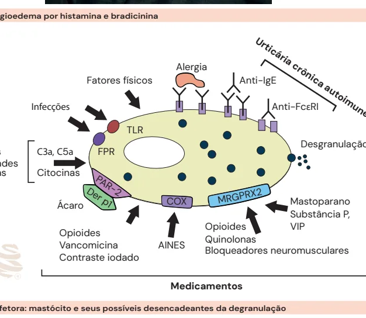
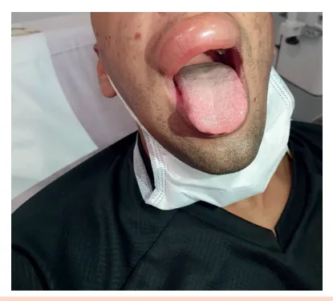
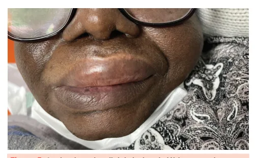
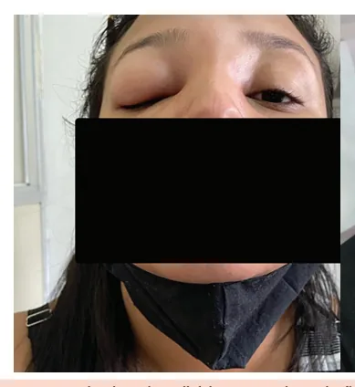
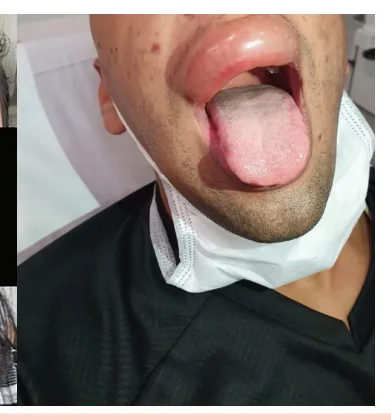
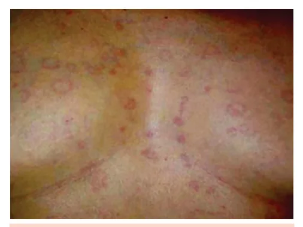
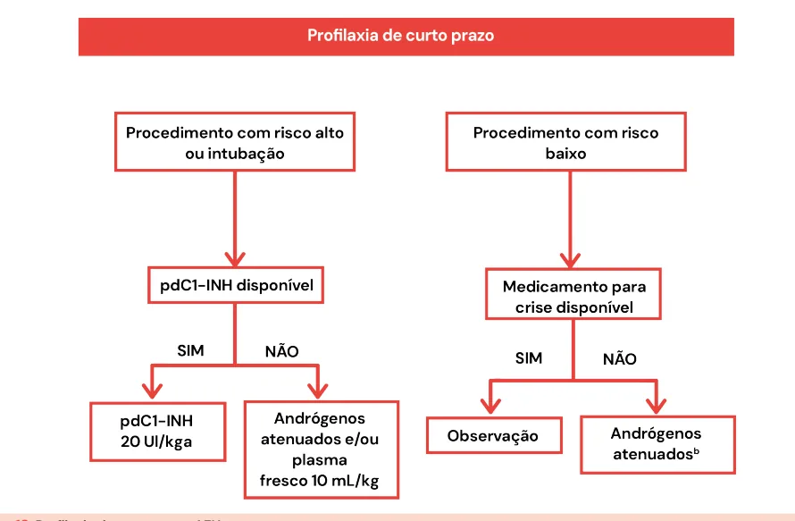
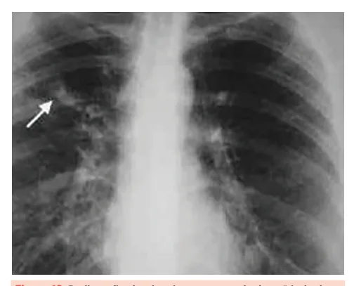
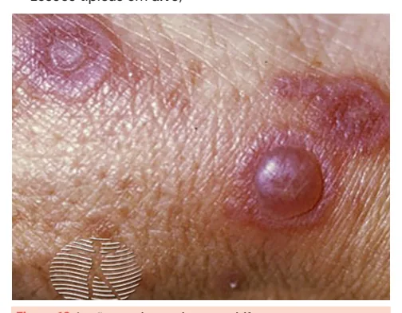

# Alergia I - Rinite e Angioedema

<!-- page:1 -->

## Visão Geral

Este material aborda: **Rinite Alérgica**, **Angioedema Adquirido**, **Angioedema Hereditário**, **Urticária** e **Aspergilose Broncopulmonar Alérgica (ABPA)**.

> ⚠️ Dados de tabela ambíguos no OCR original — não foi possível reconstruir com segurança; conteúdo listado em texto corrido.

Pontos-chave espalhados no material de origem (fragmentos de tabela comparativa):

- **Urticária/angioedema histaminérgico**: cursa com urticária, pode piorar com **AINEs**; melhora com **anti-H1**.
- **Angioedema por bradicinina**: sem urticária, não melhora com anti-H1; investigar autoimunidade de tireoide se crônico (> 6 semanas).
- **Disfunção de pregas vocais (DPV)**: diagnóstico diferencial de asma; diagnóstico por laringoscopia e espirometria; tratamento com fonoterapia e psicoterapia.
- **ABPA**: reação de hipersensibilidade ao *Aspergillus fumigatus*, quase exclusiva em pacientes com asma ou fibrose cística; quadro com sibilância, infiltrados pulmonares fugazes, bronquiectasias e opacidade em "dedo de luva" + eosinofilia.
- **Rinite alérgica**: classificação ARIA (Intermitente/Persistente, Leve/Moderada-Grave); tratamento com corticoide nasal + anti-H1 ou imunoterapia alérgeno-específica nos casos persistentes.
- **Eritema multiforme**: causa infecciosa mais comum é o **Herpes simplex**; lesões típicas em alvo.

**Tratamento resumido por condição:**

- **Urticária/angioedema histaminérgico agudo**: anti-H1 (quadruplicar dose se necessário); se refratário, associar **omalizumabe** ou **ciclosporina**.
- **Angioedema hereditário (crise)**: plasma fresco congelado (PFC), icatibanto ou inibidor de C1 purificado (C1-INH); **profilaxia**: inibidor de C1, andrógenos atenuados, ácido tranexâmico ou lanadelumabe.
- **ABPA**: prednisona 0,5–2 mg/kg/dia; se refratário, antifúngicos (itraconazol, voriconazol, posaconazol) ou imunobiológicos (**omalizumabe** – anti-IgE; **benralizumabe/mepolizumabe** – anti-IL5/IL5R; **dupilumabe** – anti-IL4Rα).

---

<!-- page:2 -->

## Angioedema

### Angioedema por Histamina

- É dividido, de acordo com seus mediadores, entre **histaminérgico** e **mediado por bradicinina**.
- O mais comum, com início em minutos até horas do estímulo; resolução entre **24 e 48h**.
- A principal diferença em relação ao mediado por bradicinina é a presença ou não de **urticária** (= angioedema histaminérgico).
- Outros sintomas associados: rubor, rinorreia, obstrução nasal e broncoespasmo.
- Pode ser agudo ou crônico (> 6 semanas).
- Boa resposta ao **anti-H1**, corticoide e adrenalina.
- Causas: fatores físicos, infecções, autoimunidades, neoplasias, AINEs (imunológico ou não – via COX1), opioides, vancomicina, contraste iodado.

*Figura 1: Diferenças entre angioedema por histamina e bradicinina.*
*Figura 2: A principal célula efetora — mastócito — e seus possíveis desencadeantes de degranulação (alergia, anti-IgE, anti-FcεRI, COX, MRGPRX2, mastoparano, substância P, opioides, VIP, quinolonas, AINEs, bloqueadores neuromusculares).*

### Fisiopatologia (Angioedema por Bradicinina)

- Duração prolongada (36–72h).
- Não há prurido.
- Sem associação com urticária.
- Sem resposta a anti-H1, corticoide ou adrenalina.

---

<!-- page:3 -->

- O mastócito degranula facilmente com qualquer estímulo, liberando proteoglicanos, triptase e histamina.
- Às custas da liberação de histamina são evidenciados os principais sintomas de uma crise de anafilaxia.
- Estímulos possíveis: alergias, infecções, autoanticorpos, neoplasias e drogas.

**Tabela 1: Meios estimuladores da degranulação mastocitária**

| Mediado por IgE | Não mediado por IgE |
|---|---|
| Alimentos | AINEs |
| Medicamentos | Contrastes iodados |
| Insetos | Opioides |
| Inalantes | Vancomicina |
| Fatores físicos | Idiopático |

### Angioedema Induzido por AINEs

Mecanismo: AINE → inibição da ciclo-oxigenase → desvio do ácido araquidônico para a via da lipo-oxigenase → **aumento dos leucotrienos** → vasodilatação, broncoespasmo e aumento da permeabilidade vascular.

*Figura 3: Angioedema induzido por AINEs.*

### Urticária

- É o angioedema "superficial", com o mesmo mecanismo: degranulação de mastócitos e basófilos com liberação de histamina e vasodilatação local.
- Cursa com edema central com eritema reflexo, efêmero e restrito à epiderme; dura menos de **24h**.
- Não deixa lesão residual.
- Não costuma provocar ardência ou dor.
- Em geral, não há sintomas associados.
- Causas:
  - **Aguda** (< 6 semanas): infecções agudas, medicações.
  - **Crônica** (> 6 semanas): doenças autoimunes (tireoide).

*Figura 4: Fotos de urticária — note as lesões eritematosas, confluentes, com elevação.*

### Urticária Crônica Espontânea (UCE)

- Caráter crônico, porém remitente.
- Espectros: urticária isolada (50%); urticária com angioedema (40%); apenas angioedema (5–10%).
- Não há cura, mas existe remissão espontânea.
- Duração média de 1–5 anos.
- Fisiopatologias possíveis: IgE contra neoautoantígeno (ex.: anti-TPO); IgG contra IgE já ligado ou contra o FcεR1.

*Figura 5: Angioedema bradicininérgico de lábio em paciente no pronto-socorro.*

**Tabela 2: Etiologias de Urticária Crônica Espontânea (UCE)**

- Doenças autoimunes (**~40%**): LES, artrite idiopática juvenil (AIJ), doença de Sjögren, tireoidite.
- Neoplasias (controverso): doenças linfoproliferativas.
- Infecções (controverso): hepatite B (HBV), hepatite C (HCV), herpes, *H. pylori*, helmintos.

### Tratamento da UCE

1. Anti-histamínico (**AH1**) de 2ª geração.
2. Se controle inadequado após 2–4 semanas: aumentar a dose do AH1 de 2ª geração até **4x**.
3. Se controle inadequado após 2–4 semanas: associar **omalizumabe** (anti-IgE).
4. Se refratariedade: associar **ciclosporina (CsA)** ao AH1 de 2ª geração.

---

<!-- page:4 -->

- Possibilidade de associação com outros imunossupressores: metotrexato (MTX), hidroxicloroquina (HCQ), sulfassalazina (SSZ), dapsona.

### Angioedema Hereditário (AEH)

- Mutação autossômica dominante do gene **SERPING1** — tipo mais comum dos AEH.
- Defeito quantitativo no inibidor de C1 (**85%**).
- Defeito qualitativo no inibidor de C1 (**15%**).

*Figura 6: Tratamento de UCE ou angioedema crônico (esquema escalonado: AH1 2ª geração em dose única → se controle inadequado após 2–4 semanas, aumentar dose até 4x → se controle inadequado após 2–4 semanas, associar omalizumabe → se controle inadequado após 6 meses, associar ciclosporina ao AH1 2ª geração).*

### Angioedema por Bradicinina

- Não há urticária associada; divide-se entre **hereditário** e **adquirido**.
- Instalação gradativa.
- Não pruriginoso.
- Resolução mínima entre **48 e 72h**.
- Dor abdominal pode ocorrer, por edema de alças intestinais.
- Sem resposta a corticoide, adrenalina ou anti-H1.
- **Mortalidade alta (25–40%)** se não tratado adequadamente.
- **Angioedema de laringe** pode evoluir com insuficiência respiratória.

**Acrônimo HAAAAE** (angioedema hereditário):

- **H**: hereditário
- **A**: angioedema recorrente
- **A**: dor abdominal recorrente
- **A**: ausência de urticária
- **A**: ausência de resposta ao uso de anti-histamínicos
- **E**: associação com estrogênio

---

<!-- page:5 -->

> ⚠️ Dados de tabela ambíguos no OCR original — não foi possível reconstruir com segurança; conteúdo listado em texto corrido.

**Figura 7 — Causas de angioedema por bradicinina** (classificação):

- **Angioedema hereditário (AEH) com deficiência de C1-INH (AEH-C1-INH)**: déficit quantitativo (deficiência de C1-INH) ou déficit funcional < 50%.
- **AEH com C1-INH normal (AEH-nC1-INH)**: mutação do gene do **F12**, mutação do gene **ANGPT1**, mutação no gene **PLG**, mutação no gene **KNG1**, mutação no gene **MYOF**, mutação no gene **HS3ST6**, ou causa desconhecida.
- **Angioedema adquirido (AEA)**: deficiência de C1-INH associada a doenças linfoproliferativas ou doenças autoimunes.
- **Angioedema por fármacos** (excesso de bradicinina, sem urticária): inibidores da ECA, bloqueadores do receptor de angiotensina II (BRA), gliptinas, inibidores da neprilisina.

*Figura 8: Pacientes com angioedema hereditário — note o edema desfigurante de pálpebras e o de lábio superior.*

---

<!-- page:6 -->

### Quadro Clínico

- Angioedema de face.
- Edema de extremidades e de genitais.
- Abdome: crises álgicas com náuseas e vômitos — diagnóstico diferencial de abdome agudo, causa frequente de laparotomias brancas.
- Eritema marginatum (**25%**), não pruriginoso, pode preceder a crise.

*Figura 9: Eritema serpiginoso ou marginatum — pródromo em paciente com AEH.*

### Diagnóstico

- **Triagem**: dosagem de complemento **C4**.
- Se baixo, dosar o inibidor de C1 (**C1-INH**) quantitativo e função.
- Se C4 normal, repetir na crise; excluir causa medicamentosa e causas adquiridas (ex.: C1q).
- Com a dosagem de C4 e C1-INH, é possível subdividir em **AEH-C1-INH** e **AEH-nC1-INH**.

### Desencadeantes do AEH

- Trauma (mesmo com baixa intensidade)
- Exercício
- Estresse
- Menstruação
- Gestação
- Estrógenos
- Mudanças bruscas de temperatura
- Uso de IECA
- Álcool
- Infecção

*Figura 10: Desencadeantes das crises de angioedema bradicininérgico.*

### Importância do C1-INH

Regulador negativo do sistema complemento e de outros sistemas:

- **Sistema complemento** → C1r, C1s, MASPs
- **Sistema de coagulação** → Fator XI, trombina
- **Sistema fibrinolítico** → tPA, plasmina
- **Sistema de contato** → Fator XII, calicreína

A deficiência do inibidor de C1 cursa com elevação dos níveis de bradicinina e vasodilatação.

### Critérios Diagnósticos

**AEH-C1-INH**

- **Requerido**: história de angioedema recorrente na ausência de urticária, sem uso de medicamentos que possam desencadear angioedema; C1-INH antigênico ou funcional reduzidos (< 50% do normal); níveis de C4 reduzidos (basais ou dosados na crise).
- **Suporte**: detecção de variante patogênica no gene **SERPING1** (não é necessário para o diagnóstico); história familiar de angioedema recorrente; idade de aparecimento < 40 anos.

**AEH-nC1-INH**

- **Requerido**: história de angioedema recorrente, na ausência de urticária, sem uso de medicamentos desencadeantes; níveis de C4, C1-INH antigênico e funcional sem alterações ou próximos do normal; demonstração de mutação associada à doença OU história familiar de angioedema recorrente e ausência de eficácia com anti-histamínicos de 2ª geração em altas doses por um mês, ou três ou mais crises no intervalo esperado (o que for mais longo).
- **Suporte**: história de resposta rápida e duradoura a medicamento que inibe bradicinina; angioedema visível documentado, ou em pacientes com sintomas abdominais, evidência de edema de parede intestinal documentado por TC ou RNM.

---

<!-- page:7 -->

*Figura 11: Fluxograma diagnóstico do AEH* (síntese):

- Dosagem de **C4** e **C1-INH** quantitativo/funcional.
- C4 baixo + C1-INH quantitativo e funcional baixos → **AEH-C1-INH tipo I**.
- C4 normal/baixo + C1-INH quantitativo normal, funcional baixo → **AEH-C1-INH tipo II**.
- C4 e C1-INH normais → investigar mutação genética específica (AEH-FXII, AEH-PLG, AEH-ANGPT1, AEH-KNG1, AEH-MYOF, AEH-HS3ST6) ou, se não identificada, **AEH-unknown (AEH-U)**.
- Se C1q baixo → considerar **angioedema adquirido (AEA)**.
- \* Se C4 normal, repetir durante a crise.

### Tratamento — Orientações

- **Contraindicados**: esportes de alto impacto; IECA, BRA, gliptinas e inibidores da neprilisina; contracepção com estrógenos.
- Recomendada vacinação contra hepatites A e B.

### Crises

- Inibidor de C1 derivado de plasma (**pdC1-INH**), icatibanto ou inibidor de C1 recombinante.
- Em contexto de emergência sem recursos ou banco de sangue: **ácido tranexâmico** ou plasma fresco congelado (PFC).

### Profilaxia

- **Profilaxia de curto prazo** (ex.: antes de cirurgias de risco).
- **Profilaxia de longo prazo** (reduzir frequência e gravidade das crises): andrógenos atenuados, inibidores da calicreína plasmática (**lanadelumabe**).

*Figura 12: Profilaxia de curto prazo no AEH.*

---

<!-- page:8 -->

> ⚠️ Dados de tabela ambíguos no OCR original — não foi possível reconstruir com segurança; conteúdo listado em texto corrido.

**Tabela 3 — Estratégias de tratamento disponíveis no Brasil para AEH** (por população e linha de tratamento, conforme o material original):

- **Adultos e idosos**: profilaxia de longo prazo — 1ª linha: pdC1-INH (SC), lanadelumabe, berotralstat, andrógenos atenuados; 2ª linha: ácido tranexâmico. Crise: pdC1-INH (EV).
- **Crianças e adolescentes**: profilaxia de longo prazo — 1ª linha: pdC1-INH (SC, > 8 anos), lanadelumabe (> 2 anos); 2ª linha: ácido tranexâmico, andrógenos atenuados (após a puberdade, > 12 anos). Crise: pdC1-INH (EV), icatibanto.
- **Gestantes**: 1ª linha: pdC1-INH (SC/EV); 2ª linha: ácido tranexâmico. Crise: pdC1-INH (EV), plasma.

### Disfunção de Pregas Vocais (DPV)

- Apresenta outras denominações: **asma laríngea** ou **discinesia de pregas vocais**.
- Decorre do fato de que as pregas vocais aduzem, ao invés de abduzir, e fecham durante a respiração, cursando com dispneia extratorácica.
- Diagnóstico diferencial: **asma grave**.

**Diagnóstico**

- **Laringoscopia**: fenda posterior no fechamento das pregas vocais (durante os sintomas).
- **Espirometria**: achatamento da alça inspiratória.

**Tratamento**

- Fonoaudiologia para fonoterapia.
- Psicoterapia — o quadro demonstra associação com eventos ansiosos.
- No caso de asma associada: tratar como tal (corticoide inalatório).

### Aspergilose Broncopulmonar Alérgica (ABPA)

- Reação de hipersensibilidade complexa causada pelo *Aspergillus fumigatus*.
- Formação de anticorpos **IgE** e **IgG**, e de células Th2 CD4+ e Th17 responsivas.
- Participação de ILC2 e eosinófilos.
- Quase exclusiva em pacientes com **asma** ou **fibrose cística**.
- Teste cutâneo positivo para *A. fumigatus*: em asmáticos, ~25%; em fibrose cística, ~50%.
- Prevalência de ABPA: ~13% dos pacientes com asma; ~9% dos pacientes com fibrose cística.

### Quadro Clínico

- Sibilância recorrente.
- Tosse, dispneia, dor torácica pleurítica, expectoração com sangue ou com tampões de muco marrons.
- Anorexia, fadiga, dores generalizadas, febre baixa e perda de peso.
- Pode ocorrer com sinusite fúngica alérgica.

### Imagem

- Infiltrados pulmonares fugazes, irregulares.
- Bronquiectasias centrais.
- Opacidade em "dedo de luva": sugestiva de impactação mucoide em brônquios dilatados.

*Figura 13: Radiografia simples de tórax com sinal em "dedo de luva" (seta) e opacidades nodulares em terço médio direito.*

---

<!-- page:9 -->

### Etiologias de Rinite Não-Alérgica

- Rinite infecciosa.
- Rinite eosinofílica não alérgica (**RENA**).
- Rinite hormonal/rinite gestacional.
- Rinite induzida por fármaco → AINEs, contraceptivos, sedativos, betabloqueadores.
- Rinite medicamentosa → abuso de descongestionantes nasais.
- Rinite gustativa → rinorreia por alimentos quentes e condimentados.
- Rinite emocional.
- Rinite atrófica → ozenosa/secundária.
- Secundária a variações anatômicas.
- Idiopática (**50%**).

### Diagnóstico — Critérios ABPA (ISHAM)

**Condições predisponentes (pelo menos 1)**: asma; fibrose cística.

**Critérios obrigatórios (ambos)**:

- Níveis séricos elevados de IgE contra *Aspergillus fumigatus* (> 0,35 kU/L) ou teste cutâneo positivo para *Aspergillus*.
- IgE sérico total elevado (tipicamente > 1.000 UI/mL).

**Outros critérios (pelo menos 2)**:

- Anticorpos séricos precipitantes para *A. fumigatus* ou IgG anti-*Aspergillus* elevado por imunoensaio.
- Opacidades pulmonares compatíveis com ABPA.
- Eosinófilos totais > 500 células em paciente virgem de glicocorticoide.

### Tratamento

- **Prednisona** — primeira linha — 0,5 a 2 mg/kg/dia; manter por 14 dias e desmamar em 6 a 8 semanas; observar queda de IgE total neste período (> 35%); se recidiva, retornar com corticoide.
- **Antifúngicos** (se doença refratária ao corticoide, recidiva na redução do corticoide e/ou complicações pelo corticoide):
  - **Itraconazol** 200 mg 2x ao dia por 4 a 6 semanas, com redução em 4 a 6 meses.
  - **Voriconazol**: melhor biodisponibilidade e tolerância, mas pode causar fotossensibilidade.
  - **Posaconazol**: melhor para redução de IgE específico em pacientes com fibrose cística.
- **Omalizumabe** — anti-IgE.
- **Benralizumabe** ou **mepolizumabe** — anti-IL5 ou IL5R.
- **Dupilumabe** — anti-IL4Rα (IL4 e IL13).

### Rinite Alérgica

- Ocorre pela inflamação da mucosa nasal:
  - **Aguda**: infecções virais (maioria dos casos).
  - **Crônica**: rinite alérgica.
- Apresenta concomitância com a asma em muitos casos — atenção ao conceito das vias aéreas unidas.

### Classificação ARIA

- **Intermitente**: < 4 dias por semana ou < 4 semanas.
- **Persistente**: ≥ 4 dias por semana e ≥ 4 semanas.
- **Leve**: sono normal, atividades diárias/esportivas/de lazer normais, sem interferência no trabalho ou na escola, sem sintomas incômodos.
- **Moderada-Grave**: um ou mais dos itens acima alterados (sono anormal, atividades prejudicadas, dificuldades na escola ou no trabalho, sintomas incômodos).

*Figura 14: Fluxograma de classificação ARIA.*

### Tratamento

- Baseado na classificação ARIA: anti-histamínicos orais/nasais e/ou corticoide nasal.
- Atualmente, o melhor tratamento é a **imunoterapia alérgeno-específica**:
  1. Avaliar a sensibilização (**PRICK test**) e história pessoal.
  2. Avaliar se existem extratos disponíveis e definir a via de aplicação.

### Eritema Multiforme

- Reação de hipersensibilidade pós-infecciosa.
- Início súbito com máculas ou pápulas, eventualmente bolhas.
- Raramente apresenta acometimento ocular.
- Lesões típicas em alvo.

*Figura 16: Lesão em alvo — eritema multiforme.*

- Pode apresentar-se com sintomas sistêmicos: febre, artralgia e mal-estar tipo *flu-like* (denominado eritema multiforme *major*).
- Duração média de 2 a 4 semanas.

---

<!-- page:10 -->

### Fluxograma de Tratamento — Rinite Alérgica

*Figura 15: Tratamento de rinite alérgica* (esquema por classificação ARIA):

- **Intermitente Leve**: higiene ambiental (evitar alérgeno e irritantes) + anti-H1 oral ou nasal, ou antileucotrieno.
- **Intermitente Moderada-Grave / Persistente Leve**: corticoide nasal, ou corticoide nasal + anti-H1, ou anti-H1 oral, ou anti-H1 nasal, ou antileucotrieno.
- **Persistente Moderada-Grave**: corticoide nasal ± anti-H1 nasal (azelastina).
- Reavaliar o paciente após 2–4 semanas:
  - **Melhora**: reduzir medicação e manter por 1 mês.
  - **Falha**: rever diagnóstico, adesão e investigar infecção ou outras causas; aumentar tratamento (associação de dois ou mais: corticoide nasal + anti-H1 nasal; curso curto de descongestionante oral ou corticoide oral; corticoide nasal/anti-H1 oral/antileucotrieno + levocetirizina; imunoterapia específica; anti-H1 com descongestionante/corticoide oral).
  - Se falha persistente: encaminhar para especialista.
- Medicação de resgate: anti-H1 oral/nasal.

*Legenda: Anti-H1 = anti-histamínico H1; Cortic. = corticosteroide.*

### Etiologias de Eritema Multiforme

- Herpes simplex (causa mais comum)
- *Mycoplasma pneumoniae*
- Hepatite B
- EBV
- CMV
- Histoplasma
- Paracoco (paracoccidioidomicose)
- Varicela zoster
- Doença de Kawasaki
- *Gardnerella*
- Medicamentos (ex.: aminopenicilinas)
- Malignidade e autoimunidade
- Irradiação e vacinas

### Tratamento

- O uso de corticoide é controverso.
- Podem ser usados antivirais.

## Referências

Figura 1: Diferenças entre angioedema por histamina e bradicinina. Arquivo pessoal: Dr. Alex Prado.

Figura 2: A principal célula efetora — mastócito — e seus possíveis desencadeantes da degranulação. GIAVINA-BIANCHI, Pedro; GONÇALVES, Danilo Gois; ZANANDRÉA, Andressa; CASTRO, Raísa Borges de; GARRO, Laila Sabino; KALIL, Jorge; CASTELLS, Mariana. Anafilaxia às quinolonas em mastocitose: hipótese sobre o mecanismo. *The Journal of Allergy and Clinical Immunology: Na Prática*, v. 7, n. 6, p. 2089–2090, 2019. Reimpresso com permissão da Elsevier.

Figura 4: Fotos de urticária — note as lesões eritematosas, confluentes com elevação. Arquivo pessoal: Dr. Alex Prado.

Figura 5: Angioedema bradicininérgico de lábio em paciente no pronto-socorro. Arquivo pessoal: Dr. Alex Prado.

Figura 8: Pacientes com angioedema hereditário, note o edema desfigurante de pálpebras e o de lábio superior. Arquivo pessoal: Dr. Alex Prado.

Figura 9: Eritema serpiginoso ou marginatum — pródromo em paciente com AEH. https://dermnetnz.org/

Figura 13: Radiografia simples de tórax com sinal em "dedo de luva" (seta) e opacidades nodulares em terço médio direito. https://doi.org/10.1590/S1806-37132006000500015

Figura 16: Lesão em alvo — eritema multiforme. https://dermnetnz.org/
