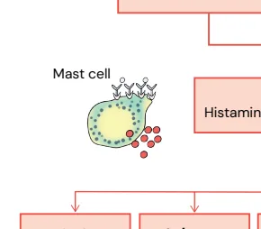

# Alergia II - Reações de Hipersensibilidade

<!-- page:1 -->

## ALERGIA II: REAÇÕES

## DE HIPERSENSIBILIDADE

Farmacodermias (CM) Anafilaxia (CM); Doença do Soro (CM) Esofa Tipos Alergia: Formação de IgE, necessida Cuidado: mastócitos podem degra opioides, quinolonas, AINES e contra Hipersensibilidade Anafilaxia do tipo I Diagnóstico clínico, mas pode-se d horas).

Tratamento de primeira linha: adren Investigação: preferencialmente 4 s Doença do soro ou soro-like: forma

## Hipersensibilidade

Febre, artralgia, artrite e lesões cutâ do tipo III Pode ser local (vacina) ou sistêmic Farmacodermias DRESS (2-8 sem do início da droga)

Exantema difuso, febre, linfadenome Agentes: anticonvulsivantes (fenitoí Tratamento: corticoide 2mg/kg/dia, NET/SSJ (1-3 sem do início da droga Hipersensibilidade Exantema maculopapular, descolam do tipo IV Agentes: betalactâmicos, anticonvu Tratamento: corticoide (controverso TNF, corticoide (não precoce) aume PEGA (48h do início da droga)

Não é grave, pústulas subcórneas Agentes: antibióticos (beta lactâmic Tratamento: prednisona 1mg/kg.

## PROTÓTIPOS DE GELL & COOMBS/

## PICHLER

Subdividimos as reações de hipersensibilidade segundo a Classificação de Gell e Coombs. Neste capítulo, abordaremos especialmente as reações do tipo I, III e IV.

Tabela 1: Classificação de Gell e Coombs

## MECANISMOS DE

## MECANISMO

I - Anafiláticos/imediata IgE, mastócitos II - Citotoxicidade celular IgM, IgG, comp dependente de anticorpo fagocitos IgM, IgG, comp III - Imunocomplexos fagocito Linfócitos T, c IV - Celular mononucleares, cé agite eosinofílica (CM);

Detalhes ade de sensibilização prévia. anular sem IgE (infecções, autoanticorpos, neoplasias, aste iodado)

dosar triptase em situações de dúvida (30 min a 2 nalina IM semanas após o evento ação de imunocomplexos.

âneas. co (medicamentos ou infecção) ) egalia, hepatoesplenomegalia e eosinofilia ína); Alopurinol pode ocorrer reativação viral a)

mento da pele (Nikolsky +) ulsivantes, sulfonamidas, alopurinol o), imunoglobulina 1g/kg/d, ciclosporina (CsA) e antienta risco de infecção.

cos) O EFETOR PROTÓTIPO CLÍNICO Anafilaxia, urticária, angioedema, s e basófilos broncoespasmo plemento, Nefrites, citopenias, pneumonites se, NK Doença do soro, febre, urticária, plemento, vasculites, ose glomerulonefrite Dermatite de contato, Fotoalergias, citocinas, Eritema fixo, Exantemas, DRESS, SSJ/ él. Langerhans NET, PEGA

---

<!-- page:2 -->

ANAFILAXIA QUADRO CLÍNICO Após essa tempestade de histamina observamos uma

- Reação sistêmica aguda grave, potencialmente fatal, grande possibilidade de sinais e sintomas, geralmente com mecanismo e quadro clínico variável, por isso é acometendo dois sistemas: respiratório, digestivo, uma emergência médica. cardiovascular e pele.

uma emergência médica.

- Resulta da liberação repentina de mediadores de mastócitos (principal célula efetora) e basófilos ativados após o contato com uma substância causadora específica O mastócito degranula facilmente com qualquer estímulo, liberando uma série de substâncias como proteoglicanos, triptase e histamina; Às custas da liberação de histamina é que são evidenciados os principais sintomas de uma crise de anafilaxia; Meios estimuladores da degranulação mastocitária:

alergias; infecções; autoanticorpos; Infecções; neoplasias; medicações opioides; quinolonas; AINEs; contraste iodado.

- Fases: Sensibilização: formação do IgE; Efetora: reação em si → degranulação de mastócitos e basófilos.

- Verificar Figura 1

- Fatores de risco para gravidade: Comorbidades: asma, cardiopatias, doença dos mastócitos Sexo masculino, idosos Dose/via do alérgeno

Ig Fatores Genéticos Mediad Polimorfismos do ECA Sistem Alfa triptasemia hereditária Libe Defeitos na via do PAF Doen Mastócitos, bas Mast cell Libera Histamina, leucotrienos, prost SNC Pele/mucosa Cardiovascular Tontura Urticária Hipovolemia Síncope Flushing Isquemia mioc.

Confusão Angioedema Arritmia Convulsão Prurido Choque distributivo

## PCR

Figura 2: Fisiopatologia e quadro clínico da anafilaxia cardiovascular e pele. AINES Exercício Infecção Jejum Álcool Estresse Menstruação Temperatura extrema Figura 1: Cofatores da anafilaxia

- Verificar Figura 2 coronariana aguda na anafilaxia, liberação de mediadores, vasodilatação, espasmo e vasoplegia!Reações Bifásicas

ATENÇÃO: Síndrome de Kounis → síndrome

- Até 20% dos casos podem se apresentar em duas fases, por isso não libere o paciente após o primeiro tratamento!

- Até 8h após o quadro inicial, podendo recorrer dentro de 72h após a crise inicial. Possíveis causas: Doses inadequadas do tratamento inicial Retardo na aplicação da adrenalina gG/IgE-mediada Cofatores da por complemento Exercício ma de contato-cinina Hormônios eração de citocinas AINES nças dos mastócitos Álcool sófilos, neutrófilos, macrófagos...

Endótipos Idiopáticos Medicamentos ação de mediadores taglandinas, citocinas, proteases, cininas, NO

## Anafilaxia

Respiratório Gastrointestinal Miscelânea Sibilância Náusea, vômito, Edema escrotal Asfixia/estridor diarreia, dor Cólica uterina abdominal Sangramento vaginal

---

<!-- page:3 -->

samotniS Resposta primária Resposta tardia 0 20 40 60 2 4 6 8 10 24 Minutos Horas Figura 3: Reação bifásica na anafilaxia

## DIAGNÓSTICO

- Essencialmente clínico!

- Dosagem da triptase sérica entre 30 minutos até 2 | Testes in vitro → IgE sérica específica; É um mediador específico da degranulação

horas da reação: | Provocação oral ou endovenosa.

- Temos os critérios “antigos” (que ainda caem em do mastócito; grande parte das provas - Tabela 2) e os critérios É mais fácil de dosar do que a histamina; novos (WAO - 2020 - Tabela 3), que basicamente Auxiliador nos quadros de clínica incompleta e em “agruparam” os critérios anteriores na tentativa de anafilaxia perioperatória. aumentar a sensibilidade.

- Investigação: idealmente após 4 semanas da reação

- Verificar Tabela 2 Testes in vivo → testes cutâneos;

Tabela 2: Critérios diagnósticos clássicos Deve-se considerar anafilaxia como diagnóstico muito provável quando existe uma reação sistêmica grave na presença de pelo menos um de três critérios clínicos:

Início súbito (minutos a algumas horas) com envolvimento da pele e/ou mucosas (urticária, eritema ou prurido generalizado; edema dos lábios, da língua ou da úvula) e pelo menos um dos seguintes:

A. Comprometimento respiratório: dispneia, sibilância/broncoespasmo, estridor, diminuição do DEMI/PEF, hipoxemia;

B. Hipotensão ou sintomas associados à disfunção de órgão terminal: hipotonia, síncope ou incontinência esfincteriana.

Ocorrência de dois ou mais dos seguintes critérios de forma súbita após exposição a um alérgeno provável para aquele doente (minutos a algumas horas):

A. Envolvimento da pele e/ou mucosas: urticária, eritema ou prurido generalizado; edema dos lábios, da língua ou da úvula;

B. Compromisso respiratório: dispneia, sibilância/broncoespasmo, estridor, diminuição do DEMI (débito expiratório máximo instantâneo)/PEF (peak flow), hipoxemia;

C. Hipotensão ou sintomas associados: hipotonia, síncope ou incontinência esfincteriana; D. Sintomas gastrointestinais súbitos: cólica abdominal, vômitos.

Hipotensão após exposição a um alérgeno conhecido para aquele doente (minutos a algumas horas): A. Lactentes e crianças: ↓ PAS ou ↓ do valor basal superior a 30%;

B. Adultos: PAS < 90 mmHg ou ↓ do valor basal do doente superior a 30%.

---

<!-- page:4 -->

Tabela 3: Critérios diagnósticos WAO (Organização Mundial de Alergia - 2020) A anafilaxia é altamente provável quando qualquer um dos dois critérios a seguir são atendidos

1. Início agudo de uma doença (minutos a algumas horas) com envolvimento simultâneo da pele, do tecido mucoso

1. Início agudo de uma doença (minutos a algumas horas

ou de ambos (p.e, urticária generalizada, prurido ou ru E pelo menos u A. Comprometimento respiratório (p.e, dispneia, bron B. PA reduzida ou sintomas associados de disfunção C. Sintomas gastrointestinais graves (p.e cólicas abd a exposição de alérgenos não alimentares.

2. Início agudo de hipotensão ou broncoespasmo ou en

conhecido ou altamente provável para aquele pacien envolvimento cutâneo típico. TRATAMENTO

- Afastar o alérgeno, se possível (p.e, infusão do medicamento);

- Estabilização: avaliar circulação, via aérea, respiração e status mental;

- Adrenalina: deve ser realizado o mais precoce possível Concentração padrão da ampola: 1:1000 Via intramuscular (vasto lateral da coxa) Repetir até 2 vezes a cada 5 a 15 minutos Adultos: 0,3 a 0,5 mg (0,3 a 0,5 ml);

Tabela 4: Condutas secundárias na anafilaxia Condutas Adultos/Adolescen Expansão volêmica 1-2 litros rapidamen Solução salina Crianças Ringer Lactato 5min: 5-10 ml/kg 1ª hora: 30 ml/kg Oxigênio Sob cânula nasal ou m Via inalatória Adultos/Adolescen Beta-2-agonista 4-8 jatos a cada 20 (salbutamol) Dose máx: 20 jato (fenoterol) Crianças 50 mcg/Kg/dose = 1 ja Dose máxima: 10 ja Adultos/Adolescen Anti-histamínico 25-50 mg IV (prometazina)

Crianças (difenidramina) 1 mg/kg IV até máximo Glicocorticoides Dose: 1-2 mg/kg/di (metilprednisolona)

Dose: 0,5-1mg mg/kg/ (prednisona) s) com envolvimento simultâneo da pele, do tecido mucoso ubor, inchaço dos lábios-língua-úvula).

um dos seguintes: ncoespasmo, estridor, PFE reduzido, hipoxemia) o de órgão-alvo (p.e, hipotonia, síncope, incontinência)

dominais intensas, vômitos repetitivos), especialmente após nvolvimento laríngeo após exposição a um alérgeno nte (minutos a algumas horas), mesmo na ausência de | Crianças: 0,01 mg/kg (0,01 ml/kg), dose máxima de 0,3 mg;

| < 6 anos: 0,15 ml; | 6 a 12 anos: 0,3 ml; | > 12 anos: 0,5 ml. l | Em decúbito, mantendo extremidades elevadas | Manter o paciente deitado por pelo menos 30 minutos após a administração | Não existem contraindicações absolutas na anafilaxia.

- Condutas secundárias

- Verificar Tabela 4 ntes nte EV máscara. SatO₂ < 95%: repetir adrenalina.

Detalhes Ajustado pela FC e PA Acesso EV calibroso Monitorar hipervolemia EV EV Nebulização ntes Adultos/Adolescentes 0 min.

2,5-5,0 mg a cada 20 min por 3x os; Crianças 0,07-0,15 mg/kg a cada 20 min por 3x ato/2kg; Dose máx: 5 mg.

atos ntes Dose oral pode ser suficiente para episódios mais brandos; Papel na anafilaxia aguda ainda não é bem o 50 mg determinado.

ia IV; Padronização de doses não estabelecidas /dia VO. Prevenção de reações bifásicas?

---

<!-- page:5 -->

## ANAFILAXIA REFRATÁRIA

- Doença clonal dos mastócitos por mutação no

Geralmente no contexto de tais etiologias: c-kit (CD117);

- Asma;

- Anafilaxias são comuns e frequentemente de

- Betabloqueadores; difícil investigação; Nesse caso específico há indicação de glucagon

- Outras manifestações: Nesse caso específico há indicação de glucagon Adultos: 1mg Crianças: 0,5-1mg

- Cardiopatia;

- Alérgeno em alta concentração;

- Administração endovenosa do alérgeno;

- Atraso na administração de adrenalina.

Tratamento

- Adrenalina EV em bomba de infusão contínua (BIC) Adultos: 0,05 - 0,5 mcg/kg/min Crianças: 0,1 - 2 mcg/kg/min

## CASOS ESPECIAIS NA ANAFILAXIA

## MASTOCITOSE

cutânea - mais D sistêmica - mais comum na comum no adulto criança Mais comumente Acometimento autolimitada medular, ósseo Figura 4: Subtipos de mastocitose e sua epidemiologia Tabela 5: Critérios diagnósticos de mastocitose cutânea e sistêmica Mastocitose cutânea (MC)

CRITÉRIO M Pres Lesões de mastocitose típicas associadas à mastó presença de sinal de Darier CRITÉRIOS M Biopsia com infiltrado de mastócitos monomórficos Pre de grande tamanho (>15 céls/infiltrado), ou mais de at 20 isolados num campo de microscopia de grande in ampliação (×40)

Dete Mutação KIT em lesões cutâneas Expr Diagnóstico MC: 1 maior + 1 menor Tri MS: 1 maior + 1 menor OU 3 menores pato - Outras manifestações:

| Dispepsia; | Lesões cutâneas com Sinal de Darier positivo. | Osteoporose; | Alergia aos himenópteros (abelha, vespa e formiga)

- muitas vezes sem IgE.

Figura 5: Criança com mastocitose e sinal de Darier positivo Diagnóstico

- Verificar Tabela 5 sença de agregados multifocais densos com 15 ou mais ócitos na biópsia de medula óssea, ou em outros tecidos extra cutâneos.

Mastocitose sistêmica (MS) MAIOR MENORES esença de mais de 25 % de mastócitos de morfologia típica, na biópsia de medula óssea, ou fusiformes, em nfiltrados detectados em cortes de órgãos viscerais.

eção de uma mutação pontual do códon 816 do KIT na medula óssea, ou outro órgão extracutâneo. ressão aberrante de CD25 e/ou CD2 por mastócitos da medula óssea, ou de outro órgão extracutâneo.

iptase sérica basal ≥ 20 ng/mL na ausência de outras ologias associadas com um aumento da triptase sérica (neoplasias mieloides não relacionadas)

---

<!-- page:6 -->

Tratamento

- Ocorre a exposição ao agente, formação do complexo

- Casos leves imune, com ativação do sistema complemento, Anti-histamínicos, cetotifeno ou cromoglicato liberação de mediadores inflamatórios, recrutamento de sódio de neutrófilos e interação dos imunocomplexos

- Casos graves com plaquetas, gerando formação de coágulos e

- Casos graves Citorredução: imatinibe, midostaurin Cladribina, Interferon alfa, etc ter envolvimento cutâneo

ATENÇÃO: 10-20% dos casos sistêmicos podem não

## SÍNDROME LÁTEX-FRUTA

- Reatividade cruzada: às proteínas do látex (Hev b) em algumas frutas: Látex → frutas (35%); Frutas → látex (11%).

- Proteínas do látex: Elevado: abacate; banana; kiwi. Moderado: maçã; cenoura; melão; mamão papaia;

batata; tomate.

- Grupos de risco Profissionais de saúde; Indivíduos com espinha bífida; Pacientes com múltiplas cirurgias.

## ANAFILAXIA INDUZIDA POR EXERCÍCIO

- Pode ou não estar associada a alimentos ou medicamentos Trigo (principal alérgeno evolvido a ômega-5-gliadina) Farinha de trigo contaminada (ácaros) Frutos do mar (especialmente camarão) Aipo, banana, milho, leite de vaca Amendoim

- Quando alimento ou medicamento associado: só acontece na sinergia dos dois fatores

- Orientação geral: evitar atividades entre 4-6 horas após a ingestão desses alimentos/medicamentos.

## REAÇÕES AOS MEIOS DE CONTRASTE

- Anafilaxias: 2-4/10 mil - aplicações do iodado e 1/10100 mil aplicações do gadolínio

ATENÇÃO: Reação cruzada com frutos do mar:

## NÃO EXISTE!

- Chance de reação prévia: 5x com iodo e 8x com gadolínio

- Pré-medicação: controverso Troca do meio de contraste (troca por cadeia lateral diferente - CLD) Corticoide e anti-H1 Redução da velocidade da injeção do contraste

## DOENÇAS DO SORO E SORO-LIKE

- A doença do soro ocorre por uma reação por imunocomplexos (reação de hipersensibilidade do tipo III) com plaquetas, gerando formação de coágulos e dano tecidual.

- A doença do soro mais comum é a reação de Arthus Reação à vacina l socirés sievíN articulares livre

(forma localizada) Lesões vasculares, renais, Complemento Antígeno Anticorpo Imunocomplexos 2 4 6 8 10 12 14 16 18 20 Dias Antígeno Figura 6: Evolução da doença do soro em dias QUADRO CLÍNICO

- O quadro surge cerca de 1 a 2 semanas após exposição ao agente com resolução dias/semanas na descontinuação; Erupção cutânea; Febre; Poliartralgias; Artrites.

- Autolimitada: bom prognóstico.

ETIOLOGIAS Tabela 6: Etiologias da doença do Soro Antitoxinas microbianas Antidifteria equina Antirraiva para equinos ou ovinos Toxina antibotulínica equina Imunizações Antígenos da raiva Vacina pneumocócica Vacina contra o Hemophilus B Antitoxinas do veneno Equino, coelho, veneno anticobra (Crotalidae [víboras, cascavéis], antivenina, Micrurus [cobra-coral] antivenina)

Veneno equino antiaranha (Lactrodectus)

---

<!-- page:7 -->

Antitoxinas microbianas Tabela 7: Etiologias da doença do soro-like Drogas Drogas comumente implicadas Penicilina / Amoxicilina Rituximab Rituximab Infliximabe Globulina anti-timócitos de equinos ou coelhos Anti-CD3 murino Natalizumab

## DIFERENÇA ENTRE DOENÇA DE SORO E SORO-LIKE

Tabela 8: Diferença entre doença do soro e doença do soro-like Doença do soro Entrada de proteínas estranhas Soro heterólogo Antitoxinas Algumas vacinas Proteínas fibrinolíticas terapêuticas Proteínas de insetos Anticorpos monoclonais não humanos (X;Z)

Epidemio Adultos com hipocomplementenemia DIAGNÓSTICO F

- É clínico, de acordo com exposição a agente típico e tempo de instalação (1-2 semanas) R

- Diagnósticos diferenciais r Exantemas virais; Urticária vasculite; DRESS; SSJ/NET; Eritema multiforme; Doença de Kawasaki; LES

- ATENÇÃO: não é necessário biópsia ou exames complementares para tomada de conduta!

## TRATAMENTO D

- Interromper o uso do agente causador imediatamente;

- Sintomáticos;

- Para os casos mais graves → corticoterapia oral/

- EV (raro). 0,5-1mg/kg/d Q

- - - Cefaclor ologia

Sulfametoxazol - trimetoprim Drogas raramente implicadas Aspirina Carbamazepina Ciprofloxacino Metronidazol Heparina Doença do soro-like Mecanismo não completamente elucidado Mais comum com antibiótico Aumento de permeabilidade intestinal Efeito tóxico medicamentoso Idiossincrasia Infecções virais - Ex. hep B Crianças com complemento normal

## FARMACODERMIAS

Reações de hipersensibilidade tipo IV: mecanismo de reação celular

- Dano celular direto via granzimas/perforinas ou citocinas: IVa: Dermatite de contato IVb: DRESS IVc: NET/SSJ. IVd: PEGA (pustulose exantemática generalizada aguda).

- Tratamento geral Suspender a droga ou agente responsável. Maioria responsiva a corticoide!

## DRESS

- Drug Rash with Eosinophilia and Systemic Symptoms No entanto, pode ocorrer sem a presença de eosinofilia.

- Reação grave e multissistêmica (óbito em até 40%)

- Início até 2-8 semanas após início da medicação;

Quadro clínico

- Febre (38 a 40ºC) e mal-estar;

- Linfadenopatia;

- Erupção cutânea (exantema difuso com ou sem edema facial).

- Pode ter acometimento visceral: fígado, rins, pulmões;

---

<!-- page:8 -->

Parâmetros laboratoriais Quadro clínico

- Eosinofilia não é obrigatória: DHIS (drug-induced

- Pródromo: 1 a 3 dias antes hypersensitivity syndrome)

- Febre (39ºC), mialgia, artralgia e mal-estar

- Linfocitose (com atipias);

- Fotofobia e conjuntivite

- Elevação de AST, ALT e DHL;

- Lesões cutâneas graves

- Elevação de AST, ALT e DHL;

- Reativação viral com PCR positivo e IgM → HHV 6,

CMV e EBV. Etiologias

- Medicamentos mais comumente causadores Anticonvulsivantes Carbamazepina Fenitoína Lamotrigina Oxcarbazepina Fenobarbital Alopurinol Sulfonamidas linfócitos

Diagnóstico Tabela 9: Critérios diagnósticos de DRESS - RegiSCAR Critérios diagnósticos (RegiSCAR) - 3 ou mais ‘Rash” cutâneo agudo Febre > 38ºC Linfadenopatia em 2 sítios diferentes Envolvimento de algum órgão interno Anormalidades na contagem de eosinófilos OU Tratamento

- Suspender a droga ou agente responsável

- Monitorar funções: cardíaca, hepática, renal, cuidado com reativação viral

- Preferencialmente manejo em cenário de terapia intensiva (UTI)

- Corticoterapia precoce 1-2mg/kg/dia prolognado Desmame paulatino (atentar para rebote)

## NET E SSJ

- Necrólise Epidérmica Tóxica (NET) e Síndrome de A diferença entre elas é a quantidade de superfície corpórea (SC) acometida NET: >30% da SC Limbo/Overlap: 10-30% da SC SSJ: < 10% da SC

Stevens-Johnson (SSJ)

- É uma reação tardia grave (óbito em até 50%) com acometimento mucocutâneo (90% dos casos);

- Se houver NET (comporta-se com grande queimado);

- Pode ser justificado por predisposição genética em alguns casos: HLA-B 15.02: Carbamazepina; HLA-B 58.01: Alopurinol.

- Início até 1-3 semanas após início da medicação; - Lesões cutâneas graves Iniciam-se em face, tórax e progridem, geralmente, de forma simétrica Couro cabeludo geralmente é poupado Raramente acomete a região palmar Máculas eritematosas, coalescentes com centros purpúricos; Algumas vezes, o quadro se inicia como eritema difuso; Bolhas Acometimento de mucosas oral, ocular e urogenital.

ATENÇÃO: sinal de Nikolsky → É o descolamento epidérmico em área perilesional. Parâmetros laboratoriais

- Anormalidades hematológicas, principalmente anemia e linfopenia

Etiologias

- As medicações são a principal causa Alopurinol Anticonvulsivantes Sulfonamidas Nevirapina AINEs

- Em 2° lugar encontra-se a infecção por Mycoplasma

Tratamento

- Suspender a droga ou agente responsável

- Similar ao grande queimado

- Preferencialmente manejo em cenário de terapia intensiva (UTI)

- Corticoterapia é controversa Se não for precoce, aumenta o risco de infecções

- Imunoglobulina EV 1g/kg/dia

- Terapias novas: ciclosporina e anti-TNF (etanercepte)

## PEGA

- Pustulose Exantemática Generalizada Aguda.

- Início até 48h após início da medicação;

Quadro clínico

- Intervalo curto entre entrada da medicação e clínica;

- Resolve em 1 e 2 semanas após retirada (geralmente benigno - autolimitado);

- Eritema em base com pústulas estéreis, não foliculares com edema adjacente;

- Febre

- Anatomopatológico: Espongiose e pústulas subcórneas/intradérmicas. Há edema da papila dérmica infiltrado perivascular de neutrófilos e eosinófilos e, algumas vezes, vasculite leucocitoclástica e necrose local de queratinócitos;

Parâmetros laboratoriais

- Neutrofilia e eosinofilia (eventual)

---

<!-- page:9 -->

Etiologias Tratamento

- Mais de 90% causadas por medicamento

- Suspender a droga ou agente responsável Antibióticos (aminopenicilinas, vancomicina,

- Casos leves: corticoterapia tópica quinolona, sulfas e macrolídeos).

- Casos moderados-graves: prednisona 0,5-1mg/kg Antifúngicos; Antifúngicos; Bloqueadores de canal de cálcio (diltiazem) Antimaláricos (cloroquina);

## RESUMO DAS FARMACODERMIAS

Tabela 10: Resumo das farmacodermias DRESS Tempo de 2 a 8 semanas instalação Pródr Exantema difuso Pele: “ Febre “alv Linfadenomegalia purpú Quadro clínico Hepatoesplenomegalia Eosinofilia Mu Linfocitose (atípico)

(es -TGO, TGP, DHL con An Anticonvulsivantes (fenitoína) Agentes Alopurinol Sulfonamidas

## REFERÊNCIAS

Figura 5: FERREIRA, S. et al. Criança com mastocitose e sinal de darier positivo. Manifestações Cutâneas nas Mastocitoses:

Atualização. Acta Médica Portuguesa, v. 33, n. 4, p. 275, 2020. DOI: 10.20344/amp.12189. SSJ/NET PEGA 1 a 3 semanas 48 horas romos: febre, mialgia, mal-estar (“gripe-símile”)

Febre “rash”, exantema máculopapular, Erupção pustulosa vos atípicos”, bolhas, máculas aguda (estéril)

úricas, necrose, descolamento de Neutrofilia polo (Nikolsky+) Biópsia: pústulas ucosas: erosões hemorrágicas subcórneas ou stomatites, balanites, colpites, intradérmicas njuntivites, úlceras de córnea e blefarites)

nticonvulsivantes (fenitoína) Alopurinol Antibióticos Sulfonamidas (betalactâmicos) Betalactâmicos
