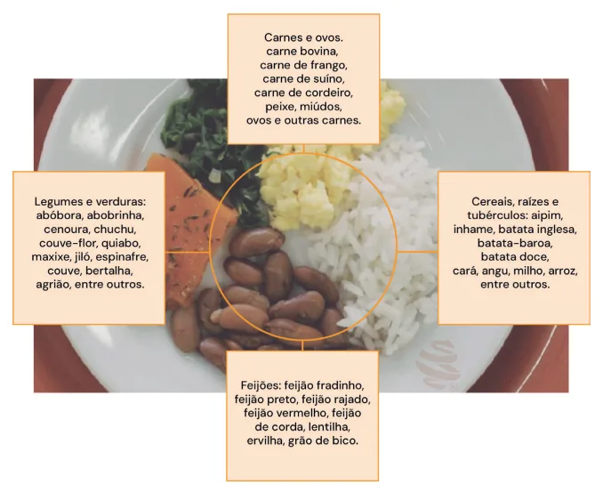
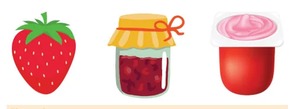

# Alimentação Infantil

<!-- page:1 -->

Alimentação Infantil (PED)

## Alimentação Complementar

| Iniciar a partir dos 6 meses de vida, manter aleitamento materno (AM) complementado (pelo menos até 2 anos).

- Refeição + Frutas;

- Refeição (Papa Principal): 1 alimento de cada grupo: 1 cereal/tubérculo (arroz, batata, macarrão); 1 leguminosa (feijão, lentilha); 1 proteína animal (carne, ovo, peixe); 1 hortaliça (legumes e/ou verduras).

- Manter AM e oferecer água, mas não outros líquidos

(como sucos);

## INÍCIO

- Início da introdução alimentar (IA) aos 6 meses, mantendo Aleitamento Materno (AM) até pelo menos 2 anos: IA do pré-termo: a partir de 6m de idade cronológica, entre 4-6 meses de idade corrigida, R com sinais de prontidão.

- Sinais de Prontidão: sustento cefálico, sentar com mínimo apoio, interesse por alimentos, redução do reflexo de protrusão lingual.

- Com o quê?

- Frutas;

## Refeição/papa principal

‘ Figura 1: Exemplo de Refeição (papa principal) contendo 1 elemento d

- Sempre priorizar alimentos in natura;

- Não adicionar sal até 1 ano pela Sociedade Brasileira de Pediatria (SBP); pelo Ministério da Saúde (MS) adicionar o mínimo de sal;

- Doces apenas após 2 anos, como exceção. Não oferecer ultraprocessados;

- Oferecer alimentos potencialmente alergênicos desde o início da introdução alimentar;

- Primeiros Mil Dias (Gestação + 2 anos): AM e alimentação adequada impactam na vida adulta saudável.

Como?

- Aos 6 meses: 2 lanches (fruta) + 1 refeição/dia OU 1 lanche

(fruta) + 2 refeições/dia.

- De 7 a 8 meses: 2 lanches (fruta) + 2 refeições/dia.

- 1 alimento de cada grupo: Cereal/tubérculo: arroz, batata, macarrão; Leguminosa: feijão, lentilha; Proteína animal: carne, ovo, peixe; Hortaliça: legumes e/ou verduras.

- Fruta como sobremesa (opcional) – ajuda na absorção de ferro;

- Adicionar óleo vegetal no preparo ou no prato;

- Verificar Figura 1 .

de cada grupo.

---

<!-- page:2 -->

## ORIENTAÇÕES GERAIS DOZE PASSOS PARA UMA

- Ofertar água; ALIMENTAÇÃO SAUDÁVEL

- Não adicionar sal até 1 ano pela Sociedade Brasileira de Pediatria (SBP); pelo Ministério da Saúde (MS) adicionar o mínimo de sal;

- Não ofertar açúcar e mel até 2 anos;

- Introduzir alimentos potencialmente alergênicos desde o início da introdução alimentar, com intervalo de 3-5 dias entre eles;

- Evitar sucos; oferecer a fruta in natura;

- Alimentos devem estar separados no prato;

- Consistência: amassado (garfo); > 1 ano comem textura da comida da família;

- Não peneirar ou liquidificar ;

- Não oferecer ultraprocessados.

## ALIMENTAÇÃO COMPLEMENTAR ENTRE

## 1- 2 ANOS

- Café da manhã: fruta + leite materno (LM): Eventualmente: cereal (pão, cuscuz) ou tubérculo

(mandioca) + LM.

- Lanches: fruta + LM;

- Almoço e Jantar;

- Sal: mínimo necessário;

- A partir de 1 ano: evitar sucos; se for oferecer, máximo de 120mL de suco natural da fruta sem açúcar, como parte da refeição/lanche.

## ALIMENTAÇÃO COMPLEMENTAR A PARTIR

## DOS 2 ANOS

- Sal: mínimo necessário;

- Alimentos com açúcar eventualmente, não adicionar açúcar aos outros alimentos (achocolatado).

## TIPOS DE ALIMENTOS

## ALIMENTOS IN NATURA OU MINIMAMENTE

## PROCESSADOS

- Ex: arroz, feijão, frutas, legumes, verduras, carnes, ovos.

## ALIMENTOS PROCESSADOS

- Ex: carne seca, frutas em calda, queijos, pães.

## ALIMENTOS ULTRAPROCESSADOS

- Ex: refrigerante, salgadinho, macarrão instantâneo, salsicha, nuggets;

- Excesso de calorias, sal, açúcar, gorduras e aditivos.

Figura 2: Representação dos tipos de alimentos. Morango - alimento in natura. Geleia de morango - processado.

Queijo petit suisse de morango - ultraprocessado.

1. Amamentar até 2 anos ou mais, oferecendo somente

leite materno até os 6 meses;

2. Oferecer alimentos in natura ou minimamente

processados, além do leite materno, a partir dos 6 meses;

3. Oferecer água, ao invés de sucos, refrigerantes e

bebidas açucaradas;

4. Oferecer comida amassada quando a criança começar

a a comer outros alimentos além do leite materno;

5. Não oferecer açúcar nem produtos/preparos com

açúcar até 2 anos;

6. Não oferecer ultraprocessados;

7. Cozinhar a mesma comida para a criança e a família;

8. Zelar para que a hora da alimentação seja um

momento de experiência positiva, aprendizado e afeto junto da família;

9. Prestar atenção aos sinais de fome e saciedade, e

conversar durante a refeição;

10. Cuidar da higiene da alimentação;

11. Oferecer alimentação saudável também fora de casa;

12. Proteger a criança da publicidade de alimentos.

## ALIMENTAÇÃO DA CRIANÇA NÃO

## AMAMENTADA ATÉ 6 MESES

- Fórmula infantil (FI) de partida (1);

- Evitar ao máximo leite de vaca (LV) integral; se consumo até os 4 meses, usar LV diluído: Diluir - 2/3 de leite fluido + 1/3 de água fervida +

1 colher de chá de óleo para cada 100mL.

## A PARTIR DE 6 MESES: DIVERGÊNCIAS!

- FI de seguimento (2);

- MS – Guia Alimentar: Se LV integral, pode iniciar IA com 4 meses: Se recebendo FI: começar IA com 6 meses, pode receber LV a partir dos 9 meses.

- SBP: Igual MS, exceto LV (a partir dos 12 meses);

- OMS: Sempre iniciar IA com 6 meses: Até 6m: FI; 6-12m: FI ou LV; A partir de 12m: LV.

## CUIDADOS

- Não oferecer fórmula 3 (de primeira infância);

- LV – sempre integral (não deve ser desnatado, nem semidesnatado);

- Preparo adequado: maioria das fórmulas - 1 medida para 30ml de água;

- Não adoçar ou adicionar outras substâncias

(achocolatado, farinha);

- Não oferecer composto lácteo.

---

<!-- page:3 -->

## PRIMEIROS MIL DIAS

- Gestação (270 dias) + primeiros 2 anos (730 dias); Janela de Oportunidades!

- Mãe: alimentação e suplementação adequadas, pré-natal;

- Bebê: AM exclusivo até 6 meses, alimentação complementar saudável, suplementação adequada, vacinação, cuidados de higiene e ambientais;

- Prevenção da Desnutrição Materno-Infantil Reduz morbi-mortalidade; Melhora estatura final; Redução de doenças crônico degenerativas (DM2, obesidade, HAS); Permite desenvolvimento adequado.

- Programação metabólica adequada e epigenética.

## REFERÊNCIAS

Figura 1: Exemplo de Refeição (papa principal) contendo 1 elemento de cada grupo. Fonte: BRASIL. Ministério da Saúde (MS). Guia alimentar para crianças brasileiras menores de 2 anos. Brasília, DF: Ministério da Saúde, 2019.
