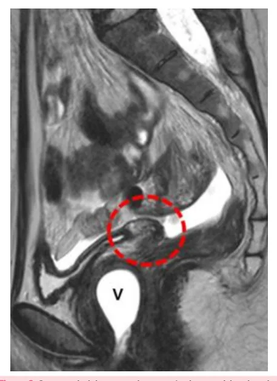
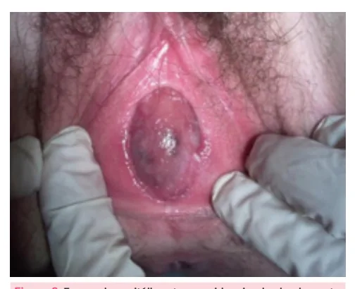

# Amenorreia Primária

<!-- page:1 -->

- Ausência de menarca até os 13 anos sem caracteres sexuais secundários ou aos 15 anos com caracteres sexuais secundários;

- As etiologias são dividas em 4 compartimentos: I. Úterovaginal: malformações Mullerianas; II. Ovário: síndrome de Turner, disgenesia gonadal pura, síndrome de Swyer; III. Hipófise: alterações nesse compartimento estão mais comumente associadas a causas de amenorreia secundária; IV. Hipotálamo: atraso constitucional da puberdade, síndrome de Kallmann.

hímen imperfurado;

- Investigação: anamnese e exame físico detalhados + avaliação laboratorial (FSH e LH) e ultrassonografia pélvica.

## CONCEITOS E CONSIDERAÇÕES GERAIS

- Amenorreia é um sintoma que caracteriza a ausência de menstruação. Nem sempre precisa ser investigada, visto que existem causas fisiológicas.

## CAUSAS FISIOLÓGICAS DE AMENORREIA

- Situações em que se espera ausência de menstruação: gestação; amamentação; menopausa.

## DEFINIÇÃO

- De acordo com a FEBRASGO: Aos 13 anos de idade, quando não há caracteres sexuais secundários visíveis OU; Aos 15 anos de idade, quando há caracteres sexuais secundários normais OU; Quando a menarca não ocorreu 5 anos após o início do desenvolvimento das mamas (se isso se deu antes dos 10 anos de idade).

- De acordo com outras referências em ginecologia: Ausência de menarca até os 14 anos sem caracteres sexuais secundários; Ausência de menarca até os 16 anos com caracteres sexuais secundários.

Criptomenorréia: falta de exteriorização do fluxo menstrual → obstrução → pode ser causa de amenorréia primária ou secundária.

## ETIOLOGIAS

- Para entendermos as causas da amenorreia, é importante relembrar acerca da fisiologia do ciclo menstrual; - Útero presente e FSH/LH baixos sem caracteres m sexuais → RM de crânio (hipogonadismo hipogonadotrófico, ex: Síndrome de Kallmann, atraso constitucional e lesão hipotalâmica/hipofisária);

- Útero presente e FSH/LH normais com caracteres sexuais → obstrução nas vias de saída do trato genital (criptomenorréia, ex: hímen imperfurado, agenesia cervical, septo vaginal transverso e atresia vaginal distal);

- Útero presente e FSH/LH elevados sem caracteres sexuais → cariótipo (hipogonadismo hipergonadotrófico, ex: Síndrome de Swyer, disgenesia gonadal pura, síndrome de Turner);

- Útero ausente → cariótipo (Síndrome de da insensibilidade aos androgênios).

Mayer-Rokitansky-Kuster-Hauser e Síndrome

- No núcleo hipotalâmico é liberado o GnRH de maneira pulsátil. A depender do padrão de pulsatilidade do Maiores frequências estimulam preferencialmente a liberação de LH, ao passo que frequências menores favorecem a secreção de FSH.

GnRH, vai atuar na hipófise anterior com a liberação de FSH e LH:

- A desaceleração da frequência de pulso do GnRH na fase lútea tardia é uma alteração importante que favorece a síntese de FSH;

- Um aumento na frequência e amplitude da secreção pulsátil de GnRH no meio do ciclo, por sua vez, favorece o aumento de LH que é necessário para ovulação e início da fase lútea;

- O FSH/LH atuam em nível ovariano com a liberação de hormônios esteroides (estrogênio e progesterona) a depender da fase do ciclo ovulatório;

- O estrogênio e a progesterona terão ação sistêmica e no útero, levando ao ciclo menstrual da forma como conhecemos;

- Verificar Figura 1 na próxima página.

## COMPARTIMENTOS

- Alterações na função de cada compartimento deste eixo (hipotálamo-hipófise-ovário-útero/endométrio) resultam em diferentes etiologias de amenorreia.

## IV- HIPOTALÂMICO

- O defeito na liberação de GnRH consequentemente leva à diminuição da produção das gonadotrofinas

(LH e FSH);

- Culmina no hipogonadismo hipogonadotrófico, já que as gonadotrofinas (LH e FSH) estão baixas.

---

<!-- page:2 -->

## COMPARTIMENTO ÚTERO-CANALICULAR

Síndrome de Mayer-Rokitansky-Kuster-Hauser GnRH

- Possuem cariótipo 46 XX;

- Ocorre agenesia dos ductos de Muller, resultando em: ausência de útero (eventualmente um útero

- G

Gonadotrofinas: FSH e LH

- E2 e E4

- Útero (endométrio)

Cérvice Vagina Figura 1: Eixo hipotálamo-hipófise-ovário-útero.

## III - HIPOFISÁRIO

- Com o defeito no funcionamento da hipófise anterior, não ocorre a produção de LH e FSH. Com isso, não ocorre a estimulação gonadal e, consequentemente, não ocorre a produção de estrogênio e progesterona;

- Culmina no hipogonadismo hipogonadotrófico, já que as gonadotrofinas (LH e FSH) estão baixas.

## II - OVARIANO

- Ocorre por defeito das gônadas, onde, apesar da produção das gonadotrofinas pela hipófise, ou seja, com a secreção adequada de LH e FSH, não ocorre a resposta ovariana esperada;

- É o que leva ao chamado hipogonadismo hipergonadotrófico, já que as gonadotrofinas (LH e produção ovariana.

FSH) estão aumentadas, como tentativa de estimular a I - UTEROVAGINAL S

- Em geral, por alteração estrutural ou de via de saída A não ocorre a menstruação.

- Principais etiologias de amenorreia primária:

- Atraso constitucional;

- Disgenesia gonadal;

- Agenesia Mulleriana;

- Deficiência de GnRH;

- Hipopituitarismo;

- Septo vaginal transverso. | ausência de útero (eventualmente um útero rudimentar sem atividade endometrial); vagina em fundo cego.

- Os ovários estão normais e funcionantes, não sendo necessária a realização de reposição hormonal nessas pacientes;

- Os caracteres sexuais secundários estão normais, visto que há produção e ação dos hormônios esteroides;

- É frequente a associação com anomalias renais e esqueléticas;

- Um tratamento possível é a reconstrução da vagina (neovagina).

Figura 2: Corte sagital de exame de ressonância magnética de pelve, com destaque para círculo tracejado em vermelho evidenciando ausência de útero. A letra V representa a região vaginal.

Síndrome de Morris ou Síndrome da Insensibilidade aos Androgênios

- Pacientes possuem cariótipo 46 XY;

- Possui a forma completa e a parcial;

- É uma doença recessiva ligada ao cromossomo receptores, resultando em receptores androgênicos não funcionantes;

X em que há uma mutação no gene que codifica

- As gônadas são os testículos, logo, há produção de hormônio antimulleriano, que promove a regressão dos ductos de Muller, culminando em: vagina curta; ausência de útero.

---

<!-- page:3 -->

- Também há produção de testosterona, mas que não

- Os caracteres sexuais secundários são femininos;

tem ação por defeito em seus receptores;

- Ovários normais e funcionantes;

- A genitália externa é feminina (na insensibilidade

- Mulheres com atresia vaginal não apresentam o parcial aos androgênios, a aparência genital é variável, terço inferior da vagina, mas possuem genitália podendo haver micropênis e escroto bífido); externa normal;

podendo haver micropênis e escroto bífido);

- Os pelos estão escassos ou ausentes;

- As mamas podem estar presentes, sendo pequenas, devido à conversão periférica de androgênios em estrogênios (ação da enzima aromatase);

- O diagnóstico é feito a partir do exame físico e ultrassonografia (ausência de órgãos internos femininos);

- O tratamento envolve a realização de reposição hormonal. Pode ser proposta a construção de uma neovagina e, na presença do cromossomo Y, lembrar a realização de gonadectomia devido ao risco de malignização das gônadas masculinas;

- Verificar Tabela 1 .

Hímen imperfurado / Septo vaginal transverso / Atresia vaginal

- Possuem cariótipo 46 XX;

- Há impedimento à exteriorização do sangramento por obstrução do fluxo;

Figura 3: Exame de genitália externa evidenciando abaulamento de região himenal, decorrente de hímen imperfurado e consequente ausência de exteriorização de fluxo menstrual.

Tabela 1: Tabela comparativa entre as características da Síndrom Características Síndrome Rokitan Cariótipo 46 XX Defeito Agenesia dos ductos d Mamas Sim Pelos Sim Gônadas Ovários Tratamento Neovagina externa normal;

- Cursa com quadro de criptomenorreia;

- Em geral, o quadro é visualizado nas pacientes jovens, com idade próxima à ocorrência da menstruação.

Contudo, evoluem com dor pélvica prolongada, muitas vezes progressiva, associada a mal-estar e sintomas sistêmicos;

- Ao exame físico, percebe-se abaulamento da região himenal;

- Ao exame de imagem, nota-se acúmulo de sangue na cavidade intrauterina, podendo evoluir com hematossalpinge ou hemoperitônio;

- O tratamento é cirúrgico com a desobstrução ao fluxo.

COMPARTIMENTO GONADAL Síndrome de Turner

- Possuem cariótipo 45 X0 ou cariótipo “em mosaico”

(parte é 45, X e parte é 46, XX);

- É a disgenesia gonadal mais comum;

- As gônadas não estão desenvolvidas (em fita);

- Como não há produção dos hormônios esteróides ovarianos, não há caracteres sexuais secundários;

- Genitália externa e interna femininas e pré-púberes;

- É comum a presença de estigmas associados à síndrome (baixa estatura, micrognatia, implantação baixa das orelhas, pescoço alado), de distúrbios autoimunes (tireoidite, Diabetes mellitus, vitiligo), de anomalias cardíacas (constrição da aorta) e renais (rim pélvico, agenesia renal);

- O diagnóstico é feito a partir da análise do cariótipo;

- O tratamento envolve a reposição hormonal risco cardiovascular);

(proteger a saúde óssea dessas pacientes e reduzir o

- Considerar uso de GH exógeno até a puberdade para aumentar a estatura final;

- Verificar Figura 4 na próxima página.

me de Mayer-Rokitansky-Kuster-Hauser e Síndrome de Morris. nsky Síndrome de Morris 46 XY de Muller Defeito no receptor de androgênios Sim (pequenas)

Escassos ou ausentes Testículos TH + neovagina + gonadectomia

---

<!-- page:4 -->

Amenorreia primária SEM caracteres sexuais secundários Figura 4: Estigmas da síndrome de Turner. Disgenesia Gonadal Pura

- A maioria das pacientes com gônadas não funcionantes possui cariótipo 46 XX;

- Na disgenesia gonadal pura, as gônadas não funcionam e, com isso, não ocorre a produção de esteroides sexuais;

- Sendo um defeito do compartimento II, leva ao quadro de hipogonadismo hipergonadotrófico;

- Apresenta-se com amenorreia primária SEM caracteres sexuais secundários devido à ausência dos hormônios esteroides ovarianos;

- Logo, a genitália interna e externa são femininas e em estágio pré-púbere;

- O diagnóstico é feito com anamnese, exame físico e S exames complementares (FSH, cariótipo);

- O tratamento é feito com terapia hormonal.

Em cerca de 20% dos casos, no entanto, podemos ter o cariótipo 46 XY. Aqui, estamos falando da Síndrome de Swyer.

Síndrome de Swyer

- Causa de disgenesia gonadal pura com cariótipo 46 XY;

- Como consequência de uma mutação ou deleção no gene SRY, os testículos são disgenéticos, logo, não produzem hormônio antimulleriano nem testosterona;

- Na ausência do hormônio antimulleriano, ocorre desenvolvimento de útero, tubas e terço superior da vagina;

- Na ausência de testosterona, a genitália externa é feminina;

- Amenorreia primária sem caracteres sexuais secundários;

- Genitália interna e externa pré-púberes;

- O tratamento é feito com terapia hormonal.

Obs.: o que diferencia da Síndrome de Morris é que no caso de Síndrome de Swyer, o útero estará presente, enquanto na síndrome de Morris o útero é ausente. SEM caracteres sexuais secundários FSH alto Síndrome Disgenesia Síndrome de Turner gonadal pura de Swyer Figura 5: Causas de amenorreia primária com acometimento do compartimento ovariano.

## COMPARTIMENTO HIPOTALÂMICO

Deficiência isolada de GnRH

- Há defeito na produção ou secreção de GnRH ou resistência à sua ação na hipófise;

- É caracterizado por baixas concentrações de esteroides sexuais associadas a valores baixos de gonadotrofinas (hipogonadismo hipogonadotrófico);

- Durante a investigação, a secreção dos demais hormônios hipofisários se encontra normal, bem como a ressonância magnética de região hipotalâmica-hipofisária, demonstrando a ausência de uma causa anatômica;

- Amenorreia primária sem caracteres sexuais secundários.

Em até 60% dos casos, estamos falando da Síndrome de Kallmann. Síndrome de Kallmann

- Cariótipo 46 XX ou 46 XY;

- Durante o desenvolvimento embriológico, ocorre uma falha na migração de células neuronais olfatórias e células produtoras de GnRH da placa cribiforme do nariz até a área pré-óptica e hipotalâmica;

- Sem a migração das células produtoras de GnRH, a sua produção não ocorre. Com isso, não há estímulo para produção de LH e FSH e, consequentemente, não há estímulo gonadal;

- Sendo assim, é caracterizada por um hipogonadismo hipogonadotrófico;

- Infantilismo sexual (ausência de caracteres sexuais secundários);

- Hiposmia/anosmia;

- Pode estar associado a fenda palatina, ataxia cerebelar, surdez neurossensorial, agenesia renal unilateral (em até 40% dos casos);

- Administração pulsátil de GnRH exógeno.

Observação: a síndrome de Kallmann pode ocorrer em pacientes com cariótipo XY ou XX. Quando ocorre em pacientes do sexo masculino, manifestase com imaturidade testicular e células de Leydig atrofiadas. Quando ocorre em pacientes do sexo feminino, manifesta-se como amenorreia primária e imaturidade sexual.

---

<!-- page:5 -->

Atraso constitucional da puberdade Útero está presente

- Cariótipo 46 XX;

- É a causa mais comum de puberdade tardia e ocorre por um atraso constitucional na produção do

Sem caracteres sexuais FSH/LH elevados GnRH pulsátil; secundários GnRH pulsátil;

- Ocorre geralmente por um padrão autossômico dominante familiar;

- Amenorreia primária com atraso no desenvolvimento dos caracteres sexuais secundários;

- É um diagnóstico de exclusão;

- Nesses casos, a maturação sexual acompanha maturação óssea e não idade cronológica da paciente;

- Portanto, a idade óssea não é compatível com a idade cronológica;

- A dosagem das gonadotrofinas estão normais para a infância.

## ROTEIRO DIAGNÓSTICO DE

Anamnese e exame físico detalhados Avaliação laboratorial Ultrassonografia básica (FSH, LH) pélvica Útero está presente?

FSH e LH normal, alto ou baixo? Há sinais de desenvolvimento de caracteres sexuais? Útero está presente Sem caracteres sexuais FSH/LH baixos ou normais secundários RM crânio Hipogonadismo HIPOgonadotrófico (central)

Lesão Síndrome Atraso hipotalâmica, Kallman constitucional hipofisária Figura 6: Diagnóstico de causas de amenorreia primária com presença de útero e ausência de caracteres sexuais secundários.

Útero está presente Com caracteres sexuais FSH/LH baixos ou normais secundários Considerar Obstrução nas vias de saída do trato genital Criptomenorreia (falsa amenorreia)

Hímen imperfurado Agenesia cervical Septo vaginal transverso Atresia vaginal distal Figura 7: Diagnóstico de causas de amenorreia primária com presença de útero e presença de caracteres sexuais secundários. FSH/LH elevados secundários Cariótipo Hipogonadismo HIPERgonadotrófico Periférico/gonadal 46 XX 45 X0 46 XY Síndrome Disgenesia Síndrome Swyer gonadal pura de Turner Figura 8: Diagnóstico de causas de amenorreia primária com presença de útero e gonadotrofinas elevadas.

Útero ausente Cariótipo 46 XX Síndrome de 46 XY Síndrome Mayer-Rokitansky- da insensibilidade -Kuster-Hauser aos androgênios Figura 9: Diagnóstico de causas de amenorreia primária diante de ausência de útero.

## REFERÊNCIAS

Figura 2: Corte sagital de exame de ressonância magnética de pelve, com destaque para círculo tracejado em vermelho evidenciando ausência de útero. A letra V representa a região vaginal.

FLEURY. Artigos científicos: Síndrome de Mayer-Rokitansky-Küster-Hauser. Disponível em: https://www.fleury.com.br/medico/artigos-cientificos/ sindrome-de-mayer-rokitansky-kuster-hauser. Acesso em: 10 maio 2025.

Figura 3: Exame de genitália externa evidenciando abaulamento de região himenal, decorrente de hímen imperfurado e consequente ausência de exteriorização de fluxo menstrual.

CORREIA, C.; PARDAL, C.; RIBEIRO, B. Pelvic masses in a 13-year-old girl—a (not so) rare diagnosis. BMJ Case Reports, [S.l.], 2015. Disponível em:

https://casereports.bmj.com/content/2015/bcr-2015-209303. Acesso em: 20 abr. 2025. Figura 4: Estigmas da síndrome de Turner.

. BUCERZAN, S. et al. Clinical and genetic characteristics in a group of 45 patients with Turner syndrome (monocentric study). Therapeutics and Clinical Risk Management, v. 13, p. 613–622, 2017.
