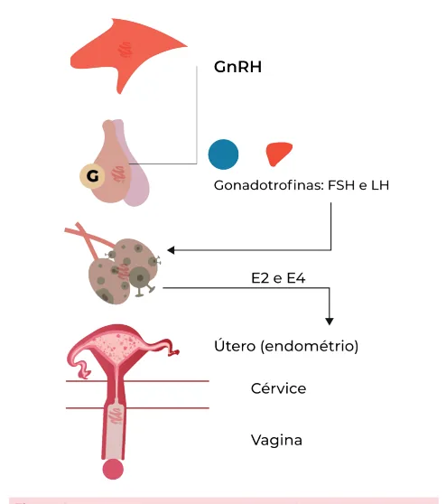
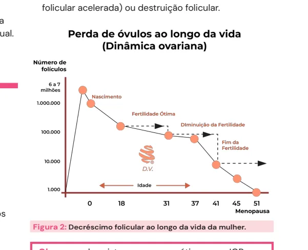
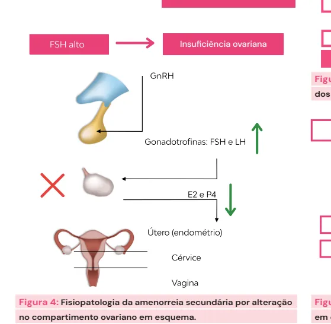

# Amenorreia Secundária

<!-- page:1 -->

- Ausência de menstruação por um período mínimo de 3 meses ou menos de 9 ciclos menstruais, no período de um ano;
- Etiologias:
  - **I. Uterovaginal**: síndrome de Asherman;
  - **II. Ovário**: SOP, IOP, síndrome de Savage;
  - **III. Hipófise**: hiperprolactinemia, síndrome de Sheehan;
  - **IV. Hipotálamo**: amenorreia funcional.
- Anamnese e exame físico detalhados;
- Afastar gravidez e dosagem de FSH:
  - FSH baixo → disfunção hipotalâmica ou hipofisária;
  - FSH normal → dosagem de prolactina (se prolactina alta = hiperprolactinemia; se prolactina normal = dosar TSH).

## Definição

## Conceitos e Considerações Gerais

- **Amenorreia** é um sintoma que caracteriza a ausência de menstruação. Nem sempre precisa ser investigada, visto que existem causas fisiológicas.

**Causas fisiológicas de amenorreia**

- Situações em que se espera ausência de menstruação: gestação; amamentação; menopausa.

**De acordo com a FEBRASGO**

- Ausência de menstruação por um período mínimo de 3 meses; OU
- Menos de 9 ciclos menstruais no período de um ano.

**De acordo com outras referências em ginecologia**

- Ausência de menstruação por mais de seis meses (mulheres com ciclos irregulares);
- Ausência de menstruação por mais de três ciclos (mulheres com ciclos regulares);
- **Criptomenorreia**: falta de exteriorização do fluxo menstrual.

*Figura 1: Eixo hipotálamo-hipófise-ovário-útero.*

## Etiologias

- Para entendermos as causas da amenorreia, é importante relembrar acerca da fisiologia do ciclo menstrual;
- No núcleo hipotalâmico é liberado o GnRH de maneira pulsátil. A depender do padrão de pulsatilidade do GnRH, vai atuar na hipófise anterior com a liberação de FSH e LH;
- A desaceleração da frequência de pulso do GnRH na fase lútea tardia é uma alteração importante que favorece a síntese de FSH;
- Um aumento na frequência e amplitude da secreção pulsátil de GnRH no meio do ciclo, por sua vez, favorece o aumento de LH que é necessário para ovulação e início da fase lútea;
- O FSH/LH atuam em nível ovariano com a liberação de hormônios esteroides (estrogênio e progesterona) a depender da fase do ciclo ovulatório;
- O estrogênio e a progesterona terão ação sistêmica e no útero, levando ao ciclo menstrual da forma como conhecemos.

## Compartimentos

- Alterações na função de cada compartimento deste eixo (hipotálamo-hipófise-ovário-útero/endométrio) resultam em diferentes etiologias de amenorreia.

### IV - Hipotalâmico

- O defeito na liberação de GnRH consequentemente leva à diminuição da produção das gonadotrofinas (LH e FSH);
- Culmina no **hipogonadismo hipogonadotrófico**, já que as gonadotrofinas (LH e FSH) estão baixas.

### III - Hipofisário

- Com o defeito no funcionamento da hipófise anterior, não ocorre a produção de LH e FSH;
- Com isso, não ocorre a estimulação gonadal e, consequentemente, não ocorre a produção de estrogênio e progesterona;
- Culmina no **hipogonadismo hipogonadotrófico**, já que as gonadotrofinas (LH e FSH) estão baixas.

---

<!-- page:2 -->

### II - Ovariano

- Ocorre por defeito das gônadas, onde, apesar da produção das gonadotrofinas pela hipófise, ou seja, com a secreção adequada de LH e FSH, não ocorre a resposta ovariana esperada;
- É o que leva ao chamado **hipogonadismo hipergonadotrófico**, já que as gonadotrofinas (LH e FSH) estão aumentadas, como tentativa de estimular a produção ovariana.

### I - Uterovaginal

- Em geral, por alteração estrutural ou de via de saída, não ocorre a exteriorização do sangramento menstrual.

> ⚠️ Legenda de figura reconstruída a partir de OCR — confira contra a fonte original.

*Figura 2: Decréscimo folicular ao longo da vida da mulher (número de folículos: 6 a 7 milhões ao nascimento, cerca de 1.000.000 na infância, declínio progressivo até a menopausa, com pico de fertilidade ótima seguido de declínio até a insuficiência ovariana).*

## Principais Etiologias

- Gestacional;
- Lactacional;
- Menopausa;
- Síndrome dos ovários policísticos (SOP);
- Hiperprolactinemia;
- Insuficiência ovariana prematura (IOP);
- Sinéquias intrauterinas;
- Hipotalâmica.

## Compartimento Útero-Canalicular

### Síndrome de Asherman

- Ocorre a formação de sinéquias intrauterinas secundárias a procedimentos intrauterinos (ex.: curetagens, miomectomia histeroscópica) ou outros processos inflamatórios pélvicos;
- As aderências são compostas por faixas de tecido conjuntivo fibromuscular que podem ou não estar circundadas por epitélio superficial ou tecido glandular;
- Dor pélvica, disfunção menstrual, infertilidade, abortos de repetição;
- Diagnóstico definitivo: histeroscopia mostrando a localização e extensão das aderências intrauterinas;
- Todas as dosagens hormonais estão normais, visto que o problema não é gonadal (ovariano), mas canalicular;
- O tratamento é a lise de aderências por histeroscopia.

## Compartimento Ovariano

### Síndrome dos Ovários Policísticos (SOP)

- Manifesta-se clinicamente com: disfunção ovulatória (ciclos menstruais longos ou amenorreia com anovulação); sinais de hiperandrogenismo; presença de ovários com aspecto policístico à ultrassonografia;
- É frequente a associação com síndrome metabólica nessas pacientes;
- Na investigação hormonal, os níveis de LH encontram-se superiores aos de FSH;
- São utilizados os critérios de Rotterdam e consenso internacional para diagnóstico;
- É a principal causa de amenorreia secundária anovulatória.

**Obs.**: a SOP é abordada em detalhes em aula específica à parte.

### Insuficiência Ovariana Prematura (IOP)

- Perda da função ovariana antes dos 40 anos de idade;
- Por causas variadas, que incluem defeitos cromossômicos e genéticos, deficiências enzimáticas, processos autoimunes, consequências de radio ou quimioterapia sobre os ovários, infecções ou cirurgias, ocorre a depleção e a disfunção folicular;
- A depleção folicular é a mais comum e pode ser consequência de redução do número inicial de folículos primordiais, aumento da apoptose (atresia folicular acelerada) ou destruição folicular.

**Obs.**: quando existem causas genéticas para IOP, em geral, manifesta-se como amenorreia primária.

- O quadro clínico é caracterizado por alteração menstrual tipo oligo/amenorreia por pelo menos 4 meses, não sendo obrigatório apresentar sintomas de hipoestrogenismo, por exemplo, fogachos;
- Pode ainda permanecer como causa idiopática na maioria das vezes;
- O diagnóstico é baseado no histórico clínico + dosagem de FSH > 25 mUI/mL (ou > 40 mUI/mL), persistindo esse valor aumentado em duas dosagens com intervalo de 30 dias entre elas;
- A investigação diagnóstica é obrigatória no surgimento de amenorreia anteriormente aos 30 anos de idade, com a realização de:
  - **Cariótipo** (afastar síndrome de Turner ou cromossomo Y);
  - **Pesquisa do X frágil**: resulta de uma mutação em determinada região do gene FMR1, que se localiza no cromossomo X. Essa mutação é bastante peculiar e se caracteriza por aumento no número de repetições de trincas de bases (citosina-guanina-guanina). Em meninas é uma causa importante de IOP;
  - **Pesquisa de autoanticorpos** para investigar uma possível ooforite autoimune: em geral, é secundária a algumas doenças como adrenalite ou pós-caxumba. Nessas situações, há a produção de autoanticorpos contra os ovários.

---

<!-- page:3 -->

- Os objetivos do tratamento da IOP são reverter os sintomas e reduzir as repercussões do hipoestrogenismo;
- Envolve principalmente a reposição hormonal para preservar a saúde óssea dessas pacientes e reduzir seu risco cardiovascular;
- Se infertilidade, considerar técnicas de reprodução assistida com oócitos doados.

### Síndrome de Savage ou Síndrome de Resistência Ovariana

- Cariótipo 46 XX com resistência parcial à ação das gonadotrofinas;
- As gônadas são funcionantes, porém não há esteroidogênese por conta de uma mutação em nível de receptor ou pós-receptor das gonadotrofinas, não permitindo a ação destes hormônios;
- Ausência de caracteres sexuais secundários; em geral, o que ocorre é a amenorreia secundária;
- O diagnóstico é feito pela presença de elevados níveis de gonadotrofinas, sem depleção folicular;
- Pode ser feita avaliação histológica dos ovários: presença de folículos, ausência de infiltrado linfocitário;
- O tratamento é feito com terapia hormonal.

## Compartimento Hipofisário

### Hiperprolactinemia

- Níveis elevados de prolactina alteram a secreção pulsátil do GnRH, interferindo na liberação de gonadotrofinas e na esteroidogênese gonadal. A dopamina é o principal regulador da biossíntese e secreção da prolactina. Diante de níveis elevados de prolactina, ocorre uma elevação reflexa nos níveis de dopamina, que, por sua vez, contribui para alteração da função neuronal do GnRH;
- Leva a um **hipogonadismo hipogonadotrófico**;
- As principais causas são:
  - **Medicamentos**: antagonistas dopaminérgicos (metoclopramida, tricíclicos, haloperidol);
  - **Tumores produtores de prolactina** (adenomas hipofisários);
  - **Hipotireoidismo**: o hormônio liberador da tireotrofina (TRH) é um dos mais potentes estimuladores da síntese de prolactina. Sendo assim, quando há hipotireoidismo (com consequente elevação de TSH e TRH), poderá haver hiperprolactinemia;
  - **Insuficiência renal**, levando à redução da depuração do hormônio prolactina e consequente aumento de seu nível circulante.
- O quadro clínico é caracterizado por galactorreia associada à oligomenorreia e amenorreia;
- É mais frequentemente observada como causa de amenorreia secundária;
- O tratamento é feito com agonistas dopaminérgicos.

### Síndrome de Sheehan

- Ocorre um pan-hipopituitarismo por necrose hipofisária após hemorragia pós-parto;
- Isso porque, durante a gestação, é comum o ingurgitamento hipofisário. Em caso de sangramento exuberante no parto, ocorre consequentemente uma hipovolemia. A hipófise, que tinha um fluxo sanguíneo aumentado por conta do ingurgitamento gestacional, fica sem irrigação;
- O quadro clínico é composto por: amenorreia; agalactia; perda de pelos pubianos e axilares; manifestações de hipotireoidismo; insuficiência suprarrenal;
- O tratamento das deficiências hormonais em pacientes com síndrome de Sheehan é feito como em qualquer outro paciente com hipopituitarismo, devendo incluir:
  - **Disfunção tireoidiana**: levotiroxina;
  - **Deficiência de gonadotrofinas**: reposição de estrogênio e progesterona;
  - **Déficit corticotrófico**: corticoide oral.

## Compartimento Hipotalâmico

### Amenorreia Funcional

- Algumas situações como transtornos alimentares, exercícios físicos extenuantes e estresse podem levar à supressão da secreção pulsátil de GnRH, além de reversão da secreção pulsátil do LH para os padrões pré-púberes, com supressão da produção hipofisária de LH e do FSH;
- O tratamento deve ser guiado pela causa; exemplo: na anorexia nervosa, a recuperação da nutrição e do peso favorece a resolução da amenorreia.

*Figura 3: Fisiopatologia da amenorreia funcional em esquema (anorexia nervosa e bulimia, exercícios extenuantes, estresse → leptina, CRH, endorfinas, NPY → supressão da pulsatilidade do GnRH → amenorreia).*

---

<!-- page:4 -->

## Roteiro Diagnóstico

- Anamnese e exame físico detalhados;
- Afastar gravidez;
- Dosagem de FSH:
  - **FSH baixo** → disfunção hipotalâmica ou hipofisária → neuroimagem; estrutura de SNC; teste de GnRH;
  - **FSH normal** → dosagem de prolactina:
    - Prolactina alta → hiperprolactinemia;
    - Prolactina normal → dosagem de TSH:
      - TSH alterado → tireoidopatia;
      - TSH normal → teste da progesterona / teste do estrogênio → avaliar compartimento uterovaginal (anovulação);
  - Insuficiência ovariana (FSH alto).

*Figura 4: Fisiopatologia da amenorreia secundária por alteração no compartimento ovariano, em esquema.*

*Figura 5: Fisiopatologia da amenorreia secundária por alteração em sistema nervoso central, em esquema.*

*Figura 6: Fisiopatologia da amenorreia secundária por alteração dos níveis de prolactina, em esquema.*

*Figura 7: Fisiopatologia da amenorreia secundária por alteração dos níveis de hormônios tireoidianos, em esquema.*

*Figura 8: Fisiopatologia da amenorreia secundária por alteração em compartimento uterino ou vaginal.*

## Conceitos Gerais Para Tratamento

- Lembre-se: a amenorreia é um sintoma;
- O objetivo é o tratamento direcionado para a causa!
- Elucidação diagnóstica;
- É possível a reversão da causa?
- Evitar as consequências do hipoestrogenismo — pode afetar a saúde óssea e aumentar o risco cardiovascular;
- Avaliar o potencial reprodutivo;
- Avaliar o risco do desenvolvimento de tumores gonadais.

