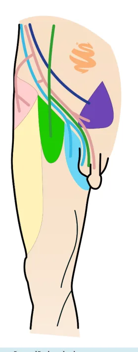
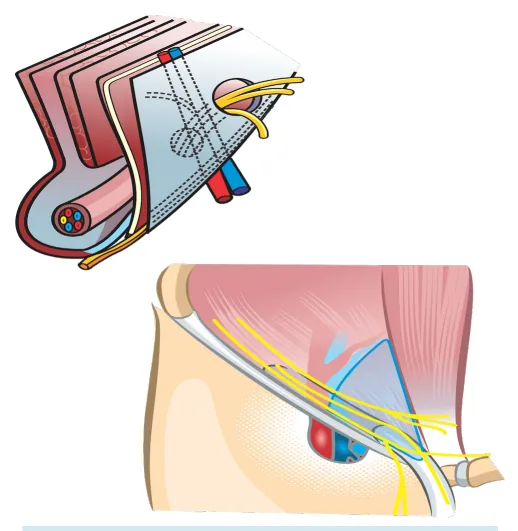

# Anatomia da Parede Abdominal

<!-- page:1 -->

## HÉRNIAS: ANATOMIA DA

## PAREDE ABDOMINAL

PAREDE ABDOMINA Hérnias

## TRIÂNGULO DE HASSELBACH

- Vasos epigástricos inferiores;

- Ligamento inguinal;

- Reto abdominal. R

## CANAL INGUINAL

- Limite anterior: Formação = Aponeurose do oblíquo externo; Se finaliza no ligamento inguinal.

- Limite inferior: Chão do canal: Fáscia transversalis / m. transverso.

- Início: Lateral e profundo → Anel inguinal interno; Abertura na fáscia transversalis.

## ANATOMIA PAREDE ABDOMINAL

## MÚSCULOS

- Reto;

- Moe - músculo oblíquo externo; T

- Moi- músculo oblíquo interno;

- Transverso.

## CAMADAS

- Pele;

- Subcutâneo (Camper e Scarpa);

- Aponeurose oblíquo externo;

- MOE;

- MOI;

- Transverso;

- Fáscia transversalis;

- Gordura pré-peritoneal;

- Peritônio;

## VASCULARIZAÇÃO

- Vasos epigástricos: superiores (que são ramos da mamária); inferiores (que são ramos da ilíaca externa).

## INERVAÇÃO

- N. Genitofemoral *

- N. Ilioinguinal *

- N. Iliohipogástrico*

- N. Cutâneo femoral lateral*

- Verificar Figura 1

## ANATOMIA REGIÃO INGUINAL

- Pele;

- Subcutâneo (Camper e Scarpa);

- Aponeurose oblíquo externo;

- Chão do canal inguinal; AL

- Final: Medial e superficial → Anel inguinal externo; Abertura do músculo oblíquo externo.

## REGIÃO INGUINAL

- Dividido em superior e inferior pelo ligamento inguinal: Superior; Inferior → hérnias femorais.

- Dividido em medial e lateral pelos vasos epigástricos: Medial → hérnias diretas (Triângulo de Hasselbach) ; Lateral → Hérnias indiretas.

- Fáscia transversalis;

- Gordura pré-peritoneal;

- Peritônio.

- Vasos epigástricos inferiores;

- Ligamento inguinal;

- Reto abdominal.

Figura 1: Inervação região inguinal.

---

<!-- page:2 -->

Região da parede abdominal anterior que não é protegida por musculatura = mais propensa à formação de hérnias.

Figura 2: Triângulo de Hasselbach.

## CANAL INGUINAL LIMITES

- Anterior: aponeurose do oblíquo externo e finaliza no ligamento inguinal.

- Inferior (chão do canal): fáscia transversalis/m. transverso.

- Início (região lateral e profunda): anel inguinal interno com abertura na fáscia transversalis.

- Final (região medial e superficial): anel inguinal externo com abertura do m. oblíquo externo.

## CONTEÚDO DO CANAL INGUINAL

- Homens: cordão espermático; m. cremaster;

artéria e veia testicular; ducto deferente; vasos cremastéricos; processo vaginalis; ramo genital do nervo genitofemoral.

- Mulheres: Ligamento redondo.

## ORIFÍCIO MIOPECTÍNEO DE FROUCHARD

- Limites: Superior: Arco do músculo interno e transverso Inferior: Ligamento Pectíneo (Cooper); Lateral: Músculo ileopsoas; Medial : Reto abdominal e púbis. - Limite superior: arco do músculo interno e transverso

(tendão conjunto); (tendão conjunto);

- Limite inferior: ligamento pectíneo (Cooper);

- Limite lateral: m. Ileopsoas;

- Limite medial: parede lateral do reto abdominal e púbis;

- Pode ser dividido em superior e inferior pelo ligamento inguinal. Inferior = hérnias femorais.

- Pode ser dividido em medial e lateral pelos vasos epigástricos. Medial: hérnias diretas; Lateral: hérnias indiretas.

## HÉRNIA

- Abaulamento, protusão ou projeção de um órgão ou parte dele através das paredes que o contém.

## FATORES DE RISCO

- Fraqueza da parede;

- Tabagismo;

- Diabetes;

- Desnutrição;

- Imunossupressão;

- Doenças do colágeno.

## FISIOPATOLOGIA

- Elevação da pressão intra-abdominal;

- Tosse crônica;

- Prostatismo;

- Obesidade;

- Ascite;

- Gestação;

- Tumores.

