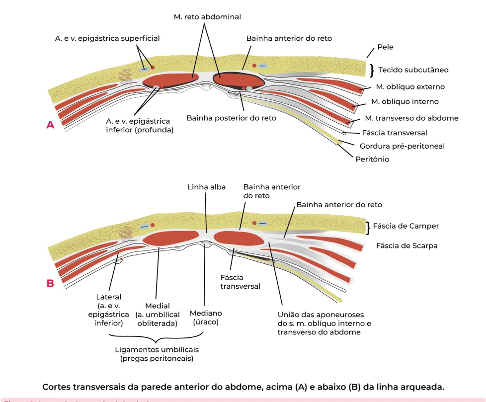
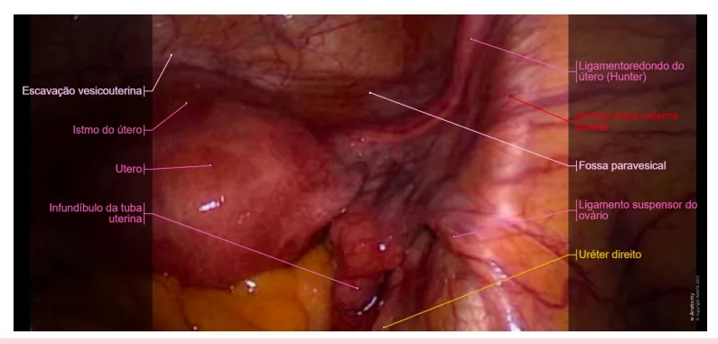
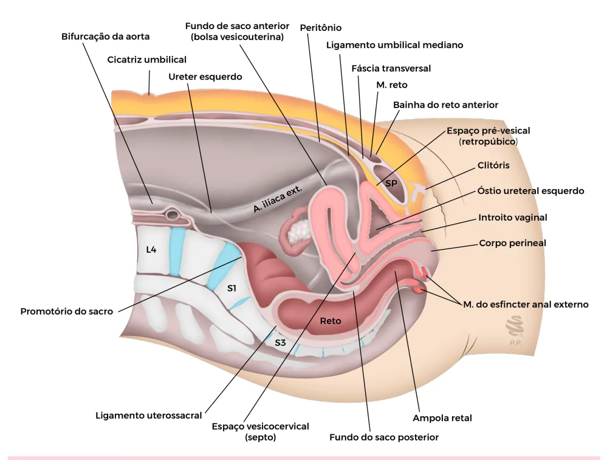
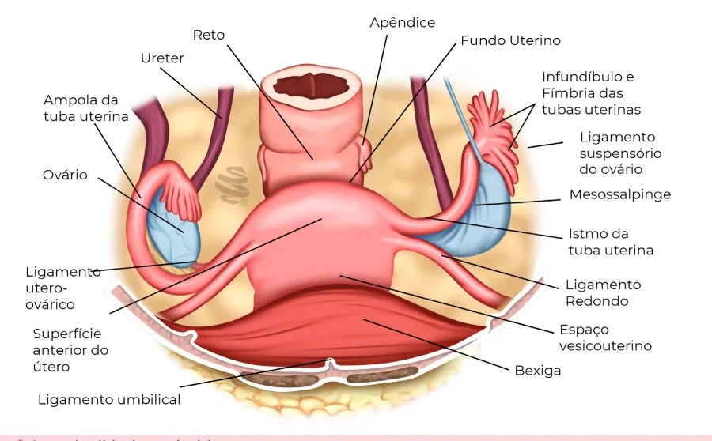
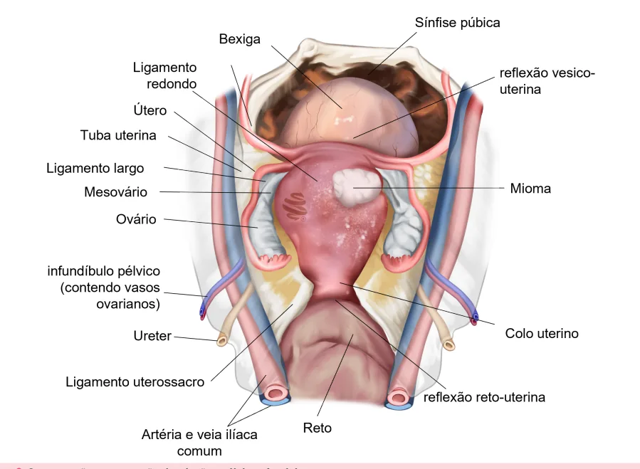
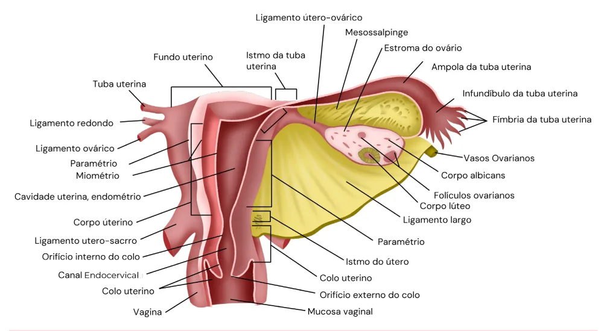
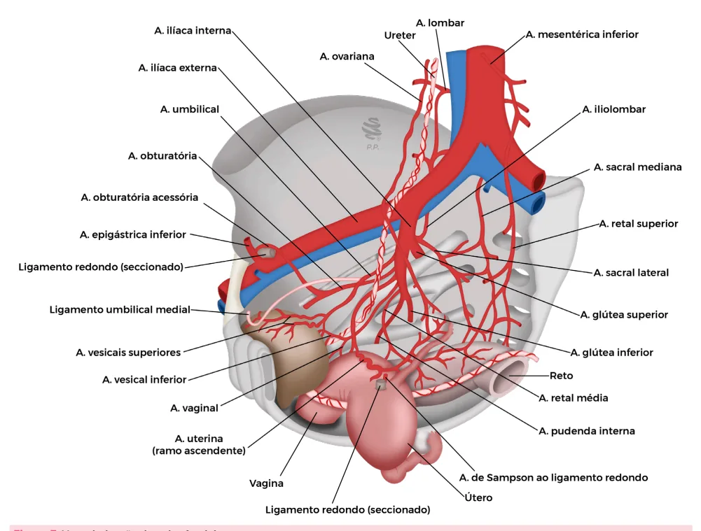
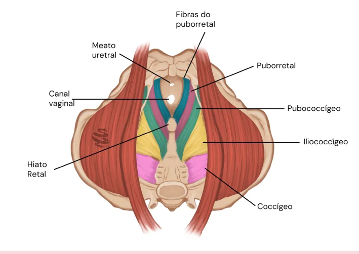
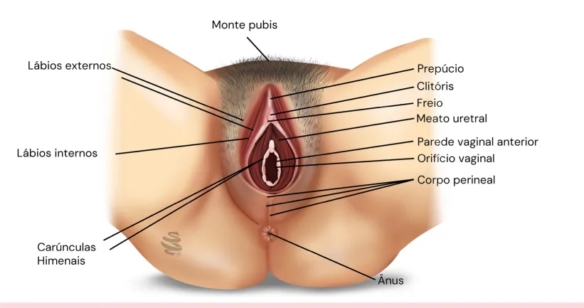

# Anatomia Pélvica Feminina

<!-- page:1 -->

> ⚠️ Este documento tem origem em um PDF de duas colunas; a reconstrução abaixo une os fragmentos na ordem mais provável — confira contra a fonte original em caso de dúvida.

## Parede abdominal

- **Parede abdominal**: os principais músculos responsáveis pela sustentação dessa região são o reto abdominal, o transverso do abdome, o oblíquo externo e o oblíquo interno.
- Há uma diferença anatômica na distribuição das estruturas acima e abaixo da **linha arqueada**:
  - **Acima da linha arqueada** → face anterior: aponeuroses dos músculos oblíquo externo e interno; face posterior: aponeurose dos músculos oblíquo interno e transverso do abdome.
  - **Abaixo da linha arqueada** → face anterior: aponeuroses dos músculos oblíquo externo, oblíquo interno e transverso do abdome; face posterior: fáscia transversal.
- **Genitália interna**: as principais estruturas são o útero, as tubas uterinas e os ovários.
- Os espaços avasculares entre as estruturas são importantes na realização de procedimentos cirúrgicos, sendo os principais: espaços retropúbico, vesicouterino e retrouterino.
- **Relações anatômicas importantes**: ureter e artéria uterina → o ureter passa abaixo da artéria uterina. Na episiotomia há secção dos músculos bulbocavernoso e transverso do períneo.

**Pontos de risco para lesão ureteral:**

- Ligadura da artéria uterina.
- Ligadura do infundíbulo pélvico.
- Fechamento da cúpula vaginal — risco de acotovelamento do ureter.

**Vascularização e drenagem** — importante conhecer os principais ramos das artérias ilíacas interna e externa:

- Artéria ilíaca interna → tem como ramo mais importante a artéria uterina.
- Artéria ilíaca externa → tem como ramo mais conhecido a artéria epigástrica inferior.
- Artéria ovariana → é um ramo direto da aorta.
- A drenagem da veia ovariana direita é feita na veia cava inferior, enquanto a veia ovariana esquerda é drenada para a veia renal esquerda.

**Assoalho pélvico e períneo**: responsável pela sustentação dos órgãos pélvicos; composto por corpo perineal, isquiocavernoso, bulbocavernoso e transverso do períneo.

## Parede abdominal — marcos anatômicos

- Na ginecologia, os músculos mais importantes que compõem a parede abdominal são: transverso do abdome, oblíquo interno, oblíquo externo e reto abdominal.
- **Marcos anatômicos importantes na via laparoscópica**: músculo reto abdominal; a artéria epigástrica inferior (ramo da ilíaca externa) → risco de lesão na punção dos trocateres laterais; a artéria circunflexa superficial.
- Verificar Figura 2 na próxima página.

## Genitália interna

- Há uma diferença anatômica na distribuição das estruturas acima e abaixo da linha arqueada (continuação da parede abdominal):
  - **Acima da linha arqueada** → a face anterior do músculo reto abdominal tem contato com as aponeuroses dos músculos oblíquo externo e interno; a face posterior tem contato com a aponeurose dos músculos oblíquo interno e transverso do abdome.
  - **Abaixo da linha arqueada** → a face anterior do músculo reto abdominal é recoberta pelas aponeuroses dos músculos oblíquo externo, oblíquo interno e transverso do abdome; já a face posterior tem contato apenas com a fáscia transversal.
- **Exemplo prático**: na cesárea, logo abaixo do músculo reto abdominal não há mais aponeurose, havendo contato direto com o peritônio.
- Verificar Figura 1 na próxima página.
- No contexto ginecológico e obstétrico, a incisão cirúrgica mais realizada é a **Pfannenstiel**; é realizada abaixo da chamada "linha arqueada". Os tecidos seccionados são: pele, tecido celular subcutâneo, aponeurose, músculo reto abdominal (apenas afastado) e peritônio.

- É muito importante conhecer a relação dos órgãos genitais internos entre si.
- Verificar Figura 3 na próxima página.
- **Aplicação prática**: ligamento redondo e tuba uterina são próximos e parecidos, podendo haver casos de secção do redondo em procedimentos de laqueadura tubária, seguida de falha de laqueadura.

**Principais órgãos pélvicos:**

- Útero.
- **Ligamento redondo**: liga-se à região anterior do útero até a região dos lábios externos; atua promovendo o movimento de anteversão uterino.
- **Ovários** (formados pelos três folhetos embrionários); não estão diretamente conectados às tubas uterinas.
- **Tubas uterinas**: têm a função de captar o óvulo liberado pelo ovário, o que exige um bom funcionamento das fímbrias e perviedade tubária.
- Ligamento suspensor do ovário.
- Ureteres — inserem-se anteriormente, na bexiga.
- Bexiga — localizada na região anterior.

---

<!-- page:2 -->

**Órgãos pélvicos (continuação):**

- Reto — localizado na região posterior.
- Fundo de saco posterior.
- Ureteres.
- Fundo do útero.
- Corpo do útero.
- Colo do útero.
- Bexiga e uretra.
- **Recesso vesicouterino**: é o espaço localizado entre o útero e a bexiga → fundo de saco anterior (bolsa vesicouterina).

**Continuação — parede abdominal:**

- Artéria ilíaca externa.
- Verificar Figura 4 na próxima página.
- **Aplicação prática**: nos procedimentos de reprodução humana, para que seja realizada a captação dos óvulos, é introduzido um transdutor de ultrassom acoplado a uma agulha no fundo de saco vaginal, o que permite o contato direto com o ovário estimulado.

*Figura 1: Anatomia da parede abdominal. Figura 2: Pelve feminina vista pela laparoscopia.*

---

<!-- page:3 -->

*Figura 3: Anatomia pélvica interna feminina. Figura 4: Corte sagital da pelve feminina.*

---

<!-- page:4 -->

## Sustentação e suspensão dos órgãos internos

- **Sustentação**: músculos do diafragma pélvico.
- **Suspensão**: dada pelos ligamentos.
- **Paramétrio**: formado pelos ligamentos cardinais e uterossacros.
- **Outros ligamentos**: ligamento largo; ligamento redondo (atua promovendo o movimento de anteversão uterino); ligamento útero-ovárico.

*Figura 5: Anatomia do trato genital superior. Figura 6: Sustentação e suspensão dos órgãos pélvicos femininos.*

---

<!-- page:5 -->

## Vascularização

*Figura 7: Vascularização da pelve feminina.*

- Irrigação especialmente através da artéria aorta abdominal.
- Ao nível da 4ª vértebra lombar, a artéria aorta bifurca-se nas artérias ilíacas comuns.
- A cerca de 3 cm acima da bifurcação da aorta, surge um ramo — artéria mesentérica inferior.
- A bifurcação das artérias ilíacas comuns, bilateralmente, dá origem às artérias ilíacas externas e internas.
- Ainda, como outro ramo direto da aorta, abaixo dos vasos renais, surge a artéria ovariana.

> **Obs.**: a veia ovariana esquerda drena na veia renal esquerda, ao passo que a veia ovariana direita drena diretamente na veia cava inferior.

- Em relação à artéria ilíaca interna, há uma divisão anterior e posterior:
  - **Ramos da divisão posterior**: artéria ileolombar, artéria sacral lateral e artéria glútea superior.
  - **Ramos da divisão anterior**: são 9 ramos.

**Os principais ramos são:**

1. **Artéria de Sampson**: formada pela anastomose das artérias uterinas e ovarianas; promove a irrigação do ligamento redondo.
2. **Artéria uterina** → principal irrigação do corpo uterino.
3. **Artéria obturatória**.
4. **Artéria sacral mediana** — é ramo direto da artéria aorta.
5. **Artéria pudenda interna** — é um ramo terminal da artéria ilíaca interna → realiza irrigação da vagina distal e da região perineal.

### Tabela 1: Ramos da artéria ilíaca interna

> ⚠️ Tabela reconstruída a partir de OCR — confira contra a fonte original.

| | Divisão anterior | Divisão posterior |
|---|---|---|
| **Ramos viscerais** | Vesical superior; uterina; vaginal; retal média (hemorroidária); vesical inferior | Nenhuma |
| **Ramos parietais** | Obturatória; pudenda interna; glútea inferior | Ileolombar; sacral lateral; glútea superior |

**Ramos diretos da aorta**: artéria ovariana; artéria mesentérica inferior.

---

<!-- page:6 -->

## Drenagem pélvica

- V. ovariana direita → veia cava inferior.
- V. ovariana esquerda → veia renal esquerda: maior incidência de refluxo; maior incidência de varizes pélvicas.
- Verificar Figura 8.

## Genitália externa

- **Monte pubiano**: tecido gorduroso no qual se localizam os pelos diante do desenvolvimento puberal feminino.
- **Região da glande do clitóris**: é coberta pelo prepúcio.
- **Meato uretral**: glândulas de Skene — localizam-se próximas ao meato uretral.
- **Glândulas de Bartholin**: são responsáveis, em conjunto com as glândulas de Skene, pela principal quantidade de fluido para lubrificação vaginal.
- Fúrcula vaginal.
- Lábios maiores (externos) e menores (internos).
- **Corpo perineal**: se estende da fúrcula vaginal até o ânus.
- Região anal.

## Relações anatômicas importantes

- **Ureter e artéria uterina**: o ureter passa abaixo da artéria uterina — "a água passa embaixo da ponte".
- **Pontos de risco para lesão do ureter**: ligadura da artéria uterina; ligadura da artéria ovariana; ao fechamento da cúpula vaginal — risco de acotovelamento do ureter.

## Inervação pélvica

- **Inervação somática**: nervo pudendo (ramo perineal, anal e clitoridiano).
- **Inervação visceral**: nervos do plexo hipogástrico.
- Verificar Figura 9.

## Assoalho pélvico

*Figura 8: Anatomia da genitália externa feminina. Figura 9: Diafragma pélvico — músculo levantador do ânus (puborretal, pubococcígeo e ileococcígeo) e músculo coccígeo. Diafragma urogenital: músculo transverso do períneo e esfíncter uretral externo.*

---

<!-- page:7 -->

## Períneo

- **Períneo**: responsável pela sustentação dos órgãos pélvicos e composto por: corpo perineal; isquiocavernoso; bulbocavernoso; transverso do períneo.
- **Aplicação prática**: na episiotomia há secção dos músculos bulbocavernoso e transverso do períneo.

*Figura 10: Musculatura perineal.*

## Referências

Figura 1: Anatomia da parede abdominal. Adaptado de NETTER, F. H. Atlas de anatomia humana. 7. ed. Rio de Janeiro: Elsevier, 2019.

Figura 2: Pelve feminina vista pela laparoscopia. BARBER, M. D.; PARK, A. J. Surgical female pelvic anatomy, 2020.

Figura 3: Anatomia pélvica interna feminina. Acervo de imagens Medcof.

Figura 4: Corte sagital da pelve feminina. Acervo de imagens Medcof.

Figura 5: Anatomia do trato genital superior. Acervo de imagens Medcof.

Figura 6: Sustentação e suspensão dos órgãos pélvicos femininos. Acervo de imagens Medcof.

Figura 7: Vascularização da pelve feminina. Acervo de imagens Medcof.

Figura 8: Anatomia da genitália externa feminina. Acervo de imagens Medcof.

Figura 9: Diafragma pélvico — músculo levantador do ânus (puborretal, pubococcígeo e ileococcígeo) e músculo coccígeo. Diafragma urogenital: músculo transverso do períneo e esfíncter uretral externo. Acervo de imagens Medcof.

Figura 10: Musculatura perineal. Acervo de imagens Medcof.

Tabela 1: Relações anatômicas importantes. Adaptado de: VALEA, F. A. Reproductive Anatomy: Gross and Microscopic, Clinical Correlations. In: LOBO, R. A. et al. Comprehensive Gynecology. 7. ed. 2017.
