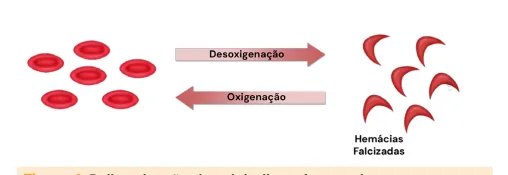

# Anemia Falciforme

<!-- page:1 -->

## Anemia Falciforme (Pediatria) — Complicações Agudas

> ⚠️ Trecho reconstruído a partir de OCR (texto de duas colunas intercalado) — confira contra a fonte original.

- **Síndrome torácica aguda (STA)**: alteração pulmonar + nova imagem pulmonar. Tratamento: O2 + cefalosporina de 3ª geração + macrolídeo + oseltamivir + transfusão de hemácias.
- **Crise álgica**: tratamento com opioide + analgésico simples + AINE (se proteinúria negativa). Não é obrigatória a transfusão de hemácias; manter normo-hidratado (VO ou EV).
- **Febre**: coletar hemograma, PCR, culturas, RX de tórax. Internação para antibioticoterapia parenteral ou avaliação diária até resultado de culturas, com ceftriaxona diária (se paciente em bom estado e exames normais).
- **Sequestro esplênico**: aumento agudo do baço + hipovolemia + queda abrupta de Hb + aumento de reticulócitos. Conduta: suporte transfusional e esplenectomia ambulatorial. Diagnóstico diferencial: crise aplásica (diminuição do reticulócito).
- **AVC**: conduta com transfusão/exsanguineotransfusão de hemácias. Rastreio de risco: US doppler transcraniano. Profilaxia: transfusão/exsanguineotransfusão (alvo HbS < 30%).
- **Priapismo**: ereção sustentada. Se < 3 horas: hidratação, analgésicos/compressas, instilação de alfa-adrenérgicos intracavernosos em casos raros. Se > 4 horas: URGENTE = hidratação e analgesia parenteral; aspiração e irrigação de seios cavernosos.

## Introdução

### Epidemiologia

- É uma das doenças hereditárias mais comuns no mundo.
- Incidência no Brasil: 1 a cada 650 RN triados na Bahia; 1 a cada 1.300 no Rio de Janeiro; 1 a cada 13.500 em Santa Catarina; estimativa de 30.000 indivíduos em todo o país.

### Conceitos

- **Herança autossômica** com traço codominante. Quando em homozigose, o paciente apresenta apenas HbS.
- Caracterizada por uma **mutação do gene HBB**, que codifica a cadeia β da hemoglobina: troca da base nitrogenada timina por adenina, com alteração do aminoácido (ácido glutâmico trocado por valina).

### Complicações Crônicas (visão geral)

- Prejuízo no crescimento e desenvolvimento;
- Cardíacas (consequência da anemia);
- Hipertensão pulmonar (consequência da disfunção cardíaca e vasculopatia pulmonar);
- Renal (proteinúria);
- Ocular (retinopatia).

**Risco infeccioso**

- Profilaxia com penicilina de 3 meses a 5 anos de idade;
- Vacinas especiais: Pneumo 13 e 23, Influenza anual.

**Hidroxiureia**

- Indicações (**Atualização 2025**):
  - Doença falciforme dos tipos HbSS, HbSβ0, HbSβ+ grave e HbSD Punjab, a partir de 9 meses;
  - Doença falciforme dos tipos HbSC, HbSD ou HbSβ-talassemia, a partir de 2 anos.

**Transfusão crônica**

- Profilaxia primária ou secundária de AVC;
- Indicação: casos com lesões de órgão-alvo sem melhora ou tolerância à hidroxiureia.

**Transplante de medula óssea**: única terapia curativa atualmente.

### Fisiopatologia

- **Polimerização das cadeias β mutadas** em condições de desoxigenação, formando as hemácias falcizadas;
- Evolução com processo inflamatório sistêmico;
- Alteração da conformação do eritrócito bloqueia o fluxo sanguíneo e gera **hemólise intravascular**: ativação da célula endotelial pela hemácia falcizada, pela hemoglobina livre e pelos radicais livres → redução de NO, vasoconstrição, ativação plaquetária e vaso-oclusão pulmonar;
- O processo culmina em remodelamento vascular.

Figura 1: Polimerização das globulinas, formando hemácias falcizadas.

---

<!-- page:2 -->

## Diagnóstico

> ⚠️ Trecho reconstruído a partir de OCR (texto de duas colunas intercalado) — confira contra a fonte original.

4 momentos para o diagnóstico:

- **Pré-natal**: aconselhamento genético;
- **Fetal**: amniocentese para avaliar alteração genética;
- **Neonatal**: triagem neonatal;
- **Crianças**: eletroforese de hemoglobina.

**Genótipos**

- **Anemia falciforme**: homozigose (o paciente apresenta apenas HbS);
- **Traço falciforme**: heterozigose (HbA e HbS);
- **Doença SC**: hemoglobina C (HbC e HbS);
- **Doença S-talassemia**: o paciente pode ser Sβ+ ou Sβ0, a depender da quantidade de produção de cadeias β.

## Complicações Agudas

### Crise Álgica

- Principal causa de internação no paciente com anemia falciforme;
- Regiões mais acometidas: extremidades, tórax e lombar;
- Avaliar desencadeantes de crise álgica: infecção; desidratação; hipoxemia; frio; estresse.

**Manejo**

- Opioide + associação com analgésico simples;
- Anti-inflamatório (se função renal/proteinúria permitir);
- Evitar transfusão de hemácias pelo risco de hiper-hemólise;
- Hidratação: manter normo-hidratado. Via oral é preferência; se hidratação venosa, deixar com volume basal.

### Infecções

- Principal causa de mortalidade no paciente com anemia falciforme;
- Asplenia funcional no 1º ano de vida: maior risco para infecção por bactérias encapsuladas. Principal bactéria: pneumococo.

**Prevenção**

- Vacinação: Pneumo 13 e reforço com Pneumo 23 (entre 2 e 5 anos) + Influenza anual;
- Profilaxia com penicilina/amoxicilina: até 5 anos ou por 2 anos após esplenectomia.

**Manejo**

- Anemia falciforme e febre no pronto-socorro: exame físico; hemograma completo; PCR; culturas; radiografia de tórax; líquor se suspeita de meningite;
- Tratamento: internação para antibioticoterapia endovenosa. Se criança em bom estado geral e exames normais: avaliação diária em hospital até resultado final de culturas, com dose diária de ceftriaxona IM.

### Síndrome Torácica Aguda

**Definição**

- Febre +
- Dor torácica +
- Presença de novo infiltrado pulmonar ao exame de imagem +
- Sinais e sintomas de comprometimento pulmonar: taquipneia; tosse; dispneia.

**Etiologia**

- Infecção;
- Embolia gordurosa;
- Infarto pulmonar;
- Embolia pulmonar.

**Tratamento**

- Oxigenioterapia + fisioterapia respiratória;
- Antimicrobianos: cefalosporina de 3ª geração + macrolídeo; oseltamivir para cobertura de Influenza se síndrome gripal associada;
- Analgesia (se dor);
- Broncodilatador, mesmo na ausência de sibilos;
- Se hipoxemia mantida: Hb < 8 g/dL → transfusão sanguínea; Hb > 8 g/dL → exsanguineotransfusão.

## Crise Aplásica

- **Definição**: queda de Hb em relação ao basal do paciente associada à diminuição de reticulócitos;
- Normalmente associada a quadro viral, principalmente Parvovírus B19;
- Remissão espontânea na maioria dos casos;
- Se instabilidade: suporte transfusional.

## Sequestro Esplênico

- **Definição**: aumento agudo do baço + sintomas de hipovolemia + queda abrupta dos níveis de Hb (pode cair também leucócitos e plaquetas) + aumento de reticulócitos;
- Sintomas: palidez sem icterícia e aumento doloroso do baço.

**Manejo**

- Agudo: suporte transfusional, em pequenas alíquotas e com cautela. Cuidado com expansão: risco de sobrecarga volêmica e hemodiluição;
- Crônico: esplenectomia (risco de recorrência é de até 50%).

## Acidente Vascular Cerebral

- Sintomas neurológicos em paciente com doença falciforme: fazer TC de crânio;

---

<!-- page:3 -->

> ⚠️ Trecho reconstruído a partir de OCR (texto de duas colunas intercalado) — confira contra a fonte original.

- Se confirmado o AVC, iniciar o tratamento com: medidas de estabilização; transfusão de hemácias ou exsanguineotransfusão, com o objetivo de manter HbS < 30%.

**Prevenção**

- Screening de risco com USG doppler transcraniano anual (entre 2 e 16 anos de idade);
- Profilaxia primária (doppler transcraniano com velocidade > 200 cm/s) e/ou secundária (se história de AVC): transfusão de hemácias ou exsanguineotransfusão crônica; manter HbS < 30%.

## Priapismo

- **Definição**: ereção sustentada não desejada, não resultante de desejo sexual e não aliviada pela atividade sexual. Dor surge após 4 horas.
- **Etiologia**: isquêmico ou de baixo fluxo.
- Resolver o quadro em até 12 horas:
  - Se < 3 horas: hidratação, analgésicos/compressas, instilação de agonistas alfa-adrenérgicos intracavernosos em casos raros;
  - Se > 4 horas: **URGENTE** = hidratação e analgesia parenteral; aspiração e irrigação de seios cavernosos;
  - Casos refratários: cirurgia, exsanguineotransfusão até HbS < 30%.

## Complicações Crônicas

### Crescimento e Desenvolvimento

- Atraso de crescimento na infância, com recuperação da altura até o final da adolescência;
- Baixo peso (alta taxa metabólica pela anemia e compensação cardíaca);
- Atraso do desenvolvimento puberal;
- Atraso do desenvolvimento neuropsicomotor e comprometimento escolar.

### Cardíacas e Hipertensão Pulmonar (HP)

- Consequência da anemia crônica e do débito cardíaco aumentado;
- Cardiomegalia, hipertrofia de VE;
- HP por disfunção cardíaca ou por vasculopatia pulmonar: medida indireta de HP por velocidade do fluxo de regurgitação da valva tricúspide é marcador de mortalidade em adultos.

### Renais

- Poliúria, noctúria, enurese e desidratação;
- Hematúria (secundária a necrose papilar);
- Proteinúria: microalbuminúria inicia na infância; pode progredir para síndrome nefrótica e falência renal; pode cursar com uremia secundária à síndrome nefrótica (causa desconhecida).

### Oculares

- Retinopatia falciforme não proliferativa (infarto de arteríolas retinianas + hemorragia concomitante);
- Retinopatia falciforme proliferativa (quadro mais grave), que evolui seguindo 5 fases: oclusão de arteríola periférica; anastomose arteriolar-venular; neovascularização; hemorragia vítrea; descolamento retiniano.

**Hifema** é um quadro de urgência do paciente falciforme, e pode evoluir para glaucoma obstrutivo e cegueira.

## Úlceras de Pele

- Não é comum em crianças, mas pode acometer adolescentes;
- Causadas por pressão venosa aumentada em membros inferiores em pacientes com insuficiência venosa;
- HbF aumentada é fator protetor.

## Seguimento Ambulatorial

- Em todas as consultas: exame físico + medir PA e saturação de O2;
- Fenotipagem eritrocitária: 1x antes de qualquer transfusão;
- Eletroforese de hemoglobina: 1x/ano ou em toda pré-transfusão na hipertransfusão;
- Hemograma: a cada visita;
- Quando em uso de hidroxiureia: enzimas hepáticas + função renal + ácido úrico + βHCG a cada 3 meses;
- Proteinúria de 24 horas: 1x/ano para maiores de 10 anos;
- Doppler transcraniano: 1x/ano entre 2 e 16 anos;
- Função pulmonar: 1 teste aos 10 anos ou caso saturação alterada;
- Fundo de olho: 1x/ano para maiores de 10 anos;
- Ecocardiograma: 1x/ano;
- USG de abdome: avaliação de colelitíase 1x/ano;
- Rx de coluna e quadril: 1x/ano;
- Ferritina: 1x/ano ou pré-transfusão na hipertransfusão;
- Densitometria óssea e perfil osteometabólico: 1x/ano.

## Terapias que Alteram o Curso da Doença

- Vacinas;
- Profilaxia com penicilina;
- Hidroxiureia;
- Transfusão de hemácias;
- Transplante de células-tronco hematopoiéticas (único tratamento curativo).

---

<!-- page:4 -->

> ⚠️ Tabela/trecho reconstruído a partir de OCR (texto de duas colunas fortemente intercalado) — confira contra a fonte original.

## Hidroxiureia

- Melhora da morbimortalidade.
- Indicações (**Atualização 2025**):
  - Doença falciforme dos tipos HbSS, HbSβ0, HbSβ+ grave e HbSD Punjab, a partir de 9 meses;
  - Doença falciforme dos tipos HbSC, HbSD ou HbSβ-talassemia, a partir de 2 anos.
- Iniciada quando o risco de morbidade da doença é maior do que a exposição a transfusões seriadas;
- Introduzida como profilaxia primária ou secundária de eventos neurológicos;
- Casos individualizados de complicações graves de órgãos-alvo e intolerância à hidroxiureia podem ser incluídos;
- Complicações: aloimunização; hiperferritinemia (tratada com quelação de ferro).

## Transplante de Medula Óssea

- Portaria do Ministério da Saúde indica o transplante alogênico aparentado de doador familiar HLA idêntico.
- Doença falciforme tipo S homozigoto ou tipo Sβ-talassemia, em uso de hidroxiureia e com pelo menos uma das seguintes condições:
  - Alteração neurológica devido a um AVC, com alteração neurológica que persista por mais de 24 horas ou alteração de exame de imagem;
  - Doença cerebrovascular associada à doença falciforme;
  - Mais de duas crises vaso-oclusivas (inclusive síndrome torácica aguda) graves no último ano;
  - Mais de um episódio de priapismo;
  - Presença de mais de dois anticorpos em pacientes sob hipertransfusão, ou um anticorpo de alta frequência;
  - Osteonecrose em mais de uma articulação.

## Transfusão Crônica

**Indicações**

- Profilaxia primária ou secundária de AVC (ver seção de Acidente Vascular Cerebral);
- Complicações graves de órgãos-alvo, conforme avaliação individualizada.
