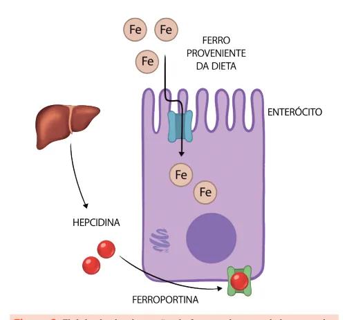
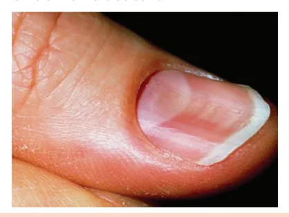
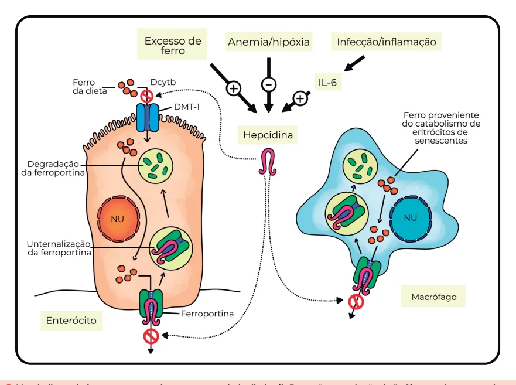
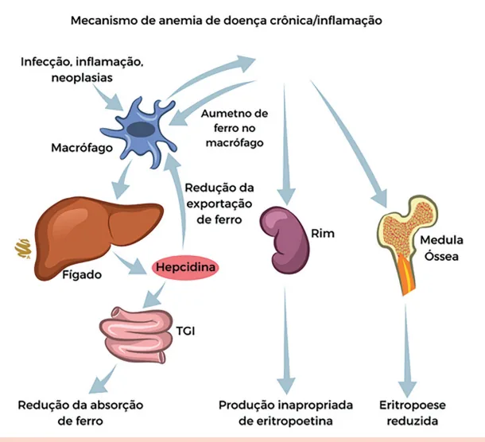

# Anemias Hipoproliferativas I

<!-- page:1 -->

> ⚠️ Este material contém fluxogramas e figuras do PDF original convertidos em texto/listas — as setas e caixas foram reorganizadas na ordem mais provável.

## Anemias hipoproliferativas

- Reticulócitos normais ou reduzidos.
- **Microcítica**: VCM < 80 fL. **Macrocítica**: VCM > 80 fL.

Duas causas principais abordadas neste capítulo: **anemia ferropriva** e **anemia de doença crônica** (ambas cursam com reticulócitos hipoproliferativos).

## Anemia ferropriva

- Geralmente é **microcítica e hipocrômica**.
- Principal causa é sangramento.

**Fluxograma de investigação** (ferro, saturação de transferrina, ferritina e reticulócitos diminuídos; TIBC alto):

- Criança ou gestante?
  - **Sim** → investigação/condutas específicas.
  - **Não** → sangramento visível?
    - **Sim** → medidas específicas para conter a hemorragia.
    - **Não** → pesquisa de sangue oculto nas fezes + EDA + colonoscopia ± enteroscopia com cápsula endoscópica.

- **Tratamento**: controle do sangramento + reposição de ferro (oral, preferencialmente).

## Definição (anemia)

- **Gestantes**: Hb < 11 g/dL.
- **Mulheres**: Hb < 12 g/dL.
- **Homens**: Hb < 13 g/dL.

## Classificação

- Diferencia-se através dos reticulócitos (hiper e hipoproliferativa) e do volume corpuscular médio (VCM: micro, normo e macrocíticas).

## Reticulócitos

- Neste capítulo abordaremos as anemias com reticulócitos normais ou diminuídos.
- Verificar Figura 1 na próxima página.

## Anemia de doença crônica

- Geralmente é **normocítica e normocrômica**.

**Fisiopatologia**: inflamação → elevação da hepcidina → bloqueio da ferroportina → TIBC baixo, saturação de transferrina normal/baixa, ferritina alta → anemia hipoproliferativa normocítica.

- **Tratamento**: tratar a causa de base; se DRC, avaliar indicação de EPO.

## Correção dos reticulócitos

- Corrigir quando há anemia e o valor foi dado em valor relativo (%).
- Há duas formas de fazer a correção:
  - Índice Reticulocitário Corrigido (IRC) = % reticulócitos × Ht/40.
  - Índice Reticulocitário Corrigido (IRC) = % reticulócitos × Hb/15.
- Quando o valor é dado em número absoluto, não é necessária correção.
- Verificar Figura 2 na próxima página.

---

<!-- page:2 -->

*Figura 1: Reticulócitos e investigação de anemia — reticulócitos aumentados (> 2% ou > 100 mil): hiperproliferativa (anemias hemolíticas, sangramentos agudos). Reticulócitos normais ou reduzidos: hipoproliferativa.*

## Volume corpuscular médio (VCM)

*Figura 2: VCM e investigação de anemia — < 80 fL (microcítica); 80-100 fL (normocítica); > 100 fL (macrocítica).*

- **Macrocítica**: VCM > 100 fL.
- **Microcítica**: VCM < 80 fL; talassemias possuem VCM ainda menor, em geral abaixo de 60 fL.

## Quadro clínico

- Depende da velocidade de instalação.
- Geralmente os casos mais agudos possuem mais sintomas: fadiga/astenia, dispneia, taquicardia e hipotensão postural, palidez e icterícia.

**Classificação por mecanismo e VCM:**

- Sangramentos agudos.
- Carenciais (Fe, B12, ácido fólico).
- Deficiência de EPO.
- Distúrbios medulares: invasão medular, insuficiência medular.

| VCM | Etiologias |
|---|---|
| Microcítica | Ferropriva, talassemia, sideroblástica |
| Normocítica | Doença crônica |
| Macrocítica | Megaloblástica, SMD, anemia aplástica |

- Principal causa de anemia no mundo, principalmente em países em desenvolvimento (desnutrição, parasitoses), particularmente em crianças, mulheres na menacme e gestantes.

## Metabolismo do ferro

- Fundamental na formação dos glóbulos vermelhos por fazer parte da produção de hemoglobina.
- A média de estoques é de 3 a 4 g; ⅔ desses estão contidos nas hemácias.
- Outros estoques de ferro: macrófagos no baço, medula óssea, fígado.
- Verificar Figura 3 na próxima página.

---

<!-- page:3 -->

*Figura 3: Fisiologia da absorção de ferro pelo enterócito através da ferroportina, que é regulada pelos níveis séricos de hepcidina.*

- **Ferroportina**: transporta o ferro do enterócito para a corrente sanguínea.
- **Ferritina**: no estado basal (fora de estados inflamatórios/síndrome metabólica), reflete de forma adequada os valores de estoque corporal de ferro.
- **Hepcidina**: na hipóxia/anemia, diminui; no excesso de ferro e na inflamação, aumenta. Quando aumentada, bloqueia a ferroportina e inibe a absorção do ferro, que será eliminado inalterado.
- Subdividida basicamente em déficit de ferro absoluto e relativo.

### Tabela 1: Causas de ferropenia absoluta

| Etiologia | Detalhes |
|---|---|
| Perda crônica | Sangramentos (digestivo, hipermenorreia) |
| Aumento da demanda de ferro | Infância e gestação |
| Diminuição da ingesta | Desnutrição, dieta restritiva (vegetariana) |
| Diminuição da absorção | Cirurgia bariátrica, gastrite atrófica, doença celíaca, uso crônico de IBP, doença inflamatória intestinal |

**Cirurgia bariátrica e anemia ferropriva** — ambas as técnicas (bypass e sleeve) causam diminuição na absorção por três mecanismos:

- Diminuição da ingesta de alimentos.
- Diminuição da produção de HCl (o Fe necessita de meio ácido para ser melhor absorvido).
- Diminuição da área de absorção (em especial duodeno).

### Tabela 2: Causas de ferropenia relativa

| Etiologia | Detalhes |
|---|---|
| Sequestro de ferro nos estoques | Aumento da hepcidina (inflamação) |
| Falta de eritropoetina (EPO) | DRC |

**Sinais clínicos clássicos:**

- **Queilite angular**: inflamação no ângulo da boca. *(Figura 4)*
- **Coiloníquia**: unha em formato de colher. *(Figura 5)*
- **Síndrome de Plummer-Vinson**: presença de membranas no esôfago. *(Figura 6: membranas esofágicas)*

## Investigação

- Ferro sérico.
- Ferritina.
- Saturação de transferrina.
- TIBC (Total Iron-Binding Capacity).
- RDW (Red Cell Distribution Width).
- Mielograma é padrão-ouro, porém não há necessidade da realização do mesmo.

---

<!-- page:4 -->

*Figura 7: Exames necessários e sugestivos de anemia ferropriva — o aumento da ingesta de ferro causa aumento da hepcidina e bloqueio da ferroportina.*

- **Ferritina ↓** — estoque de ferro.
- **Fe sérico ↓** — quantidade disponível.
- **TIBC ↑** — capacidade total de ligação de ferro.
- **Sat. transferrina ↓** — proteína carreadora.
- **RDW ↑** — anisocitose.
- **Hepcidina ↓** — regulação da ferroportina.

## Tratamento

### Condutas gerais

- **Sangramentos**: em adultos é obrigatória a avaliação do trato gastrointestinal (sangue oculto, endoscopia digestiva alta, colonoscopia, cápsula endoscópica).
  - Caso a pesquisa inicial seja negativa, avaliar indicação de cápsula endoscópica.
  - Colonoscopia: quando alterada, metade dos casos são neoplasias (especialmente de cólon).
  - Mulheres com fluxo menstrual muito aumentado — pode ser a etiologia.
- Má absorção.
- Baixa ingesta (prevalente em países de 3º mundo).

### Reposição de ferro

- Feita em duas fases: correção da anemia (1 a 2 meses); reposição dos estoques (2 a 3 meses).
- **Via de administração**: oral é a preferencial na maioria dos casos.
- Dose diária de 60-200 mg de Fe elementar, em tomada única diária.
- Se > 100 mg por dia: dias alternados (validado para mulheres com problemas menstruais). Se tomado em dias alternados, o bloqueio da hepcidina é evitado, pois já terá passado o pico.

### Tabela 3: Anemia de doença crônica x anemia ferropriva

| | Anemia de doença crônica | Anemia ferropriva |
|---|---|---|
| Ferro sérico | Diminuído | Diminuído |
| Sat. transferrina | Diminuído ou normal | Diminuído |
| TIBC | Diminuído ou normal | Aumentado |
| Ferritina | Normal ou aumentada | Diminuída |

### Efeitos colaterais (reposição oral de ferro)

- Trato gastrointestinal, náuseas, constipação.

## Avaliação de resposta

- Melhora dos sintomas.
- Aumento de 2 g/dL de Hb após 3-4 semanas de tratamento.
- Aumento de reticulócitos (mais precoce, > 100.000): com cerca de 4 dias já inicia o aumento dos reticulócitos, com pico em 10 dias.

**Resultado não esperado?** Considerar: má adesão (principal causa), dose baixa, tempo curto de tratamento, sangramento persistente, diagnóstico errado.

## Anemia de doença crônica

- Geralmente normocítica e normocrômica.
- Inflamação aumenta IL-6 → aumenta a produção de hepcidina e diminui a ferroportina → bloqueio da ferroportina, levando a deficiência funcional do ferro por bloqueio dos estoques.
- Saturação de transferrina e Fe sérico baixos.
- Ativação do sistema retículo-endotelial → diminuição da sobrevida das hemácias.
- Verificar Figura 8 na próxima página.

### Anemia da doença renal crônica

- É um subtipo de anemia de doença crônica.
- Baixa produção de eritropoetina (EPO): a medula óssea não é estimulada a produzir. Paciente com DRC apresenta cinética do ferro normal.

---

<!-- page:5 -->

*Figura 8: Metabolismo do ferro, com destaque para o lado direito (inflamação e produção de IL-6), gerando a cascata da anemia da doença crônica.*

*Figura 9: Fisiopatologia da anemia da doença crônica, com destaque para o componente renal.*

- A anamnese, a ferritina e o TIBC são as principais pistas para diferenciação com a anemia ferropriva.

## Referências

Figura 4: Queilite angular. Disponível em: https://dermatologiaesaude.com.br/perleche-queiliteangular-comissurite/. Acesso em: 12 jun. 2025.

Figura 5: Coiloníquia. Disponível em: https://www.msdmanuals.com/pt-br/profissional/multimedia/image/coilon%C3%ADquia. Acesso em: 12 jun. 2025.

Figura 6: Membranas esofágicas (Síndrome de Plummer-Vinson). Disponível em: https://www.gastrointestinalatlas.com/english/Plummer_Vinson_Syndrome.html. Acesso em: 12 jun. 2025.

