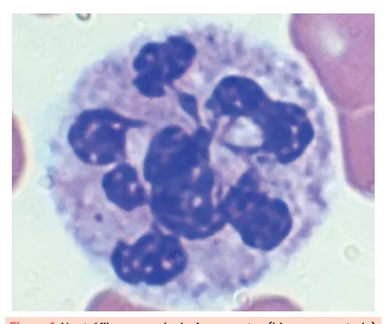
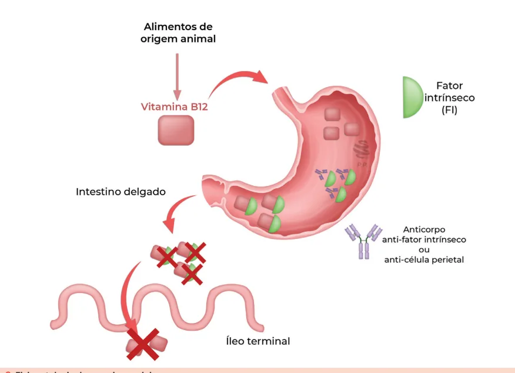
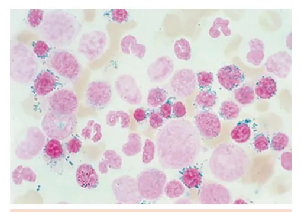

# Anemias Hipoproliferativas II

<!-- page:1 -->

Anemia Aplástica (CM) Anemia Megalobástica (CM) Anemia Sidero

## ANEMIA MEGALOBLÁSTICA

- Anemia macrocítica. Deficiência de vitamina B12 ou fola

- Principal causa é a anemia perniciosa hipersegmentados

Pancitopenia Reticulocitopenia (Hipoproliferativa) Neutrófilos Macroovalócitos Eritropoese ineficaz Sintomas neurológicos Homocisteína e AMM aumentados

## ANEMIA SIDEROBLÁSTICA

## ANEMIA APLÁSTICA

Falência M Tratamento Imunossupressão e/ou TMO Diagnóstico através de BMO Anemia Ap Ausência de esplenomegalia oblástica (CM)

ato (B9) Aumento de DHL Aumento de BI Redução de reticulócitos Anemia Microcítica Hereditária ligada ao X Adquirida principalmente medicações Não há protoporfirina, não forma o grupo heme e sobra ferro (sideroblastos em anel)

Medular Autoimune Pancitopenia em plástica pacientes jovens Anemia Macrocítica

---

<!-- page:2 -->

Vitamina B12

- Fonte: origem animal;

## MACROCITOSE (VCM > 100 FL)

- Absorção no íleo terminal;

- Geralmente explicada por uma eritropoese ineficaz, podendo ter diversos mecanismos e etiologias.

Alterações relacionadas ao metabolismo do DNA

- Deficiência de vitamina B12: Dica importante associada:

neutrófilos hipersegmentados.

- Deficiência de ácido fólico;

- Medicamentos: Metotrexato (MTX); Azatioprina (AZA); Hidroxiuréia; TARV (AZT).

Produção aumentada de células imaturas

- Reticulocitose: O reticulócito é maior que a hemácia (lembre-se da figura acima da série eritroide).

- Anemia hemolítica.

Doenças primárias da medula óssea

- Síndrome mielodisplásica (SMD);

- Anemia aplástica.

Outras causas

- Doença hepática;

- Hipotireoidismo;

- Alcoolismo (causa comum de macrocitose).

## DEFICIÊNCIA DE B12 OU B9

- B12 (Cianocobalamina) OU B9 (Folato): Ácido metilmalônico: aumentado apenas na deficiência de B12; Homocisteína: elevado em ambas.

- Hematoscopia: Neutrófilos hipersegmentados; Ovalócitos.

Figura 1: Neutrófilo com mais de 4 segmentos (hipersegmentado). Etiologias

- Disabsorção;

- Nutricional: veganismo;

- Medicamentosa.

- Estoque dura ~5 anos;

- Homocisteína e ácido metilmalônico elevados;

- Quadro clínico: Sintomas neurológicos (degeneração combinada subaguda (DCS) da medula); Queilite e atrofia de papilas (glossite atrófica).

Tabela 1: Causas de deficiência de vitamina B12. Gastrointestinal Medicamentos Baixa ingesta (vegetarianos Metformina estritos)

Gastrite atrófica (autoimune - anemia Zidovudina (AZT) perniciosa) (secundária H. pylori) Cirurgias gástricas prévias Disabsorção (doença de Metotrexato (MTX)

Crohn) Ressecção de íleo distal Supercrescimento Colestiramina bacteriano Diiphylobotrium latum Inibidor de bomba de (Tênia do peixe) prótons (IBP)

Ácido Fólico (B9)

- Fonte: Vegetais, carne, frutas;

- Estoque dura ~4 meses → repor em casos de hemólise crônica;

- Homocisteína elevada;

- Quadro clínico: Ausência de sintomas neurológicos; Queilite e atrofia de papilas.

Tabela 2: Causas de deficiência de ácido fólico. Ingesta inadequada Demanda excessiva Alcoólatras Gestação Crianças Anemias hemolíticas Anorexia Dermatites esfoliativas Leite de cabra Hemodiálise Má absorção Prejuízo no metabolismo Síndrome do Metotrexato intestino curto Anticonvulsivantes Sulfametoxazol- (fenitoína) trimetoprim Sulfassalazina Álcool

- Verificar Figura 2 na próxima página.

Anemia Perniciosa

- Mecanismo: Anticorpo anti-célula parietal (84%) ou anti-fator intrínseco (56%): Inibe a absorção de vitamina B12. Principal causa de deficiência de vitamina B12.

---

<!-- page:3 -->

Metionina sintase CH 2 | Deficiência de vitamina B12 SH ↑ Homocisteína ↑ Ácido metilmalônico Deficiência de Ácido fólico ↑ Homocisteína Ácid CH - C O — C Figura 2: Participação da vitamina B9 e B12 na síntese de metionina e s Figura 3: Fisiopatologia da anemia perniciosa.

- Epidemiologia: Feminino > masculino; 45-65 anos; Associação com outras doenças autoimunes

(especialmente tireoidite de Hashimoto).

- Diagnóstico: Biópsia gástrica (gastrite atrófica) + Gastrina sérica elevada: Aumenta o risco de CA gástrico (2x).

Homocisteína Metionina CH - CH — COOH Folato CH - CH - CH — COOH 2 2 2 NH S NH 2 Metilcobalamina | 2 CH Vitamina B12 (Cobalamina)

Adenosilcobalamina do metilmalônico Succinil-CoA C - COOH Metil malonil-CoA redutase CH - CH2 - COOH | 2 | C - SCoA O — C - SCoA succinil-CoA e seus achados laboratoriais relacionados.

- Tratamento: Reposição de B12 intramuscular: Não vai ser absorvida no íleo terminal por via oral.

---

<!-- page:4 -->

## ANEMIA SIDEROBLÁSTICA TRATAMENTO

- Correção de causas reversíveis;

- Anemia microcítica (VCM < 80 fL);

- Piridoxina:

- Falha na incorporação do ferro a protoporfirina;

Hemoglobina Heme Globina Ferro Protoporfirina Anemia Sideroblástica Figura 4: Fisiopatologia da anemia sideroblástica.

- Acúmulo de ferro nas mitocôndrias (perinucleares!) →

Sideroblastos em anel;

- Eritropoiese ineficaz: estimula maior absorção de ferro;

Figura 5: Mielograma demonstrando a presença de eritroblastos com sideroblastos em anel.

## ETIOLOGIAS

- Herdada → Ligada ao X;

- Adquiridas: Síndrome mielodisplásica (SMD); Medicações: Isoniazida; Rifampicina; Linezolida. Álcool; Deficiência de Cobre; Toxicidade por Zinco. Não se entende o mecanismo; 40 a 60% dos casos hereditários respondem.

- Suporte transfusional;

- Quelante de ferro.

- Falência medular de etiologia autoimune;

- Cursa com anemia macrocítica;

- Ausência de esplenomegalia;

- Pancitopenia em jovens;

- Diagnóstico: biópsia de medula óssea.

## CLASSIFICAÇÃO

Grave

- Reticulócitos < 60.000 ou

- Neutrófilos < 500 cél/mm3 ou

- Plaquetas < 20.000.

Muito grave

- Neutrófilos < 200 cél/mm3.

## TRATAMENTO

Anemia Aplástica Grave / Muito Grave <40 anos ≥ 40 anos Doador aparentado HLA Terapia imunossupressora

- compatível imunossupressora medula óssea

Não Sim Terapia Transplante de Figura 6: Tratamento de anemia aplástica.

## REFERÊNCIAS

Figura 1: Neutrófilo com mais de 4 segmentos (hipersegmentado). SÁ, Lílian Silva Mateó de. A anemia megaloblástica e seus efeitos fisiopatológicos. Revista Eletrônica Atualiza Saúde, Salvador, v. 5, n. 5, p. 55–61, jan./jun. 2017. Disponível em: https://atualizarevista.com.br/ wp-content/uploads/2022/05/a-anemia-megaloblastica-e-seus-efeitosfisiopatologicos-v-5-n-5-1.pdf. Acesso em: 13 jun. 2025.

Figura 5: Mielograma demonstrando a presença de eritroblastos com sideroblastos em anel. TEFFERI, A.; LI, C. Atlas of Clinical Hematology. Philadelphia: Current Medicine, 2004. il.

