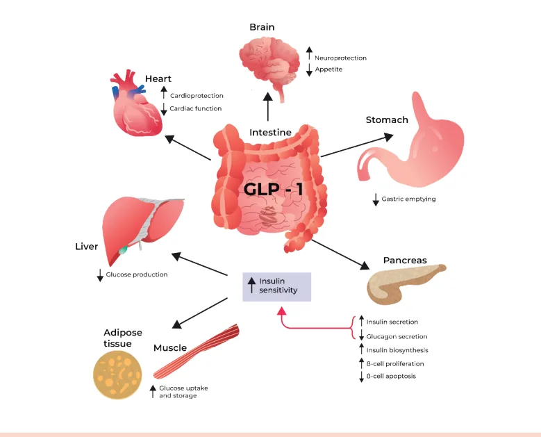
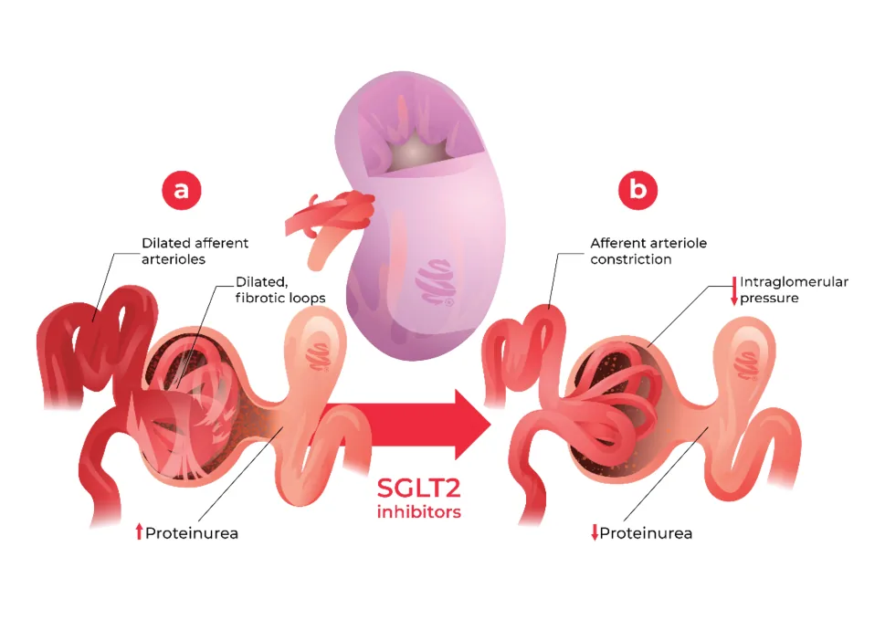
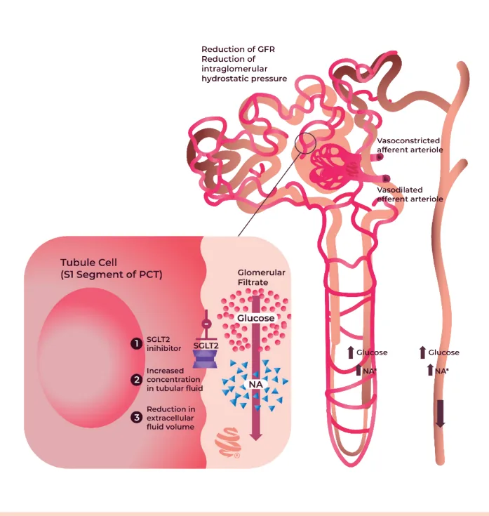

# Antidiabéticos Orais e Subcutâneos - Parte 2

<!-- page:1 -->

## Análogos de GLP-1

- Aumento da secreção de insulina dependente de glicose
- Retardo do esvaziamento gástrico e redução do apetite → saciedade por mais tempo → perda de peso
- Rara hipoglicemia
- Redução de mortalidade e eventos cardiovasculares (MACE)

### Estudos com Análogos de GLP-1

> ⚠️ Tabela reconstruída a partir de OCR — confira contra a fonte original.

| Estudo | LEADER, 2016 | SUSTAIN, 2016 |
|---|---|---|
| **População** | DM2 e alto risco CV | DM2 e alto risco CV |
| **Tipo** | Segurança CV | Segurança CV |
| **Droga** | Liraglutida SC 1,8 mg/dia | Semaglutida 0,5 ou 1 mg/semana |
| **Desfecho primário** | Redução de MACE, AVC não fatal e desfecho renal | Redução de MACE, mortalidade geral e desfecho renal |

## Coagonistas GIP e GLP-1

- **Tirzepatida** (Mounjaro) → subcutâneo 1x/semana
- Aprovada para tratamento de DM2 e obesidade
- Redução acentuada do peso; redução da PA; redução dos triglicerídeos
- Efeitos colaterais incluem sintomas gastrointestinais, fadiga, hipersensibilidade e reações no local da aplicação, aumento da FC

### Estudo SURPASS-1

> ⚠️ Tabela reconstruída a partir de OCR — confira contra a fonte original.

| | |
|---|---|
| **População** | DM2 + obesidade |
| **Tipo** | Eficácia |
| **Droga** | Tirzepatida 5, 10 e 15 mg |
| **Desfecho primário** | Redução de HbA1c: −1,87% (5 mg), −1,89% (10 mg), −2,07% (15 mg) |
| **Perda de peso** | −7,0 kg (5 mg), −7,8 kg (10 mg), −9,5 kg (15 mg) |

- Populações estudadas: pacientes com DCV; diabéticos e obesos com ou sem diabetes
- Redução de albuminúria
- Efeitos adversos incluem efeitos gastrointestinais, aumento da FC e pancreatite aguda (questionado)
- Injetáveis, exceto: semaglutida oral

### Outros Estudos com Análogos de GLP-1

> ⚠️ Tabela reconstruída a partir de OCR — confira contra a fonte original.

| Estudo | PIONEER-6, 2019 | SELECT, 2023 | ESSENCE, 2025 |
|---|---|---|---|
| **População** | DM2 e alto risco CV | Sem DM, IMC > 27 e com DCV | Esteatohepatite/fibrose por DHEM. Obesos e maioria DM2 |
| **Tipo** | Segurança CV | Segurança CV | Desfecho hepático |
| **Droga** | Semaglutida oral 14 mg/dia | Semaglutida 2,4 mg/semana | Semaglutida 2,4 mg/semana |
| **Desfecho** | Não-inferioridade, seguro em relação a placebo à mortalidade CV | Redução de IAM e AVC não fatal e mortalidade CV | Resolução de esteatohepatite e redução de fibrose |

- Estudos de análogos de GLP-1 mostram maior risco de hipoglicemia se associados a sulfonilureias ou insulina

**Contraindicações:**
- Hipersensibilidade
- História pessoal ou familiar de neoplasia endócrina múltipla tipo 2 ou carcinoma medular de tireoide (CMT)
- Uso concomitante de análogo de GLP-1 ou inibidor de DPP-4

### Estudos com Tirzepatida

> ⚠️ Tabela reconstruída a partir de OCR — confira contra a fonte original.

| Estudo | SURMOUNT-1 | SURMOUNT-2 |
|---|---|---|
| **População** | IMC ≥ 27 kg/m² sem DM2 | IMC ≥ 27 kg/m² com DM2 |
| **Tipo** | Eficácia | Eficácia |
| **Droga** | Tirzepatida 5, 10 e 15 mg | Tirzepatida 10 e 15 mg |
| **Perda de peso** | 16% (5 mg), 20% (10 mg), 22,5% (15 mg) | 12,8% (10 mg), 14,7% (15 mg) |

---

<!-- page:2 -->

## Inibidores do SGLT-2

- **Glifozinas:** empagliflozina, dapagliflozina e canagliflozina
- Redução de eventos e mortalidade cardiovascular em pessoas com DM e DCV
- Redução de desfechos renais
- Redução de internação por IC
- Rara hipoglicemia
- Pode aumentar a incidência de infecção do trato geniturinário
- Cuidado com a cetoacidose diabética euglicêmica (CAD)

## Análogos do GLP-1

- Representantes: exenatida, lixisenatida, liraglutida, dulaglutida, semaglutida
- Injetáveis, exceção semaglutida oral

Figura 1: Mecanismo de ação dos análogos do GLP-1.

### Mecanismo de Ação

- Aumento da secreção de insulina dependente de glicose (ver Figura 1)
- Retardo do esvaziamento gástrico; saciedade

## Tratamento Farmacológico do Paciente com DM2

> ⚠️ Fluxograma reconstruído a partir de OCR — confira contra a fonte original.

**Risco CV baixo/intermediário, ou obesidade/sobrepeso:**
- HbA1c < 7,5% → metformina (MTF)
- HbA1c ≥ 7,5% → MTF + iSGLT-2

**Risco CV alto/muito alto, ou obesidade/sobrepeso:**
- HbA1c < 7,5% → aGLP-1 ou tirzepatida (TZP)
- HbA1c ≥ 7,5% → MTF ou iSGLT-2 + aGLP-1 ou TZP

**Outra estratificação (ver fluxograma completo na fonte):**
- HbA1c < 7,5% → iSGLT-2
- HbA1c ≥ 7,5% → iSGLT-2 + MTF
- HbA1c < 7,5% → aGLP-1
- HbA1c ≥ 7,5% → aGLP-1 + iSGLT-2

---

<!-- page:3 -->

## Estudo com Análogos do GLP-1

> ⚠️ Tabela reconstruída a partir de OCR — confira contra a fonte original. Ver tabela consolidada na página 1.

| Estudo | LEADER, 2016 | SUSTAIN, 2016 |
|---|---|---|
| **População** | DM2 e alto risco CV | DM2 e alto risco CV |
| **Tipo** | Segurança CV | Segurança CV |
| **Droga** | Liraglutida SC 1,8 mg/dia | Semaglutida 0,5 ou 1 mg/semana |
| **Desfecho primário** | Redução de MACE, AVC não fatal e desfecho renal | Redução de MACE, mortalidade geral e desfecho renal |

## Efeitos

- Redução da glicemia em jejum: 30 mg/dL
- Redução da HbA1c: 0,8 – 1,5%
- Redução do peso e da PAS
- Redução da glicemia pós-prandial
- Redução de eventos cardiovasculares e mortalidade em pacientes com DCV e em não diabéticos com obesidade/sobrepeso
- Redução da albuminúria → benefício renal
- Rara hipoglicemia

## Efeitos Colaterais

- Efeitos gastrintestinais como náuseas, vômitos e diarreia
- Aumento da FC
- Pancreatite aguda (?)

## Contraindicações

- Hipersensibilidade
- CMT (carcinoma medular de tireoide)
- Pancreatite (raro e questionado)
- Uso de inibidores da DPP-4 (mesma via fisiopatológica)
- TFG < 15 mL/min/1,73 m²

### Estudos Adicionais

> ⚠️ Tabela reconstruída a partir de OCR — confira contra a fonte original.

| Estudo | PIONEER-6, 2019 | SELECT, 2023 | ESSENCE, 2025 |
|---|---|---|---|
| **População** | DM2 e alto risco CV | Sem DM, IMC > 27 e com DCV | Esteatohepatite/fibrose por DHEM. Obesos e maioria DM2 |
| **Tipo** | Segurança CV | Segurança CV | Desfecho hepático |
| **Droga** | Semaglutida oral 14 mg/dia | Semaglutida 2,4 mg/semana | Semaglutida 2,4 mg/semana |
| **Desfecho** | Não-inferioridade, seguro em relação a placebo à mortalidade CV | Redução de IAM e AVC não fatal | Resolução de esteatohepatite e redução de fibrose |

## Inibidores do SGLT-2

- **Representantes (glifozinas):** dapagliflozina, canagliflozina e empagliflozina
- O SGLT2 é um receptor presente no túbulo contorcido proximal do glomérulo, responsável pela reabsorção de glicose e sódio a nível renal
- O inibidor do SGLT2 aumenta a excreção renal de água e sódio; perde-se também calorias pela urina → perda de peso discreta
- Verificar Figura 2 na próxima página
- Perda de água, sódio e glicose pela urina → percepção renal de que há muito volume chegando (Figura 3): vasoconstrição da arteríola aferente, levando inicialmente à redução da TFG
- Reduz pressão intraglomerular → reduz proteinúria
- Reduz atividade do sistema renina-angiotensina-aldosterona, melhorando o remodelamento cardíaco
- Verificar Figura 3 na próxima página

---

<!-- page:4 -->

Figura 2: Mecanismo de ação dos inibidores do SGLT-2. Figura 3: Ações a nível renal dos inibidores do SGLT-2.

---

<!-- page:5 -->

## Efeitos (Inibidores do SGLT-2)

- Redução da glicemia em jejum: 30 mg/dL
- Redução da HbA1c: 0,5 – 1,0%
- Redução de eventos e mortalidade cardiovascular em pessoas com DM e DCV
- Redução de internação por IC
- Redução de desfechos renais, mesmo em não diabéticos
- Rara hipoglicemia
- Redução discreta de peso
- Redução discreta da PA
- Infecção do trato geniturinário, pelo efeito glicosúrico

## CAD Euglicêmica (rara)

- **Mecanismo:** comprometimento da gliconeogênese renal (já que está excretando muita glicose → percepção de que há muita glicose); reduz a eliminação de H+ pelo rim → acidose; reduz glicemia → reduz insulinemia → aumenta formação de glucagon → formação de cetoácidos; principalmente no contexto de desidratação
- **Diagnóstico:** glicemia < 200; pH < 7,3; ânion GAP 10-12; HCO3 < 18
- Cetonemia > 1,6 (se disponível), preferível à cetonúria — o aumento da reabsorção tubular de acetoacetato pode levar a um valor de cetonúria falsamente normal

**Tratamento:**
- Suspender iSGLT2
- Tratamento da CAD: hidratação; correção de K; glicose + insulina endovenosas

## Tratamento Farmacológico do Diabetes Tipo 2

> ⚠️ Fluxograma reconstruído a partir de OCR — confira contra a fonte original.

**Risco CV baixo/intermediário, ou obesidade/sobrepeso:**
- HbA1c < 7,5% → metformina (MTF)
- HbA1c ≥ 7,5% → MTF + iSGLT-2

**Risco CV alto/muito alto, ou obesidade/sobrepeso:**
- HbA1c < 7,5% → aGLP-1 ou tirzepatida (TZP)
- HbA1c ≥ 7,5% → MTF ou iSGLT-2 + aGLP-1 ou TZP

## Estudos com Inibidores do SGLT-2

- **Redução de MACE (eventos CV maiores):** empagliflozina (EMPA-REG), canagliflozina (CANVAS)
- **Impacto na IC de FE reduzida:** dapagliflozina (DAPA-HF), empagliflozina (EMPEROR)
- **Impacto na IC de FE preservada:** dapagliflozina (DELIVER), empagliflozina (EMPEROR-PRESERVED)
- **Impacto na DRC:** dapagliflozina (DAPA-CKD), empagliflozina (EMPA-KIDNEY), canagliflozina (CREDENCE)

**Limites de TFG para uso:**
- Dapagliflozina: TFG < 25 mL/min/1,73 m²
- Empagliflozina: TFG < 30 mL/min/1,73 m²
- Canagliflozina: TFG < 45 mL/min/1,73 m²
- Aumento do risco de amputações
