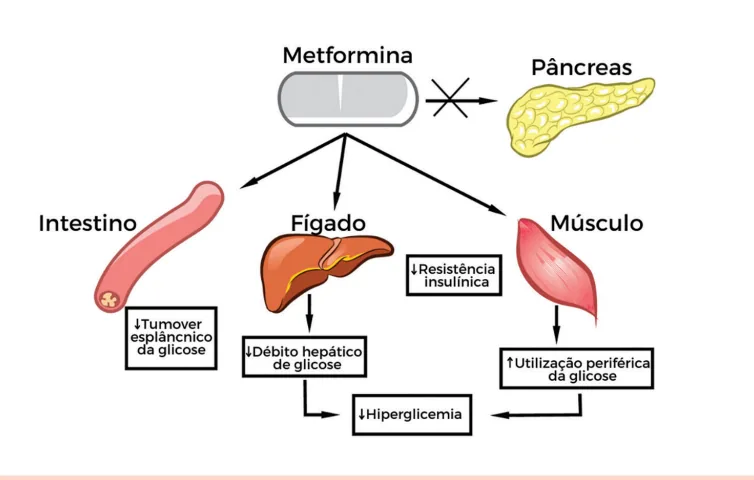
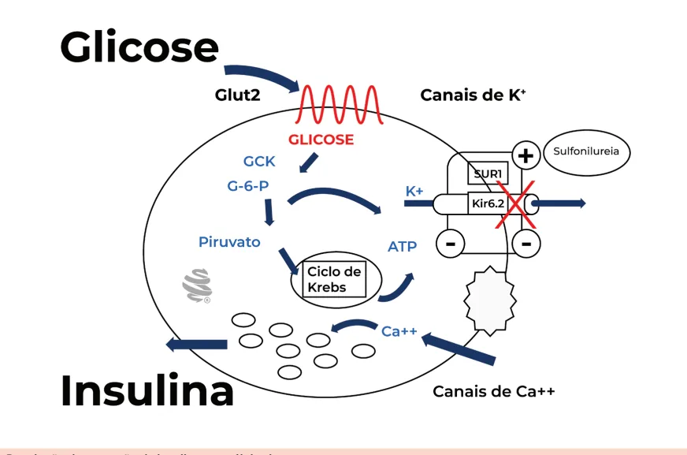

# Antidiabéticos Orais e Subcutâneos - Parte

<!-- page:1 -->

## ANTIDIABÉTICOS ORAIS E

## SUBCUTÂNEOS - PARTE 1

Antidiabéticos (CM) Diabetes (CM) METFORMINA Inibidores da DPP-4

- Droga inicial de escolha no tratamento do DM2

- Aumento de secreção de insulina dependente reduz a gliconeogênese. | Seguros quando a hipoglicemia e bem tolerada; Alta potência; | Neutro peso; Reduz eventos CV; | Uso em qualquer fase da DRC (ajuste de dose, Segurança hipoglicemia. exceto linagliptina).

→ melhora sensibilidade periférica à insulina e de glicose

- Também indicada no pré-DM e na SOP.

- Efeito adverso: pancreatite?

- Contraindicado TFG < 30 e ajuste de dose < 45

- Exemplos: sitagliptina, saxagliptina, alogliptina,

(dose máxima 1g/dia). linagliptina, evogliptina, vildagliptina. Acarbose Análogos de GLP-1

- Efeito local

- Aumento da secreção de insulina dependente Ação na glicemia pós-prandial. de glicose

- Também pode ser usada no pré-DM. | Retardo do esvaziamento gástrico e redução

- Efeitos adversos: flatulência e meteorismo. do apetite;

Pioglitazona | Perda de peso;

- Potente efeito sensibilizador da insulina. | Rara hipoglicemia. Benefício de redução de

- Redução de mortalidade e eventos CV em inflamação e transaminases pacientes com DCV.

- Também pode ser usada no pré-DM, com benefício

- Redução de albuminúria.

importante na doença hepática gordurosa

- Efeitos adversos: efeitos gastrointestinais, aumento não-alcoólica. da FC, pancreatite aguda?

- Efeitos adversos: retenção hídrica, fraturas e

- Injetáveis, exceto semaglutida (oral).

ganho ponderal.

- Contraindicado na IC estágios III e IV.

Sulfonilureias

- Liberação de insulina independente de glicose Alta potência e disponibilidade no SUS; Redução de complicações microvasculares do DM.

- Efeitos adversos: hipoglicemias (devido ao mecanismo de ação) e ganho de peso

- Suspender quando introduzir insulina → uso concomitante aumenta o risco de hipoglicemia.

- Exemplos: glimepirida, gliclazida e glibenclamida.

## METFORMINA EFEITOS

- Alta potência;

MECANISMO DE AÇÃO | Redução da glicemia de jejum em 60-70 mg/dL, em

- Atua através da inibição da enzima AMPK- dose máxima; Principal ação é a redução da gliconeogênese

quinase; Figura 1 | Redução dos níveis de HbA1c em 1,5-2%;

- Vantagens: ampla experiência com a droga, prevenção Diminuição da resistência periférica à insulina, em cardiovasculares, melhora o perfil lipídico, auxilia na tecido muscular e adiposo; perda ponderal; No intestino, causa redução do turnover

(produção hepática de glicose); do DM tipo 2 em pré-DM, redução dos eventos

- SOP (síndrome dos ovários policísticos):

esplâncnico de glicose; | Auxilia na ovulação;

- Não há efeito direto no pâncreas → baixo risco | Redução do risco de abortamento;

de hipoglicemia. | Melhora dos parâmetros metabólicos;

- Verificar Figura 1 na próxima página

- Pré-diabetes (reduz a progressão).

---

<!-- page:2 -->

Figura 1: Efeito da metformina nos diversos órgãos EFEITOS COLATERAIS E

- Efeitos gastrointestinais são diarreia, pirose e dor abdominal Diminuídos na versão XR, de longa liberação;

- Deficiência da vitamina B12 Comprometimento da absorção no íleo distal.

- Acidose láctica (raro);

## CONTRAINDICAÇÕES

- Gestação: A contraindicação tem sido questionada pelas sociedades. Na prática clínica, o uso está bem estabelecido E em pacientes com uso prévio à gestação; SBD considera opção na inviabilidade do uso da insulina;

- Clearance de Creatinina < 30 mL/min → não usar Clearance de Creatinina entre 30 - 45 mL/min → ajustar dose (dose máxima: 1 g/dia). C

- Insuficiência hepática, cardíaca ou respiratória graves.

## PIOGLITAZONA

- MECANISMO DE AÇÃO S

- Atualmente, é a única representante do grupo das glitazonas;

- Mecanismo é dado pela ativação do receptor PPAR1. Melhora da sinalização insulínica pós-receptor (↑ R γ:

GLUT-1, GLUT-4);

- 2. Inibição da lipólise e redução dos ácidos graxos livres circulantes;

- 3. Redução da produção hepática de glicose;

A. Redução da resistência insulínica.

- Apresenta maior efeito na resistência insulínica em comparação à metformina, bem como o menor efeito na gliconeogênese.

- Verificar Fluxograma 1 na próxima página

- EFEITOS

- Redução de glicemia de jejum em 35-65 mg/dL; Redução de HbA1c em 0,5-1,4%;

- Ainda: Reduz a progressão do pré-diabetes, reduz o espessamento médio intimal carotídeo, melhora o perfil lipídico, reduz a inflamação, transaminases e fibrose na

DHGNA (doença hepática gordurosa não alcoólica);

- São raras as ocorrências de hipoglicemia.

OBS.: Reduz fibrose na doença hepática gordurosa não alcoólica, levando à melhora histopatológica! EFEITOS ADVERSOS

- Retenção hídrica e insuficiência cardíaca;

- Ganho ponderal Às custas de tecido adiposo marrom;

- Anemia, fraturas, câncer de bexiga(?).

- IC (insuficiência cardíaca) classe III e IV;

- Gravidez;

- Insuficiência hepática.

## SULFONILUREIAS

- Representantes: gliclazida, glimepirida, glibenclamida;

## RELEMBRANDO A SECREÇÃO DE INSULINA

- A presença de glicose na circulação sanguínea estimula o receptor GLUT2 da célula beta pancreática;

- Tal estímulo leva ao fechamento dos canais de potássio das células beta-pancreáticas;

- O fechamento dos canais de potássio provoca uma despolarização da membrana plasmática, com abertura dos canais de cálcio;

- O influxo de Ca2+ para a célula beta-pancreática

- decorre na exocitose dos grânulos contendo insulina pré-formada.

---

<!-- page:3 -->

Glitazonas Ativação do PPAR-y Melhora da sinalização Inibição da lipólise e insulínica pós-receptor redução doa ácidos Redução da produção (↑ GLUT-1, GLUT-4) graxos livres circulantes hepática de glicose Diminuição da resistência Redução da glicemia insulínica Redução da insulinêmia Fluxograma 1 : Mecanismo de ação da pioglitazona MECANISMO DE AÇÃO | Há aumento da secreção de insulina pré formada,

- Atuam na sinalização da célula beta pancreática, independentemente da glicemia decorrente fazendo com que o receptor de potássio fique da alimentação;

constantemente fechado;

- Logo, demonstra maior risco de hipoglicemia → Membrana plasmática permanece produção elevada de insulina! sempre despolarizada.

- Verificar Figura 2 Ocorre maior influxo de grânulos contendo cálcio para a célula beta pancreática.

Figura 2: Regulação da secreção da insulina nas células beta

---

<!-- page:4 -->

Células entéricas DPP4 Degradação INIBIDORES DA DPP4 Células L da mucosa instestinal Fluxograma 2: Mecanismo de ação dos inibidores de DPP-4 EFEITOS I

- Redução da glicemia de jejum em 60-70 mg/dL;

- Redução da HbA1c em 1,5-2%;

- Reduz complicações microvasculares, principalmente retinopatia diabética e há ampla experiência no uso da droga, além de ser disponível no SUS.

## EFEITOS ADVERSOS E COMPLICAÇÕES

- Principais efeitos adversos Hipoglicemia; Ganho ponderal;

- Principais contraindicações: Clearance de creatinina < 30 mL/min; Insuficiência hepática; Sinais de deficiência grave de insulina; Ineficaz com pâncreas já em falência. Infecções graves → aumentam o risco de hipoglicemia.

## ACARBOSE

## MECANISMO DE AÇÃO

- Inibe a ação das glicosidases na membrana dos enterócitos E Retardo na absorção intestinal dos carboidratos. Uso para reduzir glicemia pós prandial.

## EFEITOS

- Redução da glicemia de jejum em 20-30 mg/dL;

- Redução da Hb1Ac em 0,5-0,8%;

- Ainda previne DM2 em pré-DM, reduz o espessamento médio intimal carotídeo, melhora perfil lipídico, reduz os níveis glicêmicos pós-prandiais, reduz C eventos cardiovasculares

- Rara ocorrência de hipoglicemia.

## EFEITOS ADVERSOS E CONTRAINDICAÇÕES

- Principais efeitos adversos: Meteorismo e flatulência.

- Principais contraindicações: Doenças disabsortivas intestinais; TFG <25.

Aumenta secreção de GLP-1 insulina Redução secreção glucagon Redução das glicemias de jejum e pós-prandial

## INIBIDORES DA DPP-4

- Gliptinas Sitagliptina, alogliptina, saxagliptina, vildagliptina, linagliptina, evogliptina.

- Estímulo das células L da mucosa intestinal a partir da alimentação → produção do hormônio GLP-1. GLP-1 tem mecanismo no aumento da secreção de insulina, dependente do alimento e na redução da secreção do glucagon → redução das glicemias no jejum e pós-prandial.

- As células entéricas também produzem a enzima DDP-4. Degrada o GLP-1, comprometendo a produção de insulina pelo pâncreas.

- Inibidores de DPP-4 agem diretamente no aumento dos níveis de GLP-1 e, consequentemente, no favorecimento da secreção de insulina e na redução dos níveis de glucagon.

- Verificar Fluxograma 2

- Redução da glicemia de jejum em 20 mg/dL;

- Redução da HbA1c em 0,6-0,8%;

- Segura, têm baixos efeitos colaterais, efeito neutro no peso, pode ser usado em qualquer estágio da alguns casos;

DRC (doença renal crônica), com ajuste de dose em

- Rara ocorrência de hipoglicemia.

## CONTRAINDICAÇÃO

- Hipersensibilidade à medicação;
