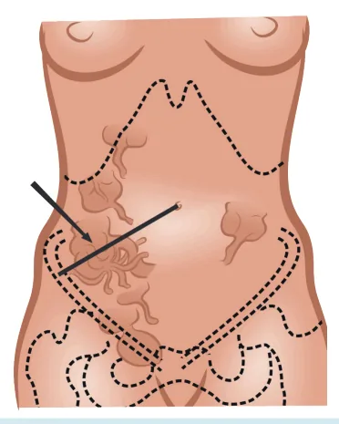

# Apendicite Aguda

<!-- page:1 -->

Suspeita de apendicite aguda? Tenho certe Avaliação clínica Estou na duv

## ESCALA DE ALVARADO

Sinais e sintomas Po Tudo o que aponta com o dedo é 1 ponto

- Comida não entra (anorexia)

- Comida sai (náusea)

- Migração da dor 1 po

- Dói quando tira 1 dedo (descompressão ca dolorosa)

- Termômetro é o dedo (febre)

- Apontando o desvio à esquerda com o dedo

Tudo o que entra são dois pontos

- Dói quando os 2 dedos entram no QID 2 po

- Agulha entrando para coletar o sangue ca

(leucocitose) EPIDEMIOLOGIA

- Abdome agudo cirúrgico mais comum: cerca de 8% da população;

- Existem 3 picos de incidência: Idade escolar; Jovens – 2ª e 3ª década de vida; Idosos.

- A prevalência é maior nos homens do que nas mulheres: 2:1;

- Mortalidade baixa – 0,5%;

- Apendicite aguda complicada - até 25% dos casos: mortalidade = 15% – principalmente idosos. Laparoscopia eza? Cirurgia vida? Escore de alvarado e exames onto Conduta pontos onto ada pontos ontos 7 - 10 ada pontos

Convencional USG TC 1 - 4 ALTA 5 - 6 Observar/USG Cirurgia ANATOMIA Figura 1: Anatomia abdominal - Localizações do apêndice cecal.

---

<!-- page:2 -->

- O apêndice cecal fica na confluência das tênias, no SINAIS SEMIOLÓGICOS final do cólon direito (ponta do ceco), normalmente na

- Blumberg: descompressão brusca dolorosa em FID;

fossa ilíaca direita –1/3 distal entre o umbigo e EIAS;

- Rovsing: dor referida à palpação de FIE;

- Ele pode estar em outros locais devido a

- Dunphy: dor à percussão ou ao tossir;

variações anatômicas:

- Lenander: diferença de temperatura axilar e retal > 1 C; Ex.: pélvica, retroperitoneal etc.

variações anatômicas:

- Irrigação: artéria apendicular (ramo da artéria ileocecocólica);

- Função do órgão: Rico em linfócitos – IgA e imunidade intestinal; Rico em flora bacteriana – reposição intestinal.

## FISIOPATOLOGIA

- Evento primário = obstrução luminal: hiperplasia linfoide (crianças); fecalito (adultos); estase, parasitas, tumores.

Obstrução luminal Aumento de pressão Fase I Edema e distenção Proliferação bacteriana e hipersecreção Fase II Isquemia e Ulceração Fase III Abscesso e necrose Fase IV Peritonite e perfuração Figura 2: Fisiopatologia da apendicite aguda.

## QUADRO CLÍNICO

- Dor epigástrica e periumbilical – difusa → Migra para FID;

- + anorexia, inapetência, vômitos, disúria, febre;

- A dor é progressiva;

- Pode ser em local diferente (devido às variações anatômicas): Idosos, diabéticos e gestantes = quadro clínico atípico. - Lenander: diferença de temperatura axilar e retal > 1 C;

- Psoas: em decúbito lateral esquerdo, dor à extensão + abdução do MID.

## DIAGNÓSTICO

- É clínico, baseado no quadro clínico e exame físico: Se tiver certeza = indicação de CIRURGIA! Se tiver dúvida = Escore de Alvarado e

## Exames complementares

Tabela 1: Escala de Alvarado. Sinais e sintomas Ponto Conduta Tudo o que aponta com o dedo é 1 ponto 1 - 4 ALTA

- Comida não entra pontos

(anorexia)

- Comida sai

(náusea)

- Migração da dor 1

- Dói quando ponto tira 1 dedo cada dolorosa) pontos USG

(descompressão 5 - 6 Observar/

- Termômetro é o dedo (febre)

- Apontando o desvio à esquerda com o dedo dois pontos

Tudo o que entra são

- Dói quando os 2 dedos entram no 2 pontos

7 - 10 QID pontos Cirurgia

- Agulha entrando cada para coletar o sangue

(leucocitose)

Estou na dúvida? USG TC Bom, rápido, barato, Padrão ouro, dúvida, sem radiação, sensível complicações Gestantes, magros, Obesos, USG não mulheres disponível RNM Achados: Paredes espessadas, não compressível, líquido periapendicular, coleção, densificação, realce, apendicolito Figura 3: Exames complementares na dúvida diagnóstica.

---

<!-- page:3 -->

TRATAMENTO TRATAMENTO NÃO OPERATÓRIO Premissa CONVENCIONAL

- Antibioticoterapia isolada em pacientes com apendicite

- Principal incisão = McBurney; aguda inicial resolve o problema e evita a cirurgia.

- A mais realizada, fácil e rápida; Resultados

- A mais realizada, fácil e rápida;

- Alto índice de sucesso.

## LAPAROSCOPIA

- Melhor visualização da cavidade;

- Dúvida diagnóstica;

- “Padrão ouro” – se disponível.

A técnica cirúrgica é a mesma em ambas as formas, tendo como ponto mais importante ligar a base do apêndice.

## COMPLICAÇÕES

Apendicite aguda complicada? Choque séptico? Não Sim TC e Labs Cirurgia Discutir apendicectomia de intervalo Figura 4: Fluxograma do manejo da apendicite aguda complicada.

APENDICECTOMIA DE INTERVALO Premissas

- Apendicectomias realizadas na urgência; quando complicadas, aumentam taxas de colectomia direita;

- Apendicites agudas complicadas têm maior taxa de neoplasia envolvida.

Solução

- Drenagem e ATB; colonoscopia; cirurgia programada;

- Condições: Paciente estável; coleção puncionável ou pequena (4 cm); Paciente tem condições de tratamento clínico e observação; Melhora com o tratamento.

- O que fazer? Drenagem guiada; ATB por 14 dias; TC de controle; Colonoscopia em 3 semanas; Cirurgia em 6 semanas. Resultados

- 30% de recidiva em menos de 1 ano.

Quando fazer?

- Dúvida;

- Altíssimo risco cirúrgico;

- Locais isolados.

## ANTIBIOTICOTERAPIA

- Apendicite aguda não complicada/Apendicite aguda inicial – FASE I e II: Antibioticoterapia profilática (até o momento cirúrgico).

- Apendicite aguda complicada ou perfurada – Antibioticoterapia terapêutica.

FASE III e IV:

- Na dúvida, coletar culturas/líquido peritoneal.

## NA GESTAÇÃO

- Cirurgia não obstétrica mais realizada na gestante;

- Conforme a gestação evolui, o quadro clínico varia; No terceiro trimestre há maior risco de complicações; Leucocitose fisiológica confunde o médico; Laparoscopia pode ser feita – melhor momento é o segundo trimestre;

- RNM – exame de imagem de escolha.

## DIAGNÓSTICOS DIFERENCIAIS

## APENDAGITE EPIPLÓICA

- Trombose espontânea de veia central do apêndice epiplóico - Necrose asséptica;

- TC – Massa paracólica com borramento;

- Tratamento: AINEs e analgésicos por 07 dias.

## DIVERTÍCULO DE MECKEL

- Malformação congênita do TGI mais comum; → 4% de complicações durante a vida;

- Ressecar e anastomosar, se houver sintomas e ele for a causa do quadro;

- Achado incidental = deixar lá e não mexer;

- Regra dos “2”: 2% da população tem; Homens 2/1; “2 pés” (60 cm) da Válvula Ileocecal; Tamanho médio de +/- 2cm; 2% dos pacientes tem sintomas; Antes dos 2 anos de idade (ou seja, mais comum em crianças); 2 tipos de mucosas = normal e heterotópica.

OPEROU E NÃO É APENDICITE. FAZER OU NÃO APENDICECTOMIA?

- Tem sinais de inflamação? → TIRA;

- Achou o diagnóstico diferencial? → NÃO TIRA;

- Não achou nada? → TIRA.
