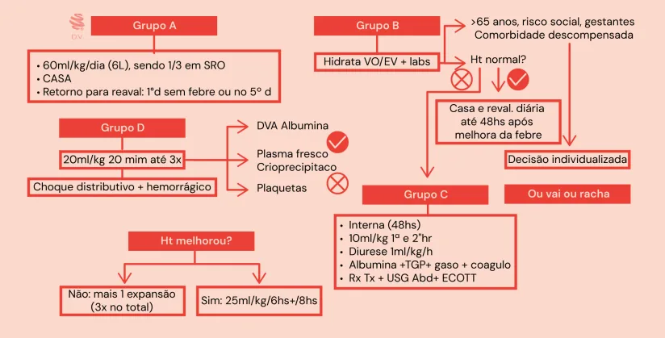
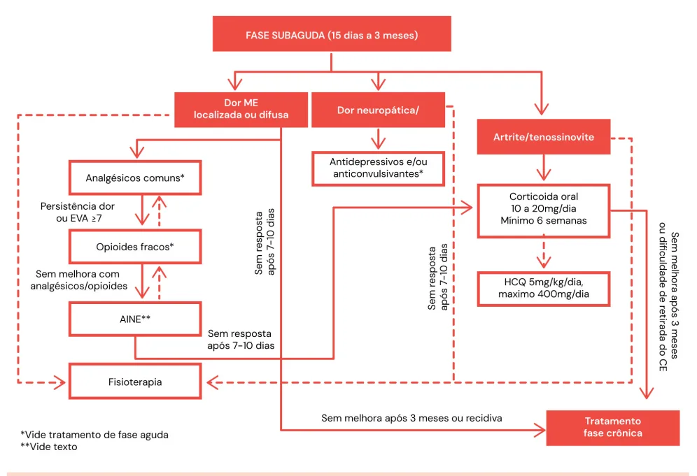
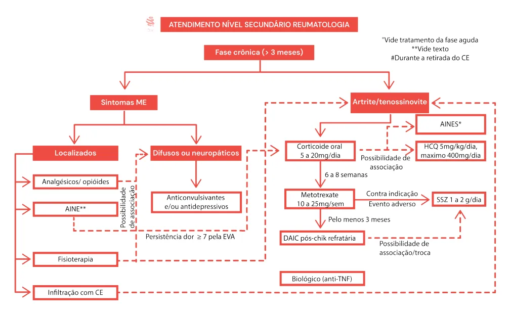

# Arboviroses

<!-- page:1 -->

Arboviroses (CM)

## DENGUE

Incubação 3-7 dias Picada do Período de mosquito (inoculação) infecção (3-4 dias) PCR/NS1 Febre de 2-7 dias com 2 ou

- Cefaleia, retro orbitária

D.V • Mialgia intensa

- Artralgia, exantema nenhum teste é positivo

NS1: 3º-6 dia de sintomas E 84-100% S 64% Infecção Sintomas 3° - 6° dia A: jovem Liso

- < 65 anos

- Prova do laço negativa

- Sem comorbidades

- Não gestante

- Sem risco social

B: algo já te preocupa

- > 65 anos

- Prova do laço positiva

- Comorbidades clínicas

- Gestantes

- Risco social

C inal de alarme

- Dor abdominal intensa, contínua, refratária

- Vômitos persistentes

- Sangramento de mucosas Defervescência

Sorologia (5°-7°dia) Cinal de alarme

- Dor abdominal intensa e continua u mais • Vômitos persistentes

- Sgto de mucosas

- Derrames cavitários

- Hipotensão postural ou lipotimia

- Diferença de sistólica > 20

- Diastólica > 10

- Hepatomegalia > 2 CM RCD o • Letargia/irritabilidade

- Hemoconcentração

- Derrames cavitários

- Hipotensão postural ou lipotimia Diferença de sistólica > 20 mmHg Diferença de diastólica > 10 mmHg

- Hepatomegalia > 2cm do rebordo costal direito

- Letargia /irritabilidade (crianças)

- Hemoconcentração

D isfunção hemodinâmica

- Pulsos finos e fracos

- TEC > 2 seg

- PA convergente (<20mmHg de diferença PAS e PAD)

- Taquipnéia

- Oligúria (<1,5mL/kg/h)

- Sangramento grave

- Cianose

---

<!-- page:2 -->

Stent e AAS (prof. 2ª AVC)

- Não dar AINES

- Simplificando

- Não dar corticóides (rebote) Plaquetas > 50.000 mantém Subaguda Plaquetas <30.000 suspende

- De 3-8 semanas Plaquetas <30.000 suspende

- Varfarina

- Plaquetas > 50.000 : ambulatorial

- Plaq 30-50mil : interna e HNF -> INR < 2,0 reinicia C

- Plaq < 30 mil : Interna e monitora

- CHIKUNGUNYA

Aguda

- Até 2-3 semanas

- Analgésicos simples

- Derivados de opioides, tricíclicos, gabapentina e anticonvulsivantes.

## DENGUE M

- No Brasil, é uma doença endêmica; Acomete todo o território brasileiro; Apresenta maior correlação com períodos chuvosos; É uma epidemia de poucas semanas no ano; A área de alcance do mosquito Aedes aegypti é de

300 metros.

- Existem 4 tipos (1 - 4) – DENV 1/2/3/4.

## IMUNIDADE = SOROTIPO DEPENDENTE

- Ou seja, mediante a infecção por um sorotipo, a reinfecção somente ocorrerá por outro sorotipo. Após a infecção, os anticorpos para aquele sorotipo acabam protegendo contra os outros sorotipos por S no mesmo ano); Mas depois esses anticorpos não conseguem mais te proteger. Pelo contrário: geram uma resposta inflamatória exacerbada caso você seja exposto a um novo sorotipo. São ditos anticorpos heterólogos.

6 meses (por isso que não costuma ter 2 dengues P É o chamado fenômeno Antibodydependent enhancement;

- Consequentemente, há maior risco de evoluir com dengue em forma grave, no 2º – 3° episódio D de infecção. M anticorpos heterólogos não conseguem impedir a infecção, mas exacerbam a resposta inflamatória frente a ela.

## CURSO CLÍNICO

- Picada do mosquito contaminada com o flavivirus (RNA); Incubação 3 - 7 dias; Período de infecção (dura 3 - 4 dias); P Período de defervescência (5° - 7° dia).

- De 3-8 semanas

- AINES

- Corticóide - 10-20mg/pred. Mínimo 6 semanas

Crônica

- > 8 semanas

- Hidroxicloroquina 400mg/d. 6-8 sem. Associar pred se não estiver em uso.

- DMARDs: MTX ou Sulfassalazina se refratariedade

## MANIFESTAÇÕES CLÍNICAS – PERÍODO DE

## INFECÇÃO

- Caso suspeito: caracterizada por febre de 2 – 7 dias com sintomas gerais e inespecíficos náusea, vômitos, anorexia; exantema; mialgia, artralgia; cefaleia, dor retro-orbital;

Exantema, pode ou não estar presente; apresentação tardia – surge a partir do 3-5 dia; caráter maculopapular, central (acomete face, tronco, membros, mas também palmas e plantas) e pode ser pruriginoso (dica).

SUSPEITA DE DENGUE Prova do laço

1. Insuflação do manguito até a média das pressões

sistólica e diastólica;

2. Manter insuflação por 3 – 5 minutos;

3. Contagem de petéquias em quadro de 2,5 cm

x 2,5 cm;

4. Teste positivo se a contagem indicar pelo menos

20 petéquias Frequentemente negativa em obesos e em caso de choque DIAGNÓSTICO: Métodos:

- Fase virêmica → PCR / NS1; NS1 pode vir positivo no geral até 3º dia. Mas mesmo nesse período, pode ser negativo S = 64%; -> 35% são falsos negativos! E ~ 84 – 100%.

(baixa sensibilidade)!

- Em período de defervescência (após 5° a 6° dia) → sorologia (teste rápido);

Pegadinha do diagnóstico:

- Atenção: do 3º – 6° dia de sintomas, nenhum teste é positivo!

- Assim, a suspeita de dengue é clínica!

---

<!-- page:3 -->

Antígeno comorbidades clínicas descompensadas, risco social, D.V recusa de ingesta oral, > 65a considerar decisão NS1 individualizada (observação no PS / internação)

3º-6 dia de sintomas IgM nenhum teste é positivo IgG C - Cinal de Alarme; IgG Infecção Sintomas 3° - 6° dia Figura 1: Diagnóstico: dengue Laboratório geral:

- Transaminases 200 - 300 UI;

- Sem alargamento de coagulograma;

- Sem aumento de bilirrubina direta;

- Hematócrito (Ht) aumentado;

- Plaquetopenia Grave se < 20.000/mm3 (considerar monitorização diária de plaquetas)..

- IRA discreta;

- Leucopenia.

CLASSIFICAÇÃO DE RISCO: A - “jovem liso”

- Prova do laço negativa; Sem manifestação hemorrágica espontânea ou induzida.

- Sem sinais de alarme;

- Sem comorbidades;

- Faixa etária: > 2 anos e < 65 anos;

- Não é gestante;

- Sem risco social.

- Tratamento: Hidratação 60 ml/kg/dia, sendo 1/3 em SRO (soro de reidratação oral); Retorno para reavaliação no 1° dia sem febre ou no

5° dia da doença.

- Não precisa coletar exames no grupo A, mas sempre avaliar com prova do laço.

B - “algo já te preocupa”;

- Prova do laço positiva ou manifestação hemorrágica espontânea;

- Presença de comorbidades E/OU;

- Extremos de idade (>65 anos) E/OU;

- Gestante E/OU;

- Risco social (sem residência fixa);

- Sem sinais de alarme;

- Sem sinais de choque;

- Tratamento: Hidratação VO/EV na entrada, Labs iniciais; Ht inicial normal?

1. Hidratação igual à do grupo A e retorno em PS

para reavaliar ,diário até 48hs sem febre.;

- Ht aumentado conduzir como grupo C. C - Cinal de Alarme;

- Sem sinais de choque;

- Sintomas abdominais - dor abdominal constante. No geral, refratária à hidratação e ao uso de analgésicos; Vômitos persistentes; Hepatomegalia > 2 cm;

- Sangramento de mucosas. Gengivorragia; Hematúria; Sangramento de trato gastrointestinal;

- Hipotensão postural e/ou lipotimia. PAS deitada – PAS sentada ou em pé ≥ 20 mmHg; PAD deitada – PAD sentada ou em pé ≥ 10 mmHg;

- Derrames cavitários (radiografia de tórax e USG de abdome);

Tratamento

- Internação em UTI se possível (não é indicação absoluta): Hidratação EV 10 ml/kg na 1 e 2° hora; Objetivo: diurese: ~1 ml/kg/h; Reavaliação após 2 horas com Ht; Se não, proceder com mais uma expansão volêmica; Avaliar melhora do Ht após 3° expansão volêmica; Se não houve melhora, reclassificar o paciente no grupo D; Se sim, administrar 25 ml/kg nas primeiras 6 horas + 25 ml/kg de 8/8 horas.

a. Houve melhora do Ht? D - Disfunção hemodinâmica

- Má perfusão (TEC > 2 seg, pulso fino, PA convergente e = < 20 mmHg de diferença sistólica - diastólica);

- Oligúria (<1,5ml/kg/h);

- Sangramento grave (TGI);

- Disfunção orgânica;

- Tratamento: UTI – choque hemorrágico + distributivo; Administrar 20 ml/kg em 20 minutos, por até 3x; Ht ou PA melhorou? Não: albumina 0,5 – 1 g/kg. + vasopressor.

Choque e administração de plaquetas:

- Considerações: O desenvolvimento do choque na dengue é precoce, rápido e breve; Observa-se “pinçamento” da pressão arterial.

- Deve-se considerar transfusão Se coagulopatia: plasma fresco + vitamina K os fatores de coagulação e do choque,e com trombocitopenia e/ou INR > que 1,5 vez o valor normal.

Transfusão de plaquetas apenas se sangramento S persistente não controlado, depois de corrigidos Atenção: transfusão de plaquetas é de muito difícil indicação pois pode induzir à CIVD.

---

<!-- page:4 -->

Conduta em relação ao uso de certos AAS, clopidogrel,

- Inibidores de trombina ou antifator Xa varfarina e novos DOACs (e.g., rivaroxabana)

- Basicamente, somente haverá suspensão em casos | Plaquetas > 50.000 → manter terapia com com plaquetopenia < 30.000/mm3. Se novos DOACs, monitorização cuidadosa;

cuidado < 50 mil. | Plaquetas < 50.000 : internar para substituição por

- Verificar Figura 2 heparina não fracionada (após 24h da última dose

- DAPT: AAS + clopidogrel ou 2 meias-vidas da droga); Stent até 1 mês se convencional, 6 meses | Sangramento moderado ou grave: Suspender se farmacológico a medicação. Medidas específicas incluem Plaquetopenia > 50.000 → mantém; controle de sangramento, mas sem antídotos Plaquetopenia < 30.000 → suspende. incorporados no SUS. Entre 30 e 50: interna para monitorização Critérios de internação

- AAS isolado (....mesma coisa)

- Sinais de alarme; Stent farmacológico (>6 meses), stent convencional

- Diminuição de ingestão alimentar;

(>1 mês) ou profilaxia secundária de doença arterial

- Comprometimento respiratório coronária/cerebrovascular:

- Idade > 65 anos; Plaquetopenia > 50.000 → mantém;

- Gestante; Plaquetopenia < 30.000 → suspende.

- Indivíduos em vulnerabilidade social (impossibilidade Entre 30 e 50: interna para monitorização de seguimento);

- Warfarina:

- Comorbidades descompensadas: Objetivar INR 1,5 – 2. Critérios para alta hospitalar: Plaquetopenia > 50.000 → mantém;

- Estabilização hemodinâmica durante 48 horas; Plaquetopenia < 30.000 → suspender warfarina e

- Ausência de febre por 24 horas;

internar para monitorização com TAP e contagem

- Melhora visível do quadro clínico;

diária de plaquetas;

- Hematócrito normal e estável por 24 horas; Entre 30 e 50 : suspender warfarina e trocar por

- Plaquetas em elevação.

heparina não fracionada (após TAP com INR < 2,0);

- Verificar Figura 3 a seguir. Sangramento grave: reverter com plasma fresco congelado (15 mL/kg) e vitamina K (10 mg VO ou IV).

## Suspende ou não suspende?

AAS/ clop só suspende mesmo se plaq < 30 mil. Novos DOACs se < 50.

- <1 mês se convencional

- <6 meses se farmacológico • Plaqt > 50.000 mantem

DAPT ▪ AAS + clopidogrel Warfarina • Plaq < 30.000 suspende ▪ Plaqt > 50.000 mantem • No meio: troca HNF e monitora ▪ Plaq < 30.000 suspende • INR 1,5 - 2 ▪ No meio: interna e monitora

- >1 mês se convencional

- Plaqt > 50.000 mantem

- >6 meses se farmacológico

AAS DOACs • Plaq < 50.000 troca HNF e

- Prof. AVC monitora

- Mesma conduta DAPT convencional <1 mês em uso de DAPT (AAS e clopidogrel) conforme protocolo de grupo B e realizar contagem diária de plaquetas e realizar contagem diária de plaquetas

Figura 2: Manejo da anticoagulação e antiagregação plaquetária na dengue. Stent farmacológico <6 meses ou stent Plaquetas acima de Plaquetas entre Plaquetas abaixo de 50x10 / L 50x10 / L e 30x10 / L 30x10 / L 9 9 9 9 Manter o AAS e o cloridogrel Manter o AAS e o cloridogrel Suspender o AAS e o cloridogrel Realizar contagem diária dde plaquetas, Admitir em leito de observação Admitir em leito de observação Figura 3: Manejo da DAPT na vigência de Dengue

---

<!-- page:5 -->

## CHIKUNGUNYA

- Não se deve administrar AINEs e corticoide (risco de efeito rebote).

- Chikungunya é um termo derivado do maconde → Subaguda

“aquele que dobra o joelho”;

- De 3 – 8 semanas;

- A marca da doença é a poliartralgia, simétrica e distal.

- Manejar com:

- A marca da doença é a poliartralgia, simétrica e distal.

CASO SUSPEITO:

- Febre > 38,5 °C, com duração < 14 dias, com artralgia/ artrite, sem outra causa aparente.

QUADRO CLÍNICO:

- Febre alta, com duração de 10 dias, com poliartralgia simétrica, distal, pequenas e grandes articulações, entre 2 – 5° dia de sintomas;

- Edema periarticular;

- Rash maculopapular precoce e não pruriginoso;

- Linfadenopatia cervical;

- Hepatite branda – com transaminases entre

100 – 200 UI;

- Trombocitopenia leve (plaquetas ~100.000/mm3);

- VHS e PCR elevados.

FASES: Aguda;

- Até 2-3 semanas;

- O tratamento é realizado apenas com uso de analgésicos simples, derivados de opioides (em alguns casos) e (se necessário) abordagem de dor neuropática (tricíclicos e anticonvulsivantes) AINEs + manejo de dor; Corticoide – prednisona 0,5 mg/kg/dia (1020mg), mínimo de 6 sem.; Pacientes com contra-indicações a corticoterapia:

Figura 4: Tratamento da fase subaguda da Chikungunya. - Manejar com: DM, HAS refratária, osteoporose com fratura patológica, Cushing, DRC em TSR.

- Verificar Figura 4

Crônica

- > 8 semanas;

- Grupo de maior risco de cronificação: mulheres, acima de 45 anos, com substrato reumatológico.

- Manejo com: Hidroxicloroquina 5mg/kg (até 400mg/dia) por 6 – Associar corticóide DMARDs : MTX, sulfassalazina se contra-indicação / efeito adverso MTX: hepatotoxicidade, mielotoxicidade, estomatites (intoxicação).

8 semanas – pilar do tratamento;

- Verificar Figura 5 na próxima página

---

<!-- page:6 -->

Figura 5: Tratamento da fase crônica da Chikungunya.

## ZIKA OROPOUCHE

- Originado da floresta de Uganda; CASO SUSPEITO

- Resida ou tenha viajado nos últimos 14 dias para

MANIFESTAÇÕES: região amazônica ou área onde esteja ocorrendo

- Clínica: somente em 20% dos casos; transmissão autóctone FO,

- Febre baixa;

- Febre súbita e duas ou mais das

- Exantema maculopapular pruriginoso; seguintes manifestações:

- Conjuntivite bilateral;

- Cefaleia, mialgia, artralgia, tontura, dor retro- ocular,

- Linfadenopatia; calafrios, fotofobia, náuseas e vômitos.

- Artralgia.

## CLÍNICA

PROBLEMA: NEUROTROPISMO:

- Marca clínica é o retorno dos sintomas virais

- Encefalite; inespecíficos de 1-2 semanas após a melhora

- Microcefalia; | Não é acompanhado de nova viremia

- Isquemia cerebral;

- Não há sintomatologia específica que a diferencie de

- Guillain-Barré. outras arboviroses

Atenção: toda arbovirose é neurotrópica! Zika é apenas INVESTIGAÇÃO “a mais famosa” por isso.

- Vigilância sentinela : busca ativa de febre do Mayaro e febre do oropouche para amostras negativas para

DIAGNÓSTICO: dengue, zika e chik

- PCR nos primeiros 4 – 6 dias; | Mayaro: Indivíduo que apresentou febre e artralgia

- Após tal período, é por sorologia; e/ou edema articular, acompanhado de cefaleia,

- Suspeita de SGB: IgM no LCR. e/ou mialgia e/ou exantema, com exposição nos últimos 15 dias (ou moradia) em área silvestre, rural

TRATAMENTO: SUPORTE ou de mata, em todo o território nacional.

---

<!-- page:7 -->

Tabela 1: quadro resumo das arboviroses Quadro resumo das arboviroses Dengue Chikungunya Zika Marca principal Cefaleia Hematócrito Febre Alta e súbita Hepatite Frequente Ra Rash cutâneo Tardio, 50% Prese Conjuntivite Rara Linfonodomegalia Rara PROVÁVEL IgM reagente (única amostra)

## CONFIRMADO

- PCR ou isolamento em sangue, líquor ou outros líquidos e tecidos corporais

- Aumento de 4 vezes de intervalo 10 a 21 dias

IgG, amostras pareadas,

## CASO SUSPEITO

- IgM reagente no líquor

- Conversão sorológica para IgM entre as amostras pareadas de soro

- Imuno-histoquímica positiva

## DESCARTADO

Ausência de detecção de IgM e do genoma viral nas amostras colhidas Figura 6 Fluxograma diagnóstico da Oropouche Febre baixa, mono-like com Poliartralgia neurotropismo Alta e súbita Baixa, se presente ara, mais branda Ausente Bastante presente, precoce (mas ente mais precoce muitas vezes zika é assintomática)

30% Presente (50 –90%) 30% Bastante presente

- Verificar Tabela 1

## REFERÊNCIA

Figura 4 e 5: Adaptado de: Recomendações da Sociedade Brasileira de Reumatologia para diagnóstico e tratamento da febre chikungunya. Parte 2 - Tratamento. https://doi.org/10.1016/j.

rbre.2017.06.004
