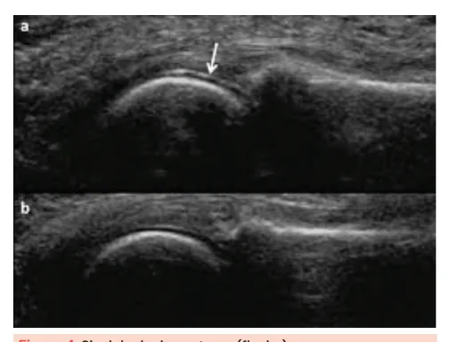
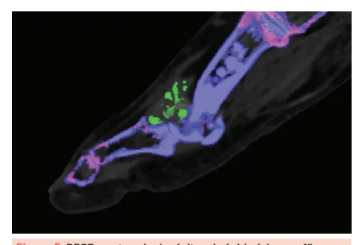
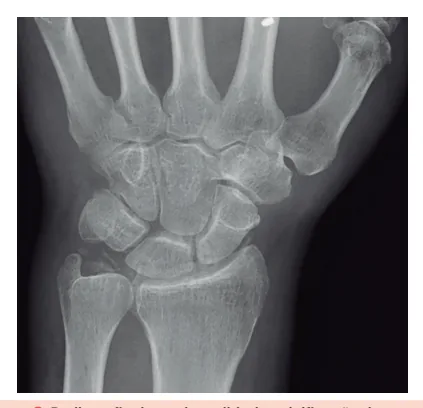
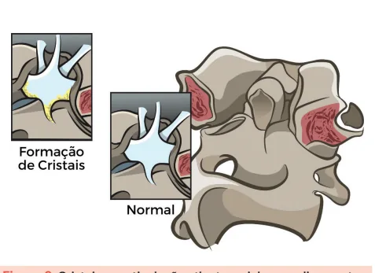
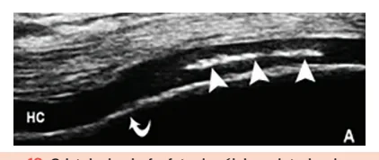

# Artrites Microcristalinas (gota e CPPD)

<!-- page:1 -->

## ARTRITES MICROCRISTALINAS

## (GOTA E CPPD)

Microcristalinas (CM) Sempre lembrar das artrites microcristalinas no diagnóstico diferencial das monoartrites!

## GOTA

- Formação de cristais de urato monossódico nos tecidos articulares e periarticulares;

- Associação dietética: carnes vermelhas, miúdos, frutose, alimentos ricos em purinas;

- Predomínio masculino 7:1, em geral com início próximo aos 30 anos de idade;

- Crises de dor monoarticular típicas, durando 3-14 dias, com pico de intensidade nas primeiras horas

(lembrar que acorda o paciente). Em geral podagra;

- Líquido articular com cristais em formato de

“agulha” e birrefringência negativa;

- Tratamento: AINEs, colchicina ou corticoide nas crises. Manutenção com alopurinol ou benzbromarona, buscando alvo de ácido úrico <6 ou <5 se tofos articulares.

- Formação de cristais de urato monossódico nos tecidos articulares e periarticulares;

- 1 a 5% da população;

- Relacionada a fatores dietéticos;

- Predomínio masculino (7:1);

- Mais comum entre os 30 a 60 anos;

- Mulheres apresentam gota em faixa etária mais elevada, na pós-menopausa.

## FISIOPATOLOGIA

- Hipoexcretor (90% dos casos): baixa depuração renal de ácido úrico;

- Hiperprodutor (10% dos casos): elevada síntese de purinas, seja pela dieta ou doenças com alto turnover celular (neoplasias, transplantes, psoríase, etc).

- O paciente também pode ter os dois componentes, sendo caracterizado como misto.

## FATORES ASSOCIADOS

Alguns alimentos e medicamentos podem aumentar os níveis séricos de ácido úrico e predispor a crises de gota.

- Alimentos ricos em frutose, purinas e proteínas, como mel, xarope de milho, refrigerante, carne vermelha, fígado, crustáceos, grãos, álcool, vinho, cerveja e sucos industrializados.

- Medicamentos, como hidroclorotiazida, furosemida, levodopa, pirazinamida e etambutol.

AAS em baixas doses, tacrolimus, ciclosporina, DOENÇA POR DEPOSIÇÃO DE PIROFOSFATO DE CÁLCIO (DDPC)

- Formação de cristais de pirofosfato de cálcio nos tecidos articulares;

- Fatores de risco: idade >50 anos, trauma articular prévio, comorbidades associadas;

- Manifestações variáveis, mas lembrar do padrão pseudo-gota (monoartrite inflamatória aguda), poliarticular inflamatório (semelhante a artrite reumatoide) e de osteoartrite com e sem “agudização”;

- Lembrar de excluir hiperparatireoidismo, hipomagnesemia, hipofosfatasia e hemocromatose como quadros associados;

- Líquido articular com cristais romboides e birrefringência positiva;

- Tratamento: semelhante ao da gota quando crise monoarticular aguda, entretanto o padrão poliarticular inflamatório assemelha-se ao tratamento da artrite reumatoide.

## ESPECTRO CLÍNICO

- Hiperuricemia assintomática: Ácido úrico > 7mg/dL sem artrite ou litíase urinária.

- Crise aguda de gota: Monoartrite ou oligoartrite aguda, com dor intensa, eritema e hipersensibilidade ao toque.

- Período intercrises: Período assintomático que pode durar meses; Com o passar do tempo e sem tratamento, as crises se tornam mais frequentes e o período intercrise mais curto.

- Gota tofácea crônica: Poliartrite crônica, com destruição articular; Tofos são massas amorfas de urato monossódico, em aspecto de “giz”, e que se depositam comumente em dedos, tendão de Aquiles, bursa olecraniana e pavilhão auricular.

Figura 1: Tofo gotoso em dorso da interfalangiana distal.

---

<!-- page:2 -->

## CRISE AGUDA DE GOTA

- Mais comumente monoarticular ou oligoarticular;

- Dor intensa e hipersensibilidade ao toque;

- Início repentino, geralmente à noite, atingindo intensidade máxima em < 24 horas;

- Pode ter eritema associado e confundir com celulite;

- Podagra (1ª metatarsofalangeana) é manifestação inicial em 50% dos casos;

- Outros locais comumente afetados incluem cotovelos, joelhos, tornozelos e punhos (articulações periféricas mais “frias”);

- É autolimitada no início, durando de 3 a 14 dias, mesmo sem tratamento.

## ARTROCENTESE DIAGNÓSTICA

Como regra geral, toda monoartrite aguda deve ser puncionada! Analisar o líquido sinovial nestes casos é fundamental para excluir artrite séptica.

Figura 3: Erosões em saca-bocado e tofos.

- Líquido sinovial inflamatório, com 2.000 a 50.000 células e >50% de polimorfonucleares; Ultrassonografia

- Presença de cristais “em agulha”;

- Sinal do duplo contorno: cristais hiperecogênicos na

- Forte birrefringência negativa à luz polarizada. superfície articular;

- Tofos.

Figura 2: Líquido sinovial exibindo cristais “em agulha” com forte birrefringência negativa. Figura 4: Sinal do duplo contorno (flecha).

Isoladamente, a presença de cristais de urato Tomografia computadorizada de dupla energia (DECT) monossódico no líquido sinovial ou a presença de

- Identifica depósitos de ácido úrico.

tofos já estabelece o diagnóstico de gota.

## EXAMES LABORATORIAIS

- Hiperuricemia;

- Pode apresentar exames compatíveis com síndrome metabólica;

- Pode apresentar disfunção renal.

Lembre-se de que o ácido úrico pode estar “falsamente” baixo ou normal quando dosado durante uma crise aguda de gota!

## EXAMES DE IMAGEM

Radiografia

- Erosões em saca-bocado; Figura 5: DECT mostrando depósitos de ácido úrico em 1ª

- Tofos. metatarsofalangeana (pontilhado verde).

---

<!-- page:3 -->

## TRATAMENTO

- Pode cursar com crise dolorosa cervical, súbita, com

- Orientações gerais: rigidez de nuca e febre baixa; Retirar tiazídicos e diuréticos de alça;

- Diagnóstico diferencial com meningite. Preferir losartana quando houver indicação de iECA ou BRA; Preferir atorvastatina como hipolipemiante; Redução na ingesta de álcool, purinas, frutose; Perda ponderal;

- Para as crises agudas de gota: AINEs; Colchicina; Corticoides.

- Para reduzir os níveis de ácido úrico a longo prazo: Alopurinol (inibidor da xantina oxidase); Benzbromarona (uricosúrico).

Meta do tratamento uricorredutor: ácido úrico <6 mg/ dL no geral e <5 mg/dL se gota com tofos.

## DOENÇA POR DEPOSIÇÃO DE

## PIROFOSFATO DE CÁLCIO

- Formação de cristais de pirofosfato de cálcio dihidratado nas articulações;

- Mais frequente em mulheres > 50 anos;

- Associada a comorbidades, trauma articular prévio e osteoartrite prévia.

## COMORBIDADES ASSOCIADAS

Especialmente em idades mais jovens, a doença por deposição de pirofosfato de cálcio pode estar associada a:

- Hipomagnesemia

- Hipofosfatasia (fosfatase alcalina sérica baixa);

- Hemocromatose (elevação de ferritina e da saturação da transferrina);

- Hiperparatireoidismo (elevação do PTH sérico).

## PADRÕES CLÍNICOS

- Condrocalcinose assintomática: depósitos vistos em imagem em paciente assintomático;

- Artrite aguda ou “pseudo-gota”;

- Artropatia inflamatória crônica ou “pseudo-artrite reumatoide”: artralgia inflamatória;

- Osteoartrite com “agudizações”: artralgia mecânica com episódios de monoartrite ou oligoartrite aguda;

- Osteoartrite sem “agudização”: apenas artralgia mecânica, mas em sítios não comuns para osteoartrite primária, como o punho;

- Artropatia destrutiva: semelhante à artropatia de Charcot.

Diferentemente das crises agudas de gota, a artrite aguda associada ao depósito de pirofosfato de cálcio é mais prolongada (>14 dias a meses)!

## SÍNDROME DO DENTE COROADO

- Deposição de cristais de pirofosfato de cálcio na articulação atlanto-axial ou nos ligamentos associados;

Figura 6: Cristais na articulação atlanto-axial ou nos ligamentos associados.

- Líquido sinovial inflamatório (mas pode ser hemorrágico, diferentemente da gota), com 2.000 a

50.000 células e >50% de polimorfonucleares;

- Presença de cristais romboides;

- Fraca birrefringência positiva à luz polarizada.

Figura 7: Líquido sinovial exibindo cristais romboides com fraca birrefringência positiva.

Radiografia

- Condrocalcinose: radiodensidade pontual e linear, principalmente em joelhos, sínfise púbica, articulação gleno-umeral e ligamento triangular do punho.

e Figura 8: Radiografia de punho exibindo calcificação do ligamento triangular.

---

<!-- page:4 -->

## REFERÊNCIAS

Figura 1: Tofo gotoso em dorso da interfalangiana distal. c d r d r Figura 9: Radiografia de joelho exibindo calcificação dos meniscos.

Ultrassonografia d r

- Condrocalcinose: cristais hiperecogênicos no interior da cartilagem.

c d a Figura 10: Cristais de pirofosfato de cálcio no interior da A d cartilagem. r

## LABORATÓRIO

- Sem marcador sérico característico;

- Lembrar de excluir hiperparatireoidismo, G hipomagnesemia, hipofosfatasia e hemocromatose; R c e

- Para as crises agudas: AINEs; G Colchicina; R c Corticoides. e

- Para os quadros articulares crônicos: Colchicina; Em casos refratários, pode-se lançar mão A da hidroxicloroquina, metotrexato e anti- d r com/215312936/8gout-pseudogout-flash-cards/. Acesso em: 3 jun. 2025.

IL1 (canaquinumabe). QUIZLET. 8. Gout & Pseudogout. Disponível em: https://quizlet. Figura 2: Líquido sinovial exibindo cristais “em agulha” com forte birrefringência negativa.

AMERICAN COLLEGE OF RHEUMATOLOGY. Biblioteca de Imagens da Reumatologia. Atlanta, GA: ACR, c2025. Disponível em: https:// rheumatology.org/image-library. Acesso em: 04 junho 2025.

Figura 3: Erosões em saca-bocado e tofos. AMERICAN COLLEGE OF RHEUMATOLOGY. Biblioteca de Imagens da Reumatologia. Atlanta, GA: ACR, c2025. Disponível em: https:// rheumatology.org/image-library. Acesso em: 04 junho 2025.

Figura 4: Sinal do duplo contorno (flecha). AMERICAN COLLEGE OF RHEUMATOLOGY. Biblioteca de Imagens da Reumatologia. Atlanta, GA: ACR, c2025. Disponível em: https:// rheumatology.org/image-library. Acesso em: 04 junho 2025.

Figura 5: DECT mostrando depósitos de ácido úrico em 1ª metatarsofalangeana (verde). GLAZER, D. Two-dimensional DECT sagittal image demonstrating urate crystal deposition within an Achilles tendon. ResearchGate, 2014. Figura disponível em: https://www.researchgate.net/figure/Two-dimensionalDECT-sagittal-image-demonstrating-urate-crystal-deposition-withinan_fig1_269926210. Acesso em: 3 jun. 2025.

Figura 7: Líquido sinovial exibindo cristais romboides com fraca birrefringência positiva. AMERICAN COLLEGE OF RHEUMATOLOGY. Biblioteca de Imagens da Reumatologia. Atlanta, GA: ACR, c2025. Disponível em: https:// rheumatology.org/image-library. Acesso em: 04 junho 2025.

Figura 8: Radiografia de punho exibindo calcificação do ligamento triangular. GAINES, M. Calcium pyrophosphate dihydrate deposition disease.

Radiopaedia, 2023. Disponível em: https://radiopaedia.org/articles/ calcium-pyrophosphate-dihydrate-deposition-disease-1?lang=us. Acesso em: 3 jun. 2025.

Figura 9: Radiografia de joelho exibindo calcificação dos meniscos. GAINES, M. Calcium pyrophosphate dihydrate deposition disease.

Radiopaedia, 2023. Disponível em: https://radiopaedia.org/articles/ calcium-pyrophosphate-dihydrate-deposition-disease-1?lang=us. Acesso em: 3 jun. 2025.

Figura 10: Cristais de pirofosfato de cálcio no interior da cartilagem. AMERICAN COLLEGE OF RHEUMATOLOGY. Biblioteca de Imagens da Reumatologia. Atlanta, GA: ACR, c2025. Disponível em: https:// rheumatology.org/image-library. Acesso em: 04 junho 2025.

