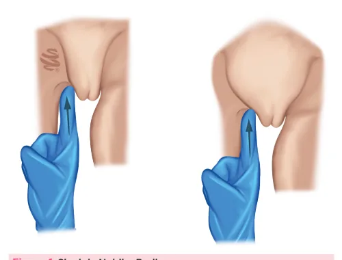
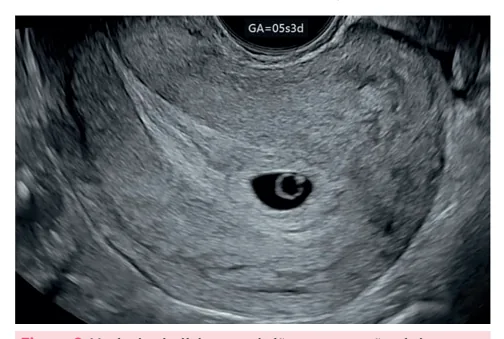
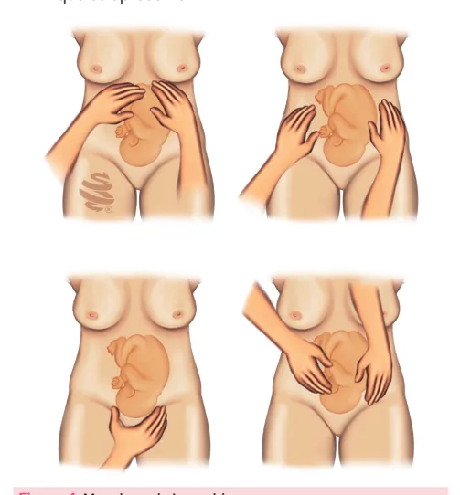
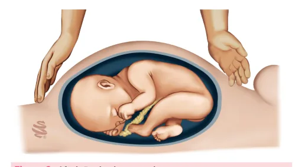

# Assistência ao Pré-natal

<!-- page:1 -->

Assistência ao Pré-Natal: Consulta pré-concepcional; Diagnóstico de gravidez; Exames laboratoriais do pré-natal; Modificações gravídicas do organismo materno; Imunizações na gestação.

## Diagnóstico de Gravidez

- O hCG é produzido pelo sinciciotrofoblasto após a implantação e o objetivo é impedir a involução do corpo lúteo.
  - **Teste de gravidez no soro**: mais sensível. Detecta níveis séricos de **5 a 10 mUI/mL**.
  - **Teste de gravidez na urina**: orientado após o atraso menstrual de 7 dias ou mais. Valores a partir de **20 a 50 mUI/mL**.
- **Ultrassonografia**:
  - 1º sinal de gestação: saco gestacional é visualizado entre **4,5 e 5 semanas** de gestação.
  - Vesícula vitelínica: aparece entre **5-6 semanas**, permanecendo até aproximadamente 10 semanas.
  - A atividade cardíaca do embrião pode ser detectada pela primeira vez em **5,5-6 semanas**.

### Número Mínimo de Consultas

- **OMS**: recomenda no mínimo 6 (1 no primeiro trimestre; 2 no segundo e 3 no terceiro).
- **MS**: até 28 semanas — mensalmente; de 28 a 36 semanas — quinzenalmente; entre 36 e 41 semanas — semanalmente.

### Cálculo da Data Provável do Parto

- **Regra de Naegele** — cálculo de DPP a partir da DUM: **+7 no dia / -3 no mês**, ou **+9 meses** se corresponder aos meses de janeiro a março.

## Ferro

- **Ministério da Saúde**: para gestantes, **40 mg de ferro elementar** diariamente após a confirmação da gravidez, até o final da gestação.

## Exames

> ⚠️ Tabela reconstruída a partir de OCR — confira contra a fonte original.

**Tabela 1: Exames laboratoriais recomendados por trimestre (Ministério da Saúde e Febrasgo)**

### Ministério da Saúde

**1º trimestre**
- Hemograma
- Tipagem sanguínea e fator Rh
- Coombs indireto
- Glicemia em jejum
- HIV e sífilis
- Toxoplasmose IgM e IgG
- Hepatites B e C
- Urocultura + urina tipo I
- Citologia oncológica
- Parasitológico de fezes
- Exame da secreção vaginal

**2º trimestre**
- Teste de tolerância à glicose com 75g (entre a 24ª e a 28ª semanas)
- Coombs indireto (se for Rh negativo)
- Toxoplasmose (se suscetível): no máximo a cada 2 meses de gestação

**3º trimestre**
- Hemograma
- HIV e sífilis
- Glicemia em jejum
- Urocultura + urina tipo I
- Toxoplasmose (se suscetível): no máximo a cada 2 meses de gestação
- Bacterioscopia de secreção vaginal (a partir de 37 semanas de gestação)

### Febrasgo

**1º trimestre**
- Tipagem sanguínea e fator Rh
- Coombs indireto
- Hemograma e ferritina sérica
- Glicemia de jejum e hemoglobina glicada
- HIV e sífilis
- Toxoplasmose IgM e IgG
- Hepatites B e C
- Rubéola e CMV*
- TSH e T4 livre
- Citologia oncológica

**2º trimestre**
- Hemograma
- Teste de tolerância à glicose com 75g (entre a 24ª e a 28ª semanas)
- HIV e sífilis
- Toxoplasmose (se suscetível)
- Coombs indireto (se for Rh negativo)
- Urocultura + urina tipo I

**3º trimestre**
- Coombs indireto
- Toxoplasmose (se suscetível): no máximo a cada 2 meses
- Rastreamento universal de EGB (estreptococo do grupo B) por meio de cultura vaginal e retal entre 35 e 37 semanas de idade gestacional

*Pesquisa de CMV: recomenda-se o rastreamento nas mulheres que trabalham em unidades de tratamento intensivo (UTI), UTI neonatal, creches e unidades de diálise. No entanto, não existe imunidade após a primoinfecção. Em virtude disso e da impossibilidade de adoção de condutas específicas caso a sorologia demonstre infecção, sua utilização na rotina pré-natal vem sendo extremamente questionável para a maioria das referências.

## Consulta Pré-concepcional

- A consulta que o casal faz antes de uma gravidez, objetivando identificar fatores de risco ou doenças que possam alterar a evolução normal de uma futura gestação. Lembrar de incluir a parceria sempre que possível.

### Orientações

- Promoção do estado nutricional;
- Avaliação das condições de trabalho;
- Intervalo intergestacional recomendado: **2 anos**;
- Vacinação: idealmente 3 meses antes da gestação — rubéola, tétano, difteria, varicela e caxumba. A rubéola é o exemplo mais importante de prevenção de graves anomalias fetais, com a imunização materna anterior à gravidez.

### Identificação de Riscos

**Diabetes Mellitus**
- Controle glicêmico;
- Substituição dos hipoglicemiantes orais por insulina.

**Hipertensão Arterial Crônica**
- Adequação das drogas anti-hipertensivas;
- Avaliação das lesões de órgão-alvo.

**Epilepsia**
- Orientação para monoterapia e uso de droga com menor potencial teratogênico;
- As drogas mais seguras são **lamotrigina** e **levetiracetam**.

**Infecção pelo HIV**
- Recuperação dos linfócitos TCD4;
- Redução da carga viral.

## Ácido Fólico

- Evita defeitos de fechamento do tubo neural (DTN).
- **Dose padrão**: 400 mcg/dia → iniciar no mínimo 30 dias antes da concepção até o final do primeiro trimestre.
- Para aquelas com maior risco de ocorrência de DTN, a dose de suplementação aumenta para **4 a 5 mg/dia**:
  - Antecedentes (pessoal ou familiar) de DTN;
  - Uso de drogas anticonvulsivantes;
  - Diabetes mellitus;
  - Obesidade;
  - Polimorfismos genéticos;
  - Doenças inflamatórias intestinais;
  - Cirurgia bariátrica.

> ⚠️ Tabela reconstruída a partir de OCR — confira contra a fonte original.

**Tabela 2: Doses recomendadas de suplementação de ácido fólico de acordo com diferentes instituições**

| Instituição | População geral | População de alto risco |
|---|---|---|
| Força-Tarefa de Serviços Preventivos dos Estados Unidos (US Preventive Services Task Force) | 400 a 800 mcg | — |
| Organização Mundial de Saúde | 400 mcg | 4 a 5 mg |
| Ministério da Saúde Brasileiro | 400 mcg | 4 a 5 mg |
| Centros de Controle e Prevenção de Doenças (CDC) | 400 mcg | 4 mg |
| Colégio Americano de Ginecologistas e Obstetras | 400 mcg | 4 mg |

*Adaptado de Protocolos FEBRASGO: Prevenção dos defeitos abertos do tubo neural.*

## Diagnóstico de Gravidez

### Sinais Clínicos de Gravidez

**Sinais de Presunção**
- Náuseas e vômitos;
- Polaciúria;
- Atraso menstrual de até 14 dias;
- Aumento da sensibilidade álgica mamária;
- Cloasma gravídico ou máscara gravídica;
- Linha nigra: pigmentação da linha alba;

---

<!-- page:3 -->

- Sinal de Halban: aumento da lanugem nos limites do couro cabeludo;
- Tubérculos de Montgomery: glândulas sebáceas hipertrofiadas nas aréolas;
- Rede de Haller: aumento da vascularização venosa na mama;
- Sinal de Hunter: hiperpigmentação da aréola primária e aparecimento da aréola secundária com limites imprecisos.
- São sinais percebidos pela mãe e as alterações mamárias.

**Sinais de Probabilidade**
- Sinal de Goodell: amolecimento do colo uterino percebido pelo toque;
- Sinal de Hegar: amolecimento do istmo uterino;
- Sinal de Piskacek: assimetria uterina à palpação;
- Sinal de Nobile-Budin: preenchimento do fundo de saco posterior pelo útero;
- Sinal de Osiander: percepção do pulso da artéria vaginal ao toque vaginal;
- Sinal de Jacquemier: coloração violácea do meato urinário e da vulva;
- Sinal de Kluge: coloração violácea da vagina;
- Alterações do muco cervical: torna-se viscoso, mais espesso e não se cristaliza;
- Aumento do volume uterino.

**Figura 1**: Sinal de Nobile-Budin. São modificações do exame físico: alterações uterinas, vaginais e vulvares.

**Sinais de Certeza**
- Ausculta dos batimentos cardiofetais: Pinard, a partir de 20 semanas; sonar doppler, a partir de 10 a 12 semanas;
- Percepção de partes e movimentos fetais pelo examinador: a partir de 18 a 20 semanas;
- Sinal de Puzos: rechaço fetal intrauterino. Durante o exame é feito um discreto impulso no útero, por meio do fundo de saco anterior, que deslocará o feto no líquido amniótico para longe do dedo do examinador. A tendência de retorno faz com que ele seja novamente palpável.

**Testes de Gravidez**
- Detecção da gonadotrofina coriônica humana (hCG) na urina ou no soro.
- O hCG é produzido pelo sinciciotrofoblasto após a implantação e o seu objetivo é impedir a involução do corpo lúteo.
- **Teste de gravidez no soro**: mais sensível. Detecta níveis séricos de **5 a 10 mUI/mL**.
- **Teste de gravidez na urina**: orientado após o atraso menstrual ≥ 7 dias. Valores a partir de **20 a 50 mUI/mL**.
- **Falso negativo**: ovulação ocorreu mais tarde do que esperado e o teste é realizado muito próximo da concepção.
- **Falso positivo**: raro — geralmente por gravidez bioquímica (gravidez incipiente que foi interrompida antes da detecção de outro sinal clínico ou ultrassonográfico); interferência do hCG administrado como parte do tratamento da infertilidade; secreção de hCG por um tumor.

**Ultrassonografia**
- Saco gestacional: primeiro sinal ultrassonográfico, visualizado entre **4,5 e 5 semanas** de gestação.
- Vesícula vitelínica: aparece entre **5 e 6 semanas**, permanecendo até aproximadamente 10 semanas.
- Embrião com atividade cardíaca → **5,5 a 6 semanas**.

**Figura 2**: Vesícula vitelínica e embrião em gestação tópica incipiente.

## Consulta Pré-natal

### Número de Consultas de Pré-natal

- **OMS** → número mínimo de consultas na gestação são 6:
  - Até 28ª semana: consultas mensais;
  - De 28 até 36 semanas: quinzenais;
  - > 36 semanas: consultas semanais.

### Cálculo da Idade Gestacional (IG)

- Soma-se o total de dias entre a data da última menstruação (DUM) e a data da consulta e divide-se por 7.
- O valor restante corresponde à quantidade de dias.

**Exemplo**:
- DUM 01/01/2024 e consulta no dia 30/03/2024;
- Total de 30 + 29 + 30 = 89 dias;
- 89 / 7 = 12 semanas + 5 dias.

---

<!-- page:4 -->

### Regra de McDonald

- Cálculo da idade gestacional pela altura uterina, que é melhor utilizada quando entre 28 e 34 semanas de idade gestacional.
- **Fórmula** → Idade gestacional = (altura do fundo uterino x 8) dividido por 7.
- Entre 20 e 32 semanas de idade gestacional, a altura do fundo uterino se correlaciona com a idade gestacional +/- 3cm.

### Exame Ginecológico/Obstétrico

- Avaliar a genitália externa, a vagina, o colo uterino e, no toque bidigital, o útero e os anexos.

### Classificação da Idade Gestacional

> ⚠️ Tabela reconstruída a partir de OCR — confira contra a fonte original.

**Tabela 3: Classificação da idade gestacional**

| Classificação | Idade gestacional |
|---|---|
| Prematuro | < 37 semanas completas de gestação |
| Termo precoce | Entre 37+0 a 38+6/7 semanas |
| Termo completo | Entre 39+0 a 40+6/7 semanas |
| Termo tardio | Entre 41+0 a 41+6/7 semanas |
| Pós-termo ou prolongada | Ultrapassou 42 semanas |

- Pós-datismo = gestações que ultrapassam a data provável do parto (>40 semanas).

### Cálculo da Data Provável do Parto (DPP)

**Regra de Naegele**: a partir da DUM
- Dia da última menstruação + 7;
- Mês da última menstruação – 3.

**Obs.**: caso a DUM seja entre janeiro e março, pode-se somar 9 meses.

**Exemplos**:
- DUM 13/09/2025 → DPP 20/06/2026 (13+7 / 09 = 20/09; 20/09-3 = 20/06);
- DUM 02/02/2026 → DPP 09/11/2026 (02+7 / 02 = 09; 09/02+9 = 09/11);
- DUM 27/01/2026 → DPP 03/11/2026 (27+7 / 01 = 34/01 → 03/02+9 = 03/11).

## Primeira Consulta de Pré-natal

### Anamnese

- Identificação de fatores de risco gestacional;
- História obstétrica: antecedente de óbito fetal, morte neonatal e aborto espontâneo recorrente, crescimento fetal restrito ou macrossomia fetal e intercorrências clínicas ou cirúrgicas em gestação anterior;
- Antecedentes clínicos: diabetes tipo 1, nefropatia, cardiopatia ou outras doenças.

### Exame Físico

- Peso, altura, pressão arterial, avaliação de mucosas, mamas, pulmões, coração, abdome e extremidades;
- Após a 12ª semana, deve-se medir a altura do fundo uterino no abdome;
- Ausculta fetal após a 10ª-12ª semana, com o sonar-doppler.

**Figura 3**: Aferição da altura uterina.

**Manobras de Leopold**: método palpatório do abdome materno em 4 passos:
- **1º tempo**: delimita-se o fundo do útero com a borda cubital de ambas as mãos e observa-se a parte fetal que o ocupa.
- **2º tempo**: deslizam-se as mãos do fundo uterino pelas laterais do abdome até o polo inferior do útero, com o intuito de sentir o dorso e as pequenas partes do feto.
- **3º tempo**: explora-se a mobilidade do polo que se apresenta no estreito superior pélvico.
- **4º tempo**: de costas para a paciente, o examinador coloca as mãos sobre as fossas ilíacas, deslizando-as em direção à escava pélvica e abarcando o polo fetal que se apresenta.

**Figura 4**: Manobras de Leopold.

---

<!-- page:5 -->

## Exames Complementares

### Exames Laboratoriais

> ⚠️ Tabela reconstruída a partir de OCR — confira contra a fonte original.

**Tabela 4: Exames laboratoriais a serem solicitados em diferentes momentos da gestação de acordo com o Ministério da Saúde e a Febrasgo**

*(Ver conteúdo detalhado na Tabela 1, seção "Exames" acima — página 1)*

**EGB**: estreptococo do grupo B.

### HTLV

- Fevereiro 2024: incorporação no SUS do teste diagnóstico para detecção do vírus HTLV 1-2 em gestantes no pré-natal.
- Objetivo da inclusão desse exame na rotina pré-natal é reduzir as taxas de transmissão vertical da doença na amamentação.
- Testes de triagem (ELISA): detecção da presença de anticorpos específicos contra o vírus.
- Testes de confirmação (PCR e Western-Blot): definição do tipo do vírus que causou a infecção.

### Situações Especiais

**Pesquisa do Estreptococo do Grupo B (EGB)**
- Caderno de Atenção Básica do pré-natal de baixo risco (Ministério da Saúde, 2012): a pesquisa do EGB não deve ser realizada, pois a evidência de sua efetividade clínica permanece incerta.
- Manual de gestação de alto risco (Ministério da Saúde, 2022): recomenda-se rastreio universal de EGB entre 36+0/7 e 37+6/7 semanas de gestação.

**Eletroforese de Hemoglobina**
- Caderno de Atenção Básica do pré-natal de baixo risco (Ministério da Saúde, 2012): a eletroforese de hemoglobina deve ser solicitada se a gestante tiver antecedentes familiares de anemia falciforme ou se apresentar história de anemia crônica.
- Portaria GM/MS nº 1.459/GM/MS, de 24 de junho de 2011 (Rede Cegonha): inclui o exame de eletroforese de hemoglobina para detecção da anemia falciforme no pré-natal.

### Ultrassonografia

**Obs.**: esta é uma orientação de rotina ultrassonográfica durante a gestação amplamente recomendada por diversas sociedades, incluindo a Febrasgo, porém não se trata de uma orientação formal do Ministério da Saúde.

- Verificar Tabela 5 na próxima página.

---

<!-- page:6 -->

> ⚠️ Tabela reconstruída a partir de OCR — confira contra a fonte original.

**Tabela 5: Rotina ultrassonográfica no pré-natal**

| Exame | Obstétrica inicial (USG TV) | Morfológica 1º trimestre | Morfológica 2º trimestre | Obstétrica de 3º trimestre |
|---|---|---|---|---|
| Período | 6 a 9 semanas | 11 a 14 semanas | 18 a 24 semanas | 34 a 36 semanas |
| Objetivos | Diagnóstico da gestação; evolutiva x não evolutiva; tópica x ectópica; única x múltipla; tipo de gemelaridade (corionicidade) | Rastreamento de aneuploidias (translucência nucal, ducto venoso e osso nasal) | Rastreamento morfológico; avaliação de vitalidade fetal | Apresentação fetal; avaliação de peso fetal estimado |

### Ecocardiograma Fetal

- **Período**: 22-28 semanas.
- **Indicações formais**:
  - Idade materna avançada;
  - Diabetes mellitus pré-gestacional;
  - Antecedente de outro filho com cardiopatia congênita;
  - Cardiopatia congênita materna;
  - Doenças reumatológicas com anti-Ro/anti-La positivos;
  - Ultrassom morfológico alterado;
  - Cariótipo alterado;
  - Gestação pós FIV;
  - Uso de medicações: carbamazepina, lítio, IECA, varfarina.

### Lei 14.598 (14/07/2023)

- Incluiu no protocolo de assistência de rotina às gestantes brasileiras a realização de:
  - Pelo menos 2 exames de ultrassom transvaginal durante o 1º quadrimestre de gestação;
  - Ecocardiograma fetal na rotina pré-natal.

## Imunizações

- Vacinas recomendadas às gestantes conforme o calendário vacinal do Ministério da Saúde.

### Hepatite B

- Não contém o DNA viral;
- **3 doses**: 0 - 1 mês - 6 meses;
- Indicado para todas as gestantes que apresentem sorologia negativa para a Hepatite B.

### Gripe A (H1N1)

- Vacina trivalente: contém antígenos purificados de duas cepas do tipo A e uma cepa do tipo B, sem adição de adjuvantes;
- Indicado para todas as gestantes, em dose única e em qualquer trimestre de gestação, durante a campanha (no Brasil, geralmente entre os meses de abril e maio).

### COVID-19

- São permitidas Butantan/Sinovac Biotech, Pfizer/Biontech e Bivalente.

### Tétano, Coqueluche e Difteria (dTpa)

- Indicada para todas as gestantes e objetiva proteção do recém-nascido contra coqueluche.
- Para que o esquema esteja apropriado, a paciente deverá ter, no mínimo, três componentes tetânicos ao fim da gravidez.
- Se apenas uma dose com componente tetânico → completar o esquema com duas doses, uma de dT e outra de dTpa. O intervalo entre as doses será de 60 dias, com intervalo mínimo de 30 dias.

> ⚠️ Tabela reconstruída a partir de OCR — confira contra a fonte original.

**Figura 5: Conduta diante do histórico vacinal contra o componente tetânico na gravidez**

| Histórico vacinal | Conduta na gravidez | Intervalo |
|---|---|---|
| Antes de 20 semanas | ≥ 20 semanas | 30 a 60 dias |
| Desconhecido | ≥ 20 semanas | Após 60 dias |

### Vírus Sincicial Respiratório

- A partir de fevereiro de 2025, entrou em vigor a Portaria SECTICS/MS nº 14, a qual tornou pública a decisão de incorporar a vacina contra o Vírus Sincicial Respiratório (VSR) A e B (recombinante) no Sistema Único de Saúde para gestantes, visando a prevenção da doença do trato respiratório inferior causada pelo VSR em recém-nascidos.
- A estratégia faz parte do Programa Nacional de Imunizações, com o intuito de proteger recém-nascidos contra complicações respiratórias associadas ao VSR.

---

<!-- page:7 -->

### Vacinas Contraindicadas na Gravidez

- Papilomavírus humano: se o esquema vacinal tiver sido iniciado, deve-se protelar sua continuação para o pós-parto;
- Sarampo, caxumba e rubéola: a vacina está contraindicada na gestação, mas pode ser administrada durante a amamentação;
- Tuberculose (BCG);
- Varicela-zóster;
- Dengue.

**Obs.**: se tomar as vacinas que não são permitidas, aguardar pelo menos 30 dias para engravidar.

### Vacinas em Situações Especiais

- **Febre amarela**: desde 2017 o Ministério da Saúde recomenda para as gestantes que vivem em áreas endêmicas;
- **Meningococo**: pode ser considerado para bloqueio de surtos, tanto a polissacarídea quanto a conjugada;
- **Pneumococo**: apenas para pacientes com alto risco para infecção grave (neste caso, independentemente da gestação).

### Proteção Contra Varicela

- A vacina contra varicela-zóster é de vírus atenuado, sendo contraindicada na gravidez.
- A imunização passiva, por meio da imunoglobulina hiperimune, deve ser realizada na gravidez em pacientes expostas, já que a varicela durante a gravidez tem maior risco de complicações e morte materna.
- A administração da imunoglobulina pode não impedir a infecção fetal ou neonatal, portanto a proteção é para a mãe.
- A eficácia é observada quando a administração ocorre até 96 horas após o contágio, ou seja, antes da primeira viremia.

## Nutrição e Outros Aspectos

### Diagnóstico Nutricional

> ⚠️ Tabela reconstruída a partir de OCR — confira contra a fonte original.

**Tabela 6: Recomendação de ganho de peso até o fim da gestação**

| Estado nutricional inicial (IMC) | Recomendação de ganho de peso semanal médio no 2º e 3º trimestres* (kg) | Recomendação de ganho de peso total na gestação (kg) |
|---|---|---|
| Baixo peso (<18,5kg/m²) | 0,5 (0,44 - 0,58) | 12,5 - 18,0 |
| Adequado (18,5 - 24,9kg/m²) | 0,4 (0,35 - 0,50) | 11,5 - 16,0 |
| Sobrepeso (25,0 - 29,9kg/m²) | 0,3 (0,23 - 0,33) | 7,0 - 11,5 |
| Obesidade (≥30kg/m²) | 0,2 (0,17 - 0,27) | 5,0 - 9,0 |

**Obs.**: o ganho de peso no primeiro trimestre deve ser entre **0,5 – 2,0 kg**.

### Suplementações

**Ferro**
- Para gestantes: **40 mg de ferro elementar** diariamente após a confirmação da gravidez, até o final da gestação (Ministério da Saúde);
- Febrasgo recomenda que se deve evitar a administração do ferro elementar no período da embriogênese, por envolvimento de maior estresse oxidativo trofoblástico com possibilidade maior de incidência de diabetes mellitus e pré-eclâmpsia;
- Febrasgo recomenda a suplementação de ferro baseada na concentração da ferritina:
  - Ferritina < 30 ng/mL: iniciar ferro no primeiro trimestre;
  - Ferritina entre 30 e 70 ng/mL: iniciar ferro no segundo trimestre;
  - Ferritina acima de 70 ng/mL: não usar suplementação de ferro.

**Cálcio**
- Ministério da Saúde orienta o uso universal do carbonato de cálcio, 2 comprimidos ao dia (totalizando 1000 mg de cálcio elementar) para gestantes.
- Início na 12ª semana de gestação até o momento do parto, com objetivo de prevenir pré-eclâmpsia.

**Ômega 3**
- Indicado no 3º trimestre, por ser nutriente essencial para o desenvolvimento do cérebro e do sistema nervoso central da criança.

A suplementação de outras vitaminas não é recomendada como rotina pela OMS, a menos que haja deficiência comprovada.

### Atividade Física

- Na ausência de contraindicações: praticar atividades regulares com intensidade moderada por 30 minutos, ou mais, diariamente;
- Evitar exercícios de risco para queda e acidentes no abdome;
- Não é o momento de iniciar novos exercícios aeróbios ou intensificar o treinamento.

---

<!-- page:8 -->

## Intercorrências Clínicas

### Infecção do Trato Urinário

> ⚠️ Tabela reconstruída a partir de OCR — confira contra a fonte original.

**Tabela 7: Tipos de infecção do trato urinário durante a gravidez**

| | Bacteriúria Assintomática | Cistite | Pielonefrite |
|---|---|---|---|
| Diagnóstico | Urocultura com crescimento de mais de 100.000 UFC do mesmo microrganismo | Disúria, desconforto suprapúbico, polaciúria; anamnese, exame físico e urocultura | Febre, queda do estado geral, dor lombar, disúria; urocultura |
| Conduta | TODA bacteriúria assintomática deve ser tratada em gestante com antibioticoterapia (nitrofurantoína, cefalexina, fosfomicina). Indica-se urocultura + antibiograma pré e pós-tratamento (em 7 dias) | Antibioticoterapia ambulatorial | Internação hospitalar; antibioticoterapia parenteral (cefazolina 1g 8/8 horas ou ceftriaxone 1g 12/12 horas) |

**Prevenção de recorrência** (indicações de profilaxia):
- História prévia de ITUs recorrentes antes da gestação;
- Um episódio de pielonefrite durante a gravidez;
- Duas ou mais ITUs baixas na gestação;
- Uma ITU baixa complicada por hematúria franca e/ou febre;
- Uma ITU baixa associada a fatores de risco importantes para recorrência: alterações anatômicas, bexiga neurogênica, refluxo vesicoureteral, imunossupressão.
- **Profilaxia**: nitrofurantoína (50-100mg por dia) ou cefalexina (250-500 mg por dia).

### Hiperêmese Gravídica

- **Diagnóstico é clínico**: náuseas e vômitos persistentes que levam à desidratação, distúrbios hidroeletrolíticos (DHE), distúrbio ácido-básico e/ou deficiência nutricional; perda de peso ≥ 5% do peso corpóreo pré-gravídico e/ou cetonúria. Idade gestacional entre 10 e 16 semanas.
- **Classificação**:
  - **Forma média**: êmese simples e persistente por 2-4 semanas. Não evoluem para desnutrição e não apresentam distúrbios hidroeletrolíticos.
  - **Forma grave**: pacientes que, pelos vômitos intensos e persistentes, são obrigadas a não se alimentarem. Desenvolvem DHE mais facilmente. Estado geral comprometido, há perda de peso rápida (6-8%), pele e mucosas desidratam e o pulso se mantém acima de 100 bpm.
- **Tratamento**:
  - Hospitalização;
  - Jejum durante 24 a 48 horas;
  - Reposição hídrica vigorosa endovenosa (preferência pela solução glicofisiológica);
  - Antieméticos endovenosos, podendo-se associar uso de corticosteroide (refratariedade à terapêutica inicial);
  - Corrigir distúrbios hidroeletrolíticos;
  - Em casos de difícil controle de sintomas, pode-se optar por início de nutrição parenteral.
