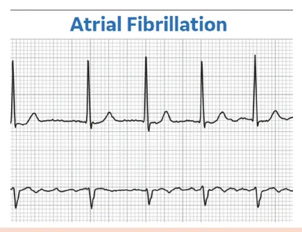
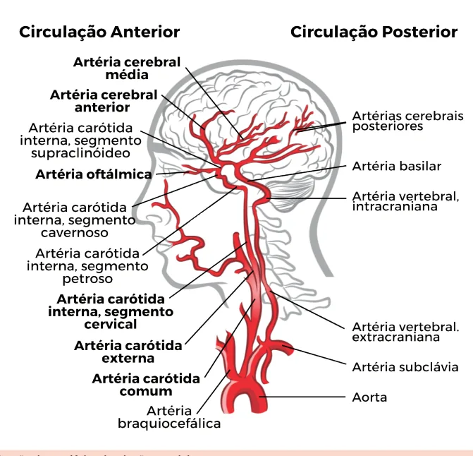

# Ataque Isquêmico Transitório (AIT)

<!-- page:1 -->

## Introdução

- Déficit transitório (geralmente **< 1 hora**) sem infarto detectado em neuroimagem (RM).
- **Etiologia**: aterosclerose de grandes vasos (aterotrombótica) e cardioembólica (mais comuns).

## Conceitos Iniciais

- "Déficit neurológico focal até 24 horas" — conceito antigo (1975).
- Episódio transitório de disfunção neurológica provocado por uma **isquemia focal do encéfalo e/ou retina**, com duração de sintomas tipicamente **< 1 hora**, na ausência de evidência de infarto agudo do encéfalo.
- **Diagnóstico definitivo** é feito pela **ressonância magnética de crânio** (para excluir infarto: sequência de difusão **[DWI]**).

## Quadro Clínico

- Igual ao AVC isquêmico — depende da localização. **Circulação anterior** é a mais frequente.

### Sinais e Sintomas

- Igual ao AVC isquêmico: depende da localização da isquemia focal (ver Tabela 1).
- Afasia, hemiparesia contralateral, ataxia, etc.; **déficit neurológico agudo**.

**Tabela 1: Manifestações clínicas do AVC isquêmico conforme a artéria acometida**

| Território Acometido | Manifestações Clínicas |
|---|---|
| **Artéria Cerebral Média** | Hemiparesia contralateral + hipoestesia tátil fasciobraquiocrural; afasia se hemisfério dominante. |
| **Artéria Cerebral Anterior** | Paresia com predomínio crural (distal > proximal) + déficit sensitivo. Abulia, mutismo, bradipsiquismo. |
| **Artéria Cerebral Posterior** | Hemianopsia homônima contralateral +/- ataxia. |
| **Vértebro-basilar** (artérias vertebrais + artéria basilar) | Ataxia + disartria + disfagia + assimetria pupilar + rebaixamento do nível de consciência + desvio do olhar conjugado. |
| **Artéria Oftálmica** | Amaurose fugaz. |

---

<!-- page:2 -->

Figura 2: Vascularização do encéfalo: circulação arterial.

## Diagnóstico e Estratificação

- **Déficit neurológico súbito** + **RM de encéfalo (DWI)** para confirmar (afastar AVC).
- **Tomografia** demora para detectar alteração no AVCi, mas é boa para afastar sangramento.

### Escore ABCD2

> ⚠️ Tabela reconstruída a partir de OCR — confira contra a fonte original.

**Tabela 2: Escore ABCD2**

| Critério | Pontuação |
|---|---|
| **A** – Age (idade ≥ 60 anos) | 1 |
| **B** – Blood pressure (PA sistólica ≥ 140 ou diastólica ≥ 90 mmHg) | 1 |
| **C** – Clinical symptoms (hemiparesia = 2; alteração da fala sem hemiparesia = 1) | 2 ou 1 |
| **D1** – Duration (≥ 60 minutos = 2; 10 a 59 minutos = 1) | 2 ou 1 |
| **D2** – Diabetes mellitus | 1 |

**Interpretação:**
- **0–3 pontos**: baixo risco de AVC (1%)
- **4–5 pontos**: risco moderado (4%)
- **6–7 pontos**: alto risco de AVC (8%)

- Escore ABCD2 → se **≥ 4 pontos**, internar e investigar o mecanismo!

### Critérios de Internação

- **ABCD2 ≥ 4**;
- AIT no último mês;
- Estenose de grande vaso (ex.: carótida interna) **≥ 50%**;
- História de arritmia cardíaca (FA) ou IAM recente.

### Investigação da Etiologia

**Estudo de vasos (mecanismo aterotrombótico)**
- Angiotomografia arterial de vasos cervicais e intracranianos **OU**
- Angiorressonância magnética arterial de vasos cervicais e intracranianos **OU**
- Ultrassom doppler de artérias carótidas e vertebrais + ultrassom doppler transcraniano.

**Investigação cardiológica (mecanismo cardioembólico)**
- Eletrocardiograma (ECG);
- Ecocardiograma transtorácico;
- Holter 24h.

## Tratamento

Figura 1: ECG com fibrilação atrial.

- **Etiologia aterosclerótica** (ABCD2 ≥ 4): **AAS 100mg/dia + Clopidogrel 75mg/dia por 21 dias**. Depois, suspender o clopidogrel.
- **Etiologia cardioembólica** (fibrilação atrial): **anticoagulação apenas** — iniciar 24 horas após o evento.

### Etiologia Aterotrombótica (Aterosclerose de Grandes Vasos) — ABCD2 ≥ 4

- **Dose de ataque** se AIT < 24 horas: **AAS 160-325mg + Clopidogrel 300-600mg**.
- **AAS 100mg/dia + Clopidogrel 75mg/dia por 21 dias (DAPT)**. Depois, suspender um deles e manter o outro (geralmente mantém AAS).
- Alternativa ao Clopidogrel (mutação do CYP2C19): **ticagrelor**.

---

<!-- page:3 -->

**AIT de baixo risco — ABCD2 < 4**
- **AAS 100mg/dia**, sem clopidogrel.

### Etiologia Cardioembólica

- **Anticoagulação plena** (heparina, DOAC ou varfarina);
- **NÃO** associar antiagregante plaquetário.

## Referências

Figura 1: Fibrilação atrial. GE Health Care. [s.d.]. Disponível em: https://www.gehealthcare.com/.
