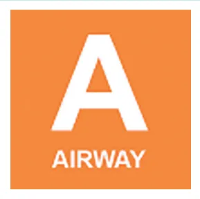

# ATLS - Letra A

<!-- page:1 -->

## TRAUMA: VIAS AÉREAS

Trauma VIA AÉREA DEFINITIVA = Tubo na traquéia + cuff insuflado abaixo das cordas vocais + sistema de ventilação.

- Tubo orotraqueal;

- Tubo nasotraqueal;

- Via cirúrgica (traqueostomia / cricotireoidostomia cirúrgica).

MANEJO DA VIA AÉREA Falta de oxigenação dos tecidos é a causa mais rápida de morte no doente traumatizado!

1º passo → Avaliar a via aérea + ofertar oxigênio:

- Paciente conversa e respira? Sim → prosseguir a avaliação para a letra B; Não → prosseguir 2º passo.

2º passo → Tentar desobstruir via aérea:

- Aspirar;

- Chin-Lift e Jaw-Thrust

- Via aérea desobstruída? Não → Via aérea definitiva; Sim → Prosseguir a avaliação para a letra

B e reavaliar;

- “Letra B” - Paciente ainda não ventila / respira? Trauma cranioencefálico ou torácico grave → Via aérea definitiva.

## VIA AÉREA DEFINITIVA

- Tubo na traqueia + cuff insuflado abaixo das cordas vocais + sistema de ventilação

- Opções de via aérea definitiva: Tubo orotraqueal; Tubo nasotraqueal; Via aérea cirúrgica.

- Medidas temporárias ou preparatórias: Oxigenação + imobilização; Utilização de equipamentos não definitivos (ex: Sempre separar material de via aérea difícil (Trauma

cânula de Guedel, tubo laríngeo, máscara laríngea); = via aérea difícil). Medidas temporárias ou preparatórias:

- Oxigenação ;

- Imobilização ;

- Equipamentos não definitivos;

- (Cânula de guedel, tubo laríngeo, máscara laríngea) ;

- *Via aérea difícil? → Sempre no trauma

(Separar material) . INDICAÇÕES DE VIA AÉREA DEFINITIVA

- Trauma maxilofacial;

- Queimadura de face e de via aérea → estridor, rouquidão, escarro carbonáceo, edema de língua, queimadura de vibrissas e sobrancelhas;

- Sangramento de via aérea e/ou do tubo digestivo incoercível;

- Lesões inalatórias;

- Apneia;

- Insuficiência respiratória;

- Rebaixamento do nível de consciência e agitação;

- Glasgow < ou igual a 8;

- Entre outras indicações para proteção de via aérea.

## INTUBAÇÃO OROTRAQUEAL

- Material sempre preparado;

- Sempre considerar via aérea difícil (trauma = via aérea difícil);

- Ventilador e material para aspiração prontos;

- Laringoscopia pela direita Laringoscópio reto ou curvo; Tamanho 3,5/ 4,0 / 4,5;

- Manobra de Sellick; Intubação bi-manual Tubo 7,5 / 8,0 / 8,5;

- Intubação orotraqueal = Inflar Cuff + confirmar com capnografia (padrão ouro).

Sequência Rápida (Assistida por drogas) Pré-medicação Pré-oxigenação Fentanil (0,06 ml/kg) 3 minutos Droga de indução Etomidato (0,3 mg/kg)

Paralisação Succinilcolina (1 a 2 mg/kg) Intubação orotraqueal a Figura 1: Fluxograma de Intubação orotraqueal por sequência rápida.

---

<!-- page:2 -->

- M: Mallampati. Visualização da hipofaringe

Sequência Atrasada

- O: Obstrução.

Dissociação Paralisação Dissociação Pré-oxigenação Paralisação

- Quetamina Succinicolina

3 minutos (1-2mg/kg EV lento) (1-2mg/kg EV lento) C

- Oxigenação apneica

Manter em próclive Cânula nasal 60s

- Intubação orotraqueal atrasada.

Figura 2:: Fluxograma de Intubação orotraqueal por sequência

- Intubação orotraqueal - sequência atrasada

- Permite melhor oxigenação e ventilação dos pacientes;

- Evita agitação;

- Evita risco de broncoaspiração por ventilação;

- Contraindicado em traumas de face e via aérea graves.

## DROGAS UTILIZADAS

- Pré-medicação: Lidocaína: pouco usado, bom em crianças. Atropina: pouco usado, evita a bradicardia. Fentanil: o mais usado, analgésico bom.

- Indução: Midazolam: Hipotensor e meia-vida, ação longa. Propofol: Hipotensor. Cetamina: Não causa hipotensão e tem efeito analgésico e amnésico. Etomidato: Menor efeito hipotensor, não pode ser usado contínuo.

- Bloqueador neuromuscular: Succinilcolina: De escolha, não usar em rabdomiólise ou hipercalemia. Rocurônio: Escolha quando contraindicação a succinilcolina.

## VIA AÉREA DIFÍCIL

Incapacidade de ventilar o paciente ou garantir via I aérea definitiva por intubação orotraqueal por um v profissional experiente:

- Preditores de via aérea difícil : LEMON

- L: Look Externally. Boca pequena, pescoço curto, obesidade

- E: Evaluate 3-3-2 rule. A Distância dentes = 03 dedos Distância hióide-mento = 03 dedos Distância tireóide-mandíbula = 02 dedos

- N: Mobilização do pescoço.

Como Manejar A Via Aérea Difícil?

- Intubação orotraqueal falhou:

- 1º → Chamar alguém mais experiente e tentar novamente;

- 2º → Materiais de via aérea difícil (Bougie);

- Após 3ª tentativa está indicado via aérea cirúrgica!

## VIA AÉREA CIRÚRGICA

- Indicações: Edema de glote; Trauma maxilofacial grave; Sangramento; Incapacidade de intubação (03 tentativas).

- Cricotireoidostomia por punção (não é via aérea definitiva): Jelco calibroso, tubo T, caneta BIC. Palpa-se a cartilagem cricóide e realiza-se a punção; Pode permanecer por 30 a 40 min. Se mais que isso o risco de hipercapnia é elevado.

- Cricotireoidostomia cirúrgica (melhor escolha quando a IOT não é possível): Escolha na urgência → rápida, fácil, efetiva; Pode ficar até 72h; Contra Indicação: < 12 anos.

- Traqueostomia: Reservado para alguns casos → demora mais, maiores riscos. Fazer apenas se muita necessidade; Trauma de via aérea / laringe; Realizada pelo cirurgião.

Obs: a cricotireoidostomia cirúrgica qualquer médico pode realizar, já a traqueostomia, pelo ATLS, apenas o cirurgião. Não é uma medida que pode ser tomada de maneira apressada, precisa de um ambiente mais controlado.

Intubação orotraqueal foi correta porém o paciente não ventila: DOPE

- D - deslocamento ou desconexão;

- O - Obstrução;

- P - Pneumotórax;

- E - Equipamento.

Atentar para IOT seletiva.
