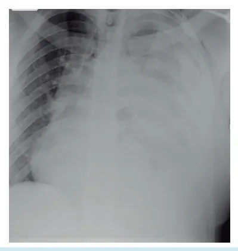
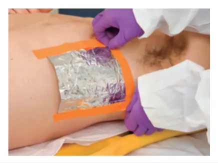
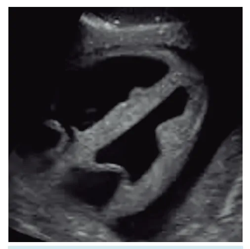

# ATLS - Letra B

<!-- page:1 -->

## Trauma de Tórax I

## Trauma de Tórax

> ⚠️ Tabela reconstruída a partir de OCR — confira contra a fonte original.

- **Mais comum** no politrauma;
- **25% das mortes** em politraumatizados;
- **80%** das lesões tratáveis com suporte, analgesia e drenagem;
- **15%** necessitam de toracotomia.

**Risco Iminente de Morte** (diagnóstico clínico, tratamento imediato):

1. Pneumotórax hipertensivo → drenagem de tórax;
2. Hemotórax maciço → drenagem/toracotomia;
3. Pneumotórax aberto → curativo em 3 pontas + drenagem;
4. Tamponamento cardíaco → toracotomia;
5. Lesão traqueobrônquica central → drenagem/toracotomia.

*Figura 1: Fluxograma das principais lesões torácicas com risco iminente de morte.*

**Risco Potencial de Morte** (podem ou não precisar de exames na avaliação secundária):

- Hemopneumotórax;
- Contusão pulmonar e tórax instável;
- Pneumomediastino;
- Ruptura de aorta / trauma cardíaco;
- Lesões traqueobrônquicas;
- Trauma de esôfago / quilotórax;
- Síndrome do esmagamento;
- Fraturas / enfisema de subcutâneo;
- Hérnia diafragmática.

*Figura 2: Principais lesões torácicas com seus potenciais riscos de morte.*

**Mortes Imediatas — Prevenção:**

- Ruptura de aorta;
- Contusão cardíaca;
- Lesões penetrantes graves.

---

<!-- page:2 -->

## Manejo Inicial do Trauma de Tórax

- **ABCDE**;
- Diagnóstico clínico;
- Identificar lesões com risco imediato de morte e tratar imediatamente!

Conduta no pneumotórax aberto: curativo em 3 pontas (conduta imediata) → ar sai mas não entra; drenagem de tórax → realizar assim que possível; avaliar necessidade de cirurgia após.

## Pneumotórax Hipertensivo

- Risco iminente de morte;
- Lesão pleuropulmonar → vazamento de ar unidirecional;
- Compressão de estruturas, desvio do mediastino;
- Comprometimento do retorno venoso;
- **Taquicardia, dispneia, dor torácica, insuficiência respiratória**;
- Desvio de traqueia, turgência de jugulares;
- MV abolidos, percussão timpânica;
- Choque obstrutivo → óbito;
- **Diagnóstico clínico** → tratamento imediato (na letra B);
- **Conduta**:
  - Punção de alívio e digitodescompressão — conduta de salvamento, temporária; realizar drenagem torácica após;
  - Drenagem de tórax em selo d'água — **tratamento definitivo**.

*Figura 3: Rx de tórax — pneumotórax hipertensivo à direita. Na imagem é possível ver pneumotórax no hemitórax direito e o mediastino desviado para a esquerda.*

## Pneumotórax Aberto

- Risco iminente de morte;
- Ferimento aberto na parede torácica;
- Diâmetro da lesão **> 2/3 da traqueia**;
- Entrada do ar pelo orifício;
- Falência respiratória: mecanismo semelhante ao hipertensivo;
- Avaliar necessidade de cirurgia após.

*Figura 4: Curativo de 3 pontas para pneumotórax aberto.*

## Hemotórax Maciço

- Risco iminente de morte;
- Sangue em grande quantidade no espaço pleural (**1500 ml**);
- Choque hipovolêmico e choque obstrutivo;
- Jugulares colabadas, percussão maciça, menos desvio;
- **Conduta**: drenagem torácica e transfusão sanguínea agressiva; autotransfusão / cell saver — se disponível.

> ⚠️ Tabela reconstruída a partir de OCR — confira contra a fonte original.

**Critérios para toracotomia de urgência:**

- 1500 ml imediatos;
- 200 ml/h em 2 a 4 horas;
- Necessidade contínua de transfusão de hemocomponentes;
- Choque hipovolêmico.

*Figura 5: Critérios para indicação de toracotomia de urgência.*

*Figura 6: Rx de tórax — derrame pleural (hemotórax) à esquerda. Na imagem é possível ver o hemitórax esquerdo velado por derrame pleural (sangue), o pulmão está apagado.*

---

<!-- page:3 -->

*Figura 7: Rx de tórax — atelectasia do pulmão esquerdo.* **Atentar para casos em que o enunciado descreve paciente com trauma grave em IOT e no Rx aparece imagem com pulmão não expandido (atelectasia) — IOT seletiva; checar a posição do tubo endotraqueal no início do ABCDE. É diferente da imagem de hemotórax maciço!**

## Lesões Traqueobrônquicas Centrais

- Risco iminente de morte;
- Lesões de **alta mortalidade** e raras;
- Mais frequentemente próximas à carina;
- **Manifestações clínicas**: cianose, hemoptise, enfisema de subcutâneo (frequente) e dispneia;
- Associadas a fraturas de costelas e pneumotórax;
- Pneumotórax persistente ou com alto débito;
- **Conduta**: drenagem de tórax → colocar 2 drenos → aspiração contínua;
  - Paciente **instável** após conduta imediata: intubação seletiva e intervenção cirúrgica de urgência;
  - Paciente **estável** após conduta imediata: TC multislice e broncoscopia → programar tratamento.

## Tamponamento Cardíaco

- Risco iminente de morte;
- **Tríade de Beck**: estase jugular; hipotensão; abafamento de bulhas — presente em apenas **30%** dos tamponamentos;
- Mecanismo: sangue no pericárdio → compressão → obstrução;
- **Trauma penetrante** é o mais comum (Quadrilátero de Ziegler ou Cardiac Box);
- Ferimentos nesta zona = alta suspeição para tamponamento;
- **FAST** = janela pericárdica → auxílio no diagnóstico;
- **Conduta**: toracotomia!

*Figura 8: Limites anatômicos do Quadrilátero de Ziegler ou Cardiac Box.*

**E a punção de Marfan?**

- Ponte para tratamento definitivo;
- Procedimento heroico.

**E a janela pericárdica subxifoídea?**

- Na dúvida diagnóstica;
- Indicação de cirurgia por outro motivo;
- Derrame pericárdico sem tamponamento.

*Figura 9: Ultrassom — janela pericárdica evidenciando derrame pericárdico.*

## Toracotomia de Reanimação

**Quando?**

- Parada cardíaca no trauma torácico;
- **1º** → intubação, RCP, acesso e reposição: não voltou ou já estava invadido?
- **2º** → descompressão torácica digital bilateral: não voltou?
- **3º** → toracotomia de reanimação.

**O que é?**

- Toracotomia anterolateral esquerda feita na sala de emergência em um paciente vítima de trauma torácico que apresenta parada cardiorrespiratória;
- Diferente da toracotomia de urgência.

---

<!-- page:4 -->

> ⚠️ Tabela reconstruída a partir de OCR — confira contra a fonte original.

**Quando fazer?**

- **Nível IA** — é para fazer!
  - Ferimento torácico penetrante, paciente com sinais de vida.
- **Recomendação parcial**:
  - Ferimento torácico penetrante, paciente sem sinais de vida;
  - OU ferimento extratorácico penetrante, paciente com sinais de vida.
- **Recomendação discutível**:
  - Ferimento torácico contuso, paciente com sinais de vida;
  - OU ferimento extratorácico penetrante, paciente sem sinais de vida.

**Como fazer?**

- Na sala de emergência;
- Paramentação estéril;
- Incisão anterolateral esquerda seguindo o **4º EIC**, divulsão por planos e abertura da caixa torácica;
- Abertura do pericárdio (coração), twist pulmonar (pulmão), clampeamento da aorta descendente (abdominal);
- Massagem cardíaca intratorácica (PCR) e revisão da hemostasia (parede).

## Referências

Figura 3: Rx tórax - Pneumotórax hipertensivo à direita. Fonte: adaptado de Radiopaedia.com

Figura 4: Curativo de 3 pontas para pneumotórax aberto. Fonte: adaptado de ATLS, Advanced Trauma Life Support. 10ª Ed, 2018. Rio de Janeiro: Elsevier, 2019.

Figura 6: Rx de Tórax - Derrame pleural (Hemotórax) à esquerda. Fonte: adaptado de Case courtesy of Dr Henry Knipe, Radiopaedia.org, rID: 47300

Figura 7: Rx de Tórax - Atelectasia do pulmão esquerdo. Fonte: Radiopaedia.com

Figura 9: Ultrassom - Janela pericárdica evidenciando derrame pericárdico. Fonte: Radiopaedia.com
