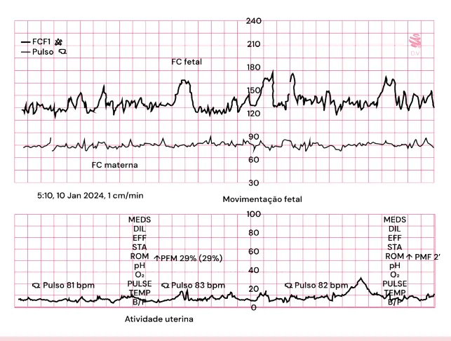
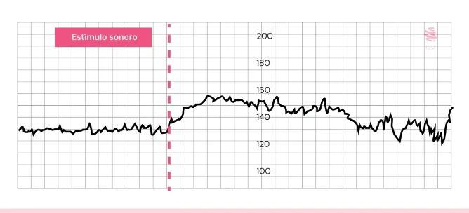
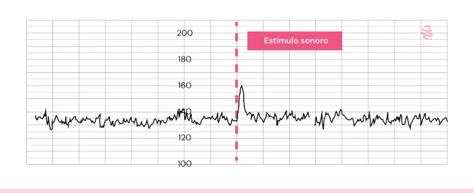
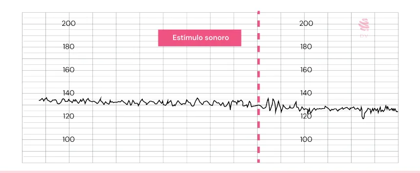

# Avaliação da Vitalidade Fetal

<!-- page:1 -->

## Avaliação de Vitalidade Fetal

Tem por objetivo **proteger o feto dos potenciais efeitos da hipoxemia** (aguda ou crônica) no decorrer da gestação.

### Indicações

**Morbidades prévias:**

- Síndromes hipertensivas;
- Diabetes mellitus tipos 1 e 2;
- Lúpus eritematoso sistêmico;
- Síndrome antifosfolípide;
- Tireoidopatias;
- Hemoglobinopatias;
- Cardiopatias;
- Pneumopatias;
- Neoplasias.

**Morbidades gestacionais:**

- Síndromes hipertensivas;
- Diabetes mellitus gestacional;
- Restrição do crescimento fetal;
- Malformações fetais;
- Aloimunização;
- Colestase gravídica;
- Gestação prolongada;
- Ruptura prematura de membranas ovulares.

### Como Avaliar

- Cardiotocografia anteparto;
- Perfil biofísico fetal;
- Perfil hemodinâmico fetal;
- **Mobilograma** (Ministério da Saúde, 2022): esperam-se **10 movimentos em menos de 1h**. A avaliação da movimentação fetal em todas as gestações não tem suporte científico e não reduz o risco de óbito fetal.

### Bem-estar Fetal — Cardiotocografia (CTB)

**Componentes:**

- Frequência cardíaca fetal (FCF);
- Frequência cardíaca materna;
- Movimentação fetal;
- Atividade uterina.

**Parâmetros:**

- **Linha de base**: 110-160 bpm;
- **Variabilidade**: 6 a 25 bpm;
- **Acelerações transitórias (AT)**: melhor parâmetro!
- **Desacelerações**: ausentes.

**Interpretação e conduta na CTB:**

- **Reativa** (2 ou mais acelerações transitórias): sem medida adicional.
- **Não reativa** (≤ 1 aceleração transitória):
  - Prolongar traçado;
  - Estímulo externo: glicose, manual, sonoro;
  - Realizar perfil biofísico fetal +/- doppler.

**Perfil biofísico fetal (0-10):**

- **Agudo**: cardiotocografia; movimentos respiratórios; movimentos corpóreos; tônus.
- **Crônico**: líquido amniótico.

*Figura 1: Componentes da cardiotocografia.*

---

<!-- page:2 -->

## Cardiotocografia Anteparto

### Parâmetros

- **Linha de base (FC basal)** → traçado mínimo de 10 minutos, onde está a maioria dos batimentos fetais:
  - Normal: **110 a 160 bpm**;
  - Taquicardia: **> 160 bpm**;
  - Bradicardia: **< 110 bpm**.
- **Variabilidade** → oscilações da FCF em relação à linha de base:
  - Ausente ou indetectável ("assistolia");
  - Mínima: **< 5 bpm**;
  - Moderada: **6 a 25 bpm** (normal);
  - Aumentada: **> 25 bpm**;
  - Padrão sinusoidal ("flutter"): ondas rítmicas e regulares com amplitude de 5 a 15 bpm.
- **Acelerações transitórias** → aumento da FCF em relação à linha de base — **melhor marcador de bem-estar fetal!**
  - IG < 32 semanas: aumento súbito de 10 bpm em 10 segundos;
  - IG ≥ 32 semanas: aumento súbito de 15 bpm em 15 segundos.
- **Desacelerações**: queda da FCF em relação à linha de base.

### Interpretação e Conduta pelo Ministério da Saúde

- **Reativa**: 2 ou mais acelerações em até 40 minutos → sem medida adicional.
- **Não reativa**: < 2 acelerações em até 40 minutos → manter observação; realizar estímulo externo (glicose, estímulo manual, estímulo sonoro).
- Após estímulo sonoro:
  - **Reativo**: aumento da FCF > 20 bpm por ≥ 3 minutos (Figura 2);
  - **Hiporreativo**: aumento da FCF < 20 bpm ou < 3 minutos (Figura 3);
  - **Não reativo**: sem mudança na FCF (Figura 4, próxima página).

*Figura 2: Feto reativo, após estímulo sonoro.*

*Figura 3: Feto hiporreativo, após estímulo sonoro.*

### Interpretação e Conduta pela USP-SP

> ⚠️ Tabela reconstruída a partir de OCR — confira contra a fonte original.

**Tabela 1: Índice Cardiotocométrico modificado**

| Parâmetro | Normal | Pontuação |
|---|---|---|
| Linha de base | 110 a 160 bpm | 1 ponto |
| Variabilidade | 6-25 bpm | 1 ponto |
| Acelerações transitórias | 1 ou + | 2 pontos |
| Desacelerações | Nenhuma | 1 ponto |

*Tabela adaptada de Zugaib e Behle.*

**Tabela 2: Interpretação e conduta da cardiotocografia com base em sua pontuação**

| Pontuação | Interpretação | Conduta |
|---|---|---|
| 4 ou 5 pontos | Ativo | Expectante |
| 2 ou 3 pontos | Hipoativo | Estímulo sonoro |
| 0 ou 1 ponto | Inativo | Estímulo sonoro |

*Tabela adaptada de Zugaib et al.*

---

<!-- page:3 -->

*Figura 4: Feto inativo, após estímulo sonoro.*

## Perfil Biofísico Fetal

### Parâmetros

- **Agudos**: cardiotocografia; movimentos respiratórios; movimentos fetais; tônus fetal.
- **Crônico**: líquido amniótico (2 pontos).

> ⚠️ Tabela reconstruída a partir de OCR — confira contra a fonte original.

**Tabela 3: Critérios de normalidade do Perfil Biofísico Fetal**

| Parâmetro | Normal (2 pontos) |
|---|---|
| Cardiotocografia | 2 acelerações transitórias (feto reativo) |
| Movimentos respiratórios | 1 ou + movimentos por 30 segundos em 30 minutos |
| Movimentos corporais | 3 ou + movimentos corporais ou de membros em 30 minutos |
| Tônus fetal | 1 ou + movimentos de flexão/extensão de extremidades, abertura/fechamento das mãos |

**Teoria da hipóxia gradual:** na vigência de sofrimento fetal agudo, a ordem de perda dos parâmetros é inversa à ordem de surgimento durante o desenvolvimento fetal (Cardiotocografia > Mov. Resp. > Mov. Corp. > Tônus).

### Interpretação

> ⚠️ Tabela reconstruída a partir de OCR — confira contra a fonte original.

**Tabela 4: Interpretação e Conduta conforme Perfil Biofísico Fetal**

| Pontuação do PBF (0-10) | Interpretação | Conduta |
|---|---|---|
| 10/10 ou 8/10 com líquido normal | Baixo risco de hipoxemia aguda | Expectante |
| 8/8 (sem cardiotocografia) | Baixo risco de hipoxemia aguda e crônica | Expectante se malformações fetais ou etiologia transitória |
| 8/10 com oligoâmnio | Provável hipoxemia fetal crônica | Parto se: idade gestacional ≥ 37 sem (sempre), ≥ 34 sem (oligoâmnio grave), restrição de crescimento e/ou insuficiência placentária |
| 6/10 com líquido normal | Possível hipoxemia fetal aguda ou resultado falso positivo | Reavaliar em 6 a 12h; se estável ou piora = parto |
| 6/10 com oligoâmnio | Provável hipoxemia fetal aguda e crônica | Parto |
| 4/10 | Alta probabilidade de asfixia fetal | Parto na viabilidade |
| 2/10 ou 0/10 | Asfixia fetal | Parto |

## Referências

Figura 1: Componentes da cardiotocografia. Arquivo pessoal.

Figura 2: Feto reativo, após estímulo sonoro. Arquivo pessoal.

Figura 3: Feto hiporreativo, após estímulo sonoro. Arquivo Medcof.

Figura 4: Feto inativo, após estímulo sonoro. Arquivo Medcof.

