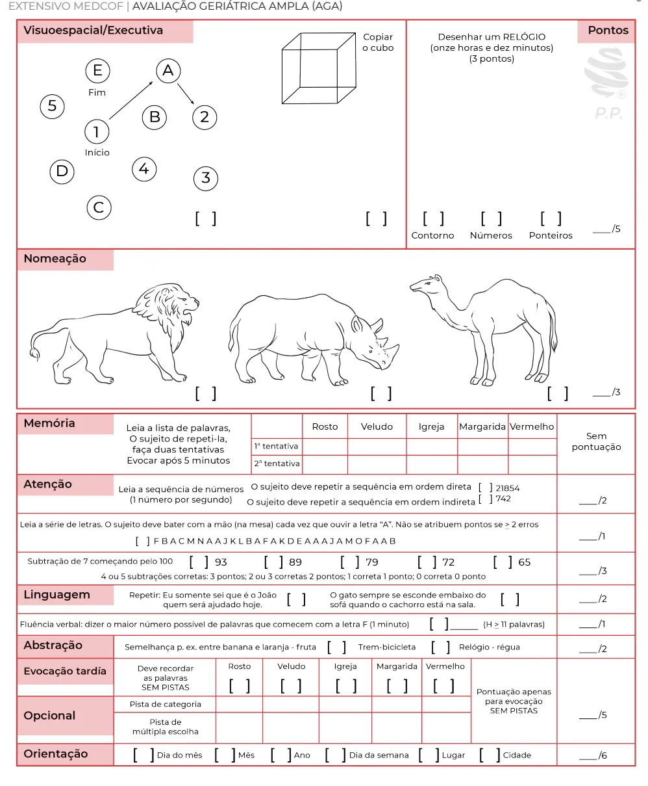
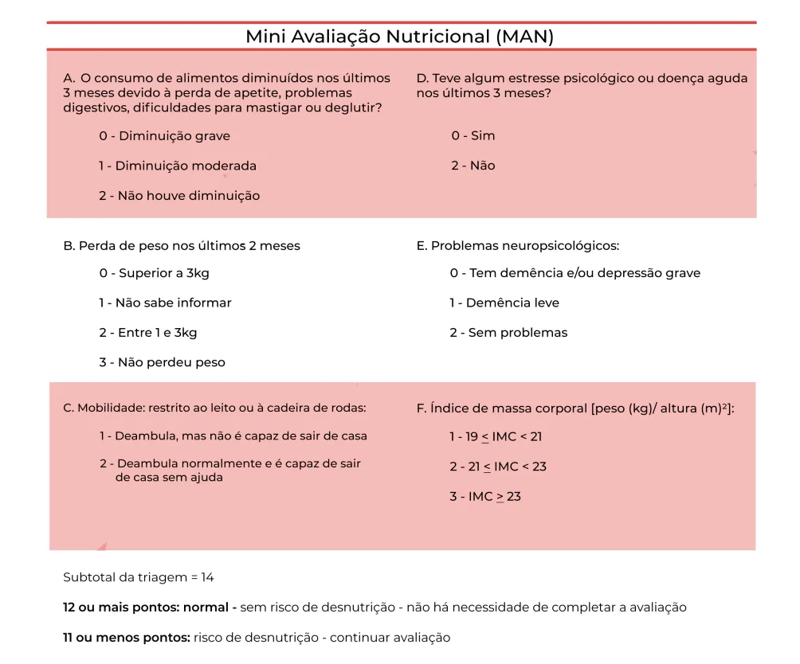

# Avaliação Geriátrica Ampla

<!-- page:1 -->

## Avaliação Geriátrica Ampla (AGA)

Escalas Geriátricas, Avaliação Global, Fragilidade e Iatrogenias (CM).

- É uma **avaliação multidimensional** (domínios físico, mental, social, funcional e ambiental);
- Se diferencia das demais avaliações clínicas pelo uso de escalas e testes que podem facilitar a comunicação interdisciplinar e a avaliação da evolução do paciente.

**Principais componentes:**

- **Funcionalidade**
  - Atividade básica de vida diária (**ABVD**): escala de Katz.
  - Atividade instrumental de vida diária (**AIVD**): escala de Lawton e Pfeffer.
  - Capacidade intrínseca: vitalidade, capacidade visual, auditiva, cognitiva, psicológica e locomotora.
- **Cognição**
  - **MEEM**: mais utilizado (atentar para o nível de escolaridade).
  - **MOCA**: mais complexo, utilizar para pacientes com maior escolaridade.
  - Teste do relógio: avalia também a função executiva.
- **Medicações**
  - Recordatório completo.
  - Critérios de Beers.
- **Humor**
  - Escala de Depressão Geriátrica (**GDS**): teste de triagem, confirmar depressão pelos critérios do DSM.

## Definição

- É um processo diagnóstico multidimensional:
  - Domínio físico (médico);
  - Domínio mental;
  - Domínio social;
  - Domínio funcional;
  - Domínio ambiental.
- Se diferencia das demais avaliações clínicas pelo uso de escalas e testes que podem facilitar a comunicação interdisciplinar e a avaliação da evolução do paciente.

## Objetivos

- Determinar deficiências, incapacidades e desvantagens do idoso;
- Identificar riscos de declínio funcional;
- Identificar riscos nutricionais;
- Identificar riscos sociais;
- Prediz desfechos desfavoráveis e individualiza o estado do paciente;
- Estima reserva funcional e expectativa de vida;
- Diminui eventos adversos;
- Favorece planejamento do cuidado de longo prazo e estratégias de saúde pública.

**Domínios avaliados incluem, entre outros:**

- Circunstâncias da queda: hipotensão ortostática, síncope;
- Continências;
- Déficits sensoriais:
  - Déficit auditivo: triagem com o teste do sussurro;
  - Déficit visual: tabela de Snellen;
- Alimentação / estado nutricional:
  - Mini Avaliação Nutricional (MAN);
  - IMC (valores diferentes para a população geral): **baixo peso ≤ 22 kg/m²**; **eutrofia 22 a 27 kg/m²**; **obesidade ≥ 27 kg/m²**;
- Atividade física;
- Sono;
- Lazer;
- Sexualidade;
- Exposição solar;
- Vacinação;
- Exames de rastreio: colonoscopia, mamografia, densitometria óssea, exame citopatológico do colo do útero (teste DNA-HPV).

## Vantagens

- Existem diversos benefícios com a realização da AGA em diferentes contextos.
- Verificar Tabela 1.

> ⚠️ Tabela reconstruída a partir de OCR — confira contra a fonte original.

**Tabela 1: Benefícios da AGA em diferentes cenários**

| Cenário | Benefícios |
|---|---|
| Hospitalar | ↓ Tempo de internação; ↓ Mortalidade; ↓ Readmissão |
| Domiciliar | ↑ Funcionalidade; ↓ Institucionalização; ↓ Quedas |
| Ambulatorial | ↑ Funcionalidade; ↑ Adesão; ↓ Gastos |

---

<!-- page:2 -->

## Componentes

- Por se tratar de uma avaliação com grandes detalhes, separaremos os domínios nela inseridos (citados acima) em alguns componentes com suas respectivas subavaliações e escalas:
  - Funcionalidade;
  - Cognição;
  - Medicações;
  - Humor;
  - Quedas;
  - Continências;
  - Déficits sensoriais;
  - Alimentação / estado nutricional;
  - Atividade física;
  - Sono;
  - Lazer.

### Funcionalidade

Divididos basicamente entre funcionalidade básica e instrumental.

- **Escala de Katz**: avalia atividades **básicas** de vida diária (ABVD);
- **Escala de Lawton**: avalia atividades **instrumentais** de vida diária (AIVD);
- **Escala de Pfeffer**: avalia atividades instrumentais de vida diária (AIVD);
  - Menos utilizada.

**Capacidade intrínseca**

- Conceito mais recente (OMS, 2020), que tenta resumir a funcionalidade (e toda a AGA) em 5 domínios:
  - Vitalidade;
  - Capacidade visual;
  - Capacidade auditiva;
  - Capacidade cognitiva;
  - Capacidade psicológica;
  - Capacidade locomotora.

**Escala de Katz**

- Avalia atividades básicas de vida diária (ABVD);
- Domínios: banho (1 ponto), vestimenta (1 ponto), higiene pessoal (1 ponto), transferência (1 ponto), continência (1 ponto), alimentação (1 ponto);
- Pontuação total:
  - **6**: totalmente independente;
  - **4**: dependência parcial;
  - **2**: dependência importante;
  - **9**: totalmente dependente.
- Verificar Tabela 2.

> ⚠️ Tabela reconstruída a partir de OCR — confira contra a fonte original.

**Tabela 2: Escala de Katz**

| Atividade | Critério | Sim | Não |
|---|---|---|---|
| Banho | Sem ajuda ou para apenas uma parte do corpo | ( ) | ( ) |
| Vestir | Sem ajuda ou apenas para amarrar o sapato | ( ) | ( ) |
| Higiene pessoal | Arruma-se | ( ) | ( ) |
| Transferência | Sai da cama ou da cadeira | ( ) | ( ) |
| Continência | Controla a micção ou evacuação | ( ) | ( ) |
| Alimentação | Sem ajuda ou apenas para cortar a carne | ( ) | ( ) |

**Escala de Lawton**

- Avalia atividades instrumentais de vida diária (AIVD);
- 9 perguntas, cada uma pontuando até 3 pontos;
- Verificar Tabela 3 na próxima página.

**Escala de Pfeffer**

- Avalia atividades instrumentais de vida diária (AIVD);
- Menos utilizada;
- Verificar Tabela 4.

### Cognição

Além das queixas subjetivas do paciente e também do acompanhante, temos alguns testes objetivos:

- Mini Exame do Estado Mental (**MEEM** ou Mini-mental);
- Montreal Cognitive Assessment (**MoCA**);
- Teste do relógio.

**Mini Exame do Estado Mental (MEEM)**

- Orientação temporal (5 pontos);
- Orientação espacial (5 pontos);
- Memória imediata (3 pontos);
- Atenção e cálculo (5 pontos);
- Memória de evocação (3 pontos);
- Linguagem (2 + 1 + 3 + 1 + 1 + 1 pontos);
- Interpretação do teste (Herrera et al., 2002):
  - Analfabetos: **< 19**;
  - 1 – 3 anos de escolaridade: **< 23**;
  - 4 – 7 anos: **< 24**;
  - **> 7 anos**: **< 28**.

---

<!-- page:3 -->

> ⚠️ Tabela reconstruída a partir de OCR — confira contra a fonte original.

**Tabela 3: Escala de Lawton**

| Atividade | Avaliação |
|---|---|
| O(a) Sr(a) consegue usar o telefone? | Sem ajuda (3) / Com ajuda parcial (2) / Não consegue (1) |
| O(a) Sr(a) consegue ir a locais distantes, usando algum transporte, sem necessidade de planejamentos especiais? | Sem ajuda (3) / Com ajuda parcial (2) / Não consegue (1) |
| O(a) Sr(a) consegue fazer compras? | Sem ajuda (3) / Com ajuda parcial (2) / Não consegue (1) |
| O(a) Sr(a) consegue preparar suas próprias refeições? | Sem ajuda (3) / Com ajuda parcial (2) / Não consegue (1) |
| O(a) Sr(a) consegue arrumar a casa? | Sem ajuda (3) / Com ajuda parcial (2) / Não consegue (1) |
| O(a) Sr(a) consegue fazer trabalhos manuais domésticos, como pequenos reparos? | Sem ajuda (3) / Com ajuda parcial (2) / Não consegue (1) |
| O(a) Sr(a) consegue lavar e passar sua roupa? | Sem ajuda (3) / Com ajuda parcial (2) / Não consegue (1) |
| O(a) Sr(a) consegue tomar seus remédios na dose e horários corretos? | Sem ajuda (3) / Com ajuda parcial (2) / Não consegue (1) |
| O(a) Sr(a) consegue cuidar de suas finanças? | Sem ajuda (3) / Com ajuda parcial (2) / Não consegue (1) |

---

<!-- page:4 -->

> ⚠️ Tabela reconstruída a partir de OCR — confira contra a fonte original.

**Tabela 4: Mini Exame do Estado Mental (MEEM)**

| Domínio | Item | Pontos |
|---|---|---|
| Orientação temporal | Ano, mês, dia do mês, dia da semana, hora | 5 pontos |
| Orientação espacial | Local específico, local genérico, bairro ou rua próxima, cidade, estado | 5 pontos |
| Memória imediata | Nomear 3 objetos e pedir para o paciente repetir ("carro, vaso, tijolo"); se ele não conseguir, ensinar até o máximo de 6 vezes | 3 pontos |
| Atenção e cálculo | Pedir para o paciente diminuir 7 sucessivas vezes de 100 (5 vezes); alternativa: soletrar a palavra "mundo" na ordem inversa | 5 pontos |
| Memória de evocação | Repetir os 3 objetos nomeados antes | 3 pontos |
| Linguagem | Mostrar um relógio e uma caneta e pedir para nomear (2 pontos); pedir para repetir "nem aqui, nem ali, nem lá" (1 ponto); seguir o comando de 3 estágios: "pegue este papel com a mão direita, dobre-o ao meio e coloque-o no chão" (3 pontos); ler e executar a ordem "feche os olhos" (1 ponto); escrever uma frase (1 ponto); copiar o desenho (1 ponto) | 9 pontos |

**Montreal Cognitive Assessment (MoCA)**

- É um teste mais complexo e com uma avaliação mais abrangente;
- É reservado aos pacientes com escolaridade mais alta, ou àqueles com efeito de aprendizagem (por exemplo, já realizou muitas vezes o minimental ao longo dos anos);
- Verificar Figura 1 na próxima página.

**Teste do relógio (TDR)**

- É solicitado ao paciente que desenhe o relógio completamente;
- Avalia a função executiva (demências vasculares e subcorticais);
- Escolher um horário com ponteiros em quadrantes diferentes.

**Tabela 5: Teste do relógio (TDR)**

**Avaliação: 10 a 6 — Desenho do relógio e números corretos**

- 10. Ponteiros estão na posição correta;
- 9. Leve distúrbio nos ponteiros;
- 8. Distúrbios mais intensos nos ponteiros;
- 7. Ponteiros completamente errados;
- 6. Uso inapropriado dos ponteiros (uso de mostrador digital ou circulando números, apesar de repetidas instruções).

**Avaliação: 5 a 1 — Desenho do relógio e números incorretos**

- 5. Números em ordem inversa ou concentrados em alguma parte do relógio; ponteiros presentes de alguma forma;
- 4. Distorção de sequência numérica, números faltando ou colocados fora dos limites do relógio;
- 3. Números e mostrador não correlacionados; ausência de ponteiros;
- 2. Alguma evidência de ter entendido as instruções, mas o desenho apresenta vaga semelhança com um relógio;
- 1. Não tentou ou não conseguiu representar um relógio.

---

<!-- page:5 -->

**Figura 1: Montreal Cognitive Assessment (MoCA)**

### Medicações

- Montar recordatório específico, com todas as medicações em uso;
- Avaliar dose de acordo com função renal;
- Critérios de Beers.

### Humor

**Escala de Depressão Geriátrica (GDS)**

- Também conhecido como teste de Yesavage;
- 15 perguntas para identificar transtorno depressivo (TDM) no idoso;
- **> 5**, ou seja, 6 pontos ou mais, é considerado positivo;
- Importante diagnóstico diferencial para as síndromes demenciais;
- **ATENÇÃO**: é uma escala de triagem (rastreio); a confirmação do TDM deve ser feita a partir dos critérios do DSM-V.

---

<!-- page:6 -->

> ⚠️ Tabela reconstruída a partir de OCR — confira contra a fonte original.

**Tabela 6: Escala de Depressão Geriátrica (GDS)**

| Nº | Pergunta | Sim | Não |
|---|---|---|---|
| 1 | Você está basicamente satisfeito com sua vida? | 0 | 1 |
| 2 | Você deixou muitos de seus interesses e atividades? | 1 | 0 |
| 3 | Você sente que sua vida está vazia? | 1 | 0 |
| 4 | Você se aborrece com frequência? | 1 | 0 |
| 5 | Você se sente de bom humor a maior parte do tempo? | 0 | 1 |
| 6 | Você tem medo que algum mal vá lhe acontecer? | 1 | 0 |
| 7 | Você se sente feliz a maior parte do tempo? | 0 | 1 |
| 8 | Você sente que sua situação não tem saída? | 1 | 0 |
| 9 | Você prefere ficar em casa a sair e fazer coisas novas? | 1 | 0 |
| 10 | Você se sente com mais problemas de memória do que a maioria? | 1 | 0 |
| 11 | Você acha maravilhoso estar vivo? | 0 | 1 |
| 12 | Você se sente um inútil nas atuais circunstâncias? | 1 | 0 |
| 13 | Você se sente cheio de energia? | 0 | 1 |
| 14 | Você acha que sua situação é sem esperanças? | 1 | 0 |
| 15 | Você sente que a maioria das pessoas está melhor do que você? | 1 | 0 |
| | **Total** | | |

## Quedas

- Importante causa de aumento de morbimortalidade no idoso;
- Identificar as circunstâncias da queda:
  - Houve síncope?
  - Há presença de hipotensão ortostática?
  - Checar os medicamentos desencadeantes;
  - Há questões ambientais envolvidas? (chinelos, deficiência sensorial, etc.)

## Continências

- Avaliar presença de incontinência urinária e fecal;
- Secundário ao uso de medicações?
- Presença de múltiplos partos?
- Quadro demencial avançado?

## Déficits Sensoriais

- Baixa acuidade auditiva e visual são potenciais fatores para demência.

**Déficit auditivo**

- Teste do sussurro (teste de triagem): escolhe-se 3 números ou 3 letras e pede-se para o paciente ocluir o ouvido não testado (testa-se cada um isoladamente);
- Se o paciente apresentar mais de 50% de erros, o teste é considerado positivo;
- Se alterado: audiometria (confirmação) e avaliação com otorrinolaringologista.

**Déficit visual**

- Tabela de Snellen;
- Normalidade considerada até uma visão 20/20 ou 20/40.

> ⚠️ Tabela reconstruída a partir de OCR — confira contra a fonte original.

**Figura 2: Tabela de Snellen** — linhas de acuidade decrescente, de "visão normal (1,0)" até "baixa visão severa (0,1)", conforme material original.

## Alimentação / Estado Nutricional

- Importante preditor de quedas e também morbimortalidade;
- Mini Avaliação Nutricional (MAN);
- Verificar Figura 3 na próxima página.

---

<!-- page:7 -->

**Figura 3: Mini Avaliação Nutricional (MAN)**

**ATENÇÃO**: os cortes de IMC para os idosos são diferentes!

**Índice de Massa Corpórea (IMC)**

- **Baixo peso ≤ 22 kg/m²**;
- **Eutrofia → 22 a 27 kg/m²**;
- **Obesidade ≥ 27 kg/m²**.

## Atividade Física

- Há prática de atividade física?
- É adequada à idade?
- É adaptada às comorbidades?
- É preciso indicar atividades de baixo impacto?

## Sono

- Há insônia?
- Qual a latência do sono?
- Existem vários despertares noturnos?
- Higiene do sono!

## Lazer

- Existem atividades de lazer?
- Quais os estímulos cognitivos no dia a dia?
- Quais são suas predileções? E como se pode enriquecer tal rotina?

## Sexualidade

- Atenção para as queixas veladas (considerado tabu).

## Exposição Solar

- Cuidado com a deficiência de vitamina D (especialmente pelo risco de osteoporose na população idosa);
- Fototipos para câncer de pele?

## Vacinação

- Os idosos apresentam imunosenescência, sendo mais propensos à ocorrência de doenças;
- Ainda, as vacinas tendem a não manter a eficácia usual.

---

<!-- page:8 -->

## Exames de Rastreio

- Baseado em toda avaliação prévia, o status e a *performance* do meu paciente, posso avaliar quais rastreios indicar.

**Colonoscopia**

- Rastreio de câncer colorretal;
- US Preventive Services Task Force (US-Task Force): deve ser feito dos 45 até 75 anos;
  - Sangue oculto nas fezes anual OU;
  - Colonoscopia a cada 10 anos OU;
  - Sigmoidoscopia flexível a cada 5 anos OU;
  - Colonoscopia virtual a cada 5 anos.
- Homens > 70 anos (Sociedades Brasileiras): não está recomendada pela US-Task Force.

**Mamografia**

- Rastreio de câncer de mama;
- Ministério da Saúde: bianual dos 40 até os 74 anos;
- US-Task Force: 40 a 74 anos;
- Tratado de Geriatria e Gerontologia (4ª edição): expectativa de vida > 10 anos.

**Densitometria óssea**

- Rastreio de osteoporose;
- Indicado para mulheres com 65 anos ou mais, desde que não haja outros fatores de risco evidentes;
  - Histórico de fratura prévia;
  - Uso de glicocorticoides em dose ≥ 5 mg/dia de prednisona ou equivalente, por 3 meses ou mais;
  - Artrite reumatoide;
  - História de hipogonadismo.
- Tratado de Geriatria e Gerontologia (4ª edição): deve ser feito dos 50 a 85 anos, ou se possui > 10 anos de sobrevida estimada;
- Deve ser repetido a cada 1,5 – 2 anos.

**Exame citopatológico do colo uterino**

- Rastreio de câncer de colo de útero;
- Se o paciente mantiver vida sexual ativa, pelo menos a cada 3 anos, até que se complete 64 anos de idade;
- **ATENÇÃO**: em março de 2024 foi publicada uma nota do Ministério da Saúde indicando o melhor rastreio através do teste **DNA-HPV**, devendo ser repetido a cada 5 anos.
