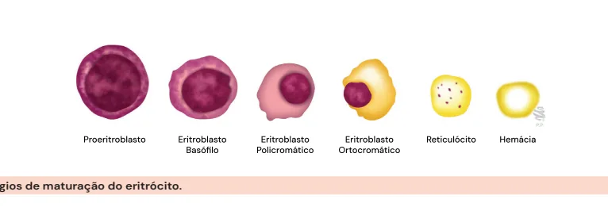
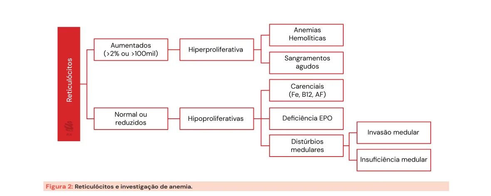
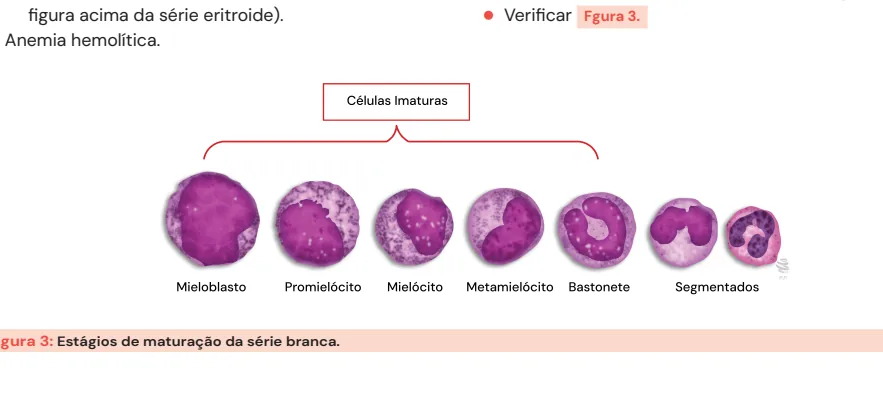

# Avaliação Global do Hemograma

<!-- page:1 -->

> ⚠️ Este material tinha layout de duas colunas no PDF original — os fragmentos foram reordenados pelo contexto; confira contra a fonte em caso de dúvida.

## Eritrograma

- Hb | Ht | VCM | HCM | CHCM | RDW.
- Não se esqueça de pedir reticulócitos na avaliação de anemias.
  - Reticulócitos aumentados: anemia hiperproliferativa.
  - Reticulócitos diminuídos: anemia hipoproliferativa.

## Definição

- Exame simples e barato.
- Na sua versão completa (hemograma completo), avalia três séries: vermelha (eritrograma); branca (leucograma); plaquetária (plaquetograma).
- "É o exame físico do hematologista."

## Eritrograma

### Tabela 1: Valores de referência para o eritrograma

| Parâmetro | Valor de referência |
|---|---|
| Eritrócitos | 3,9 - 5,0 milhões |
| Hb | Mulher: 12 - 15 g/dL. Homem: 13 - 16,5 g/dL |
| Ht | 36 - 46% |
| VCM | 80 - 99 fL |
| HCM | 27 - 32 pg |
| CHCM | 31 - 36 g/dL |
| RDW | 12 - 15% |

- **Eritrócitos (E)**: número de hemácias por mL.
- **Hemoglobina (Hb)**: quantidade de Hb dentro da hemácia; a mulher geralmente tem 1 ponto a menos que o homem.
- **Hematócrito (Ht)**: volume da massa eritrocitária; Ht = VCM × E; geralmente 3x o valor da hemoglobina.
- **VCM**: indica o "tamanho" da hemácia; VCM = Ht/E.
- **HCM**: representa o "peso" da hemácia; HCM = Hb/E.
- **CHCM**: concentração de hemoglobina dentro da hemácia.
- **RDW** (Red Cell Distribution Width): indica a variação entre as hemácias; também denominado índice de anisocitose.

*Figura 1: Estágios de maturação do eritrócito.*

## Leucograma

- Valor normal: 4.000 - 10.000/mm³.
- **Desvio à esquerda**: presença de células imaturas no sangue periférico (reação leucemoide).

## Plaquetograma

- Plaquetas: 150.000 - 450.000/mm³.
- **Tubo convencional para coleta do hemograma**: EDTA (roxo).
- Suspeita de pseudoplaquetopenia → repetir com tubo de citrato (azul).

## Eritropoese

- O processo dura em torno de 7 dias e é regulado primariamente pela eritropoetina (EPO). Quanto mais a linhagem se desenvolve, a série eritroide vai diminuindo de tamanho, assim como o núcleo das células.
- A hemácia normal dura cerca de 120 dias. Conforme a hemácia "envelhece", ela demonstra marcadores em sua membrana, sendo fagocitada no baço — processo denominado hemocaterese.
- A produção pode ser alterada por:
  - **Necessidade**: ex. sangramentos levam à estimulação da produção de hemácias.
  - **Quantidade de substrato**: ex. ausência de ferro prejudica a produção.
- Verificar Figura 1.

## Reticulócitos

- Eritrócitos que acabaram de perder o núcleo; duram cerca de 40 horas.
- Fundamentais na investigação de anemias.

---

<!-- page:2 -->

*Figura 2: Reticulócitos e investigação de anemia.*

## Correção dos reticulócitos

- Corrigir quando há anemia e o valor foi dado em valor relativo (%).
- Há duas formas de fazer a correção:
  - Índice Reticulocitário Corrigido (IRC) = % reticulócitos × Ht/40.
  - Índice Reticulocitário Corrigido (IRC) = % reticulócitos × Hb/15.
- Quando o valor é dado em número absoluto, não é necessária correção.

## Macrocitose (VCM > 100 fL) — causas por mecanismo

- Geralmente explicada por eritropoese ineficaz, podendo ter diversos mecanismos e etiologias.

**Alterações relacionadas ao metabolismo do DNA:**

- Deficiência de vitamina B12.
- Deficiência de ácido fólico.
- Medicamentos: metotrexato (MTX), azatioprina (AZA), hidroxiureia, TARV (AZT).

**Produção aumentada de células imaturas:**

- Reticulocitose — o reticulócito é maior que a hemácia (lembre-se da figura da série eritroide).
- Anemia hemolítica.

**Doenças primárias da medula óssea:**

- Síndrome mielodisplásica (SMD).
- Anemia aplástica.

**Outras causas:**

- Doença hepática.
- Hipotireoidismo.
- Alcoolismo (causa comum de macrocitose).

## Mielopoese (série branca)

- Valor normal do leucograma: 4.000 - 10.000/mm³.
- Quanto mais a linhagem se desenvolve, a série branca vai diminuindo de tamanho.
- **Células imaturas**: mieloblasto, promielócito, metamielócito, bastonetes.
- **Segmentados**: por definição, têm 3-4 lóbulos.
  - **Neutrófilos hipersegmentados**: lembrar da deficiência de B12.
  - **Neutrófilos hiposegmentados**: lembrar da anomalia de Pseudo Pelger-Huet (APP) e da síndrome mielodisplásica (SMD).
- O desvio à esquerda nada mais é do que a presença de formas imaturas encontradas no sangue periférico.
- Verificar Figura 3.

*Figura 3: Estágios de maturação da série branca.*

---

<!-- page:3 -->

## Reação leucemoide x Leucemia Mieloide Crônica (LMC)

### Reação leucemoide

- Geralmente com leucócitos < 50.000/mm³.
- Resolução após a condição desencadeante.
- Ausência de basofilia.
- Fosfatase alcalina leucocitária elevada.
- Granulações tóxicas e vacúolos citoplasmáticos.
- Ausência do cromossomo Philadelphia.
- **Causas**: infecções bacterianas graves, necrose tecidual, tuberculose, insuficiência hepática.

### Leucemia Mieloide Crônica (LMC)

- Presença de sinais constitucionais em 40-60% dos casos (febre, perda de peso, esplenomegalia, etc.).
- Geralmente > 50.000/mm³ leucócitos.
- Basofilia, monocitose e eosinofilia geralmente presentes.
- Plaquetas normais ou aumentadas.
- Fosfatase alcalina leucocitária normal ou diminuída.
- Ausência de granulações tóxicas.
- Presença do cromossomo Philadelphia.

## Plaquetogênese

- Plaquetas: 150.000 - 450.000/mm³.
- Processo mais básico: a plaqueta se deriva de fragmentos do citoplasma dos megacariócitos, associado à trombopoetina (TPO), produzida no fígado.
- Duração média de 7 dias.

## Plaquetopenia

- Plaquetas normais ou baixas.
- Há histórico de sangramento ou antecedentes familiares?
  - **Sim**: plaquetopenia verdadeira.
  - **Não**: pseudoplaquetopenia.
    - Hematoscopia: agregados plaquetários (15% das plaquetopenias).
    - Solicitar novo exame com anticoagulante não-EDTA (citrato).
