# Avaliação Pré-anestésica

<!-- page:1 -->

**Anestesiologia no ENAMED**

*Dr. Luan Marinho - Anestesiologista pelo H. Sírio-Libanês*

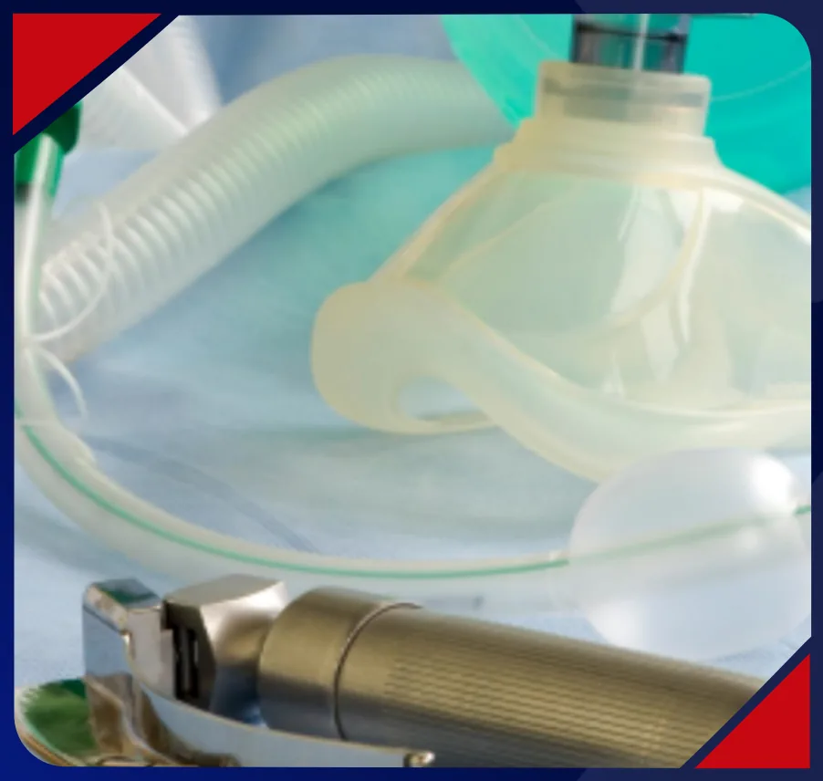

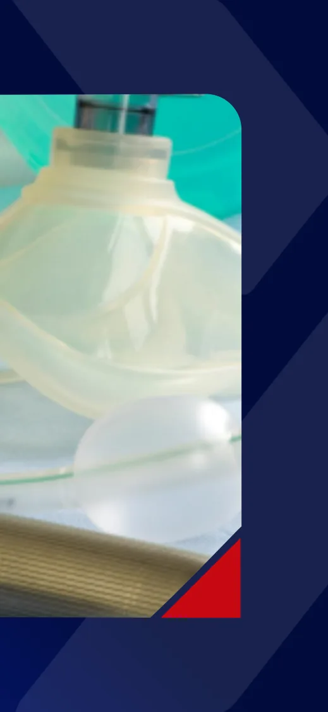

---

<!-- page:2 -->

## Nessa Aula Revisaremos

- Avaliação pré-operatória
- Medicações anestésicas
- Raquianestesia e peridural

---

<!-- page:3 -->

## Anestesiologia no ENAMED

---

<!-- page:4 -->

## Estado de Saúde: Anamnese e Exame Físico

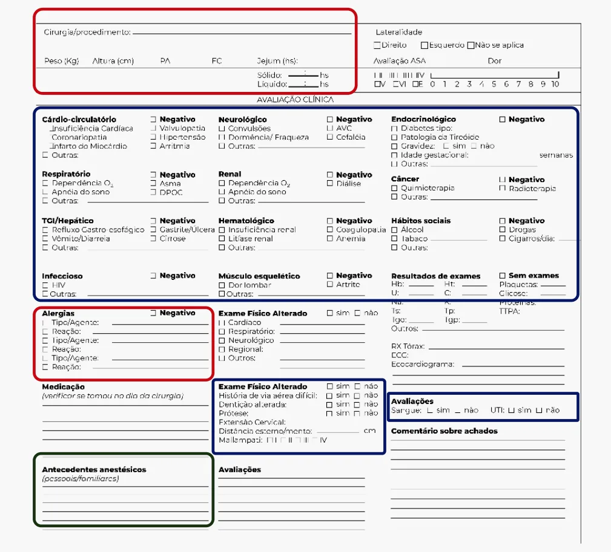

---

<!-- page:5 -->

## Tabagismo

Um período **≥ 4 semanas** é necessário para reduzir as complicações respiratórias, e um período de **pelo menos 3-4 semanas** é necessário para reduzir as complicações relacionadas à cicatrização.

---

## Risco de Sensibilização ao Látex

Pacientes em risco incluem:

- Crianças com **defeitos do tubo neural**, em especial **meningomielocele**
- Pacientes submetidos a **múltiplas cirurgias** e/ou com **sondagens repetidas**
- Profissionais da área da saúde e/ou trabalhadores que utilizam luvas no exercício da profissão
- História de reações a alimentos como **banana, kiwi, abacaxi, batata e frutas secas** (síndrome látex-fruta)

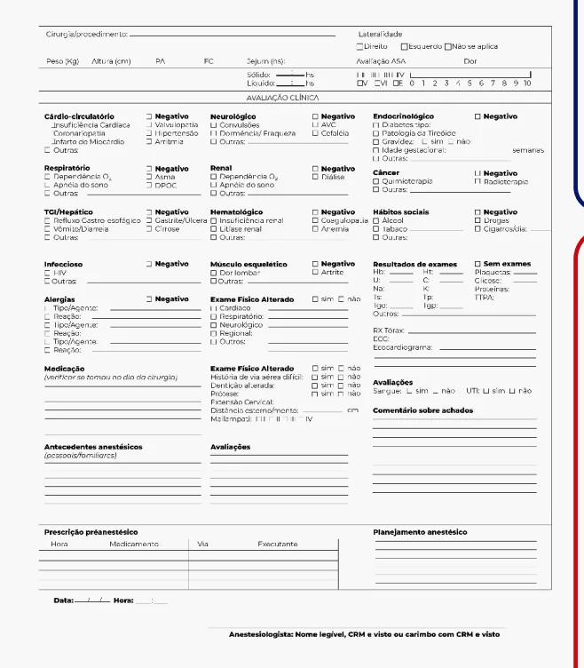

---

<!-- page:6 -->

## Reações Alérgicas em Anestesia

A maior parte das reações alérgicas em anestesia são causadas por:

- **Relaxantes musculares** (58%)
- **Látex** (17%)
- **Antibióticos** — cefalosporinas (15%)
- **Colóides** — gelatinas (4%)

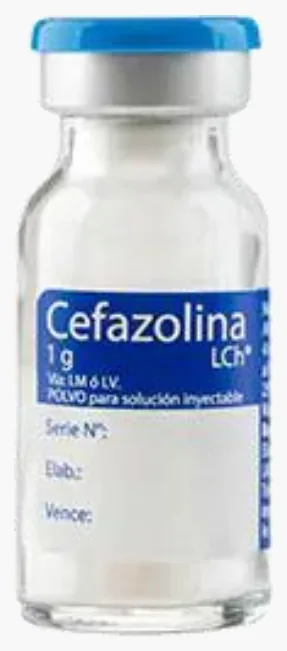

---

<!-- page:7 -->

## Suspeita de Alergia ao Látex

**Parada cardiorrespiratória inexplicável no intraoperatório** → suspeitar de **alergia ao látex**.

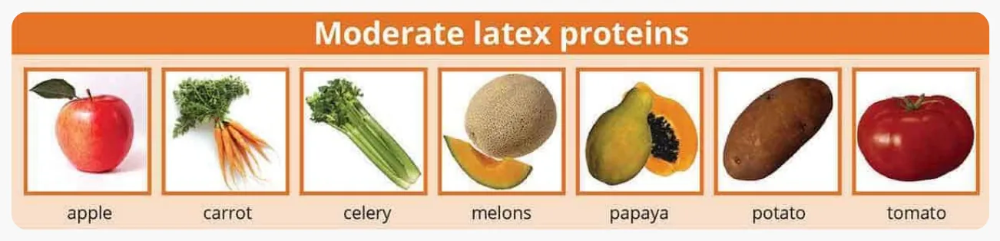

---

<!-- page:8 -->

## Hipertermia Maligna

**Condição autossômica dominante** desencadeada por **anestésicos voláteis** e/ou **succinilcolina**.

### Mecanismo

- **Expressão de receptores de rianodina** (RyR1)
- Liberação anormal de **cálcio** intracelular
- Hipermetabolismo muscular
- Danos/falha em múltiplos órgãos

### Manifestações

- **Hipertermia rápida**
- **Rigidez muscular**
- **Mioglobinúria**
- **Rabdomiólise**

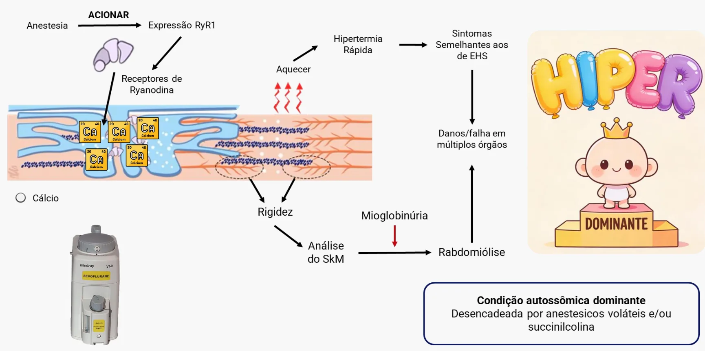

---

<!-- page:9 -->

## Manejo da Hipertermia Maligna

### Identificando o Quadro Clínico

- **Sinal mais precoce**: **taquicardia**
- **Sinal mais confiável**: **hipercapnia inexplicável**
- A hipertermia pode demorar a surgir
- **Lesão muscular**, espasmo do masseter
- **Hipercalemia**

Em resumo: **consequências do hipermetabolismo muscular**.

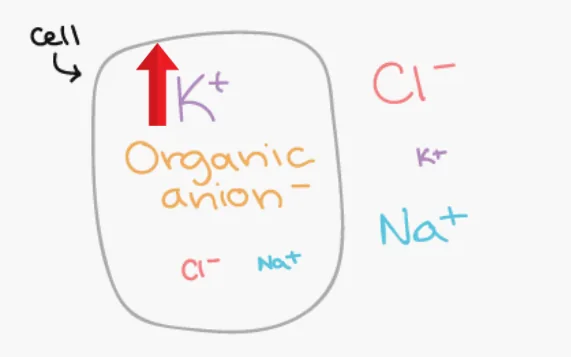

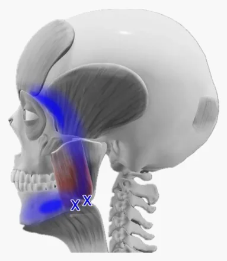

---

<!-- page:10 -->

## Manejo da Hipertermia Maligna — Conduta

1. **Interromper a exposição!**

2. **O2 100% com fluxo alto + hiperventilação + substituir o circuito + filtros de carvão**

3. **Dantrolene**: 
   - **2,5 mg/kg EV bolus rápido**
   - Mais **2,5 mg/kg EV a cada 5 minutos** SN (máx 10 mg/kg)

4. **Tratar as outras complicações** (acidose, hipercalemia, arritmias)

5. **UTI nas próximas 24-48 horas**

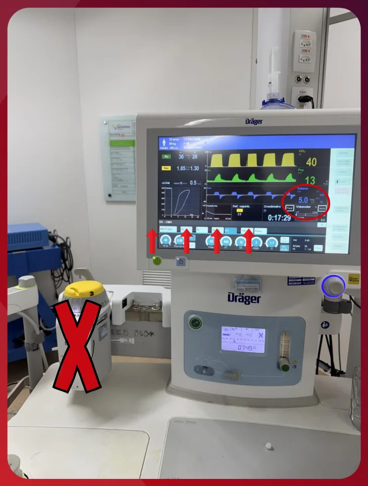

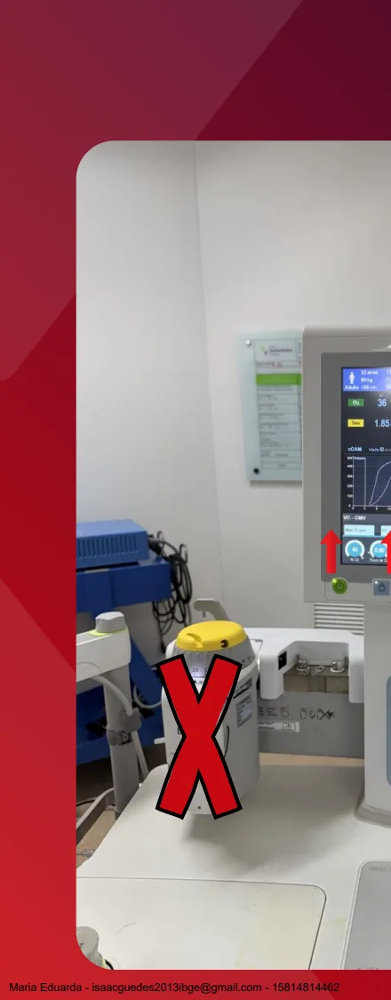

---

<!-- page:11 -->

## Questão ENAMED — Hipertermia Maligna

**A Hipertermia Maligna é uma patologia em que há elevação da temperatura corporal do indivíduo rapidamente e eleva o risco de óbito perioperatório.**

**A)** A suscetibilidade à HM é herdada como uma doença **autossômica dominante com penetrância variável**

**B)** Calcula-se que ocorra HM em 1 em 3.000-5.000 adultos, submetidos à anestesia loco-regional

**C)** A mortalidade por HM aumentou para mais de 10% nos últimos 15 anos como resultado da falta de tratamento disponível

**D)** Um indivíduo suscetível à HM exposto a um anestésico deflagrador provoca uma liberação anormal de potássio, que provoca ativação prolongada dos filamentos musculares, culminando em apneia

---

<!-- page:12 -->

<!-- page:13 -->

## Estratificação e Redução de Riscos — Escala ASA

**American Society of Anesthesiologists (ASA)**

| Classe | Definição | Taxa de Óbito |
|---|---|---|
| **ASA I** | Sem comorbidades | 0,05-0,08% |
| **ASA II** | Comorbidades leves, tabagismo, etilismo | 0,27-0,4% |
| **ASA III** | Comorbidades graves/mal controladas | 1,8-4,3% |
| **ASA IV** | Condição sistêmica grave com ameaça à vida | 7,8-23% |
| **ASA V** | Moribundo | 9,4-50% |
| **ASA VI** | Morte encefálica | — |

### Emergência = E

**Exemplo**: Paciente, 23 anos, não gestante, sem comorbidades ou vícios, em programação de cirurgia ortopédica pós-trauma automobilístico → **P1E**

---

<!-- page:14 -->

## Classificação ASA — Detalhamento

| Classe | Definição | Exemplos |
|---|---|---|
| **I** | Paciente saudável | Paciente saudável, não tabagista, não etilista ou consumo mínimo de álcool |
| **II** | Doença sistêmica leve | Tabagista ativo, etilista social, grávida, obesos (IMC 30-40), hipertensão controlada, diabetes controlado, doença pulmonar leve |
| **III** | Doença sistêmica grave | Diabetes não controlado, hipertensão não controlada, hepatite ativa, dependência alcoólica, uso de marcapasso, dialítico renal crônico com diálises irregulares, IAM, AVC > 3 meses |
| **IV** | Doença que impõe risco constante à vida | IAM/AVC < 3 meses, isquemia cardíaca atual, disfunção valvar severa compensada pós-diálise, sepse, doente renal crônico com diálises irregulares, pacientes com fração de ejeção reduzida |
| **V** | Moribundo com baixas chances de sobreviver | Aneurisma roto de abdome/tórax, politraumatizado grave, sangramento intracraniano com efeito de massa, isquemia mesentérica funcional sem intervenção cirúrgica |
| **VI** | Doador de órgãos | Paciente com morte encefálica com proposta cirúrgica de retirada de órgãos para doação |

---

<!-- page:15 -->

## Questão sobre Classificação ASA

**Homem, 49 anos, será submetido a colectomia subtotal devido a doença diverticular. O paciente tem hipertensão arterial e diabetes mellitus controlados com uso correto e regular de medicamentos. Qual a classificação pré-operatória conforme os critérios ASA?**

**A)** ASA I

**B)** ASA II

**C)** ASA IV

**D)** ASA III

---

<!-- page:16 -->

---

<!-- page:17 -->

## Exames Pré-operatórios

---

<!-- page:18 -->

## Exames Laboratoriais

> ⚠️ Dados de tabela ambíguos no OCR original. A tabela de "Devo solicitar o check-up de rotina?" apresenta múltiplas colunas intercaladas (Hemograma, Coagulograma, RX tórax, etc.) sem correspondência clara entre indicações e grupos de pacientes. Conteúdo listado em texto corrido a seguir.

**Indicações por contexto clínico:**

- **Hemograma**: indicado em idosos, trauma, hemorragia, cirurgias grandes, cirurgia de tórax, pacientes em uso de quimioterapia
- **Coagulograma**: indicado em coagulopatias, traumas, cirurgias grandes, hepatopatas, uso de fármacos (anticoagulantes), hemorrágicos anteriores
- **RX tórax**: indicado em idosos, DPOC, cirurgias de tórax, alterações cardíacas, ausência de evidência convincente para avaliar risco perioperatório isoladamente
- **Eletrolítos**: indicado em DRC, nefropatas, diabéticos
- **Teste de gravidez**: sempre em mulheres em idade fértil
- **Hemograma, ausculta alterada**: indicado em cirurgias grandes

### Validade dos Exames

**Sem prazo definido pela ASA**, mas **aceitáveis resultados de exames realizados até 6 meses antes do procedimento anestésico-cirúrgico** (fornece informações importantes para avaliar risco).

---

<!-- page:19 -->

## ECG Pré-operatório

**Quando solicitar?**

- **Cirurgias cardiovasculares**: sempre solicitar
- **Cirurgia de moderado/alto risco**: considerar, mesmo se ASA I
- **Cirurgias de baixo risco**: depende da idade!
  - **≥ 80 anos**: sempre solicitar
  - **40-80 anos**: considerar
  - **< 40 anos**: não é rotina

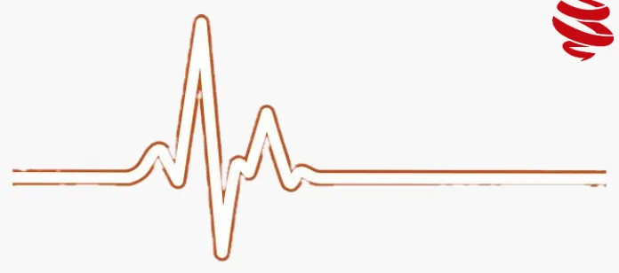

---

<!-- page:20 -->

## Estratificação de Risco Pré-operatório

---

<!-- page:21 -->

## Estratificação de Risco Cardíaco (Critério LEE)

**Fatores de risco:**

1. **Exame pré-OP**: creatinina > 2 mg/dL
2. **Tipo de cirurgia**: intraperitoneal, intratorácica e vascular suprainguinal
3. **Fatores de risco**: DAC, ICC, DCV, DM insulinodependente

### Definições

- **Doença arterial coronária (DAC)**: ondas Q no ECG, e/ou sintomas de isquemia, e/ou teste não invasivo para isquemia alterado, e/ou uso de nitrato
- **ICC**: quadro clínico sugestivo e/ou radiografia de tórax com congestão pulmonar
- **DCV**: doença cerebrovascular

### Estratificação de Risco Cardiovascular Perioperatório (RITA LEE)

- **≤ 1 fator** = **baixo risco**
- **≥ 2 fatores sem angina ou ICC limitante** = **risco intermediário**
- **≥ 2 fatores com angina ou ICC classe funcional 3-4** = **risco alto**

---

<!-- page:22 -->

## Estratificação e Redução de Risco — Capacidade Funcional

**Equivalente metabólico → MET**

**Quantos METs para liberar para a cirurgia?**

---

<!-- page:23 -->

## 4 METs

Pacientes com capacidade funcional **≥ 4 METs** geralmente têm baixo risco perioperatório.

---

<!-- page:24 -->

## Escala de METs — Atividades Diárias

| METs | Descrição |
|---|---|
| **1 MET** | Ficar deitado, sentado, vendo TV, digitando ou falando ao telefone |
| **2 METs** | Lavar, passear ou pendurar roupas, caminhar de casa para o carro ou para pegar o ônibus |
| **3 METs** | Lavar carro, limpar garagem, carregar criança pequena (≈7 kg) |
| **4 METs** | Varrer garagem, andar de bicicleta |
| **5 METs** | Caminhar carregando peso de 0,5-7 kg em subidas |
| **6 METs** | Fazer faxina, nadar, caminhar em ritmo rápido |
| **7 METs** | Futebol casual, correr ou nadar em velocidade lenta |
| **8 METs** | Correr a 8,3 km/h |
| **9 METs** | Futebol competitivo |
| **10 METs** | Correr a 11 km/h |
| **11 METs** | Ciclismo estacionário com esforço vigoroso, pular corda |
| **12 METs** | Correr a ≈13 km/h |

---

<!-- page:25 -->

## Jejum Pré-operatório

---

<!-- page:26 -->

## Jejum Pré-operatório — Recomendações

| Tipo de Ingesta | Tempo de Jejum |
|---|---|
| **Líquidos claros/sem resíduos** (água, sucos de fruta sem polpa, bebidas carbonatadas, chá claro) | **2h** |
| **Leite materno** | **4h** |
| **Refeições leves/fórmula infantil** | **6h** |
| **Refeições sólidas gordurosas** | **8h** |

**Nota**: O tipo de líquido é mais importante do que o volume.

### É Possível Abreviar o Jejum?

Sim, em **pacientes sem riscos de atraso do esvaziamento gástrico**:

- **50 g de Maltodextrina** em solução de carboidratos **2h antes** do procedimento
- **Benefícios**: seguro, diminui REMIT (resistência insulínica e estresse cirúrgico)

---

<!-- page:27 -->

## Questão sobre Jejum Pré-operatório

**Quanto ao tempo de jejum pré-operatório recomendado, assinale a alternativa correta:**

**A)** Jejum mínimo de todo tipo de alimentos sólidos por 12 horas antes do procedimento sob anestesia geral

**B)** Jejum mínimo de 2 horas para líquidos claros antes do procedimento sob anestesia geral

**C)** Jejum mínimo de 2 horas para leite materno antes do procedimento sob anestesia geral

**D)** Jejum mínimo de todo tipo de alimentos sólidos por 8 horas antes do procedimento

---

<!-- page:28 -->

---

<!-- page:29 -->

## Risco de Broncoaspiração

**Quando me preocupar?**

- Abdome agudo
- Oclusão intestinal
- Íleo paralítico
- HAD ativa
- Estenose esofágica
- Megaesôfago, acalásia
- Neoplasia esofagogástrica
- **História de gastroparesia**
- **DM** (neuropatia/disautonomia)
- Vagotomia cirúrgica
- Trabalho de parto ativo
- DRC ou uremia
- Doença de Parkinson
- Sequela neurológica com disfagia
- História de regurgitação
- **Análogos de GLP-1** (Ozempic, Mounjaro, Saxenda)
- Politrauma
- TCE ou hipertensão intracraniana

---

<!-- page:30 -->

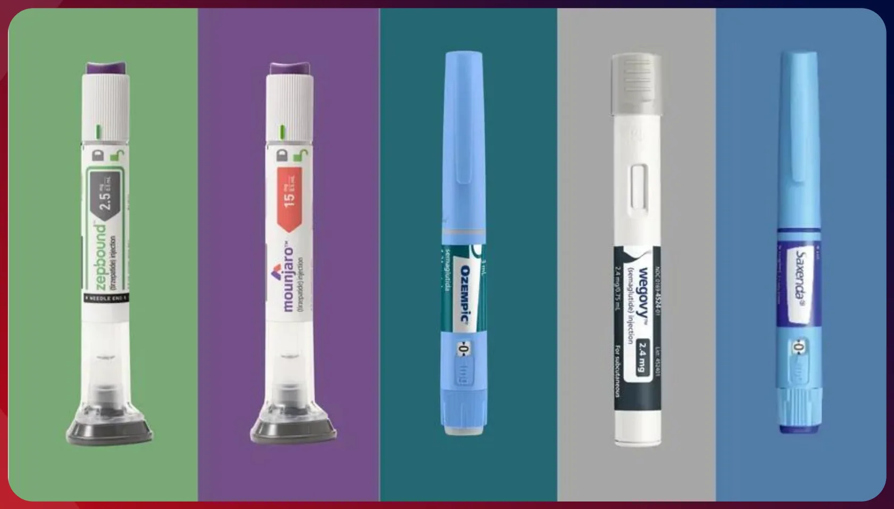

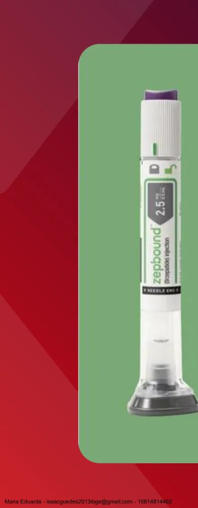

---

<!-- page:31 -->

## Análogo de GLP-1 → Atrasa o Esvaziamento Gástrico

- **Tempo de jejum não é confiável**
- **Induzir em sequência rápida**
- **Orientar a suspensão no pré-operatório**

### Orientação da SBA

| Fármaco | Suspensão Recomendada |
|---|---|
| **Liraglutida** | 2 dias |
| **Dulaglutida** | 15 dias |
| **Tirzepatida** (Mounjaro) | 15 dias |
| **Semaglutida** (Ozempic) | 21 dias |

**Nota**: O tempo leva em consideração 3 meias-vidas.

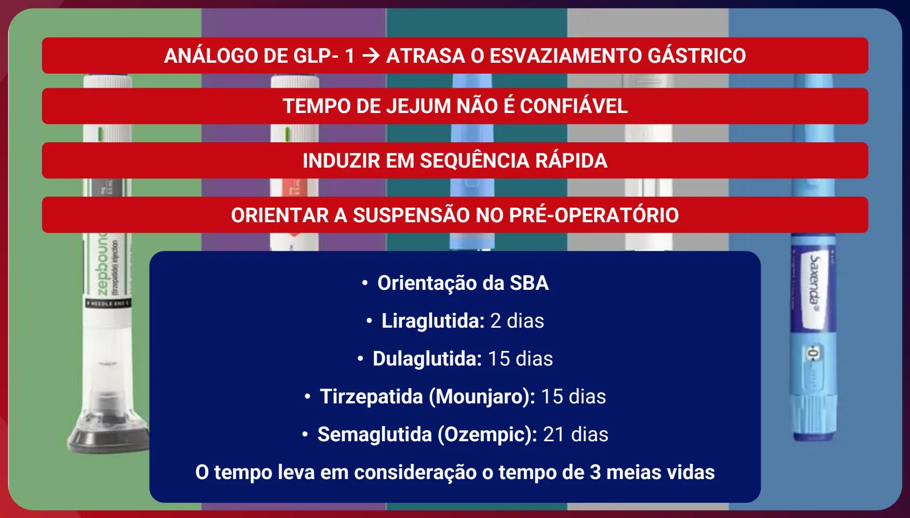

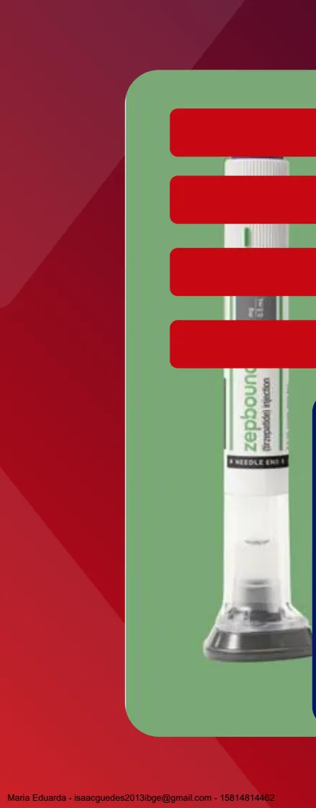

---

<!-- page:32 -->

## USG Gástrico Point-Of-Care

O **antro gástrico** é o melhor alvo para avaliar o conteúdo gástrico, pois se dilata de forma linear com aumento do volume gástrico e fica em um local dependente da gravidade.

**Realização**: com o paciente em posição **supino** e **decúbito lateral direito**.

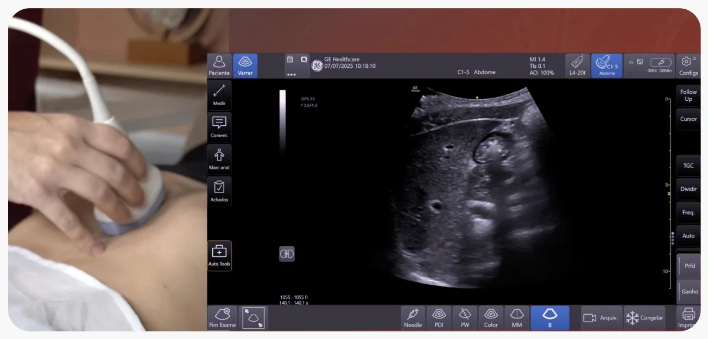

---

<!-- page:33 -->

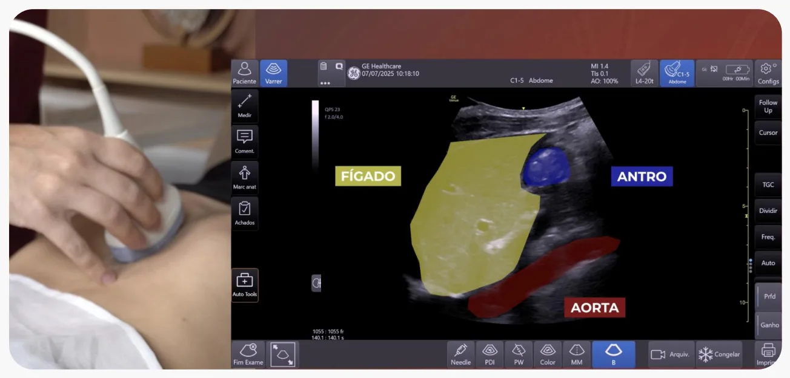

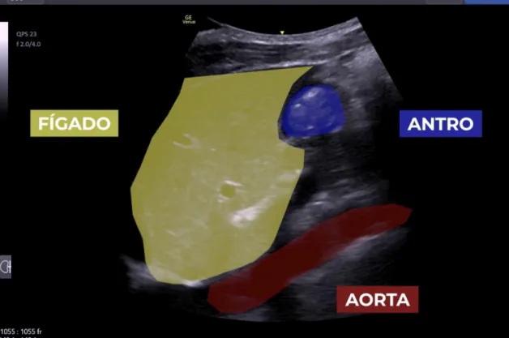

---

<!-- page:34 -->

## Paciente com Estômago Cheio

**O que fazer?**

### Intubação em Sequência Rápida (ISR)

**Drogas de ação rápida (< 90 seg):**

- **Alfentanil** ou **Remifentanil**
- **+** **Propofol**, **Cetamina** ou **Etomidato**
- **+** **Succinilcolina** ou **Rocurônio**

### Intubação com o Paciente Acordado

- **Ansiólise** (dexmedetomidina)
- **+** Anestesia das vias aéreas

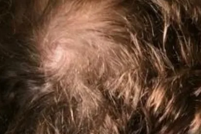

---

<!-- page:35 -->

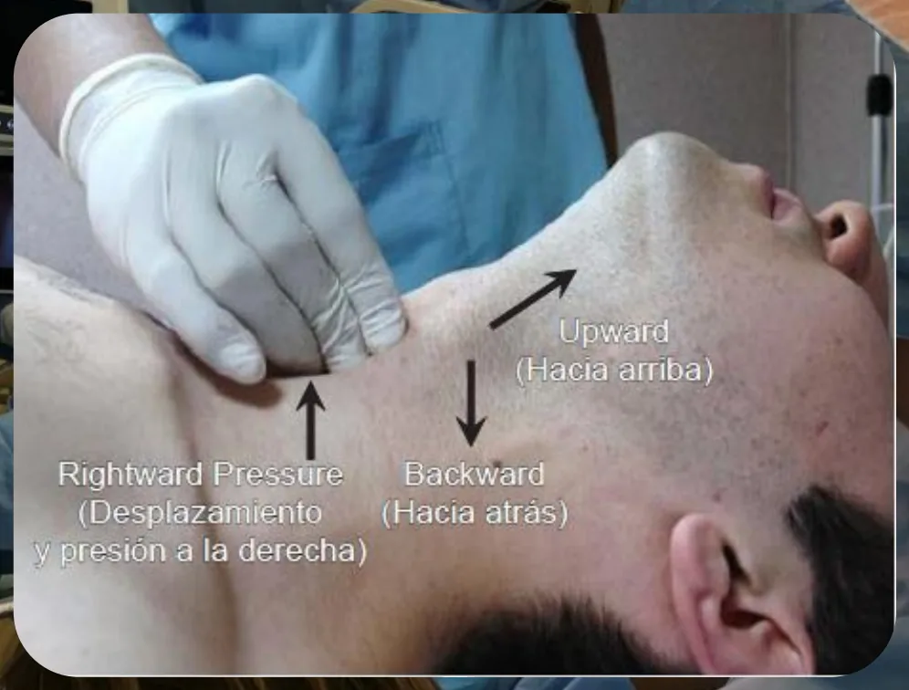

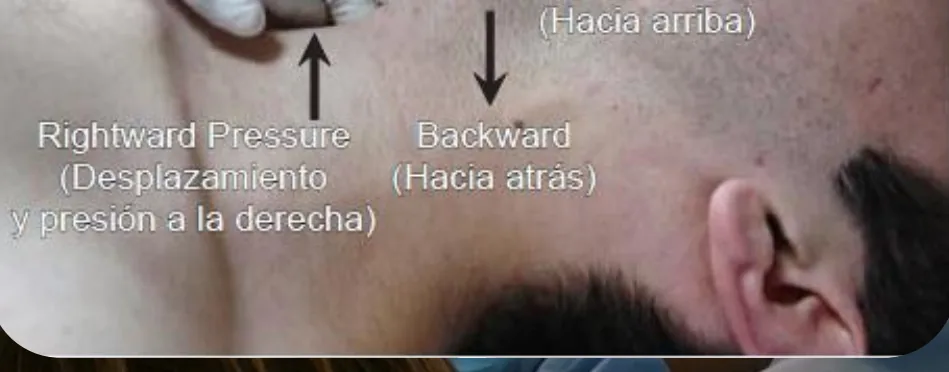

---

<!-- page:36 -->

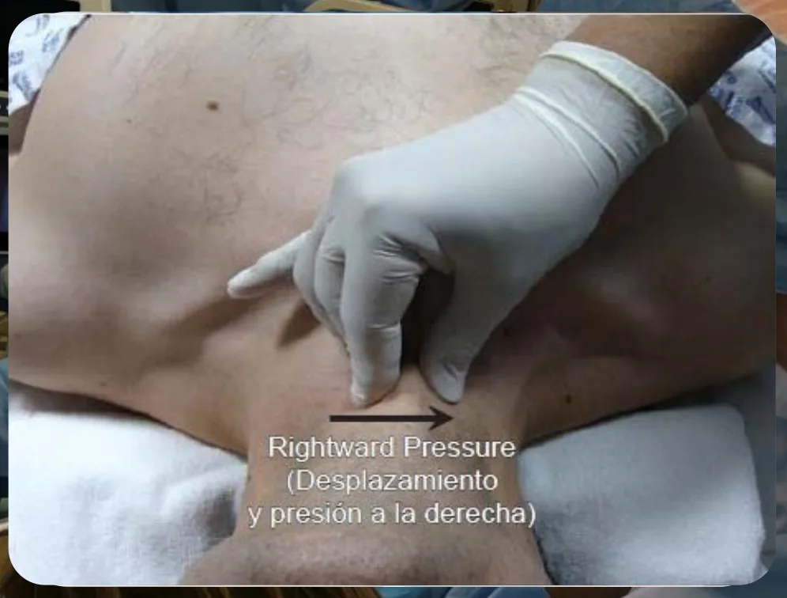

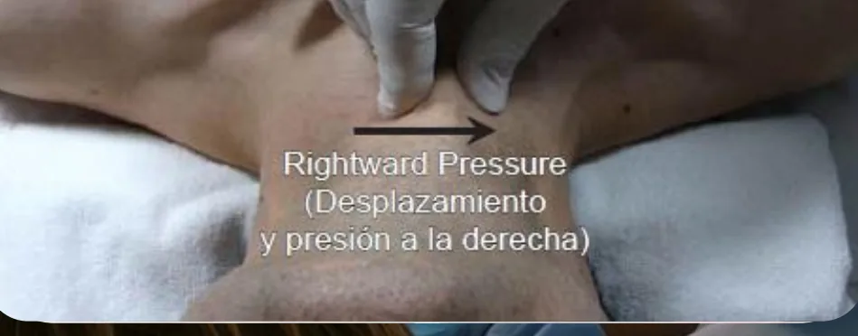

---

<!-- page:37 -->

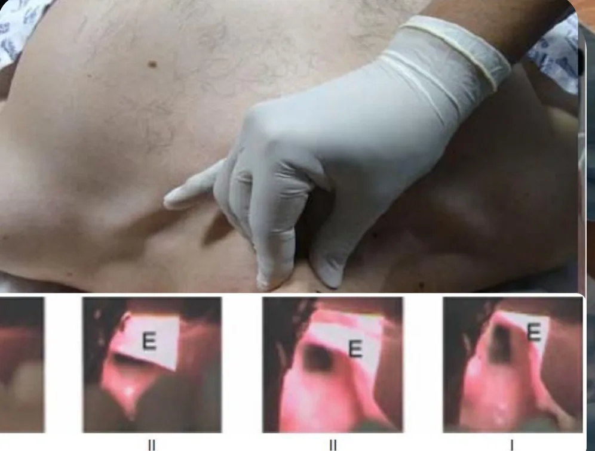

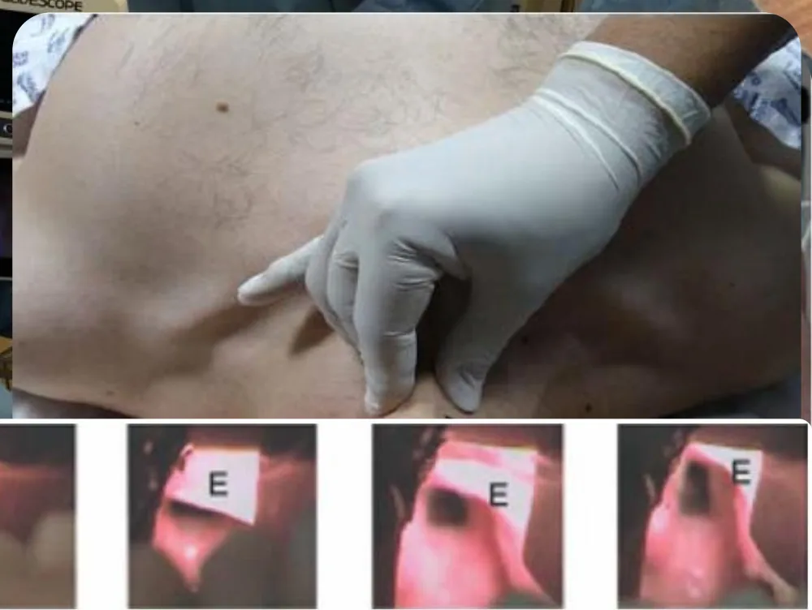

---

<!-- page:38 -->

## Avaliação da Via Aérea

---

<!-- page:39 -->

## Preditores de Dificuldade de Via Aérea

- **História prévia de VAD** → **PRINCIPAL PREDITOR!**
- **Radioterapia cérvico-facial**
- **Cirurgias de cabeça, pescoço e/ou coluna cervical**

### Condições Clínicas Associadas

- Diabetes
- Artrite reumatoide
- Bócio
- Acromegalia
- Angina de Ludwig
- Espondilite anquilosante
- Síndrome de Marfan
- Tumores, abscesso, malformação facial

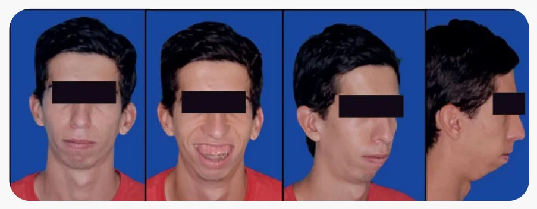

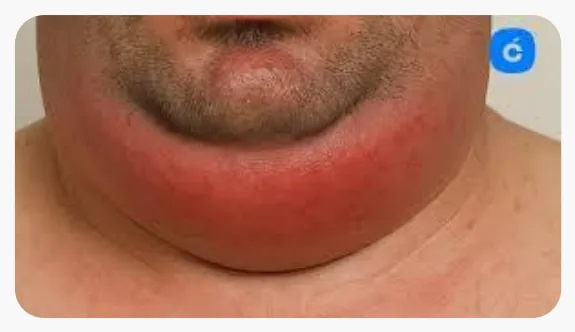

---

<!-- page:40 -->

## Preditores de Dificuldade — Ângulos e Distâncias

- **Ângulo de abertura da boca**: **35°-90°** (ideal)
- **Distância tireo-hioide**: **6-6,5 cm**
- **Distância entre incisivos superiores e inferiores**: **12,5 cm**

> **≥ 2 ou mais preditores** = possível via aérea difícil

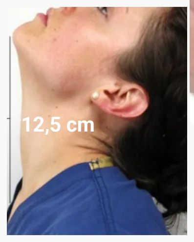

---

<!-- page:41 -->

## Classificação de Mallampati

| Classe | Estruturas Visíveis |
|---|---|
| **Classe I** | Palato mole, fauce, úvula e pilares amigdalianos visíveis |
| **Classe II** | Palato mole, fauce e úvula visíveis |
| **Classe III** | Palato mole e base da úvula visíveis |
| **Classe IV** | Palato mole totalmente não visível |

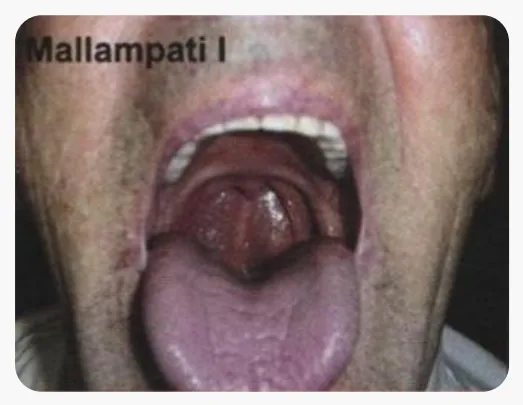

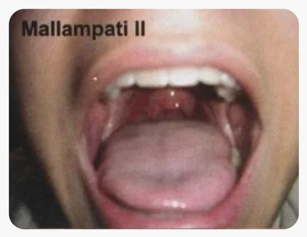

---

<!-- page:42 -->

## Upper Lip Bite Test

**Solicitar ao paciente que tente morder o lábio superior com os dentes incisivos inferiores.**

- Bom preditor de laringoscopia difícil
- Especificidade e acurácia superiores a outros testes isolados (distância tiromentoniana, classificação de Mallampati)

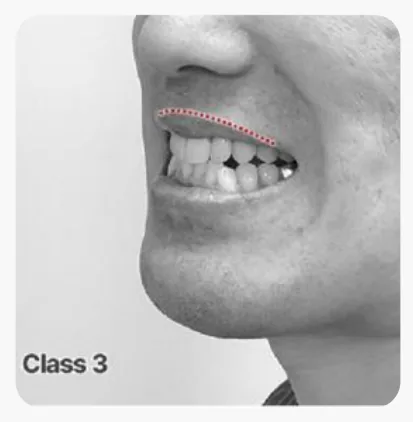

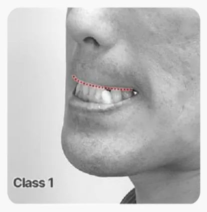

---

<!-- page:43 -->

## Escala de Cormack-Lehane

| Classe | Estruturas Visíveis |
|---|---|
| **I** | Maior parte da fenda glótica visível |
| **IIA** | Apenas porção posterior da fenda glótica visível |
| **IIB** | Apenas cartilagens aritenoides visíveis |
| **IIIA** | Epiglote visível e passível de elevação |
| **IIIB** | Epiglote aderida à faringe |
| **IV** | Nenhuma estrutura laríngea visível |

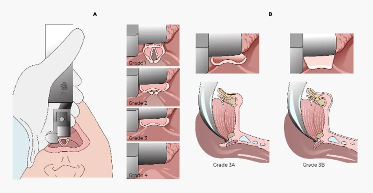

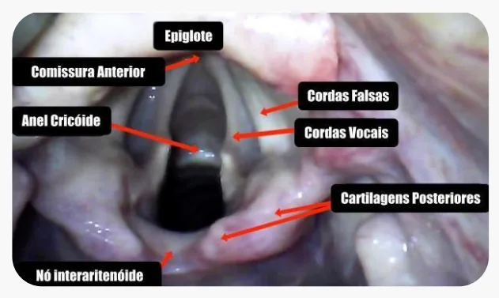

---

<!-- page:44 -->

## Preditores de Ventilação Difícil (OBESAM)

| Sigla | Fator | Explicação |
|---|---|---|
| **O** | **Obesity** (Obesidade) | IMC > 26 (sobrepeso) aumenta dificuldade |
| **B** | **Beard** (Barba) | Presença de barba dificulta o selamento da máscara |
| **E** | **Elderly** (Envelhecimento) | Idade > 55 anos; pacientes idosos têm menor tônus muscular e maior risco de dificuldade |
| **S** | **Snores** (Roncos) | Sons ao dormir; doenças pulmonares ou apneia do sono dificultam ventilação |
| **A** | **Absent teeth** (Ausência de dentes) | Dificulta o ajuste da máscara |
| **M** | **Mark seal** (Vedação da máscara) | Presença de barba, trauma facial ou anomalias que dificultam o selamento |

---

<!-- page:45 -->

## Preditores de Intubação Difícil (LEMON)

| Sigla | Fator | Avaliação |
|---|---|---|
| **L** | **Look externally** | Aspecto externo anormal? |
| **E** | **Evaluate "3-3-2"** | Abertura da cavidade oral (3 dedos), distância hiomentoniana (3 dedos), distância tireo-hioide (2 dedos) |
| **M** | **Mallampati** | Classificação de Mallampati (Classes I-IV) |
| **O** | **Obese/Obstruction** | Obesidade, obstrução de via aérea |
| **N** | **Neck mobility** | Mobilidade do pescoço |
| **U** | **Upper lip bite test** | Capacidade de morder o lábio superior com incisivos inferiores |

---

<!-- page:46 -->

## Anestesia Geral (Agentes Opioides, Indutores e BNM)

---

<!-- page:47 -->

## Pilares da Anestesia Geral

- **Analgesia**
- **Hipnose**
- **Imobilidade**
- **Homeostase**
- **Reversibilidade + Segurança**

---

<!-- page:48 -->

## Analgesia — Classificação dos Opioides

| Categoria | Substâncias |
|---|---|
| **Naturais** | Morfina, codeína, papaverina |
| **Semissintéticos** | Heroína, buprenorfina, hidromorfona |
| **Sintéticos** | Metadona, meperidina, fentanil, sufentanil, alfentanil, remifentanil |

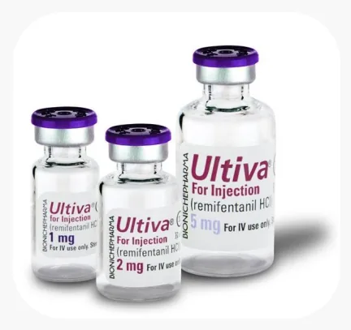

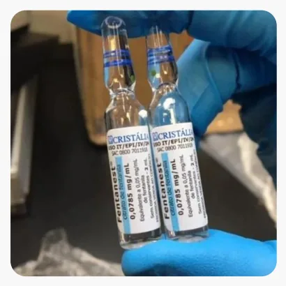

---

<!-- page:49 -->

## Agentes Opioides — Entendendo os Receptores

### Receptores Opioides

- **Receptor μ (Mu)**
  - Depressão respiratória, prurido, miose, sedação
  - Afinidade maior (antagonista específico: **naloxona**)

- **Receptor κ (Kappa)**
  - Promovem analgesia
  - Sedação, miose
  - Diminuem ação do SNS

- **Receptor δ (Delta)**
  - Pouca relevância clínica

---

<!-- page:50 -->

## Síndrome do Tórax Rígido (STR)

É raro, mas acontece!

### Mecanismo

- **Ação Mu no SNC** → aumento do tônus muscular
- Fechamento das pregas vocais
- **Dificuldade de ventilação**

### Fatores de Risco

- Altas doses de opioide
- Administração rápida
- Uso de óxido nitroso (N2O)

### Reduzindo o Risco

O **pré-tratamento com BNM não despolarizantes** ou o **uso concomitante** pode diminuir a incidência e a intensidade da rigidez.

---

<!-- page:51 -->

## Fentanil

- **Agonista Mu puro**
- **Opioide sintético 100x mais potente que a morfina**
- **Altamente lipofílico** → rápido início de ação (pico de efeito em 3-6 minutos)
- Acumula no tecido gorduroso → **não é bom para infusão contínua**

### Dose e Apresentação

- **Dose**: 4 mcg/kg
- **Dose habitual IOT**: 2-5 mcg/kg EV
- **Apresentação**: 50 mcg em 1 mL ou 200 mcg em 4 mL
- **Paciente de 70 kg**: 280-350 mcg

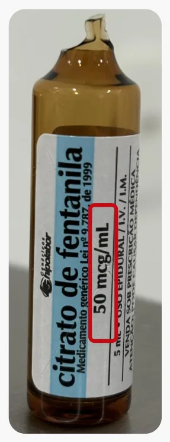

---

<!-- page:52 -->

## Sufentanil

- **4000x mais potente que a morfina**
- **Muito lipossolúvel** → muito potente
- Demora mais que o fentanil para fazer efeito (≈5 minutos) → afinidade pouco menor pelos receptores no SNC

### Dose e Preparo

- **Dose habitual IOT**: 0,25-2 mcg/kg
- **Dose**: 0,5 mcg/kg
- **Paciente de 80 kg**: 40 mcg (diluir!)
- **Preparo**: 50 mcg em 1 mL + 09 mL SF 0,9% = 5 mcg/mL → 8 mL tem 40 mcg

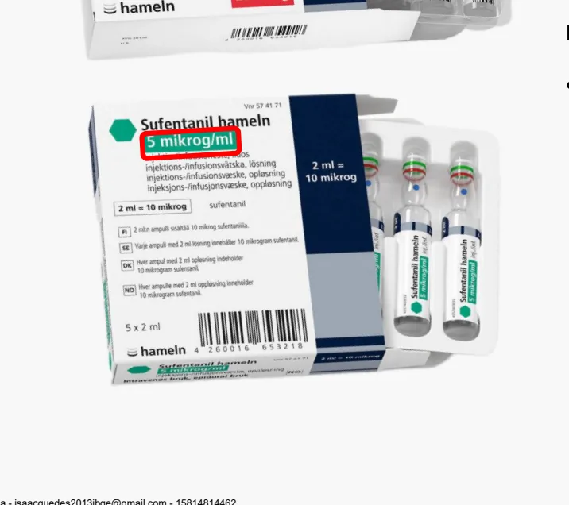

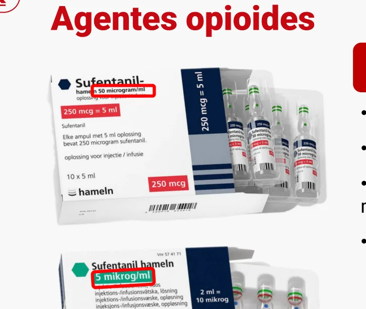

---

<!-- page:53 -->

## Alfentanil

- **10x mais potente que a morfina**
- **Início de ação mais precoce dos opioides (< 90 segundos)**
- Menos lipossolúvel que o fentanil → mais disponível na forma não ionizada
- **Produz atividade elétrica semelhante a convulsão** — evitar em paciente com fator de risco para convulsão
- Produz mais bradicardia e hipotensão

### Dose

- **Dose habitual IOT**: 25-100 mcg/kg
- **Dose**: 50 mcg/kg
- **Paciente de 80 kg**: 4000 mcg (8 mL de alfentanil 500 mcg/mL)

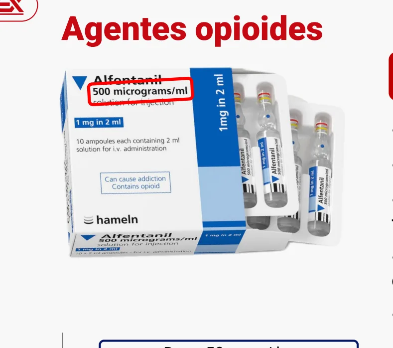

---

<!-- page:54 -->

## Remifentanil

- **Rápido início de ação**
- **Metabolizado por esterases plasmáticas** → rápida eliminação do organismo
- **Não promove analgesia pós-operatória** (duração de ação até 10 minutos)

### Dose e Preparo

- **Diluir 2 mg em 40 mL** = 50 mcg/mL
- **Dose**: 0,05-0,5 mcg/kg/min

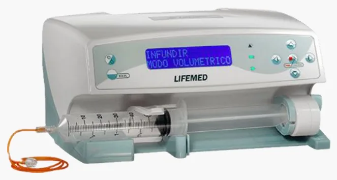

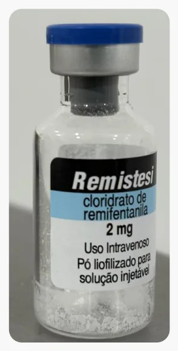

---

<!-- page:55 -->

## Agentes Hipnóticos Inalatórios

### Óxido Nitroso (N2O)

- "**Gás hilariante**"
- Propriedades analgésicas (receptor **NMDA**)
- **Mantém o drive respiratório**
- Aumenta risco de **NVPO**
- Diminui a síntese de **B12** (inativa metionina sintetase)
- Gás com efeito estufa
- **Alta solubilidade** → expansão dos espaços fechados com ar no corpo (pneumotórax, ouvido médio, espaço intraocular, alças intestinais)

### Halogenados (Ação GABAérgica)

- **Alcanos**: Halotano (obsoleto)
- **Éteres**: Sevoflurano (o mais utilizado), Desflurano, Isoflurano
- Causam **depressão miocárdica**, **broncodilatação**, **vasodilatação cerebral** com aumento do **FSC** e da **PIC**
- **Desflurano** é o mais poluente ao meio ambiente

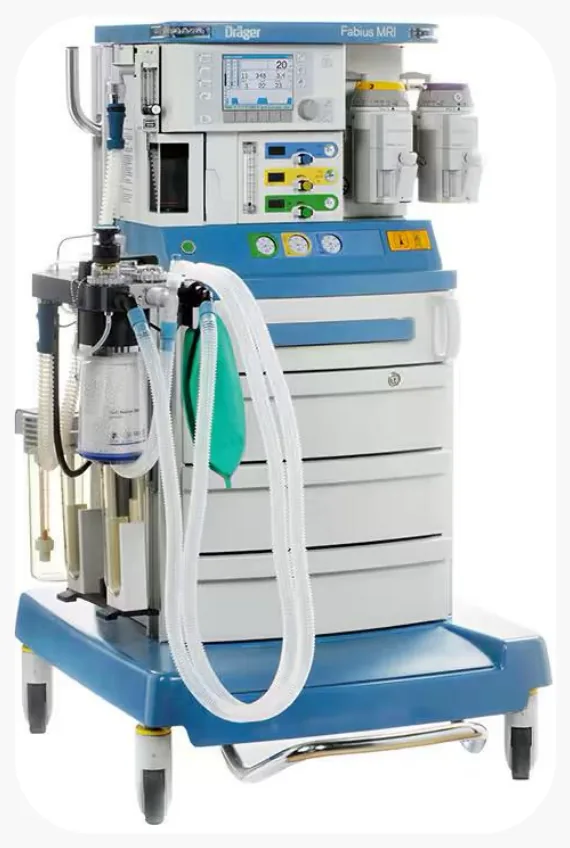

---

<!-- page:56 -->

## Agentes Hipnóticos Venosos — Midazolam

- **Benzodiazepínico**
- **Agonismo GABA-A**
- **Início de ação**: 1-3 min
- **Duração**: ≈20 min
- **Dose**: 0,1-0,3 mg/kg
- Ação ansiolítica, sedativa e **amnésia anterógrada**
- Propriedades **anticonvulsivantes** e **antieméticas**
- Mínima depressão cardiovascular
- **Metabolismo hepático**: metabólitos ativos (risco de ressedação)
- **Efeitos adversos**: hipotensão leve, risco de delirium
- **Reversor**: **flumazenil**

---

<!-- page:57 -->

## Agentes Hipnóticos Venosos — Propofol

- **Agonismo GABA-A**
- **Perda de consciência em 1 min**
- **Despertar em 2-8 minutos**
- **Composição**: emulsão lipídica — 10% óleo de soja, 2,25% glicerol e 1,2% fosfato purificado de ovos
- **Depressão do metabolismo do SNC** → diminuição do FSC e da PIC (neuroprotetor)
- **Depressão respiratória**, broncodilatação e aumento da colapsabilidade das vias aéreas
- **Depressão cardíaca** → hipotensão
- Pode causar dor à injeção
- Ação **antiemética** e **antipruriginosa** em doses sub-hipnóticas (10-20 mg)
- **Risco de pancreatite aguda**
- Risco de contaminação

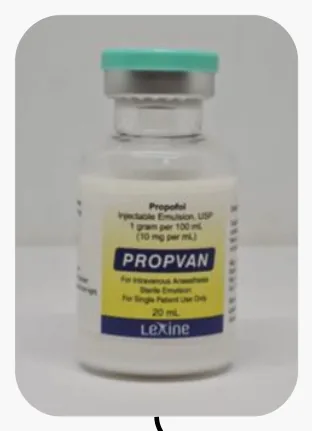

---

<!-- page:58 -->

## Síndrome da Infusão do Propofol

**Doses > 4 mg/kg/h por > 48h**

Manifestações:

- **Bradicardia refratária**
- **Esteatose hepática**
- **Acidose metabólica**
- **Insuficiência cardíaca aguda**
- **Rabdomiólise**

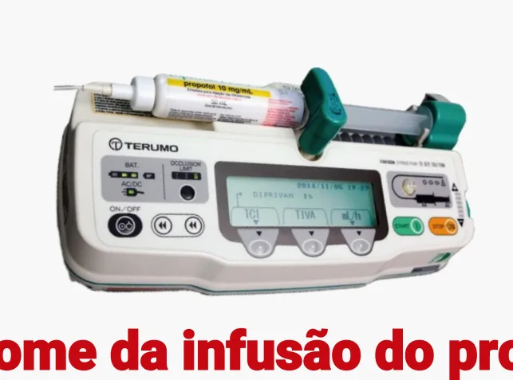

---

<!-- page:59 -->

## Agentes Hipnóticos Venosos — Etomidato

- **Derivado imidazólico**
- **Agonismo GABA-A**
- **Início de ação**: 2-4 min
- **Dose**: 0,3 mg/kg
- **Medicação mais cardioestável** !! — ótima opção para pacientes instáveis
- **Inibição da 11β-hidroxilase** → pode levar a aumento da insuficiência adrenal (é o tópico mais frequentemente abordado)
- Aumento de **náusea e vômito pós-operatórios** (NVPO)
- **Maior risco de convulsões** — pode reduzir o limiar convulsivo
- Aumento do risco de delirium
- **Presença de mioclonias**
- Dor à injeção (geralmente maior que a do propofol)

---

<!-- page:60 -->

## Agentes Hipnóticos Venosos — Cetamina

- **Antagonista NMDA** (N-metil-D-aspartato)
- **Anestesia dissociativa + Analgesia**
- **Perde a consciência em 1 min**
- **Duração**: 10-15 min
- **Ação broncodilatadora**
- **Mantém os reflexos das vias aéreas**
- **Mantém o drive respiratório**
- **Hemodinamicamente estável** (pode causar taquicardia e hipertensão) → depende da reserva de catecolaminas

### Dose

- **Indução**: 1-2 mg/kg
- **Analgesia**: 0,3 mg/kg

### Efeitos Adversos

- Aumento da **PIC**
- **Sialorreia**
- Risco de **crise de esquizofrenia** e/ou **surtos psicóticos**
- **Potencial para abuso**

---

<!-- page:61 -->

## Agentes Hipnóticos Venosos — Dexmedetomidina (Precedex)

- **Agonista α2-adrenérgico**
- **Efeito clínico curto**
- **Deve ser feito em infusão contínua**

### Dose

- **Ataque**: 1 mcg/kg em 10-20 min
- **Manutenção**: 0,2-0,7 mcg/kg/h

### Características

- Faz um **padrão de sono similar ao sono fisiológico**
- **Ação analgésica**
- **Antissialagogo**
- Utilizado para tratamento de delirium na UTI
- **Efeitos adversos**: bradicardia, hipotensão (queda da RVS), poliúria (inibe o ADH)

---

<!-- page:62 -->

## Bloqueadores Neuromusculares (BNM)

### Mecanismo de Ação

Representação esquemática da junção neuromuscular.

Fonte: Acervo do Medcof

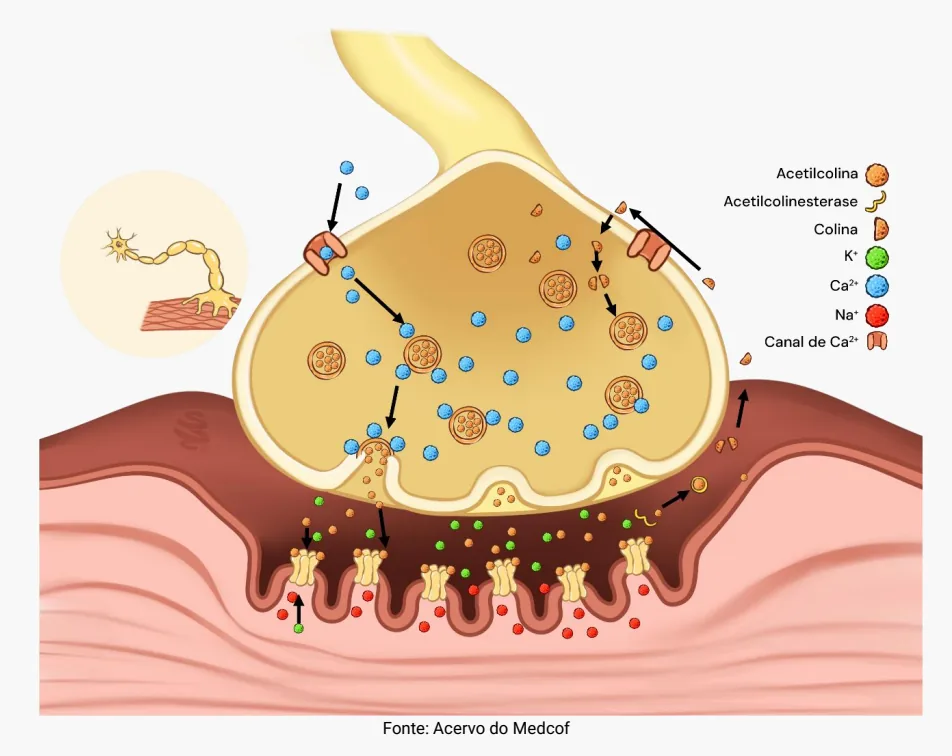

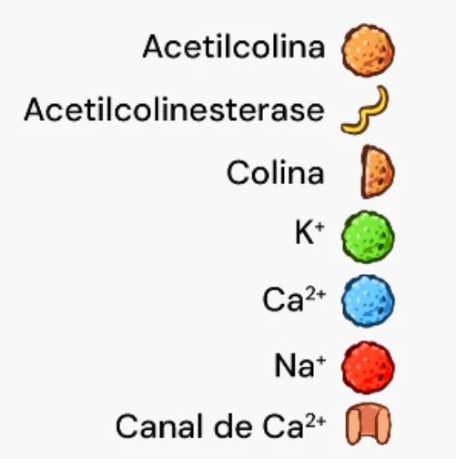

---

<!-- page:63 -->

## Bloqueadores Neuromusculares — Classificação

### Não Despolarizantes (Adespolarizantes)

- **Principais representantes**: Rocurônio (0,6 mg/kg / ISR: 1,2 mg/kg) e Cisatracúrio (0,1 mg/kg)
- Podem ser subdivididos de acordo com a duração de ação:
  - **Curta**: Mivacúrio (20 min)
  - **Intermediária**: Cisatracúrio, Rocurônio e Atracurío (30-45 min)
  - **Prolongada**: Pancurônio (120 min)

### Despolarizantes

- **Início rápido** → excelentes condições para IOT em < 60 segundos
- **Curta duração** → 5-12 minutos
- **Dose habitual**: 1-1,5 mg/kg
- **Despolarização prolongada** → impede a repolarização completa → contrações musculares involuntárias e temporárias (fasciculações)

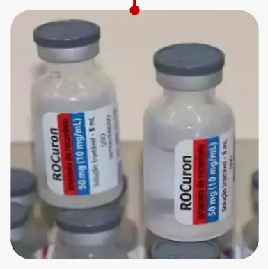

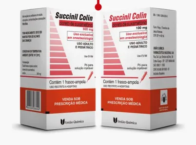

---

<!-- page:64 -->

## Hipercalemia Após Succinilcolina — Situações de Risco

- Grandes queimaduras (mais de 30% da superfície corporal)
- Politraumatismos
- **Doenças neurológicas** associadas a déficits: esclerose múltipla, esclerose lateral amiotrófica, doença de Parkinson grave, síndrome de Guillain-Barré, polineuropatia, encefalite
- **Traumas com denervação**: traumatismo medular, hemiplegia, paraplegia
- **Infecção** com produção de exotoxinas: tétano e botulismo
- **Imobilização prolongada**: sepse e tratamento prolongado em UTI
- **Miopatias** (ex.: distrofia muscular de Duchenne)
- Hipovolemia com acidose metabólica grave
- Infecções intra-abdominais graves

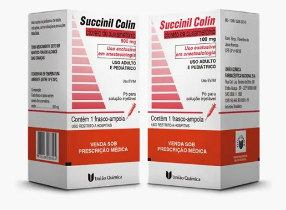

---

<!-- page:65 -->

## Questão — HCPA-RS 2022

**Paciente de 68 anos, que se encontrava hospitalizado porque será submetido a cirurgia de urgência para ressecção de tumor intracraniano, apresentou rebaixamento do sensório e vômitos. Na avaliação pré-anestésica, foram identificadas cardiopatia isquêmica e insuficiência cardíaca congestiva classe III, que vinham em tratamento regular. Que fármaco, dentre os abaixo, é o de escolha como indutor para a anestesia?**

**A)** Propofol

**B)** Fentanil

**C)** Etomidato

**D)** Dexmedetomidina

---

<!-- page:66 -->

---

<!-- page:67 -->

## Bloqueio de Neuroeixo

---

<!-- page:68 -->

## Anatomia

---

<!-- page:69 -->

## Anatomia — Medula Espinhal

### Medula Espinhal em Diferentes Idades

| Período | Nível de Término da Medula |
|---|---|
| **Nascimento** | — |
| **Criança (lactante)** | — |
| **Adulto** | Em 60% dos casos: **L1**; em 30%: **L2**; em 10%: **L3** |

### Desenvolvimento

Durante o **1º trimestre**, a medula espinhal vai do **forâmen magno até o final da coluna**. Ao longo do tempo, a coluna cresce e alonga-se **MAIS do que a medula**, formando o **filamento terminal** e o **hiato sacral**.

### Técnicas

- **Raquianestesia**: punção entre **L3-L4** ou **L4-L5**
- **Peridural**: qualquer altura a partir da coluna torácica

---

<!-- page:70 -->

## Camadas de Acesso — Raquianestesia vs. Peridural

### Raquianestesia

- Pele
- Tecido subcutâneo
- Ligamento supra espinhoso
- Ligamento interespinhoso
- Ligamento amarelo
- Dura-máter
- Aracnoide
- **Espaço subaracnóideo** → injeção do anestésico (atua nas estruturas do SNC)

### Anestesia Peridural

- Pele
- Tecido subcutâneo
- Ligamento supra espinhoso
- Ligamento interespinhoso
- Ligamento amarelo
- **Espaço peridural** (entre ligamento amarelo e dura-máter)

---

<!-- page:71 -->

## Indicações e Contraindicações

---

<!-- page:72 -->

## Indicações

### Raquianestesia

- Procedimento de **abdome inferior**, **períneo**, **cintura pélvica**, **abdome inferior** e **extremidades inferiores**

### Peridural

- Procedimento **torácicos**, **abdome alto e baixo**, **períneo**, **cintura pélvica** e **extremidades inferiores**

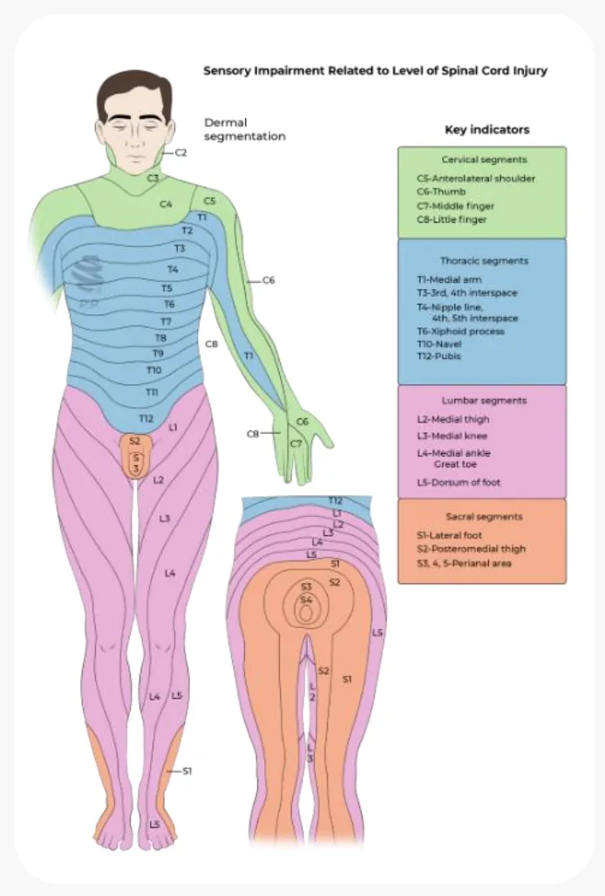

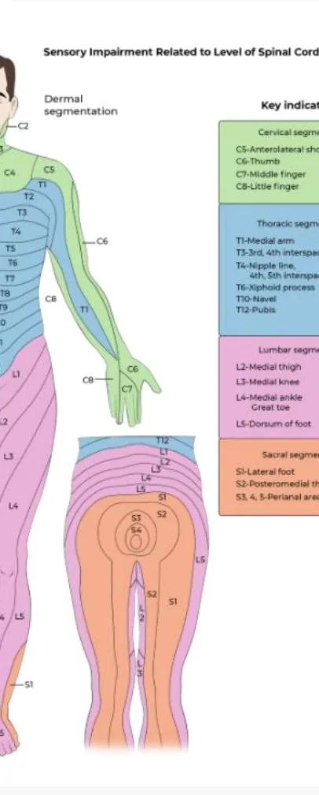

---

<!-- page:73 -->

## Contraindicações

### Contraindicações Absolutas

- Recusa do paciente
- Infecção no local de punção
- Aumento da PIC (**hipertensão intracraniana**)
- Tatuagem no local de punção

### Contraindicações Relativas

- **Plaquetas < 50.000**
- Estenose aórtica
- Estenose de canal vertebral
- Cirurgia de coluna
- Esclerose múltipla
- **Coagulopatias** (DvW e hemofilia — autorizado se FvW ou F8 > 0,5 UI/mL)
- Instabilidade hemodinâmica

---

<!-- page:74 -->

## Fibras Nervosas — Bloqueio Progressivo

| Tipo | Diâmetro (μm) | Função | Ordem do Bloqueio |
|---|---|---|---|
| **Aα** | 12-20 | Proprioceptores musculares | — |
| **Aβ** | 5-12 | Mecanoreceptores do tato | — |
| **Aγ** | 3-6 | Tônus muscular | — |
| **Aδ** | 2-5 | Dor e temperatura | — |
| **B** | < 3 | Sistema nervoso simpático | — |
| **C** | 0,4-1,2 (unmyelinated) | Temperatura, dor | — |

**Recuperação do bloqueio segue a ordem inversa.**

Adaptado de Snell (2010)

---

<!-- page:75 -->

## Agulhas — Raquianestesia vs. Peridural

**Tamanhos disponíveis**: 18g, 19g, 20g, 21g, 22g, 23g, 25g, 26g, 27g, 29g

### Raquianestesia

- Agulhas **não cortantes** ("ponta de lápis")

### Anestesia Peridural

- **Agulha cortante Tuohy**

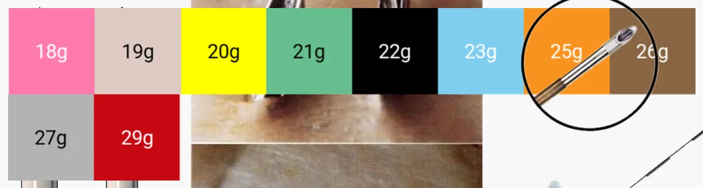

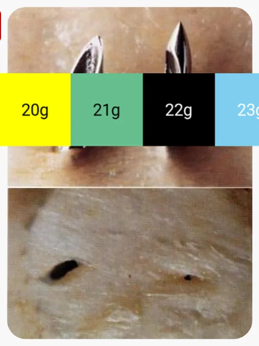

---

<!-- page:76 -->

## Raquianestesia: Altura do Bloqueio

**Fatores medicamentosos: Baricidade da Solução**

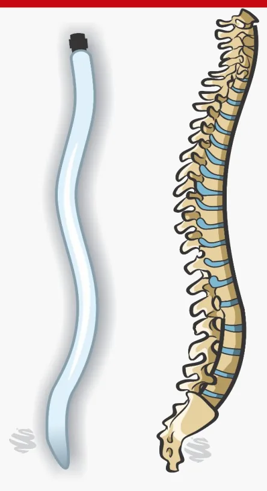

---

<!-- page:77 -->

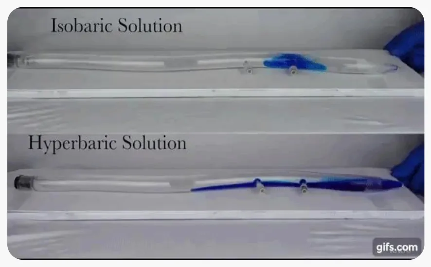

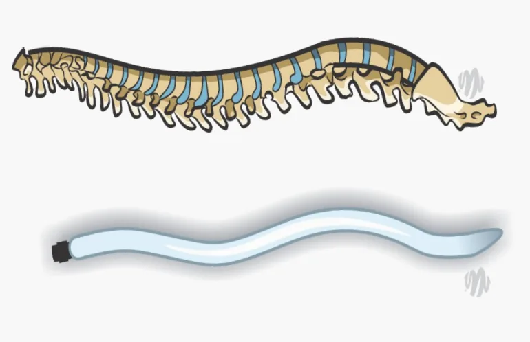

---

<!-- page:78 -->

## Baricidade da Solução — Isobárica vs. Hiperbárica

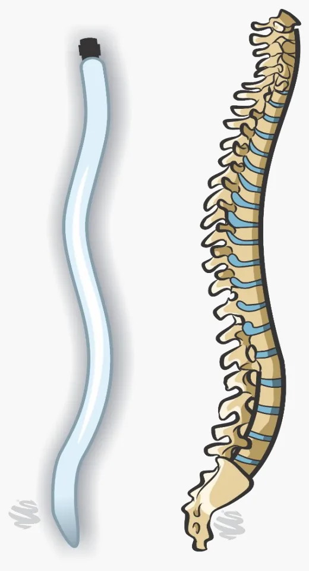

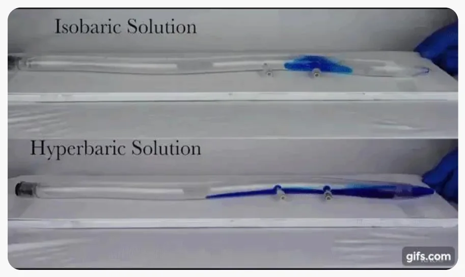

---

<!-- page:79 -->

## Efeitos do Bloqueio de Neuroeixo

---

<!-- page:80 -->

## Efeitos Sistêmicos

### Sistema Nervoso Simpático (Toracolombar: T1-L2)

**Bloqueio de fibras T1-T5** → bradicardia e hipotensão

**Efeitos**:
- Vasodilatação
- Queda da resistência vascular sistêmica
- Bradicardia refratária e bloqueio atrioventricular

### Sistema Respiratório

**Bloqueio dos músculos expiratórios**:
- VRE e CVF → redução (sensação de falta de ar)
- Possível dispneia

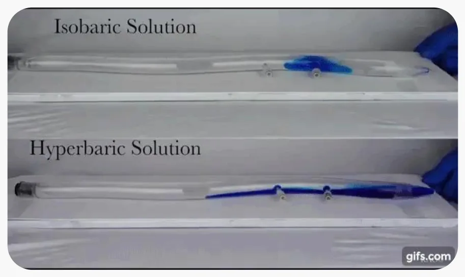

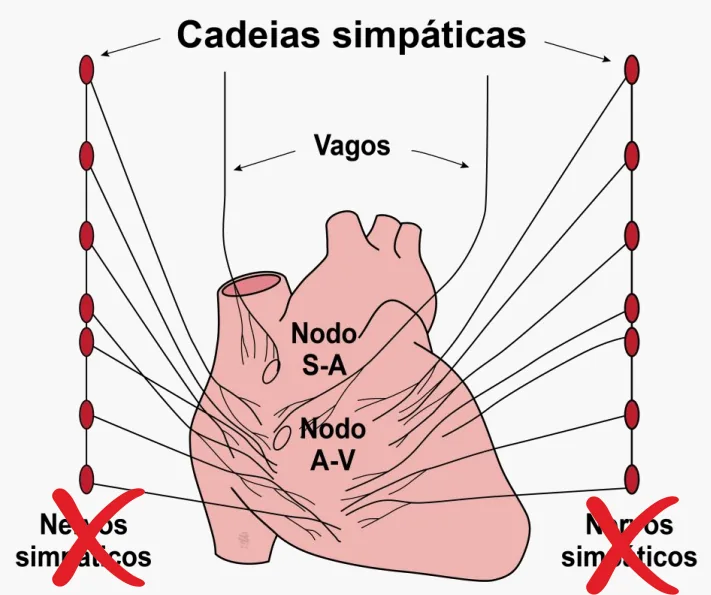

---

<!-- page:81 -->

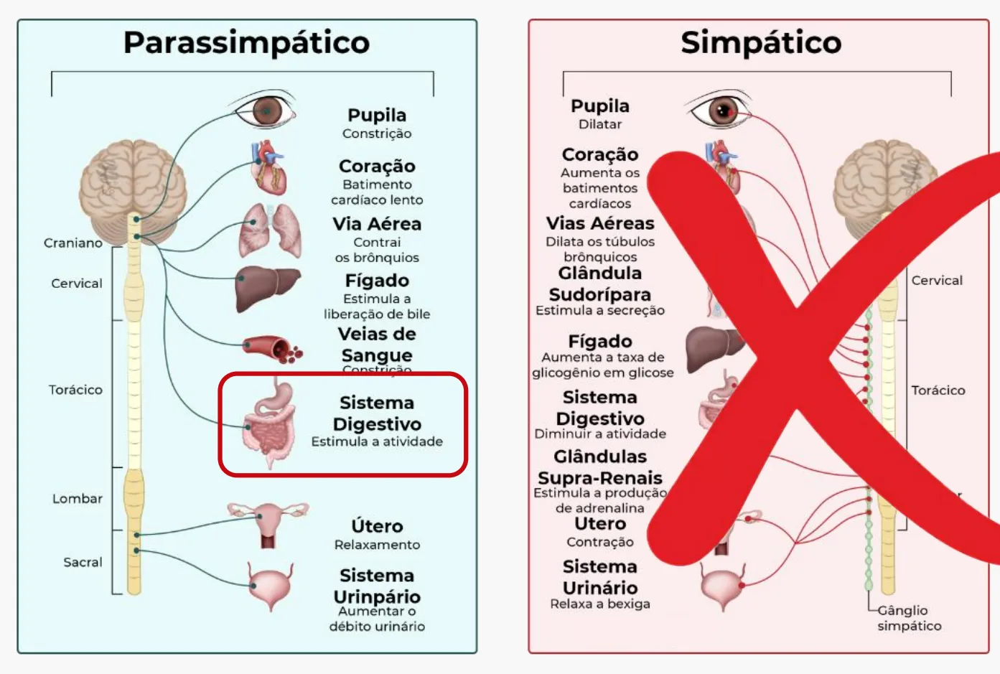

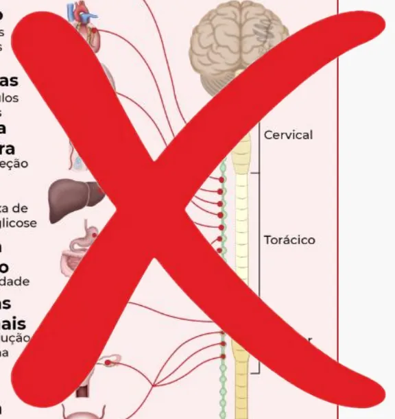

---

<!-- page:82 -->

## Complicações da Raquianestesia

> ⚠️ Dados de tabela ambíguos no OCR original. A tabela original de "Complicações da raquianestesia" apresenta categorias de gravidade (Menor, Moderado, Maior/Principal) intercaladas com listagens de complicações sem correspondência clara. Conteúdo listado em texto corrido abaixo por severidade.

### Complicações Menores

- Náusea e vômito
- Tremendo
- Coceira
- Deficiência auditiva leve transitória
- Retenção urinária

### Complicações Moderadas

- Falha na coluna vertebral
- Cefaleia pós-punção dural
- Trauma direto com agulha

### Complicações Maiores/Principais

- Infecção (abscesso, meningite)
- Hematoma do canal vertebral
- Isquemia de medula espinhal
- Síndrome da cauda equina
- Aracnoidite
- Lesão do nervo periférico
- **Raquianestesia total**
- **Colapso cardiovascular**
- **Morte**

Adaptado de: NYSORA

---

<!-- page:83 -->

## Cefaleia Pós-Punção Dural

**Evento adverso mais frequente (24-48h pós-punção dural)**

### Apresentação Clínica

- **Dor fronto-temporo-occipital** que piora na posição sentada e ereta
- Piora com tosse
- Melhora com o decúbito
- Associado ou não a rigidez de nuca

### Fatores de Risco

- Sexo feminino
- Idade (10-50 anos)
- Gestação
- Desidratação
- Histórico de cefaleia prévia
- Agulha utilizada
- Número de punções

### Tratamento

- **Leve**: repouso, hidratação, cafeína e analgésicos
- **Incapacitante**: **blood patch** (20 mL injetado no mesmo nível ou abaixo do local)

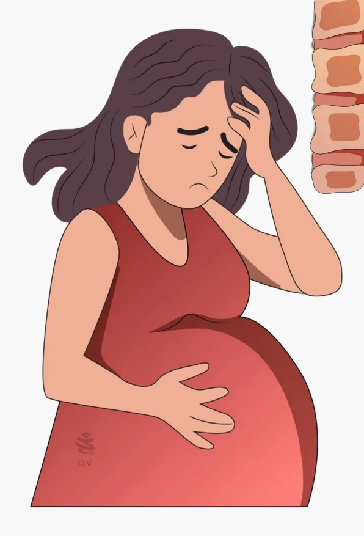

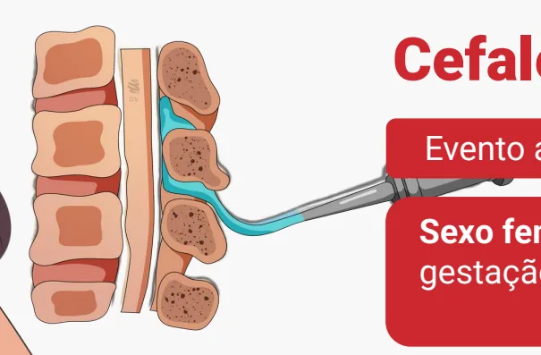

---

<!-- page:84 -->

## Como Fazer o Procedimento

---

<!-- page:85 -->

## Como Fazer a Raquianestesia

---

<!-- page:86 -->

## Separar o Material

**Equipamento necessário**:

- Pinça
- Gaze
- Clorexidina alcoólica (assepsia)
- Campo estéril
- Seringas de 5 mL e 10 mL
- Agulhas
- Anestésicos locais
- Opioides (se necessário)

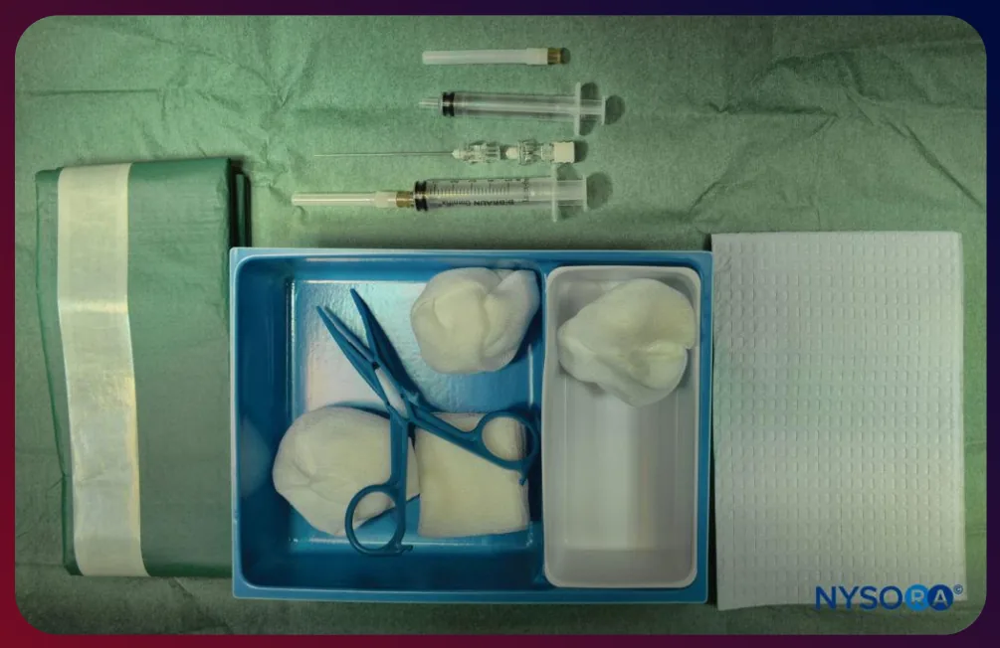

---

<!-- page:87 -->

## Posicionar o Paciente

- **Posição sentada** ou **decúbito lateral**
- Palpar a linha de Tuffier
- Palpar a linha média
- Marcar o local de punção

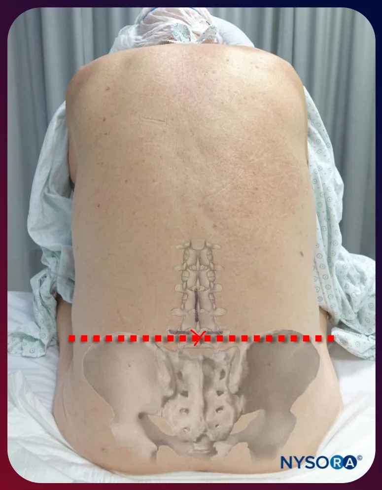

---

<!-- page:88 -->

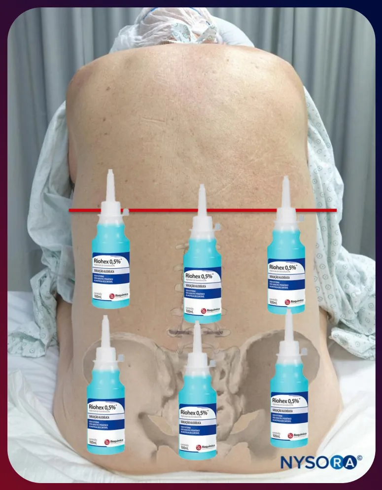

---

<!-- page:89 -->

## Acertando o Local — Palpação de Pontos de Referência

- Palpar a linha de **Tuffier**
- Palpar a linha **média**
- Marcar o local de punção

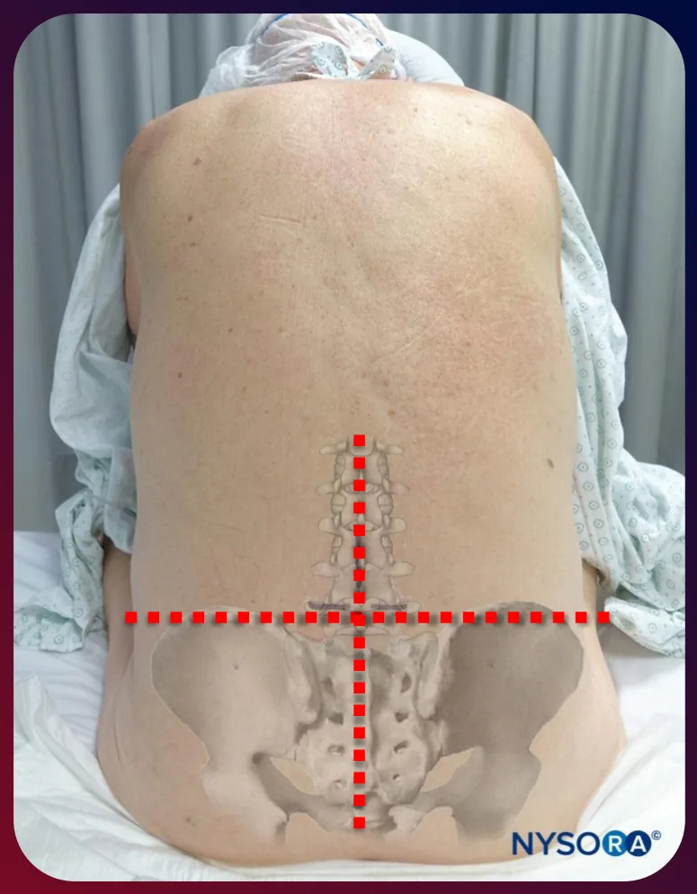

---

<!-- page:90 -->

## Realizando a Punção

**Procedimento**:

1. Puncionar com a agulha de raquianestesia
2. Injetar a solução de raquianestesia

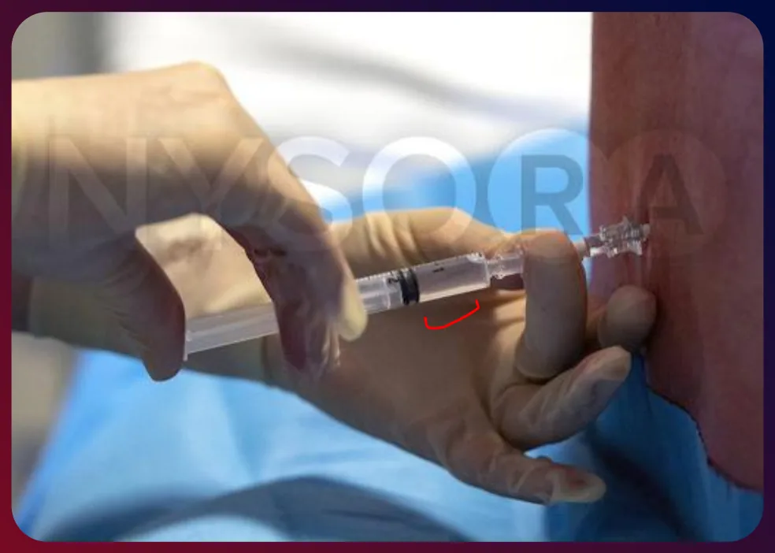

---

<!-- page:91 -->

---

<!-- page:92 -->

## Referências Anatômicas de Palpação

- **C7** — Processo espinhoso na cervical posterior
- **T3** — Espinha da escápula
- **T7** — Borda inferior da escápula
- **L4 (Tuffier)** — Borda superior da crista ilíaca
- **S2** — Espinha ilíaca póstero-superior

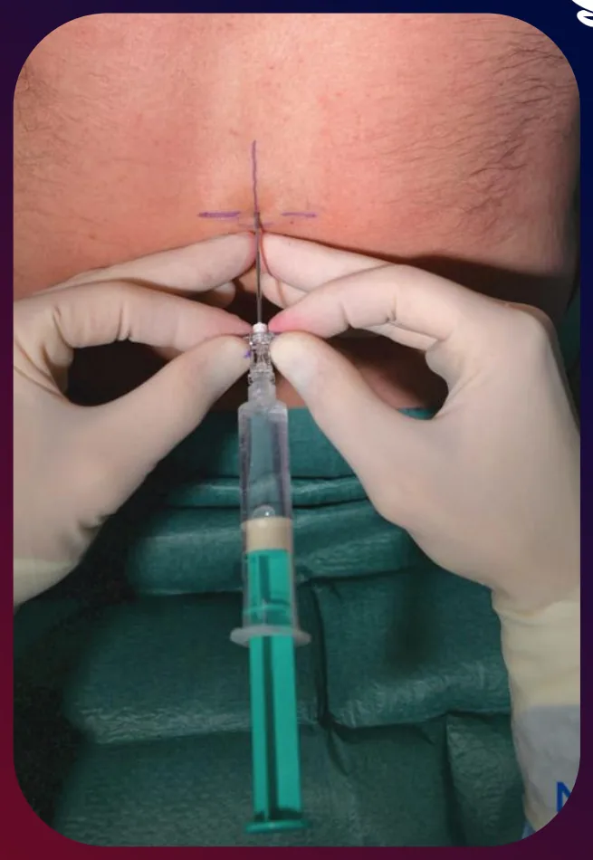

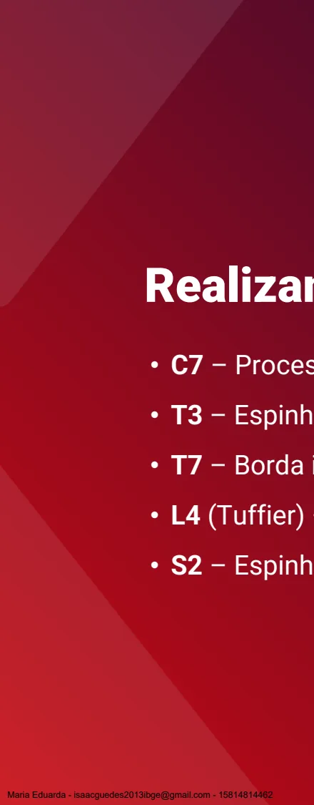

---

<!-- page:93 -->

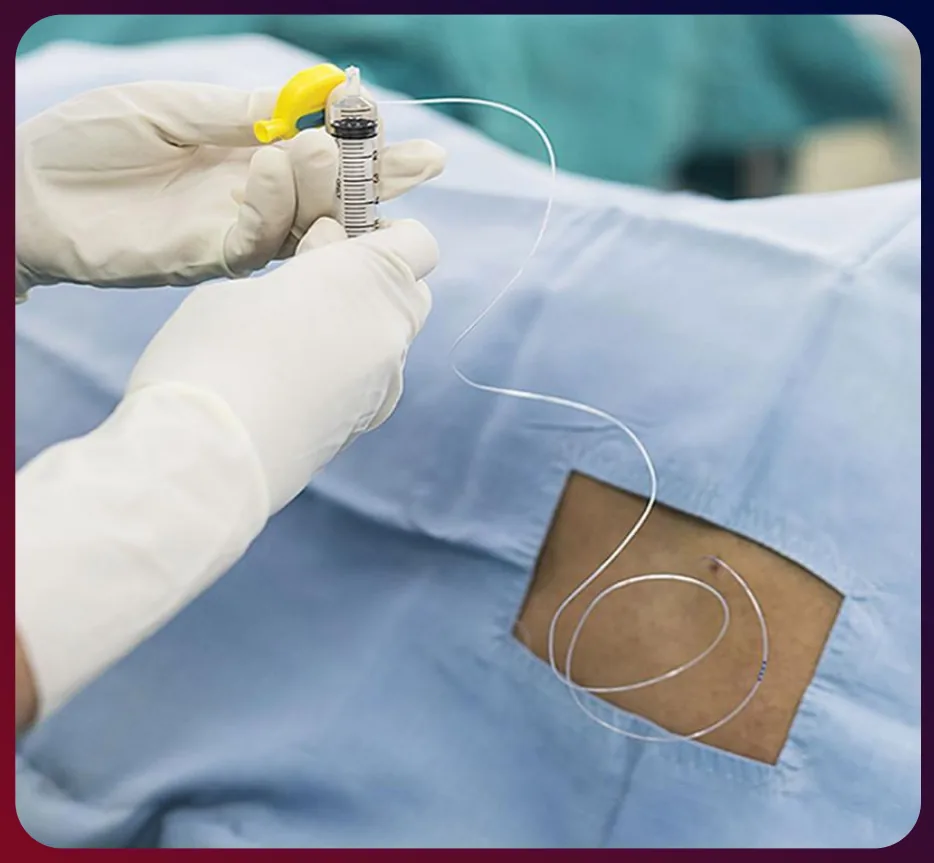

---

<!-- page:94 -->

## Como Fazer a Peridural

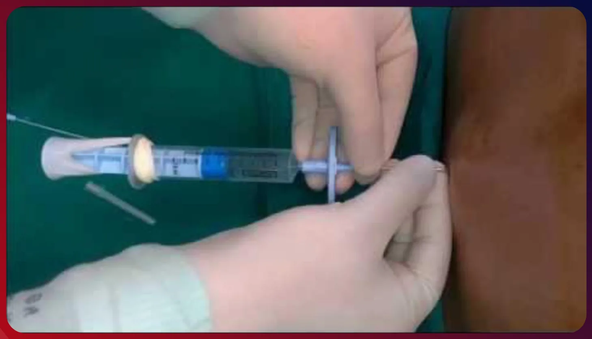

---

<!-- page:95 -->

## Dose Teste na Epidural

A **dose teste contendo 15 mcg de adrenalina em 3 mL de AL** é o melhor método farmacológico para detectar injeção intravascular.

### Cálculo de Concentração de Adrenalina

- **1:200.000** = 1 g em 200.000 mL
- = 1.000.000 mcg / 200.000 mL
- = **5 mcg/mL**

### Risco de Intoxicação

**Injeção inadvertida de anestésico local em circulação sistêmica** → risco significativo.

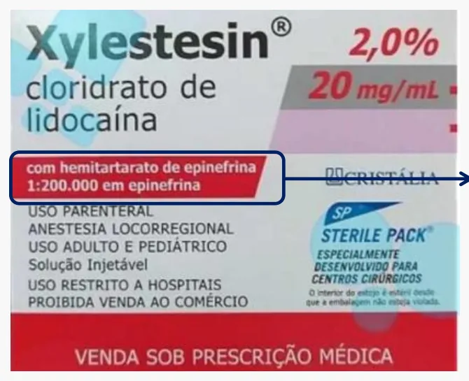

---

<!-- page:96 -->

## Raquianestesia vs. Peridural — Comparação

| Critério | Raquianestesia | Peridural |
|---|---|---|
| **Local** | Espaço subaracnóideo | Espaço acima da dura-máter (espaço peridural) |
| **Latência** | Mais rápida (minutos) | Mais lenta (maior resistência das meninges) |
| **Bloqueio** | Completo | Parcial ajustável |
| **Sensação motor + sensiti** | — | Depende da dosagem |
| **Risco de cefaleia pós-punção** | Maior risco | Menor risco (se ausência de punção acidental da dura-máter) |
| **Altura de cobertura** | Cirurgias abaixo da linha umbilical (T10) | Cirurgias de diversas alturas, inclusive torácica alta |
| **Duração** | Fixa (2-4 horas) | Ajustável (se uso de cateter) |

---

<!-- page:97 -->

## Questão MEDCOF — Anatomia 2025

**No adulto, a punção lombar:**

**A)** Realizada na linha traçada entre as espinhas ilíacas ântero-superiores, sempre coincide com o espaço L2-L3

**B)** Apresenta como contra-indicação relativa a recusa do paciente e a presença de [tatuagem no local de punção → contraindicação **absoluta**]

**C)** Realizada através do acesso lateral evita a penetração da agulha nos ligamentos interespinhoso e amarelo, o que poderão estar calcificados nos pacientes mais idosos

**D)** Realizada abaixo de L2 são virtualmente isentas de risco de lesão da medula espinal

---

<!-- page:98 -->

## Gabarito MEDCOF — Anatomia 2025

- A: Coincide com a linha de Tuffier, que fica ao nível de L4 (não L2-L3)
- B: Tatuagem no local = contraindicação **absoluta**, não relativa
- C: Não evita a punção do ligamento
- **D: CORRETA** — A medula espinhal termina ao nível de L2 (cone medular); abaixo disso só há cauda equina

---

<!-- page:99 -->

## Anestesiologia no ENAMED

---

<!-- page:100 -->

---

<!-- page:101 -->

## Resumo — Avaliação Pré-operatória

### Pacientes com Risco de Sensibilização ao Látex

- Pacientes submetidos a **múltiplas cirurgias** e/ou com **sondagens repetidas**
- Profissionais da área da saúde e/ou trabalhadores que utilizam luvas no exercício da profissão
- História de reações a alimentos como **banana, kiwi, abacaxi, batata e frutas secas** (síndrome látex-fruta)

### Reações Alérgicas em Anestesia

A maior parte das reações alérgicas em anestesia são causadas por:

- **Relaxantes musculares** (58%)
- **Látex** (17%)
- **Antibióticos** (cefalosporinas, 15%)
- **Colóides** (gelatinas, 4%)

### Alergia ao Látex

Deve ser suspeitada toda vez que uma **parada cardiorrespiratória inexplicada** ocorre durante anestesia.

---

<!-- page:102 -->

## Classificação ASA

---

<!-- page:103 -->

### ECG Pré-operatório — Recomendações

- **≥ 80 anos**: sempre solicitar
- **40-80 anos**: considerar
- **< 40 anos**: não é rotina

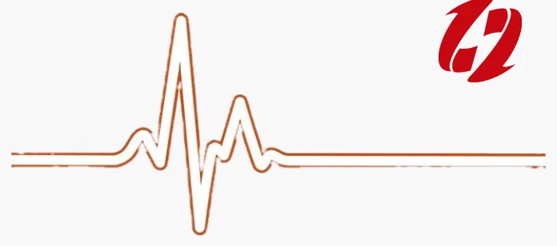

---

<!-- page:104 -->

## Jejum Pré-operatório

- **2h** — Líquidos claros/sem resíduos (água, sucos de fruta sem polpa, bebidas carbonatadas e chá claro). O tipo de líquido é mais importante do que o volume.

- **8h** — Refeições sólidas gordurosas

- **50g de Maltodextrina** — pré-operatório

### Classificação de Mallampati

| Classe | Estruturas Visíveis |
|---|---|
| **I** | Palato mole, fauce, úvula e pilares amigdalianos visíveis |
| **II** | Palato mole, fauce e úvula visíveis |
| **III** | Palato mole e base da úvula visíveis |
| **IV** | Apenas palato duro visível |

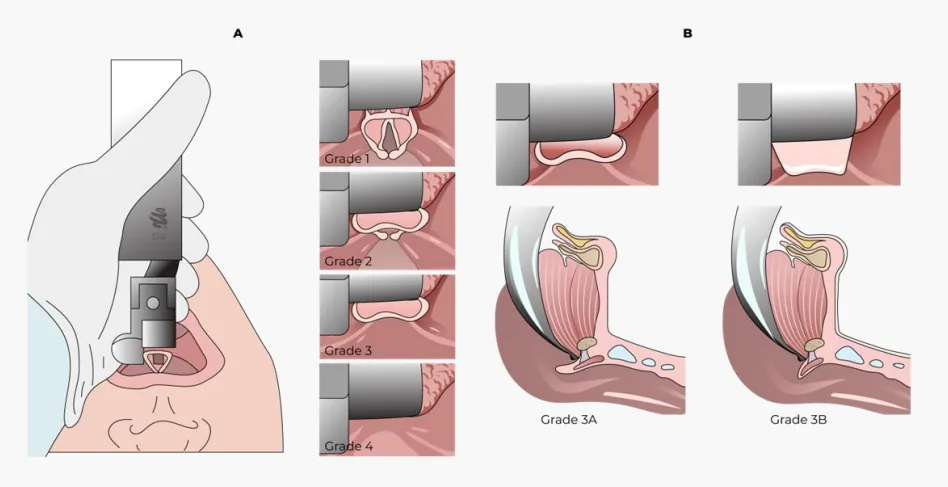

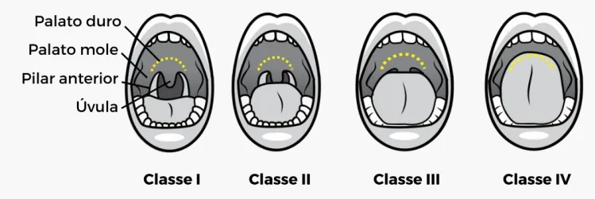

---

<!-- page:105 -->

## Preditores de Dificuldade de Via Aérea

**Ventilação Difícil (OBESAM)**:

- **O** — Obesity (Obesidade, IMC > 26)
- **B** — Beard (Barba)
- **E** — Elderly (Envelhecimento, > 55 anos)
- **S** — Snores (Roncos)
- **A** — Absent teeth (Ausência de dentes)
- **M** — Mark seal (Vedação da máscara)

**Intubação Difícil (LEMON)**:

- **L** — Look externally
- **E** — Evaluate "3-3-2"
- **M** — Mallampati
- **O** — Obese/Obstruction
- **N** — Neck mobility
- **U** — Upper lip bite test

Medidas: Abertura da cavidade oral, distância hiomentoniana, distância tireo-hioide

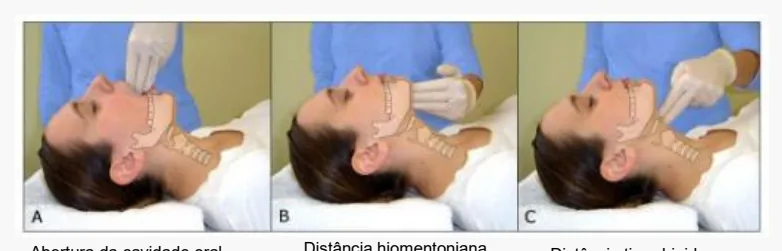

---

<!-- page:106 -->

## Anestesia Geral (Agentes Opioides, Indutores e BNM)

---

<!-- page:107 -->

## Opioides — Resumo

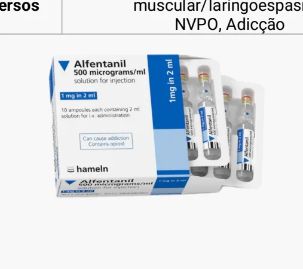

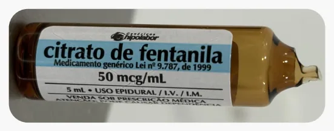

---

<!-- page:108 -->

## Agentes Inalatórios

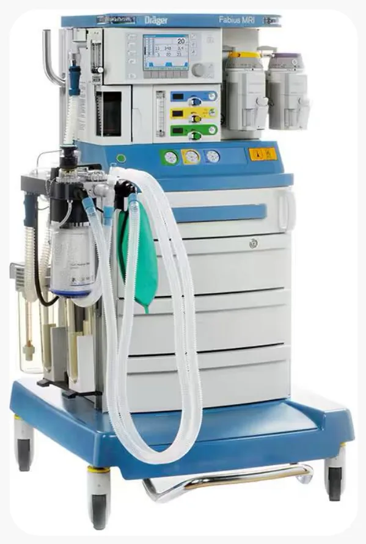

---

<!-- page:109 -->

## Agentes Venosos — Tabelas Resumidas

### Midazolam (Hipnótico)

| Parâmetro | Valor |
|---|---|
| Mecanismo principal | Agonista GABAa |
| Concentração | 5 mg/mL (0,5%) e 1 mg/mL (0,1%) |
| Via de administração | IV, IM |
| Dose habitual (IOT) | 0,2-0,4 mg/kg IV |
| Efeitos adversos | Delirium, apneia, hipotensão, intoxicação |

### Propofol (Hipnótico)

| Parâmetro | Valor |
|---|---|
| Concentração | 10 mg/mL (1%) |
| Via de administração | IV |
| Dose habitual (IOT) | 1-2 mg/kg IV |
| Efeitos adversos | Hipotensão, apneia, dor à injeção, síndrome da infusão |

---

<!-- page:110 -->

## Etomidato (Hipnótico) — Resumo

| Parâmetro | Valor |
|---|---|
| Concentração | 2 mg/mL (0,2%) |
| Via de administração | IV |
| Dose habitual (IOT) | 0,3 mg/kg IV |
| Efeito principal | Inibição da 11β-hidroxilase (risco de insuficiência adrenal — tópico mais frequente) |

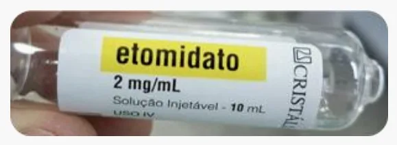

---

<!-- page:111 -->

## Cetamina (Hipnótico) — Resumo

| Parâmetro | Valor |
|---|---|
| Mecanismo principal | Antagonista NMDA |
| Concentração | 50 mg/mL (5%) |
| Via de administração | IV, IM, IN, VO |
| Dose habitual (IOT) | 1-2 mg/kg IV |
| Efeitos adversos | Sialorreia, ↑FC, ↑PA |

## Dexmedetomidina (Hipnótico) — Resumo

| Parâmetro | Valor |
|---|---|
| Mecanismo principal | Alfa2-agonista |
| Concentração | 200 mcg/mL (0,02%) |
| Via de administração | IV, IM, IN |
| Dose habitual (IOT) | Ataque: 0,5-1 mcg/kg (5-10 min); Manutenção: 0,2-1 mcg/kg/h IV |
| Efeitos adversos | Bradicardia, hipo/hipertensão |

---

<!-- page:112 -->

## Quando Não Usar a Succinilcolina?

- **História pessoal ou familiar de hipertermia maligna**
- **Alto risco de hipercalemia** grave (cautela nos DRC)
- **Doença neurodegenerativa** envolvendo denervação (aumenta o risco de hipercalemia)
- **Distrofia muscular** (miastenia gravis)
- **AVE/TRM** com mais de 72 horas até 6 meses
- **Queimadura** com mais de 48-72 horas
- **Rabdomiólise**
- **Hipercalemia grave** (com alterações eletrocardiográficas)
- **Sepse intra-abdominal** > 5 dias
- **Cautela em pacientes com glaucoma de ângulo estreito** (aumenta PIO)

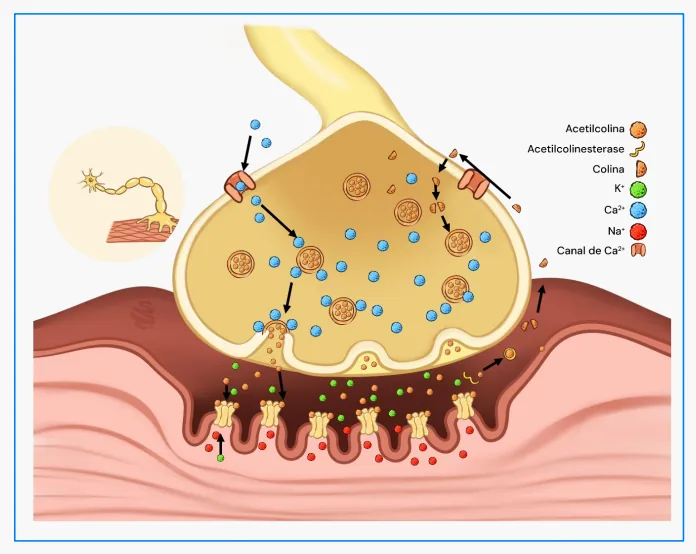

---

<!-- page:113 -->

---

<!-- page:114 -->

## Camadas de Acesso — Raquianestesia e Peridural

Espaço subaracnóideo → estruturas do SNC / Espaço peridural

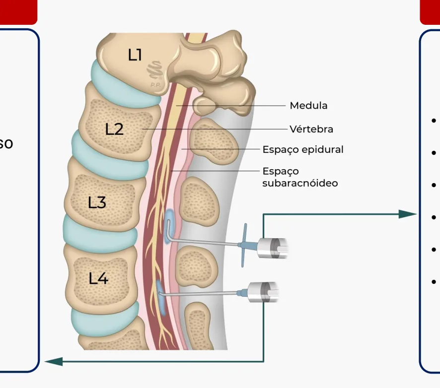

---

<!-- page:115 -->

## Diferenças Raquianestesia vs. Peridural

> ⚠️ Dados de tabela ambíguos no OCR original. A comparação original apresenta múltiplas linhas fragmentadas com texto OCR ilegível. Mantida a tabela comparativa consolidada da página 96 acima, que resume as diferenças principais com segurança.

---

<!-- page:116 -->

## Cefaleia Pós-Punção Dural — Resumo

**Evento adverso mais frequente (24-48h pós-punção dural)**

- Dor **fronto-temporo-occipital** que piora na posição sentada e ereta
- Piora com tosse
- Melhora com o decúbito
- Associado ou não a rigidez de nuca

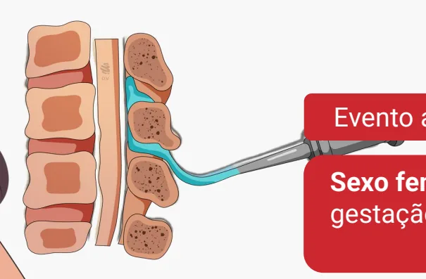

---

<!-- page:117 -->

## Bons Estudos!
