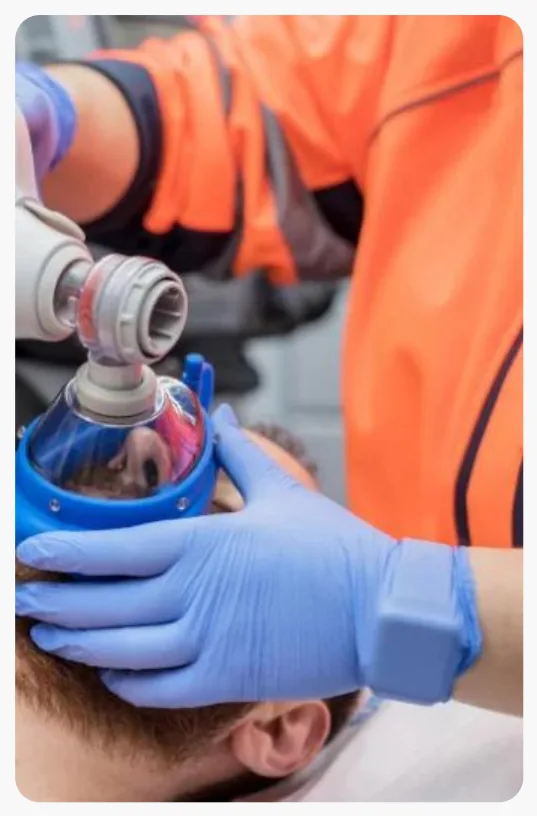
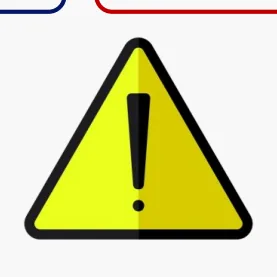
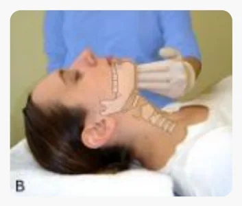
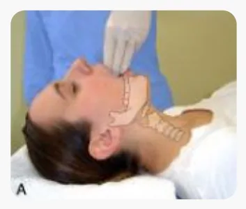
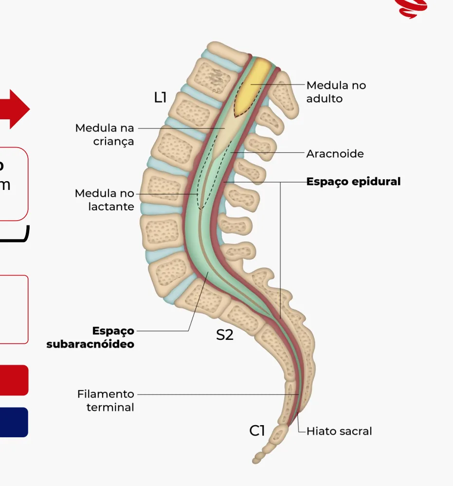

# Avaliação Pré-anestésica

<!-- page:1 -->

## Anestesiologia

## no ENAMED

## Dr. Luan Marinho

## Anestesiologista pelo H. Sírio-Libanês

---

<!-- page:2 -->

## NESSA AULA

## REVISAREMOS

## o Avaliação pré-operatória

o Medicações anestésicas

## o Raquianestesia e Peridural

---

<!-- page:3 -->

## Anestesiologia no ENAMED

---

<!-- page:4 -->

Estado de Saúde: Anamnese e Exame Físico

---

<!-- page:5 -->

## Estado de Saúde: Anamnese e Exame Físico

## Tabagismo

## Um período ≥ 4 semanas é necessário para reduzir as

## complicações respiratórias e que um período de pelo

## menos três a quatro semanas é necessário para reduzir

## as complicações relacionadas à cicatrização da FO

## Pacientes com risco de sensibilização ao látex

## Crianças com defeitos do tubo neural, em

## especial meningomielocele

## Pacientes submetidos a múltiplas cirurgias e/ou com

## sondagens repetidas

## Profissionais da área da saúde e/ou trabalhadores que

## utilizam luvas no exercício da profissão

## História de reações a alimentos como banana, kiwi

## abacaxi, batata e frutas secas. (síndrome látex-fruta)

---

<!-- page:6 -->

## A maior parte das reações alérgicas em anestesia são

## causadas por relaxantes musculares (58%), seguidos

## pelo látex (17%), antibióticos (cefalosporinas, 15%) e

## colóides (gelatinas, 4%)

---

<!-- page:7 -->

## PCR Inexplicável no intraoperatório → suspeitar de alergia ao látex

---

<!-- page:8 -->

HIPERtermia maligna ACIONAR Anestesia Expressão RyR1 Sintomas Hipertermia Semelhantes aos Rápida de EHS Aquecer Receptores de Ryanodina Danos/falha em múltiplos órgãos Cálcio Rigidez Mioglobinúria Análise Rabdomiólise do SkM Condição autossômica dominante Desencadeada por anestesicos voláteis e/ou succinilcolina

---

<!-- page:9 -->

## Manejo da hipertermia maligna

## Identificando o quadro clínico

## Lesão Muscular HiperCALEMIA Espasmo do masseter

## Sinal mais precoce: taquicardia

## Sinal mais confiável: hipercapnia inexplicável

## E a hipertermia? Pode demorar a surgir

## Em resumo: consequências do hipermetabolismo

---

<!-- page:10 -->

Manejo da hipertermia maligna

## Interromper a exposição!

## O2 100% com fluxo alto + HIPERventilar + substituir o circuito

## + filtros de carvão

## Tratar as outras complicações (acidose, hipercalemia

## arritmias) + UTI nas próximas 24-48 horas

## DANTROLENE 2,5 MG/KG EV BÓLUS RÁPIDO! + 2,5 mg/kg

## EV a cada 5 minutos SN (máx 10mg/kg)

---

<!-- page:11 -->

## QUESTÃO

## AUTORAL ENAMED

## A Hipertermia Maligna é uma patologia em que há elevação da temperatura corporal do indivíduo

rapidamente e eleva o risco de óbito perioperatório. Considerando o tema exposto, assinale a alternativa

## correta

## A) A suscetibilidade à HM é herdada como uma doença autossômica dominante com penetrância variável

## B) Calcula-se que ocorra HM em 1 em 3.000 a 5.000 adultos, submetidos à anestesia loco regional

## C) A mortalidade por HM aumentou para mais de 10% nos últimos 15 anos como resultado da falta de

## tratamento disponível

## D) Um indivíduo suscetível à HM exposto a um anestésico deflagrador provoca uma liberação anormal de

## potássio, que provoca ativação prolongada dos filamentos musculares, culminando em apneia

---

<!-- page:12 -->

rapidamente e eleva o risco de óbito perioperatório. Considerando o tema exposto, assinale a alternativa

---

<!-- page:13 -->

## Estratificação e redução de riscos

## ASA (American Society of Anesthesiologists)

## ASA I (Physical state 1) – Sem comorbidades (0,05-0,08% óbito)

## ASA II (P2) – Comorbidades leves, tabagismo, etilismo (0,27-0,4% óbito)

## ASA III (P3) – Comorbidades graves/mal controladas (1,8 – 4,3% óbito)

## ASA IV (P4) – Condição sistêmica grave com ameaça à vida (7,8- 23% óbito)

## ASA V (P5) – Moribundo (9,4-50% óbito)

## ASA VI (P6) – Morte Encefálica

## Emergência = E

## Exemplo: Paciente, 23 anos, não gestante, sem comorbidades ou

## vícios em programação de uma cirurgia ortopédica pós trauma

## automobilístico, nesse caso, seu “P” seria P1E

---

<!-- page:14 -->

## ASA Definição Exemplos

## Paciente saudável, não tabagista

## I Paciente saudável

## Não etilista ou consumo mínimo de álcool

## Tabagista ativo, etilista social, gravida, obesos (IMC entre 30 e 40)

## II Doença sistêmica leve

## hipertensão controlada, diabetes controlado, doença pulmonar leve

## Diabetes não controlado, hipertensão não controlada, hepatite ativa

## III Doença sistêmica grave dependência alcoólica, uso de marcapasso, dialítico renal crônico com

## diálises irregulares, IAM, AVC > 3 meses

## Compensado pós-diálise

## IAM, AVC < 3 meses, isquemia cardíaca atual, disfunção valvar severa

## Doença que impõe risco

## IV sepse, doente renal crônico com diálises irregulares, pacientes com

## constante à vida

## fração de ejeção reduzida

## Moribundo com baixas

## Aneurisma roto de abdome/tórax, politraumatizado grave, sangramento

## V chances de sobreviver

## intracraniano com efeito de massa, isquemia mesentérica funcional

sem intervenção cirúrgica Paciente com morte encefálica com proposta cirúrgica de retirada de VI Doador de órgãos órgãos para doação

---

<!-- page:15 -->

## Homem, 49 anos, será submetido a colectomia subtotal devido a doença diverticular. O

## paciente tem hipertensão arterial e diabetes mellitus controlados com uso correto e regular

## de medicamentos. Qual a classificação pré-operatória desse paciente conforme os critérios

## de risco cirúrgico anestésico da Sociedade Americana de Anestesiologistas (ASA)?

## A) ASA I

## B) ASA II

## C) ASA IV

## D) ASA III

---

<!-- page:16 -->

---

<!-- page:17 -->

## Exames pré-operatórios

---

<!-- page:18 -->

## Exames laboratoriais

## Devo solicitar o check-up de rotina?

Hemograma Coagulograma RX tórax Eletrólit Idosos Hepatopatas DPOC Fármac

## Ausculta

Trauma Coagulopata Nefropat

## alterada

Uso de Cirurgias de Coagulopata Diabétic

## quimioterapia tórax

Alterações Hemorragia Fármacos Tx. Ren da traqueia Cx de Cirurgia Cx. Gran Trauma grande porte cardíaca porte Não há evidência convincente que radiografia de tórax for importantes para avaliar risco perioperatór Teste de tos

## gravidez

## Validade?

## Sempre!

cos

## (mulheres

## A ASA não encontrou

## em idade

tas fértil) evidências na literatura

## que permitam definir um

prazo de validade dos cos

Aceitáveis resultados de nal exames realizados até 6 meses antes do nde procedimento e anestésico-cirúrgico.

rnece informações rio.

---

<!-- page:19 -->

## ECG pré-operatório

## Quando solicitar?

## Cirurgias cardiovasculares Cirurgia de moderado/alto risco

## Sempre solicitar Considerar, mesmo se ASA I

## Cirurgias de baixo risco

## Depende da idade!

## >= 80 anos 40- 80 anos < 40 anos

Sempre solicitar Considerar Não é rotina

---

<!-- page:20 -->

## Estratificação de risco pré-operatório

---

<!-- page:21 -->

## Estratificação de risco cardíaco (LEE)

## 1 Exame pré-OP Creatina > 2mg/dL

## 3s Tipo de cirurgia Intraperitoneal, intratorácica e vascular suprainguinal

## 4 Fatores de risco DAC, ICC, DCV, DM insulinodependente

## Obs

## Doença arterial coronária (ondas Q no ECG, e/ou sintomas de isquemia, e/ou teste

## não invasivo para isquemia alterado, e/ou uso de nitrato)

## ICC (quadro clínico sugestivo e/ou radiográfia de tórax congestão pulmonar)

## Estratificação de risco cardiovascular perioperatório

## RITA LEE

## 1 = baixo risco

## >= 2 mas sem angina ou ICC Limitante – risco intermediário

## 1234

>=2 mas com angina ou ICC classe funcional 3 ou 4 – risco alto

---

<!-- page:22 -->

## Estratificação e redução de risco

## Capacidade funcional

## Equivalente metabólico → MET

## Quantos METs pra liberar

## para a cirurgia?

---

<!-- page:23 -->

## 4 METs

---

<!-- page:24 -->

## METs Descrição

## 1 METs Ficar deitado, sentado, vendo TV, digitando ou falando ao telefone

## 2 METs Lavar, passear ou pendurar roupas, caminhar de casa para o carro ou para pegar o ônibus

## 3 METs Lavar carro, limpar garagem, carregar criança pequena de cerca de 7kg

## 4 METs Varrer garagem, andar de Bicicleta

## 5 METs Caminhar carregando peso de meio a 7kg em subidas

## 6 METs Fazer faxina, nadar, caminhar em ritmo rápido

## 7 METs Futebol casual, correr ou nadar em velocidade lenta

## 8 METs Correr a 8,3 km/h

## 9 METs Futebol competitivo

## 10 METs Correr a 11 km/h

## 11 METs Ciclismo estacionário com esforço vigoroso, pular corda

## 12 METs Correr a aproximadamente 13 km/h

---

<!-- page:25 -->

## Jejum

---

<!-- page:26 -->

## Jejum pré-operatório

## 2h — Líquidos claros/sem resíduos (água

## sucos de fruta sem polpa, bebidas

## carbonatadas e chá claro. O tipo de líquido

é mais importante do que o volume.

## 4h — Leite materno

## 6h — Refeições leves/Fórmula infantil

- 8h — Refeições sólidas gordurosas É possível abreviar o jejum?

## 50g de Maltodextrina pré-operatório

## Solução de carboidratos 2h antes

## Pacientes sem riscos de atraso do

esvaziamento gástrico

## Benefícios

## Seguro, diminui REMIT, resistência

## insulínica e estresse cirúrgico

---

<!-- page:27 -->

## Quanto ao tempo de jejum pré-operatório recomendado, assinale a alternativa correta

## A) Jejum mínimo de todo tipo de alimentos sólidos por 12 horas antes do procedimento a

## ser realizado sob anestesia geral

## B) Jejum mínimo de 2 horas para líquidos claros antes do procedimento a ser realizado

## sob anestesia geral

## C) Jejum mínimo de 2 horas para leite materno antes do procedimento a ser realizado

## D) Jejum mínimo de todo tipo de alimentos sólidos por 8 horas antes do procedimento a

---

<!-- page:28 -->

---

<!-- page:29 -->

## Risco de broncoaspiração

## Quando me preocupar?

## Abdome agudo Vagotomia cirúrgica

## Oclusão intestinal Trabalho de parto ativo

## Íleo paralítico DRC ou Uremia

## HAD ativa Doença de Parkinson

## Estenose esofágica Seq. neurológica c/ disfasia

## Megaesôfago, acalásia História de regurgitação

## Neoplasia esofagogástrica Análogos de GLP-1 (Ozempic, Mounjaro, Saxenda)

## Hístória de Gastroparesia Politrauma

## DM (neuropatia / disautonomia) TCE ou HIC

---

<!-- page:30 -->

Maria

---

<!-- page:31 -->

## ANÁLOGO DE GLP- 1 → ATRASA O ESVAZIAMENTO GÁSTRICO

## TEMPO DE JEJUM NÃO É CONFIÁVEL

## INDUZIR EM SEQUÊNCIA RÁPIDA

## ORIENTAR A SUSPENSÃO NO PRÉ-OPERATÓRIO

## Orientação da SBA

## Liraglutida: 2 dias

## Dulaglutida: 15 dias

## Tirzepatida (Mounjaro): 15 dias

## Semaglutida (Ozempic): 21 dias

## O tempo leva em consideração o tempo de 3 meias vidas

---

<!-- page:32 -->

## USG Gástrico Point-Of-Care

## O antro gástrico é o melhor alvo para avaliar o conteúdo gástrico, pois

## se dilata de forma linear com aumento do volume gástrico e fica em um

## local dependente da gravidade. Realizar com o paciente em posição

## supino e decúbito lateral direito

---

<!-- page:33 -->

---

<!-- page:34 -->

## Paciente com estômago cheio

e o s n s o n e s n a le o a r a lít ic o a t i a E s t e n o s e e s o ic a e a e s a o , a c a l s ia la s ia e s o a o s t r ic a r a d e a s r o p a r e s a e u r o a t ia is a u t o n o m ia n o o s d e r a a o d e p a r o a o o u re m ia o e n a e P a r in s o n e . e u r o l ic a c is a s ia is t r ia e r e u r it a o e m p o n a r o r a m a E o u o a e n d a Paciente com estômago

## O que fazer?

Prop A o cheio

## Intubação em sequência rápida (ISR)

## Drogas de ação rápida (<90 seg)

## Alfentanil/Remifentanil +

pofol/Cetamina/Etomidato + SUX/Rocurônio Intubação com o paciente acordado

## Ansiólise (dexmedetomidina) + Anestesia

## das vias aéreas

---

<!-- page:35 -->

e o s n s o n e s n a le o a r a lít ic o a t i a E s t e n o s e e s o ic a e a e s a o , a c a l s ia la s ia e s o a o s t r ic a r a d e a s r o p a r e s a e u r o a t ia is a u t o n o m ia n o o s d e r a a o d e p a r o a o o u re m ia o e n a e P a r in s o n e . e u r o l ic a c is a s ia is t r ia e r e u r it a o e m p o n a r o r a m a E o u o a e n d a Paciente com estômago

Prop A o cheio

pofol/Cetamina/Etomidato + SUX/Rocurônio Intubação com o paciente acordado

---

<!-- page:36 -->

e o s n s o n e s n a le o a r a lít ic o a t i a E s t e n o s e e s o ic a e a e s a o , a c a l s ia la s ia e s o a o s t r ic a r a d e a s r o p a r e s a e u r o a t ia is a u t o n o m ia n o o s d e r a a o d e p a r o a o o u re m ia o e n a e P a r in s o n e . e u r o l ic a c is a s ia is t r ia e r e u r it a o e m p o n a r o r a m a E o u o a e n d a Paciente com estômago

Prop A o cheio

pofol/Cetamina/Etomidato + SUX/Rocurônio Intubação com o paciente acordado

---

<!-- page:37 -->

e o s n s o n e s n a le o a r a lít ic o a t i a E s t e n o s e e s o ic a e a e s a o , a c a l s ia la s ia e s o a o s t r ic a r a d e a s r o p a r e s a e u r o a t ia is a u t o n o m ia n o o s d e r a a o d e p a r o a o o u re m ia o e n a e P a r in s o n e . e u r o l ic a c is a s ia is t r ia e r e u r it a o e m p o n a r o r a m a E o u o a e n d a Paciente com estômago

Prop A o cheio

pofol/Cetamina/Etomidato + SUX/Rocurônio Intubação com o paciente acordado

---

<!-- page:38 -->

## Avaliação da Via Aérea

---

<!-- page:39 -->

## História prévia de VAD → PRINCIPAL PREDITOR!

## Radioterapia cérvico-facial

## Cirurgias de cabeça, pescoço e/ou coluna cervical

## Condições clínicas associadas

## Diabetes, Artrite reumatoide, bócio, acromegalia, angina de ludwig, espondilite

## anquilosante, Marfan, tumores / abscesso / mal formação facial

Rodrigues WC, et all. Orthodontic-surgical treatment of a patient with Marfan Syndrome and Obstructive Sleep Apnea Syndrome: a case report with a 9-year follow-up. RGO, Rev Gaúch Odontol. 2019;67:e20190050.

---

<!-- page:40 -->

## 35° 80-90°

## 6 - 6,5 cm

## 12,5 cm

## 02 ou + preditores: Possível via aérea difícil

---

<!-- page:41 -->

## Classe I – palato mole, fauce

## úvula e pilares amigdalianos

## visíveis

## Classe II – palato mole, fauce e

## úvula visíveis

## Classe III – palato mole e base

## da úvula visíveis

## Classe IV – palato mole

## totalmente não visível

---

<!-- page:42 -->

## Upper Lip bite test

## Solicitar ao paciente que tente morder o lábio superior com os

## dentes incisivos inferiores

## Bom preditor de laringoscopia difícil

## Especificidade e acurácia superiores a outros testes isolados, como

## a distância tiromentoniana ou a classificação de Mallampati

---

<!-- page:43 -->

## Escala de Comarck-Lehane

## I maior parte da fenda glótica visível

## IIA apenas porção posterior da fenda glótica visível

## IIB apenas cartilagens aritenoides visíveis

## IIIA epiglote visível e passível de elevação

## IIIB epiglote aderida à faringe

## IV nenhuma estrutura laríngea visível

## Classe I Classe II Classe III Classe IV

---

<!-- page:44 -->

## Preditores de Ventilação Difícil

O Obesidade IMC > 26 (sobrepeso) B Barba E Envelhecimento (> 55 anos) S Sons ao ormir “Snores” (Roncos)

E Edentado ar seal e a o a m scara resen a e barba, trauma acial ou anomalias ue i cultam o selamento.

besit bstruction obesi a e obstru o obesi a e ou obstru o as ias a reas su eriores aumentam a i cul a e.

e i a e acientes i osos t m menor t nus muscular e maior risco e i cul a e. o teet aus ncia e entes i culta o a uste a m scara.

ti lun lee a nea ulm es rí i os a neia o sono oen as ulmonares ou a neia o sono i cultam a entila o • Mark seal (vedação da máscara): presença de barba, trauma facial ou anomalias que dificultam o selamento.

- Obesity/Obstruction (obesidade/obstrução): obesidade ou obstrução das vias aéreas superiores aumentam a dificuldade.

- Age (idade): pacientes idosos têm menor tônus muscular e maior risco de dificuldade.

- No teeth (ausência de dentes): dificulta o ajuste da máscara.

- Stiff lung/Sleep apnea (pulmões rígidos/apneia do sono): doenças pulmonares ou apneia do sono dificultam a ventilação

---

<!-- page:45 -->

## Preditores de Intubação Difícil

L Look externally E Evaluate “3-3-2” M Mallampati Abertura da cavidade oral Distância hiomentoniana O Obese / Obstruction N Neck mobility U Upper lip bite test Distância tireo-hioide

---

<!-- page:46 -->

## Anestesia Geral (agentes opioides

## indutores e BNM)

---

<!-- page:47 -->

## Pilares da Anestesia Geral

## Analgesia Hipnose

## Reversibilidade + Segurança

## Imobilidade Homeostase

---

<!-- page:48 -->

## Analgesia

## Classificação dos opióides

## Categoria Substâncias

## Naturais Morfina, Codeína, Papaverina

## Semissintéticos Heroína, Buprenorfina, Hidromorfona

## Sintétitcos Metadona, Meperidina, Fentanil, Sufentanil, Alfentanil, Remifentanil

---

<!-- page:49 -->

## Agentes opioides

## Entendendo os receptores

μ

## Depressão respiratória Prurido Miose Sedação

## κ • Promovem analgesia

## Sedação Miose

## Diminuem ação do SNS

δ

## Antagonista específico

## μ mu ou mi , κ

## Naloxona

## (kappa e δ elta

## Afinidade maior pelo receptor Mu

---

<!-- page:50 -->

## Síndrome do Tórax Rígido (STR)

## É raro, mas acontece!

## Dificuldade de ventilação

μ

## Aumento do tônus muscular +

## Ação Mu no SNC

## fechamento das pregas vocais

## Fatores de risco

## Altas doses de opioide

## Administração rápida

## Uso de Óxido nitroso (N2O)

## Reduzindo o risco

## O pré-tratamento com BNM adespolarizantes ou o uso concomitante pode diminuir a incidência

## e a intensidade da rigidez

---

<!-- page:51 -->

## FENTANIL

## Agonista Mu puro

## Opioide sintético 100x mais potente

## que a morfina

## Altamente lipofílico (rápido início de

## ação = menor latência = pico de efeito

## em 3,6 minutos)

## Dose 4 mcg / kg

## Por ser lipofílico → acumula no

## Paciente 50 kg 200 mcg

## tecido gorduroso → não é bom para

## infusão contínua

## 50 mcg em 1 ml

- Dose habitual IOT: 2 a 5 mcg/kg EV 200 mcg em 4 ml

---

<!-- page:52 -->

## SUFENTANIL

## 4000x mais potente que a morfina

## Muito lipossolúvel → muito potente

## Demora mais que o fentanil para fazer efeito (aprox. 5

## minutos → afinidade pouco menor pelos receptores no SNC

## Dose habitual IOT: 0,25 – 2 mcg/kg

## Dose 0,5 mcg / kg

## Paciente 80 kg 40 mcg

## DILUIR!

## 50 mcg em 1 ml + 09 mL SF 0,9%

## = 5 mcg/ml → 8 ml tem 40 mcg

---

<!-- page:53 -->

## ALFENTANIL

## 10x mais potente que a morfina

## Início de ação mais precoce dos opióides (< 90 segundos)

## Menos lipossolúvel que o fentanil → mais disponível na

## forma não ionizada

## Produz atividade elétrica semelhante a convulsão. Evitar

## em paciente com fator de risco para convulsão

## Produz mais bradicardia e hipotensão

## Dose habitual IOT: 25 – 100 mcg/kg

## Dose 50 mcg / kg

## Paciente 80 kg 4000 mcg

## 500 mcg em 1 ml

## 8 ml de alfentanil

---

<!-- page:54 -->

## REMIFENTANIL

## Rápido início de ação

## Opioide potente que tem como vantagem

## possuir rápida eliminação do organismo →

## metabolizado por esterases plasmáticas

## Diluir 2 mg em 40 ml =

## Não promove analgesia pós-operatória

## 2000 mcg em 40 ml =

## (duração de ação de até 10 minutos)

## Dose: 0,05 – 0,5 mcg/kg/min

## 50 mcg/ml

---

<!-- page:55 -->

Agentes hipnóticos inalatórios

## Óxido Nitroso (N2O)

## “G s ilariante”

## Propriedades analgésicas (NMDA)

## Mantém o drive respiratório!!

## Aumenta risco de NVPO

## Diminui a síntese de B12 (inativa metionina sintetase)

## Gás com efeito estufa

## Alta solubilidade →expansão dos espaços fechados com ar

## no corpo (pneumotórax, ouvido médio intraocular, alças intest..)

## Halogenados (ação GABAérgicA)

## Alcanos: Halotano (obsoleto)

## Éter: Sevoflurano (o mais utilizado), Desflurano, Isoflurano

## Causam depressão miocárdica, broncodilatação, vasodilatação

## cerebral com aumento do FSC e PIC (halogenados)

## Desflurano é o mais poluente ao meio ambiente

---

<!-- page:56 -->

## Agentes hipnóticos venosos

## Midazolam Início de ação

## em 1-3 min

## Benzodiazepínico Agonismo GABA-A Duração aprox. 20 min

## Dose: 0,1 –

## 0,3 mg/kg

## Ação ansiolítica, sedativa e amnésia anterógrada

## Propriedades anticonvulsivantes e antieméticas

## Mínima depressão cardiovascular

## Metabólitos ativos

## Metabolismo hepático Risco de ressedação

## Risco de delirium

## Efeitos adversos

## Hipotensão leve

## Revesor → Flumazenil

---

<!-- page:57 -->

## Propofol

## Perda de consciência Despertar em

## Agonismo GABA-A

## em 1 min. 2-8 minutos

## 10% óleo de soja, 2,25% glicerol e

## Composição

## 1,2% fosfato purificado de ovos

## Depressão do metabolismo do SNC

## Diminuição do FSC e da PIC → neuroprotetor

## Depressão respiratória, broncodilatação e aumento da

## colapsabilidade das vias aéreas

## Depressão cardíaca → hipotensão

## Pode causar dor a infusão

- Ação antiemética e antipruriginosa em doses subRisco de pancreatite aguda;

## hipnóticas (10 a 20 mg)

## Risco de contaminação

---

<!-- page:58 -->

## Síndrome da infusão do propofol

## Doses > 4mg/kg/h por > 48h

## Bradicardia refratária + Esteatose hepática +

## Acidose metabólica + Insuficiência cardíaca

## aguda + Rabdomiólise

---

<!-- page:59 -->

Agentes hipnóticos venosos

## Etomidato

## Início de ação em 2-4 min

## Derivado imidazólico Agonismo GABA-A

## Dose: 0,3 mg/kg

## Medicação mais cardioestável !!

## Ótima opção para pacientes instáveis

## Inibição da 11β-hidroxilase, que pode levar a aumento da

## insuficiência adrenal (é o tópico mais frequentemente abordado)

## Aumento da náusea e vômito pós-operatórios (NVPO)

## Maior risco de convulsões, pois pode reduzir o limiar convulsivo

## Aumento do risco de delirium

## Presença de mioclonias

## Dor à injeção, geralmente maior que a do propofol

---

<!-- page:60 -->

## Cetamina

## Perde a consc. em 1 min

## Antagonista NMDA Anestesia dissociativa + Analgesia

## (N-metil-D-aspartato) Duração de 10 – 15 min

## Ação broncodilatadora

## Mantém os reflexos das vias aéreas

## Mantem o drive respiratório

## Dose

## Hemodinamicamente estável (pode até casusar taquicardia

## Indução: 1 - 2 mg/kg

## e hipertensão) → depende da reserva de catecolaminas

## Analgesia: 0,3 mg/kg

## Aumento da PIC

## Sialorreia

## Risco de crise de esquizofrenia e/ou surtos psicóticos

## Potencial para abusos

---

<!-- page:61 -->

## Dexmedetomidina (Precedex)

## Efeito clínico curto

Agonista α2adrenérgico

- M

## Ataque: 1 mcg/kg em 10 – 20 min

- A

## Manutenção: 0,2 – 0,7 mcg/kg/h

- F

- A

- U

- Pode

- Poliú o

## Deve ser feito em infusão contínua

## Antissialagogo

## Faz um padrão de sono similar ao sono fisiológico

## Ação analgésica

## Utilizado para tratamento de delirium na UTI

e causar Bradicardia e Hipotensão (queda da RVS). úria (inibe o ADH)

---

<!-- page:62 -->

## Bloqueadores neuromusculares

## Mecanismo de ação

## Representação esquemática

## da junção neuromuscular

Fonte: Acervo do Medcof

---

<!-- page:63 -->

## Classificação

## Adespolarizantes

## Principais representates: Rocurônio (0,6 mg/kg / ISR: 1,2 mg/kg)

## e Cisatracúrio (0,1 mg/kg)

## Podem ser subdivididos de acordo com a duração de ação

## Curta: Mivacúrio (20min)

## Intermediária: Cisatracúrio, Rocurônio e Atracurío (30-45 min)

## Prolongada: Pancurônio (120 min)

## Despolarizantes

## Início rápido → excelentes condições para IOT em < 60 segundos

## Curta duração → 5 a 12 minutos

## Dose habitual: 1 - 1,5 mg/kg

## Despolarização prolongada → impede a repolarização completa →

## contrações musculares involuntárias e temporárias (fasciculações)

---

<!-- page:64 -->

## Situações em que pode ocorrer hipercalemia

## após o uso de succinilcolina

## Grandes queimaduras (mais de 30% da superfície corporal)

## Politraumatismos

## Doenças neurológicas associadas a déficits menores: esclerose múltipla, esclerose lateral

## amiotrífica, doença de Parkinson grave, síndrome de Guillian-Barré, polineuropatia, encefalite

## Traumas com denervação: traumatismo medular, hemiplegia, paraplegia

## Infecção com produção de exotoxinas: tétano e botulismo

## Imobilização prolongada: sepse e tratamento prolongado em UTI

## Miopatias (p. ex., distrofia muscular de Duchenne

## Hipovolemia com acidose metabólica grave

## Infecções intra-abdominais graves

---

<!-- page:65 -->

## HCPA-RS 2022

## Paciente de 68 anos, que se encontrava hospitalizado porque será submetido a cirurgia de urgência

## para ressecção de tumor intracraniano, apresentou rebaixamento dosensório e vômitos. Na avaliação

pré-anestésica, foram identificadas cardiopatia isquêmica e insuficiência cardíaca congestiva, classe

## III, que vinham em tratamento regular. Que fármaco, dentre os abaixo, é o de escolha como indutor

## para a anestesia?

## a) Propofol

## b) Fentanil

## c) Etomidato

## d) Dexmedetomidina

---

<!-- page:66 -->

pré-anestésica, foram identificadas cardiopatia isquêmica e insuficiência cardíaca congestiva, classe

---

<!-- page:67 -->

## Bloqueio de Neuroeixo

---

<!-- page:68 -->

## Anatomia

---

<!-- page:69 -->

## Medula no

## Ao nascimento No adulto adulto

## Medula na

## criança

## Aracnoide

## Espaço epidural

Medula termina ao Em 60% dos casos termina ao lactante

## nível de L3 nível de L1. Em 30% termina em

## L2, e em 10% em L3

## Espaço

## Durante o 1º trimestre a medula espinhal vai do forâmen subaracnóideo

## magno até o final da coluna. Ao longo do tempo a coluna

## cresce e alonga-se MAIS do que a medula. Filamento terminal

## Hiato sacral

## RAQUIANESTESIA: punção entre L3-L4 ou L4-L5

## PERIDURAL: qualquer altura a partir da coluna torácica

---

<!-- page:70 -->

Camada RAQUIANESTESIA

## Pele

## Tecido subcutâneo

## Ligamento supra espinhoso

## Ligamento interespinhoso

## Ligamento amarelo

## Dura-máter

## Aracnoide > Espaço

subaracnóideo as do SNC ANESTESIA PERIDURAL

---

<!-- page:71 -->

## Indicações e contraindicações

---

<!-- page:72 -->

## Indicações

## RAQUIANESTESIA

## Procedimento de abdome inferior

## períneo, cintura pélvica, abdome

## inferior, e extremidades inferiores

## PERIDURAL

## Procedimento torácicos, abdome

## alto e baixo, períneo, cintura pélvica

## e extremidades inferiores

---

<!-- page:73 -->

## Contraindicações

## RELATIVAS ABSOLUTAS

## Plaquetas < 50.000

## Estenose aórtica

## Estenose de canal vertebral

## Recusa do paciente

## Cirurgia de coluna

## Infecção no local de punção

## Esclerose múltipla

## Aumento da PIC (hipertensão intracraniana)

## Coagulopatias (DvW e Hemofilia

## autorizado se FvW ou F8 > 0,5 UI/mL)

## Tatuagem no local de punção

## Instabilidade hemodinâmica

---

<!-- page:74 -->

## Fibras Nervosas

## Ordem do

## bloqueio

## Tipos Diâmetro (μm) Função

## Aα 12 – 20 Proprioceptores musculares

## Aβ 5 - 12 Mecanoreceptores do tato

## Aγ 3 – 6 Tônus muscular

## Aδ 2 – 5 Dor e Temperatura

## B <3 Sistema nervoso simpático

## C 0,4 – 1,2 (unmyelinated) Temperatura, dor

Adaptado de Snell (2010)

## Recuperação do bloqueio

## segue a ordem inversa

---

<!-- page:75 -->

18g 19g 20g 21g 22g 23g 25g 26g 27g 29g

## Agulhas

## RAQUIANESTESIA ANESTESIA PERIDURAL

## Agulhas não

## Agulha

## cortantes

## cortante

## Tuohy

## “Ponta e lápis”

---

<!-- page:76 -->

## Raquianestesia: altura do bloqueio

## FATORES MEDICAMENTOSOS: BARICIDADE DA SOLUÇÃO

---

<!-- page:77 -->

---

<!-- page:78 -->

## Baricidade da solução

## Isobárica X Hiperbárica

---

<!-- page:79 -->

## Efeitos do bloqueio de neuroeixo

---

<!-- page:80 -->

## Efeitos Sistêmicos

## Sistema nervoso simpático é toracolombar Bradicardia, Hipotensão

## (T1-L2) Vasodilatação

## B oq e o das f ras

## Bloqueio de fibras T1-T5

## ard oa e eradoras: , V e F

## VRE e CVF → ensa o

## Bloqueio dos Mm. Expiratórios

e is neia

---

<!-- page:81 -->

---

<!-- page:82 -->

Complicações da raquianeste Menor Moderado

## Nausea e vomito

## Tremendo

- Falha na coluna ver

## Coceira

- Cefaleia pós-punçã

## Deficiência auditiva

## leve transitória

## Retenção urinária

Adaptado de: NYSORA esia Principal

## Trauma direto com agulha

## Infecção (abscesso, meningite)

## Hematoma do canal vertebral

## Isquemia de medula espinhal

rtebral • Síndrome da cauda equina ão dural • Aracnoidite

## Lesão do nervo periférico

## Raquianestesia total

## Colapso cardiovascular

## Morte

---

<!-- page:83 -->

## Cefaleia pós-punção dural

## E ento a erso mais re uente 24-48 s un o

## Sexo feminino, Idade (10-50 anos), Agulha utilizada

## gestação, desidratação, histórico de cefaleia prévia e

## número de punções

## or fron o emporo o p a ue p ora na osi o

## sen ada e ere a p ora om osse mas mel ora com o

## ecúbito. ssocia o ou n o a ri i ez e nuca

## Tratamento: leve → repouso, hidratação, cafeína e

## analgésicos / incapacitante → blood stop (20 ml

## injetado no mesmo nível ou abaixo do local)

---

<!-- page:84 -->

## Como fazer o procedimento

---

<!-- page:85 -->

## Como fazer a

---

<!-- page:86 -->

## Separar o material

## Pinça, gaze, clorexidina alcoólica (assepsia), campo

## estéril, seringas de 5 ml e 10 ml, agulhas, anestésicos

## locais e opioides (SN)

---

<!-- page:87 -->

## Posicionar o paciente

## enta o ou ecúbito Lateral

## Pal ar a lin a e u ier

## Pal ar a lin a m ia

## arcar o local e un o

---

<!-- page:88 -->

## n ss ps l l

---

<!-- page:89 -->

## Acertando o local

## Palpar a linha de Tuffier

## Palpar a linha média

## Marcar o local de punção

---

<!-- page:90 -->

## Realizando a punção

## Puncionar com a agulha de raquianestesia e injetar a

## solução de raquianestesia

---

<!-- page:91 -->

---

<!-- page:92 -->

## R l z n p nçã

## C7 – Processo espinhoso na cervical posterior

## T3 – Espinha da escápula

## T7 – Borda inferior da escápula

## L4 (Tuffier) – Borda superior da crista ilíaca

## S2 – Espinha ilíaca póstero-superior

---

<!-- page:93 -->

## P ss

---

<!-- page:94 -->

Como fazer a Peridural

---

<!-- page:95 -->

## Dose teste na epidural

## A dose teste contento 15mcg de

## adrenalina em 3 mL de AL é o

## melhor método farmacológico

## para detectar injeção intravascular

## 1.200.000 =

## = 1g em 200.000 ml

## = 1.000.000 mcg/200.00 ml

## Injeção inadvertida de anestésico

## local em circulação sistêmica →

risco de intoxicação = 5 mc ml

---

<!-- page:96 -->

## Raquianestesia X Peridural

## Critério Raquianestesia Peridural

## Local Espaço subaracnóideo Espaço acima da dura-máter

## Mais lenta (resistência das

## Latência Mais rápida (minutos)

## meninges)

## Bloqueio completo Bloqueio parcial ajustável

## Sensação

## motor + sensiti o… (depende da dosagem)

## Risco de cefaleia Menor risco (se ausência de

## Maior risco

## pós-punção punção acidental da dura-máter)

## Cirurgias de diversas alturas

## Altura Cirurgias abaixo da linha umbilical (T10)

## inclusive torácica alta

## Duração Fixa (de 2-4 horas) Ajustável (se uso de cateter)

---

<!-- page:97 -->

## MEDCOF Autoral 2025

## No adulto, a punção lombar

## A) Realizada na linha traçada entre as espinhas ilíacas ântero-superiores, sempre

## coincide com o interessado L2-L3

## B) Apresenta como uma contra-indicação relativa a recusa do paciente e a presença de

## C) Realizada através do acesso lateral evita a penetração da agulha nos ligamentos

## interespinhoso e amarelo, o que poderão estar calcificados nos pacientes mais idosos

## D) Realizada abaixo de L2 são virtualmente isentas de risco de lesão da medula espinal

---

<!-- page:98 -->

## MEDCOF l 2025

## coincide com o interessado L2-L3. → lembrar da linha de Touffier

## tatuagem no local de punção → contraindicação absoluta

## não evita a punção do ligamento

## → CORRETA, a medula espinhal termina a nível de L2 onde teremos o cone medular

---

<!-- page:99 -->

## Anestesiologia no

## ENAMED

---

<!-- page:100 -->

---

<!-- page:101 -->

## Avaliação pré-operatória

## Pacientes com risco de sensibilização

## ao látex

## Pacientes submetidos a múltiplas cirurgias

## e/ou com sondagens repetidas

## Profissionais da área da saúde e/ou

## trabalhadores que utilizam luvas no exercício

## da profissão

## História de reações a alimentos como

## banana, kiwi, abacaxi, batata e frutas secas

(síndrome látex-fruta) A maior parte das reações alérgicas em

## anestesia são causadas por relaxantes

## musculares (58%), seguidos pelo látex

## (17%), antibióticos (cefalosporinas, 15%)

## e colóides (gelatinas, 4%)

## Alergia ao látex deve ser suspeitada toda

## vez que uma parada cardiorrespiratória

## inexplicada ocorre durante anestesia

---

<!-- page:102 -->

## Classificação ASA

## S Definição Exemplos

sem intervenção cirúrgica Paciente com morte encefálica com proposta cirúrgica de retirada de VI Doador de órgãos órgãos para doação

---

<!-- page:103 -->

Sempre solicitar Considerar Não é rotina

---

<!-- page:104 -->

Jejum pré-operatório

## 2h — Líquidos claros/sem resíduos (água, sucos de

## fruta sem polpa, bebidas carbonatadas e chá claro. O

## tipo de líquido era mais importante do que o volume

## 50g de Maltodextrina

## pré-operatório

## 8h — Refeições sólidas gordurosas

## Classe I – palato mole, fauce, úvula e pilares

## amigdalianos visíveis

## Classe II – palato mole, fauce e úvula visíveis

## Classe III – palato mole e base da úvula visíveis

## Classe IV – apenas palato duro visível

---

<!-- page:105 -->

Avaliação da via aérea Ventilação difícil O Obesidade IMC > 26 (sobrepeso) B Barba E Envelhecimento (> 55 anos)

S Sons ao ormir “Snores” (Roncos) E Edentado M Mask seal → vedação da máscara O Obstrução A Age → idosos é pior N Não tem dente S Sono →Apneia do sono Intubação difícil L Look externally E Evaluate “3-3-2” M Mallampati O Obese / Obstruction N Neck mobility U Upper lip bite test Abertura da cavidade oral Distância hiomentoniana Distância tireo-hioide

---

<!-- page:106 -->

## Anestesia Geral (agentes opióides

---

<!-- page:107 -->

## Opioides

e a o d s f a e e o e n n a o s d a s m e m a o n d n r a a e r s r n r s o a o s p a o F n e n . l O e m s p u s i r c a e m t u l c aV c r e i rP a m l t m , a o c í , l r r e i n e o s i oc , a e r s a o l í a t s i c m o o , r i i e

- V e a o d s f a e e o e n n a o s d a s m e m a o n d n r a a r s e r n r s o a o p s a o l e n n e m l e s u c s e i p r c a u t t o l m aV r r e i rP c a s m l a í l r m c e i n o i oc a e r s a o l í t a s i c m o o

. , , , r i i e

---

<!-- page:108 -->

## Inalatórios

---

<!-- page:109 -->

## Venosos

## Midazolam (Hipnótico)

## Mecanismo Principal Agonista GABAa

## 5 mg/mL (0,5%)

## Concentração

## 1 mg/mL (0,1%)

## Via de administração IV, IM

## Dose habitual (IOT) 0,2-0,4 mg/Kg IV

Delirium, apneia,

Hipotensão, intoxicação Propofol (Hipnótico)

## Concentração 10 mg/mL (1%)

## Via de administração IV

## Dose habitual (IOT) 1-25 mg/Kg IV

## Hipotensão

## Apnéia

Dor à injeção Síndrome da Infusão

---

<!-- page:110 -->

## Etomidato (Hipnótico)

## Concentração 2 mg/mL (0,2%)

## Dose habitual (IOT) 0,3 mg/Kg IV

## Inibição da 11β-hidroxilase, que pode levar a aumento da insuficiência adrenal (é o

## tópico mais frequentemente abordado)

---

<!-- page:111 -->

## Cetamina (Hipnótico)

## Mecanismo Principal Antagonista NMDA

Concentração 50 mg/mL (5%) Via V

## IV, IM, IN, VO

## de administração

## Dose habitual (IOT) 1-2 mg/Kg IV

## Efeitos adversos Sialorréia

↑F e ↑P Dexmedotomdina (Hipnótico)

## Mecanismo Principal Alfa2-agonista

Concentração 200 mcg/mL (0,02%) Via de administração IV, IM, IN

## Atq 05-1 mcg/kg (5-10 min)

## Dose habitual (IOT)

## Manut 0,2-1 mcg/kg/h IV

## Bradicardia

## Hipo/hipertensão

---

<!-- page:112 -->

## Quando não usar a succinilcolina?

## História pessoal ou familiar de hipertermia maligna

## Alto risco de hipercalemia grave; (cautela nos DRC)

## Doença neurodegenerativa envolvendo denervação

## (aumenta o risco de hipercalemia)

## Distrofia muscular (miastenia gravis)

## AVE/TRM com mais de 72 horas - 6 meses

## Queimadura com mais de 48-72 horas

## Rabdomiólise

## Hipercalemia grave (com alterações eletrocardiográficas)

## Sepse intra-abdominal > 5 dias

## Cautela em pacientes com glaucoma de ângulo estreito (Aumenta PIO)

---

<!-- page:113 -->

---

<!-- page:114 -->

Camadas RAQUIANESTESIA

subaracnóideo s do SNC ANESTESIA PERIDURAL

---

<!-- page:115 -->

## Diferenças da raquianestesia e peridural

Diferenças da raquia C R n s s Local e lica o Es a o subaracn i eo L - Lí ui o e alorra Lat ncia nício o E eito ais r i a menor lat ncia minutos .

Volume e nest sico enor olume a enas al umas ml . ecess rio ura o a e limita a eralmente e 2 a 4 or ura o o E eito e en en o a me ica o utiliza a .

ontrole P s- erat rio o ossibilita anal esia s-o erat ria contínu lo ueio com leto anestesia cirúr ica er a to ensa o e lí io a or e mo imento na rea a eta a .

isco e e aleia P s- aior risco e ce aleia s- un o ural e i o Pun o contato ireto com o L . om le i a e cnica cnica relati amente sim les mais ireta.

tiliza a ara cirur ias abai o a lin a umbilica n ica es Fre uentes ces reas cirur ias orto icas entre outras.

iscos e E eitos olaterais i otens o r i a e i o ao blo ueio sim tic Facili a e e uste a ose única sem ossibili a e e a uste a s ose a ministra o. anestesia e peridural P l ui iano . Es a o eri ural ora a ura-m ter sem atin ir o L .

ais lenta maior lat ncia e i o resist ncia as menin es . aior olume e i o necessi a e e reenc er o es a o eri ural .

ras ura o a ust el es ecialmente com uso e cateter ara re osa em . Permite o uso e cateter ara anal esia s-o erat ria ua.

rolon a a. otal e or lo ueio arcial a ust el e acor o com a osa em o en o ariar e anal esia le e anestesia .

o ao enor risco e ce aleia ue n o en ol e un o o es a o subaracn i eo iretamente. cnica mais com le a es ecialmente em estantes ou acientes obesos.

al como tiliza a tanto ara anestesia cirúr ica uanto ara anal esia em artos ou no s-o erat rio. co súbito . i otens o ossí el mas menos intensa e ra ual.

Permite a uste contínuo a ose e i o ao uso o cateter.

---

<!-- page:116 -->

## Evento adverso mais frequente (24-48h pós punção)

## Dor fronto-temporo-occipital que piora na posição

## sentada e ereta piora com tosse mas melhora com o

## decúbito. Associado ou não a rigidez de nuca

---

<!-- page:117 -->

## Bons Estudos!
