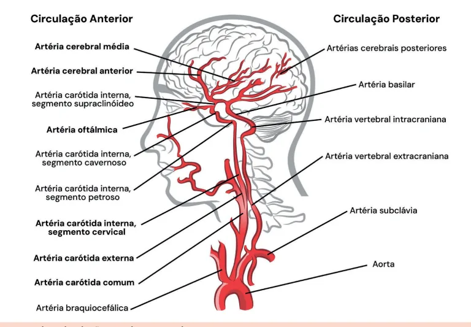
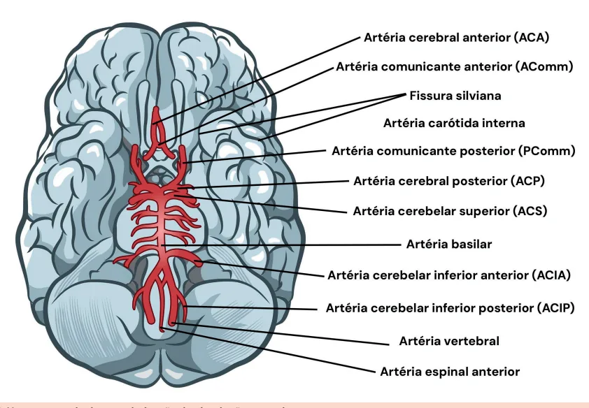
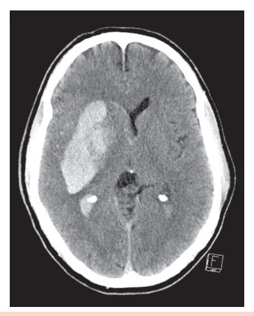
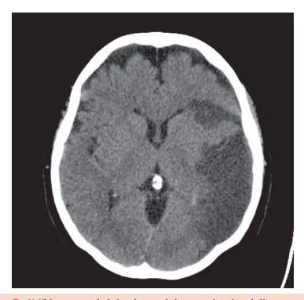

# AVC Isquêmico

<!-- page:1 -->

AVC isquêmico (CM) EPIDEMIOLOGIA

- Fatores de risco: HAS, DM2, dislipidemia, tabagismo,

SAHOS, obesidade, sedentarismo;

- Etiologias mais comuns: aterosclerose de grandes vasos; cardioembolia (FA);

- Circulação anterior (ACI + ACM + ACA) é a mais comumente afetada.

## QUADRO CLÍNICO

- Artéria cerebral média: “quadro clássico” → hemiparesia contralateral completa, pode estar associada à afasia (se acometimento do hemisfério dominante);

- Artéria cerebral anterior: déficit (paresia) mais intenso em membros inferiores e sintomas psiquiátricos (apatia, abulia etc. – lobo frontal);

- Vertebrobasilar: “salada de frutas” – ataxia, diplopia, paralisia facial, disfagia, tetraparesia etc.;

- Artéria cerebral posterior (lobo occipital): déficit visual (campo visual).

## DIAGNÓSTICO

- TC de crânio: 1.º exame no PS → descartar hemorragias;

- AngioTC arterial crânio + pescoço: útil para avaliar trombectomia mecânica;

- RM de encéfalo: protocolo Wake-Up Stroke – paciente que dormiu bem e acordou com déficit sugere AVCi < 4,5 horas).

(mismatch DWI/FLAIR - discordância entre as duas TRATAMENTO Trombólise química

- Alteplase 0,9 mg/kg (10% em bolus, restante em 1 hora). Dose máxima 90 mg;

- Sempre checar contraindicações à trombólise (PA, glicemia, INR, hemorragia digestiva etc.);

- Tenecteplase: ainda não aprovada na Anvisa, mas consta na diretriz europeia: 0,25 mg/kg EV;

- Possíveis complicações trombólise: transformação hemorrágica, angioedema orolingual: Piora neurológica → suspender trombólise e realizar nova TC de crânio.

## INTRODUÇÃO

- Definição: “Desenvolvimento de déficit neurológico focal (às vezes global) súbito” (Organização Mundial de

Saúde, 2017);

- 85% são isquêmicos e 15% hemorrágicos

(intraparenquimatoso e HSA);

- A cada minuto perdido no AVC, 1,9 milhões de neurônios morrem! Principais contraindicações à trombólise química molecular em dose plena nas últimas 24 horas

Pressão arterial sistólica > 185 OU diastólica > 110 AVC isquêmico ou TCE grave nos últimos 3 meses Plaquetas < 100.000; INR > 1,7; TTPA > 40; uso de DOACS nas últimas 48 horas; heparina de baixo peso Glicemia < 50 mg/dL Neoplasia cerebral intra-axial (ex.: glioblastoma)

Endocardite bacteriana Neoplasia do trato gastrointestinal diagnosticada recentemente OU hemorragia gastrointestinal nos últimos 21 dias Área hipoatenuante extensa na TC sem contraste , (> 1/3 do território vascular)

Dissecção de arco aórtico História prévia de hemorragia intracraniana Suspeita de hemorragia subaracnóidea (HSA)

Neurocirurgia (intracraniana ou intraespinhal) recente Trombectomia mecânica

- Regra do AV6 (NIHSS ≥ 6; ASPECTS ≥ 6; até 6 horas de sintomas; AVC de circulação anterior – M1 ou ACI);

- Paciente PODE receber trombólise + trombectomia, se preencher critérios!

- Mismatch DWI/PWI: avalia área de penumbra salvável; trombectomia > 6 horas.

Craniectomia descompressiva

- Pacientes com AVCi extenso (“maligno”) < 60 anos e até 48 horas de sintomas: impede compressão causada pelo edema.

## PROFILAXIA SECUNDÁRIA

- Aterosclerose de grandes vasos: AAS 100-300 mg/dia

+ estatina de alta potência. Se NIHSS < 5, DAPT por 21 dias, depois manter apenas um deles;

- Cardioembolismo (FA): varfarina ou DOAC: AVCi pequeno ou moderado, aguardar AVCi extenso, aguardar 10-14 dias.

24-48 horas; FATORES DE RISCO

- Fibrilação atrial (principal causa cardioembólica do AVCi);

e

- Hipertensão arterial sistêmica (HAS);

- Tabagismo;

- Dislipidemia;

- Diabetes mellitus;

- Uso excessivo de álcool.

---

<!-- page:2 -->

## ETIOLOGIA

- A artéria oftálmica é um ramo da artéria carótida

- Diversas etiologias podem levar ao AVCi Tabela 1 : interna. Nesses casos, seu acometimento pode cursar aterosclerótica e cardioembólica são as principais. com quadro clínico de amaurose fugaz!

- Independente da causa, o evento final será a oclusão de uma artéria cerebral com infarto (morte neuronal).

- Tabela 1: Principais subtipos de AVC isquêmico

(classificação “TOAST”). Principais subtipos de AVC isquêmico (classificação “TOAST”) Aterosclerose de grandes artérias Cardioembolismo Lacunar ou infarto de pequenas artérias (3-20 mm)

Outras causas (pouco frequentes) Origem indeterminada/criptogênico

## FISIOPATOLOGIA

- Oligoemia benigna → representa o primeiro momento C da obstrução arterial: a região suprida pela artéria começa a “sentir” o déficit sanguíneo.

- Penumbra → é a progressão da oligoemia: ainda é potencialmente reversível.

- Core isquêmico → morte neuronal: não é mais “salvável”.

## NEUROANATOMIA

## VASCULARIZAÇÃO

## ARTERIAL DO SNC

## CIRCULAÇÃO ANTERIOR

- É a principal circulação acometida no AVC isquêmico;

- Trajeto: artéria carótida comum → bifurcação em artéria carótida interna e externa → artéria carótida interna emite ramos para as artérias cerebral anterior e média Figura 1 ;

Figura 1: Neuroanatomia - circulação anterior e posterior. - Engloba lobo frontal, parietal, parte superior do lobo temporal, núcleo da base;

- Verificar Figura 1 no fim da página.

Tabela 2: Comparação da apresentação de AVCi de ACA e ACM. Cerebral anterior Cerebral média Hemiparesia Paresia com predomínio contralateral (se AVC à de membros inferiores esquerda, déficit será (distal > proximal) + à direita) + hipoestesia déficit sensitivo; fasciobraquiocrural;

Abulia, mutismo, Afasia, se hemisfério bradipsiquismo. dominante (geralmente o esquerdo).

## CIRCULAÇÃO POSTERIOR

- Artéria cerebral posterior (ACP); artéria basilar;

artérias vertebrais;

- Trajeto: duas artérias vertebrais se unem → originam a artéria basilar (irriga basicamente todo o tronco cerebral e cerebelo) Figura 2 ;

- Engloba tronco encefálico, cerebelo, tálamo, lobo occipital, parte inferior do lobo temporal;

- Verificar Figura 2 na próxima página.

Tabela 3: Comparação da apresentação de AVCi de cerebral posterior e vertebrobasilar. Cerebral posterior Vertebrobasilar Ataxia, disartria, disfagia;

Déficit de campo visual; Alterações de nervos cranianos (por exemplo Hemianopsia homônima assimetria pupilar);

contralateral. Rebaixamento do sensório.

---

<!-- page:3 -->

Figura 2: Neuroanatomia da vascularização da circulação posteri

## ABORDAGEM DIAGNÓSTICA

## ANAMNESE E EXAME FÍSICO

- Avaliar o tempo de início dos sintomas (última vez que o paciente foi visto bem), evolução do quadro, uso de anticoagulantes;

- Sinais vitais: frequência cardíaca, glicemia capilar e pressão arterial;

- Exame físico direcionado (NIHSS);

- Cuidado com os “imitadores” de AVC conforme a artéria acometida.

(exemplo: hipoglicemia). Tabela 4: Manifestações clínicas do AVC isquêmico Território acometido Manifestações clínicas Hemiparesia contralateral + hipoestesia tátil Artéria cerebral média fasciobraquiocrural;

Afasia, se hemisfério dominante. Paresia com predomínio crural Artéria cerebral (distal>proximal) + déficit anterior sensitivo; Abulia, mutismo, bradipsiquismo.

Artéria cerebral Hemianopsia homônima posterior contralateral +- ataxia. Ataxia + disartria + disfagia Vertebrobasilar + assimetria pupilar + (artérias vertebrais + rebaixamento do nível de artéria basilar) consciência + desvio do olhar conjugado.

Artéria oftálmica Amaurose fugaz. Síndrome de Wallenberg

- Principal síndrome neurovascular da circulação posterior; ior.

- Isquemia no território da artéria cerebelar posteroinferior (“PICA”) ou da artéria vertebral → danos na região dorsolateral do bulbo;

- Hemiataxia ipsilateral, hipoestesia da face ipsilateral e do corpo contralateral;

- “Síndrome alterna”: hipoestesia compromete a hemiface direita e o hemicorpo esquerdo (braquiocrural);

- Pode apresentar também síndrome de Horner associada ipsilateral à lesão.

## ESCALAS “NIHSS”

Tabela 5: National Institute of Health Stroke Scale (NIHSS). Descrição Escore Nível de consciência 0-3 pontos Orientação 0-2 pontos Resposta a comandos 0-2 pontos Olhar 0-2 pontos Campo visual 0-3 pontos Movimento (paralisia) facial 0-3 pontos Função motora MMSS 0-4 pontos Função motora MMII 0-4 pontos Ataxia 0-2 Sensibilidade 0-2 Linguagem 0-3 Total 42 pontos → quanto maior a pontuação, mais ; grave o AVC.

---

<!-- page:4 -->

NEUROIMAGEM Tabela 6: Principais contraindicações à trombólise química.

- TC de crânio – exame de escolha no pronto-socorro → excluir hemorragias;

Principais contraindicações à trombólise química

- AngioTC de crânio - avaliar obstruções proximais (M1) para elegibilidade para trombectomia mecânica;

- RM de encéfalo: para situações específicas: wake-up stroke mecânica acima de 6 horas; sequências mais precoces para avaliar infarto:

(acordou com déficit) e avaliar trombectomia difusão (DWI).

- Figura 3: AVCi em território de artéria cerebral média.

## ESCORE “ASPECTS”

- Analisa achados tomográficos hiperagudos;

- O escore vai até 10 pontos – reduz 1 ponto para cada região acometida → quanto maior o escore, melhor;

- ASPECTS < 6: isquemia mais grave e subaguda - maior tempo de evolução;

- Fundamental para elegibilidade de pacientes para trombectomia mecânica (≥ 6).

## WAKE-UP STROKE

- Paciente foi dormir bem e acordou com algum déficit neurológico. Que horas exatamente ocorreu o AVC?

- Nessa situação, quem vai definir o tempo exato do evento é a ressonância magnética por meio da comparação das sequências DWI (difusão) e FLAIR;

se a DWI estiver alterada e FLAIR normal, significa que o AVC isquêmico ocorreu há menos de 4,5 horas e devemos trombolisar o paciente;

- Essa diferença entre DWI e FLAIR é conhecida como

“mismatch DWI/FLAIR”.

## TRATAMENTO

## TROMBÓLISE QUÍMICA

- Indicação: pacientes com déficit neurológico T

≤ 4,5 horas e sem contraindicações;

- Alteplase (ativador de plasminogênio tecidual)

- 0,9 mg/kg - máximo de 90 mg! 10% em bolus + restante em 1 hora, em bomba de infusão.

- Atenção! A tenecteplase ainda não está aprovada pela nas últimas 48 horas; heparina de baixo peso molecular em dose plena nas últimas 24 horas

Anvisa, mas consta na diretriz europeia: 0,25 mg/kg EV. à trombólise química Pressão arterial sistólica > 185 OU diastólica > 110 AVC isquêmico ou TCE grave nos últimos 3 meses Plaquetas < 100.000; INR > 1,7; TTPA > 40; uso de DOACS Glicemia < 50 mg/dL Neoplasia cerebral intra-axial (ex.: glioblastoma)

Endocardite bacteriana Neoplasia do trato gastrointestinal diagnosticada recentemente OU hemorragia gastrointestinal nos últimos 21 dias Área hipoatenuante extensa na TC sem contraste (> 1/3 do território vascular)

Dissecção de arco aórtico História prévia de hemorragia intracraniana Suspeita de hemorragia subaracnóidea (HSA)

Possíveis complicações

- Transformação hemorrágica - novo sinal neurológico: interromper a trombólise e repetir TC de crânio na urgência; crioprecipitado; antifibrinolíticos como ácido tranexâmico; complexo protrombínico.

- Angioedema orolingual: Anti-histamínicos + corticoide.

Figura 4: Transformação hemorrágica de AVCi em território de artéria cerebral média direita.

## TROMBECTOMIA MECÂNICA

- Lembrem-se da regra do AV6;

- O paciente pode receber trombólise química e realizar trombectomia mecânica, se tiver indicações! Um tratamento NÃO exclui o outro;

- RNM de crânio: mismatch difusão/perfusão estendida(> 6 horas).

(DWI/PWI) auxilia a avaliar trombectomia em janela

---

<!-- page:5 -->

Tabela 7: Indicações para trombectomia mecânica.

- Indicações de craniectomia descompressiva: Pacientes < 60 anos E até 48 horas do início dos sintomas;

Regra do AV6 Idade > 18 anos Idade > 18 anos Tempo: até 6 horas do início dos sintomas NIHSS ≥ 6 ASPECTS ≥6 Escala de Rankin modificada: 0-1 (paciente independente, funcional)

Circulação anterior: artéria carótida interna OU artéria cerebral média (porção M1)

## AVC ISQUÊMICO > 4,5 HORAS

- Iniciar AAS 75-300 mg/dia: se AVCi minor = DAPT;

- Reduzir PA somente se PAS > 220 ou PAD > 120 mmHg

- hipertensão permissiva;

- Anticoagulação plena na fibrilação atrial: início a depender da extensão do AVC.

- Glicemia capilar entre 140-180 mg/dL;

- Evitar hipertermia;

- Avaliar presença de disfagia para decidir melhor forma de dieta;

- O2 suplementar se SatO2 < 95%.

## CRANIECTOMIA DESCOMPRESSIVA

- AVC isquêmico “maligno”: oclusão da M1 da artéria cerebral média levando à hipertensão intracraniana; | NÃO é uma terapia “concorrente” à trombólise química ou trombectomia mecânica.

Tabela 8: Medidas gerais e profilaxia secundária no AVCi. Público Medidas

- AAS 100-300 mg/dia;

Aterosclerose de

- AVCi minor (NIHSS < 5: DAPT (AAS grandes vasos + clopidogrel) por 21 dias, depois apenas AAS.

- Varfarina ou DOAC:

Cardioembolismo z ee AVCi pequeno ou moderado, (FA) iniciar em 24-48 horas;

- se AVCi extenso, aguardar 10-14 dias.

Todos

- Controle de fatores de risco.

## REFERÊNCIAS

Figura 3: AVCi em território de artéria cerebral média. Radiopaedia. Disponível em radiopaedia.org/ Figura 4: Transformação hemorrágica de AVCi em território de artéria cerebral média direita.

Radiopaedia. Disponível em radiopaedia.org/
