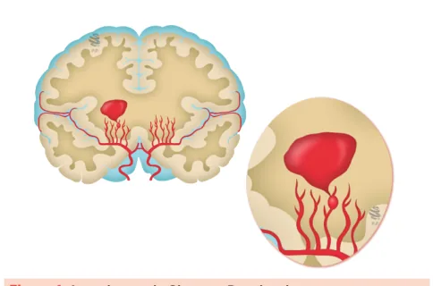
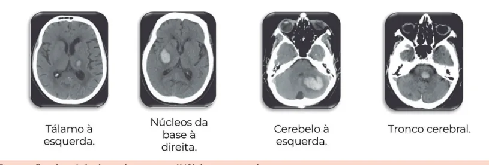
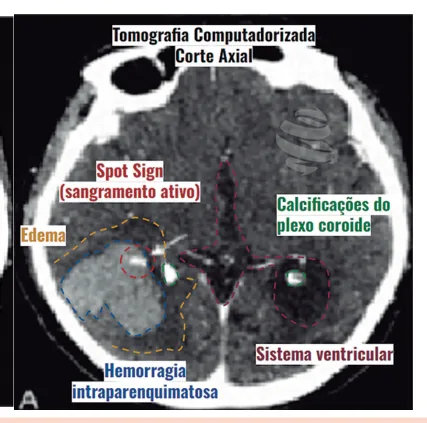

# Avch Intraparenquimatoso

<!-- page:1 -->

AVC Hemorrágico (CM) EPIDEMIOLOGIA

- 2° AVC mais comum;

- “Perfil” do paciente: homem hipertenso.

ETIOLOGIA:

- HAS (artérias perfurantes);

- Uso de anticoagulantes;

- Trombose venosa cerebral (pacientes mais jovens);

- Malformação arteriovenosa (pacientes mais jovens).

## QUADRO CLÍNICO

- Depende da localização... Não tem como diferenciar de AVCi!

## CONCEITOS INICIAIS

- É o segundo tipo mais comum de AVC (15-20%); 1º é o AVC isquêmico

- Mortalidade estimada de até 59% em 1 ano após o evento;

- Homens são mais acometidos que as mulheres;

- Condição que confere grande morbidade aos pacientes – até 80% ficam com sequelas.

## ETIOLOGIAS PRIMÁRIAS

## HIPERTENSÃO ARTERIAL SISTÊMICA (HAS) CRÔNICA

- Principal causa

- Leva a lesão nas artérias perfurantes

- enfraquecimento da parede das artérias (lipohialinose);

- Ruptura de microaneurismas de Charcot-Bouchard

(formados pela hipertensão);

- Ocorre principalmente em núcleos da base e tálamo.

Figura 1: Aneurismas de Charcot-Bouchard

- Localização clássica Núcleos da base (>50%); Tálamo (31%); Cerebelo (7%); Tronco cerebral (7%). DIAGNÓSTICO

- TC de crânio – lesão hiperdensa

(“lesão esbranquiçada”). TRATAMENTO

- Se etiologia hipertensiva – PAS ~140 mmHg.

- Se anticoagulantes: interromper e reverter o efeito (antídoto!).

## . ETIOLOGIAS SECUNDÁRIAS

- Menos comum que a hipertensiva Uso de anticoagulantes (15%); Trombose venosa cerebral (TVC); Mesmo com hemorragia, deve-se anticoagular o paciente. Malformação arteriovenosa (MAV); Neoplasias cerebrais. Principalmente melanoma.

## ANGIOPATIA AMILÓIDE

- Fisiopatologia: deposição de peptídeo beta-amilóide na parede de vasos corticais e leptomeníngeos de pequeno e médio calibres;

- Importante causa de hemorragia lobar em adultos mais velhos (70-80 anos);

- Paciente pode ter comprometimento cognitivo e déficits neurológicos transitórios (amyloid spells) associados;

Diagnóstico

- Apenas com biópsia/anatomopatológico (critérios de Boston);

- Ressonância magnética: hemorragia intraparenquimatosa, pequenos focos de sangramento hemorragia subaracnóidea em convexidades.

(“microbleeds”), foco de siderose superficial ou Tratamento

- Suporte, não há medicações indicadas para diminuir progressão da doença.

Depende do local da hemorragia:

- Tálamo: hemiparesia/plegia, hemianestesia, paralisia do olhar conjugado vertical para cima;

- Cerebelar: ataxia, paralisia do olhar conjugado horizontal;

---

<!-- page:2 -->

Figura 2: Tomografias de crânio de pacientes com AVCh intraparenqu Figura 3: ”SPOT SIGN” - Sinal radiológico de pior prognóstico. Podemo interior da lesão, representando sangramento ativo e, portanto, sinal

- Hipertensão intracraniana (HIC) - quanto maior H o sangramento, maior o risco de desenvolver hipertensão intracraniana; Cefaleia, náuseas, vômitos, rebaixamento do nível de consciência, crises convulsivas.

Atenção! Somente pelos sinais/sintomas não é possível distinguir AVC hemorrágico intraparenquimatoso de AVC isquêmico → É necessário realizar TC de crânio.

## DIAGNÓSTICO

- Tomografia de crânio: exame de escolha na emergência: Diferenciar AVC isquêmico de hemorrágico.

- “SPOT SIGN”: extravasamento de contraste dentro do hematoma evidenciado pela tomografia com contraste: Se presente, indica que a hemorragia vai aumentar; Não tem relação com etiologia, mas sim com prognóstico.

- Verificar Figuras 2 e 3

## TRATAMENTO

## CONTROLE PRESSÓRICO

- Pressão arterial: meta PAS ~ 140 mmHg; A Tolerável: 130-150 mmHg.

- PAS < 130 mmHg: danoso! uimatoso.

os observar um foco de extravasamento de meio de contraste no de hematoma em expansão. Hemorragia secundária ao uso de anticoagulantes

- Suspender imediatamente e reverter o efeito da medicação; Varfarina = vitamina K EV + complexo protrombínico Dabigatrana = Idarucizumab; Inibidores do fator Xa: Andexanet alfa. Heparina: sulfato de protamina.

(1ª escolha) ou plasma fresco congelado (2ª escolha);

- Não há benefício em usar anticonvulsivantes profiláticos rotineiramente.

Tratamento cirúrgico

- Hemorragias cerebelares >3cm ou volume > 14mL Risco de compressão do 4º ventrículo;

- Hidrocefalia aguda;

- Hemorragias lobares volumosas (>30mL) Situada até 1cm da superfície cortical; Deterioração clínica.

## REFERÊNCIAS

Figura 2: Tomografias de crânio de pacientes com AVCh intraparenquimatoso. Radiopaedia. [s.d.]. Disponível em: https://radiopaedia.org/.

Figura 3: ”SPOT SIGN” ATNR. [s.d.]. Disponível em: https://atnr.org/.

