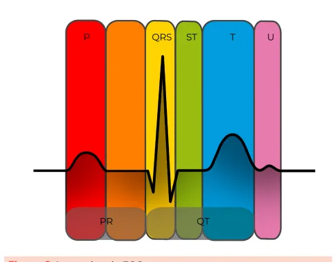
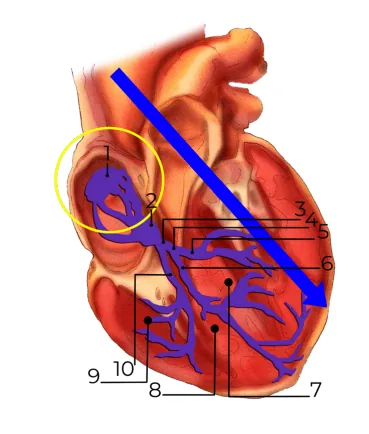
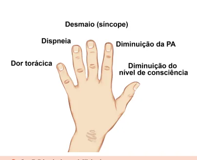
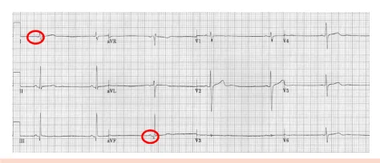

# Bradiarritmias

<!-- page:1 -->

Arritmias (CM). Bradicardia = FC < 60 bpm . SINUSAL OU NÃO SINUSAL

- P positiva em D1 e AVF;

- Morfologia semelhante uma à outra;

- Conduz um QRS após.

BLOQUEIOS ATRIOVENTRICULARES PR longo que sempre conduz: BAV 1; P bloqueada = olhar intervalos PR pré e pós (BAV 2 e avançado):

- Se o pós for menor que o pré = Mobitz I: Intervalo PR aumenta progressivamente até que a onda P é bloqueada.

- Se forem iguais e P bloqueada = Mobitz II;

- 2:1, 3:1, 4:1 = avançado.

Dissincronia AV (BAVT).

## INTRODUÇÃO

- Arritmias são alterações na formação e/ou na condução do estímulo: Para ser considerada bradiarritmia, a frequência cardíaca (FC) deve ser abaixo de 60 batimentos por minuto: Algumas diretrizes, como a brasileira, colocam esse valor como 50, mas em geral, para prova, pode-se assumir o valor de 60.

## RITMO SINUSAL

- É aquele em que a onda P é positiva em D1 e AVF (eixo normal – 0 a +90) + toda onda P conduz a um QRS; todas as ondas P têm a mesma morfologia mesma origem).

(a despolarização do átrio tem sempre a Figura 1: Sistema de condução. TRATAMENTO Instável ou estável?

- Dispneia, dor torácica, desmaio, diminuição de nível de consciência e diminuição de PA → 5 D’s da instabilidade: atropina 1 mg até 3x + MPTC, adrenalina ou dopamina; seguida pelo MPTV.

- Estável: monitorizar, entender a causa, chamar o especialista.

1 – Nó sinoatrial; 2 – Nó atrioventricular: “Segura” o estímulo cardíaco antes de passar para os ventrículos (é o que gera a sincronia atrioventricular);

3 – Feixe de His; 4 – Ramo esquerdo; 9 – Ramo direito. O vetor de despolarização segue a seta na imagem, e é importante porque é o que vai determinar que a onda P seja positiva em DI e AVF, por exemplo.

→ Bloqueio atrioventricular (AV) é diferente de bloqueio de ramo (BR). Bloqueio de ramo: aberrância na condução do estímulo dentro do ventrículo, com alargamento do QRS.

Figura 2: Intervalos do ECG. Onda P Intervalo PR – Tempo em que o nó atrioventricular “segura” o estímulo cardíaco. Complexo QRS – Despolarização ventricular em todas as suas regiões (septo, ventrículo esquerdo e ventrículo direito).

Segmento ST. Onda T – Repolarização. Intervalo QT – Medido do início da onda Q até o final da onda T.

Onda U – Em alguns casos.

---

<!-- page:2 -->

## DIAGNÓSTICO

ECG Figura 5: BAV 2.º grau Mobitz I (fenômeno de Wenckebach).

- Bradicardia (FC < 60 bpm);

- As ondas P conduzem o QRS? BAV 2.º grau Mobitz II

- As ondas P conduzem o QRS? B

- Todas as ondas P têm a mesma morfologia?

- Onda P positiva em D2, D3 e avF?

- Bradicardia sinusal

- R-R < 60 bpm.

- B

- Figura 3: ECG sinusal.

- Analisando o eletro acima percebemos que as ondas determinar que a onda P conduz QRS. O intervalo PR é igual? Durante a análise é possível determinar que sim, bem como a morfologia das ondas P.

P em DI e AVF estão positivas. Também é possível

- Após a análise de todo o ECG com os pontos acima, é possível determinar que a bradicardia existente (FC em geral, esse paciente é assintomático e possui B um ritmo benigno; pacientes jovens e atletas podem possuir bradicardia sinusal: ficar de olho em medicações que podem gerar bradicardia sinusal.

< 60 bpm) é sinusal:

- Nas provas, a bradicardia sinusal em geral vai ser um quadro benigno e relacionada a pessoas sem cardiopatia: É importante lembrar que pacientes idosos podem ter essa arritmia como manifestação de uma degeneração do sistema de condução – doença do nó sinusal – e nesse caso isso pode ser um problema.

BAV 1.º grau

- Onda P sinusal;

- Intervalo PR longo (PR > 200 ms – 5 quadradinhos);

- Bradiarritmia benigna.

Figura 4: Bradiarritmia benigna (BAV 1.º grau). BAV 2.º grau Mobitz 1 (Fenômeno de Wenckebach)

- Onda P que não conduz QRS;

- ECG bradicárdico → Onda P que não conduz = olhar intervalo PR antes e depois da onda P bloqueada;

- Aumento progressivo do intervalo PR culminando em uma onda P bloqueada: esse aumento progressivo é chamado de

“fenômeno de Wenckebach”.

- Se o intervalo PR depois da onda P bloqueada for menor do que o intervalo PR imediatamente anterior, tem-se o diagnóstico de um BAV de 2.º grau Mobitz I. BAV 2.º grau Mobitz II

- Ondas P bloqueadas;

- Bradiarritmia “mais maligna”;

- Intervalos PR iguais até uma P bloquear. É um bloqueio mais baixo, com risco de morte súbita aumentado;

- Não tem o fenômeno de Wenckebach.

Figura 6: BAV 2.º grau Mobitz II. BAV avançado

- No ECG: bradicardia, onda P não conduz (muitas);

- No ECG seguinte há duas ondas P para um QRS Há o 2:1, 3:1, 4:1 → Convencionou-se chamar de

(BAV 2 para 1): BAV avançado.

- Associado a piores desfechos.

Figura 7: BAV avançado. BAV 3.º grau – BAVT

- Bradicardia com dissociação atrioventricular;

- As ondas P têm intervalos regulares, porém não conduzem o estímulo;

- Os R-R também têm intervalos regulares, mas não estão relacionados com as ondas P.

Figura 8: BAV 3.º grau - BAVT. Atentar para a relação entre onda P e QRS → Olhar o batimento antes e após o bloqueio. Lembrar de pensar: por que o paciente está bradicárdico? Além de procurar as alterações no ECG.

## TRATAMENTO

## OS 5 D’S DA INSTABILIDADE

Figura 9: Os 5 D´s da instabilidade.

---

<!-- page:3 -->

## REFERÊNCIAS

- Qualquer um desses sinais confere instabilidade;

- De acordo com o protocolo do ACLS para o paciente instável é possível fazer uma tentativa de dar atropina Figura 3: Intervalos do ECG.

1 mg até 3x enquanto é preparado o tratamento Arquivo pessoal mais imediato, como marcapasso transcutâneo OU Figura 4:

mais imediato, como marcapasso transcutâneo OU adrenalina EV BIC OU dopamina EV BIC;

- Se o paciente estiver estável, deve-se deixá-lo monitorizado, avaliar os exames de função orgânica e considerar um marca-passo transvenoso ou definitivo

(acionar o especialista). Marcapasso transcutâneo (como colocar)

- Analgesia;

- Conectar pás de marca-passo no desfibrilador;

- Ligar modo marca-passo;

- Posicionar pás - ântero- posterior, paraesternal-apical;

- Programar frequência de estimulação;

- Aumentar energia de estimulação até captura elétrica: aumentar energia até captura mecânica (pulso femoral) → Aumentar 20%. Figura 4: Bradiarritmia benigna (BAV 1.º grau).

Wikimedia Commons. Disponível em https://commons.wikimedia.org/ Figura 5: BAV 2.º grau Mobitz I (fenômeno de Wenckebach).

Wikimedia Commons. Disponível em https://commons.wikimedia.org/ Figura 6: BAV 2.º grau Mobitz II. Wikimedia Commons. Disponível em https://commons.wikimedia.org/ Figura 7: BAV avançado.

Wikimedia Commons. Disponível em https://commons.wikimedia.org/ Figura 8: BAV 3.º grau - BAVT. Arquivo pessoal.

;
