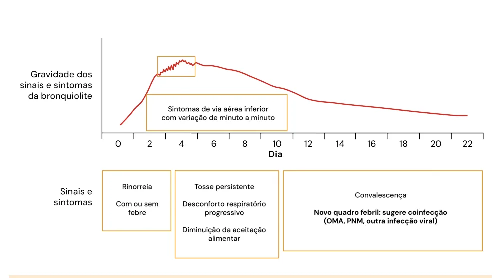

# Bronquiolite e Coqueluche

<!-- page:1 -->

> ⚠️ Este material teve páginas de duas colunas com texto intercalado; o conteúdo abaixo foi reorganizado por assunto usando o contexto clínico. Confira contra a fonte original em caso de dúvida.

## Bronquiolite vs. Coqueluche — Visão Geral

> ⚠️ Tabela reconstruída a partir de OCR — confira contra a fonte original.

| Parâmetro | Bronquiolite | Coqueluche |
|---|---|---|
| Característica geral | Infecção de vias aéreas inferiores; 1º episódio de sibilância | "Tosse comprida"; altamente contagiosa |
| Faixa etária mais comum | < 2 anos | < 6 meses |
| Etiologia | VSR | *Bordetella pertussis* |
| Quadro clínico | Rinorreia com ou sem febre; tosse com piora progressiva; desconforto respiratório; sibilância (variação minuto a minuto); diminuição da aceitação alimentar | 3 fases: **Catarral** — síndrome gripal (1-2 sem); **Paroxística** — tosse súbita e incontrolável, pode levar a apneia e cianose (2-6 sem); **Convalescença** — tosse mais branda (2-6 sem) |
| Diagnóstico | Clínico | Clínico |
| Tratamento | Suporte clínico; SpO2-alvo 90-92%; CNAF/CPAP/VNI | Macrolídeo nas primeiras 3 semanas |
| Vacinação/Profilaxia | Palivizumabe (prematuros ≤ 28 semanas: até 1 ano; DPC/DCC com repercussão: até < 2 anos); Nirsevimabe — em processo de incorporação no SUS | Gestantes: dose de dTpa a cada gestação, a partir da 20ª semana; Pentavalente aos 2, 4 e 6 meses; DTP reforço aos 15 meses e 4 anos; quimioprofilaxia com azitromicina (escolha) para contatos domiciliares |

## Bronquiolite

### Introdução

- Comum em lactentes < 2 anos;
- Quadro compatível com infecção viral causando primeiro episódio de sibilância em criança menor de 2 anos, sem outra etiologia provável.
- **Definição**: infecção das vias aéreas inferiores, de transmissão respiratória, causa comum de internação e morbidade.
- Lembrar dos valores da frequência respiratória (FR), considerando taquipneia conforme a idade:
  - < 2 meses: FR ≥ 60 irpm;
  - 2-11 meses completos: FR ≥ 50 irpm;
  - 1-4 anos completos: FR ≥ 40 irpm;
  - > 5 anos: FR > 20 irpm.

### Etiologia

- **Vírus Sincicial Respiratório (VSR)**: mais prevalente; vírus de RNA; família Paramyxoviridae; envelopado; proteína G (ligação do vírus à célula); proteína F (permite a fusão viral na célula); dois subgrupos antigênicos — A e B.

---

<!-- page:2 -->

- Rinovírus;
- Parainfluenza;
- Metapneumovírus humano;
- Influenza;
- Adenovírus;
- Coronavírus sazonal;
- Bocavírus.

### Fatores de Risco para Gravidade

- Prematuridade (< 36 semanas);
- Baixo peso ao nascer;
- Idade menor que 3 meses;
- Doença pulmonar crônica, especialmente broncodisplasia pulmonar;
- Defeitos anatômicos das vias aéreas;
- Anormalidade congênita cardíaca com repercussão;
- Imunodeficiência;
- Doença neurológica.

### Quadro Clínico

- Evolução natural da bronquiolite (verificar Figura 1);
- Severidade em torno do terceiro e quinto dia (pico de gravidade);
- Atentar para risco de desidratação devido à baixa aceitação;
- Sintomas começam a melhorar a partir da primeira semana.
- Apresentam sintomas de via aérea superior que oscilam a cada minuto: inicialmente rinorreia, com ou sem febre; evolui com piora, tosse persistente, desconforto respiratório, diminuição da aceitação alimentar; após esse período, segue a fase de convalescença;
- Se a febre voltar nessa fase, lembrar de possíveis complicações como otite, pneumonia ou outra infecção concomitante.

Figura 1: História natural dos sintomas da bronquiolite; note a variação da intensidade minuto a minuto entre o terceiro e o quinto dia.

### Diagnóstico

- **Diagnóstico: clínico!**
- Podem ser usados para auxiliar no diagnóstico:
  - **Painel viral respiratório**: identifica por biologia molecular o agente envolvido → não deve ser utilizado como rotina;
  - **Radiografia de tórax**: apenas para os casos cuja clínica não é clássica de bronquiolite → pode apresentar espessamento peribrônquico, hiperinsuflação e atelectasia. A solicitação inadequada da radiografia aumenta a prescrição de antibioticoterapia para quadros de etiologia viral (cuidado! grande fator de confusão).

### Manejo Clínico

**O que é feito:**
- Suporte hídrico;
- Monitorar saturação de oxigênio (SpO2) → saturação-alvo entre **90-92%**!
- Suporte ventilatório, conforme necessário: cateter nasal de alto fluxo (CNAF), pressão positiva contínua nas vias aéreas (CPAP), ventilação não invasiva (VNI);
- Oferta de oxigênio (O2) suplementar conforme necessidade;
- Lavagem nasal e aspiração da via aérea superior;
- Inalação com soro fisiológico.

**Não há evidência para:**
- Teste terapêutico com beta-2;
- Solução hipertônica a 3% → algumas literaturas ainda recomendam, não é rotina;
- Fisioterapia respiratória;
- Corticoides.

---

<!-- page:3 -->

### Tabela 1: Indicações Terapêuticas Segundo Diferentes Sociedades

> ⚠️ Tabela reconstruída a partir de OCR — confira contra a fonte original.

| Medicação | SBP | AAP, 2014 | NICE, 2015 |
|---|---|---|---|
| Corticoide | Não indicado | Não indicado | Não indicado |
| Broncodilatador | Não indicado de rotina | Não indicado de rotina | Não indicado de rotina |
| Antibiótico | Não indicado de rotina | Não indicado de rotina | Não indicado de rotina |
| Adrenalina inalatória | Em casos graves | Não indicado de rotina | — |
| Salina hipertônica | Melhora dos sintomas em casos leves a moderados após 24h de uso | Não indicado de rotina | — |

**CNAF — Cateter Nasal de Alto Fluxo — Principais características:**
- Fornece fluxo aéreo aquecido e umidificado;
- Fornece fluxo laminar, reduzindo a resistência das vias aéreas;
- Fluxo tende a atingir mais áreas do pulmão, reduzindo o espaço morto;
- Geralmente pode ser facilmente acoplado ao paciente;
- Permite titulação da fração inalada de oxigênio;
- Não fornece pressão positiva mensurável — quanta pressão é fornecida é controverso.

### Profilaxia

**Palivizumabe**
- Imunização passiva: anticorpo monoclonal específico contra VSR;
- Inibe a fusão;
- Objetivo: reduzir taxas de doença grave pelo vírus em pacientes de alto risco.
- **Indicações**:
  - Crianças prematuras nascidas com idade gestacional ≤ 28 semanas (até 28 semanas e 6 dias) com idade inferior a 1 ano (até 11 meses e 29 dias);
  - Crianças com idade inferior a 2 anos (até 1 ano, 11 meses e 29 dias) com doença pulmonar crônica da prematuridade (displasia broncopulmonar) ou doença cardíaca congênita com repercussão hemodinâmica demonstrada;
  - SBP: prematuros entre 29 e 31 semanas e 6 dias de idade gestacional.
- **Administração**: 5 doses, com intervalo de 30 dias, durante a sazonalidade; primeira dose → 30 dias do início da sazonalidade; **15 mg/kg/dose** por via intramuscular.

**Nirsevimabe (Beyfortus®)**
- Imunização passiva: anticorpo monoclonal contra VSR;
- Atividade neutralizante contra cepas A e B → inibe a fusão;
- Aplicação IM, antes ou durante a temporada do VSR.
- **Indicações (SBP)**: para todas as crianças na primeira temporada de VSR; até 24 meses para fator de risco: DPC, DCC, doenças neuromusculares, anomalias congênitas de VA, imunocomprometidas, síndrome de Down.
- **SBIm** — atualizou indicações: crianças < 8 meses de idade, cujas mães não se vacinaram na gestação; crianças de 8 a 23 meses de idade com risco para infecção grave por VSR.
- Em processo de incorporação no SUS.

**Abrysvo® (Pfizer)**
- Imunização passiva para o bebê através da imunização ativa (vacina) na gestante;
- Prevenção da doença em RN e lactentes até 6 meses de vida;
- Bivalente → 2 antígenos de superfície do VSR;
- IM — dose única entre 24 e 36 semanas de gestação; SBIm: idealmente a partir de 28 semanas (por ser licenciada pela Anvisa a partir da 24ª semana de gestação, fica a critério médico o uso antes das 28 semanas).
- Em processo de incorporação no SUS.

**Associação da Abrysvo® + Nirsevimabe (SBP e SBIm)**
- Mãe imunossuprimida vacinada durante a gestação;
- Parto ocorrido antes de 14 dias da vacinação materna;
- RN de alto risco, que pode incluir, mas não se limita a: doença pulmonar crônica da prematuridade, doença cardíaca congênita hemodinamicamente significativa, imunocomprometidos, síndrome de Down, fibrose cística, doença neuromuscular e anomalias congênitas das vias aéreas.

## Coqueluche

### Etiologia

- *Bordetella pertussis* → cocobacilo aeróbio gram-negativo, exclusivo do humano;
- Incubação: 5-10 (5-21) dias;
- População mais vulnerável: lactentes jovens (< 6 meses);
- Quanto menor a criança, maior a gravidade;
- Em adultos, sintomas frustos.

### Quadro Clínico

**Fase catarral — "síndrome gripal"** (1-2 semanas)
- Sintomas gripais; quadro leve; febre/coriza/tosse que progride para paroxismo.

**Fase paroxística** (2-6 semanas)
- Afebril ou febre baixa;
- Características da tosse: início súbito, incontrolável e sem pausa;
- Pode cursar com apneia, cianose, vômitos e som específico à inspiração (guincho);
- Como complicação, pode ocorrer hemorragia conjuntival e petéquias em face pelo esforço durante a tosse.

---

<!-- page:4 -->

**Fase de convalescença** (2-6 semanas)
- Sem paroxismo → pode voltar a ocorrer caso haja um novo estímulo, por exemplo presença de novas infecções virais;
- Tosse muda de padrão e fica mais branda.
- Cada fase dura em média 2 semanas, mas a tosse pode durar mais tempo (meses!).

**Figura 2: Sintomas mais encontrados na apresentação clínica da coqueluche**

> ⚠️ Tabela/gráfico reconstruído a partir de OCR — confira contra a fonte original.

| Sintomas associados | % |
|---|---|
| Tosse + tosse paroxística | 78,1 |
| Tosse + vômito | 62,2 |
| Tosse + cianose | 53,4 |
| Tosse + guincho | 50,2 |
| Tosse paroxística + guincho + vômito | 28,4 |

Perceba que a tosse paroxística é mais comum que o guincho característico da doença.

### Exames

- **RX de tórax**: coração felpudo!
- **Hemograma**: por consequência da toxina liberada pela *Bordetella*, há estímulo para se gerar linfocitose.

### Epidemiologia

- **Letalidade**: nas crianças abaixo dos 6 meses, e principalmente nas < 1 mês de idade, a letalidade é muito maior;
- Alta vigilância diagnóstica: deve-se suspeitar de coqueluche na presença de tosse paroxística, com piora na segunda semana de doença;
- Em vacinados, a tosse pode ser atípica, mas de padrão seco e persistente;
- Em adultos, não há delimitação das fases.

### Tratamento

- **Macrolídeos** (escolha: azitromicina!), fluoroquinolonas, cefalosporinas de 3ª geração, meropenem, sulfametoxazol-trimetoprim.

### Prevenção

**Vacinação**
- A vacinação pode reduzir a transmissibilidade da *Bordetella pertussis* em indivíduos vacinados que desenvolvem a infecção;
- É importante vacinar o bebê e todas as pessoas que convivem com ele, começando pela vacinação da gestante;
- As gestantes devem receber uma dose de dTpa, a cada gestação, a partir da 20ª semana de gestação;
- Pentavalente com 2, 4 e 6 meses;
- DTP reforço com 15 meses e 4 anos.
- No caso dos contactantes ou casos confirmados não vacinados: considerando o período médio de incubação da coqueluche (5 a 10 dias, podendo alcançar até 21 dias), recomenda-se que casos de coqueluche ou indivíduos que tiveram contato com casos confirmados, que sejam elegíveis para a vacinação, recebam a vacina com um intervalo mínimo de 15 dias após a conclusão da antibioticoterapia ou da profilaxia.

**Contactantes — Quimioprofilaxia**
- Escolha: **azitromicina 5 dias**, iniciar até 21 dias após a exposição.

**Indicações:**
- Comunicantes intradomiciliares;
- Pessoas com risco de evoluir para formas graves da doença, risco aumentado de complicações e óbito: crianças < 1 ano, independentemente da situação vacinal; pessoas com condições clínicas pré-existentes que possam ser exacerbadas pela coqueluche (imunocomprometidos e indivíduos com asma moderada ou grave);
- Pessoas que tiveram contato com casos suspeitos ou confirmados e que têm alto potencial de transmitir coqueluche para vulneráveis: gestantes no último trimestre (a partir da 32ª semana de gestação); profissionais de saúde que prestam assistência a indivíduos vulneráveis como lactentes e gestantes; pessoas que trabalham em creches, escolas maternais (babás, trabalhadores domésticos); pessoas que convivam com lactentes < 1 ano.

**Isolamento**
- Casos suspeitos ou confirmados até 5 dias após início do antibiótico;
- Se não tratou: 21 dias após início da tosse.

## Referências

Figura 1: História natural dos sintomas da bronquiolite, note a variação da intensidade minuto a minuto entre terceiro e quinto dia.

Adaptado de: JACKSON, S. L. et al. Comorbidity of chronic diseases and depression: findings from the National Health and Nutrition Examination Survey. The Journal of Clinical Psychiatry, v. 77, n. 7, p. e852-e858, 2016. Disponível em: https://pubmed.ncbi.nlm.nih.gov/27549684/. Acesso em: 8 abr. 2025.

Figura 2: Sintomas mais encontrados na apresentação clínica da coqueluche. Perceba que a tosse paroxística é mais comum que o guincho característico da doença.

Adaptado de: BRASIL. Ministério da Saúde. Informe epidemiológico da coqueluche: Brasil 2018 a 2019. Brasília, DF: Ministério da Saúde, 2019. Disponível em: https://www.gov.br/saude/pt-br/assuntos/saude-de-a-az/c/coqueluche/arquivos/informe-epidemiologico-da-coqueluche-brasil2018-a-2019.pdf. Acesso em: 8 abr. 2025.
