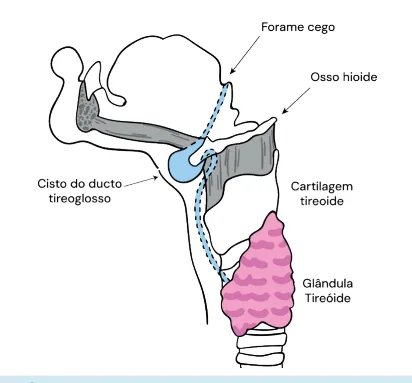
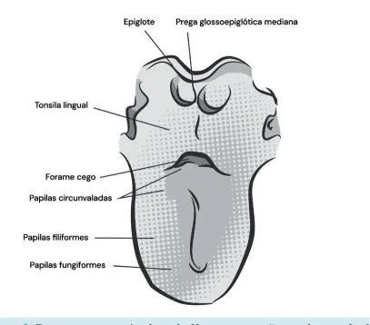
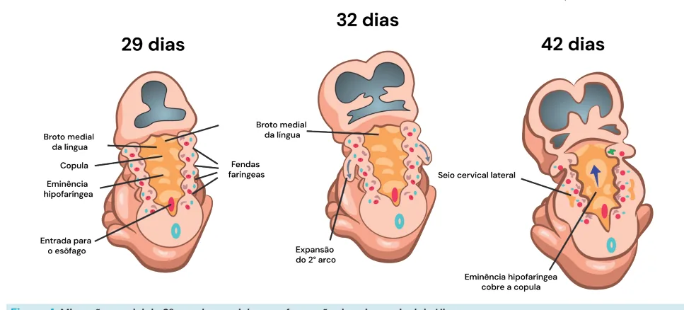
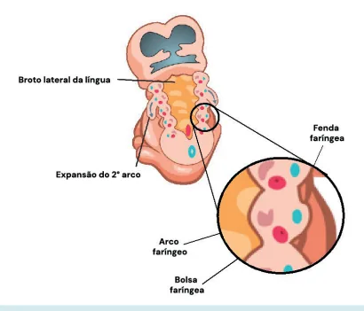
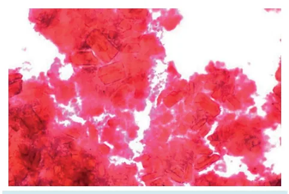
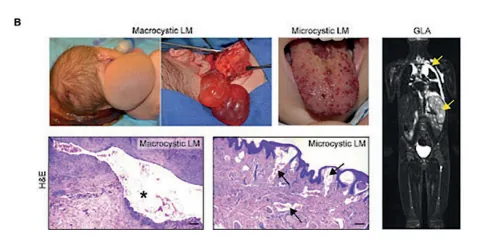
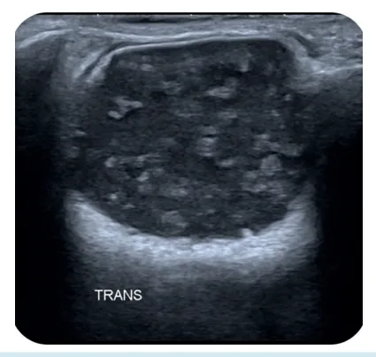
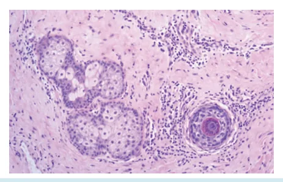
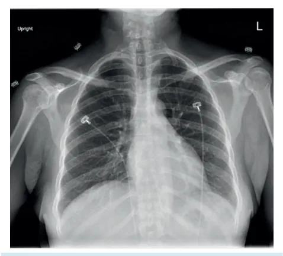
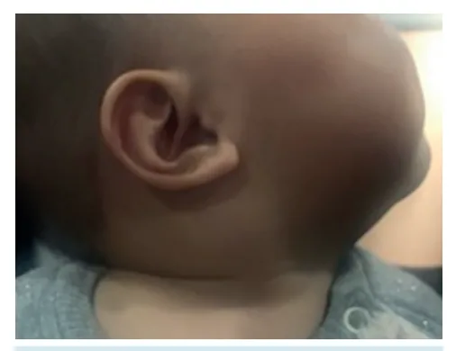

# Cabeça e Pescoço - Anomalias Congênitas em Cabeça e Pescoço

<!-- page:1 -->

## CABEÇA E PESCOÇO: ANOMALIAS

## CONGÊNITAS EM CABEÇA E PESCOÇO

Anomalias Congênitas em CCP AFECÇÕES CONGÊNITAS DA CABEÇA E PESCOÇO Cisto do ducto tireoglosso → móvel à protrusão da língua: sinal de Sistrunk Cisto branquial → lateral → fístula anterior ao ECM → cristais de colesterol Linfangioma (higroma cístico) → transiluminação → esclerosantes

## INTRODUÇÃO

- Anomalias congênitas Anormalidades no desenvolvimento embriológico.

Tais anomalias podem ser evidenciadas no nascimento ou primeiros anos, e, em alguns casos, até a 3ª idade (mais difícil, porém, possível de deflagrar);

- Incidência 3 a 4% dos nascidos vivos apresentam alguma anomalia congênita na região de cabeça e pescoço (CP).

## CISTO DO DUCTO TIREOGLOSSO

- Anomalia congênita de CP mais importante para as provas!

CONSIDERAÇÕES GERAIS: 4ª semana

- Tireoide se origina embriologicamente no assoalho da orofaringe, isto é, na base da língua;

- Na quarta semana de gestação, ocorre migração caudal pré-faríngea (através do hióide), que vai da base da língua, região anterior da laringe e faringe, até se depositar sobre a traqueia;

- Com a migração, fica remanescente um trajeto unido ao forame cego: ducto tireoglosso.

Figura 1: Esquema anatômico da língua, porção oral e orofaríngea (base, posterior às papilas circunvaladas). Hemangioma → maioria resolução espontânea → diversos tratamentos Cisto dermóide → “teratoma” → linha média alta Costela cervical → compressão de vasos/nervos → piora elevando membro Torcicolo congênito → contratura do ECM → fisioterapia Figura 2: Em azul claro: trajeto de migração da tireoide (ducto tireoglosso).

5ª a 10ª semana

- Ocorre a obliteração do ducto tireoglosso (processo fisiológico), sendo normal que não haja a obliteração perfeita e completa do canal (fundo cego).

- Cranialmente, ocorre a formação do forame cego e, caudalmente, pode haver a formação do lobo piramidal através do preenchimento do trajeto com tecido tireoidiano.

## QUADRO CLÍNICO

- Nódulo geralmente assintomático, palpável na linha média, que apresenta mobilidade durante deglutição ou protrusão da língua (Sinal de Sistrunk – sinal clínico quase patognomônico do cisto do ducto tireoglosso).

- 75% dos casos ficam na linha média do pescoço e 25% dentro de até 2 cm da linha média;

- 15 a 34% podem drenar espontaneamente, principalmente diante de inflamação em caso de IVAS

(mesmo epitélio da orofaringe).

## DIAGNÓSTICO

- Diagnóstico clínico

- Exames complementares podem contribuir para a caracterização, mas não são necessários: USG (nódulo anecoico com paredes finas);

a

- PAAF (conteúdo cístico, epitélio colunar pseudoestratificado).

---

<!-- page:2 -->

Figura 4: Migração caudal do 2º arco branquial com a formação do se TRATAMENTO

- Cirurgia de Sistrunk Tratamento curativo Ressecção de todo o trajeto do ducto tireoglosso e da porção central do hióide (não há prejuízo em deglutição ou fonação);

- A retirada apenas do cisto apresenta alto risco de recidiva , pois o ducto do cisto atravessa a porção central do hióide.

Figura 3: Cirurgia de Sistrunk, com o detalhe para a ressecção A da porção central do osso hióide.

## ANOMALIAS DO APARELHO

- BRANQUIAL

- O cisto braquial é a anomalia do aparelho branquial mais comum.

## EMBRIOLOGIA

- Entre a 4ª e 7ª semana: 6 arcos branquiais pareados, que irão formar as estruturas da face e pescoço; 5 sulcos ou fendas (externas); 5 bolsas faríngeas (internas); Ocorre o crescimento do 2º arco, que se funde posteriormente e oblitera o espaço remanescente: Quando não ocorre a obliteração adequada, há o que chamamos de persistência do seio cervical de Hiss (responsável por grande parte das anomalias do aparelho branquial). eio cervical de Hiss.

- A partir de 32 dias, inicia o crescimento do 2º arco em direção caudal (na imagem) ou posterior e ocorre fechamento das brânquias.

- Verificar Figura 4 as estruturas faríngeas

Figura 5: Esquema de embrião com destaque para APRESENTAÇÕES

- Cistos (75%): Nódulo cístico, sem aberturas, completamente circunscrito;

- Sinus: Abertura apenas interna ou externa, podendo ter cisto;

- Fístulas (25%): abertura interna e externa:

Figura 6: Apresentações das afecções branquiais com suas respectivas frequências.

---

<!-- page:3 -->

Microcístico:

- < 1 cm;

- Chamados de Linfangioma circumscriptum;

- Conglomerado de vesículas translucentes ou hemorrágicas.

Figura 7: Possíveis locais de cistos e fístulas auricular (a) e cervical (b, c).

- É clínico!

- Exames que podem complementar o diagnóstico: Ultrassonografia; Fistulografia → se houver suspeita de fístula; PAAF → cristais de colesterol (muito característico, quase patognomônico).

Figura 8: Cristais de colesterol em PAAF de cisto branquial.

## TRATAMENTO

- Excisão cirúrgica, com ressecção do cisto e todo o seu trajeto.

## LINFANGIOMA

## DEFINIÇÃO

- Anomalia congênita benigna dos vasos linfáticos Ocorre uma dilatação de vasos linfáticos e baixo fluxo vascular.

- Diagnóstico geralmente ao nascimento.

CLASSIFICAÇÃO QUANTO AO TAMANHO DO CISTO Macrocístico:

- > 1 cm;

- Sinônimo: Higroma cístico;

- Massa translucente, pouco delimitada, pele normal. ou hemorrágicas.

Misto

- Combinação macro e microcístico

Figura 9: Tratamento e aspecto dos linfangiomas. Esquerda (macro), direita (micro). QUADRO CLÍNICO

- Variável

- Desde assintomático até lesões orais, cervicais, faríngeas, orbitárias etc.;

- Pode haver compressão de estruturas adjacentes, infecção, sangramento e dor.

Exame físico

- Transiluminação (principalmente no macrocístico), igual ao realizado na hidrocele;

Exames complementares

- Ressonância magnética (RM);

- Ultrassonografia, tomografia computadorizada

(USG / TC);

- Punção aspirativa por agulha fina (PAAF).

- Observação: se lesões pequenas e assintomáticas;

- Intervenção: se lesões sintomáticas, dolorosas, deformidade significativa ou ameaça de estrutura vital.

## ARSENAL PARA A INTERVENÇÃO

- Escleroterapia; Primeira opção. Realizada a partir da punção e injeção do conteúdo esclerosante. OK-432 (Picibanil®); Bleomicina; Outras opções com menos efetividade:

Doxiciclina; Salina hipertônica; Etanol; Tetradecil sulfato de sódio (STS).

- Laserterapia com CO2;

- Interferon-alfa;

- Propranolol;

- Rapamicina (sirolimus);

- Ablação por radiofrequência;

- Excisão cirúrgica. Apresenta alta taxa de recorrência e há dificuldade de ressecção completa.

---

<!-- page:4 -->

## TRATAMENTO DE ACORDO COM A APRESENTAÇÃO CLÍNICA

## CLASSIFICAÇÃO

- Normalmente se apresenta como um nódulo no

Macrocístico: assoalho da boca;

- Escleroterapia inicialmente - menos invasiva;

- Crescimento lento;

- Considerar cirurgia em:

- Linha média; Lesão pequena e bem localizada;

- Topografia supra-hióidea; Quando não há mais possibilidade

- NÃO se eleva na deglutição.

de escleroterapia.

- Considerar tratamento em fases iniciais; DIAGNÓSTICO

- Pesar extensão da cirurgia com relação à deformidade.

- Clínico

Microcística:

- Se dúvida diagnóstica:

- Tratamento mais difícil; | Ultrassonografia → sinal do “saco de bolas de gude”;

- Considerar tratamento intervencionista quando | Tomografia Computadorizada;

sintomático ou facilmente acessível; | PAAF → conteúdo mesodérmico ou epitelial.

- Opções: Laser CO2; Ablação por radiofrequência;

Sirolimus via oral; Escleroterapia.

## HEMANGIOMA

- Anomalia vascular mais frequente em crianças;

- Diagnóstico é clínico;

- Apresenta duas fases: Fase proliferativa (crescimento); Fase de involução (espontânea).

## EXAMES COMPLEMENTARES

- Se dúvida diagnóstica;

- Ressonância magnética;

- Angiografia seletiva.

TRATAMENTO Figura 10: Sinal do “saco de bolas de gude”- ultrassonografia

- Depende do tamanho, localização, morfologia, de cisto dermoide.

idade e crescimento;

- Principalmente observação (a maioria tem resolução espontânea);

- Intervenções (iniciando do menos invasivo): Beta bloqueador; Corticosteroides sistêmicos; Interferon/ vincristina; Terapia esclerosante; Embolização; Excisão cirúrgica.

- Nenhum tratamento é excelente.

## CISTO DERMOIDE

Figura 11: Parede bem delimitada com epitélio escamoso estratificado - cisto dermoide.

- Um dos principais diagnósticos diferenciais do cisto de ducto tireoglosso;

- Representa 25% das anomalias congênitas da linha média do pescoço;

- Forma-se nas linhas embriológicas de fusão da pele;

- Revestido por epitélio, que pode apresentar anexos epiteliais (cabelo, folículo piloso, glândulas sebáceas) diagnóstico diferencial com o teratoma.

## CARACTERÍSTICAS

- Mole;

- Móvel;

- Não aderido. Figura 12: Glândulas sebáceas e folículo piloso em partes moles adjacentes ao epitélio - cisto dermoide.

---

<!-- page:5 -->

## TRATAMENTO TRATAMENTO

- Excisão cirúrgica.

- Sintomas leves: fisioterapia.

- Sintomas severos e debilidade funcional: cirurgia

## COSTELA CERVICAL

(ressecção da costela + escalenotomia).

- Costela extranumerária junto à sétima vértebra cervical;

- Usualmente bilateral, porém frequentemente assimétricas;

- O principal risco é o de compressão nervosa e/ ou vascular.

- Pode ser assintomático;

- Dor aguda ou em peso (devido à compressão);

- Sensação de massa endurecida;

- Irradiação da dor para ombro, pescoço, membros superiores e tórax;

- Alteração da sensibilidade (parestesia);

- Piora com elevação do membro superior.

- É clínico;

- Pode ser auxiliado por exames complementares: Rx de tórax ou coluna cervical; Tomografia computadorizada.

Figura 13: Radiografia de paciente com costela cervical bilateral Figura 14: Reconstrução 3D de tomografia computadorizada evidenciando costela cervical. TORCICOLO CONGÊNITO

- Atitude anormal e permanente da cabeça em relação ao plano do ombro, devido à contratura do músculo esternocleidomastóideo (severidade variável);

- Causa desconhecida Possivelmente relacionada à posição anormal ou viciosa, intrauterina do feto; Tendência familiar.

Figura 15: Paciente com torcicolo congênito.

- O diagnóstico é clínico;

- Na USG, pode-se ter o encontro de um pseudotumor de fibrose dentro do músculo (Fibromatosis colli).

Figura 16: USG evidenciando pseudotumor por

## torcicolo congênito

Figura 17: USG em torcicolo congênito. Lado esquerdo acometido, lado direito normal.

---

<!-- page:6 -->

TRATAMENTO Figura 12: Glândulas sebáceas e folículo piloso em partes moles De acordo com a idade: adjacentes ao epitélio.

- < 1 ano: GRENESS, Alasdair. Floor of mouth dermoid cyst. 2025. Disponível em: Fisioterapia intensiva; https://radiopaedia.org/cases/floor-of-mouth-dermoid-cyst-2. Acesso em: 29 jun. 2025. Imagem retirada do site. Alterações posturais; Alterações posturais; Adaptações do ambiente; A maioria se resolve nessa fase.

- > 1 ano: K Avaliar se a mobilidade cervical é limitada (< 15° de r r rotação) ou há assimetria facial; Na presença de tais alterações, considerar cirurgia: Miotomia; Liberação muscular; Desinserção da musculatura; Ressecção do músculo fibroso. B c

## REFERÊNCIAS

h Figura 8: Cristais de colesterol em PAAF de cisto branquial. BYCHKOV, Andrey. Thyroid & parathyroid - Congenital / metabolic anomalies - Branchial pouch / cleft anomalies. 2015. Disponível em: https:// www.pathologyoutlines.com/topic/thyroidbranchial.html. Acesso em: 29 jun. 2025. Imagem retirada do site.

Figura 9: Tratamento e aspecto dos linfangiomas. Q o Esquerda (macro), direita (micro) d MÄKINEN, T.; BOON, L. M.; VIKKULA, M.; ALITALO, K. Lymphatic malformations: genetics, mechanisms and therapeutic strategies.

Circulation Research, [S.l.], v. 129, n. 1, p. 136–154, 25 jun. 2021. Disponível em: http://dx.doi.org/10.1161/CIRCRESAHA.121.318142. Acesso em: 29 jun.

2025. Imagem retirada do artigo.

h Figura 10: Sinal do “saco de bolas de gude” - ultrassonografia de cisto dermoide. KNIPE, Henry. Dermoid cyst. 2025. Disponível em: https://radiopaedia.org/ articles/dermoid-cyst. Acesso em: 29 jun. 2025. Imagem retirada do site.

Figura 11: Parede bem delimitada com epitélio escamoso estratificado. GRENESS, Alasdair. Floor of mouth dermoid cyst. 2025. Disponível em:

https://radiopaedia.org/cases/floor-of-mouth-dermoid-cyst-2. Acesso em: 29 jun. 2025. Imagem retirada do site. Figura 13: Radiografia de paciente com costela cervical bilateral.

KESHAVAMURTHY, Jayanth. Cervical rib. 2025. Disponível em: https:// radiopaedia.org/cases/cervical-ribs-2. Acesso em: 29 jun. 2025. Imagem retirada do site.

Figura 14: Reconstrução 3D de tomografia computadorizada evidenciando costela cervical. BABU, Varun. Cervical rib. 2025. Disponível em: https://radiopaedia.org/ cases/cervical-rib-9. Acesso em: 29 jun. 2025. Imagem retirada do site.

Figura 15: Paciente com torcicolo congênito. RANCHOD, Ashesh Ishwarlal. Fibromatosis colli. 2025. Disponível em:

https://radiopaedia.org/cases/fibromatosis-colli-18. Acesso em: 29 jun.

2025. Imagem retirada do site.

Figura 16: USG evidenciando pseudotumor por torcicolo congênito. QAQISH, Naim. Fibromatosis colli. 2025. Disponível em: https://radiopaedia.

org/cases/fibromatosis-colli-15. Acesso em: 29 jun. 2025. Imagem retirada do site. Figura 17: USG em torcicolo congênito. Lado esquerdo acometido, lado direito normal.

AMIN, Mohammad Walid Ahmad. Fibromatosis colli. 2025. Disponível em: https://radiopaedia.org/cases/fibromatosis-colli-20. Acesso em: 29 jun.

2025. Imagem retirada do site.
