# Cabeça e Pescoço - Câncer de Boca e Lábio

<!-- page:1 -->

## CABEÇA E PESCOÇO

## CÂNCER DE BOCA E LÁBIO

CEC do trato aerodigestivo superior CÂNCER DE BOCA:

- Sítio mais comum de CEC do trato aerodigestivo;

- Borda lateral da língua é o local mais acometido;

- Lesões pré-malignas: Eritroplasia (mais agressiva); Leucoplasia (mais comum).

- Estadiamento: lembrar da profundidade de invasão (DOI);

## ANATOMIA ORAL

INTRODUÇÃO ANATÔMICA Limites:

- Boca é toda a região que está à frente da orofaringe;

- Lembrar o círculo: Superiormente a transição do palato duro com palato mole; Lateralmente aos pilares amigdalianos anteriores Inferiormente as papilas circunvaladas.

- Verificar Figura 1 na próxima página

Conteúdo da boca:

- Lábio;

- Gengivas;

- Rebordos alveolares superior e inferior;

- Palato duro;

- Mucosa jugal;

- 2/3 anteriores da língua – Língua oral;

- Assoalho bucal;

- Trígono retromolar.

- Verificar Figura 2 na próxima página

## LÁBIO

- 3 superfícies epiteliais distintas: Pele; Vermelhão; Mucosa oral.

- Principal músculo: orbicular da boca → continência oral. - Tratamento: ressecção da lesão com margens + tratamento do pescoço SEMPRE! N+: Esvaziamento cervical terapêutico (radical, modificado quando possível); N0: Esvaziamento cervical eletivo (níveis I a III).

Pode-se fazer pesquisa de linfonodo sentinela para T1N0M0. N+ é o fator prognóstico + importante no câncer de boca

## CÂNCER DE LÁBIO

- Superfície interna: considerar como CA boca.

- Superfície externa: considerar como CA pele.

Tratamento → cirúrgico ↓ Reconstrução: atentar para a extensão de acometimento do lábio (1/3)

- Verificar Figura 3 na próxima página

Vascularização:

- Artéria facial → artérias labiais superior e inferior (ramo da carótida);

- Veia facial → veias labiais superior e inferior (veia labial é tributária da veia facial).

Inervação:

- Motora → nervo facial (VII) (bucal e marginal mandibular – a parte de baixo e de cima na musculatura do lábio);

- Sensitiva → n. infraorbital (V2) e n. mentoniano (V3).

Drenagem linfática:

- Rico sistema → rede capilar profunda ao vermelhão;

- Lábio inferior → pode haver cruzamento.

## CEC DA BOCA

## EPIDEMIOLOGIA

- Sítio mais comum de câncer em cabeça e pescoço: 378.000 casos em 2020, incluindo 178.000 mortes; Na mucosa ele é o mais prevalente.

- Maior prevalência em homens: Em homens é a 5ª causa de câncer (5% dos casos); Tendência de casos de câncer de língua oral em sexo feminino < 50 anos.

- Incidência global: 6,99 casos/100.000 hab: Taxa ajustada para sexo masculino:

10,3 casos/100.000 hab.

- 4.200 mortes em 2020 no Brasil.

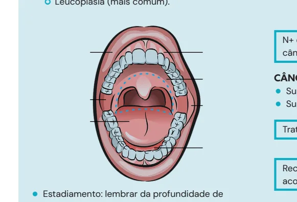

---

<!-- page:2 -->

Figura 1: Anatomia: limites Figura 2: Anatomia: conteúdo da boca Figura 3: Anatomia labial.

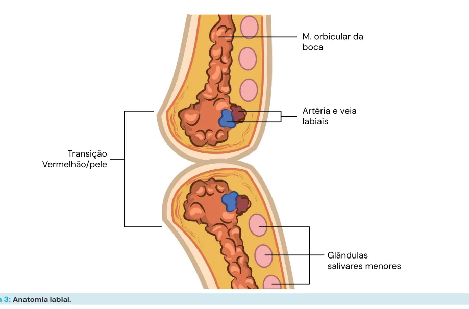

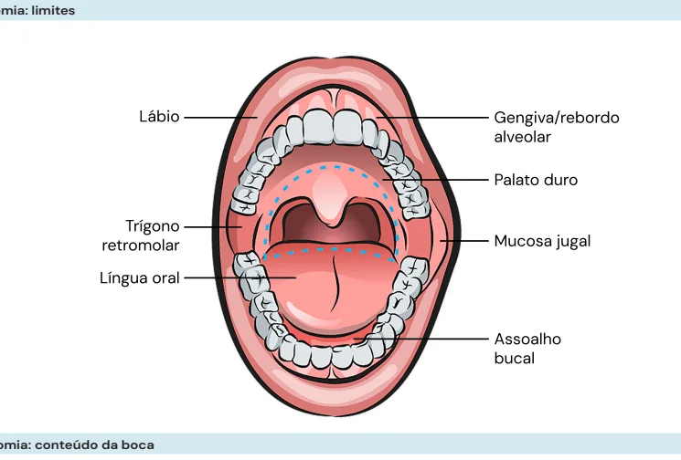

---

<!-- page:3 -->

## FATORES DE RISCO DIAGNÓSTICO

- Tabagismo;

- Biópsia incisional em ferida na boca com duração

- Etilismo; maior que 14 dias:

- Trauma repetitivo na mucosa (prótese dentária);

- Pode ser feita em ambulatório.

- Má higiene oral.

- Má higiene oral.

## TAXA DE SOBREVIDA EM 5 ANOS

- Estágios I e II: 70%;

- Estágios III e IV: 54%;

- É um câncer frequente e agressivo;

- Necessário detectar precocemente por meio do exame físico bucal no paciente.

## APRESENTAÇÃO CLÍNICA

- Ulcerada, exofítico ou endofítico;

- Superfície: Irregular e endurecida; Friável e doloroso.

- Sítio mais comum: borda lateral da língua oral.

Figura 4: Câncer de boca: Apresentação clínica LESÕES PRÉ-MALIGNAS

- Eritroplasia (das células vermelhas): Considerada carcinoma in situ; Mais agressiva e geralmente indolor.

Figura 5: Eritroplasia

- Leucoplasia (das células brancas): Mais comum; Tratamento: biópsia excisional – ressecção da lesão.

Figura 6: Leucoplasia ESTADIAMENTO Exame físico:

- Oroscopia + palpação da lesão: Adesão; Espessura.

- Mobilidade da língua

- Trismo; Acometimento do espaço mastigatório.

- Pescoço.

Rotina CEC CCP

- Exame físico com nasofibroscopia + TC (face, pescoço, tórax) + endoscopia digestiva alta + broncoscopia

(quando indicado)

## ESTADIAMENTO T

- T1: ≤ 2 cm e DOI ≤ 5 mm;

- T2: ≤ 2 cm e DOI 5 a 10 mm 2 a 4 cm e DOI ≤ 10 mm;

- T3: 2 a 4 cm e DOI > 10 mm > 4 cm e DOI ≤ 10 mm;

- T4a: > 4 cm e DOI > 10 mm: Invadem estruturas vizinhas, mas ressecáveis

(cortical óssea, seio maxilar, pele da face).

- T4b: invade e é irressecável: Espaço mastigatório, lâminas pterigoides, carótida, base do crânio;

- DOI: “Depth of invasion” (profundidade da invasão) Importante fator prognóstico sobre a profundidade de invasão da camada basal.

## ESTADIAMENTO N

- N1: único ipsilateral, ≤ 3 cm;

- N2a: único ipsilateral, 3 a 6 cm;

- N2b: múltiplos ipsilaterais, 3 a 6 cm;

- N2c: contralateral, ≤ 6cm;

- N3a: > 6 cm;

- N3b: ENE+.

## TRATAMENTO

- Cirúrgico, com margens livres de 1 cm.

Táticas, se necessário:

- Mandibulotomia;

- Mandibulectomia; Marginal ou segmentar.

Marginal Colestase Segmentar Figura 7: Mandibulectomia

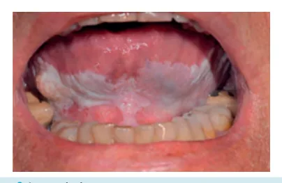

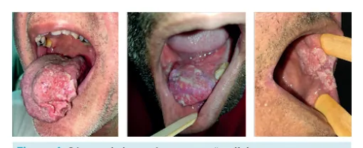

---

<!-- page:4 -->

- Commando: APRESENTAÇÃO CLÍNICA: Ressecção complexa.

- Mais comum: lábio inferior (89%);

- Mais agressivo: lábio superior:

TRATAMENTO DO PESCOÇO: | Crescimento acelerado, com maior chance É feito sempre: de metástase. Atentar para a necessidade de É feito sempre:

- N+ é o fator prognóstico mais importante no câncer de boca.

Esvaziamento cervical:

- Eletivo (paciente N0): Supraomohioideo (retirar níveis 1, 2 e 3); Linfonodo sentinela para T1N0M0 (língua oral,

DOI ≤ 3 mm).

- Terapêutico (paciente com linfonodo comprometido - N+): Radical (modificado quando possível). T

ADJUVÂNCIA:

- Deve ser considerada para os casos com linfonodos positivos.

- Radioterapia: T3 e T4; DOI > 4 mm; Margens comprometidas (R1) ou exíguas (< 5 mm); Invasão perineural ou vascular; N+.

- Quimioterapia: Margens comprometidas; Doença linfonodal avançada; Invasão angiolinfática ou perineural; ENE+

## CEC DE LÁBIO

## INTRODUÇÃO

- O lábio possui uma superfície interna e uma superfície externa:

- Vermelhão – a parte externa que recebe diretamente a radiação solar.

Tabela 1: CEC de lábio - Superfície interna vs. externa Superfície Superfície externa interna (vermelhão)

Comportamento Boca Pele Tabagismo e Fator de risco Exposição solar etilismo = boca (lembrar Estadiamento = pele da DOI)

Lesão pré- Leucoplasia e

- Hiperqueratose maligna eritroplasia

= boca = pele (sem (esvaziamento

- Tratamento esvaziamento eletivo se eletivo) indicado) de metástase. Atentar para a necessidade de reconstrução, normalmente com retalhos locais.

Figura 8: CEC de lábio TRATAMENTO Vermelhectomia:

- Lesões pré-malignas – resseção um pouco mais branda;

- Remoção parcial ou total do vermelhão;

- Reconstrução com avanço da mucosa → dissecção em plano submucoso.

Figura 9: Vermelhectomia Figura 10: Sutura de vermelhectomia Ressecção da espessura total:

- Margem de segurança: Tumores avançados: 1,5 a 2 cm Tumores precoces: 1 cm;

- Congelação de margens;

- Cirurgia micrográfica de Mohs – permite realização de cirurgia poupadora de tecidos.

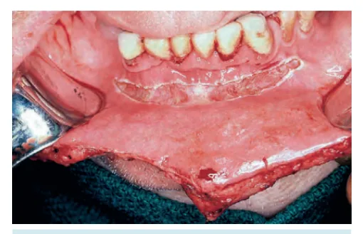

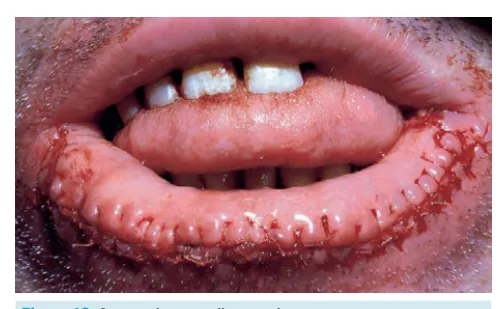

---

<!-- page:5 -->

- Fechamento primário;

- Retalhos locais;

- Enxertia de pele.

Tumores grandes → > 1/3 do lábio:

- Incisões relaxadoras;

Figura 11: Ressecção da espessura total RECONSTRUÇÃO Como funciona?

- Depende do tamanho do defeito.

Tumores pequenos → < 1/3 do lábio:

- Excisão em V, W ou retangular;

Figura 12: Abbé-Estlander Figura 13: Abbé-Estlander - Incisões relaxadoras;

- Compensações;

- Retalhos de avanço: Abbé-Estlander; Karapandzic.

Abbé-Estlander;

- Retalhos cruzados de lábio;

- Retalho triangular com pedículo (a. labial);

- Transferidos ao redor da comissura ou cruzando a abertura bucal;

- Desvantagem: denervação total.

- Verificar Figura 12 e Figura 13

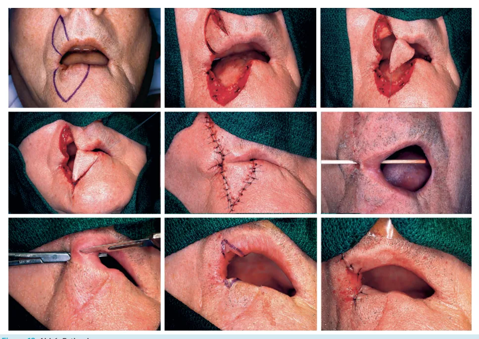

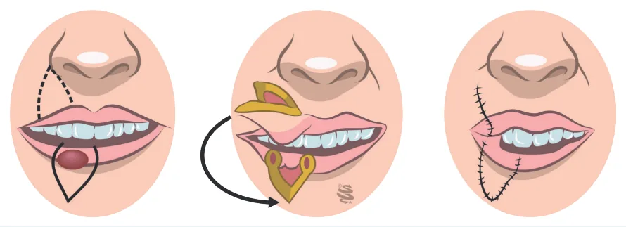

---

<!-- page:6 -->

## REFERÊNCIAS

Karapandzic;

- Retalhos circunlabiais bilaterais e simultâneos de espessura total; Figura 4: Cancer de boca: Apresentação clínica

- Isolar e preservar as estruturas vasculares e nervosas; Acervo pessoal - Medcof - Dr Felipe Magnabosco

- Restauração da função esfincteriana;

- Restauração da função esfincteriana;

- Limitação: microstomia.

Figura 14: Karapandzic Figura 15: Retalhos microcirúrgicos. Figura 5: Eritroplasia Acervo pessoal - Medcof - Dr Felipe Magnabosco Figura 6: Leucoplasia Acervo pessoal - Medcof - Dr Felipe Magnabosco Figura 7: Mandibulectomia Acervo pessoal - Medcof - Dr Felipe Magnabosco Figura 8: CEC de lábio Acervo pessoal - Medcof - Dr Felipe Magnabosco Figura 9: Vermelhectomia Acervo pessoal - Medcof - Dr Felipe Magnabosco Figura 10: Sutura de vermelhectomia Acervo pessoal - Medcof - Dr Felipe Magnabosco Figura 11: Ressecção da espessura total Acervo pessoal - Medcof - Dr Felipe Magnabosco Figura 12: Abbé-Estlander Acervo pessoal - Medcof - Dr Felipe Magnabosco Figura 13: Abbé-Estlander Acervo pessoal - Medcof - Dr Felipe Magnabosco Figura 15: Retalhos microcirúrgicos Acervo pessoal - Medcof - Dr Felipe Magnabosco

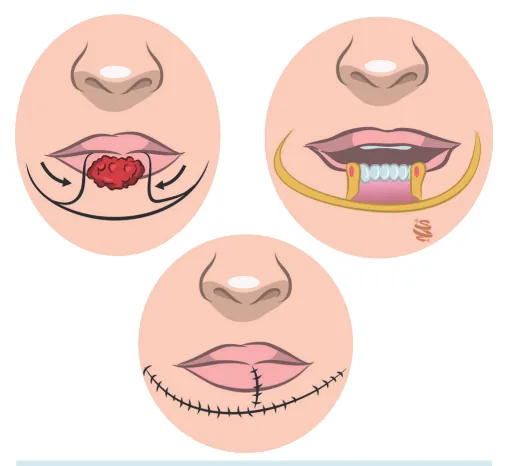

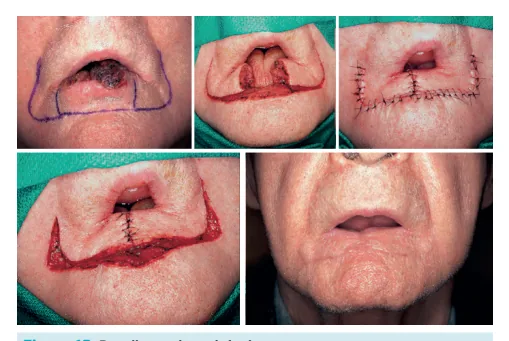
