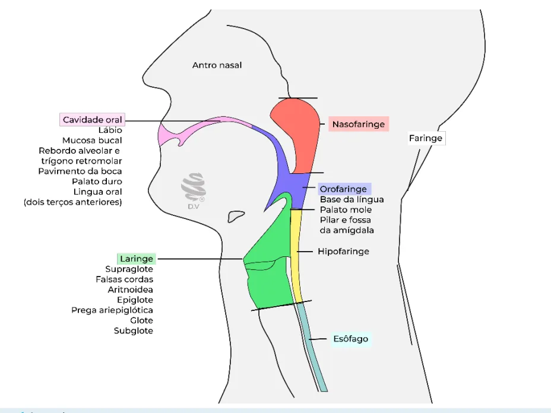
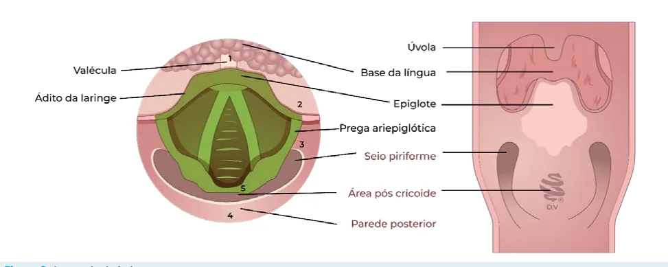
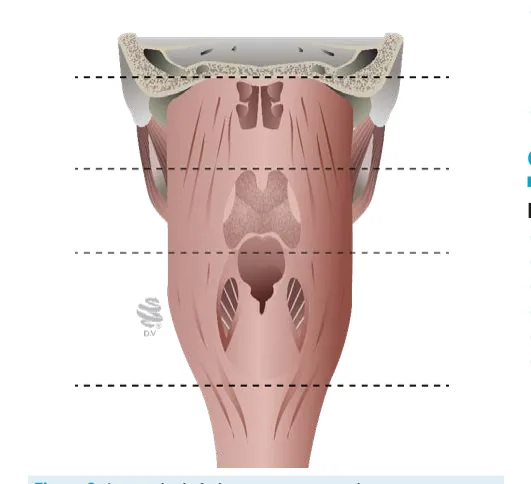
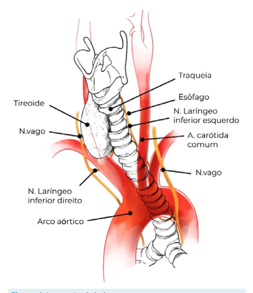
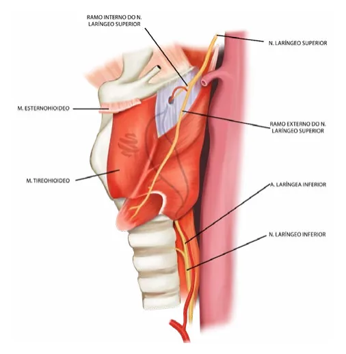
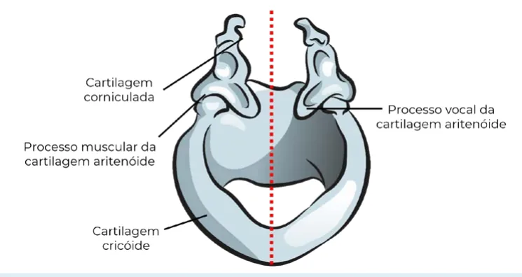

# Cabeça e Pescoço - Câncer de Hipofaringe e Laringe

<!-- page:1 -->

## Anatomia

### Faringe

A faringe é divida em três regiões:

- **Nasofaringe**: da base do crânio ao palato mole.
- **Orofaringe**: do palato mole à valécula.
- **Hipofaringe**: da valécula ao músculo cricofaríngeo.

*Figura 2: Anatomia da faringe* (corte coronal com visão posterior).

*Figura 3: Anatomia da faringe* (corte coronal).

### Laringe

**Cartilagens (3 ímpares):**

- Epiglote
- Tireoide
- Cricoide

**Cartilagens (3 pares):**

- Aritenoide
- Corniculadas
- Cuneiformes

**Marcos anatômicos:**

- **Supraglote**: epiglote, pregas ariepiglóticas, aritenoides, falsas pregas.
- **Glote**: pregas vocais, comissuras anterior e posterior.
- **Infraglote**: porção inferior da glote até a borda inferior do cricoide.

**Unidade funcional da laringe:**

- Metade da cartilagem cricoide
- 1 aritenoide
- 1 anteparo contralateral

### Fisiologia — Funções da Laringe

- **Proteção de via aérea**: separando via respiratória da via digestiva.
- **Fonação**.
- **Respiração**.

### Inervação de Laringe

- **Nervo laríngeo inferior**: inervação da musculatura intrínseca da laringe (exceto músculo cricotireóideo).
- **Nervo laríngeo superior**: divide-se em:
  - **Ramo interno**: inervação sensitiva da supraglote e hipofaringe.
  - **Ramo externo**: inervação do músculo cricotireóideo.

*Figura 1: Anatomia.*

*Figura 4: Inervação de laringe.*

---

<!-- page:2 -->

---

<!-- page:3 -->

## Câncer de Hipofaringe (CEC de Hipofaringe)

### Incidência

- **Seio piriforme**: 65–85% dos casos.
- **Parede posterior**: 10–20% dos casos.
- **Área pós-cricoide**: 5–15% dos casos.

*Figura 5: CEC de hipofaringe.*

*Figura 6: CEC de hipofaringe.*

*Figura 7: CEC de hipofaringe.*

### Epidemiologia

- **6%** dos cânceres de cabeça e pescoço.
- **Incidência no mundo**: 0,8 a 6 casos/100.000 pessoas.
- Mais comum em países desenvolvidos.
- **Masculino > feminino**.
- **Idade**: 65 a 68 anos.

### Fatores de Risco

- Etilismo e tabagismo.
- Deficiência de ferro e vitamina C.
- Exposição ocupacional.
- Síndrome de Plummer-Vinson (Escandinávia).

### Características Clínicas

- **Relação anatômica**: estreita com supraglote (laringe).
- **< 15%** dos cânceres de hipofaringe são restritos ao órgão no momento do diagnóstico — ausência de sintomas de alarme.
- O diagnóstico é feito geralmente por **progressão local ou metástase cervical**.
- **Alta taxa de metastização**:
  - Linfonodos acometidos em **65%** dos casos.
  - Metástase à distância em **20%** dos casos.
- **Sobrevida global em 5 anos**: estádios I e II: 40–70%.
- **Alta taxa de segundos primários**: 2,1% ao ano.
  - Principais sítios acometidos: boca, esôfago, pulmão.

### Prognóstico

**Prognóstico ruim:**

- Sintomas tardios.
- Grande disseminação linfonodal.
- Diagnóstico geralmente tardio com doença não restrita ao órgão.

### Quadro Clínico

- **Massa cervical e perda ponderal** — presente em casos gerais.
- **Disfagia**: relação com hipofaringe, local onde há passagem de alimento.

---

<!-- page:4 -->

### Diagnóstico

- Suspeitar em tabagista com disfagia de duração maior que **14 dias**.
- **Biópsia**: laringoscopia de suspensão ou broncoscopia.

### Estadiamento — Hipofaringe (TNM)

**Estadiamento T:**

- **T1**: ≤ 2 cm e/ou limitado a 1 subsítio.
- **T2**: entre 2–4 cm, sem fixação da laringe, ou invade > 1 subsítio ou área adjacente.
- **T3**: > 4 cm ou fixação da laringe ou extensão para mucosa esofágica.
- **T4a**: invasão de estruturas vizinhas, mas ressecável (cartilagem cricoide/tireoide, osso hioide, tireoide, esôfago, subcutâneo, músculos pré-laríngeos).
- **T4b**: invasão irressecável (fáscia pré-vertebral, carótida, mediastino).

### Tratamento — Hipofaringe

**Características gerais:**

- Preferência por tratamento não operatório (embora não exclusivo).
- **Normalmente necessidade de laringofaringectomia + glossectomia** por margem.
- **Morbidade**: aspiração e necessidade de traqueostomia.
- Cirurgia geralmente reservada para resgate → faringolaringectomia.
- **Tratamento do pescoço SEMPRE!**

**Esquema por estádio:**

- **Estadios I e II**: **RT** (preferencial) ou Transoral + esvaziamento cervical (não indicado para extensão transglótica, invasão pós-cricoide e mucosa esofágica, invasão profunda do seio piriforme).
- **Estadios III e IV**: Estratégia conservadora de órgão — **QT + RT**.

*Figura 8: Anatomia da laringe.*

---

<!-- page:5 -->

## Câncer de Laringe (CEC de Laringe)

### Epidemiologia

- **180.000** novos casos em 2020.
- **Mortalidade anual**: 100.000 casos.
- Homens > mulheres.
- **Incidência no Brasil**: 2,9 casos/100.000 habitantes.
- **8.000** casos novos em 2020.
- **9º câncer** mais frequente em homens.
- **15.600** mortes em 2020.

### Fatores de Risco

- Tabagismo e etilismo.
- Radioterapia cervical prévia.

### Prevalência por Localização

- **Supraglote**: 1/3 dos casos; ↑ rede linfática; pior prognóstico (~ hipofaringe); disfagia.
- **Glote**: 2/3 dos casos; ↓ rede linfática; melhor prognóstico; disfonia.
- **Infraglote**: raro (2%); prognóstico ruim; dispneia.

### Prognóstico

**Melhor prognóstico (glote):**

- Sintomas mais precoces.
- Menor disseminação linfonodal (rede linfática reduzida, situado entre cartilagens).

**Pior prognóstico (supraglote e infraglote):**

- Sintomas tardios.
- Invasão de mediastino.
- Difícil diagnóstico.

### Sobrevida em 5 Anos

- **Estádios I e II**: > 90% e 80% (se identificado precocemente, alta chance de cura).

### Quadro Clínico

- **Massa cervical e perda ponderal** — presente em casos gerais.
- **Disfagia, disfonia e dispneia/tosse**.

**Por localização:**

- **Disfonia**: acometimento da glote; interferência na mobilidade da prega vocal.
- **Dispneia/tosse**: infra-glote; relaciona-se com traqueia e pode obstruir passagem de ar.

### Diagnóstico

- Suspeitar em tabagista com **disfonia ou disfagia**, com duração maior que **14 dias**.
- **Exame físico completo**: palpação cervical, oroscopia, laringoscopia com nasofibroscópio.
- **Exames complementares**:
  - TC de face, pescoço e tórax com contraste.
  - Endoscopia digestiva alta.
  - Broncoscopia (quando indicado).
- **Biópsia**: laringoscopia de suspensão ou broncoscopia.

### Estadiamento — Laringe (TNM)

#### Estadiamento Supraglote — T

- **T1**: um subsítio com pregas vocais móveis.
- **T2**: > 1 subsítio ou área adjacente (glote, mucosa da base da língua, valécula, parede medial do seio piriforme) sem fixação da laringe.
- **T3**: limitado à laringe com paralisia de prega vocal e/ou invasão mais extensa (área pós-cricoide, espaço pré-epiglótico ou paraglótico, face interna da cartilagem tireoide).
- **T4a**: invasão da face externa da cartilagem tireoide ou estruturas adjacentes (traqueia, musculatura intrínseca da língua, musculatura estriada do pescoço, tireoide, esôfago).
- **T4b**: lesão irressecável (espaço paravertebral, envolvimento da carótida, invasão de mediastino).

#### Estadiamento Glote — T

- **T1**: pregas vocais móveis.
  - **T1a**: apenas uma.
  - **T1b**: invasão de prega vocal contralateral.
- **T2**: paresia de pregas vocais e/ou extensão para sub ou supraglote.
- **T3**: paralisia de pregas vocais e/ou invasão do espaço paraglótico e/ou face interna da cartilagem tireoide.
- **T4a**: invasão grosseira de estruturas adjacentes — face externa da cartilagem tireoide e/ou tecidos adjacentes (traqueia, cricóide, musculatura intrínseca da língua, musculatura do pescoço, tireoide, esôfago).
- **T4b**: lesão irressecável (espaço paravertebral, envolvimento da carótida, invasão de mediastino).

#### Estadiamento Infraglote — T

- **T1**: limitado à subglote.
- **T2**: extensão à glote com função normal ou paresia.
- **T3**: limitado à laringe com paralisia de pregas vocais e/ou invasão do espaço paraglótico e/ou face interna da cartilagem tireoide.
- **T4a**: invasão da face externa da cartilagem tireoide ou cricóide e/ou tecidos adjacentes (traqueia, musculatura intrínseca da língua, musculatura do pescoço, tireoide, esôfago).
- **T4b**: lesão irressecável (espaço paravertebral, envolvimento da carótida, invasão de mediastino).

#### Estadiamento N (Regional)

- **N1**: único, ipsilateral, ≤ 3 cm.
- **N2a**: único, ipsilateral, 3–6 cm.
- **N2b**: múltiplos, ipsilateral, 3–6 cm.
- **N2c**: contralateral, ≤ 6 cm.
- **N3a**: > 6 cm.
- **N3b**: ENE+ (extensão extranodal).

---

<!-- page:6 -->

### Tratamento — Laringe

**Métodos:**

- Cirurgia.
- Radioterapia.
- Cirurgia + radioterapia.
- Radioterapia + quimioterapia.

**Preferência por tratamento não operatório:**

- Boa resposta à QT/RT.
- Tratamento do pescoço sempre indicado.

**Fatores que influenciam o tratamento:**

- Tamanho do tumor, extensão e localização.
- **Função laríngea**: se há funcionalidade de laringe, deve-se tentar preservar.
- Idade e comorbidades.
- Reserva pulmonar e deglutição.
- Recursos de reabilitação disponíveis.
- Experiência da equipe assistente.
- Questões pessoais (ocupação, preferência).

#### Tratamento por Estádio

**Estadios I e II (Glote):**

- **Monoterapia**: Cirurgia (cordectomias endoscópicas) OU Radioterapia.

**Estadios I e II (Supraglote e Infraglote):**

- **Tratamento conservador**: Cirurgia microendoscópica parcial OU Radioterapia.

**Estadios III e IV:**

- **Associação de tratamento**: Cirurgia + RT OU Preservação de órgão (QT + RT).

#### Tratamento Cirúrgico

**Laringectomias parciais:**

- Endoscópicas (cordectomias).
- Abertas (verticais e horizontais).

**Laringectomia total:**

- Desconexão de via aérea/via digestiva.
- Traqueostomia definitiva.
- O paciente evolui com afonia.
- Reconstrução da faringe: primária, retalho local, microcirúrgico.

#### Reabilitação Vocal em Laringectomia Total

- **Voz esofágica**: frases curtas ou sílabas a partir de armazenamento de ar no esôfago.
- **Laringe eletrônica**: voz robotizada.
- **Fístula traqueo-esofágica + prótese fonatória**: fonação pela vibração da faringe; necessita troca periódica de válvula.

*Figura 9: Laringe eletrônica.*

*Figura 10: Laringectomia total.*

### Tratamento do Pescoço — Laringe

**Tabela de conduta (T, N, localização):**

> ⚠️ Dados de tabela ambíguos no OCR original — não foi possível reconstruir com segurança; conteúdo listado em texto corrido.

**Indicações gerais:**

- **N+ (terapêutico)**: esvaziamento cervical radical ou modificado.
- **N0 (eletivo)**:
  - **Supraglote**: sempre indicado — TP + nível VI.
  - **Glote**: não indicado.
  - **Infraglote**: não indicado.
- **Estadios II a IV (bilateral)**: considerar TP + nível VI.
- **Estadios II a IV (contralateral)**: considerar se invasão de linha média.
- **Se invasão de ápice do seio piriforme (supraglote)**: tireoidectomia quando acometimento; nível VI.

*Figura 15: Tratamento do pescoço — CEC de laringe.*

### Algoritmos de Tratamento

*Figura 11: Tratamento — CEC glote.*

*Figura 12: Tratamento — CEC supraglote.*

*Figura 13: Tratamento — CEC subglote.*

*Figura 14: Conduta prática — CEC de glote.*

---

<!-- page:7 -->

### Considerações sobre Radioterapia e Quimioterapia

**Quando utilizadas:**

- **Adjuvância** ao tratamento cirúrgico.
- Como tratamento principal em:
  - Tumores avançados quando seria indicada laringectomia total, porém a laringe é funcionante.
  - Tumores precoces: se preferência do paciente, apesar de piores resultados oncológicos.

---

<!-- page:8 -->

## Referências

Figura 5: CEC de hipofaringe. Acervo pessoal — Medcof — Dr. Felipe.

Figura 6: CEC de hipofaringe. Acervo pessoal — Medcof — Dr. Felipe.

Figura 7: CEC de hipofaringe. Acervo pessoal — Medcof — Dr. Felipe.

Figura 9: Laringe eletrônica. Acervo Pessoal.

Figura 10: Laringectomia total. Acervo Pessoal.
