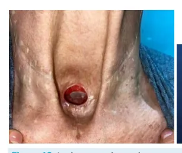

# Cabeça e Pescoço - Câncer de Hipofaringe e Laringe

<!-- page:1 -->

## CABEÇA E PESCOÇO: CÂNCER DE

## HIPOFARINGE E LARINGE

CEC do trato aerodigestivo superior CÂNCER DE HIPOFARINGE T4: Invasão grosseira de estruturas adjacentes

- Relação estreita com supraglote (laringe);

- T4a: Face externa da cartilagem tireoide e/ou

- Diagnóstico geralmente tardio e com doença não tecidos adjacentes (traqueia, cricoide, musculatura restrita ao órgão; intrínseca da língua, musculatura do pescoço,

- Preferência por tratamento não operatório (embora tireoide, esôfago) não exclusivo);

- T4b: Lesão irressecável (espaço paravertebral,

- Tratamento do pescoço SEMPRE! envolvimento da carótida, invasão de mediastino)

CÂNCER DE LARINGE Tratamento - laringe

- Supraglote: ↑ rede linfática, pior prognóstico

(~ hipofaringe), disfagia; Cirurgia

- Glote: mais comum, ↓ rede linfática, melhor RT prognóstico, disfonia; Cirurgia + RT

- Infraglote: raro, prognóstico ruim, dispneia; QT + RT

## ESTADIAMENTO T - GLOTE

T1: Pregas vocais móveis

- T1 ou T2 : Monoterapia

- T1a: apenas uma | Cirurgia

- T1b: invasão de prega vocal contralateral | RT

T2: Paresia de pregas vocais e/ou extensão para sub

- T3 ou T4: Associação de tratamento ou supraglote | Cirurgia + RT paraglótico e/ou face interna da cartilagem tireoide

T3: Paralisia de pregas vocais e/ou invasão do espaço | Preservação de órgão (QT + RT)

## ANATOMIA

Figura 1: Anatomia.

---

<!-- page:2 -->

Figura 2: Anatomia da faringe. Nasofaringe; M

- Localiza-se da base do crânio ao palato mole. S

Orofaringe;

- Palato mole à valécula.

- Hipofaringe;

- Valécula ao músculo cricofaríngeo.

- Anatomia da faringe:

- Em corte coronal, com visão posterior. G

- Hipofaringe;

- Anatomia da laringe:

- 3 cartilagens ímpares; Epiglote; I Tireoide; Cricoide.

- 3 cartilagens pares; Aritenoide; I Corniculadas; Cuneiformes

- Verificar Figura 2

- C

- - - - - Figura 3: Anatomia da faringe - corte coronal. MARCOS ANATÔMICOS DA LARINGE:

Supraglote:

- Epiglote;

- Pregas ariepiglóticas;

- Aritenoides;

- Falsas pregas.

Glote:

- Pregas vocais;

- Comissuras anterior e posterior

Infraglote:

- Porção inferior da glote até a borda inferior do cricoide.

Inervação de laringe:

- Nervo laríngeo inferior; Inervação da musculatura intrínseca da laringe

(exceto músculo cricotireóideo);

- Nervo laríngeo superior se divide em: Ramo interno: inervação sensitiva da supraglote e hipofaringe; Ramo externo: inervação do músculo cricotireóideo.

- Verificar Figura 4 na próxima página

## CEC DE HIPOFARINGE

## INCIDÊNCIA

- Seio piriforme 65 – 85%;

- Parede posterior 10 – 20%;

- Área pós-cricoide 5 – 15%.

- Verificar Figura 5 na próxima página

- Verificar Figura 6 na próxima página

- Verificar Figura 7 na próxima página

---

<!-- page:3 -->

Figura 6: CEC de hipofaringe. Figura 7: CEC de hipofaringe.

## EPIDEMIOLOGIA

- 6% dos cânceres de cabeça e pescoço

- Incidência no mundo: 0,8 a 6 casos / 100.000 pessoas

- Mais comum em países desenvolvidos

- Masculino > feminino

- Idade: 65 a 68 anos

## FATORES DE RISCO

- Etilismo e tabagismo;

- Deficiência de ferro e vitamina C;

- Exposição ocupacional;

- Síndrome de Plummer-Vinson (Escandinávia).

Figura 4: Inervação de laringe. CARACTERÍSTICAS:

- Relação anatômica com supraglote;

- < 15% dos cânceres de hipofaringe são restritos ao órgão no momento do diagnóstico - sem sintomas de alarme;

- O diagnóstico é feito geralmente por progressão local ou metástase cervical;

- Demonstra alta taxa de metastização; Linfonodos acometidos em 65% dos casos; Metástase à distância em 20% dos casos.

- Sobrevida global em 5 anos para os estádios I e

II: 40-70%;

- Alta taxa de segundos primários: 2,1% ao ano; Principais sítios acometidos: boca, esôfago e pulmão.

Figura 5: CEC de hipofaringe.

---

<!-- page:4 -->

Figura 8: Anatomia da laringe. ESTADIAMENTO T; Conduta a partir do estádio:

- T1: ≤ 2 cm e/ou limitado a 1 subsítio;

- Estadios I e II;

- T2: entre 2-4 cm, sem fixação da laringe, ou invade > 1 | RT (preferencial);

subsítio ou área adjacente; | Transoral + esvaziamento cervical (não indicado

- T3: > 4 cm ou fixação da laringe ou extensão para para extensão transglótica, invasão pós-cricoide e mucosa esofágica; invasão profunda do seio piriforme).

- T4a: invadem estruturas vizinhas, mas ressecável;

- Estadios III e IV: Cartilagem cricoide/tireoide; | Estratégia conservadora de órgão QT + RT. Osso hioide;

## CEC DE LARINGE

| Tireoide; | Esôfago; | Subcutâneo; FISIOLOGIA: | Músculos pré-laríngeos. Funções da laringe:

- T4b: invade e é irressecável;

- Esfincteriana; Fáscia pré-vertebral; | Proteção de via aérea: separando a via respiratória Carótida; da via digestiva. Mediastino.

- Fonação;

- Respiração.

ESTADIAMENTO N: Unidade funcional da laringe:

- N1: único, ipsilateral, ≤ 3 cm;

- Metade da cartilagem cricoide;

- N2a: único, ipsilateral, 3 – 6 cm;

- 1 Aritenoide;

- N2: múltiplos, ipsilateral, 3 – 6 cm;

- 1 Anteparo contralateral.

- N2c: contralateral, ≤ 6 cm

- Verificar Figura 8

- N3a: > 6 cm;

- N3b: ENE+ EPIDEMIOLOGIA:

- 180.000 novos casos em 2020;

TRATAMENTO:

- Mortalidade anual de 100.000 casos;

Preferência por tratamento não operatório:

- Homens > mulheres.

- Boa resposta à QT/RT;

- Normalmente necessidade de laringofaringectomia + INCIDÊNCIA NO BRASIL:

glossectomia por margem;

- 2,9 casos/100.000 hab;

- Morbidade → aspiração e necessidade

- 8.000 casos novos em 2020;

de traqueostomia;

- 9º câncer mais frequente em homens;

- Cirurgia geralmente reservada para

- 15.600 mortes em 2020.

resgate → faringolaringectomia. Tratamento do pescoço sempre: FATORES DE RISCO:

- N+: esvaziamento cervical radical (modificado

- Tabagismo e etilismo;

quando possível);

- Radioterapia cervical prévia.

- N0: II,III e IV bilateral → considerar VI + tireoidectomia quando acometimento do ápice do seio piriforme.

---

<!-- page:5 -->

SOBREVIDA EM 5 ANOS:

- T3: Limitado à laringe com paralisia de prega vocal e/

- Estádios I e II: > 90% e 80%; ou invasão mais extensa (área pós-cricoide, espaço

- Se identificado precocemente, tem alta chance pré-epiglótico ou paraglótico, face interna da de cura. cartilagem tireoide);

- T4a: Invasão da face externa da cartilagem tireoide

PREVALÊNCIA PROGNÓSTICO: ou estruturas adjacentes (traqueia, musculatura Supraglote: intrínseca da língua, musculatura estriada do pescoço,

- 1/3 dos casos; tireoide, esôfago);

- Prognóstico ruim:

- T4b: Lesão irressecável (espaço paravertebral, Sintomas tardios; envolvimento da carótida, Invasão de mediastino). Grande disseminação linfonodal. Estadiamento infraglote – T;

Glote:

- T1: Limitado à subglote;

- 2/3 dos casos;

- T2: Extensão à glote com função normal ou paresia;

- Melhor prognóstico:

- T3: Limitado à laringe com paralisia de pregas vocais e/ Sintomas mais precoces; ou invasão do espaço paraglótico e/ou face interna da Menor disseminação linfonodal (situado entre cartilagem tireoide;

as cartilagens).

- T4: Invasão grosseira de estruturas adjacentes

Infraglote: | T4a: Invasão da face externa da cartilagem tireoide

- Raro (2%); ou cricoide e/ou tecidos adjacentes (traqueia,

- Prognóstico ruim: Sintomas tardios; Difícil diagnóstico. musculatura intrínseca da língua, musculatura do pescoço, tireoide, esôfago);

QUADRO CLÍNICO: | T4b: Lesão irressecável (espaço paravertebral,

- Massa cervical e perda ponderal; envolvimento da carótida, invasão de mediastino). Presente em casos gerais. Estadiamento glote – T:

- Disfagia, disfonia e dispneia/tosse.

- T1: pregas vocais móveis.

Disfagia; | T1a: apenas uma.

- Supraglote: relação com hipofaringe, local onde há | T1b: invasão de prega vocal contralateral.

passagem de alimento.

- T2: paralisia das pregas vocais e/ou extensão para sub

Disfonia; ou supraglote.

- Acometimento da glote: interferência na mobilidade da

- T3: paralisia de pregas vocais e/ou invasão do espaço prega vocal. paraglótico e/ou face interna da cartilagem tireoide.

Dispneia/tosse;

- T4: invasão grosseira de estruturas adjacentes.

- Infra-glote: relaciona-se com traquéia e pode obstruir | T4a: face externa da cartilagem tireoide e/ou a passagem de ar. tecidos adjacentes (traqueia; cricóide; musculatura intrínseca da língua; musculatura do pescoço;

DIAGNÓSTICO: tireoide; esôfago);

- Suspeitar em tabagista com disfonia ou disfagia, com | T4b: lesão irressecável (espaço paravertebral;

duração maior que 14 dias. envolvimento da carótida; Invasão de mediastino).

- Biópsia Estadiamento laringe – N: Laringoscopia de suspensão ou broncoscopia.

- N1: único ipsilateral, ≤ 3 cm.

- N2a: único ipsilateral, 3 a 6 cm.

ESTADIAMENTO:

- N2b: múltiplos ipsilaterais, 3 a 6 cm.

Exame físico:

- N2c: contralateral, ≤ 6cm;

- Orofaringoscopia.

- N3a: > 6 cm;

- Laringoscopia.

- N3b: ENE+.

- Palpação do pescoço.

Exames complementares: TRATAMENTO:

- Rotina CEC CCP Métodos: Exame físico completo: palpação cervical,

- Cirurgia;

oroscopia, laringoscopia com nasofibroscópio;

- Radioterapia; TC de face, pescoço e tórax com contraste;

- Cirurgia + radioterapia; Endoscopia Digestiva Alta;

- Radioterapia + quimioterapia. Broncoscopia (quando indicado). Estadio T1 ou T2 (inicial): monoterapia;

Estadiamento supraglote – T

- Cirurgia;

- T1: Um subsítio com pregas vocais móveis;

- Radioterapia.

- T2: > 1 subsítio ou área adjacente (glote, mucosa Estádio T3 ou T4 (tardio): associação de tratamento;

da base da língua, valécula, parede medial do seio

- Cirurgia + radioterapia;

piriforme) sem fixação da laringe;

- Preservação de órgão (quimioterapia + radioterapia).

---

<!-- page:6 -->

Fatores que influenciam o tratamento:

- Tamanho do tumor, extensão e localização;

- Função laríngea: se há funcionalidade de laringe, devese tentar preservar;

- Idade e comorbidades;

- Idade e comorbidades;

- Reserva pulmonar e deglutição;

- Recursos de reabilitação disponíveis;

- Experiência da equipe assistente;

- Questões pessoais (ocupação, preferência).

## TRATAMENTO CIRÚRGICO

Laringectomias parciais:

- Endoscópicas (cordectomias);

- Abertas (verticais e horizontais).

## Laringectomia total

Desconexão de via aérea/via digestiva.

- Traqueostomia definitiva;

- O paciente evolui com afonia;

- Reconstrução da faringe: Primária; Retalho local, microcirúrgico.

## REABILITAÇÃO VOCAL EM

- Voz esofágica;

- Laringe eletrônica;

- Fístula traqueo-esofágica + prótese fonatória.

CONSIDERAÇÕES SOBRE C TRATAMENTO CIRÚRGICO: P Reabilitação da voz em laringectomia total;

- Voz esofágica: frases curtas ou sílabas a partir de armazenamento de ar no esôfago;

- Laringe eletrônica: voz robotizada;

- Fístula traqueo-esofágica + prótese fonatória. Fonação pela vibração da faringe; Necessita troca periódica de válvula.

- Verificar Figura 9 T

- Verificar Figura 10

- CEC glo

Estadios I e lI Cirurgia micro Parcial aberta RT Figura 11: Tratamento – CEC glote. Figura 9: Laringe eletrônica.

Figura 10: Laringectomia total. CONSIDERAÇÕES SOBRE TRATAMENTO POR RT/QT:

- Adjuvância ao tratamento cirúrgico.

- Utilizadas como tratamento principal em: Tumores avançados quando seria indicada laringectomia total, porém a laringe é funcionante; Tumores precoces: se preferência do paciente, apesar de piores resultados oncológicos.

TRATAMENTO - CEC GLOTE:

- Verificar Figura 11 ote externa da cartilagem.

Estadios Ill e IV Idoso, ↓KPS, laringe não funcionante, invasão da lâmina Não Sim Parcial + LT + RT QT+RT RT adjuvante adjuvante

---

<!-- page:7 -->

## TRATAMENTO – CEC SUPRAGLOTE

CEC supraglote Estadios I e lI Lesões grandes / paresia de prega vocal Sim Não Parcial aberta RT Cirurgia micro Figura 12: Tratamento – CEC supraglote.

## TRATAMENTO – CEC SUBGLOTE

CEC Estadios I e lI RT LT ou parcial extendida Não funcionou LT Figura 13: Tratamento – CEC subglote.

## CONDUTA PRÁTICA - CEC GLOTE

Laringe funcionante Sim Consegue preservar unidade funcional na cirurgia? Sim Não La Paciente tolera um pouco de broncoaspiração?

Sim Não Laringectomia parcial Laringecto±m iRa Tparcial ± RT Figura 14: Conduta prática - CEC de glote. Estadios Ill e IV Idoso, ↓KPS, laringe não funcionante, invasão da lâmina externa da cartilagem.

Não Sim Parcial + LT + QT+RT RT adjuvante RT adjuvante subglote Estadios Ill e IV Idoso, ↓KPS, laringe não funcionante, invasão da lâmina externa da cartilagem.

Não Sim Parcial + LT + QT+RT RT adjuvante RT adjuvante e (protege vias aéreas?) Não Laringectomia total ± RT aringecRtoTm ±ia pQaTrcial ± RT Não funcionou

---

<!-- page:8 -->

II a IV bilateral Supraglote Sempre indicado TP + nível VI T1 e T2 Não indicado NO (eletivo) Glote Infraglote Tratamento do pescoço Radical modificado N+ (terapêutico)

II a IV contralateral s Figura 15: Tratamento do pescoço - CEC de laringe

## REFERÊNCIAS

Figura 5: CEC de hipofaringe Acervo pessoal - Medcof - Dr Felipe Figura 6: CEC de hipofaringe Acervo pessoal - Medcof - Dr Felipe Figura 7: CEC de hipofaringe Acervo pessoal - Medcof - Dr Felipe Figura 9: Laringe eletrônica Acervo Pessoal Figura 10: Laringectomia total Acervo Pessoal T1 e T2 Não indicado II a IV (bilateral se invasão da linha média)

T3 e T4 TP + nível VI II a IV bilateral Sempre indicado TT + nível VI se invasão de linha média ou supraglote
