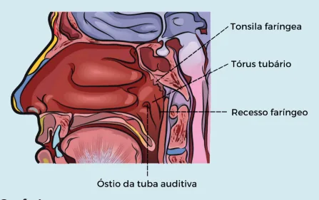
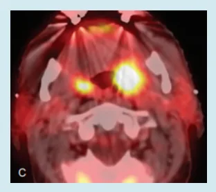
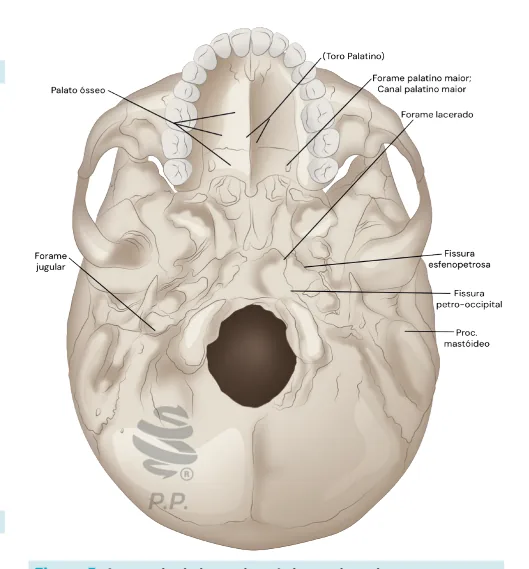
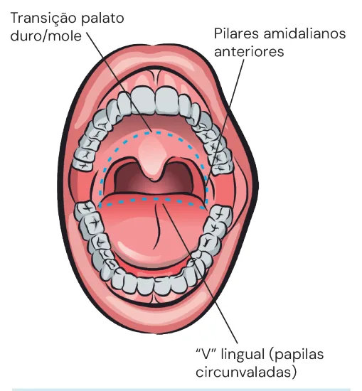
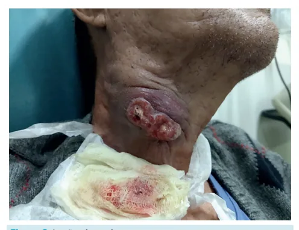
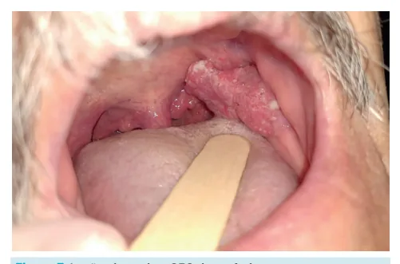
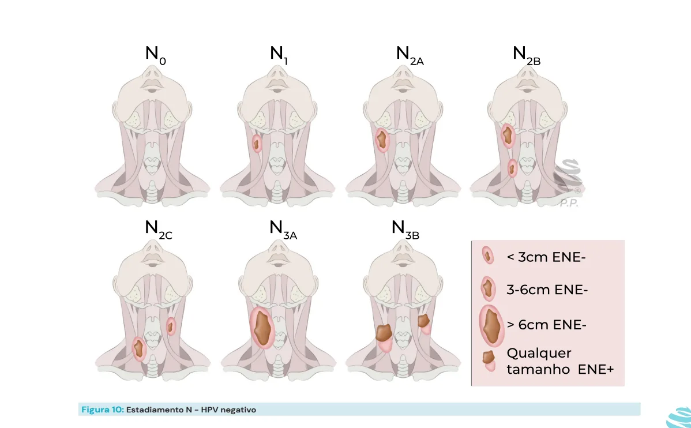
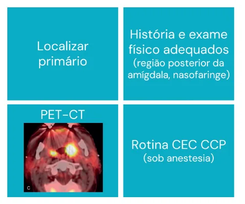

# Cabeça e Pescoço - Câncer de Nasofaringe, Orofaringe e Primário Oculto

<!-- page:1 -->

## CABEÇA E PESCOÇO: CÂNCER DE

## NASOFARINGE, OROFARINGE E

## PRIMÁRIO OCULTO

CEC do trato aerodigestivo superior Nasofaringe:

- EBV.

- Normalmente RT. Acesso cirúrgico difícil.

- Frequente metástase ao diagnóstico.

Orofaringe:

- HPV + (melhor prognóstico): Não tabagistas e jovens. Massa cística volumosa.

- HPV – Álcool + tabaco. Campo de cancerização.

- Estadiamento diferente.

- Tratamento não muda pelo HPV!

## ANATOMIA

## NASOFARINGE

- Localiza-se da base do crânio ao palato mole.

Antro nasal Cavidade Lá o b r i a o l Nasofaringe Mucosa bucal Faringe Rebordo alveolar e trígono retromolar Pavimento da boca Palato duro Lingua oral Orofaringe (dois terços anteriores) D.V B Pa a l s a e t o d a m l o ín le gua Pilar e fossa da amígdala Hipofaringe Laringe Supraglote Falsas cordas Aritnoidea Epiglote Prega ariepiglótica Glote Subglote Esôfago Figura 1: Anatomia da nasofaringe O D.V HPV + HPV −

- N+ sem primário identificável.

- Locais mais comuns: criptas amigdalianas

(orofaringe) e fosseta de Rosenmüller (nasofaringe).

- Diagnóstico por PAAF.

- Pesquisar 1º com rotina CEC.

- PET-CT.

Marcos importantes:

- Tonsila faríngea;

- Óstio da tuba auditiva;

- Tórus tubário;

- Recesso faríngeo (fosseta de Rosenmüller responsável por boa parte dos CEC de nasofaringe) difícil identificação.

→ o surgimento de câncer na região é de OROFARINGE

- Palato mole à valécula (Figura 2) da boca, enquanto que o 1/3 posterior faz parte da orofaringe! Logo, a lesão da base da língua faz parte da orofaringe.

OBS.: apenas 2/3 anteriores da língua fazem parte

---

<!-- page:2 -->

Figura 4: Espaço mastigatório - visão axial em ressonância magnética Figura 2: Orofaringe: Palato mole à valécula Figura 3: Orofaringe: Palato mole à valécula Marcos importantes: Figura 5: Anatomia da base do crânio e palato duro

- Palato mole;

- Base da língua;

- Loja e pilar amigdaliano;

- Parede posterior.

Estruturas nobres:

- Espaço mastigatório;

- Base do crânio;

- Espaço parafaríngeo: Ramos da carótida externa; Carótida interna; Veia jugular interna.

Figura 6: Espaço parafaríngeo - região nobre

---

<!-- page:3 -->

## HIPOFARINGE

- Imuno-histoquímica → PCR viral → pesquisa de EBV.

- Valécula ao músculo cricofaríngeo. Estadiamento T:

- T1: restrito à nasofaringe ou com extensão à orofaringe

## SÍTIOS - CÂNCER DE

e/ou cavidade nasal sem o envolvimento parafaríngeo; NASOFARINGE, OROFARINGE E

- T2: extensão ao espaço parafaríngeo e/ou tecidos

- Difere-se pela epidemiologia, patologia, história natural e tratamento.

Epidemiologia:

- No mundo em 2020: >130.000 novos casos, 80.000 mortes; Homens > mulheres (2-3 : 1); Idade: 50-59 anos; EUA e Europa ocidental: 0,5 a 2 casos por

100.000 habitantes.

- Brasil: 0,33 casos por 100.000 habitantes.

- Sul da China; 25 casos por 100.000 habitantes.

Fatores de risco:

- Genética;

- Fatores comportamentais: Alimentos em conserva, tabagismo, etilismo.

- Infecção por EBV.

A OMS separa o CEC de nasofaringe em 3 categorias (Tabela 1): Tabela 1: Fatores de risco CEC CEC não CEC basaloide queratinizante queratinizante Bastante Forma esporádica Bem diferenciado raro, muito (tipo 1) (tipo II) agressivo, alta mortalidade Indiferenciado (tipo III): Relacionado ao EBV, prognóstico mais favorável Clínica:

- Cefaleia, diplopia, parestesia na face, obstrução nasal, epistaxe, otite média (aumenta suspeita em adultos), diagnóstico por massa cervical (mais comum);

- Metástase ao diagnóstico: Linfonodal (75-90%) – 50% bilateral; Distância (5-11%).

Diagnóstico:

- Biópsia: tumor primário (incisional) – preferencial;

- PAAF: linfonodo cervical; - T2: extensão ao espaço parafaríngeo e/ou tecidos moles adjacentes (músculos pterigoides, musculatura pré-vertebral;

- T3: invasão de osso de base de crânio, vertebral cervical, pterigoides e/ou seios paranasais;

- T4: extensão intracraniana, envolvimento dos nervos cranianos, hipofaringe, órbita, parótida e/ou infiltração grosseira de tecidos moles, além do músculo pterigoide lateral.

Estadiamento N:

- N1: ≤ 6 cm, unilateral;

- N2: ≤ 6 cm, bilateral;

- N3: > 6 cm ou com extensão abaixo da cricoide.

Tratamento:

- RT ou RT+QT → tumor radiossensível com difícil acesso cirúrgico;

- Cirurgia de resgate quando necessário;

- Tratamento do pescoço: sempre indicado.

Tabela 2: Sobrevida do CEC de nasofaringe conforme seu estadiamento Estádio Sobrevida global 5 anos I 93% II 87% III 81% IVA 65% IVB 63%

## OROFARINGE

Limites anatômicos:

- Papilas circunvaladas (V lingual) - limite inferior;

- Papilares amigdalianos - limites laterais;

- Limite superior: palato mole e palato duro.

Dois tipos → HPV+ ou HPV

- HPV –: relacionado ao etilismo e tabagismo;

- HPV +: tumor proveniente da infecção e associado ao

HPV 16 e 18;

1. Melhor prognóstico → muda estadiamento;

2. > 80% sobrevida a longo prazo para doença avançada.

Epidemiologia e etiologia:

- Homens > mulheres;

- Bifásico, 30 e 55 anos;

- Carga tabágica reduzida ou ausente;

- Marcador indireto: p16;

- Transmitido sexualmente.

- Verificar Tabela 3 na próxima página

---

<!-- page:4 -->

Tabela 3: Comparação do CEC de orofaringe HPV positivo e HPV negativo Status HPV Características clínicas Positivo Negativo Positivo Idade ao diagnóstico 30 e 55 anos Sexo > (4:1)

Localização Amígdala, base da língua, Não tabagistas/etilista Exposições cannabis, muitos parceiro frequência sexo Massa cervical assintom Sinais e sintomas odinofagia ou ota Tumor primário Pequeno Acometimento linfonodal Risco de doença vo Sobrevida global 71% (8 meses)

Quadro clínico:

- Lesão ulcerada, friável, bordas elevadas, dolorosa; M

- Sensação de corpo estranho → voz de “batata quente”;

- Alto risco de metástase cervical;

- HPV → metástase cervical com degeneração cística.

Figura 7: Lesão ulcerada - CEC de orofaringe

- - M

- - Figura 8: Lesão ulcerada

Diagnóstico:

- Biópsia: tumor primário (incisional) – preferencial;

- PAAF: linfonodo cervical; Negativo s 60 anos

> (3:1) as, uso de os sexuais, ↑ Tabagistas, etilistas oral mática, sem de via aerodigestiva, massa cervical, algia perda ponderal olumosa Com ou sem linfadenopatia

, palato mole Toda orofaringe Disfagia, odinofagia, otalgia, obstrução Volumoso, único ou múltiplos 30%

- Imuno-histoquímica: → pesquisa de p16 (HBV).

Manejo - HPV negativo: Tabagismo Etilismo Cancerização de campo Rotina CEC CCP Figura 9: Manejo CEC de orofaringe HPV negativo

- Exame físico completo: Orofaringoscopia; Exame de pescoço.

- Exame endoscópico completo: Endoscopia digestiva alta; Laringoscopia; Broncoscopia.

- Exame radiológico completo: TC de cabeça, pescoço e tórax com contraste.

Manejo HPV positivo:

- Exame físico completo;

- Exame radiológico completo;

- Não se associa ao tabagismo e etilismo, portanto não se aplica o conceito de cancerização de campo pela exposição aos fatores de risco.

Estadiamento TNM:

- 8ª edição do TNM separa UICC/AJCC separa o estadiamento, refletindo a diferente biologia dos dois cânceres;

---

<!-- page:5 -->

Estadiamento do CEC de orofaringe HPV negativo Tratamento:

- Estadiamento T do HPV negativo (lembrar 2 e 4):

- Cirúrgico x RT x Cirurgia/RT x RT/QT → Como escolher? T1; ≤ 2 cm; | Estágios iniciais = tratamento unimodal; T2: entre 2 – 4 cm; | Avançados = tratamento combinado. T3: > 4 cm ou extensão para face lingual da epiglote;

- Tratamento do pescoço: sempre: T4: | N0 (e N1?): RT ou esvaziamento seletivo T4a: invade estruturas vizinhas, mas ainda é supraomohioideo (I, II, III); T4b: invade e é irressecável – espaço quando possível).

ressecável – laringe, musculatura extrínseca da | Considerar estender para nível IV; língua, pterigoide medial, palato duro, mandíbula; | N+: RT ou esvaziamento radical (modificado mastigatório → lâminas pterigoides, pterigoide Como escolher o tipo de tratamento:

lateral, carótida, base do crânio, parede lateral

- Fatores que favorecem cirurgia:

da nasofaringe. | Ressecção per os → TORS;

- Estadiamento N - HPV negativo: | Localização favorável; N1: único ipsilateral, ≤ 3 cm; | T4a (invasão óssea ou oral); N2a: único ipsilateral, 3-6cm; | Contraindicação à RT; N2b: múltiplos ipsilaterais, 3-6cm; | Logística (6 a 7 semanas com RT diária) – alguns N2c: contralateral, ≤ 6cm; pacientes não suportam. N3a: > 6 cm;

- Fatores que favorecem o tratamento RT/QT: N3b: ENE+ (Extravasamento extranodal). | Indicação clara de RT adjuvante apesar de cirurgia;

- Verificar Figura 10 | Doença locorregionalmente avançada;

Particularidades do estadiamento do HPV positivo | Candidatos ruins à cirurgia;

- T: não tem T4b; | Cirurgia geraria resultados funcionalmente

- N: ipsilateral ou contralateral, maior ou menor ruins (acesso mórbido, invasão da que 6 cm: hipofaringe ou supraglote com necessidade N1: ipsilateral; de laringofaringectomia); N2: contralateral, < 6 cm; | Tumor irressecável → RT/QT concomitante ou RT N3: > 6 cm; exclusiva (Figura 12).

- Múltiplos linfonodos não pioram o prognóstico;

- Verificar Figura 11 na próxima página

- Alguns estágios III e IVa passam a I e II (mesmo que locorregionalmente avançados).

Figura 10: Estadiamento N - HPV negativo

---

<!-- page:6 -->

T1 -T2 cTNM T3 -T4 Pescoço negativo? Sim Não Cirurgia ± RT adjuvante cN1? RT RT QT + RT definitiva Sim Não Cirurgia ± RT adjuvante Figura 11: Manejo e condução do CEC de orofaringe Apesar da diferença no estadiamento, o tratamento T não muda.

- CEC PRIMÁRIO OCULTO

Definição:

- Metástase de CEC e 1 ou + linfonodos na cabeça e pescoço – não somente supraclavicular – sem primário identificável;

- Corresponde a cerca de 1-3% dos casos novos de CEC em cabeça e pescoço.

Diagnóstico:

- PAAF linfonodo (com imuno-histoquímica para

HPV e EBV); I

- Não devem ser realizadas biópsias aleatórias N de mucosa.

Manejo e condução: a Figura 12: Manejo e condução - CEC primário oculto de cabeça e pescoço Invasão óssea ou oral?

Não Sim QT + RT definitiva Cirurgia + RT adjuvante Tratamento → incerto!

- Controle da doença cervical;

- Assegurar que o 1° não desenvolva nos sítios potenciais → considerar proceder com amidalectomia: N1 → monoterapia; Esvaziamento cervical ou RT de amplo campo; N2 – 3 → terapia combinada; QT + RT ou esvaziamento cervical + RT.

## REFERÊNCIAS

Figura 3: Cofexpress Imagem adaptada de: SHAH, Jatin P. et al. Jatin Shah’s Head and Neck Surgery and Oncology. 5. ed. Philadelphia: Elsevier, 2019. ISBN 9780323415181.

Figura 4: Espaço mastigatório - visão axial em ressonância magnética HOCKING, Jeffrey. Masticator space: annotated MRI. 2016. Imagem.

Disponível em: https://radiopaedia.org/cases/masticator-spaceannotated-mri. Acesso em: 11 jun. 2025.

Figura 7: Lesão ulcerada - CEC de orofaringe Acervo pessoal - Dr Felipe Magnabosco Figura 8: Lesão ulcerada Acervo pessoal - Dr Felipe Magnabosco Figura 12: Manejo e condução - CEC primário oculto de cabeça e pescoço Imagem adaptada de: SHAH, Jatin P. et al. Jatin Shah’s Head and Neck Surgery and Oncology. 5. ed. Philadelphia: Elsevier, 2019. ISBN 9780323415181.

