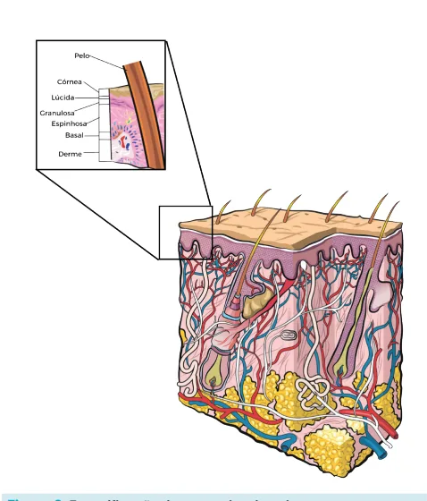
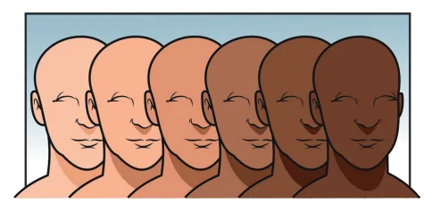
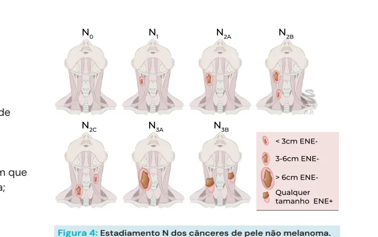
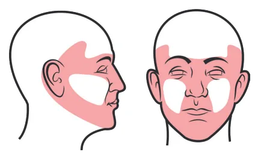

# Cabeça e Pescoço - Câncer de Pele Não Melanoma

<!-- page:1 -->

## CABEÇA E PESCOÇO: CÂNCER DE

## PELE NÃO MELANOMA

CEC do trato aerodigestivo superior CBC:

- Mais comum;

- Nódulo brilhante, perláceo, telangiectasia;

- Subtipos: Nodular e superficial (mais comuns e melhor prognóstico); Esclerodermiforme, basoescamoso e micronodular (pior prognóstico).

- Boa resposta à radioterapia.

## CONSIDERAÇÕES INICIAIS

- Neoplasia maligna mais comum na raça humana (tão comum, que é um câncer que não precisa notificar).

TIPOS MAIS COMUNS:

- Carcinoma espinocelular (CEC);

## Carcinoma basocelular (CBC)

- Melanoma.

## PRINCIPAIS CAUSAS

Fator hereditário:

- Cor de pele Escala de Fitzpatrick (escala de tonalidades da pele); Fototipo claro tem maior chance de câncer de pele.

- Histórico familiar.

Exposição solar:

- Raios UVA e UVB;

- Tempo de exposição e intensidade.

Outros fatores:

- Imunossupressão;

- Queimaduras (úlcera de Marjolin);

- Genética (síndrome de Gorlin, epidermólise bolhosa, epidermodisplasia verruciforme, xeroderma pigmentoso etc.);

- Bronzeamento artificial (aumenta em aproximadamente 6 vezes o risco).

Figura 1: Escala de Fitzpatrick - fototipos. Tipos de pele com base na sua reação à exposição solar. CEC:

- Lesão precursora (queratose actínica);

- Placa, pápula, ulceração;

- Subtipos acantolítico, adenoescamoso e desmoplásico (pior prognóstico).

Características comuns:

- Cirurgia é a melhor opção de tratamento (margens livres de 10 mm);

- Atenção com envolvimento de estruturas nobres da face.

## CAMADAS DA PELE

- O câncer de pele se origina da epiderme, de diferentes camadas.

- O carcinoma espinocelular (CEC) se origina da camada espinhosa.

- O carcinoma basocelular (CBC) se origina da camada basal.

Figura 2: Estratificação das camadas da pele.

- Tumor maligno mais comum;

- Incidência pouco precisa, porém existem estudos que estipulam a sua epidemiologia: 500-1000 casos/100.000 habitantes; 3,5 milhões/ano nos EUA; 35% em brancos.

- Influência da latitude: quanto mais próximo da linha do equador, maior risco → Austrália (40: 1) Finlândia.

---

<!-- page:2 -->

LOCALIZAÇÃO | Área de radioterapia prévia;

- 80% são na região cervicofacial; | Subtipos específicos: Esclerodermiforme,

- Ocorre apenas onde há pelos; metatípico, micronodular, misto infiltrativo.

- Localizações mais comuns: Nariz (1/3 dos casos); DIAGNÓSTICO Região malar;

- Geralmente dado por meio de biópsia incisional Pálpebras; da tumoração; Couro cabeludo;

- Se diagnosticado de forma precoce, 95% dos casos Sulco nasogeniano. são curados definitivamente no 1º tratamento;

- A investigação com exames de imagem são solicitados

CLASSIFICAÇÃO EM SUBTIPOS se houver suspeita clínica de invasão profunda: osso,

- Nodular (70-80% dos casos) cartilagem, parótida. Lesão elevada, nodulariforme, bordas bem definidas, avermelhada e brilhante, telangiectasias nas bordas, TRATAMENTO pode ser ulcerado.

- Curetagem;

- Superficial

- Crioterapia; Mesmas características do nodular, porém sem

- Eletrocoagulação;

aspecto de nódulo;

- Terapia fotodinâmica; Os subtipos nodular e superficial são os mais

- Quimioterapia tópica;

prevalentes e menos agressivos.

- Radioterapia;

- Esclerodermiforme;

- Excisão cirúrgica com margem de segurança →

- Metatípico (basoescamoso); abordagem mais comum e mais eficiente (tratamento

- Micronodular; de escolha).

- Esclerosante; Radioterapia

- Pigmentado;

- Está indicada principalmente nos seguintes casos:

- Adenoide. | Cirurgia não exequível (seja por condições locais ou sistêmicas);

FATORES DE PIOR PROGNÓSTICO | Margem comprometida em que reoperação

- Paciente jovem; não é opção;

- Áreas de fusão embrionária (sulco nasogeniano – área | Grandes ressecções ósseas e invasão de base de atividade celular mais intensa); do crânio.

- Áreas próximas a orifícios naturais (difícil realizar | Pacientes idosos frágeis ou com alto risco de óbito tratamento por falta de margem livre); na cirurgia.

- Recidiva; | Boa resposta do CBC à radioterapia.

- Subtipos esclerodermiforme, Terapia sistêmica basoescamoso e micronodular.

- Pode ser utilizada na impossibilidade de tratamento cirúrgico e radioterápico

FATORES DE RISCO:

- São opções:

- A localização é um fator importante em relação à | Inibidores da via Hedgehog probabilidade de recorrência e metastatização; → vismodegib, sonidegib;

- As áreas de alto risco de metástase incluem: | Imunoterapia inibidora de Área central da face; checkpoint → cemiplimab; Pálpebras; | Quimioterapia → carboplatina + paclitaxel; Sobrancelha; | Antifúngicos → itraconazol. Periórbita;

## CARCINOMA ESPINOCELULAR (CEC)

| Nariz; | Lábio-cutâneo e vermelhão; | Queixo; EPIDEMIOLOGIA: | Mandíbula;

- 20-30% dos tumores malignos de pele. Pré e pós-auricular;

- Incidência depende da latitude e da etnia (assim Orelha; como o CBC): Temporal

- Latitude: Genitália, mãos e pés. | Finlândia → 8/100.000 hab.

- Perceba que a cabeça, no geral, é uma área de alto | Austrália → 1.035/100.000 hab.

risco para metastatização!

- Etnia:

- Menos que 1-3% tem metástases cervicais; | Branca → 150 - 360/100.000 hab.

- Os fatores de alto risco para recorrência são: | Negra → 3 / 100.000 hab. Tamanho (a depender da localização); Bordas mal definidas; Imunossupressão;

---

<!-- page:3 -->

CARACTERÍSTICAS GERAIS DO CEC:

- Existe atual evolução no campo da imunoterapia

- Apresenta uma lesão precursora: queratose actínica; seguida de cirurgia em pacientes com CEC

- A taxa de metastatização linfática é maior que o localmente avançado.

CBC: aproximadamente 10%;

## COMPARAÇÃO CBC X CEC

- Apresenta-se normalmente como uma placa

- Apresenta-se normalmente como uma placa ou pápula;

- Na lesão firme, mais fixa e ulcerada: pensar em forma invasiva.

## FATORES DE ALTO RISCO

## PARA RECORRÊNCIA

- Zona “H” na face (imagem abaixo) → H de “high risk”;

- Imunossupressão;

- Radioterapia prévia;

- Local já operado;

- Bordas pouco definidas;

- Subtipos acantolítico, adenoescamoso, desmoplásico;

- Invasão > 4 mm;

- Invasão vascular ou perineural.

Figura 3: Zona “H” pintada em rosa (“high risk” - alto risco, em português).

## TRATAMENTO

- Principal: excisão cirúrgica.

- O esvaziamento cervical apenas terapêutico quando há metástase Lembrando que a taxa de metástase cervical é de aproximadamente 10%; Não se faz esvaziamento cervical eletivo de rotina para CEC ou CBC, pois estaria indicado se o risco fosse maior que 20%.

Radioterapia

- O CEC não é tão radiossensível quanto o CBC;

- Optada como tratamento primário nos casos não cirúrgicos;

- Optada como adjuvância em casos de: Metástase cervical; Margens comprometidas e impossibilidade de reabordagem cirúrgica; Invasão perineural.

Terapia sistêmica

- Assim como no CBC, indicada para os casos em que não há possibilidade de cirurgia ou radioterapia;

- São alternativas: Imunoterapia inibidora de checkpoint Quimioterapia → carboplatina + paclitaxel, agente único; Inibidores de EGFR → cetuximab; COMPARAÇÃO CBC X CEC

→ cemiplimab, pembrolizumab; Tabela 1: Características dos CBC e dos CEC

## CBC CEC

Ocorrência +++ comum Comum Queratose Lesão precursora Não há actínica Metástase linfonodal < 1-3% +- 10% Nódulo, Placa, pápula, Apresentação brilhante, ulceração.

telangiectasia.

## CONSIDERAÇÕES SOBRE O TRATAMENTO

## CIRÚRGICO

- Estadiamento T para o Câncer de pele não melanoma: T1: <2 cm; T2: 2 - 4 cm; T3: > 4 cm ou erosão óssea pequena ou invasão profunda subcutânea (SC); T4: Invasão de estruturas adjacentes T4a: Invasão grosseira de osso cortical / medular; T4b: Invasão de base de crânio.

- Estadiamento N para o Câncer de pele não melanoma (igual ao do CEC do trato aerodigestivo). N0: não há acometimento. N1: acomete 1 linfonodo ipsilateral à lesão de até 3 cm. N2a: 1 linfonodo ipsilateral à lesão entre 3-6 cm. N2b: ≥ 2 linfonodos de até 6 cm. N2c: linfonodo contralateral à lesão. N3a: linfonodo > 6 cm. N3b: vazamento extracapsular/ extranodal (ENE+).

Figura 4: Estadiamento N dos cânceres de pele não melanoma.

---

<!-- page:4 -->

TRATAMENTO CIRÚRGICO DO CBC E CEC - Tabela 2: Relação do Breslow com a margem mínima PRINCÍPIOS IDEAIS: necessária para ampliação

- Margens livres (≥ 10mm) → a fim de diminuir risco de recorrência.

Breslow Margem de ressecção In situ 0,5 a 1 cm

- Atenção com envolvimento de estruturas adjacentes:

- Atenção com envolvimento de estruturas adjacentes: Pode haver necessidade de exenteração de órbita ou ressecções ósseas, por exemplo; Abordagem multidisciplinar é essencial;

- Mesmo que pequena, a cirurgia em face geralmente é uma cirurgia de grande porte.

- Pesar o porte da cirurgia x qualidade de vida: Q considerar alternativas paliativas. S

## MELANOMA

- 15 a 25% dos melanomas ocorrem em cabeça e pescoço: Área de alta exposição solar e de maior concentração de melanócitos.

- Porém, os princípios são os mesmos para o corpo inteiro: Prezar pelas margens cirúrgicas, tendo-se em mente o resultado final da cirurgia! Atentar para debilidade funcional importante e estética. In situ 0,5 a 1 cm

≤ 1 mm (T1) 1 cm

> 1 a 2 mm (T2) 1 a 2 cm

> 2 mm (T3 e T4) 2 cm

QUANDO FAZER PESQUISA DE LINFONODO SENTINELA EM MELANOMA?

- Clinicamente negativo (cNO) para linfonodo metastático;

- Risco intermediário ou alto de metástases. Espessura > 0,8 mm; Ulceração; Invasão linfovascular;* > 1 mitose/mm² (principalmente em pacientes jovens).
