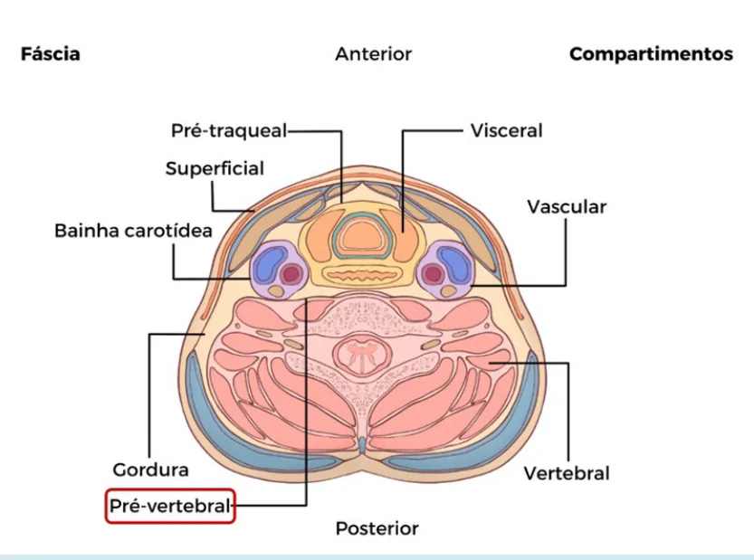
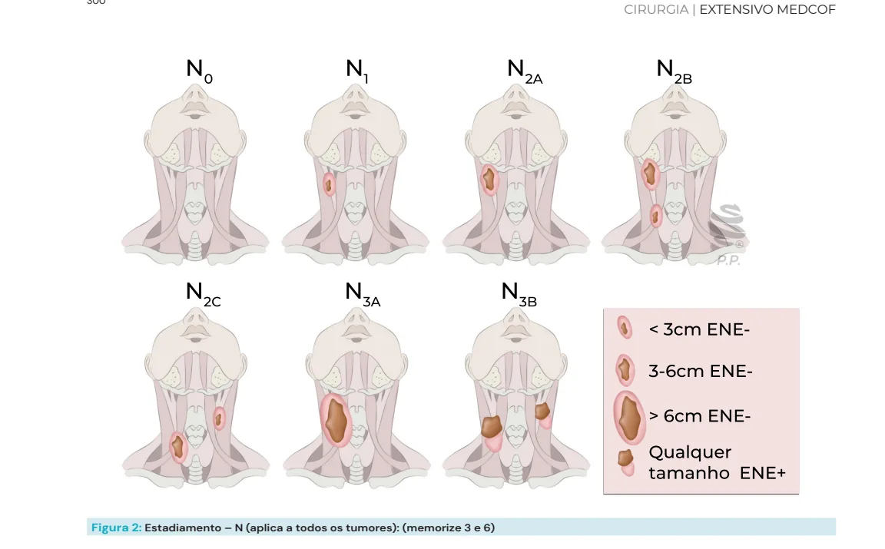
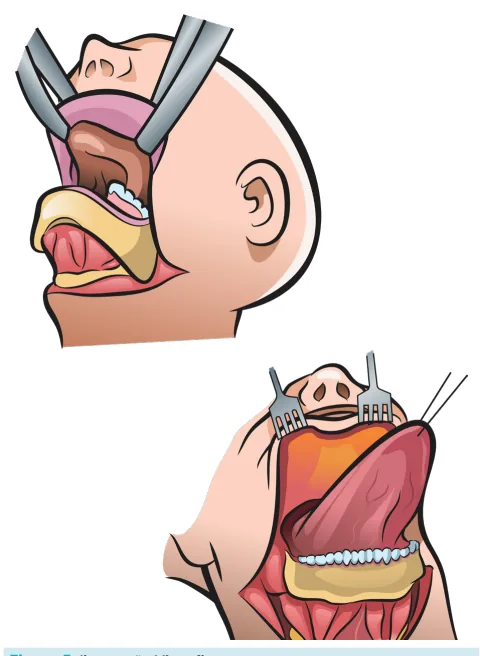
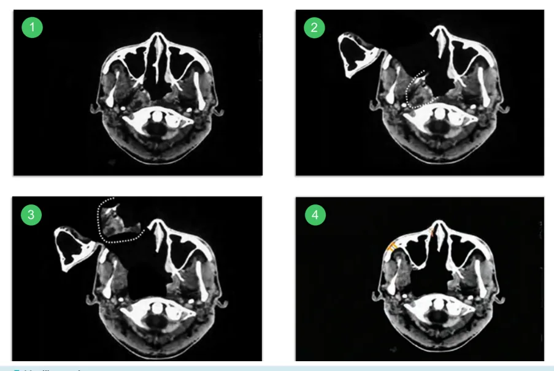
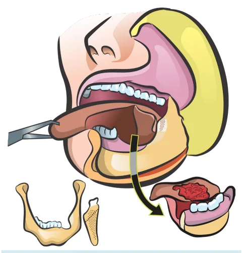
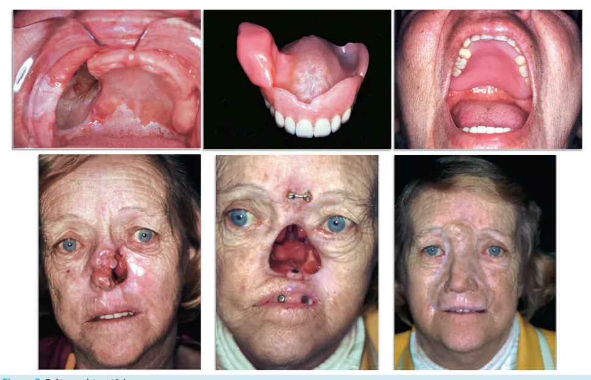

# Cabeça e Pescoço - CEC do Trato Aerodigestivo Superior - Conceitos Iniciais

<!-- page:1 -->

## Conceitos Iniciais

### Cancerização de Campo

- Mesmo fator de risco carcinogênico para toda a mucosa exposta.
- **2º tumor primário** → 2ª causa de morte (25–33%).
- Presente em **10–12%** em tabagistas.
- Incidência de **2–7% ao ano** após diagnóstico do primário.
- Investigação de outros primários obrigatória.
- **Rotina de investigação é diferente do estadiamento!**

## Epidemiologia e Fatores de Risco

### No Mundo — Câncer em Cabeça e Pescoço

- **900.000 casos e 400.000 mortes/ano**.
- **5,7%** mortalidade relacionada ao câncer.
- **90–95%** = CEC.
- **Homens > mulheres** (2:1 a 4:1).

### No Brasil

- Países em desenvolvimento: **67%** dos casos; **82%** de mortalidade.
- **Incidência**: 20/100.000 habitantes.

### Fatores de Risco

- **Tabagismo** (5–25x mais risco).
- **Etilismo** (efeito sinérgico).
- **Infecções virais**: HPV, EBV, HCV, HIV.
- Genética.
- Radiação.
- Noz de bétel.
- Ópio.
- Carência vitamínica.
- Doença periodontal, má higiene oral.
- Imunossupressão.
- Exposição ambiental e ocupacional.

## Apresentação Clínica

### Manifestações Clínicas Comuns

- **Lesão ulcerada**.
- **4 Ds**: **dispneia**, **disfagia**, **disfonia**, **dor**.
- **Massa cervical**.

### Em Casos Avançados

- Sangramento.
- Dor incontrolável.
- Síndrome consumptiva.
- Insuficiência respiratória.

---

<!-- page:2 -->

## Diagnóstico e Estadiamento

### Rotina CEC CCP (Rotina Propedêutica)

A rotina propedêutica que deve ser seguida no câncer de cabeça e pescoço:

- **Exame físico completo**: palpação cervical, oroscopia, laringoscopia com nasofibroscópio.
- **TC de face, pescoço e tórax com contraste**.
- **Endoscopia digestiva alta**.
- **Broncoscopia** (quando indicada).

**Observação**: A rotina de investigação é **diferente do estadiamento**! Esta é para pesquisa de segundo tumor primário.

### Diagnóstico

**Biópsia:**

- **Tumor primário** – incisional (é o primeiro método).

**Pesquisa viral:**

- **p16** (orofaringe) e/ou **EBV** (nasofaringe).
- Imuno-histoquímica/PCR.

**PAAF:**

- **Linfonodo cervical**.

**Critério clínico de suspeita:**

- **Ferida que não cicatriza/disfonia por > 14 dias** → investigar/biopsiar.

### Estadiamento — T (Todos os Tumores)

**Memorize T2 e T4:**

- **T1**: ≤ **2 cm**.
- **T2**: **2–4 cm**.
- **T3**: > **4 cm**.
- **T4**: invasão de estruturas adjacentes.
  - **T4a**: operável.
  - **T4b**: inoperável.

**Critérios de inoperabilidade (T4b):**

- Invasão de carótida comum ou interna.
- Invasão de fáscia pré-vertebral.
- Invasão de espaço mastigatório (trismo).
- Acometimento de base de crânio.
- Acometimento do mediastino.
- Necessidade de glossectomia total (língua fixa).
- Necessidade de exenteração bilateral de órbita.

### Estadiamento — N (Todos os Tumores)

**Memorize N3a (6 cm) e N3b (ENE+):**

- **N1**: único ipsilateral, ≤ **3 cm**.
- **N2a**: único ipsilateral, **3–6 cm**.
- **N2b**: múltiplos ipsilaterais, **3–6 cm**.
- **N2c**: contralateral, ≤ **6 cm**.
- **N3a**: > **6 cm**.
- **N3b**: **ENE+** (extravasamento extranodal).

*Figura 2: Estadiamento — N (aplica a todos os tumores).*

### Estratégia de Tratamento

*Figura 3: Estratégia de tratamento* (por estádio: precoce T1–T2 N0 vs avançado T4a/T4b).

---

<!-- page:3 -->

## Princípios do Tratamento

1. **Ressecção cirúrgica com margens livres**.
2. **Esvaziamento cervical** (eletivo ou terapêutico).
3. **RT/QT** (adjuvante ou como tratamento principal).
4. **Equipe multidisciplinar**.

### Decisão de Tratamento

- Decisão gira em torno de **prognóstico × morbidade**.
- **Não existe neoadjuvância** em CEC de cabeça e pescoço.

### Esvaziamento Cervical

**Terapêutico (N+):** **Esvaziamento radical ou modificado**.

**Eletivo (N0):** Depende do sítio anatômico e estadiamento local.

## Acessos Cirúrgicos

### Per Os (TORS)

- **Retirada da lesão pela boca**.
- **TORS**: ressecção transoral com auxílio de robô.
- Depende do sítio anatômico do tumor.

### Retalhos Locais

**Retalho de bochecha (cheek flap):**

- Pode ser realizado no lábio inferior ou superior.
- Incisão no lábio até o pescoço.

*Figura 4: Retalho de bochecha.*

**Retalho em viseira (visor flap):**

- Incisão em região cervical com exposição em direção cranial.

*Figura 5: Ilustração — visor flap.*

### Acessos Abertos

- **Composto → pull through** (faringotomia).
- **Maxillary swing**.
- **Cervicotomia em colar**.

*Figura 6: Composto → pull through.*

*Figura 7: Maxillary swing.*

### Tipos de Retalhos Gerais

- **Fechamento primário**.
- **Fechamento por 2ª intenção**.
- **Enxertia**.
- **Retalhos locais**.
- **Retalhos à distância**: pediculado × microcirúrgico.

---

<!-- page:4 -->

## Reconstrução

**Métodos de reconstrução:**

- **Placa/parafuso**: ruim se RT adjuvante.
- **Prótese obturatória**: boa para avaliar recorrência.

*Figura 8: Prótese obturatória.*

## Tratamento Adjuvante (Alto Risco de Recorrência Locorregional)

### Indicações de Radioterapia (RT)

- **T3/T4**.
- **Margens comprometidas (R1) ou exíguas** (< **5 mm**): quando a margem é comprometida, sempre que possível, ampliar cirurgicamente.
- **Invasão perineural ou vascular**.
- **N+** (2 ou + linfonodos).

### Indicações de Quimioterapia (QT)

- **Margens comprometidas**.
- **ENE+** (extravasamento extranodal).

---

<!-- page:5 -->

## Sítios Abordados Neste Material

- Nasofaringe.
- Orofaringe.
- Hipofaringe.
- Boca.
- Laringe.
- Lábio.
- Primário oculto.

*Figura 1: Compartimentos do pescoço.*

---

## Referências

Figura 1: Compartimentos do pescoço. DRAKE, Richard L.; VOGL, A. Wayne; MITCHELL, Adam W. M. *Gray — Anatomia Clínica para Estudantes*. 2. ed. Rio de Janeiro: Churchill & Livingstone, Elsevier, 2009. Imagem adaptada.

Figura 7: Maxillary swing. Acervo pessoal — Medcof — Dr. Felipe Magnabosco.

Figura 8: Prótese obturatória. Acervo pessoal — Medcof — Dr. Felipe Magnabosco.
