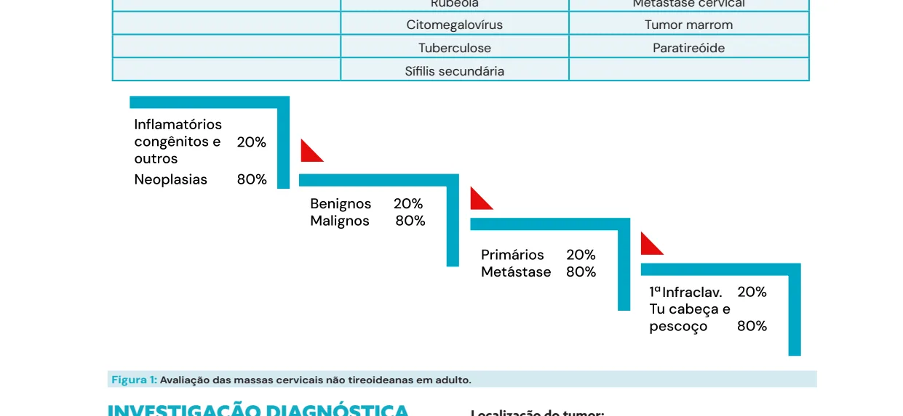
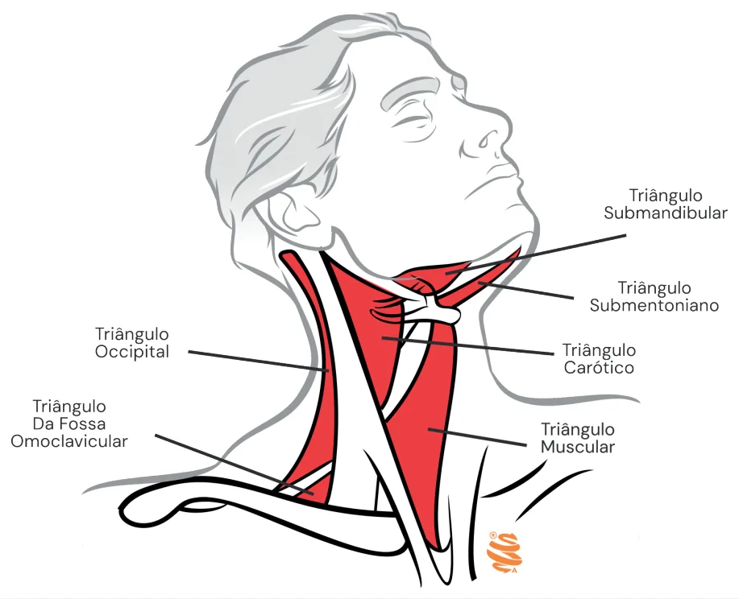
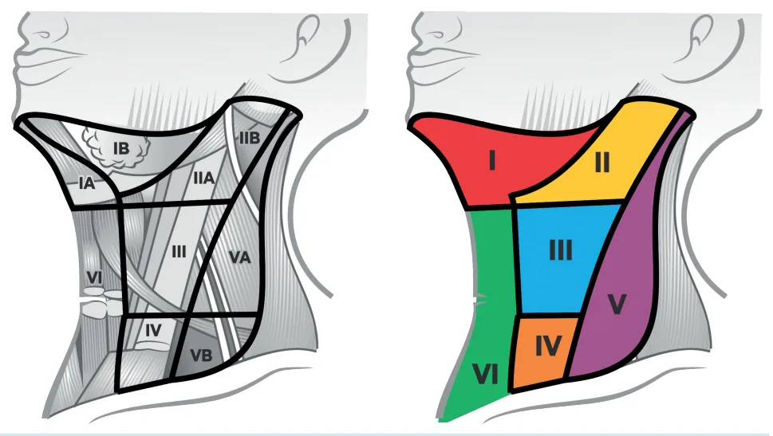
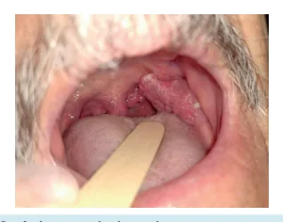

# Cabeça e Pescoço - Diagnósticos Diferenciais das Massas Cervicais

<!-- page:1 -->

## CABEÇA E PESCOÇO: DIAGNÓSTICOS

## DIFERENCIAIS DAS MASSAS CERVICAIS

Massas cervicais

## ANAMNESE

Idade 0-15 anos 15-40

1) Inflamatório/infeccioso Inflamatório

2) Congênitas Congê

3) Neoplasia Neop

## BIÓPSIAS B PAAF

- Método preferencial, guiada ou não por ultrassonografia (USG);

- Contraindicações: Lesões vasculares (ou suspeita), distúrbio de coagulação.

- Nã e completa

Sim Suspeita de m Investigação direcionada Imagem PAAF Não Diagnóstico? Sim Continuar investigação Pan-endoscopia Biópsia

## TUMORES CERVICAIS

- Achado comum nas práticas médicas como manifestação de doenças locais ou sistêmicas; 0 anos > 40 anos o/infeccioso Neoplasia ênitas Inflamatório/infeccioso plasia Congênitas

Biópsias abertas

- Indicação criteriosa - doença linfoproliferativa / tuberculose (TB);

- Piora prognóstica em alguns tipos de neoplasia ;

- Planejamento de incisões ;

- Sempre é a última opção.

Massa cervical ão Sinais de infecção? Sim malignidade? Terapia apropriada Não Resolução Medidas auxiliares seguimento Sim FIM Manejo adequado a aberta

- Dados importantes no raciocínio da diferenciação dos

| Faixa etária; | História clínica; | Exame físico.

---

<!-- page:2 -->

Tabela 1: Etiologia dos tumores cervicais.

## CONGÊNITAS INFLAMATÓRIAS NEOPLÁSICAS

Cisto do ducto tireoglosso Linfonodo reacional Tireiode Linfangioma Abscesso cervical Sarcoma Linfangioma Abscesso Costela cervical Toxopla Hemangioma H Cisto branquial Sialoa Cisto dermoide Monon Rub Citomeg Tuber Sífilis se Figura 1: Avaliação das massas cervicais não tireoideanas em adu

## INVESTIGAÇÃO DIAGNÓSTICA

A anamnese, exame físico e exames complementares, devem ter foco especial na abordagem dos diagnósticos diferenciais.

Tabela 2: Massas cervicais mais prevalentes conforme a idade do paciente. 0-15 anos 15-40 anos > 40 anos Inflamatório/ Inflamatório/ 1° Neoplasia infeccioso infeccioso Inflamatório/ 2° Congênitas Congênitas infeccioso 3° Neoplasia Neoplasia Congênitas Tempo de Evolução:

- < 30 dias – Doença aguda: Inflamatória/infecciosa;

- 1 a 4 meses – Doença subaguda: Neoplasia;

- > 4 meses – Doença crônica: Congênitas, Neoplásicas benignas ou inflamatórias. o cervical Sarcoma asmose Laringe adenite Linfoma nucleose Paraganglioma béola Metástase cervical galovírus Tumor marrom rculose Paratireóide ecundária ulto.

HIV Glândulas salivares Infraclav. Localização do tumor:

- Linha média (região anterior): pode estar relacionado com processo inflamatório/infeccioso;

- Triângulos cervicais;

- Altas ou baixas;

- Níveis cervicais: correspondem às cadeias linfonodais principais de drenagem linfática (importante no estadiamento neoplásico).

Triângulos cervicais:

- Tr. Occipital: Região posterior – entre M.

Esternocleidomastóideo e M. Trapézio;

- Tr. da Fossa Omoclavicular: Supraclavicular – entre o

M. Omo-hioide e a clavicula;

- Tr. Submandibular: Abaixo da mandíbula – entre o M.

Digástrico ventres anterior e posterior;

- Tr. Submentoniano: Abaixo do mento – entre os ventres anteriores do M. Digástrico;

- Tr. Carótico: Localização das Aa. Carótidas – entre M.

Esternocleidomastóideo e o M. Omo-hioide;

- Tr. Muscular: Entre o m. Esterno-hióideo e o M.

Omo-hióideo.

---

<!-- page:3 -->

Figura 2: Imagem das divisões do pescoço em triângulos (em vermelho). Níveis cervicais

- Grupamentos linfonodais do pescoço organizados.

Figura 3: Imagem da divisão do pescoço em níveis cervicais.

---

<!-- page:4 -->

## EXAMES COMPLEMENTARES

Aspecto da lesão:

- Cística: geralmente são doenças congênitas;

- Fibroelástica: inflamatórias; Exames laboratoriais:

- Endurecida: neoplasias benignas ou malignas;

- Sorologias:

- Endurecida e fixa: neoplasia maligna. | Toxoplasmose;

- Endurecida e fixa: neoplasia maligna.

Sinais e sintomas associados:

- Febre, rash cutâneo, dor: Inflamatórias

- Disfagia, dispneia, disfonia, otalgia: Neoplasia;

- Perda de peso: Neoplasia avançada;

- Sintomas de compressão (extrínseca): Congênitas ou neoplasias benignas.

Antecedentes pessoais e familiares:

- Tabagismo e etilismo;

- História familiar de câncer;

- HPV/HIV;

- História de radioterapia prévia.

Dados epidemiológicos:

- Contatos familiares;

- Contato com animais;

- Viagens.

## EXAME FÍSICO

- Exame físico geral;

- Orofaringoscopia;

- Laringoscopia;

- Palpação cervical;

- Importante pesquisar: Sítio primário dos tumores; Número de linfonodos comprometidos; Cadeias linfonodais comprometidas; Aspecto da lesão: Cística, Fibroelástica, Endurecida,

Dor, Tamanho, Mobilidade, Forma. Figura 4: Orofaringoscopia de paciente. FLUXOGRAMAS PARA INVESTIGAÇ Móvel à deglutição Central Fixo á deglutição Figura 5: Fluxograma de investigação de massa cervical de localiz | Toxoplasmose;

| Rubéola; | EBV; | CMV; | HIV;

- Sífilis.

- Testes cutâneos: PPD;

- Hemograma;

- Cultura e antibiograma.

Exames de imagem:

- Ultrassonografia (USG);

- Tomografia computadorizada;

- Ressonância magnética;

- Angiografia.

Endoscopias:

- Nasofibrolaringoscopia;

- Broncoscopia;

- Endoscopia digestiva alta.

Biópsias

- Core Biopsy: Punção por agulha grossa.

- PAAF: Punção por agulha fina. Método preferencial, guiado ou não por USG; Contraindicações: Lesões vasculares (ou suspeita), distúrbios de coagulação; Não avalia histologia (apenas citologia) - pode ou não ser conclusivo; Não prejudica o prognóstico.

Biópsia aberta (incisional ou excisional):

- Indicação deve ser criteriosa: suspeita de doença linfoproliferativa ou tuberculose ganglionar (precisam de histologia para diagnóstico);

- Piora do prognóstico em alguns tipos de neoplasia;

- Necessita de planejamento das incisões: preferir incisão onde fará uma cervicotomia futura, caso seja indicada;

- Sempre é a última opção.

- Verificar Figura 5 partes moles zação central.

ÇÃO DE MASSA CERVICAL Tireoglosso Sistrunk Tireoide/Paratireoide Linfonodo Tumor de Cisto dermoide

---

<!-- page:5 -->

Cisto Braquial Cístico Linfangioma CEC orofaringe HPV+ Linfonodo Cístico Lateral Fibroelástico Linfonodo Sarcoma Endurecido Tumor desmoide Pulsátil Paraganglioma Figura 6: Fluxograma de investigação de massa cervical de localizaçã Nã Sim Suspeita de m Investigação direcionada e completa Imagem PAAF Não Diagnóstico? Sim Continuar investigação Pan-endoscopia Biópsia Figura 7: Fluxograma de manejo da investigação de massas cervicais.

## REFERÊNCIAS

Figura 4: Orofaringoscopia de paciente. Acervo pessoal. HPV+ o Metástase Tireoide (papilífero) Reacional Sorologias CEC trato aerodigestivo Metástase Tireoide Linfoma Glândulas salivares ão lateral.

Massa cervical ão Sinais de infecção? Sim malignidade? Terapia apropriada Não Resolução Medidas auxiliares seguimento Sim FIM Manejo adequado a aberta .
