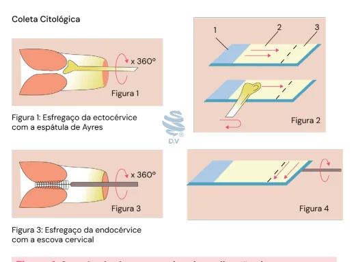
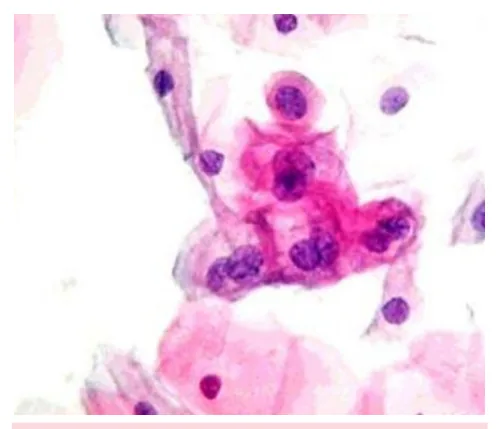
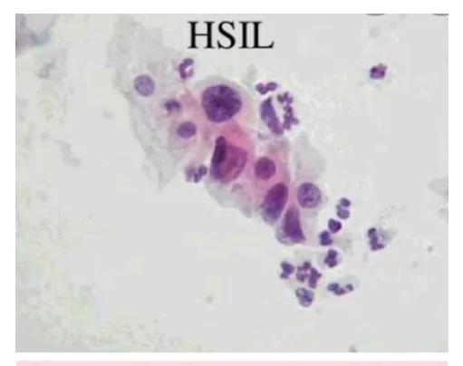
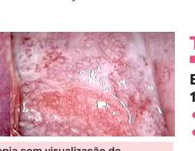
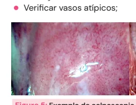

# Câncer de Colo de Útero - Rastreamento

<!-- page:1 -->

CÂNCER DE COLO DE ÚTERO RASTREAMENTO Alterações colpocitológicas

- Recomendação: rastreamento do câncer de colo Investigação e condutas uterino com pesquisa de DNA-HPV oncogênico a

- Exame físico sempre; Se pesquisa negativa para HPV, repetir apenas

partir dos 25 anos (até 64 anos); | Se lesão macroscópica → realizar biópsia;

- LSIL → repetir a colpocitologia oncótica em após 5 anos; 6 meses (se mantida a alteração na nova Interromper aos ≥60 anos se último exame colpocitologia oncótica → colposcopia);

mostrou pesquisa negativa.

- ASCUS:

- Colpocitologia oncótica é indicada em caso de | se idade inferior a 30 anos → repetir necessidade de citologia reflexa; colpocitologia oncótica em 12 meses;

- Lesões antes dos 25 anos têm grande potencial | se idade superior a 30 anos → repetir de regressão espontânea → adotar condutas mais colpocitologia oncótica em 6 meses; Risco de não regredir aumenta um pouco dos oncótica → colposcopia.

tolerantes em mulheres mais jovens; | se mantida a alteração na nova colpocitologia 25-30 anos;

- Indicar colposcopia direto se: Chance menor de regressão após os 30 anos. | HSIL;

Estratégia “Ver e tratar” | AIS;

- Critérios: | AGC; Colposcopia satisfatória; | ASC-H. Achados colposcópicos compatíveis com citologia (LIAG ou ASC-H com achados maiores); Sem suspeita de invasão.

## RASTREAMENTO DO CÂNCER DE

| Pessoa com HIV com linfócitos CD4 abaixo de 200

## COLO UTERINO células/ mm³ = manter o rastreamento semestral

enquanto a contagem de linfócitos TCD4 estiver

- População-alvo: pesquisa de DNA-HPV para pessoas abaixo de 200 células/mm³.

com colo uterino entre 25 e 64 anos que já iniciaram

## COLPOCITOLOGIA ONCÓTICA

vida sexual com penetração vaginal;

- Periodicidade: Se HPV negativo = repetir em 5 anos. COLETA

- A ideia é coletar células endocervicais, escamosas e

COLPOCITOLOGIA ONCÓTICA EM metaplásicas (zona de transformação); SITUAÇÕES ESPECIAIS

- A coleta deve ser realizada com a espátula de Ayres e

Gestantes com uma escova endocervical ou citobrush;

- Mesma de não gestantes;

- Verificar Figura 1 na próxima página

- Se a gestante for elegível para o rastreio, o exame é Passo a passo realizado na primeira consulta de pré-natal.

- Encaixe a extremidade da espátula no orifício

Mulheres submetidas a histerectomia total externo do colo e gire 360°. Em sequência, introduza

- Dispensadas do screening; o citobrush no orifício interno do colo e gire 2

- Exceção: casos em que o motivo da histerectomia ou 3 voltas;

tenha sido neoplasia intraepitelial cervical (NIC) ou

- A exposição das células na lâmina: passe os dois lados câncer de colo. da espátula na lâmina, gire a escova cervical sobre a

Imunossuprimidas lâmina de forma a distribuir as células por ela;

- Pessoas vivendo com HIV, transplantadas,

- Aplique o fixador na lâmina com o material, usuárias crônicas de corticoide ou em ou a deposite em um frasco com álcool. Iniciar o rastreamento após o início de atividade

tratamento quimioterápico: Identificar devidamente;

- Sangue ou secreções vaginais podem dificultar a sexual, semestralmente no primeiro ano e leitura da lâmina.

anualmente após, mantido até não haver o agente imunossupressor (em casos possíveis);

---

<!-- page:2 -->

- O Calendário vacinal inclui a vacinação contra HPV População geral: meninas e meninos de 9-14 anos de idade em dose única;. Pessoas vivendo com HIV ou imunossuprimidas:

(quadrivalente) que cobre os tipos 6, 11, 16 e 18; q Figura 1: Sequência demonstrativa da realização da colpocitologia oncótica: Figura 1 - avaliação da ectocérvice com a espátula de Ayres; Figuras 2 e 4 - depósito em lâmina dos materiais coletados. Figura 3 - coleta de material da endocérvice com a escova cervical. 3

## TIPOS DE CÉLULAS QUE PODEM

## ESTAR PRESENTES R

- Mucosa da ectocérvice e da vagina: epitélio escamoso C estratificado (EEE);

- O EEE possui camadas, são elas: basal, parabasal, A intermediária e superficial;

- A camada basal ou germinativa é responsável

(em condições fisiológicas) pela regeneração (replicação celular);

- Outras camadas representam apenas diferentes estágios na maturação das células basais;

- Esse epitélio é influenciado pelos hormônios ovarianos, atingindo a sua máxima maturação sob a ação dos estrógenos.

Amostras de CCO satisfatória

- Células em quantidade representativa, bem distribuídas, fixadas na lâmina e bem coradas;

- Representação de 3 epitélios: Escamoso; Glandular; Metaplásico (JEC).

Colpocitologia oncótica insatisfatória

- Deve-se repetir o exame em 6-12 semanas, corrigindo o fator insatisfatório. Tratar e repetir a citologia em intervalo menor; Se atrofia for o problema → estrogenizar Cervicite → tratar (ex.: tricomoníase).

(estriol tópico); Se somente epitélio escamoso

- Repetir exame em 1 ano; R

- Pode ocorrer em paciente pós-menopausa, puérperas. C

## PREVENÇÃO: VACINA

## CONTRA HPV

- A infecção persistente pelos tipos oncogênicos é fator de risco necessário para câncer de colo de útero; >90% dos casos de câncer de colo de útero estão relacionados ao HPV. | Pessoas vivendo com HIV ou imunossuprimidas:

9-45 anos de idade, 3 doses. Atualizações das recomendações do Ministério da Saúde quanto à vacina para o HPV:

1. Vítimas de abuso sexual de 15 a 45 anos que não

tenham tomado a vacina HPV ou estejam com esquema incompleto, com esquema de 2 doses para as pessoas de 9 a 14 anos e 3 doses para as pessoas de 15 a 45 anos;

2. Usuários de Profilaxia Pré-Exposição (PrEP) de HIV,

com idade de 15 a 45 anos, que não tenham tomado a vacina HPV ou estejam com esquema incompleto (de acordo com esquema preconizado para idade ou situação especial), com esquema de 3 doses;

3. Pacientes portadores de Papilomatose Respiratória

Recorrente/PRR a partir de 2 anos de idade.

## RESULTADOS DA

## COLPOCITOLOGIA ONCÓTICA ACHADOS

- Inflamação sem identificação de agente: Alterações celulares epiteliais por agentes mecânicos, térmicos ou químicos, acidez vaginal sobre o epitélio glandular; Se cervicite clínica, ou corrimento vaginal patológico, há indicação de tratamento. Apesar de não ser próprio para isso, o exame de citologia por vezes é capaz de sugerir uma infecção.

- Metaplasia escamosa imatura (reparativa);

- Atrofia com inflamação: Fisiológico na pós-menopausa, pós-parto e lactação → estrogenizar se houver dificuldade diagnóstica no laudo; Usa-se o estriol vaginal por 21 dias, espera-se uma semana e é feita a recoleta.

- Microbiologia: Lactobacillus sp, Cocos, outros bacilos

- Células endometriais fora do período menstrual ou menopausa: investigar cavidade endometrial; Avaliar presença de fatores de risco para câncer de endométrio, história de sangramento uterino anormal e imagem do endométrio no USG TV. Se necessário, prosseguir com aspirador endometrial ou histeroscopia.

RESULTADOS ANORMAIS DA COLPOCITOLOGIA ONCÓTICA ASC-US (atipia de células escamosas, indeterminada)

- Alterações intermediárias entre a inflamação e as lesões intraepiteliais.

- Possíveis causas: corrimento vaginal, cervicite, atrofia genital;

- Corrigir fatores antes da nova coleta;

- Após 2 exames normais, retornar ao rastreamento habitual;

---

<!-- page:3 -->

| Se novo exame alterado = encaminhar para colposcopia; | Exceção se paciente imunossuprimida, para qual o primeiro resultado alterado indica-se colposcopia.

ASC-H (atipia de células escamosas, não podendo afastar ASC-H (atipia de células escamosas, não podendo afastar lesão de alto grau)

- Direto para colposcopia com biópsia se necessário;

- “Ver e tratar” é aceitável;

- Se colposcopia normal e satisfatória: repetir colpocitologia oncótica colposcopia e a colposcopia em 6 meses.

AGC ou AGC-H (atipia de células glandulares).

- Além da colposcopia com biópsia, acrescenta-se a citologia endocervical e a ultrassonografia transvaginal pacientes com idade superior a 35 anos, fatores de risco para câncer de endométrio ou SUA.

(USG TV) para investigação do endométrio em Investigar o endométrio! LSIL (Lesão intraepitelial de baixo grau)

- Alto potencial de regressão, principalmente abaixo dos

30 anos;

- Colposcopia se persistência;

- “Ver e tratar” é inaceitável;

- 2 exames consecutivos normais = rastreamento normal;

- Imunossuprimidas deve ser encaminhadas para colposcopia no primeiro exame alterado;

- *Gestantes: não realizar colposcopia → novo CCO 90 dias pós parto.

Figura 2: Imagem de exame citológico sugestivo de lesão intraepitelial de baixo grau: note as células com citoplasma mais amplo e cariomegalia (aumento do núcleo das células).

HSIL (Lesão intraepitelial de alto grau)

- Encaminhamento para a colposcopia diante de primeiro resultado citológico alterado;

- Aceitável “ver e tratar” no ato da colposcopia;

- Se a colposcopia for satisfatória e normal → buscar lesões vaginais e investigar canal endocervical. r intraepitelial de alto grau: note a hipercromasia e o aumento da relação núcleo/citoplasma.

Figura 3: Imagem de exame citológico sugestivo de lesão Adenocarcinoma in situ (AIS) ou CA invasor

- Conização mesmo se a biópsia for negativa;

s

- Se AIS no anatomopatológico e margens comprometidas na conização → nova conização para excluir doença invasiva; Se prole completa: histerectomia simples + citologia anual por 5 anos (segue, mesmo feito histerectomia); Se prole incompleta: seguimento citológico e colposcópico semestral por 2 anos.

Lesão macroscópica = biópsia. Não fazer citologia em paciente com lesão macroscópica, partir direto para análise histológica que é o que dá o diagnóstico de câncer

## RESUMINDO

- ASCUS, ASC-H e AGC são atipias: ASCUS tem baixo risco, ASC-H e AGC preocupam (encaminhar para colposcopia);

- LSIL, HSIL e AIS são lesões verdadeiras: LSIL tem risco menor de progressão;

- Até 25 anos de idade → alta chance de regressão, maior morbidade do tratamento, logo, adotar condutas mais permissivas;

- Após os 30 anos, maior risco de progressão!

ASCUS e LSIL, “as boazinhas”

- Olhar a idade da paciente.

- ASCUS: Até 25 = repetir em 3 anos; Entre 25 e 29 anos = repetir em 12 meses; >= 30 anos = repetir em 6 meses.

- LSIL: <25 anos = repetir em 3 anos; >25 anos = repetir em 6 meses.

ASC-H, AGC, HSIL e AIS “as malvadas”

- Colposcopia direto em todos os casos.

- AGC = lembrar de investigar o endométrio, bem como no caso do AIS.

---

<!-- page:4 -->

## COLPOSCOPIA

## “VER E TRATAR”

- Significa a exérese da zona de transformação (por

CAF) na primeira consulta; CAF) na primeira consulta;

- Reduz o tempo de tratamento e evita a perda de seguimento.

Critérios para fazer

- Idade superior aos 25 anos;

- Citologia oncótica com lesão de alto grau

(HSIL e ASC-H);

- Achados maiores na colposcopia;

- Lesão restrita a colo e sem suspeita de invasão;

- JEC visível que não ultrapassa o primeiro centímetro do canal endocervical.

## OBJETIVOS DA COLPOSCOPIA

- Selecionar o local mais adequado para a biópsia;

- Figura 4: Exemplos da visualização do colo uterino através do colposcópio. À direita, observa-se a presença de ectopia. L

- A localização da junção escamocolunar (JEC) é variável. Pode estar localizada na ectocérvice e ser completamente visível, ou na endocérvice e não ser mais visível; L

- Colposcopia insatisfatória é quando não é possível ver a JEC completamente.

- PASSOS L

- Remoção do muco cervical com solução salina;

- Verificar vasos atípicos;

- Figura 5: Exemplo de colposcopia com visualização de vascularização atípica.

- Aplicação de ácido acético 3-5% (coagula proteínas intracelulares); C

- Em células que replicam mais rápido, as lesões ficam acetobrancas, já que possuem uma densidade nuclear anormal;

- Aplicação de Lugol: amarelo em células displásicas;

- Biopsiar áreas suspeitas. C

- - - Figura 6: Exame de colposcopia após a aplicação de ácido acético. Note a reação acetobranca na posição entre as 5 e 7 horas.

Figura 7: Exame de colposcopia após a aplicação de Lugol: as áreas em amarelo (iodo-negativas) indicam o lugar em que será realizada a biópisa (hipocaptação de iodo) - Teste de Schiller Positivo

## ACHADOS COLPOSCÓPICOS

- É importante caracterizar onde está a lesão (se está na zona de transformação ou fora, local – em “horas”);

- Lesões são classificadas em graus;

Lesões de Grau 1 (achados menores)

- São normalmente compatíveis com ASC-US e LSIL;

- Epitélio acetobranco tênue;

- Borda irregular ou geográfica;

- Mosaico fino ou pontilhado fino.

Lesões de Grau 2 (achados maiores)

- Epitélio acetobranco denso;

- Mosaico grosseiro;

- Atipia vascular.

Lesões de Grau não especificados

- Suspeita de invasão, como atipia vascular, vasos frágeis, superfície irregular, lesão macroscópica.

## TRATAMENTOS EXCISIONAIS

## EXÉRESE DE ZONA DE TRANSFORMAÇÃO TIPO

## 1 OU 2

- Cirurgia de alta frequência (CAF);

- Excisão eletrocirúrgica por alça sob visualização colposcópica direta;

- Pode ser feita ambulatorialmente com anestesia local no momento da colposcopia.

## CONIZAÇÃO

- Realizada em centro cirúrgico, com bisturi células), o que é melhor para a avaliação das margens.

(normalmente lâmina fria porque não danifica as CRITÉRIOS

- Zona de transformação do tipo 3 (ZT tipo 3);

- Ausência de achados colposcópicos;

- Paciente com baixo limiar de dor;

- Uso de anticoagulantes.

---

<!-- page:5 -->

## REFERÊNCIAS

Figura 1: Sequência demonstrativa da realização da colpocitologia oncótica: Figura 1 - avaliação da ectocérvice com a espátula de Ayres; Figuras 2 e 4 - depósito em lâmina Figura 8: Ilustração das zonas de transformação tipos 1, 2 e 3.

## RESULTADO ANATOMOPATOLÓGICO

## E CONDUTAS

## NEOPLASIA INTRAEPITELIAL CERVICAL DO

## TIPO 1 (NIC I)

- Relacionada à infecção transitória pelo HPV, alta chance de regressão, especialmente antes dos

30 anos;

- Diante desse achado (por biópsia), deve-se repetir citologia e colposcopia em 6 meses;

- Se o anatomopatológico for de uma EZT com margens livres ou comprometidas, deve-se refazer citologia

6-12 meses, e fazer anualmente por 5 anos.

## NEOPLASIA INTRAEPITELIAL CERVICAL DOS

## TIPOS 2 E 3 (NIC II E III)

- São lesões de alto grau e se comportam de maneira semelhante;

- Assintomáticas e curáveis na maioria dos casos, existe chance de regressão espontânea;

- Biópsia: indicar a exérese de zona de transformação (EZT), caso a paciente tenha uma colposcopia satisfatória: Se margens livres ou NIC I → citologia 6-12 meses e anual após até completar 5 anos; Se margens comprometidas por NIC II ou III, devese realizar o seguimento citológico e colposcópico semestral por 2 anos e citologia anual por 5 anos.

- Se a paciente tiver prole constituída, pode ser proposta uma histerectomia; Se margens comprometidas: citologia e colposcopia semestral por 2 anos, anual até completar 5 anos, trienal após; Há risco aumentado de desenvolver a neoplasia intraepitelial vaginal (NIVA). dos materiais coletados. Figura 3 - coleta de material da endocérvice com a escova cervical.

Acervo de imagens Medcof. Figura 2: Imagem de exame citológico sugestivo de lesão intraepitelial de baixo grau: note as células com citoplasma mais amplo e cariomegalia (aumento do núcleo das células).

MORAIS, J. A.; CARVALHO, L. A. et al. Análise das citologias cérvico-vaginal em um laboratório particular no município de Igatu-CE. Disponível em:

https://sis.unileao.edu.br/uploads/3/POSGRADUACAO/P__S201.pdf. Acesso em: 15 jun. 2025. Figura 3: Imagem de exame citológico sugestivo de lesão intraepitelial de alto grau: note a hipercromasia e o aumento da relação núcleo citoplasma.

MORAIS, J. A.; CARVALHO, L. A. et al. Análise das citologias cérvico-vaginal em um laboratório particular no município de Igatu-CE. Disponível em:

https://sis.unileao.edu.br/uploads/3/POSGRADUACAO/P__S201.pdf. Acesso em: 15 jun. 2025. Figura 4: Exemplos da visualização do colo uterino através do colposcópio. À direita, observa-se a presença de ectopia.

BASU, P.; SANKARANARAYAN, R. Atlas de colposcopia – princípios e prática: IARC CancerBase No. 13 [Internet]. Lyon, França: Agência Internacional de Pesquisa sobre o Câncer, 2017. Disponível em: https:// screening.iarc.fr/atlascolpo.php.

Figura 5: Exemplo de colposcopia com visualização de vascularização atípica. BASU, P.; SANKARANARAYAN, R. Atlas de colposcopia – princípios e prática: IARC CancerBase No. 13 [Internet]. Lyon, França: Agência Internacional de Pesquisa sobre o Câncer, 2017. Disponível em: https:// screening.iarc.fr/atlascolpo.php.

Figura 6: Exame de colposcopia após a aplicação de ácido acético. Note a reação acetobranca na posição entre as 5 e 7 horas.

BASU, P.; SANKARANARAYAN, R. Atlas de colposcopia – princípios e prática: IARC CancerBase No. 13 [Internet]. Lyon, França: Agência Internacional de Pesquisa sobre o Câncer, 2017. Disponível em: https:// screening.iarc.fr/atlascolpo.php.

Figura 7: Exame de colposcopia após a aplicação de Lugol: as áreas em amarelo (iodo-negativas) indicam o lugar em que será realizada a biópisa (hipocaptação de iodo) - Teste de Schiller Positivo.

BASU, P.; SANKARANARAYAN, R. Atlas de colposcopia – princípios e prática: IARC CancerBase No. 13 [Internet]. Lyon, França: Agência Internacional de Pesquisa sobre o Câncer, 2017. Disponível em: https:// screening.iarc.fr/atlascolpo.php.

Figura 8: Ilustração das zonas de transformação tipos 1, 2 e 3. a Adaptado de MINISTÉRIO DA SAÚDE. Diretrizes brasileiras para o rastreamento de câncer de colo do útero. 2016.
