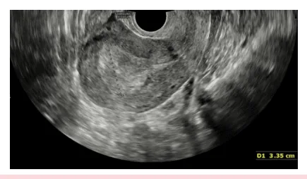
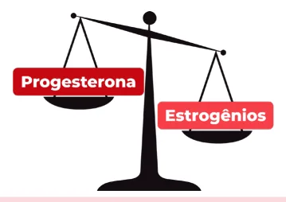
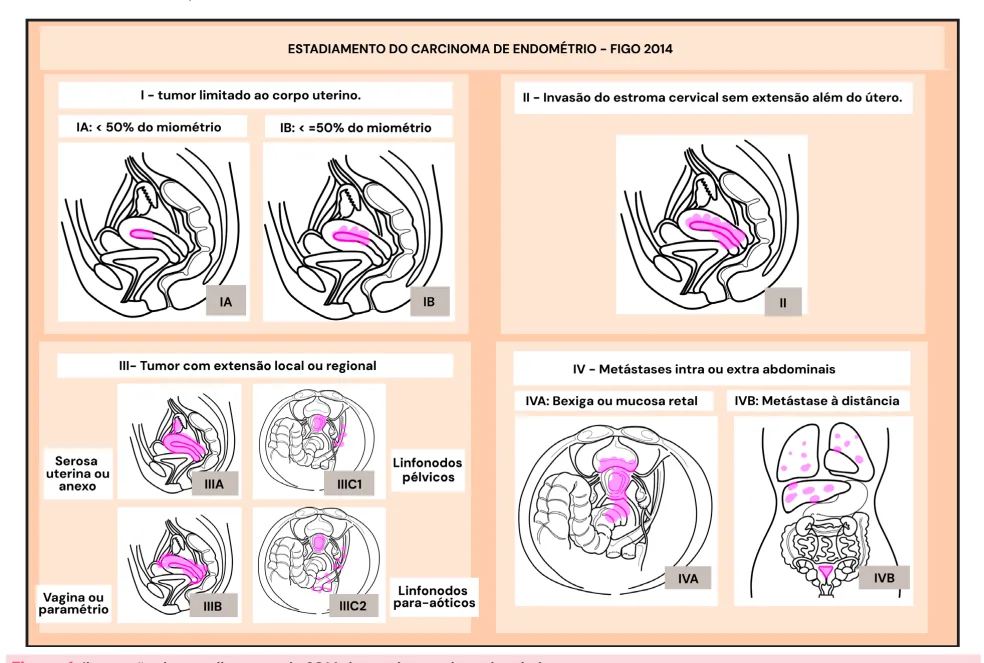

# Câncer de Endométrio

<!-- page:1 -->

- O principal sintoma é o sangramento uterino pós-menopausa;

- O tipo histológico mais comum é o adenocarcinoma endometrioide;

- Tratamento padrão: Histerectomia com salpingooforectomia bilateral (HT + SOB).

- Linfadenectomia - prescindir da linfadenectomia se: Baixo grau; Subtipo endometrioide; Menor do que 2 cm;

## INFORMAÇÕES GERAIS PANORAMA

- Câncer ginecológico mais comum nos países desenvolvidos;

- 5º câncer mais comum em mulheres - risco cumulativo de 1% aos 75 anos;

- 14% dos casos ocorrem em mulheres pré-menopausa;

- Incidência vem aumentando pela associação com obesidade, síndrome metabólica e envelhecimento da população;

- Adenocarcinoma endometrioide do endométrio é o tipo histológico mais comum;

- Diagnóstico costuma ser precoce pois dá sintoma

(sangramento uterino anormal ou pós-menopausa);

## HIPERPLASIA ENDOMETRIAL E CÂNCER

- Verificar Tabela 1

## ETIOLOGIA

- O principal fator para desenvolver uma hiperplasia atípica é o desbalanço entre progesterona e estrogênio (anovulação crônica, obesidade, infertilidade);

- Progesterona = protege o endométrio (estabiliza).

Tabela 1: Classificação WHO para hiperplasia endometrial Termo Sinônimos Mudanç HE beniga; HE simples;

Baixo níve Hiperplasia sem atipia não Hiperplasia somática atípica; HE simples sem sem atipia dispersas c atipia; He complexa sem coloração H atipias.

Muitas alter típicas do C estão HE complexa atípica; HE HA/NIE incluindo i atípica simples; NIE. microssatéli PAX2, mutaç e CTNNB1 | Estadiamento IA.

- Adjuvância com radioterapia (RT) + braquiterapia → se risco intermediário-alto ou alto;

- Tratamento conservador → progestagênio em alta dose: Paciente sem prole constituída, tipo histológico de baixo grau, endometrioide, e restrito Reavaliação em 3-6 meses; Realizar tratamento definitivo após constituir a prola.

: ao endométrio; CLASSIFICAÇÃO Tabela 2: Antiga classificação do câncer de endométrio Tumores Tipo I Tipo II 2, 3 e histologia não 1, endometrioide adenocarcinoma (carcinoma endometrioide mucinoso, Grau/ Histologia (induzidos por carcinoma estrogênio e são seroso, precedidos por carcinoma de NIE) células claras), aneuploide, mutação TP 53 Prevalência 80% 20% Prognóstico Favorável Desfavorável CLASSIFICAÇÃO MOLECULAR DO CÂNCER DE ENDOMÉTRIO

- Padrões de imuno-histoquímica trazem informações mais precisas em relação ao prognóstico;

Coexistência Progressão ças genéticas com carcinoma para carcinoma endometrial invasor invasor el de mutações as em glândulas < 1% RR: 1,01 a 1,03.

com morfologia na HE, sem alterações. rações genéticas CE endometrioide o presentes, instabilidade de 25% a 33%* 59%** RR: 14 a 45.

ites, inativação de ção de PTEN, KRAS (betacatenina).

---

<!-- page:2 -->

- 0s 4 subgrupos moleculares, do pior ao melhor CRITÉRIOS PARA AVALIAÇÃO HISTOLÓGICA prognóstico, são: DO TECIDO ENDOMETRIAL POLE;

- Pré menopausa: MSI hipermutado; | >35ª com fatores de risco; Baixo número de cópias (endometriode); | Sangramento uterino anormal refratário a Baixo número de cópias (endometriode); Alto número de cópias (seroso-like).

## FATORES DE RISCO E PROTEÇÃO

- B

## FATORES DE RISCO

- Iatrogênico: TH somente com estrogênio;

- Tumores produtores de estrogênio;

- Perimenopausa: FSH alto e diminuição da reserva ovariana → ciclos anovulatórios;

- Obesidade → resistência insulínica → redução sérica de SHBG → aromatização de andrógenos para estrógenos, maior risco de anovulação crônica;

- SOP: resistência insulínica + excesso de estrogênios + ciclos anovulatórios. P

- - Figura 1: Desbalanço entre progesterona e estrogênio.

## FATORES DE PROTEÇÃO

- Multiparidade: Efeitos da progesterona no endométrio;

- Uso de anticoncepcionais orais combinados - Reduz o risco em 50% se uso > 12 meses; C

- Tabagismo – Efeito antiestrogênico;

- Dispositivo intrauterino de levonorgestrel (DIU-LNG);

- TH combinada.

## DIAGNÓSTICO

- Sangramento uterino anormal;

- Ultrassom transvaginal: espessura e irregularidade Q endometrial (hipertrofia focal, pólipo);

- Valores de corte de normalidade: Pós menopausa: < 4-5 mm; Pós menopausa + TRH: < 8-9 mm; Se assintomática: < 10 mm.

- E

(

- Figura 2: Ultrassonografia transvaginal com identificação de espessamento endometrial de 3,35 cm. | Sangramento uterino anormal refratário a tratamento clínico; Uso de tamoxifeno + sangramento uterino anormal.

- Pós menopausa → qualquer sangramento genital.

Biópsia endometrial

- Histeroscopia com biópsia - melhor exame;

- Ambulatorial: Pipelle, aspiração endometrial, cureta de Novak;

- Contraindicações: estenose cervical, limiar baixo de dor, alto risco de neoplasia;

- Cirúrgico: Curetagem uterina fracionada.

## ESTADIAMENTO

## PRÉ-CIRÚRGICO

- Ressonância magnética de pelve;

- Tomografia computadorizada de tórax e abdome superior (avaliação de carcinomatose, metástases parenquimatosas ou linfonodomegalias);

- PET-CT (dispensável).

Figura 3: Carcinoma endometrioide estágio IB visto pela ressonância magnética ponderada em T2. CIRURGIA DE ESTADIAMENTO

- Exploração do abdome e pelve - biópsia/excisão de lesões suspeitas, palpação de linfonodos, coleta de líquido ascítico;

- Histerectomia total abdominal + salpingooforectomia bilateral;

- Congelação da peça - grau histológico, invasão do colo, profundidade da invasão miometrial;

Quando não precisa fazer linfadenectomia?

- Critérios de Mayo → prescindir da linfadenectomia: Tumor de baixo grau; Endometrioide; < 2 cm; FIGO IA;

- Biópsia de linfonodo sentinela;

- Omentectomia se adenocarcinoma seroso.

## ESTADIAMENTO ANTIGO FIGO 2014

## (ATUALIZADO EM 2023)

- Verificar Figura 4 na próxima página

---

<!-- page:3 -->

Figura 4: Ilustração do estadiamento de 2014 do carcinoma de en Tabela 3: Estadiamento novo FIGO: atualizado em 2023.

Estádio I Confinado ao útero. Doença limitada ao útero; bom prognóstico. IA1 Tipo histológico não agressivo, limitado ao endométrio ou pólipo IA IA2 Tipo histológico não agressivo, envolvendo <50% miométrio, sem IAL.

IA3 CA endometrioide de baixo-grau, limitado ao útero/ovário. Tipos histológicos não agressivos, com IB >50% invasão miometrial, sem IAL.

Tipos histológicos agressivos, limitados IC ao endométrio ou pólipo. Invasão do estroma cervical sem extensão extrauterina ou IAL significativa Estádio II ou tipo histológico agressivo com invasão miometrial.

Invasão do estroma cervical de tipo IIA histológico não agressivo. IVL significativa de tipo histológico não IIB agressivo.

Tipo histológico agressivo com invasão IIC miometrial. ndométrio. Disseminação local ou regional do tumor Estádio III de qualquer tipo histológico.

Invasão da serosa uterina, anexos ou ambos. IIIA IIIA1 Disseminação para ovário ou tubas. IIIA2 Serosa uterina.

Disseminação para vagina, paramétrios IIIB ou peritônio pélvico. IIIB1 Vagina ou paramétrio. IIIB2 Peritônio pélvico Comprometimento de linfonodos pélvicos ou para-aórticos.

IIIC IIIC1 LN pélvicos (IIIC2i Micrometastases / IIIC2ii Macrometastases). IIIC2 LN paraaórticos (IIIC2i Micrometastases / IIIC2ii Macrometastases).

Disseminação para mucosa de bexiga ou Estádio IV intestino ou metástases a distância. Invasão de mucosa de bexiga ou IVA intestino.

IVB Metástases em peritônio além da pelve. Metástases a distância (LN além de IVC vasos renais, pulmões, fígado, SNC, ossos).

---

<!-- page:4 -->

ESTRATIFICAÇÃO DE RISCO RISCO INTERMEDIÁRIO Histerectomia total abdominal + salpingooforectomia Tabela 4: Estratificação de risco do câncer de endométrio bilateral

- Linfadenectomia pélvica e para-aórtica: indicado para risco invasão linfovascular (-).

Grupos de o estadiamento, mas não aumenta sobrevida. Grupos de Características CE endometriode estádio I, grau 1 ou 2, A Baixo menos de 50% de invasão miometrial, H b CE endometrioide, grau 1 ou 2, mais de

- Intermediário 50% de invasão miometrial, invasão linfovascular (-).

CE endometrioide estádio I, grau 3, menos de 50% de invasão miometrial, independentemente do status de Intermediário T invasão linfovascular. CE endometrioide, alto grau 1 ou 2, invasão linfovascular (+), independentemente do grau de invasão miometrial.

- CE endometrioide estádio I, grau 3,

- 50% ou mais de invasão miometrial invasão linfovascular. CE estádio II. CE endometrioide estádio III, sem doença

Alto independentemente do status de

- residual.

CE estádio III com doença residual e CE Avançado estádio IVa. Metastático CE estádio IVb.

## TRATAMENTO

BAIXO RISCO A Histerectomia total abdominal + salpingooforectomia bilateral

- Se desejo reprodutivo e tumor de baixo grau, M endometrioide, sem infiltração miometrial, m tratamento conservador: Progesterona em altas doses ou SIU-LNG, seguindo com USGTV + amostra endometrial A semestralmente. Se regredir = libera a paciente para gestação após 6-12 meses.

- Tratamento cirúrgico após prole constituída ou falha do tratamento clínico. o estadiamento, mas não aumenta sobrevida.

ALTO RISCO Histerectomia total abdominal + salpingooforectomia bilateral

- Linfadenectomia pélvica e para-aórtica;

- *Histerectomia radical, se acometimento do colo uterino;

- *Citorredução completa se doença avançada.

## TERAPIA ADJUVANTE

- Depende do estadiamento, grau e tamanho do tumor, idade e status da paciente;

- Quimioterapia neoadjuvante ou adjuvante;

- Radioterapia: paciente com alto risco cirúrgico, tumor inoperável, paliação de sintomas;

- RDT (radioterapia) + BQT (braquiterapia) adjuvante:

Risco intermediário-alto e alto;

- Radioterapia adjuvante não é necessária para carcinoma endometrioide de baixo risco!

## REFERÊNCIAS

Figura 1: Desbalanço entre progesterona e estrogênio. Acervo de imagens Medcof. Figura 2: Ultrassonografia transvaginal com identificação de espessamento endometrial de 3,35 cm.

Acervo pessoal Dra. Marilia Bertolazzi Figura 3: Carcinoma endometrioide estágio IB visto pela ressonância magnética ponderada em T2.

MORICE, P. et al. Endometrial cancer. Lancet, v. 387, n. 10023, p. 1094–1108, mar. 2016. DOI: 10.1016/S0140-6736(15)00130-0.

Figura 4: Ilustração do estadiamento do carcinoma de endométrio Acervo de imagens Medcof.
