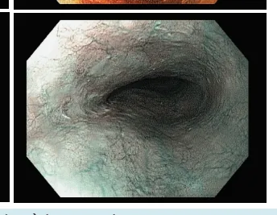
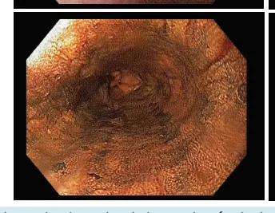
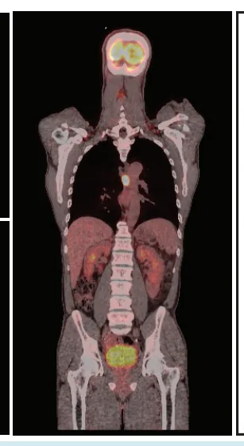
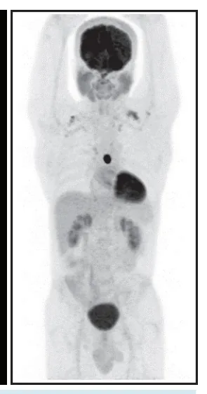
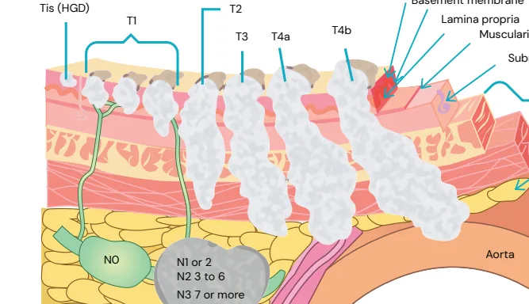
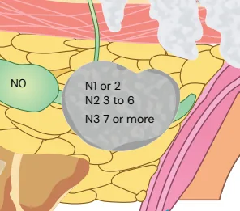
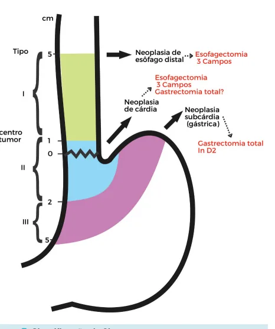

# Câncer de Esôfago

<!-- page:1 -->

Esôfago (CIR) Câncer de Esôfago CE Tabagismo; Etilismo Fatores de Risco quentes; HPV dos sub Tilo Sintomas Disfag Diagnóstico Diferencial Acalásia EDA com cromosc Diagnóstico suspeitas = Io TC Pescoço, Tórax EcoEDA (precoce- ava linfonodos Estadiamento PET-CT (identificação Laringoscopia + Bro invasão t TIPOS DE ESOFAGECTOMIA

- Esofagectomia em Três Campos (McKeown)

- Esofagectomia Transhiatal - Anastomose Cervical

(mais fístula, mas risco de mediastinite é menor

- Esofagectomia Transtorácica - Ivor – Lewis:

anastomose intratorácica (risco de mediastinite) TRATAMENTO

- Restrito à mucosa (T1a) - ESD

- Restrito a submucosa (T1b) - Esofagectomia upfront

- T3/T4 ou N+ - Neoadjuvância + Cirurgia

## INTRODUÇÃO E CONCEITOS

- Tumores de esôfago: CEC, adenocarcinoma, GIST, leiom

- CEC são tumores mais proximais, adenocarcinomas são ou subcárdicos) suspeitas = Io linfonodos traqu EC Adenocarcinoma o; Ingesta de bebidas btipos 16 e 18; Acalásia; DRGE; Uso de bifosfonados;

Câncer de Esôfago CE Tabagismo; Etilismo Fatores de Risco quentes; HPV dos sub Tilo Sintomas Disfa Diagnóstico Diferencial Acalás EDA com cromosco Diagnóstico TC Pescoço, Tórax EcoEDA (precoce- ava Estadiamento PET-CT (identificação Laringoscopia + Bronco ose;

gia abrupta, perda ponderal, melena, HDA a, Estenose péptica, Divertículo, Membrana copia (lugol) - Áreas EDA odonegativas TC Pescoço, Tórax, Abdome e x, Abdome e pelve pelve aliação profundidade e EcoEDA (precoce- avaliação s regionais)

profundidade e linfonodos o de metástase oculta) regionais) oncoscopia (avaliar PET-CT (identificação de traqueia)

metástase oculta)

- CEC - Protocolo Cross - QRT

- Adenocarcinoma - Quimioterapia ou

QRT neoadjuvante

- Tumores irressecáveis – Quimio-radioterapia definitiva (QRT) Ou Qt paliativa

- Irressecável: Invasão aorta, via aérea e coluna vertebral

- Metástase a distância ou Linfonodomegalia t não regional miossarcoma.

o tumores mais distais (5cm distais do esôfago, TEG EC Adenocarcinoma o; Ingesta de bebidas btipos 16 e 18; Acalásia; DRGE; Uso de bifosfonados;

ose; agia abrupta, perda ponderal, melena, HDA sia, Estenose péptica, Divertículo, Membrana opia (lugol) - Áreas EDA odonegativas TC Pescoço, Tórax, Abdome e x, Abdome e pelve pelve aliação profundidade e EcoEDA (precoce- avaliação s regionais)

profundidade e linfonodos o de metástase oculta) regionais) oscopia (avaliar invasão PET-CT (identificação de ueia)

metástase oculta)

---

<!-- page:2 -->

## ESTADIAMENTO

- CEC de esôfago que invadem traqueia, coluna ou aorta são tumores irressecáveis

- EDA com cromoscopia com lugol

- TNM Local de biópsia: borda da lesão para ver transição | T1: invade até submucosa entre epitélio normal e epitélio escamoso do tumor | T2: invasão até muscular própria Áreas iodo negativas: alto metabolismo glicolítico | T3- invasão até adventícia com suspeita de para tumores precoces | T4a- estruturas ressecáveis por exemplo pleura

- TC pescoço, tórax, abdome e pelve | T4b- estruturas não ressecáveis Se TC TAP sem evidência de metástase, prosseguir | N- linfonodo negativo com PET-CT | N+ linfonodo acometido Metástase do fígado: lesões hipoatenuantes | M0- sem metástase a distância (carcinomatose,

- Laringotraqueobroncoscopia: metástase hepática, metástase pulmonar) Risco aumentado de tumores do trato aerodigestivo | M1- com metástase a distância. Cancerização de campo: uma vez que tem CEC de esôfago tem chance aumentada de CEC em toda cavidade oral, orofaringe e via aérea.

(cabeça pescoço, pulmão, traqueia) Figura 1: Endoscopia com visualização de lesão ulcerada, grande, friável, com sangramento ativo ocupando 30% da luz do esôfago com resultado de biópsia de CEC de esôfago Figura 2: Cromoscopia com lugol com área iodo negativas (mais claras), áreas suspeitas para tumores precoces de esôfago, principalmente CEC

---

<!-- page:3 -->

Figura 3: Laringotraqueobroncoscopia com traqueia normal, regular, sem invasões grosseiras Figura 4: Exame de PET-CT com evidência de acometimento de linfonodos mediastinais M1 M2 M3 SM1 SM1 SM3 Epithelium Lamina propria Muscularis mucosa Submucosa Figura 5: Estadiamento local

---

<!-- page:4 -->

Epithelium Basement membrane Tis (HGD) T2 T1 Lamina propria T3 T4a T4b Muscularis mucosae T3 T4a N0 N1 or 2 N2 3 to 6 N3 7 or more M1 Pleura Figura 6: Estadiamento T

## TRATAMENTO

## TUMORES RESSECÁVEIS INICIAIS

- 1. Restrito à mucosa (T1a) e sem Linfonodomegalias (N0):

Tratamento endoscópico.

- Diagnóstico padrão ouro (T): IPCL (Intrapapillary capillary loop) → EDA magnificação + NBI. Alternativa:

EUS (USG endoscópico). CRITÉRIOS DE RESSECÇÃO ENDOSCÓPICA O

1. Bem diferenciado N

2. Restrito à mucosa (T1a) N

3. Ausência de invasão linfovascular e perineural

- Opções:

- EMR (“Endoscopic mucosal resection”= mucosectomia)

- ESD (“Endoscopic submucosal dissection”= dissecção submucosa)

Indicações relativas (expandidas):

- M3 (MM) ou SM1 Sm <200 micras (CEC) ou <500 micras (adenoCa)

2. Restrito à submucosa (T1bN0)

Esofagectomia upfront (upfront = sem neoadjuvância prévia) Obs.: T2N0 -> avaliação individualizada (esofagectomia upfront ou neoadjuvância)

## TUMORES IRRESSECÁVEIS

QUIMIO-RADIOTERAPIA, QUIMIOTERAPIA PALIATIVA A OU QRT DEFINITIVA p

1. Metástase a distância n

2. Linfonodomegalia não regional t

3. Invasão da aorta, via aérea e coluna vertebral m

c m Muscularis mucosae Submucosa Muscularis propria Periesophageal tissue Aorta

- Uso de próteses para tratamento de fístulas

(principalmente esofago-traqueal) e disfagia

- Não há intuito de operar paciente após, mesmo que o tumor desapareça após QRT definitiva.

- Pode ser feito esofagectomia de resgate quando se ganha plano de dissecção após QRT definitiva, mas discutível caso a caso.

## OUTROS TUMORES RESSECÁVEIS (T3/4A OU

## N+)

## NEOADJUVÂNCIA

- Protocolo CROSS: Normalmente indicada em CEC

(responde melhor à RT com QT radiossensibilizante).

- Carboplatina + paclitaxel + 41,4 Gy (5 semanas) com cirurgia 5-7 semanas após tratamento

- Esquema FLOT: (QT neoadjuvante). Indicada para adenocarcinoma de TEG, podendo também ser usado

Protocolo CROSS

- Após neoadjuvância são repetidos exames de estadiamento (TC, EDA, PET-CT) e reavalia resposta:

Regressão de doença → indicação de esofagectomia em 3 campos (esôfago cervical, torácico e abdominal)

com linfadenectomia em 2 campos (torácica e abdominal) e reconstrução tubo gástrico. Obs.: no Japão se faz linfadenectomia em 3 campos (cervical, torácica e abdominal)

A esofagectomia é indicada mesmo se resposta completa pós neoadjuvância, (NÃO existe watchful waiting como no no CA de cólon), exceto se paciente baixa performance, tumor irressecável, em que a QT e RT é definitiva e possui maior dose de radiação e não se planeja fazer uma cirurgia curativa, no máximo uma cirurgia de resgate para melhora de qualidade de vida).

---

<!-- page:5 -->

## CLASSIFICAÇÃO DE

## ADENOCARCINOMA DE TEG

## (CLASSIFICAÇÃO DE SIEWERT)

Figura 7: Classificação de Siewert

## TIPOS DE ESOFAGECTOMIA

Esofagectomia em Três Campos (McKeown)

- Toracotomia direita + Laparotomia supraumbilical por videolaparoscopia.

+ Anastomose cervical (Incisão cervical esquerda). Hoje em dia faz-se o acesso torácico e abdominal Esofagectomia Transhiatal - Anastomose Cervical

- Não abre o tórax do paciente, faz-se por laparotomia e videolaparoscopia com dissecção de todo esôfago mediastinal com anastomose cervical com tubo gástrico. Muito feito antigamente devido à menor morbidade por não precisar de toracotomia.

Desvantagem: linfadenectomia prejudicada (não consegue fazer supracarinal). Esofagectomia Transtorácica - Ivor – Lewis

- Laparotomia + toracotomia direita + anastomose intratorácica.

## ANASTOMOSE CERVICAL X INTRATORÁCICA

Cervical:

- Mais segura, mais superficial com drenagem ao meio externo mais facilmente.

- apesar de maior risco de formação de fístula

(menos vascularização).

- Fístula menos grave (menor risco de mediastinite)

Intratorácica:

- Menos fístula, porém maior chance de gravidade cervical e intratorácica apresentam taxas de mortalidade semelhantes! (CLASSIFICAÇÃO DE SIEWERT)

OBS: para algumas metanálises, as anastomoses

- Tipo I: adenocarcinoma esofágico. Epicentro até 1cm da TEG →Esofagectomia em 3 campos

- Tipo II: adenocarcinoma de Cárdia (TEG). Epicentro em 3 campos/ Gastrectomia total?

1cm acima da TEG até 2cm abaixo → Esofagectomia

- Tipo III: adenocarcinoma subcárdico (câncer gástrico).

Epicentro 2-5cm abaixo da TEG → Gastrectomia total com linfadenectomia a D2

- Entre 5-10% pacientes com Siewert II podem ter metástase de linfonodos mediastinais inferiores, logo esofagectomia em três campos mais benéfica pois retira mais linfonodos do mediastino inferior

- Verificar Figura 7

COMPLICAÇÕES PÓSESOFAGECTOMIA Fístula

- 5-7PO, dor, taquicardia, dreno com saliva.

- Pode deglutir azul de metileno com saída no dreno

- Risco: mediastinite

- Paciente instável → reoperação com lavagem de cavidade e drenagem

- Paciente estável → azul de metileno, EED ou TC pescoço, tórax e abdome com administração de contraste iodado para estudo da fístula (fístula limitada já drenada deixar em jejum, dieta pela SNE,

ATB podendo introduzir ou não vácuo endoscópico

- aumenta taxa de cicatrização da fístula e clearance bacteriano.

- Fístula não bloqueada → reabordagem, lavagem, jejum, drenagem, ATB largo espectro, vácuo endoscópico.

- Quando fístula devido a anastomose pequena podese fazer dilatação endoscópica

Respiratórias (pneumonia, TEP, broncoespasmo, SDRA…) Paralisia de corda vocal

- Lesão do nervo laríngeo recorrente

## REFERÊNCIAS

Figura 1:: Endoscopia com visualização de lesão ulcerada, grande, friável, com sangramento ativo ocupando 30% da luz do esôfago com resultado de biópsia de CEC de esôfago.

www.endoscopiaterapeutica.com.br Figura 2: Cromoscopia com lugol com área iodo negativas (mais claras), áreas suspeitas para tumores precoces de esôfago, principalmente CEC.

www.endoscopiaterapeutica.com.br Figura 3: Laringotraqueobroncoscopia com traqueia normal, regular, sem invasões grosseiras.

www.endoscopiaterapeutica.com.br Figura 4: Exame de PET-CT com evidência de acometimento de linfonodos mediastinais Acervo pessoal Medcof

